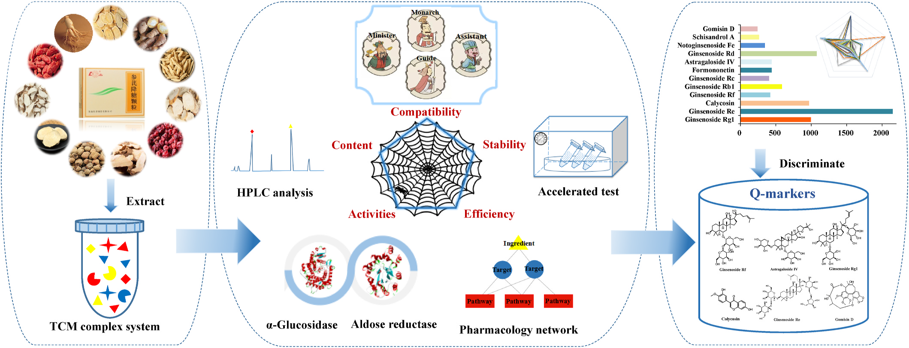
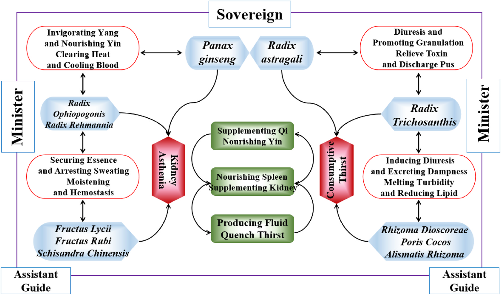
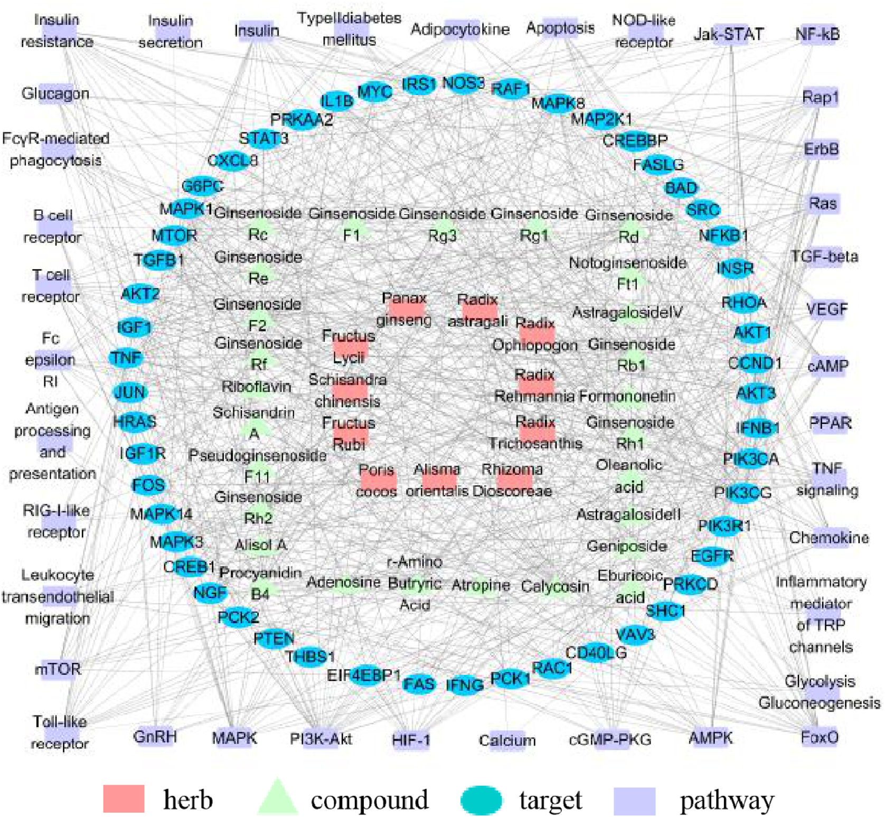
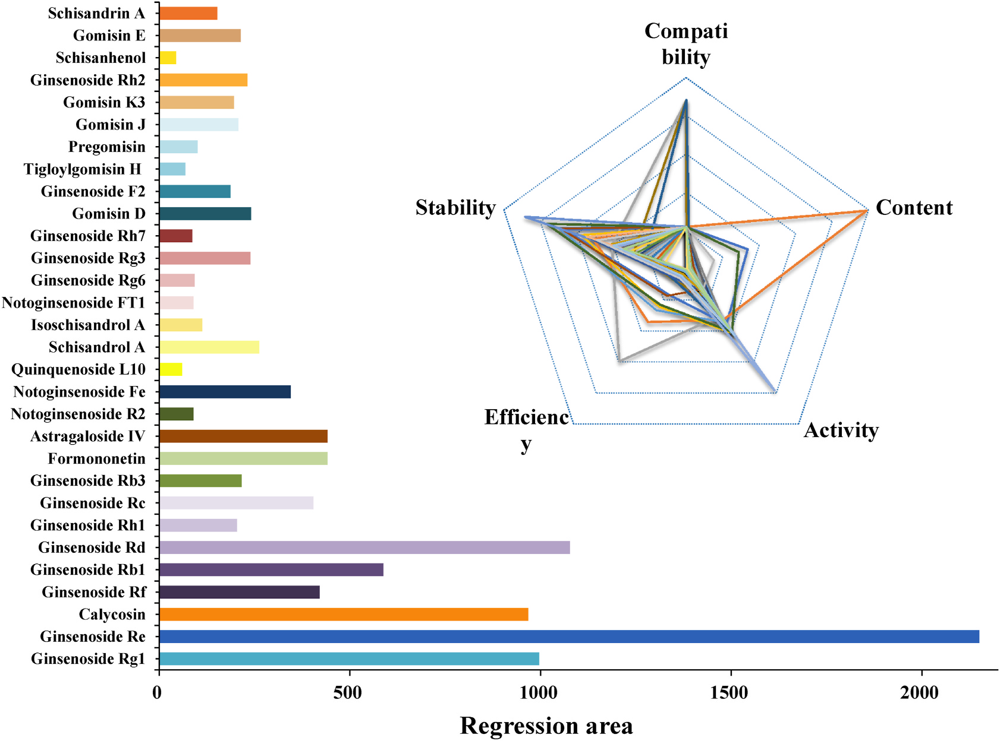
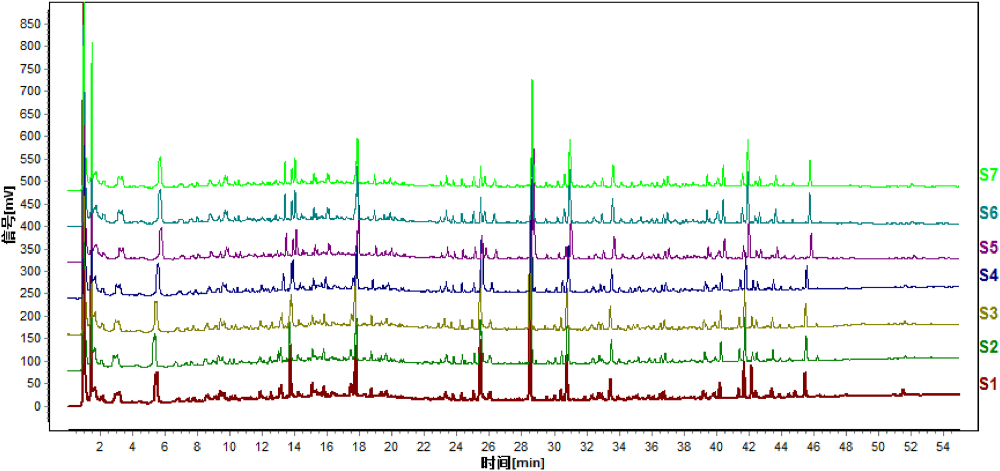
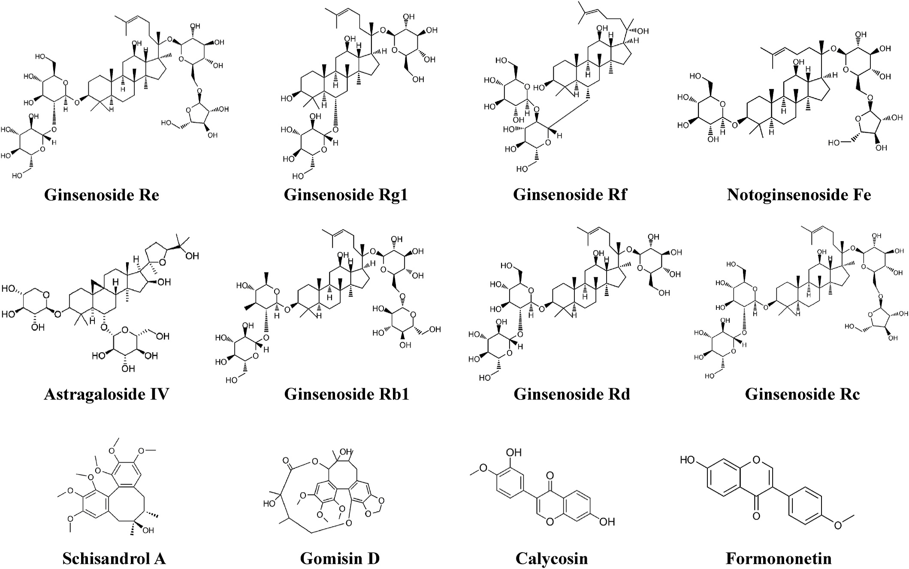

<!-- 方針: ほぼ全訳＋必要に応じた補足。原文構成に沿って訳出。「> 補足:」は訳者注。 -->

## 書誌情報

- 原題: An integrated approach to discriminate the quality markers of Traditional Chinese medicine preparation based on multi-dimensional characteristic network: Shenqi Jiangtang Granule as a case
- 著者: Hui Zhang, Ruoyu Chen, Cong Xu, Guimin Zhang, Yongxia Guan, Qun Feng, Jingchun Yao, Jizhong Yan（浙江工業大学薬学院／中薬ジェネリック製造技術国家重点実験室・魯南製薬集団, 中国）
- 掲載: *Journal of Ethnopharmacology* 278 (2021) 114277. https://doi.org/10.1016/j.jep.2021.114277
- インパクトファクター: **5.4**（*Journal of Ethnopharmacology*, JCR 2024 / Clarivate）
- 受理経過: 受領 2021-03-25 / 改訂 2021-05-23 / 採録 2021-05-30 / オンライン公開 2021-06-02

> 補足: SJG = 参耆降糖顆粒（Shenqi Jiangtang Granule）。Q-marker = 品質マーカー（quality marker、品質と薬効を結びつける指標成分）。DM = 糖尿病、DN = 糖尿病性腎症。本論文は実験＋計算（in silico）を組み合わせた研究論文。

## 要旨（Abstract）

**背景:** 漢方（TCM）は複雑であるため、現行の品質評価は臨床効果と結びつけにくい。参耆降糖顆粒(SJG)は2型糖尿病(DM)とその合併症の治療薬として実証された古典的漢方処方だが、その治療効果の物質的基盤は不明確である。

**目的:** 本研究は、TCMの品質管理のために、多次元特性ネットワークに基づいて品質マーカー(Q-marker)を判別する統合的手法を提案する。

**方法:** 多次元特性ネットワークを「蜘蛛の巣(Spider-web)」モデルで構築し、候補成分の「配合(compatibility)−含量(content)−活性(activity)−効能(efficiency)−安定性(stability)」を包括的に統合した。活性次元はSJGのα-グルコシダーゼおよびアルドース還元酵素に対する阻害活性で評価した。効能次元は統合薬理プラットフォームに基づき、成分と糖尿病性腎症(DN)の標的経路との関連性で評価した。各次元を多変量統計解析で定量化し、候補成分の回帰面積をネットワーク上に構築。最終的に回帰面積で候補成分を総合的に順位付けした。

**結果:** 有効な血糖降下活性をもつ計30種の化合物を潜在的Q-markerとして同定した。データ解析から、活性・効能・含量の3次元が特性ネットワークの回帰面積に大きく寄与した。これらのうち ginsenoside Re, ginsenoside Rd, ginsenoside Rg1, calycosin, ginsenoside Rb1, formononetin, astragaloside IV, ginsenoside Rf, ginsenoside Rc, notoginsenoside Fe, schisandrol A, gomisin D が候補Q-markerとして抽出された。

**結論:** 配合・含量・活性・効能・安定性を統合した多次元特性ネットワークは、TCM処方の潜在的Q-markerの判別に有効である。人参・黄耆・五味子に由来する12の候補成分がSJGの定性評価用Q-markerとして選定されうる。

## 1. 序論（Introduction）

漢方(TCM)は数千年にわたり疾病治療に用いられ、その品質は臨床効果の基盤である。複数生薬からなる処方が臨床での一般的な投与形態であり、これは「君(Jun)・臣(Chen)・佐(Zuo)・使(Shi)」というTCM配合原則に従う。SJGは2型DMとその合併症の治療に長く用いられてきた処方で、**11生薬**——人参(Panax Ginseng)・黄耆(Radix Astragali)・地黄(Radix Rehmanniae)・麦門冬(Radix Ophiopogonis)・栝楼根(Radix Trichosanthis)・枸杞子(Fructus Lycii)・五味子(Schisandrae Chinensis)・覆盆子(Fructus Rubi)・山薬(Rhizoma Dioscoreae)・茯苓(Poris Cocos)・沢瀉(Alismatis Rhizoma)——からなり、中国SFDAに承認されている。臨床試験では、SJGはDM患者血中のTGF-β1・VEGF・TNF-αなどのサイトカインを低下させ、尿中α1-ミクログロブリンと血清シスタチンを減少させ、脾腎両虚の症状を改善してDMの進行を遅らせることが示されている。

しかしSJGは品質規格が科学的・包括的でないため中国薬局方に未収載である。現行規格では **ginsenoside Re のみが薄層クロマトグラフィー(TLC)による唯一の定量指標**とされており、TCMの全体観の理論を無視したこの評価法は、SJGの治療物質的基盤を客観的に反映できない可能性がある。

従来のTCM品質管理は、相対的に含量の高い単一/少数成分を定量指標とするもので、品質特性の全体性も、薬効と品質の関係も客観的に反映できない。この共通課題に対し、Changxiao Liu教授がQ-markerの概念を提唱した。Q-markerは「生薬(HM)に固有の、あるいは加工調製中に生成する化学成分で、TCMの機能特性と密接に関連するもの」と定義され、生物学的性質・製造工程・配合理論を考慮して品質を高めるものである。本研究では、配合・含量・活性・効能・安定性からなる多次元特性ネットワークに基づきSJGのQ-markerを判別した。

## 2. 材料と方法（Materials and Methods）

### 2.1 試薬・試料

メタノール・アセトニトリル(HPLCグレード, TEDIA社, 米国)、リン酸・n-ブタノール(AR, 凌峰化学, 上海)。SJGは魯南厚普製薬より提供。陽性対照薬としてアカルボース(Aladdin)・エパルレスタット(Dyne Marine)、α-グルコシダーゼ(100U, Sigma)を使用。アルドース還元酵素はウサギ水晶体から自家調製。標準品(ginsenoside Rg1/Re, calycosin, formononetin, ginsenoside Rb1/Rh1/Rh2/Rc/Rd, astragaloside IV, ginsenoside Rg3, notoginsenoside Ft1, ginsenoside F2, schisandrol A, schisandrin A, gomisin D/J, schisanhenol ほか)は成都Must/Push社より入手。

### 2.2 試料調製

SJG粉末 9.0 g に メタノール150 mL を加え 30 ℃ で 60分 超音波抽出。常圧濾過後、ロータリーエバポレーターで濃縮。蒸留水45 mLで溶解し、等量の水飽和n-ブタノールで3回振盪。n-ブタノール層を集めて減圧乾固し、凍結乾燥して試料とした。

### 2.3 UHPLC条件

- 装置: Agilent 1290 infinity UHPLC（DAD付）
- カラム: Waters ACQUITY UPLC HSS T3（2.1 × 100 mm, 1.8 μm）、カラム温度 30 ℃
- 移動相: A=0.1%ギ酸水、B=アセトニトリル、流速 0.3 mL/min
- グラジエント: 0–12 min 5–23%B / 12–22 min 23–40%B / 22–34 min 40–55%B / 34–40 min 55–75%B / 40–48 min 75–90%B / 48–55 min 90–100%B
- 注入量 5 μL、DAD 190–400 nm 記録、クロマトグラムは **203 nm** で取得

### 2.4 UPLC-QQQ-MS/MS分析

- 装置: Agilent 1290 UPLC（G7120A二元ポンプ）＋ Agilent 6470 トリプル四重極MS（AJS-ESI源）
- カラム: Waters Acquity UPLC HSS T3 C18（2.1 × 50 mm, 1.8 μm）、カラム温度 35 ℃
- 移動相: A=0.1%ギ酸水、B=0.1%ギ酸アセトニトリル。グラジエント: 0–5 min 10–98%B / 5–8 min 98–100%B / 8–8.1 min 100–10%B / 8.1–10 min 10%B。流速 0.2 mL/min、注入量 2 μL
- イオン化条件: 乾燥ガス 350 ℃・11 L/min、噴霧圧 40 psi、シースガス 350 ℃・11 L/min、キャピラリー電圧 4000 V
- MRMパラメータ（プレカーサー/プロダクトイオン・コーン電圧・衝突エネルギー）は下表（Table 1）の通り。

**Table 1. 各分析対象のMRMトランジションとパラメータ（抜粋・全24化合物）**

| No. | 成分 | プレカーサー (m/z) | プロダクト (m/z) | コーン電圧 (V) | 衝突エネルギー (eV) | イオンモード |
|---|---|---|---|---|---|---|
| 1 | Ginsenoside Rg1 | 823.6 | 643.3 | 110 | 45 | (+) |
| 2 | Ginsenoside Re | 970 | 790 | 115 | 45 | (+) |
| 3 | Calycosin | 285.1 | 270.1 | 110 | 25 | (+) |
| 4 | Ginsenoside Rf | 799.5 | 475.5 | 100 | 45 | (−) |
| 5 | Ginsenoside Rb1 | 1132.1 | 365.4 | 130 | 50 | (+) |
| 6 | Notoginsenoside Ft1 | 916 | 784 | 90 | 35 | (−) |
| 7 | Ginsenoside Rh1 | 683.2 | 637.1 | 130 | 20 | (−) |
| 8 | Ginsenoside Rc | 1102.2 | 1102.2 | 110 | 0 | (+) |
| 9 | Ginsenoside Rb3 | 1078.1 | 1078.1 | 140 | 0 | (−) |
| 10 | Formononetin | 267 | 252 | 110 | 22 | (−) |
| 11 | Astragaloside IV | 829.9 | 829.9 | 150 | 0 | (−) |
| 12 | Ginsenoside Rd | 970 | 789.9 | 100 | 45 | (+) |
| 13 | Notoginsenoside R2 | 769.8 | 475.8 | 125 | 40 | (−) |
| 14 | Ginsenoside Rg3 | 819.5 | 783.4 | 110 | 30 | (−) |
| 15 | Ginsenoside Rh2 | 667.4 | 621.1 | 110 | 18 | (−) |
| 16 | Ginsenoside F2 | 829.9 | 783.8 | 95 | 20 | (−) |
| 17 | Notoginsenoside Fe | 962 | 916 | 130 | 25 | (−) |
| 18 | Gomisin D | 553.4 | 553.4 | 140 | 0 | (−) |
| 19 | Gomisin J | 387.2 | 372 | 95 | 20 | (−) |
| 20 | Schisandrol A | 455.2 | 409 | 120 | 30 | (+) |
| 21 | Schisanhenol | 403.2 | 340.1 | 110 | 30 | (+) |
| 22 | Schisandrin A | 417.2 | 316.2 | 115 | 28 | (+) |
| 23 | Tanshinone IIA | 295.0 | 277.1 | 110 | 20 | (+) |
| 24 | Astilbin | 448.9 | 284.9 | 135 | 20 | (−) |

### 2.5 配合(compatibility)次元

配合次元は「君(Sovereign)」を優先的に代表させるだけでなく、「臣(Minister)・佐(Assistant)・使(Guide)」も考慮する。SJGの配合を簡略化するため、各有効成分がSJG中で占める割合を評価する数理モデルを構築した。各有効成分のスコアは式(1)で算出する。

$$
C = a_i \times \frac{w_j}{\sum_{j=1}^{11} w_j} \times 100\%
\tag{1}
$$

$C$ は配合次元スコア、$a_i$ は君(a₁=4)・臣(a₂=3)・佐(a₃=2)・使(a₄=1)、$w_j$ は各生薬の重みである。配合次元では処方全体の薬効を1とみなし、君・臣・佐・使の重みは処方中での役割の重要度を表す。「君」は主要な病態・主症状に対して主たる治療的役割を果たすため、処方全体に占める重み付けを4とした。「臣」は君の薬効を高める働きをもつため、寄与度を3とした。「佐」は君・臣の調和を促しつつ副次症状の治療や毒性の低減に用いられるため、重み2を与えた。最後に「使」は処方全体の中で薬力・用量・味が小さいため、重みを1とした。さらに各生薬中の相対用量間の相関を考慮し、配合次元における候補Q-markerのスコアには、対応する原料生薬の質量比（含有割合）を乗じた。

### 2.6–2.9 活性(activity)次元

各成分の活性スコアを、α-グルコシダーゼおよびアルドース還元酵素に対する **①in vitro阻害率、②特異的結合率、③in silico分子ドッキング** の3側面から算出。

- in vitro阻害率: 式(2) Inhibition(%) = [1 − (A1−A2)/(A3−A0)] × 100%
- 特異的結合率: 式(3) = (P1 − P2)/P0 × 100%（P1=活性酵素群、P2=不活性酵素対照群、P0=ブランク群のピーク面積）
- 分子ドッキング: ChemBio Draw Ultra 12.0 / DS 3.0、CHARMmフォースフィールド、Libdock法、活性部位半径 8–15 Å
- 総合活性スコアは式(4): 阻害率0.4＋特異結合0.4＋ドッキング0.2 の重み付けで、α-グルコシダーゼとアルドース還元酵素を各50%として算出。

### 2.10 効能(efficiency)次元

TCM統合薬理プラットフォーム(TCMIP)に基づき、成分と疾患標的経路の相関で評価。DrugBank・GeneCards等で標的を検索、DAVIDでKEGG経路解析、Cytoscape 3.6.1で「生薬−成分−標的−経路」ネットワークを構築。効能スコアは式(5): E = (Dᵢ/D) × (Pᵢ/P)。ここで Dᵢ=次数値、D=平均次数(**11.81**)、Pᵢ=候補成分に関連する重要経路数、P=KEGGの顕著経路数(**61**)。

### 2.11 安定性(stability)次元

高温(60 ± 2 ℃)と高湿(相対湿度 75 ± 5%、飽和NaCl溶液)の2条件で評価。各5・10・15日後にHPLCで相対含量変化を測定。安定性スコアは式(6): F = [((f0−fH15)/f0)×1/2 + ((f0−fT15)/f0)×1/2] × 100%（f0=0日目、fH15=高湿15日目、fT15=高温15日目のピーク面積）。

### 2.12 Q-markerの総合判別

5次元を「蜘蛛の巣」モデルで統合し、回帰面積の大きい候補成分をQ-markerと判定。回帰面積は式(7): S = (1/2)sinα × (Σ⁴ Pₙ·Pₙ₊₁ + P5·P1)（α=隣接変数間の角度、P=変数の正規化値）。

### 2.13 統計

全定量データは3回測定の mean ± SD。KEGG経路のスクリーニングは P < 0.05 を有意とした。

## 3. 結果（Results）

### 3.1 配合次元

SJGは11生薬からなる古典的漢方処方である。**人参・黄耆が「君」**、地黄・麦門冬・栝楼根が「臣」で、「佐」「使」と合理的に配合され、毒性軽減と薬効増強という配合の目的を達成する。SJGの各生薬に含まれる有効成分は、糖尿病とその合併症治療において相乗的な役割を果たす。重みは 君4・臣3・佐2・使1（式1）。先行研究でUPLC-Q/TOF-MSにより **98成分** が体系的に同定されており（Zhang et al., 2017a,b）、候補Q-markerとしての実現可能性を考慮し、人参から17のジンセノシド・黄耆から3のフラボノイド（重み4）を選定、五味子からは10のリグナン（重み2）を見出した。さらに地黄・麦門冬からはそれぞれ4配糖体・5サポニンが同定され、重み3を与えた（詳細は原文補足Table S2）。

> 補足: 98成分のうち一部は、標準品（参照化合物）が入手できないためMS/MS情報だけでは構造推定できなかった。これらは主にデンプンや多糖類などの極性物質で、LC-MSでは特性評価されていない成分である。

### 3.2 含量次元

DAD検出のピーク面積から相対含量を算出。複雑系では1ピークに複数成分が共存するため、Q-TOF-MS/MSで各特徴ピークを同定し、30の特徴ピークの分離を最適化。サポニン・リグナンの正確定量には ginsenoside Rb1・schisandrin Aの検量線では不正確なため、**UPLC-QQQ-MS/MS（MRM）＋標準品** で正確に定量した。含量順は ginsenoside Re > Rg1 > Rd > schisandrol A > gomisin D > Rb3 > Rh1 > Rb1。Q-markerには分離度 > 1.5 かつピーク純度が要件。

**Table 2. 候補30成分の由来・配合・含量・活性次元スコア**

| No. | 成分 | 由来 | 配合 | 配合スコア | 含量スコア | α-グルコシダーゼ活性 | アルドース還元酵素活性 | 活性総合 |
|---|---|---|---|---|---|---|---|---|
| 1 | Ginsenoside Rg1 | 人参 | 君 | 14.72 | 33.68 | 0.00 | 47.36 | 23.68 |
| 2 | Ginsenoside Re | 人参 | 君 | 14.72 | 98.79 | 18.49 | 25.13 | 21.81 |
| 3 | Calycosin | 黄耆 | 君 | 58.84 | 0.43 | 0.00 | 40.03 | 20.02 |
| 4 | Ginsenoside Rf | 人参 | 君 | 14.72 | 0.12 | 0.00 | 55.27 | 27.64 |
| 5 | Ginsenoside Rb1 | 人参 | 君 | 14.72 | 5.42 | 0.00 | 45.93 | 22.97 |
| 6 | Notoginsenoside R2 | 人参 | 君 | 14.72 | 0.12 | 12.08 | 0.00 | 6.04 |
| 7 | Ginsenoside Rh1 | 人参 | 君 | 14.72 | 5.91 | 19.78 | 14.94 | 17.36 |
| 8 | Ginsenoside Rc | 人参 | 君 | 14.72 | 4.01 | 17.43 | 0.00 | 8.72 |
| 9 | Ginsenoside Rb3 | 人参 | 君 | 14.72 | 6.54 | 25.87 | 0.00 | 12.94 |
| 10 | Formononetin | 黄耆 | 君 | 58.84 | 0.11 | 24.39 | 0.00 | 12.20 |
| 11 | Astragaloside IV | 黄耆 | 君 | 58.84 | 1.80 | 0.00 | 56.62 | 28.31 |
| 12 | Ginsenoside Rd | 人参 | 君 | 14.72 | 28.76 | 23.37 | 30.65 | 27.01 |
| 13 | Notoginsenoside Fe | 人参 | 君 | 14.72 | 2.20 | 18.07 | 0.00 | 9.04 |
| 14 | Quinquenoside L10 | 人参 | 君 | 14.72 | 0.25 | 21.42 | 0.00 | 10.71 |
| 15 | Schisandrol A | 五味子 | 佐 | 14.70 | 15.16 | 18.82 | 0.00 | 9.41 |
| 16 | Isoschisandrol A | 五味子 | 佐 | 14.70 | 0.59 | 12.41 | 0.00 | 6.21 |
| 17 | Notoginsenoside FT1 | 人参 | 君 | 14.72 | 0.06 | 0.00 | 60.50 | 30.25 |
| 18 | Ginsenoside Rg6 | 人参 | 君 | 14.72 | 2.74 | 0.00 | 33.69 | 16.85 |
| 19 | Ginsenoside Rg3 | 人参 | 君 | 14.72 | 0.75 | 0.00 | 18.26 | 9.13 |
| 20 | Ginsenoside Rh7 | 人参 | 君 | 14.72 | 1.84 | 0.00 | 38.63 | 19.32 |
| 21 | Gomisin D | 五味子 | 佐 | 14.70 | 7.48 | 43.14 | 0.00 | 21.57 |
| 22 | Ginsenoside F2 | 人参 | 君 | 14.72 | 2.09 | 21.75 | 0.00 | 10.88 |
| 23 | Tigloylgomisin H | 五味子 | 佐 | 14.70 | 0.13 | 0.00 | 24.16 | 12.08 |
| 24 | Pregomisin | 五味子 | 佐 | 14.70 | 0.42 | 17.14 | 0.00 | 8.57 |
| 25 | Gomisin J | 五味子 | 佐 | 14.70 | 0.53 | 39.97 | 64.47 | 52.22 |
| 26 | Gomisin K3 | 五味子 | 佐 | 14.70 | 0.47 | 0.00 | 10.27 | 5.14 |
| 27 | Ginsenoside Rh2 | 人参 | 君 | 14.72 | 0.56 | 0.00 | 54.98 | 27.49 |
| 28 | Schisanhenol | 五味子 | 佐 | 14.70 | 0.36 | 11.03 | 0.00 | 5.52 |
| 29 | Gomisin E | 五味子 | 佐 | 14.70 | 2.00 | 0.00 | 57.00 | 28.50 |
| 30 | Schisandrin A | 五味子 | 佐 | 14.70 | 1.58 | 0.00 | 50.70 | 25.35 |

### 3.3 活性次元

α-グルコシダーゼ阻害活性の順は gomisin D > gomisin J > ginsenoside Rb3 > formononetin > ginsenoside Rd > ginsenoside F2 > 他。アルドース還元酵素阻害活性の順は gomisin J > notoginsenoside FT1 > gomisin E > astragaloside IV > ginsenoside Rf > ginsenoside Rh2 > 他。総合では **gomisin J・notoginsenoside FT1・gomisin E・astragaloside IV・ginsenoside Rf・ginsenoside Rh2** が活性次元で突出した。

### 3.4 効能次元

SJGは主に2型糖尿病・合併症に用いられるため、統合薬理で「2型糖尿病」「糖尿病性腎症(DN)」「糖尿病性心筋症」の疾患−成分−標的−経路ネットワークを解析。DNの疾患標的が2型糖尿病標的をほぼ包含し、より多くの活性成分を抽出できたため、効能次元の疾患症状にDNを選定。98成分とDNの共通標的をUniProt/DAVIDで解析し、**SJGが調節する163経路** を取得。P < 0.05 の有意経路には、酸化ストレス関連9・糖脂質代謝関連16・炎症応答関連20・オートファジー/免疫関連16 などが含まれた。最終的に「**98成分 − 377標的 − 163経路**」のDN関連ネットワークを得た。98成分の平均次数は **11.81**。

**Table 3. 成分とDN標的に関連する有意経路（P<0.05、全61経路、P値・関連遺伝子数）**

| 経路 | P値 | 遺伝子数 |
|---|---|---|
| PI3K-Akt signaling pathway | 3.7E-22 | 114 |
| FoxO signaling pathway | 1.3E-19 | 61 |
| TNF signaling pathway | 1E-16 | 50 |
| Cytokine-cytokine receptor interaction | 1.3E-16 | 82 |
| HIF-1 signaling pathway | 4.4E-15 | 45 |
| Insulin resistance | 5.9E-15 | 48 |
| Chemokine signaling pathway | 2.2E-13 | 64 |
| Apoptosis | 4.1E-13 | 33 |
| Toll-like receptor signaling pathway | 1.6E-12 | 44 |
| Adipocytokine signaling pathway | 2.8E-11 | 33 |
| Insulin signaling pathway | 5.9E-11 | 49 |
| Type II diabetes mellitus | 1.2E-10 | 26 |
| Type I diabetes mellitus | 1.8E-10 | 24 |
| Rap1 signaling pathway | 2.6E-10 | 63 |
| ErbB signaling pathway | 2.6E-10 | 36 |
| NF-kappa B signaling pathway | 2.6E-10 | 36 |
| Jak-STAT signaling pathway | 4.2E-10 | 49 |
| T cell receptor signaling pathway | 1.4E-09 | 38 |
| AMPK signaling pathway | 1.8E-09 | 43 |
| Ras signaling pathway | 2.4E-09 | 64 |
| Sphingolipid signaling pathway | 9.9E-09 | 41 |
| NOD-like receptor signaling pathway | 0.000000041 | 25 |
| Fc epsilon RI signaling pathway | 0.000000041 | 28 |
| MAPK signaling pathway | 0.000000045 | 66 |
| Natural killer cell mediated cytotoxicity | 0.000000055 | 40 |
| Complement and coagulation cascades | 0.00000006 | 28 |
| B cell receptor signaling pathway | 0.00000006 | 28 |
| Leukocyte transendothelial migration | 0.0000001 | 38 |
| Adherens junction | 0.00000012 | 28 |
| Phagosome | 0.00000013 | 45 |
| cAMP signaling pathway | 0.0000002 | 54 |
| VEGF signaling pathway | 0.00000029 | 25 |
| p53 signaling pathway | 0.00000054 | 26 |
| TGF-beta signaling pathway | 0.0000016 | 29 |
| Glucagon signaling pathway | 0.0000021 | 32 |
| PPAR signaling pathway | 0.0000021 | 25 |
| Antigen processing and presentation | 0.0000022 | 27 |
| mTOR signaling pathway | 0.0000076 | 22 |
| GnRH signaling pathway | 0.0000095 | 29 |
| Intestinal immune network for IgA production | 0.000014 | 19 |
| Inflammatory mediator regulation of TRP channels | 0.000044 | 29 |
| Fc gamma R-mediated phagocytosis | 0.000053 | 26 |
| Glutathione metabolism | 0.00018 | 18 |
| Galactose metabolism | 0.00024 | 13 |
| Arachidonic acid metabolism | 0.00065 | 19 |
| Carbohydrate digestion and absorption | 0.00067 | 15 |
| Cell adhesion molecules (CAMs) | 0.00072 | 34 |
| Primary immunodeficiency | 0.0032 | 12 |
| Regulation of lipolysis in adipocytes | 0.005 | 16 |
| Glycolysis/Gluconeogenesis | 0.0053 | 18 |
| Insulin secretion | 0.0066 | 21 |
| Fat digestion and absorption | 0.01 | 12 |
| Calcium signaling pathway | 0.01 | 36 |
| Bacterial invasion of epithelial cells | 0.012 | 19 |
| cGMP-PKG signaling pathway | 0.015 | 32 |
| Steroid hormone biosynthesis | 0.017 | 15 |
| Starch and sucrose metabolism | 0.024 | 10 |
| Linoleic acid metabolism | 0.031 | 9 |
| ECM-receptor interaction | 0.034 | 19 |
| RIG-I-like receptor signaling pathway | 0.038 | 16 |
| Hippo signaling pathway | 0.039 | 29 |

> 補足: 上表は原文Table 3の全61経路をP値の小さい順に並べ替えて転記（原文は2列組の紙面レイアウトのため掲載順を整理）。内訳は酸化ストレス関連9・糖脂質代謝関連16・炎症応答関連20・オートファジー/免疫関連16など（本文既述）。

**Table 4. 候補成分の次数値・関連経路数・効能スコア（有意な経路が見つかった全24成分）**

| 成分 | 次数値 | 関連経路数 | 効能スコア |
|---|---|---|---|
| Ginsenoside Rg1 | 72 | 54 | 5.40 |
| Ginsenoside Re | 141 | 58 | 11.35 |
| Calycosin | 238 | 60 | 19.82 |
| Ginsenoside Rf | 102 | 57 | 8.07 |
| Ginsenoside Rb1 | 125 | 51 | 8.85 |
| Notoginsenoside R2 | 10 | 39 | 0.54 |
| Ginsenoside Rh1 | 29 | 43 | 1.73 |
| Ginsenoside Rc | 81 | 51 | 5.73 |
| Ginsenoside Rb3 | 4 | 23 | 0.13 |
| Formononetin | 40 | 50 | 2.78 |
| Astragaloside IV | 47 | 43 | 2.81 |
| Ginsenoside Rd | 95 | 58 | 7.65 |
| Notoginsenoside Fe | 8 | 37 | 0.41 |
| Quinquenoside L10 | 4 | 14 | 0.08 |
| Schisandrol A | 37 | 32 | 1.64 |
| Notoginsenoside FT1 | 20 | 15 | 0.42 |
| Ginsenoside Rg3 | 43 | 39 | 2.33 |
| Gomisin D | 43 | 29 | 1.73 |
| Ginsenoside F2 | 26 | 28 | 1.01 |
| Gomisin J | 43 | 29 | 1.73 |
| Gomisin K3 | 2 | 26 | 0.07 |
| Ginsenoside Rh2 | 37 | 38 | 1.95 |
| Gomisin E | 42 | 24 | 1.40 |
| Schisandrin A | 2 | 40 | 0.11 |

効能次元では calycosin（次数238）・ginsenoside Re（141）・Rb1（125）・Rf（102）・Rd（95）・Rc（81）・Rg1（72）がより多くの標的・経路を調節し、効能スコア上位を占めた。一方、isoschisandrol A・ginsenoside Rg6/Rh7・tigloylgomisin H・pregomisin・schisanhenolの6成分（Table 2には含まれるがTable 4には現れない）は有意な標的・経路が見つからなかった。

### 3.5 安定性次元

高温・高湿の極端条件で評価。高温の方が高湿より安定性への影響が大きかった。安定性スコア > 20 の成分が13、特に **notoginsenoside Fe・ginsenoside Rd・ginsenoside Rb1・ginsenoside Rc・ginsenoside Rg1**（スコア > 30）は高温・高湿で最も不安定だった。不安定成分の含量管理がSJG品質の把握に有効である。

### 3.6 多次元特性ネットワークによるQ-marker判別

回帰分析前に各変数を自己重み付けで正規化（配合〜安定性を P1〜P5 とする）。「蜘蛛の巣」モデルと回帰面積のソートヒストグラムから、回帰面積が大きい成分として **ginsenoside Re, ginsenoside Rd, ginsenoside Rg1, calycosin, ginsenoside Rb1, formononetin, astragaloside IV, ginsenoside Rf, ginsenoside Rc, notoginsenoside Fe, schisandrol A, gomisin D**（計12）が選定された。内訳は——

- **君・人参 由来(7)**: ginsenoside Re, Rd, Rg1, Rb1, Rf, Rc, notoginsenoside Fe
- **君・黄耆 由来(3)**: calycosin, formononetin, astragaloside IV
- **佐・五味子 由来(2)**: schisandrol A, gomisin D

## 4. 考察・結論（Discussion / Conclusion）

TCM処方は「君臣佐使」の配合原則で組まれ、適切な比率での合理的配合が相乗効果に重要である。本研究では配合を数学的に簡略化し、UPLC-QQQ-MS/MSで候補成分の相対含量を正確に定量した。

活性次元では、α-グルコシダーゼ(EC 3.2.1.20、生体内で血糖値を制御する鍵酵素で、その阻害剤は炭水化物の吸収を遅らせる経口血糖降下薬として提案されている)とアルドース還元酵素(EC 1.1.1.21、ポリオール経路の律速酵素であり、NADPHの酸化を介してグルコースをソルビトールへ還元する反応を触媒し、糖尿病合併症と密接に関連する)を、活性次元の鍵となる血糖降下標的として選定した。先行研究で限外濾過-LC-MS(UF-LC-MS)法により **α-グルコシダーゼ阻害16成分・アルドース還元酵素阻害18成分** が検証されている。

> 補足: 限外濾過ベースの手法を用いて生薬をスクリーニングする際の主要な課題は、偽陽性の結果を生薬全体のプロファイルから容易に切り分けられない点にある（Yan et al., 2016）。そのため、一部の成分についてはin vitroでの阻害率データが検出されなかった。Table S3・S4に示す活性成分は、糖尿病発症機序における2つの重要な標的タンパク質——α-グルコシダーゼとアルドース還元酵素——によってスクリーニングされたものである（Panunti et al., 2004; Kousaxidis et al., 2020）。

受容体−リガンドの結合様式の解析には2D・3Dダイアグラムを用い、水素結合・不利な結合(unfavorable bonds)・静電力・疎水性相互作用・ファンデルワールス力を評価した。ドッキング値は受容体とリガンドの結合度合いを表す指標として用いられ、サポニン類がリグナン・フラボノイドより総じて高い値を示した。これはサポニンが一般により多くの糖鎖(glycosyl基)を含み、受容体−リガンド間に生じる分子間水素結合がより多くなるためと推察された。このほかにも、PTP1B・PPARγ・インスリン受容体・GLUT4トランスポーターなど、糖尿病の治療標的となりうるタンパク質が存在する。限外濾過法によるスクリーニングでは、標的タンパク質が異なれば得られる活性成分も異なる。各成分の寄与をより包括的に評価するため、本研究では統合薬理を用いて各化学成分の効能次元スコアを算出した。

統合薬理は、SJGの作用機序と主要な生理活性成分を明らかにするために用いられた。「成分−標的−経路」ネットワークの特徴は、1つの成分が複数の標的と結合しうることを示すだけでなく、少数の成分が同一の標的・経路に影響を及ぼしうることも明らかにした。これは、SJGによる糖尿病性腎症(DN)治療の機序が、多成分・多標的・多経路という特徴を有することを示している。KEGG経路解析とGOエンリッチメント解析から、SJGのDN治療における本質的な機序は、糖脂質代謝の調節・炎症応答の抑制・酸化ストレスの緩和・免疫機能の増強であることが示された。同時に、アポトーシス(apoptosis)・レニン-アンジオテンシン系(renin-angiotensin system)・幹細胞の多能性(pluripotency of stem cells)に関連する経路なども、ネットワーク上に注釈づけられた。TCMのような複雑系においては、統合薬理に基づく評価が効能次元の評価により包括的な利点をもたらす。今後の実験では、糖尿病の細胞モデルまたは動物モデルに基づき、他の標的・経路の活性を引き続き検証していく予定である。

**結論:** 「蜘蛛の巣」モデルに基づき「配合−含量−活性−効能−安定性」を統合した5次元特性ネットワークを構築し、回帰面積の計算から処方への寄与が大きい12成分(ginsenoside Re, Rd, Rg1, calycosin, Rb1, formononetin, astragaloside IV, Rf, Rc, notoginsenoside Fe, schisandrol A, gomisin D)をSJGのQ-markerに選定した。これらは TLC同定・指紋ピーク・定量指標成分として、より実行可能で科学的な品質管理体系の構築に資する。

> 補足（実務的示唆）: 本研究の要点は、単一成分(ginsenoside Re)依存の現行規格に対し、「薬効・安定性まで含めた多次元評価」で指標成分を選ぶ枠組みを示した点。実務では、ここで挙がった12成分を多成分同時定量(MRM)の対象とし、特に高温・高湿で不安定な成分(notoginsenoside Fe・Rd・Rb1・Rc・Rg1)を安定性モニタリング指標に据える設計が考えられる。なお活性・効能・安定性の重み付け係数(0.4/0.4/0.2 など)は本研究の設定であり、処方や目的により再検討の余地がある。

## 著者貢献・利益相反・資金

- **著者貢献:** Hui Zhangが研究デザインと実験統括を担当。Ruoyu Chenが図の作成と原稿執筆を担当。Cong Xuがin silico分子ドッキングと安定性試験の一部を担当。Guimin ZhangとYongxia Guanが異なるロットのSJGを提供。Qun FengとJingchun Yaoがデータ解析を指導。Jizhong Yanが原稿レビューに貢献。
- **利益相反の開示:** 著者らは本研究に関して利益相反がないことを宣言している。
- **謝辞・資金:** 本研究は浙江省自然科学基金(Grant No. LY20H280014)および中国国家自然科学基金(Grant No. 81603249)の助成を受けた。

## 参考文献

> 原文はElsevier方式（本文中は著者・年号で引用）。以下は著者名アルファベット順の一覧。

1. Cao, C., Liu, M.Q., Qu, S.C., Huang, R.J., Qi, M.Z., Zhu, Z.Q., Zheng, J.N., Chen, Z.C., Wang, Z.K., Han, Z.X., Zhu, Y., Huang, F., Duan, J.A., 2020. Chinese medicine formula Kai-Xin-San ameliorates depression-like behaviours in chronic unpredictable mild stressed mice by regulating gut microbiota-inflammation-stress system. J. Ethnopharmacol. 261, 113055–113065.

2. Chen, B.S., Tian, J., Zhang, J.J., Wang, K., Liu, L., Yang, B., Bao, L., Liu, H.W., 2017. Triterpenes and meroterpenes from Ganoderma lucidum with inhibitory activity against HMGs reductase, aldose reductase and α-glucosidase. Fitoterapia 120, 6–16.

3. Chen, T.B., Zuo, Y.H., Dong, G.T., Liu, L., Zhou, H., 2018. An integrated strategy for rapid discovery and identification of quality markers in Guanxin Kangtai preparation using UHPLC-TOF/MS and multivariate statistical analysis. Phytomedicine 44, 239–246.

4. Dai, X.M., Cui, D.N., Wang, J., Zhang, W., Zhang, Z.J., Xu, F.G., 2018. Systems pharmacology based strategy for Q-markers discovery of Huangqin decoction to attenuate intestinal damage. Front. Pharmacol. 9, 236–240.

5. Dai, Y.T., Li, Q., Tong, J.Y., Verpoorte, R., Zhao, S.J., Qin, X.M., Chen, S.L., 2019. Quality marker identification based on standard decoction of differently processed materials of Ephedrae Herba. J. Ethnopharmacol. 237, 47–54.

6. Gokhan, Z., Zaahira, A.E., Adriano, M., Mustafa, A.Y., Mohamad, F.M., 2018. In vitro and in silico perspectives on biological and phytochemical profile of three halophyte species—A source of innovative phytopharmaceuticals from nature. Phytomedicine 38, 35–44.

7. He, L.L., Liu, Y.H., Yang, K.F., Zou, Z.Y., Fan, C.L., Yao, Z.H., Dai, Y., Li, K.S., Chen, J.X., Yao, X.S., 2021. The discovery of Q-markers of Qiliqiangxin Capsule, a traditional Chinese medicine prescription in the treatment of chronic heart failure, based on a novel strategy of multi-dimensional "radar chart" mode evaluation. Phytomedicine 82, 153443.

8. Huang, Y.X., Chen, Y.Y., Yue, S.J., Feng, L.M., Xu, D.Q., Fu, R.J., Xing, L.M., Wang, B.A., Tang, Y.P., 2021. Identification of quality markers of Qixuehe capsule based on analytic hierarchy process and entropy weight methods. Chinese Journal of Chinese Materia Medica 2, 1–9.

9. Jiang, Z., Yang, J., Wang, Y., 2018. Discrimination and identification of Q-markers based on 'Spider-web' mode for quality control of traditional Chinese medicine. Phytomedicine 44, 98–102.

10. Kousaxidis, A., Petrou, A., Lavrentaki, V., Fesatidou, M., Nicolaou, I., Geronikaki, A., 2020. Aldose reductase and protein tyrosine phosphatase 1B inhibitors as a promising therapeutic approach for diabetes mellitus. Eur. J. Med. Chem. 207, 112742.

11. Li, D.T., Lv, B., Wang, D., Xu, D.D., Qin, S.Y., Zhang, Y., Chen, J., Zhang, W., Zhang, Z.J., Xu, F.G., 2020. Network pharmacology and bioactive equivalence assessment integrated strategy driven Q-markers discovery for da-cheng-qi decoction to attenuate intestinal obstruction. Phytomedicine 72, 153236.

12. Li, Z.T., Zhang, F.X., Fan, C.L., Ye, M.N., Chen, W.W., Yao, Z.H., Yao, X.S., Dai, Y., 2021. Discovery of potential Q-marker of traditional Chinese medicine based on plant metabolomics and network pharmacology: Periplocae Cortex as an example. Phytomedicine 85, 153535.

13. Liu, C.X., Guo, D.A., Liu, L., 2018. Quality transitivity and traceability system of herbal medicine products based on quality markers. Phytomedicine 44, 247–257.

14. Liu, J.L., Kong, Y.C., Miao, J.Y., Mei, X.Y., Wu, S.Y., Yan, Y.C., Cao, X.Y., 2020. Spectroscopy and molecular docking analysis reveal structural specificity of flavonoids in the inhibition of α-glucosidase activity. Int. J. Biol. Macromol. 152, 981–989.

15. Nuraniye, E., Emrah, D., 2019. Determination of 1-Deoxynojirimycin by a developed and validated HPLC-FLD method and assessment of in-vitro antioxidant, α-Amylase and α-Glucosidase inhibitory activity in mulberry varieties from Turkey. Phytomedicine 53, 234–242.

16. Pan, L.L., Li, Z.Z., Wang, Y.F., Zhang, B.Y., Liu, G.R., Liu, J.H., 2020. Network pharmacology and metabolomics study on the intervention of traditional Chinese medicine Huanglian Decoction in rats with type 2 diabetes mellitus. J. Ethnopharmacol. 258, 112842.

17. Pang, B., Lian, F.M., Zhao, X.Y., Zhao, X.M., Jin, D., Lin, Y.Q., Zheng, Y.J., Ni, Q., Tong, X.L., 2017. Prevention of type 2 diabetes with the traditional Chinese patent medicine: a systematic review and meta-analysis. Diabetes Res. Clin. Pract. 131, 242–259.

18. Panunti, B., Jawa, A.A., Fonseca, V.A., 2004. Mechanisms and therapeutic targets in type 2 diabetes mellitus. Drug Discov. Today 2, 151–157.

19. She, W.J., Liu, J.Z., Gong, H., 2019. Effects of Shenqi Jiangtang granules in the treatment of type 2 diabetic patients. World Chin. Med. 14, 3294–3297.

20. Sri, F., Taslim, E., Kuniyoshi, S., 2015. The inhibitory activity of aldose reductase in vitro by constituents of Garcinia mangostana Linn. Phytomedicine 22, 49–51.

21. Tang, Y.P., Shang, E.X., Chen, Y.Y., Yue, S.J., Yang, J., Zhang, S., Li, J.J., Duan, J.A., 2019. Research thoughts and methods on grading identification and transmission change law of traditional Chinese medicine (TCM) Q-marker. China J. Chin. Mater. Med. 44, 3116–3122.

22. Wang, H.Y., Liu, T.H., 2015. A meta analysis of Shenqi Jiangtang granule treatment on diabetic nephropathy. World Sci. and Technol. 12, 2608–2613.

23. Wang, T.Y., Lin, S., Li, H., Liu, R., Liu, Z.H., Xu, H.R., Li, Q., Bi, K.S., 2020. A stepwise integrated multi-system to screen quality markers of Chinese classic prescription Qingzao Jiufei decoction on the treatment of acute lung injury by combining 'network pharmacology-metabolomics-PK/PD modeling'. Phytomedicine 78, 153313.

24. Xiong, H., Zhang, A.H., Zhao, Q.Q., Yan, J.L., Sun, H., Wang, X.J., 2020. Discovery of quality-marker ingredients of Panax quinquefolius driven by high-throughput chinmedomics approach. Phytomedicine 74, 152928–152936.

25. Yan, J., Cheng, X.H., Jiang, F.Q., Guo, Z., Xie, J., Fu, L., 2016. Application of the ultrafiltration-based LC-MS approach for screening PTP1B inhibitors from Chinese red yeast rice. Analytical Methods 8, 353–361.

26. Yang, J., Jiang, Z., Chai, X., Wang, Y., Zhao, B., Zhao, X., Wang, Y., 2016. Discriminant analysis of "Q-Markers" of traditional Chinese medical injections – taking Danhong injection as a model. Mod. Tradit. Chin. Med.-World Sci. and Technol. 18, 2056–2061.

27. Zhang, H., Xu, C., Tian, Q.H., Zhang, Y., Zhang, G.M., Guan, Y.X., Tong, S.Q., Yan, J.Z., 2021. Screening and characterization of aldose reductase inhibitors from Traditional Chinese medicine based on ultrafiltration-liquid chromatography mass spectrometry and in silico molecular docking. J. Ethnopharmacol. 264, 113282–113291.

28. Zhang, H., Zhang, X.J., Jiang, H.J., Xu, C., Tong, S.Q., Yan, J.Z., 2017a. Screening and identification of α-glucosidase inhibitors from Shenqi Jiangtang Granule by ultrafiltration liquid chromatography and mass spectrometry. J. Separ. Sci. 44, 797–805.

29. Zhang, H., Zhang, X.J., Jiang, H.J., Yan, J.Z., 2017b. Analysis of chemical constituents in Shenqi Jiangtang granules by UPLC-Q-TOF MS/MS. Chin. Tradit. Pat. Med. 39, 2101–2108.

30. Zhang, L., Wang, L.L., Li, M.D., Wang, Y.Y., 2019a. Clinical study on Shenqi Jiangtang granules in adjuvant therapy for type 2 diabetes of qi-yin deficiency type. J. New Chin. Med. 51, 166–168.

31. Zhang, Q., Xiao, X.H., Zheng, J., Li, M., Yu, M., Ping, F., Wang, T., Wang, X.J., 2019b. Shenqi Jiangtang granule ameliorates kidney function by inhibiting apoptosis in a diabetic rat model. Evid-Based Compl. Alt. 3240618, 1–12.

32. Zhang, T.J., Xu, J., Shen, X.P., Han, Y.Q., Hu, J.F., Zhang, H.B., Gong, S.X., Liu, C.X., 2016. Relation "property-response-component" and action mechanism of Yuanhu Zhitong Dropping Pills based on quality marker (Q-Marker). Chin. Tradit. Herb. Drugs 47, 2199–2211.

33. Zhou, X., Seto, S.W., Chang, D., Kiat, H., Razmovski-Naumovski, V., Chan, K., Bensousan, A., 2016. Synergistic effects of Chinese herbal medicine: a comprehensive review of methodology and current research. Front. Pharmacol. 7, 201–207.

## 訳者補足（用語）

- **君臣佐使**: 漢方処方の配合原則。主薬(君)・補助(臣)・調整/減毒(佐)・引経/調和(使)。
- **回帰面積(regression area)**: 各次元の正規化値を多角形(レーダー/蜘蛛の巣)の頂点として結んだ図形の面積。値が大きいほど処方への総合寄与が大きいと解釈する。
- **次数値(degree)**: ネットワーク上で1ノードが結ぶ関係の数。大きいほどネットワーク上の重要度が高い。
