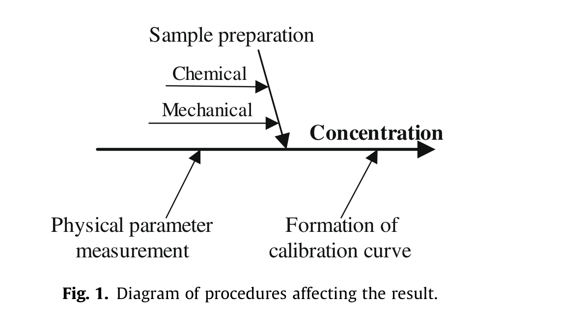
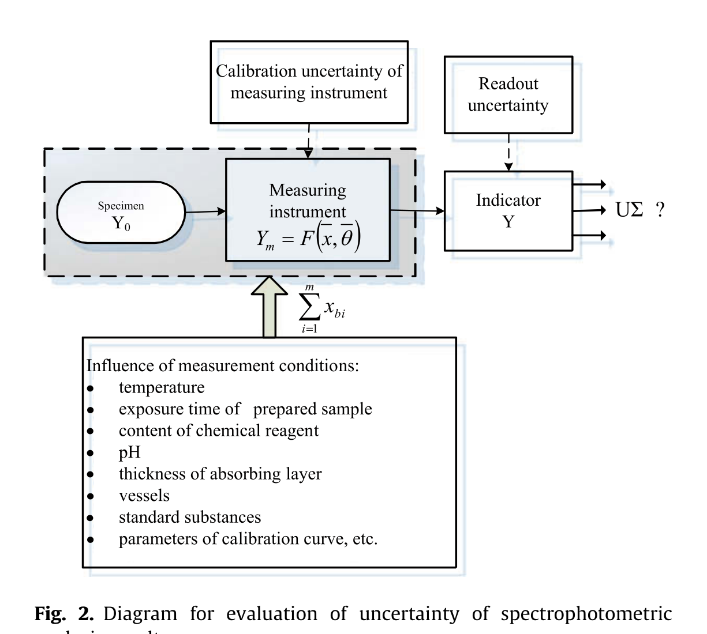
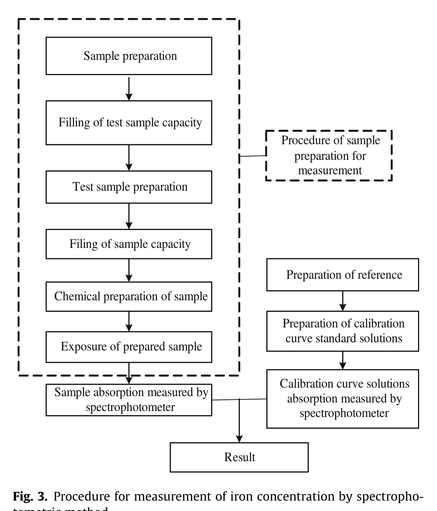
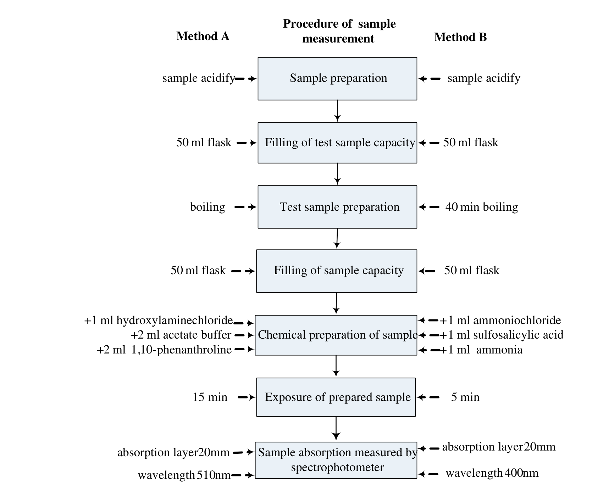
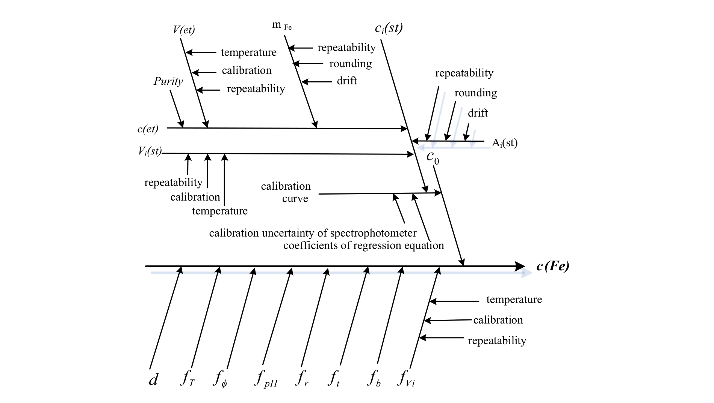
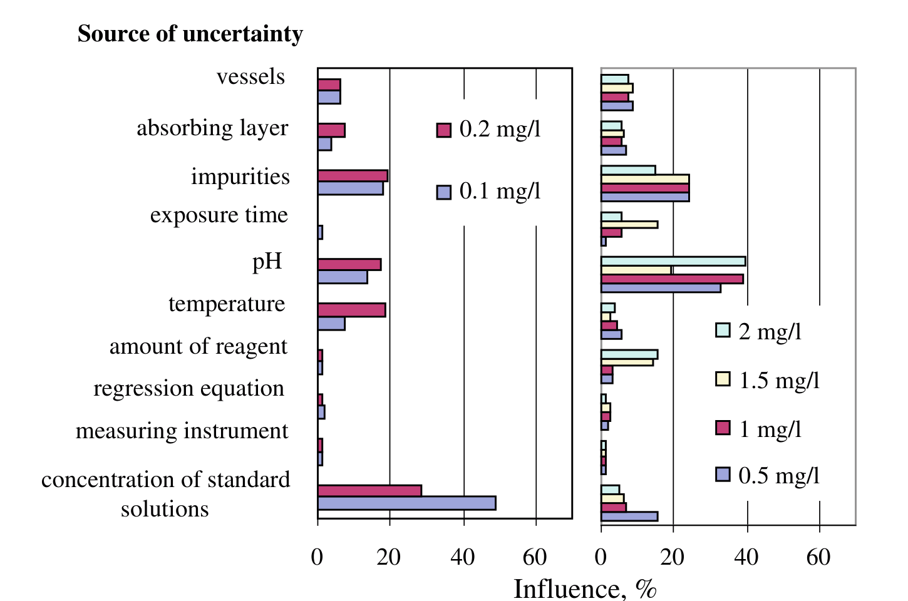
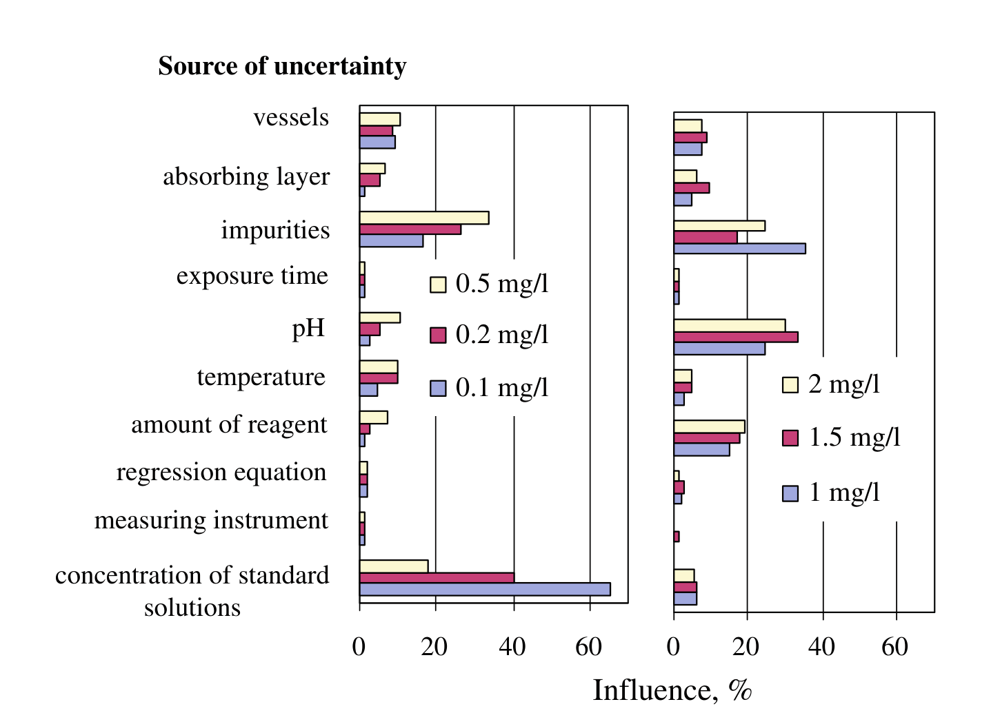

<!-- 方針: 全訳＋必要に応じた補足。原文構成に沿って全節を訳出。式番号・図表番号は原文準拠。「> 補足:」は訳者注。 -->

## 書誌情報

- 標題（原題）: Uncertainty of measurement in spectrometric analysis: A case study
- 著者・所属: J. Dobilienė*, E. Raudienė, R.P. Žilinskas（カウナス工科大学 計量学研究所／リトアニア、カウナス）
- 掲載誌・巻号・DOI: *Measurement* 43 (2010) 113–121（Elsevier）. DOI: 10.1016/j.measurement.2009.07.003
- インパクトファクター: **要確認**（*Measurement*誌のIFは情報源によって5.6〜6.3台と値の幅があり、本セッションでは公式のJCR/Clarivateまたは出版社ページに到達して一次情報を確認できなかったため、正確な数値・年次の確定は避け「要確認」とする。捏造防止のため数値の記載を保留）
- 受理経過 / ライセンス: 受領 2009年6月17日 / 採録 2009年7月13日 / オンライン公開 2009年7月17日 / © 2009 Elsevier Ltd. All rights reserved.
- キーワード: Uncertainty（不確かさ）/ Spectrometry（分光分析）/ Sample preparation（サンプル前処理）

> 補足: 本論文は総説・レビューではなく、著者ら自身が行った比較実験に基づく事例研究（ケーススタディ）論文である。対象は「水中の鉄（Fe）濃度」という単一の分析種・単一のマトリクスだが、そこで示される考え方（サンプル前処理過程を「化学-物理変換（chemical–physical transformation）」として明示的に不確かさ評価の対象に組み込む）は、分光光度法に限らず原子吸光・原子発光・IR分光・質量分析など前処理を伴うあらゆる機器分析に一般化できる内容として書かれている。

## 要旨（Abstract）

分光分析の手法群は、簡便性・迅速性、そして分析種に対する高い選択性ゆえに、さまざまな課題の解決に用いられる測定手法の一群である。あらゆる化学分析の正確さと信頼性は、分析対象サンプルの調製（前処理）のしかたに大きく依存する。

本研究の目的は、サンプル前処理および分光分析における化学-物理変換（chemical–physical transformation）を考慮に入れたうえで、材料濃度測定の不確かさと計量学的信頼性を評価することである。

分光光度法の計量学的特性を実験的に評価し、分析条件が測定結果に与える影響を記述した。

（© 2009 Elsevier Ltd. All rights reserved.）

## 1. 序論（Introduction）

分光分析は、定性・定量分析の両方に広く用いられる測定手法である。分光分析結果の定性的な評価には、サンプル前処理技術・測定原理・分析種濃度・マトリクス特性など、考えられるあらゆる発生源・要因の影響が関与する。測定不確かさは、これらすべてのパラメータに依存する [1]。

測定機器の技術仕様は、あらゆる測定において重要な役割を果たす。製造者もユーザーも、しばしば自分たちの測定機器の高い精度を誇りに思うものである。しかし、分光分析結果を評価する際には、サンプル前処理手順は往々にして不十分にしか考慮されない。これは、最新・迅速・自動化された、サンプルおよび化学試薬の必要量を最小化する技術や、高い再現性を提供する測定機器が分析に用いられているにもかかわらず生じている。

不確かさの評価は、化学測定に特有の性質のために単純な作業ではない。化学的パラメータは常に物理的パラメータへと変換され、その後にはじめてその値が測定される。異なるサンプル調製手順が実施され、それらは化学-物理変換によって測定結果に影響を与えうる。サンプルは前処理過程で機械的・化学的に調製される。多くの場合、これらの手順は実務では適切に評価されていない。

数多くの著者が化学測定結果の不確かさ評価について論文を発表している。また、不確かさ推定に関するガイドもいくつか公表されている [2,3]。学術論文で報告されている内容はかなり一般的な記述にとどまる。なぜなら、あらゆる化学測定はそれぞれに固有だからである。したがって、不確かさは日常の実務手順から切り離すことはできない。不確かさに影響を与えうるあらゆるパラメータを評価し、そのすべてを考慮に入れることが極めて重要である。

本論文は、化学-物理変換の定性的評価と、それが分光分析における測定結果の不確かさに与える影響について論じる。

水試料中の鉄濃度の測定を分光光度法によって行う事例を選び、化学-物理変換条件が測定不確かさに与える影響を実験的に示した。

分光光度測定の物理的基礎はよく知られている [4]。測定機器の不確かさ発生源（分光光度計の読み取り値の再現性、分光光度計のドリフト、迷光など）についてもよく知られている [5–7]。「古典的な」不確かさ発生源（秤量、体積操作など）は十分に評価されている [7–9]。線形最小二乗法による検量線に付随する測定不確かさも評価されている [2,7–9]。しかし、日常の実験室における測定結果の不確かさ評価において、化学-物理変換条件（サンプルのpH、化学試薬の含量、調製済みサンプルの曝露時間など）への注意は不十分である。

## 2. 化学測定の特殊性（Peculiarities of chemical measurements）

化学分析は他の測定とは異なる。何かの「真の値」を測定する方法は存在しない。化学分析においてわれわれができる最善のことは、経験上信頼できるとされる手法を注意深く適用することである。同じ量を異なる手法で測定した結果が互いに一致するならば、その結果は「真の」値に近いと確信できるようになる。しかし、サンプル前処理手順は常に測定結果に対して自らの入力を持ち込む。

化学分析には、評価が必要な3つの主要な段階がある。

1. 化学的パラメータの物理的パラメータへの変換（あらゆるサンプル前処理手順、補助反応など）。
2. 変換されたパラメータの測定。
3. 不確かさを含む結果の評価。

### 2.1 分光分析における化学-物理変換

分光分析には一連の手法が含まれる。さまざまな分光分析手法において測定結果の不確かさに影響を与えるパラメータは、測定対象パラメータ自体が異なるために互いに異なる。外部条件と測定機器の誤差は、あらゆる分析に影響を及ぼす。しかしその影響は、化学-物理変換ほど強くはない。

化学-物理変換段階は、サンプル前処理に関するあらゆる機械的・化学的手順を含む。この変換の過程で、サンプルは、分析種濃度と直接関係する物理的パラメータを測定できるような形に調製される。

化学機器分析のすべての手法は、分析信号を受信しその強度を測定すること、すなわち材料の化学的・物理的特性に基づいている [10]。原文Fig. 1は、分析種の測定濃度の不確かさに影響を与える手順を図示したものである。

サンプル前処理手順には、サンプル採取（採取場所、想定される分析種濃度）、保管（温度、分析までの経過時間）、輸送条件（容器、所要時間、温度など）から、分析用のサンプル調製（サンプルを実験室サンプルの形態へ変換するためのあらゆる機械的処理）、そして最終的な分析結果がある物理パラメータの測定によって得られる測定手順まで、あらゆる処理・手順が含まれる。分析種濃度を測定する前には、一連の前処理手順を実施しなければならない。操作の量と複雑さは、選択した手法と分析の目的に依存する [11]。

サンプル前処理は、分析サイクルの中でも依然として最も時間を要し、労力がかかり、誤りが生じやすい段階の一つである [12]。サンプル前処理法の選択は、次のようないくつかの要因に依存する。

1. 分析種。
2. 分析種の濃度水準。
3. サンプルマトリクス。
4. 機器測定技術。
5. 必要なサンプルサイズ。

選択した手法には、特有のサンプル前処理装置と試薬が必要になる。

したがって、特定の課題を解決するには、吸光・発光・質量電荷比などさまざまな材料パラメータの測定によって分析種の量を決定する、適切な分光分析法が用いられる [4]。

#### 2.1.1 機械的サンプル前処理

選択した分析手法に適した形態へサンプルを変換するために適用されるあらゆる処理・手順は、サンプル前処理に分類される [13]。手法が異なれば必要となるサンプル前処理も異なるが、一部の分光分析手法（原子吸光・原子発光分光法、分光光度法、赤外分光法）には共通の目的と前処理手順を見出すことができる。まず、分析種を選択した分析手法に適合する物理的・化学的形態に変換しなければならない（ほとんどの分析手法は固体または不均一なサンプルにはうまく機能しない）。また分析用サンプルはできる限り純粋でなければならない（サンプルから可能な限り多くの余分な物質を除去し、それが後続の目的分析種の測定を妨げないようにする）。原文Table 1は、さまざまな分光分析手法について、凝集状態別の機械的サンプル前処理手順を示す。

**Table 1. さまざまな凝集状態に対する機械的サンプル前処理手順（原文Table 1の全訳）**

| 分析手法 | 固体サンプルの分析前処理 | 液体サンプルの分析前処理 | 気体サンプルの分析前処理 |
|---|---|---|---|
| 原子発光分光法 | 加熱、溶解、不純物分離、蒸発 | 濃縮または希釈、不純物分離 | 不純物分離、乾燥 |
| 原子吸光分光法 | 乾燥、均質化、不純物分離、粉砕、ふるい分け、抽出、ろ過、原子化 | 不純物分離、ろ過、濃縮または希釈、原子化 | – |
| 分光光度法 | 抽出、乾燥、濃縮、収着、沈殿、不純物分離、ろ過、溶解 | 濃縮または希釈、不純物分離 | – |
| IR分光法 | 粉砕、溶解、懸濁化、加圧成形 | 脱水 | ろ過 |
| 質量分析法 | 粉砕、蒸発 | 直接測定 | 直接測定 |

#### 2.1.2 化学的サンプル前処理

化学的サンプル前処理の不確かさは、結果の合成不確かさの構成要素である。残念ながら、この不確かさはしばしば忘れられるか無視され、その結果、得られた測定結果の不確かさを楽観的に過小評価することになる。現代の不確かさ評価の目的は、サンプルの化学的調製に付随する不確かさを、最終結果の不確かさバジェット（内訳）の一部として組み込むことにある。

化学的サンプル前処理および外部要因が分光分析結果（分析種濃度の測定）に与える影響は、原文Table 2に示されている。あわせて、各手法で測定すべき物理パラメータも示されている。Table 2のデータは、上記の各分析手法の結果評価において、被検サンプルの温度が最も重要な要因であることを示している。他の構成要素の重要性は、具体的な測定手法に依存する。

**Table 2. 化学的サンプル前処理および外部要因が分光分析結果に与える影響（原文Table 2の全訳）**

| 分光分析手法 | 対応する化学量（濃度）の物理パラメータ | サンプルpH | 不純物の影響 | サンプルと試薬の反応 | サンプルマトリクスからの分析種分離 | 化学試薬量 | 調製済みサンプルの体積 | 希釈 | 被検サンプルの温度 | 被検サンプルの安定性 | 調製済みサンプルの保持（浸漬）時間 | 圧力 |
|---|---|---|---|---|---|---|---|---|---|---|---|---|
| 原子吸光分光法 | 吸光 | | + | + | + | + | + | + | + | | + | |
| 原子発光分光法 | 発光 | | + | | + | + | + | + | + | + | | +ᵃ |
| 分光光度法 | 吸光 | + | + | + | | + | + | + | + | + | + | |
| IR分光法 | 吸光 | + | + | + | | + | + | + | + | + | + | |
| 質量分析法 | 質量電荷比 | | | | | | | | | + | | + |

ᵃ 気体のみ。

> 補足: この表からわかるとおり、分光光度法・IR分光法は、原子吸光・原子発光・質量分析よりも「+」（不確かさ源として考慮すべき項目）の数が多い（分光光度法・IR分光法はいずれも9項目、原子吸光・原子発光は8項目、質量分析は2項目のみ）。原著が実験対象に分光光度法を選んだのは、対象となる不確かさ源の種類が最も多く、化学-物理変換の影響を検証するのに適した手法だからだと考えられる（訳者の解釈であり原文に明記はない）。

## 3. 分光光度分析の不確かさ発生源（Uncertainty sources of spectrophotometric analysis）

分光分析手法は、その簡便性・迅速性・高い選択性ゆえに、さまざまな分析種の多くの課題を解決するために用いられる。高度な装置は一見単純に見えるが、材料中の分析種濃度と記録される信号との関係はかなり複雑である。このため、計量学的特性の研究はより複雑になる。さらに、分析種の信号は通常、分析種濃度だけでなく、他のすべての材料の濃度・材料構造・サンプル形態・環境条件にも依存する。加えて、いかなる測定機器を用いる場合でも、化学分析の正確さと信頼性は、分析対象サンプルの調製方法に大きく依存する。なぜなら、前処理の仕組みは化学測定に特有だからである。

測定結果を評価するには、結果に影響しうるあらゆる要因を分析する必要がある [14]。

分光光度分析法は、化学分析実験室で一般的に用いられている測定手法の一群である。しかし、光度測定結果の計量学的評価は不十分である。

分光光度分析から得られる結果の不確かさを評価するための図を、原文Fig. 2に示す。

この図は、評価プロセスにおいて被検対象物と測定機器とを切り離すことができないことを示している。

この図によれば、測定結果を十分に評価するためには、結果に影響しうるすべての要因を分析しなければならない。これらの要因とは、測定機器の技術的特性、測定条件、測定マトリクス、サンプル前処理手順、被検物と測定機器との相互作用、使用する測定手法の制約、読み取り不確かさ、およびデータ処理である。上記の要因を綿密に分析し、特定の事例における追加的な条件を評価してはじめて、測定結果の正確な推定値としての不確かさを適切に示すことができる。

## 4. 手法と結果（Methods and results）

### 4.1 手法の策定と不確かさ発生源の特定

分光光度法の分析対象として、水試料中の鉄濃度の測定が選ばれた。

分光光度法による鉄含量の測定は、検量線を用いて行われた。標準溶液 $c_1 \sim c_n$ の吸光度を測定し、値 $A_1 \sim A_n$ を得た。この場合、濃度は検量線の回帰方程式パラメータの評価によって得られたデータから計算され、以下の式で与えられる:

$$A_i = c_i \cdot B_1 + B_0 \tag{1}$$

ここで $c_i$ はサンプル中の分析種含量（検量線から算出、mg/l）、$A_i$ は被検サンプルの測定吸光度、$B_1$ は検量線の傾き、$B_0$ は検量線の切片である。

線形最小二乗検量線の傾き $B_1$ と、調製した検量線の切片 $B_0$ は、次式から算出される:

$$B_1 = \frac{\sum_{i=1}^{n} c_i A_i - n\bar{c}\bar{A}}{\sum_{i=1}^{n} c_i^2 - n\bar{c}^2} \tag{2}$$

$$B_0 = \frac{\bar{A}\sum_{i} c_i^2 - \bar{c}\sum_{i=1}^{n} c_i A_i}{\sum_{i=1}^{n} c_i^2 - n\bar{c}^2} \tag{3}$$

ここで $c_i$ は $i$ 番目の鉄標準溶液の濃度、$A_i$ は $i$ 番目の標準溶液の吸光度（$A_1,\dots,A_i,\dots,A_n$）、$n$ は検量線上の点の数である。

研究結果間の比較可能性を確保するため、水中鉄濃度の測定に2つの手法が選ばれた。

1. ISO 6332:1988「水質—鉄の定量—1,10-フェナントロリンを用いた分光分析法」（以下、方法A）[15]。
2. スルホサリチル酸を用いた鉄含量測定法（以下、方法B）。

鉄濃度の定量範囲は0.10〜2.00 mg/lとした。この範囲は、選択した両手法の適用領域をカバーする。

選択した手法による分光光度分析種の測定手順は、以下のいくつかの段階から構成される。

- 測定用サンプルの前処理、
- 吸光度の測定、
- 検量線の作成、
- 結果の評価。

これらの手順を原文Fig. 3に示す。

測定結果の信頼性という課題を解くうえで、結果に影響しうるあらゆる要因を評価することは極めて重要である。そのため、選択した両手法（水中鉄濃度測定）の詳細な分析を行い、その結果を原文Fig. 4に示した。ここには、方法AとBそれぞれの測定段階における化学-物理変換の可能な要因が、Fig. 4の右側と左側にそれぞれ示されている。

測定手順の分析から、分析種濃度を表す式(1)だけでは不十分であることが示された。測定手順のすべての段階の影響を評価するために、水試料中の鉄量計算のための数学モデルには、新たな補正係数を加える必要がある:

$$c = c_0 \cdot d \cdot f_r \cdot f_T \cdot f_{pH} \cdot f_t \cdot f_\phi \cdot f_b \cdot f_V \tag{4}$$

ここで $c$ は被検サンプル中の鉄濃度（mg/l）、$c_0$ は検量線から算出したサンプル中の鉄含量（mg/l）、$d$ は希釈係数、$f_r$ は化学試薬の含量に関連する補正係数、$f_T$ は温度補正係数、$f_{pH}$ は溶液pHに関連する補正係数、$f_t$ は調製済み溶液の曝露時間に関連する補正係数、$f_\phi$ は溶液中の不純物に関連する補正係数、$f_b$ は吸収層の厚さに関連する補正係数、$f_V$ は容器の体積に関連する補正係数である。

> 補足: 式(4)が本論文の中核的な提案である。従来は式(1)の単純な検量線変換だけで濃度を算出していたところに、著者らはサンプル前処理・測定環境に由来する8つの補正係数（希釈・試薬量・温度・pH・曝露時間・不純物・吸収層厚・容器体積）を乗算項として明示的に導入している。各補正係数は理想値のとき1に近い値をとり、条件がずれるほど1から乖離すると解釈できる（原文に数値例の記載はないため、この一般化した解釈は訳者による補足である）。

この数学モデルによる測定の場合、不確かさの発生源とそれらが測定結果に与える影響を原文Fig. 5に示す。

分析条件の変動を評価するため、比較測定サイクルが実施された。両手法とも、被検サンプルの温度、調製済みサンプルの曝露時間、化学試薬の含量、吸収層の厚さ、調製済み溶液のpH値を変化させながら、あるいは不純物として追加の物質を検体に添加しながら分析を行った。実験に用いた測定手順のマトリクス（行列）を原文Table 3に示す。

**Table 3. 鉄濃度測定手順の実験マトリクス（原文Table 3の全訳）**

| パラメータ | 変形J | 変形K | 変形L | 変形M | 変形N | 変形O |
|---|---|---|---|---|---|---|
| C/c（温度） | c | C | C | C | C | C |
| D/d（曝露時間） | D | d | D | D | D | D |
| E/e（試薬量） | E | E | e | E | E | E |
| F/f（吸収層厚） | F | F | F | f | F | F |
| G/g（pH） | G | G | G | G | g | G |
| H/h（不純物） | H | H | H | H | H | h |

Table 3中のパラメータについて: 大文字はそのパラメータの正常値（通常条件）を、小文字はその正常値より低い、または高い値を示す。

- C/c: 被検溶液の温度
- D/d: 調製済みサンプルの曝露時間
- E/e: 化学試薬の量
- F/f: 吸収層の厚さ
- G/g: 被検溶液のpH値
- H/h: 被検サンプル中の不純物

鉄濃度測定手順で可能な条件変動の限界を原文Table 4に示す。

**Table 4. 実験条件の限界（原文Table 4の全訳）**

| 測定条件 | 手法 | 低限界 | 通常条件 | 高限界 |
|---|---|---|---|---|
| 温度（°C） | A | 10 | 20 | 30 |
| | B | 10 | 20 | 30 |
| 調製済みサンプルの曝露時間（min） | A | 5 | 15 | 20 |
| | B | 3 | 5 | 10 |
| 化学試薬量（ml） | A | 1 | 2 | 4 |
| | B | 0.5 | 1 | 2.5 |
| 吸収層（mm） | A | 5 | 20 | 30 |
| | B | 5 | 20 | 30 |
| pH | A | 1 | 4.5 | 9 |
| | B | 4 | ≥9 | 10 |
| 不純物（Fe:Zn／Fe:Cu／Fe:Co、方法A・B共通） | A・B | – | – | 1:10 |

実施した実験研究は、小さな濃度域（0.5 mg/l以下）において、両手法の結果に対して温度の偏差が最も大きな影響を与えることを示した。ただし、温度の偏差は0.5 mg/lを超える濃度域でも有意であり、個々の点における偏差は公称値の20%に達することがある。実験結果の計算を参照すると、両手法とも、試験温度20 ± 3°Cの下で濃度1 mg/lまでの範囲で拡張不確かさを算出する際に、温度に関連する不確かさ成分を含める必要があると結論づけられる。

化学試薬量の通常値からの偏差は、両手法の結果にとって重要であり、特に濃度1 mg/lを超える範囲では、結果の偏差が公称値の40%に達する。より小さな濃度域では、偏差は公称値の10%に達する。測定結果の分析から、化学試薬に関連する構成要素の影響は、被検分析種の濃度によって異なることが示された。

吸収層の厚さの許容偏差は(−0.05〜+0.05)であり、この影響は両手法にとって有意ではない。より大きな吸収層の偏差は、濃度の全範囲にわたって測定結果に影響を与える。特に大きな結果の偏差は、小さな濃度域で見られる。

サンプルpHの通常値からの偏差は、両手法の測定結果に濃度の全範囲で影響する。pH値の増加または減少は、より強い結果の偏差を引き起こす。

方法Bを用いて測定を行い、調製済みサンプルの曝露時間が(−1;+2)分に保たれている場合、規定条件からの偏差は測定結果に影響しない。調製済みサンプルの曝露時間の偏差は、調製済みサンプルの曝露時間が手順の規定より短い場合、濃度1 mg/lから2 mg/lの範囲で方法Aの結果に有意な影響を与える。

溶液が不純物を含む場合、それらは測定結果の正確さと信頼性を低下させる。実験は、被検材料の濃度が増加するにつれて不純物の影響が減少することを証明した。汚染されたサンプルや組成不明のサンプル中の鉄濃度を測定する場合には、合成相対標準不確かさの計算に、サンプル汚染の構成要素を含める必要がある。

### 4.2 合成不確かさと不確かさ成分の評価

水試料中の鉄含量測定の不確かさは、入力値 $c_0, f_r, f_T, f_{pH}, f_t, f_\phi, f_b, f_V$ のすべての標準不確かさを合成することによって算出される。不確かさは誤差伝播則を用いて合成された [2,3]。

測定結果と入力パラメータとの関係は、以下のモデルで表される:

$$c = f(x_1, x_2, \dots, x_i, \dots, x_N) \tag{5}$$

ここで $x_1,\dots,x_i,\dots,x_n$ は入力パラメータ（$c_0, f_r, f_T, f_{pH}, f_t, f_\phi, f_b, f_V$）を表す。

検量線に起因する不確かさ成分 $u(C_{cal})$ は、回帰方程式のパラメータ、測定機器の特性、検量線標準溶液の濃度に依存する3つの構成要素からなる。検量線の不確かさ $u(C_{cal})$ は次のように算出される:

$$u(C_{cal}) = \sqrt{u(C_{cal,reg})^2 + u(C_{cal,inst})^2 + u(C_{cal,st})^2} \tag{6}$$

ここで $u(C_{cal,reg})$ は検量線の回帰方程式の標準不確かさ、$u(C_{cal,inst})$ は測定機器特性の標準不確かさ、$u(C_{cal,st})$ は標準溶液濃度の不確かさである。

検量線の回帰方程式の標準不確かさ $u(C_{cal,reg})$ は、最小二乗法により次式で算出される:

$$u(C_{cal,reg}) = \frac{s}{B_1}\sqrt{\frac{1}{p} + \frac{1}{n} + \frac{(c_0-\bar{c})^2}{S}} \tag{7}$$

$$s = \sqrt{\frac{\sum_{j=1}^{n}\left[A_j - (B_0 + B_1 \cdot c_j)\right]^2}{n-2}} \tag{8}$$

$$S = \sum_{j=1}^{n}(c_j - \bar{c})^2 \tag{9}$$

ここで $B_1$ は検量線の傾き、$p$ は $c_0$ を決定するための測定回数、$n$ は検量線作成のための測定回数、$c_0$ は決定された鉄濃度、$\bar{c}$ は異なる検量線標準の平均値、$i$ は検量線標準の番号のインデックス、$j$ は検量線を得るための測定番号のインデックス、$s$ は残差標準偏差である。

測定機器の特性に関する標準不確かさは次のとおりである:

$$u(C_{cal,inst}) = \frac{\Delta_{instr}}{\sqrt{3}} \tag{10}$$

ここで $\Delta_{instr}$ は分光光度計の精度（確度）である。

基準溶液の濃度と標準溶液の体積は、標準溶液濃度の不確かさ $u(C_{cal,st})$ に影響する。

基準溶液濃度の不確かさは、基準物質純度の不確かさ $u(P)$、基準物質の秤量不確かさ $u(m)$、基準溶液の容量フラスコの不確かさ $u(V_{fl,ref})$ として表される。基準溶液濃度の不確かさ $u(c_{ref})$ は次のように算出される:

$$u(c_{ref}) = \sqrt{u(m)^2 + u(P)^2 + u(V_{fl,ref})^2} \tag{11}$$

秤量の不確かさ $u(m)$ は、再現性の不確かさ $u(m,rep)$、秤の校正不確かさ $u(m,cal)$、デジタル表示の丸めに起因する不確かさ $u(m,roun)$ として表される。秤量の不確かさの式は以下のとおりである:

$$u(m) = \sqrt{u(m,rep)^2 + u(m,roun)^2 + u(m,cal)^2} \tag{12}$$

試薬の純度に関連する不確かさは、製造者の仕様から算出される。鉄の純度は証明書に記載されており、その値を $\sqrt{3}$ で除して標準不確かさを得る（矩形分布を仮定）。

容量フラスコの不確かさは、標線までの充填不確かさ $u(V_{fl,fill})$、フラスコ容量の校正不確かさ $u(V_{fl,cal})$、および温度差に起因する体積の不確かさとして表される。フラスコ体積の不確かさは以下のとおりである:

$$u(V_{fl}) = \sqrt{u(V_{fl,cal})^2 + u(V_{fl,fill})^2 + u(V_{fl,temp})^2} \tag{13}$$

$$u(V_{fl,temp}) = \frac{V_{fl}\cdot\Delta t\cdot\gamma}{\sqrt{3}} \tag{14}$$

ここで $V_{fl}$ はフラスコの体積、$\Delta t$ はフラスコ校正時に用いた値と実験室で使用する媒体の温度との差、$\gamma$ は水の熱膨張係数である。

ピペットの体積の不確かさは、ピペットが送達する体積の再現性、ピペットの校正不確かさ $u(V_p,cal)$、およびフラスコ校正時に用いた値と実験室で使用する媒体の温度との差に起因する体積の不確かさ $u(V_p,temp)$ として表される。ピペットの不確かさは以下のとおりである:

$$u(V_p) = \sqrt{u(V_p,cal)^2 + u(V_p,rep)^2 + u(V_p,temp)^2} \tag{15}$$

実験に基づいて評価された不確かさの構成要素は以下のとおりである。

- 化学試薬量を評価する構成要素、
- 被検溶液の温度の構成要素、
- 被検溶液のpH構成要素、
- 調製済み溶液の曝露時間に関連する構成要素、
- 被検溶液中の不純物の構成要素、
- 吸収層の厚さの構成要素。

上記構成要素の標準不確かさ $u(f_i)$ は、各不確かさ成分の実験曲線から、分析における実際に起こりうる条件を考慮に入れて算出される。

$$u(f_i) = \frac{a_{i+} - a_{i-}}{\sqrt{12}} \tag{16}$$

ここで $a_{i+}$ と $a_{i-}$ は、選択した範囲における各構成要素の最低値と最高値である。

測定濃度の全範囲における被検分析種の合成標準不確かさは、次のように算出される:

$$u(c_{Fe})^2 = \sum_{i=1}^{N}\left(\frac{\partial c_{Fe}}{\partial x_i}\right)^2 \cdot u(x_i)^2 \tag{17}$$

ここで $u(x_i)$ は入力パラメータの標準不確かさ、$(\partial c_{Fe}/\partial x_i)$ は感度係数である。

鉄測定の拡張不確かさ $U(c)$ は、合成不確かさに包含係数 $k=2$ を乗じることによって得られる。信頼水準は95%である。

## 5. 結果の考察（Discussion of results）

方法Aによる測定の実施では、以下の濃度範囲——0.2 mg/lまでと、0.2 mg/lから2 mg/lまで——について、拡張不確かさに対する不確かさ成分の異なる影響が確認された。この影響を原文Fig. 6に示す。

相対合成標準不確かさは、0.2 mg/lまでの小さな濃度域で最大0.12、0.2 mg/lから2 mg/lの濃度域で最大0.07である。不確かさ成分の分析から、小さな濃度域では、温度・被検溶液のpH・サンプルマトリクス・検量線に依存する構成要素が測定不確かさに最も大きな影響を与えることが示された。

0.2 mg/lを超える濃度域では、化学試薬量・被検溶液のpH・サンプルマトリクス・検量線標準溶液濃度の各構成要素が、分析種の測定不確かさに支配的な影響を与える。

規定の分析条件下で方法Bを用いて測定を実施した場合、拡張不確かさに対する不確かさ成分の影響は、0.5 mg/lまでの濃度域と0.5 mg/lから2 mg/lまでの濃度域について確認された。この影響を原文Fig. 7に示す。

相対合成標準不確かさは、0.5 mg/lまでの濃度域で最大0.17、0.5 mg/lから2 mg/lの濃度域で最大0.07である。

不確かさ成分に関する研究結果は、被検濃度の全範囲にわたって、溶液曝露時間の構成要素が測定結果に有意な影響を与えないことを示している。支配的な構成要素は、それぞれの濃度によって異なる。小さな濃度域では、検量線と被検サンプルマトリクスの構成要素が分析種の測定不確かさに最も大きな影響を与える。0.5 mg/lを超える濃度域では、化学試薬量・被検溶液のpH・サンプルマトリクスに起因する不確かさ成分が最大となる。

原文Fig. 6・Fig. 7のヒストグラムは、測定機器の特性だけでは分析種の測定不確かさを評価するのに十分ではないという主張を裏づける。したがって、サンプル前処理と測定過程の条件を確保することが極めて重要であり、分析種の測定モデルに補正係数を組み入れる必要がある。

## 6. 結論（Conclusion）

最終的な化学測定モデルを構築するには、物理-化学変換、測定、結果の推定という3つの主要な段階に現れるパラメータを評価する必要がある。

個々のサンプル前処理手順の影響と、その実施品質は、分光分析結果の不確かさに直接的な影響を与える。示唆される事項の多くは新しいものではない。それらはすでに、よく組織された専門的な実験室の標準手順において考慮されているはずのものである。しかし、それらを化学的・機械的サンプル前処理から生じる測定不確かさという文脈に位置づけることは、新たな課題である。測定不確かさに関する知見は、あらゆる分析結果にとって付加的な価値となる。

分光光度法による水中鉄含量の測定分析を実施した結果、不確かさは基本的に化学分析の最初の段階（測定条件、標準溶液、検量線のパラメータ）によって形成されることが示された。したがって、材料濃度の総測定不確かさは、使用する測定機器のパラメータに対しては、感度が低い（わずかにしか敏感でない）。

## 参考文献

[1] R.V. Meyer, Minimizing the Effect of Sample Preparation on Measurement Uncertainty, Agilent Technologies, USA, 2002.

[2] EURACHEM/CITAC Guide, Quantifying Uncertainty in Analytical Measurement, second ed., 2000.

[3] BIPM, IEC, IFCC, ISO, IUPAC, OIML, Guide to the Expression of Uncertainty in Measurement, International Organization for Standardization, Geneva, 1995.

[4] A.D. Skoog, F.J. Holler, T.A. Nieman, Principles of Instrumental Analysis, fifth ed., 1998.

[5] L. Sooväli, E.I. Roõõm, A. Kütt, I. Kaljurand, I. Leito, Accredit. Qual. Assur. 11 (2006) 246–255.

[6] R. Ramachandran, Rashmi, Analyst 124 (1999) 1099–1103.

[7] J. Jürgens, L. Paama, I. Leito, Accredit. Qual. Assur. 12 (2007) 593–601.

[8] J. Traks, L. Sooväli, I. Leito, Accredit. Qual. Assur. 10 (2005) 197–207.

[9] A. Drolc, M. Roš, Acta Chim. Slov. 49 (2002) 409–423.

[10] EURACHEM/CITAC Guide: Traceability in Chemical Measurement. A Guide to Achieving Comparable Results in Chemical Measurement, 2003.

[11] D. Mickevičius, Cheminės analizės metodai, I, II dalys. – Vilnius, 1998.

[12] E. de Oliveira, Sample preparation for atomic spectroscopy: evolution and future trends, J. Braz. Chem. Soc. 14 (2) (2003).

[13] I. Leito, ISO GUM Uncertainty in Chemistry: Successes and Difficulties, University of Tartu, Testing Centre, 2004.

[14] S.K. Timothi, The Uncertainty of Measurements Physical and Chemical Metrology: Impact and Analysis, American Society for Quality, USA, 2002.

[15] ISO 6332:1988 Water quality – Determination of iron – Spectrometric method using 1,10-phenanthroline.

> 補足: 原文の文献[4]直後には出典表記の乱れ（"10. D. Mazej, V. Stibilj, Accredit. Qual. Assur. 8 (2003) 117–123." という一文が[4]の末尾に混入している）があり、これは原著側の組版上の誤りとみられる。当該文献がリスト中どの番号に対応するかは原文からは判断できないため、ここでは[4]の本来の書誌情報のみを訳出し、混入部分は意図的に省略した（捏造防止のため、対応不明な断片を独自の番号で追加することはしない）。

## 訳者補足

- **本論文の位置づけ**: GUM（測定における不確かさの表現ガイド、参考文献[3]）やEURACHEM/CITACガイド（[2]）に代表される一般的な不確かさ評価の枠組みは、標準溶液調製・秤量・体積操作といった「古典的」な不確かさ源や、検量線の回帰統計についてはよく整備されている。本論文の主張は、それだけでは実務上の測定不確かさを説明しきれず、サンプル前処理・化学的変換の条件（温度・pH・試薬量・曝露時間・不純物・吸収層厚など）が無視できない寄与を持つ、という点にある。原文Fig. 6・Fig. 7が示すとおり、低濃度域では検量線・標準溶液濃度・サンプルマトリクス関連の成分が、高濃度域では化学試薬量・pH・サンプルマトリクスの成分が、それぞれ相対合成標準不確かさの過半を占めており、「測定機器の技術仕様（校正・再現性など）」の寄与は両手法・両濃度域を通じて相対的に小さい。
- **式(4)の実務的な意味**: 通常の検量線変換（式1）だけで分析結果を報告する運用に対し、著者らは希釈・試薬量・温度・pH・曝露時間・不純物・吸収層厚・容器体積という8つの補正係数を明示的にモデルへ組み込むことを提案している。これは「不確かさバジェットの内訳表」を作成する際に、どの前処理パラメータを個別の不確かさ成分として立てるべきかの具体的なチェックリストとしても読むことができる。
- **方法Aと方法Bの対比が示す実務上の含意**: 同じ分析種（鉄）・同じ定量原理（分光光度法・検量線法）であっても、試薬系（1,10-フェナントロリン系の方法A、スルホサリチル酸系の方法B）が異なれば、支配的な不確かさ成分の濃度依存性や相対合成標準不確かさの絶対値（方法Aで0.07〜0.12、方法Bで0.07〜0.17）が変わりうる。したがって、既存の不確かさ評価をそのまま別の試薬系・別の分析種に流用することはできず、手法ごとに前処理条件を振った実験的な検証が必要になる、という点は分析法バリデーション実務における一般的な教訓として読める。
- **限界**: 本論文で示される数値（相対合成標準不確かさ0.07〜0.17など）は、水中鉄濃度・上記2手法という特定の系での実測値であり、他の分析種・他の分光分析手法にそのまま外挿できる値ではない。原文でも「分光分析の一般的な考え方」として化学-物理変換の重要性を主張する一方、定量的な結論（不確かさの数値）はあくまでこの事例（ケーススタディ）に限定されると理解すべきである。
