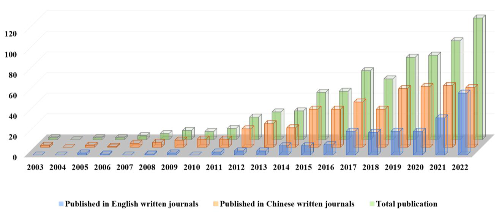
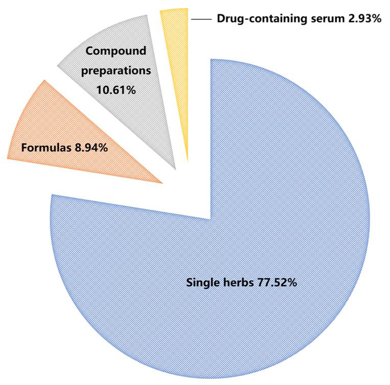
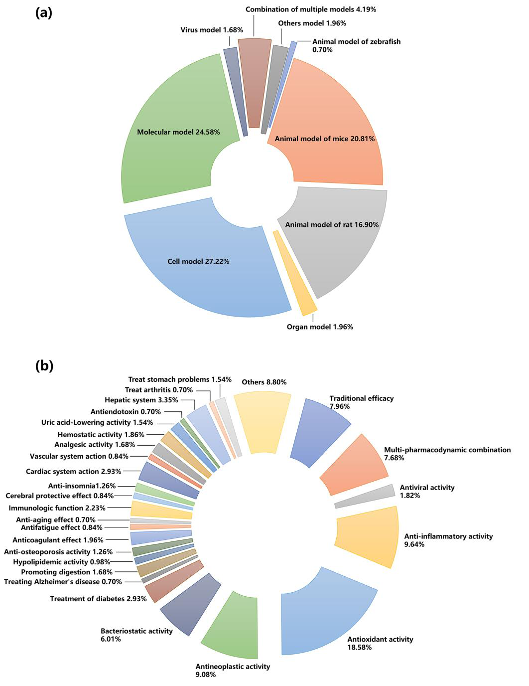

<!-- 方針: ほぼ全訳＋必要に応じた補足。原文構成に沿って訳出。文献番号は原文参照。「> 補足:」は訳者注。 -->

## 書誌情報

- 原題: Spectrum–Effect Relationships as an Effective Approach for Quality Control of Natural Products: A Review
- 著者: Peiyu He, Chunling Zhang, Yaosong Yang, Shuang Tang, Xixian Liu, Jin Yong, Teng Peng（成都中医薬大学 薬学院, 中国）
- 掲載: *Molecules* 2023, 28(20), 7011. https://doi.org/10.3390/molecules28207011（オープンアクセス, CC BY）
- インパクトファクター: **4.6**（*Molecules*, JCR 2024 / Clarivate）

> 補足: **スペクトル効果関係(spectrum–effect relationships, 譜効関係)** = 漢方(TCM)の化学指紋（スペクトル)と薬効（効)を、ケモメトリクス（多変量統計)で相関させ、「どの成分が薬効に効くか(薬効物質基盤)」を推定する研究枠組み。2003年頃に提唱され、本総説はその**20周年**の総括。GRA=灰色関連度分析、BCA=二変量相関分析、HCA=階層クラスタリング、ANN=人工ニューラルネットワーク、PLS/OPLS=(直交)部分最小二乗、CCA=正準相関分析、PCA=主成分分析。本論文は方法論レビュー。

## 要旨（Abstract）

生物活性をもつ天然物として、漢方(TCM)の品質は臨床応用の鍵。TCMの化学成分の種類・含量に基づく**指紋**は国際的に認知された品質評価法だが、化学成分と薬効の相関を無視する。ケモメトリクスにより、TCMの化学成分で表される指紋を薬効活性の結果と相関させて**スペクトル効果関係**を得ると、薬効に関連する薬効成分情報を明らかにでき、TCMにおける「化学成分研究と薬効研究の分断」という限界を解決できる。スペクトル効果関係の提唱20周年にあたり、本稿はTCM領域での研究進展——指紋の確立、薬効評価法、ケモメトリクス手法、およびTCM領域での実際の応用——をレビューする。さらに近年の新戦略と応用展望も論じる。

## 1. 序論（Introduction）

アジアをはじめとする地域で、伝統中医薬（TCM）に代表される天然物中の生物活性化合物は幅広い生物活性を持つ。歴代のTCMの理論と実践に基づき、TCMは疾病の臨床治療で良好な治療効果を上げ、世界的に注目されてきた。TCM産業の近代化・国際化の進展に伴い、TCMの品質管理モデルは、外観性状の単純な観察から顕微鏡的同定へ、さらに特異的な薄層同定と内在成分の定量検出へと徐々に発展してきた[1]。しかし単一のTCMであれ複方製剤であれ、その治療効果は多成分・多標的・多経路の協同の結果であり、1〜数個の化学成分の定性・定量ではTCMの品質管理を実現しにくい。現在、TCM指紋技術は品質評価・一貫性/安定性保証の有効な方法として世界で広く用いられているが、TCMの薬効との相関は依然不明確である[2]。生物活性ガイド分離法やオンラインスクリーニング技術は生物活性化合物の探索に有効だが、作業量の多さ・厳密な実験装置がTCMでの高スループット適用を制限し、一般的な品質管理法としての利用を難しくしている[3–6]。

TCMの物質基盤と薬効の結合に基づく品質評価モデルを確立するため、2002年にLiらは、特徴ピーク指紋中の化学成分の変化を薬効と関連づけてTCMの「**スペクトル-効果関係（spectrum–effect relationships）**」を確立することを提案した[7]。研究モデルは次のとおり：差のある試料を基に試料の化学指紋を確立し、薬効モデルと適切な薬効指標を設定する。得られた化学情報と薬効データを最大限、データ処理法で相関解析し、TCMの品質管理を実現しうる薬効物質基盤を明らかにする。このモデルにより、化合物のみに着目し薬効を無視する従来の品質評価の欠点を補い、指紋と薬効研究の有機的結合を実現して両者の一貫性を高め、スペクトル-効果関係に基づくTCM品質評価を達成できる。

TCMのような天然物の複雑マトリックス中の活性成分の薬理情報をスペクトル-効果関係が正確に反映できるため、過去20年で、その研究はTCMの品質評価・製剤プロセスの最適化・含薬血清の探索に広く用いられてきた。過去20年間にPubMed・SciFinder・ScienceDirect・Scopus・Web of Science・Google Scholar・CNKIほかのデータベース、および博士・修士論文からスペクトル-効果関係関連論文を検索し、重複を除いて計 **716編** の研究論文が得られた（英語誌230編・中国語誌486編）。発表論文数は年々増加傾向にある（図1）。初期には研究対象やデータ処理法を解説したレビューもあった[8–10]が、主に概念の説明に留まり応用面の実践的指針を欠いていた。特に近年は機器の発展と研究体系の成熟により、より高度な分析技術・薬理モデルでより深い研究が行われ、単量体化合物・成分ノックアウトによる薬効検証、ネットワーク薬理・分子ドッキングによる機構探索、ケモメトリクスによる薬効予測、QAMSによる多成分品質評価など新戦略も適用されている。本総説はスペクトル-効果関係モデルの構築プロセスに基づき、指紋の確立（試料選択・分析技術選択）・薬理モデルの確立（動物モデル選択）・データ処理法の選択を詳述し、品質評価・製剤プロセス最適化・含薬血清探索での最新応用を具体的・実践的観点でレビューし、最先端戦略と現在の課題・将来動向を論じる。

## 2. スペクトル-効果関係の研究プロセス

TCMの化学組成は植物種・採取時期・栽培地域・保存条件・加工法などの要因で大きく変わり品質一貫性に影響する。TCMの化学組成情報に基づく包括的で定量可能な同定法として、指紋は天然薬の品質管理の最も有効な方法として国際的に認知される。指紋確立後、標的活性成分群に基づく薬効評価をどう完了するかがもう一つの鍵となる。現在、特定疾患モデルの薬効研究には動物・臓器・細胞・分子などの薬理モデルが用いられる。そして適切なケモメトリクス法で、TCM成分情報を表す指紋と薬効指標を表す薬効情報を結合してスペクトル-効果関係を確立する。したがって本節は、①差のある試料、②指紋の確立、③薬効に基づく評価、④ケモメトリクスによる関連付けの4点からなる。

### 2.1 差のある試料（Samples with Differences）

文献解析から、**単一生薬が研究の焦点で、スペクトル-効果関係の研究対象の70%以上**を占める（図2）。試料は多くが異なるバッチ・栽培地域・製造業者からのもので、同一由来の試料も後続の差処理に使える。異なる由来の試料は組成・薬効に差があるため、通常は同一方法で各試料を別々に処理すれば足りる（例：*Artemisia frigida* [11]、産地の異なる防風〈Saposhnikoviae Radix〉[12] を同一法で前処理）。前処理では有効部位を選び有効成分を最大限保持することが最終目標[13]。一方、単一由来の試料では、前処理は主に**意図的に成分差を作る**ため——異なる抽出法や加工法で差のある試料を調製し、スペクトル効果関係の差から活性成分を絞り込む[14,15]。

方剤・製剤では、処方から1つ（または1群）の生薬を段階的に除き、残りの薬効を調べて除いた生薬の全処方への寄与を得る（拆方分析）。これにより単一生薬の相互作用や複数生薬の最適組合せを探れる（例：Lanらは梔子金花丸の8生薬の定性・定量的寄与を拆方分解解析で明らかにした[16]）。異なるバッチの方剤・製剤の研究で主要活性成分を論じることもできる（半夏白朮天麻湯[17]・複方甘草片[18]・天夢口服液[19]で類似研究）。

さらに、投与後の血清こそが真の薬効を持つ「製剤」である可能性がある。投与形態にかかわらず作用するのは主に血中に入る成分で、これらが薬効の物質基盤——薬材のプロトタイプ成分・代謝物・生理活性物質——となりうる。2002年には既にTCMの血清薬物化学が報告された[20]。含薬血清のスペクトル効果研究では、投与後の異なる時間・異なる用量・異なる製剤の投与後同一時間などで採血して成分特性の異なる試料を得る[21,22]。血清試料は通常、単一法で前処理する。動物血清は各種内因性タンパクを含み血中成分検出を妨げるため、アセトニトリル・メタノール等の有機溶媒を直接加えてタンパクを沈殿させ、感度向上のため抽出で精製・濃縮することが多い。個体差低減のため異なる個体の血清を混合することもある。

### 2.2 指紋の確立（Establishment of Fingerprints）

前処理完了後、TCMの標的成分の分析法選択が特に重要となる。指紋確立の分析法には主に（超）高速液体クロマトグラフィー（HPLC/UHPLC）・ガスクロマトグラフィー（GC）・キャピラリー電気泳動（CE）・薄層クロマトグラフィー（TLC）・紫外分光（UV）・赤外分光（IR）などがある。中でも**クロマトグラフィーが主流**で、高分離効率・高選択性・高感度・高速・広い適用範囲から大半のTCM成分を分析でき、**HPLCが最も一般的**な分析法として認知されている。異なる検出器（UV/DAD/ELSD）をHPLCに接続して異なる化合物を検出でき[23,24]、直列接続で複数種を検出できるため小〜大分子化合物の検出に最も広く使われる。GC-FIDは高分離能・高感度・高選択性・少試料消費[25,26]で、分解しにくい揮発性化合物の分離分析に適する。CE-UVはHPLCで分析困難な大分子も高速・低溶媒消費で分析できる[27,28]。TLCは簡便・安価だが目視データ取得でスペクトル効果関係の構築に不利[29–31]。UVは不飽和結合・共役構造を含む化合物の全体品質を[32]、IRは各成分の官能基情報を反映する[33]が、個々の成分を正確に特性化できない短所がある。各分析法（検出器別）の長所・限界を表1にまとめる。

**表1. スペクトル効率関係研究における各分析法の比較**

| 方法 | 長所 | 限界 |
|---|---|---|
| H/UHPLC-UV/DAD | 大半の化合物に適用。簡便・高特異性・良再現性・高感度・広い直線範囲・低コスト | 分析時間長・溶媒消費大。UV-可視吸収のない化合物は検出不可 |
| H/UHPLC-ELSD | 移動相より低揮発の多様な試料を検出できる万能検出器 | 低感度（特にUV吸収化合物）・移動相要求が高い |
| H/UHPLC-MS | 高スループット・未知化合物の構造解析・高い安定性/感度/再現性 | 高価・イオン源汚染しやすい・操作が複雑 |
| GC-FID | 破壊型の質量式万能検出器。広い直線範囲・高分離効率・高速・少試料・高感度 | 分析時間長・定性には既知化合物が必要 |
| GC-MS | 高い定性信頼性・高感度・大半の揮発性化合物に適する | 高価・熱不安定化合物の分析に不適 |
| CE-UV | 短分析時間・少溶媒/試料・低コスト・色素発色不要 | 芳香族/共役構造でUV吸収する化合物のみ検出可 |
| UV | 非破壊・高速・低コスト | 再現性・精度が低くスペクトル重なりが大きい |
| IR | 高速・無溶媒・前処理不要・低コスト | 定量精度・特異性が低い |
| TLC | 簡便・低装置要求・高速 | 定量困難・高分子化合物の分離が悪い |
| ICP-MS | 多元素同時検出・低検出限界 | 高価・低自動化・信号ドリフト大 |
| 複合法 | 複数の機器/検出条件で化学組成情報がより包括的 | — |

分析機器の発展で、より高スループット・高感度・構造注釈機能を持つ高分解能MSを上記技術（特にHPLC-MS[34,35]・GC-MS[36,37]・ICP-MS[38,39]）と組み合わせ、内在成分の定性・定量をより包括的・正確に行える。二次元クロマトグラフィーは高いピーク容量・分離能で複雑な有効成分の解析に優れる[40]。加えて、単一検出器/分析法の指紋では複雑なTCMの化学組成を正確に表現しにくいことから「**多次元指紋**」の概念が提案された[41]——異なる前処理/分析法/検出器で複数指紋を得て情報を相補し、TCMの化学特性を有効に表す指紋を得る。HPLC-UVでも単一波長では全体組成を反映しきれないことがあり、**多波長融合指紋**でこの限界を補える[42]。総じて、試料ごとに適合する指紋をできる限り探し、化学成分をより詳細に特性化して重要情報の欠落を避けることが、活性成分スクリーニングの堅固な基盤となる。

### 2.3 薬効に基づく評価（Evaluation Based on Pharmacodynamics）

TCMの作用・機構は複雑で、多成分・多標的・多経路の協同ゆえに適切な薬効評価法を見出すのは容易でない。要点は、適切で迅速・広く認知された薬効評価モデルと、高い安定性・再現性を持つ薬効指標を選ぶこと。直感的効果の観察には動物モデルやin vitro臓器、機構研究には細胞培養・生化学実験が用いられる。過去20年の各種薬理モデル・薬効指標の利用状況を図3にまとめる。

現在の薬効研究は主に動物・臓器・細胞・分子モデルに基づく。動物個体レベルに比べ他の3つはTCMの全身調節や体内の吸収・代謝・分布の複雑過程を考慮しない。「補腎壮陽」[24]「活血化瘀」[45]「健脾消腫」[46]など伝統的効能への応答では動物個体がより代表的である。したがって多くのスペクトル効果研究がラット・マウス・ゼブラフィッシュ等の**動物全体モデル**を採用する。図3のとおり動物モデルの割合は約38.41%で、臓器1.96%・細胞27.22%・分子24.58%を上回る。ただしin vivoモデルは高コスト・長時間で、複雑な発症機構の疾患ではヒト病態を完全再現するモデル構築が難しい。臓器・細胞・分子レベルのin vitro実験は複雑なin vivo環境から標的部を分離でき薬効を直接反映し、低スループット問題も緩和する。低コスト・短時間・良再現性から、抗炎症のNO阻害アッセイ[37]・抗菌のMTTアッセイ[47]・抗酸化のDPPH/ABTS/FRAPアッセイ[48]など多くの場面で用いられる。これが抗酸化効果がスペクトル効果研究で18.28%と高い一因でもある（図3）。ただし単一モデルは全身作用を分離し、多くの病理モデルで限界が残る。血清薬理学の発展で、含薬血清のin vivo/in vitro実験も注目される。実験動物にTCM/方剤を1回以上投与し一定時間後に採血[49]、血清を直接化学分析するか、粗抽出物の代わりにin vitro薬理実験に用いる。含薬血清は薬物が内部環境で薬理効果を生む過程を客観的にシミュレートできる[8]。ただし前処理が複雑で成分損失を招きやすく、多量の血液を要し小動物に不向きで、動物モデルへの影響評価が難しく大きな誤差を導入しうる[49]。薬効指標はTCMの効果を測る重要な基準で、通常1〜数個を用いる。図3bのとおり、よく使う薬効指標は抗酸化（18.58%）・抗炎症（9.64%）・抗腫瘍（9.08%）などである。薬効の網羅性のため多指標薬効の導入を提案する研究者もいる[41,50]。ただし複数指標は相補・相互裏づけになる一方、逆の結論を導くこともあるため、疾患の病態・薬物の機構・標的を明確にして正しい指標を選ぶことが肝要。要はTCMの主要効能を代表する標的指標を選ぶことである。

### 2.4 ケモメトリクスによる関連付け（Association Based on Chemometric Methods）

得られた指紋と薬効情報の相関を実現し、必要な情報を掘り出すのがもう一つの鍵。現在、灰色関連度分析（GRA）・二変量相関分析（BCA）・階層クラスタリング（HCA）・人工ニューラルネットワーク（ANN）・重回帰（MLR）・部分最小二乗回帰（PLSR）・正準相関分析（CCA）・主成分分析（PCA）など多様なケモメトリクス法が適用される。各手法は重点方向が異なり、適切な手法選択で複雑マトリックス中の薬効機構を効果的に解析できる。精度確保のため2つ以上の手法を組み合わせて総合解析するのが定石。各手法の特徴・長短を表2にまとめる。これらは3カテゴリ——①各成分と薬効の相関を予測する方法、②各成分の薬効への寄与を明らかにする方法、③データ構造を単純化して主要活性成分を見出す方法——に整理できる[51]。

**表2. スペクトル効果関係に適用されるケモメトリクス法の比較**

| 方法 | 特徴 | 長所 | 短所 |
|---|---|---|---|
| GRA | 変数の発展傾向の類似度から相関を測る | 既知情報で未知を推定・少データで可 | 各ピーク成分の全体寄与を記述しにくい |
| BCA | 原データで2変数間の相関を解析 | 2変数間の方向を反映 | 全体性を無視・ピーク間の協同効果を説明できない |
| HCA | 類似度で試料/変数を教師なし分類 | 直感的・モデリング前の予備解析に有効 | 指紋ピークと薬効指標の相関の大きさ/方向を反映できない |
| ANN | 情報の複雑性・関係の曖昧さを考慮 | 非線形適合・データ単純化・自己適応 | 学習時間長・収束遅い・小標本で過学習・ブラックボックス |
| MLR | 従属変数と独立変数の線形関係を確立 | 測りやすい指標で難指標を予測 | 独立変数間が多重線形だと精度を保証できない |
| PLSR | 多変数下で従属・独立変数の線形関係を確立 | 少データ・情報最大活用・小計算・高予測精度 | 潜在変数の定義ゆえ結果の解釈が難しい |
| CCA | 2つの正準変数の相関で2指標群の全体相関を反映 | 複雑データを単純化・線形相関を定量化 | 次元圧縮で情報減・変数群内の相関は考慮できない |
| PCA | 分散への寄与を保ちつつ次元圧縮 | データ抽出・冗長情報除去 | 主成分の意味が曖昧・次元圧縮で情報損失 |

**2.4.1 各成分と薬効の相関を予測する方法**: GRA・BCA・HCA・ANNで薬効指標とクロマトピークの相関を算出し活性成分を予測できる。GRAは変数曲線の幾何形状の類似度で相関を判定し、情報の少ない複雑変数に特に適する[52]が、各ピークの全体寄与の記述は難しい。BCAは最も広く使われ、相関係数（多くはPearson）で2変数の関係の性質・密接さと正負方向を反映する[53]が、TCMの全体性を無視しピークの協同効果を説明できない。HCAは「類は友を呼ぶ」原理で最も広く使われるクラスタリング[54]で、異なる試料の指紋解析→試料群選択→他手法と組み合わせに用いるが、相関の大きさ・方向は反映できず予備解析に使われる。ANNは動物神経網の信号伝達を模した数理モデルで、BP-ANNが最も広く使われる。既存指紋の化学信号から複雑情報を抽出し、信号と薬効指標のファジー写像関係を確立するが、経験的リスク最小化に基づくため小標本で過学習の恐れがある[55]。

**2.4.2 各成分の薬効への寄与を明らかにする方法**: 上記4手法は各ピークの寄与率を記述しにくい。回帰分析で各ピークと薬効データの回帰モデルを立て寄与率を測る。MLRは複数独立変数と単一変数の回帰で各独立変数の影響をパラメータ評価し、スペクトルと生物活性の関係を定量する有用な方法[33]。線形関係の確立に段階回帰で独立変数を絞り計算を単純化するが、選ばれなかったピークの薬効関係は無視される。独立変数間が多重線形または標本数が少ない場合はMLRの精度が保証できず、PLSRを使う[56]。PLSRは内部変数が高度に線形相関のとき有効で、標本数が変数数より少ない問題をよく解決し、情報最大活用・小計算・高予測精度・定性解釈容易の利点を持つ[57]。直交射影潜在構造（OPLS）では第1潜在変数を応答との共分散最大方向の顕在変数の線形結合で計算する。判別分析（OPLS-DA）は化学組成と試料クラスの予測を実現し、2群の分離・差異変数の抽出に適する。変数の寄与はVIP値で探れ、VIP>1.0で寄与が大きいとされる[58,59]。

**2.4.3 データ構造を単純化して主要活性成分を見出す方法**: TCM化学組成の複雑さから多くの変数が相互関連し重要成分を見出しにくい。CCA・PCAは次元圧縮で元の多指標を少数の総合指標にまとめて解析する[51]。CCAは2群から最も代表的な正準変数を抽出し、2正準変数の相関で2指標群の全体相関を反映するが、次元圧縮で情報が減る[60]。PCAは次元圧縮で元の多変数を少数の主成分（PC）に置換し元情報の大半を保つ。PC数は累積寄与率>85%・固有値λi≥1が適切。PCAは数理モデルで変数間相関を定量できないため、クラスタリング・相関分析・回帰分析等と組み合わせることが多い[22]。PCAは1群の変数の相互依存のみ、CCAは2群の相互依存に拡張する点が異なる。各手法には特徴があり、共通するのは薬効と相関する成分を見出す努力である。各手法の長短を踏まえ、総合的に適用・相互検証してTCMのスペクトル効果関係研究を推進すべきである。

## 3. スペクトル-効果関係の応用

### 3.1 TCMの品質評価（Quality Evaluation）

スペクトル効果関係でTCM・複方製剤の薬効成分を正確に解析し、品質を科学的に評価できる（表3）。TCMの多くは野生/栽培の天然物で、形・色・匂い・味などの伝統的経験基準で等級分けされ、商品規格等級はTCM品質の代表的指標であり流通・取引での価格根拠でもある[61]。Anらは3等級の番瀉葉〈Sennae Folium〉を解析し、一級（緑葉）＞黄葉＞病葉の順で、6種のセンノシドがin vitro抗菌活性の物質基盤かつ等級判別マーカーと同定した[58]。同様に12商品規格の三七〈Notoginseng〉[62]・3商品規格の羌活〈Notopterygii Rhizoma〉[63]でも成功し、規格分類の参照を提供した。植物遺伝子型・特定生態環境・栽培措置の共同作用で道地薬材が形成され、産地の異なるTCMの品質管理にスペクトル効果関係を使える。中国の4産地10バッチの防風で、PMP-HPLC・FT-IR・HPSEC指紋と多糖の抗アレルギー活性の関係を研究し、内モンゴル産が最良と確認された[12]。JiangらはDPPH活性と化学組成の相関で49試料の中国産プロポリスの産地別品質評価法を開発した[56]。同一植物の異なる薬用部位・種でも指紋は概ね似るが、スペクトル効果関係で薬効基盤を確定できる（黄連[65]・菊花[66]・紫草[67]の種、桑〈Morus alba〉[68]・栝楼仁〈Trichosanthis Semen〉[69]の薬用部位）。単一生薬に加え、方剤・製剤の品質評価にも応用される。

### 3.2 製剤プロセスの最適化（Pharmaceutical Process Optimization）

抽出・炮製・製剤化などの工程条件を、化学指紋と薬効の両方を指標に最適化する（＝「成分が保たれる」だけでなく「薬効が保たれる」条件を選ぶ）。工程パラメータの変動が指紋パターンと薬効の双方に及ぼす影響を評価し、有効成分群の保持を最大化する条件を選定できる。

### 3.3 含薬血清の探索（Drug-Containing Serum）

経口投与後の血清（＝実際に吸収・代謝された成分を含む）の指紋と薬効を結び、**生体内で本当に効いている成分**を絞り込む（血清薬理学とスペクトル効果関係の融合）。低い生体利用能の成分もあるため、含薬血清研究は真の生物活性化合物に近づく手段として重視されるが、実験は複雑で資源を要する。

## 4. スペクトル-効果関係の新戦略

研究体系の発展で、TCM品質評価モデルの新戦略が次々と開発された。スペクトル効果関係基準で得た活性化合物に満足せず、初期結果の化合物の薬効活性をさらに検証して最終結果の正確性を担保する研究もある。ネットワーク薬理・分子ドッキングとの組合せで活性化合物の機構を解明し、QAMSで活性化合物の定量に寄与する。

### 4.1 単量体化合物・成分ノックアウトによる薬効検証

ケモメトリクスで薬効活性のあるピークを絞った後、標準品の保持時間やMS同定で定性するが、構造同定に至らないピークもあり結果に欠陥が残る。構造既知の活性成分では、選んだ単一/複数成分を再構成して薬効試験を再度行い、候補活性成分と元のTCMの生物活性等価性を検証できる[106,107]。近年は「ノックアウト」法による検証戦略も適用され、TCMから活性物質を除去して除去後の薬効変化を調べ[108,109]、その成分の薬効的役割をさらに明確化する。

### 4.2 ネットワーク薬理・分子ドッキングによる機構探索

「多成分・多標的・多経路」パラダイムのネットワーク薬理は、薬物-標的-経路のネットワークモデルで関係を解析する新研究様式[110]。スペクトル効果関係との組合せで活性成分の薬物-標的-経路ネットワークを確立し、鍵標的・経路への影響を予測して機構を探る。例：温郁金〈*Curcuma wenyujin*〉の去瘀の薬効物質基盤探索で、血漿中10成分の標的・経路をネットワーク薬理で予測し、80標的が10成分と密接、48標的が159経路（アラキドン酸代謝・スフィンゴ脂質シグナル等）と関連と判明[111]。ただしネットワーク薬理は「成分-標的-経路」の関連を示すが実験的相関検証を欠くことが多い。分子ドッキングは受容体標的タンパクの特徴と相互作用様式で化合物をスクリーニングし、結合様式・親和性を予測する[112,113]。スペクトル効果関係と組み合わせ活性成分の範囲を狭め、構造活性相関の観点から機構を示す。ZhuらはSceptridium ternatum のケルセチン3-O-ラムノシド-7-O-グルコシドがIL-6と結合し高い抗炎症活性を持つと示した[114]。連銭草〈Glechomae Herba〉の抗尿石成分とCaSR[115]、鉤藤〈Uncariae Ramulus〉の抗糖尿病成分とα-グルコシダーゼ[116]にも応用された。

### 4.3 ケモメトリクスによる薬効予測

スペクトル効果関係は指紋と実効を関連づける特性を持ち、TCMの薬効予測に使える。複数試料のピーク情報と薬効情報を関連づけたモデルを訓練し、既知試料のピーク情報から対応する薬効を予測できる。抗酸化[27]・止血[117]・免疫活性[118]の予測に成功している。ただしモデルの標本数を厳密に管理する必要があり、小標本・少入力情報はモデルの頑健性・予測精度を損なう。

### 4.4 QAMSによる多成分品質評価

2006年にWangらが初めてTCMの多成分品質評価にQAMS法を提案し、標準物質不足による多成分定量の制限を解決した[119]。QAMSはある成分（標準品入手可）を内標準とし、他成分との相対補正係数（RCF）を確立してRCFで他成分含量を算出する。経済的・正確で広く普及。スペクトル効果関係と組み合わせると、活性成分を関係から決定し、見出した化学成分をQAMSで包括評価できる[120]。例：スコポレチンを内標準に *Porana sinensis* のQAMS品質管理モデル[121]、クロロゲン酸を内標準に *Blumea riparia* の止血活性の主要4成分の総合定量[122]。

## 5. 結論と展望（Conclusions and Future Perspectives）

TCMの有効な品質管理法として、スペクトル効果関係はケモメトリクスで指紋と薬効を関連づけ、治療的役割を果たす生物活性成分を探り、薬効と内在品質をより包括的・正確に反映する。約20年の探索で品質評価・製剤プロセス最適化・含薬血清探索などの成果が得られ、単量体/ノックアウト検証・ネットワーク薬理/分子ドッキング・薬効予測・QAMSなど新戦略も適用された。20年の更新を経てなお、本総説から進歩の余地が見える。方剤・複方製剤の最小構成単位は単一生薬であり、それが現在の研究対象が単一生薬に集中する一因だが、今後は複方・製剤中の異なるTCM間の相互作用（「君臣佐使」）を主要課題として解くべきである。一部成分の低い生体利用能ゆえ、含薬血清研究は真の生物活性化合物に近づく手段として注目すべきだが、実験は複雑で資源を要する。複雑基質の天然物の化学組成は極めて複雑で、指紋中で低含量でも薬効に決定的な成分がしばしば見落とされるため、指紋中の化学成分をいかに正確に選ぶかが課題。現在H/UHPLCが最も一般的で、MS検出器と組み合わせ未知活性成分を構造同定でき、極性・分子量・官能基の異なる化合物を異なる分析法で検出して包括的な化学プロファイルを得られる。TLCは使用は多くないが、新規プレート[123]・自動機器[124]・高度画像解析・スマートフォン[125,126]の発展でより精密・迅速な定量が可能になり、抗酸化活性成分のスクリーニング[127]やレーザーアブレーションDART-MSでの直接分析[128]など他技術と組み合わせられ、改良でスペクトル効果研究に一層適するようになる。現在は分子・細胞モデルが多用され早期の高スループットスクリーニングに便利だが、全体観で薬効を反映するTCMではより理想的なin vivoモデルを考慮して結果の正確性・適用性を担保すべき。臨床では弁証論治を重視し、異なる証・体状態で治療の考慮が異なるため代表的な疾患モデルの完全再現は難しい。伝統的効能に基づく近代的薬効評価の報告は少なく、スペクトル効果研究は薬効物質基盤だけでなく「薬性」「薬味」など伝統的性質の潜在的物質基盤の研究にも展望を持つ。薬理指標評価ではMolinspiration・Swiss TargetPrediction・SuperPred等のソフトで活性スクリーニング・標的予測を行い研究を効率化できる。統計面では多くの研究がGRA・PLSを使うが統一規定はなく、多くが先行研究を模倣し単一手法で構築する。単一手法の結果には限界があり、今後は複数の統計手法を組み合わせ多角的に有効情報を探るべきである。スペクトル効果関係は品質評価・製剤プロセス最適化・含薬血清探索に成功裏に応用されてきたが、既存の方法・技術に留まらず、オンライン分析・オンライン活性検出のボトルネック突破が必要。例えばオンライン抗酸化活性測定とスペクトル効果関係の組合せで指紋と薬効の同時検出・活性化合物の高スループットオンライン測定を実現でき、革新的発展の新たな着想となる。要するに、分析機器・技術の急速な発展、全体観に適合する薬効モデル・指標の成熟、データ処理法の標準化・多様化により、スペクトル効果関係はTCMの品質管理・プロセス最適化の基準により包括的な参照を提供できるようになる。

> 補足（実務的示唆）: 本サイトには個別のスペクトル効果研究（五味清濁丸・ReDuNing注射剤・三化湯など)が複数収録されているが、本総説はそれらの**方法論の“地図”**にあたる。実務の要点は——①**差のある試料を意図的に集める**（産地・基原・炮製・部位が均一だと相関が出ない)。②指紋は目的成分の性質でHPLC/GC/分光を選ぶ。③薬効は同一バッチで測る（in vivo/in vitro/細胞)。④関連付けは**単一手法に頼らず**GRA(全ピーク横断)＋PLS/OPLS(VIPで寄与抽出)＋相関分析を併用し相互検証する。⑤GRAは方向(正負)を示せないなどの各手法の限界を理解して使う。⑥“含薬血清”や“薬効予測”まで進めると、規格成分を薬効に一段近づけられる。生薬QCで「規格成分＝薬効成分」を目指す際の設計指針として通読価値が高い。

## 参考文献

1. She, Y.M.; Hu, Y.H.; Han, L.Y.; Liu, S.X.; Chen, C.Q. Research progress on quality control of Chinese materia medica. Chin. Tradit. Herb. Drugs 2017, 48, 2557–2563.

2. Liu, D.F.; Zhao, L.N.; Li, Y.F.; Jin, C.D. Research progress and application in fingerprint technology on Chinese materia medica. Chin. Tradit. Herb. Drugs 2016, 47, 4085–4094.

3. Han, C.; Wang, S.; Li, Z.; Chen, C.; Hou, J.; Xu, D.; Wang, R.; Lin, Y.; Luo, J.; Kong, L. Bioactivity-guided cut countercurrent chromatography for isolation of lysine-specific demethylase 1 inhibitors from Scutellaria baicalensis Georgi. Anal. Chim. Acta 2018, 1016, 59–68. [CrossRef]

4. Ye, Y.; Li, X.Q.; Tang, P.C.; Yao, S. Natural products chemistry research: Progress in China in

5. Li, D.Q.; Zhao, J.; Wu, D.; Li, S.P. Discovery of active components in herbs using chromatographic separation coupled with online bioassay. J. Chromatogr. B 2016, 1021, 81–90.

6. Lu, Y.; Wu, N.; Fang, Y.; Shaheen, N.; Wei, Y. An automatic on-line 2,2-diphenyl-1-picrylhydrazyl-high performance liquid chromatography method for high-throughput screening of antioxidants from natural products. J. Chromatogr. A 2017, 1521, 100–109. [CrossRef] [PubMed]

7. Li, R.; Yan, Z.Y.; Li, W.J.; Xu, T.; Tan, R.A.; Pan, L.; Li, Y.M.; Ma, Y.L. The establishment of chromatographic pharmacodynamics. Educ. Chin. Med. 2002, 21,

8. Xu, G.L.; Xie, M.; Yang, X.Y.; Song, Y.; Yan, C.; Yang, Y.; Zhang, X.; Liu, Z.Z.; Tian, Y.X.; Wang, Y.; et al. Spectrum-effect relationships as a systematic approach to traditional Chinese medicine research: Current status and future perspectives. Molecules 2014, 19, 17897–17925. [CrossRef]

9. Zhu, C.S.; Lin, Z.J.; Xiao, M.L.; Niu, H.J.; Zhang, B. The spectrum-effect relationship—A rational approach to screening effective compounds, reflecting the internal quality of Chinese herbal medicine. Chin. J. Nat. Med. 2016, 14, 177–184. [CrossRef]

10. Zhang, C.; Zheng, X.; Ni, H.; Li, P.; Li, H.J. Discovery of quality control markers from traditional Chinese medicines by fingerprint-efficacy modeling: Current status and future perspectives. J. Pharm. Biomed. Anal. 2018, 159, 296–304. [CrossRef]

11. Tian, W.; Yang, J.; Dou, J.H.; Li, X.M.; Dai, X.F.; Wang, X.M.; Sun, Y.H.; Li, Z.Y. Interbatch quality control of the extract from Artemisia frigida Willd. by spectrum-effect relationship between HPLC fingerprints and the total antioxidant capacity. Int. J. Food Prop. 2022, 25, 541–549. [CrossRef]

12. Yu, M.Q.; Xu, G.; Qin, M.; Li, Y.L.; Guo, Y.Y.; Ma, Q. Multiple fingerprints and spectrum-effect relationship of polysaccharides from Saposhnikoviae Radix. Molecules 2022, 27,

13. Zeng, L.J.; Lin, B.; Song, H.T. Progress in study of spectrum-effect relationship of traditional Chinese medicine and discussions. China J. Chin. Mater. Medica 2015, 40, 1425–1432.

14. Liu, M.Y.; Luo, Z.H.; Chen, Z.E.; Qin, Y.R.; Liu, Q.Y.; Ding, P. Quality markers for processed products of Morinda officinalis how based on the “oligosaccharides-spectrum-effect”. J. Pharm. Biomed. Anal. 2022, 208,

15. Zhang, J.; Chen, T.; Li, K.; Xu, H.; Liang, R.; Wang, W.; Li, H.; Shao, A.; Yang, B. Screening active ingredients of rosemary based on spectrum-effect relationships between UPLC fingerprint and vasorelaxant activity using three chemometrics. J. Chromatogr. B 2019, 1134–1135,

16. Lan, L.; Zhang, J.; Yang, T.; Gong, D.; Zheng, Z.; Sun, G.; Guo, P.; Zhang, H. Compound synthesizing profiling based on quantitative HPLC fingerprints combined with antioxidant activity analysis for Zhizi Jinhua pills. Phytomedicine 2022, 105,

17. Xu, N.; Li, M.C.; Wang, P.; Wang, S.L.; Shi, H.Y. Spectrum-effect relationship between antioxidant and anti-inflammatory effects of Banxia Baizhu Tianma Decoction: An identification method of active substances with endothelial cell protective effect. Front. Pharmacol. 2022, 13,

18. Gong, D.D.; Chen, J.Y.; Sun, Y.; Liu, X.T.; Sun, G.X. Multiple wavelengths maximization fusion fingerprint profiling for quality evaluation of compound liquorice tablets and related antioxidant activity analysis. Microchem. J. 2021, 160,

19. Liu, X.Y.; Zhang, H.; Su, M.; Sun, Y.; Liu, H.M.; Zang, H.C.; Nie, L. Comprehensive quality evaluation strategy based on non-targeted, targeted and bioactive analyses for traditional Chinese medicine: Tianmeng oral liquid as a case study. J. Chromatogr. A 2020, 1620,

20. Wang, X.J. Study on serum pharmacochemistry of traditional Chinese medicine. World Sci. Technol. Mod. Trad. Chin. Med. 2002, 4, 1–4.

21. Liu, X.; Wang, X.L.; Zhu, T.T.; Zhu, H.; Zhu, X.C.; Cai, H.; Cao, G.; Xu, X.Y.; Niu, M.J.; Cai, B.C. Study on spectrum-effect correlation for screening the effective components in Fangji Huangqi Tang basing on ultra-high performance liquid chromatography-mass spectrometry. Phytomedicine 2018, 47, 81–92. [CrossRef] [PubMed] Molecules 2023, 28, 7011 22 of 26

22. Wang, Y.L.; Liu, W.; Yang, D.B.; Qing, Y.J.; Du, P.; Jin, Y.; Yao, X.Y. Establishment of fingerprint of Gegen Qinlian decoction and its formula compatibility groups using UHPLC–MS/MS and its study to spectrum–effect relationship. J. Liq. Chromatogr. Relat. Technol. 2017, 41, 384–390. [CrossRef]

23. Yu, Y.T.; Zhu, Z.Y.; Xie, M.J.; Deng, L.P.; Xie, X.J.; Zhang, M. Investigation on the Q-markers of Bushen Huoxue Prescriptions for DR treatment based on chemometric methods and spectrum-effect relationship. J. Ethnopharmacol. 2022, 285,

24. Zhang, D.D.; Fan, L.D.; Yang, N.; Li, Z.L.; Sun, Z.M.; Jiang, S.Y.; Luo, X.Y.; Li, H.J.; Wei, Q.; Ye, X.C. Discovering the main “reinforce kidney to strengthening Yang” active components of salt Morinda officinalis based on the spectrum-effect relationship combined with chemometric methods. J. Pharm. Biomed. Anal. 2022, 207,

25. Deng, R.R. A Preliminary Study on the Identification of Lavender Essential Oil and Its Spectral Effect Relationship. Master’s Thesis, Guangdong Pharmaceutical University, Guangzhou, China,

26. Luo, H.; Bian, H.; Han, Y.Q.; Zhang, J.R.; Xia, L.Z.; Zhu, X.W. Investigation on spectrum -activity relationship between extracts from pericarpium citri reticulatae and its pharmacological action. J. Shanxi Univ. Chin. Med. 2016, 17, 22–25.

27. Hou, Z.F.; Sun, G.X.; Guo, Y.; Yang, F.L.; Gong, D.D. Capillary electrophoresis fingerprints combined with linear quantitative profiling method to monitor the quality consistency and predict the antioxidant activity of Alkaloids of Sophora flavescens. J. Chromatogr. B 2019, 1133,

28. Zhang, Y.J.; Yang, L.P.; Zhang, J.; Shi, M.; Sun, G.X. Micellar electrokinetic capillary chromatography fingerprints combined with multivariate statistical analyses to evaluate the quality consistency and predict the fingerprint-efficacy relationship of Salviae miltiorrhizae Radix et Rhizoma (Danshen). J. Sep. Sci. 2017, 40, 2800–2809. [CrossRef]

29. Hang, N.T.; Hoang, L.V.; Phuong, N.V. Spectrum-effect relationship between high-performance thin-layer chromatography data and xanthine oxidase inhibitory activity of celery seed extract. Biomed. Chromatogr. 2021, 35, e5181.

30. Shawky, E.; Ibrahim, R.S. Bioprofiling for the quality control of Egyptian propolis using an integrated NIR-HPTLC-image analysis strategy. J. Chromatogr. B 2018, 1095, 75–86. [CrossRef]

31. Ibrahim, R.S.; Khairy, A.; Zaatout, H.H.; Hammoda, H.M.; Metwally, A.M.; Salman, A.M. Chemometric evaluation of alfalfa sprouting impact on its metabolic profile using HPTLC fingerprint-efficacy relationship analysis modelled with partial least squares regression. J. Pharm. Biomed. Anal. 2020, 179,

32. Ni, L.J.; Zhang, L.G.; Hou, J.; Shi, W.Z.; Guo, M.L. A strategy for evaluating antipyretic efficacy of Chinese herbal medicines based on UV spectra fingerprints. J. Ethnopharmacol. 2009, 124, 79–86. [CrossRef] [PubMed]

33. Dong, Y.T.; Pei, F.; Su, A.X.; Sanidad, K.Z.; Ma, G.X.; Zhao, L.Y.; Hu, Q.H. Multiple fingerprint and fingerprint-activity relationship for quality assessment of polysaccharides from Flammulina velutipes. Food. Chem. Toxicol. 2020, 135,

34. Chang, Y.Q.; Zhang, D.; Yang, G.Y.; Zheng, Y.G.; Guo, L. Screening of anti-lipase components of Artemisia argyi leaves based on spectrum-effect relationships and HPLC-MS/MS. Front. Pharmacol. 2021, 12,

35. Chen, C.H.; Chen, J.L.; Shi, J.J.; Chen, S.Y.; Zhao, H.; Yan, Y.; Jiang, Y.C.; Gu, L.; Chen, F.Y.; Liu, X.H. A strategy for quality evaluation of salt-treated Apocyni Veneti Folium and discovery of efficacy-associated markers by fingerprint-activity relationship modeling. Sci. Rep. 2019, 9,

36. Tan, L.; Yang, Y.F.; Peng, J.; Zhang, Y.; Wu, B.; He, B.S.; Jia, Y.; Yan, T.X. Schisandra chinensis (Turcz.) Baill. essential oil exhibits antidepressant-like effects and against brain oxidative stress through Nrf2/HO-1 pathway activation. Metab. Brain Dis. 2022, 37, 2261–2275. [CrossRef]

37. Bai, X.; Liu, L.; Zhang, J.P.; Chen, L.; Wu, T.; Aisa, H.A.; Maiwulanjiang, M. Spectrum-effect relationship between GC-QTOF-MS fingerprint and antioxidant, anti-inflammatory activities of Schizonepeta tenuifolia essential oil. Biomed. Chromatogr. 2021, 35, e5106. [CrossRef]

38. Wang, D.; Hou, J.; Wu, Y.; Gao, Q.Q.; Chen, Z.P.; Li, W.D. Spectrum-effect relationships of the metal elements in pyritum, its processed products and their activities on proliferation of osteoblasts. Tradit. Chin. Drug Res. Clin. Pharmacol. 2021, 32, 1109–1113.

39. Chen, X.H.; Cui, L.L.; Bao, Y.R.; Meng, X.S. Spectra-effect relationship of anti-tumor effects of Saltpeter in different regions based on gray correlation analysis. J. Liaoning. Univ. Tradit. Chin. Med. 2019, 21, 61–65.

40. Wu, R.J.; Liang, J.; Liang, Y.H.; Xiong, L. A spectrum-effect based method for screening antibacterial constituents in Niuhuang Shangqing Pill using comprehensive two-dimensional liquid chromatography. J. Chromatogr. B 2022, 1191,

41. Li, Y.F.; Cheng, Y.Y.; Fan, X.H. A Strategy for multidimensional spectrum-effect relationship of traditional Chinese medicine. Chin. J. Nat. Med. 2010, 8, 167–170. [CrossRef]

42. Yang, L.P.; Xie, X.M.; Yang, L.; Zhang, J.; Sun, G.X. Monitoring quality consistency of Ixeris sonchifolia (Bunge) Hance injection by integrating UV spectroscopic fingerprints, a multi-wavelength fusion fingerprint method, antioxidant activities and UHPLC/QTOF-MS. RSC Adv. 2016, 6, 87616–87627. [CrossRef]

43. Tistaert, C.; Dejaegher, B.; Vander Heyden, Y. Chromatographic separation techniques and data handling methods for herbal fingerprints: A review. Anal. Chim. Acta 2011, 690, 148–161. [PubMed]

44. Goodarzi, M.; Russell, P.J.; Heyden, Y.V. Similarity analyses of chromatographic herbal fingerprints: A review. Anal. Chim. Acta 2013, 804, 16–28. [CrossRef] [PubMed]

45. Xu, B.X.; Gao, J.; Zhao, S.N.; Li, Y.R.; Du, Y.L.; Pan, H.F. The Spectrum–effect relationship between HPLC fingerprint and the invigorating blood and dissolving stasis effect of Hawthorn Leaves. Chromatographia 2020, 83, 409–421. [CrossRef] Molecules 2023, 28, 7011 23 of 26

46. Du, W.F.; Zhu, W.H.; Ge, W.H.; Li, C.Y. Research on the effect of spleen-invigorating and anti-swelling active ingredients in crude and processed coix seed based on Spectrum-Effects relationship combined with chemometrics. J. Pharm. Biomed. Anal. 2021, 205,

47. Yang, J.; Tian, W.; Liu, Y.F.; Li, X.M.; Pan, F.F.; Wang, Z.Y.; Li, Z.Y.; Yang, P.L.; Dai, X.F. Quality evaluation of the extract of aerial parts from Atractylodes lancea based on fingerprint and chemometrics. Int. J. Food Prop. 2022, 25, 422–434. [CrossRef]

48. Liu, X.K.; Wang, Y.; Ge, W.; Cai, G.Z.; Guo, Y.L.; Gong, J. Spectrum-effect relationship between ultra-high-performance liquid chromatography fingerprints and antioxidant activities of Lophatherum gracile Brongn. Food Sci. Nutr. 2022, 10, 1592–1601. [CrossRef]

49. Wang, D.; Gao, S.; Mu, Y.Y.; Zhu, F.F.; Li, W.L. Application of serum pharmacology studying on spectral effect relationship of traditional Chinese medicine. J. Harbin Univ. Commer. (Nat. Sci. Ed.) 2013, 29, 641–644.

50. Sun, L.Q.; Qi, J.; Yu, B.Y. Advances of multi-dimensional spectrum-effect relationship for the research on traditional Chinese medicine. J. China Pharm. Univ. 2013, 44, 487–493.

51. Lv, S.W.; Dong, S.Y.; Guo, Y.Y.; Sun, S.; Kuang, H.X. Advance in application of data analysis technique in spectrum-effect relationship of traditional Chinese medicines. Chin. J. Exp. Tradit. Med. Formulae 2015, 21, 226–230.

52. Tan, X.R.; Deng, J.L. Grey relational analysis: Multiariable statistical analysis methods. Stat. Res. 1995, 65, 46–48.

53. Li, X.; Zhang, F.; Wang, X.; Sun, G.X. Evaluating the quality consistency of Rong’e Yishen oral liquid by UV + FTIR quantum profilings and HPLC fingerprints combined with 3-dimensional antioxidant profiles. Microchem. J. 2021, 170,

54. Rencher, A. Methods of Multivariate Analysis, 2nd ed.; John Wiley & Sons, Inc.: Hoboken, NJ, USA,

55. Huang, M.W.; Li, R.J.; Yang, M.; Zhou, A.; Wu, H.; Li, Z.G.; Wu, H. Discovering the potential active ingredients of Qi-Yu-San-Long decoction for anti-oxidation, inhibition of non-small cell lung cancer based on the spectrum-effect relationship combined with chemometric methods. Front. Pharmacol. 2022, 13,

56. Jiang, X.S.; Tao, L.C.; Li, C.G.; You, M.M.; Li, G.Q.; Zhang, C.P.; Hu, F.L. Grouping, Spectrum-effect relationship and antioxidant compounds of Chinese Propolis from different regions using multivariate analyses and off-line anti-DPPH assay. Molecules 2020, 25,

57. Alsberg, B.K.; Kell, D.B.; Goodacre, R. Variable selection in discriminant partial least squares analysis. Anal. Chem. 1998, 70,

58. An, Q.; Wang, L.; Ding, X.Y.; Shen, Y.J.; Hao, S.H.; Li, W.J.; Li, H.Y.; Wang, T.H.; Zhan, Z.L.; Zheng, Y.G.; et al. Validation of Sennae Folium specification grade classification based on UPLC-Q-TOF/MS spectrum-effect relationship. Arab. J. Chem. 2022, 15,

59. Wold, H. Partial least squares. Encycl. Stat. Sci. 1985, 6, 581–591.

60. Kong, W.J.; Zhao, Y.L.; Shan, L.M.; Xiao, X.H.; Guo, W.Y. Spectrum-effect Relationships between HPLC fingerprints and biothermo-logical activity of Zuojinwan and its similar formulaes. Acta Chim. Sin. 2008, 66, 2533–2538.

61. Fan, L.H.; Fan, W.X.; Wei, Z.Q.; Tan, C.Q.; Wu, C.J.; Huang, Y.L. A Rapid near infrared spectroscopy evaluation system for quality management of Chinese medicinal materials based on appearance characteristics. Pharm. Clin. Chin. Mater. Medica 2021, 12, 15–19.

62. Li, Q.Y.; Bian, L.H.; Wang, X.M.; Yao, Z.W.; Li, J.Y.; Wan, G.H.; Wei, X.J.; Liu, J.F.; Yu, J.H.; Jin, C.X.; et al. Spectrum-effect relationship of hemostatic effects of Notoginseng Radix et Rhizoma with different commodity specifications. China J. Chin. Mater. Medica 2021, 46, 4157–4166.

63. Liu, Y.; Guo, H.Q.; Yang, L.; Cheng, Y.R.; Shi, X.J.; Yang, L.; Gong, Y.T.; Dong, L. Study on anti-inflammatory activities in vitro and in vivo and relation of fingerprint with pharmacodynamics of Notopterygii Rhizoma et Radix from three commercial specifications. Chin. Tradit. Herb. Drugs 2019, 50, 6052–6058.

64. Zhao, L.Y.; Shi, M.Y.; Zhang, Q.Y.; Qin, L.P.; Sun, Y.Q. Research progress on quality characteristics and formation mechanism of genuine medicinal materials. Chin. Tradit. Herb. Drugs 2022, 53, 6931–6947.

65. Qi, L.M.; Zhong, F.R.; Liu, N.N.; Wang, J.; Nie, K.D.; Tan, Y.L.; Ma, Y.T.; Xia, L.N. Characterization of the anti-AChE potential and alkaloids in Rhizoma Coptidis from different Coptis species combined with spectrum-effect relationship and molecular docking. Front. Plant Sci. 2022, 13,

66. Lu, Y.F.; Li, D.X.; Zhang, R.; Zhao, L.L.; Qiu, Z.; Du, Y.; Ji, S.; Tang, D.Q. Chemical antioxidant quality markers of Chrysanthemum morifolium using a spectrum-effect approach. Front. Pharmacol. 2022, 13,

67. Liao, M.; Yan, P.; Liu, X.C.; Du, Z.F.; Jia, S.L.; Aybek, R.; Li, A.Q.; Kaisa, S.; Jiang, H.L. Spectrum-effect relationship for anti-tumor activity of shikonins and shikonofurans in medicinal Zicao by UHPLC-MS/MS and chemometric approaches. J. Chromatogr. B 2020, 1136,

68. Chen, Z.Y.; Du, X.; Yang, Y.Y.; Cui, X.M.; Zhang, Z.J.; Li, Y. Comparative study of chemical composition and active components against alpha-glucosidase of various medicinal parts of Morus alba L. Biomed. Chromatogr. 2018, 32, e4328. [CrossRef] [PubMed]

69. Yan, H.Y.; Zou, C.C. Study on anticoagulant material basis and mechanism of Trichosanthis Semen and its shell andkernel based on spectrum-effect relationship integrated molecular docking. China J. Chin. Mater. Medica 2022, 47, 1370–1382.

70. Qu, C.; Pu, Z.J.; Zhou, G.S.; Wang, J.; Zhu, Z.H.; Yue, S.J.; Li, J.P.; Shang, L.L.; Tang, Y.P.; Shi, X.Q.; et al. Comparative analysis of main bio-active components in the herb pair DanshenHonghua and its single herbs by ultra-high performance liquid chromatography coupled to triple quadrupole tandem mass spectrometry. J. Sep. Sci. 2017, 40, 3392–3401. [CrossRef] Molecules 2023, 28, 7011 24 of 26

71. Zhang, P.L.; He, S.R.; Wu, S.Q.; Li, Y.; Wang, H.Y.; Yan, C.Y.; Yang, H.; Li, P. Discovering a multi-component combination against bascular Dementia from Danshen-Honghua herbal pair by spectrum-effect relationship analysis. Pharmaceuticals 2022, 15,

72. Wang, Y.L.; Hu, G.; Zhang, Q.; Yang, Y.X.; Li, Q.Q.; Hu, Y.J.; Chen, H.; Yang, F.Q. Screening and Characterizing Tyrosinase Inhibitors from Salvia miltiorrhiza and Carthamus tinctorius by Spectrum-Effect Relationship Analysis and Molecular Docking. J. Anal. Methods Chem. 2018, 2018,

73. Wang, Y.L.; Zhang, Q.; Yin, S.J.; Cai, L.; Yang, Y.X.; Liu, W.J.; Hu, Y.J.; Chen, H.; Yang, F.Q. Screening of blood-activating active components from Danshen-Honghua herbal pair by spectrum-effect relationship analysis. Phytomedicine 2019, 54, 149–158. [CrossRef]

74. Shi, J.W.; Li, Z.Z.; Wu, J.S.; Jin, W.Y.; Chang, X.Y.; Sun, H.; Dong, L.; Jiang, Z.P.; Shi, Y. Identification of the bioactive components of Banxia Xiexin Decoction that protect against CPT-11-induced intestinal toxicity via UPLC-based spectrum-effect relationship analyses. J. Ethnopharmacol. 2021, 266,

75. Zhou, X.W.; Li, Y.; Zhang, M.Y.; Hao, J.J.; Gu, Q.; Liu, H.Y.; Chen, W.; Shi, Y.F.; Dong, B.; Zhang, Y.Y.; et al. Spectrum-effect relationship between UPLC fingerprints and antilung cancer effect of Si Jun Zi Tang. Evid.-Based Complement. Altern. Med. 2019, 2019,

76. Tong, J.B.; Gao, Y.T.; Fan, C.L.; Yang, C.; Han, M.X.; Zhang, N.Z. Clinical observation of qiyu sanlong decoction for non-small cell lung cancer in moderate and advanced stages. J. New Chin. Med. 2018, 50, 146–150.

77. Pang, H.Q.; Zhou, P.; Meng, X.W.; Yang, H.; Li, Y.; Xing, X.D.; Wang, H.Y.; Yan, F.R.; Li, P.; Gao, W. An image-based fingerprintefficacy screening strategy for uncovering active compounds with interactive effects in Yindan Xinnaotong soft capsule. Phytomedicine 2022, 96,

78. Wei, Y.H.; Nie, L.; Gao, L.L.; Zhong, L.; Sun, Z.Y.; Yang, X.C.; Yue, J.N.; Zeng, Y.Z.; Li, L.; Sun, J.; et al. An integrated strategy to identify and quantify the quality markers of Xinkeshu Tablets based on spectrum-effect relationship, network pharmacology, plasma pharmacochemistry, and pharmacodynamics of zebrafish. Front. Pharmacol. 2022, 13,

79. Li, X.; Zhang, F.; Shi, Y.N.; Bao, B.C.; Sun, G.X. Assessing the quality consistency of Rong’e Yishen oral liquid by five-wavelength maximization profilings and electrochemical fingerprints combined with antioxidant activity analyses. Anal. Chim. Acta 2022, 1192,

80. Qiao, R.F.; Zhou, L.F.; Zhong, M.Y.; Zhang, M.; Yang, L.; Yang, Y.F.; Chen, H.F.; Yang, W.L.; Yuan, J.B. Spectrum-effect relationship between UHPLC-Q-TOF/MS fingerprint and promoting gastrointestinal motility activity of Fructus aurantii based on multivariate statistical analysis. J. Ethnopharmacol. 2021, 279,

81. Zhu, J.; Zhong, L.Y.; Ye, X.D.; Gong, Q.F.; Zhang, J.L. Comparison of dryness in different processed products of Aurantii fructus and investigation of their effect on gastrointestinal function in rats with functional dyspepsia. Chin. J. Exp. Tradit. Med. Formulae 2017, 23, 20–26.

82. Qiao, R.F.; Zhong, M.Y.; Zhang, M.; Yang, L.; Du, X.Q.; Tuo, F.L.; Yuan, J.B. Dryness comparison of different fractions of Aurantii fructus extract on normal mice and gastrointestinal motility disorder rats and spectrum-dryness study. China J. Chin. Mater. Medica 2021, 46, 5291–5303.

83. Li, Y.M.; Yang, Y.F.; Kang, X.D.; Li, X.F.; Wu, Y.Z.; Xiao, J.P.; Ye, Y.; Yang, J.Q.; Yang, Y.; Liu, H. Study on the anti-inflammatory effects of Callicarpa nudiflora based on the spectrum-effect relationship. Front. Pharmacol. 2021, 12,

84. Chen, X.Y.; Gou, S.H.; Shi, Z.Q.; Xue, Z.Y.; Feng, S.L. Spectrum-effect relationship between HPLC fingerprints and bioactive components of Radix Hedysari on increasing the peak bone mass of rat. J. Pharm. Anal. 2019, 9, 266–273. [CrossRef] [PubMed]

85. Nichitoi, M.M.; Josceanu, A.M.; Isopescu, R.D.; Isopencu, G.O.; Geana, E.I.; Ciucure, C.T.; Lavric, V. Polyphenolics profile effects upon the antioxidant and antimicrobial activity of propolis extracts. Sci. Rep. 2021, 11,

86. Yang, H.T.; Li, Q. Optimization of extraction process and the antioxidant activity spectrum-effect relationship of Angelica dahurica. Biomed. Chromatogr. 2022, 36, e5322.

87. Ma, Y.; Li, J.; Tong, F.; Xin, X.L.; Aisa, H.A. Optimization of microwave-assisted extraction using response surface methodology and the potential anti-diabetic efficacy of Nigella glandulifera Freyn determined using the spectrum–effect relationship. Ind. Crop. Prod. 2020, 153,

88. Wu, X.; Wang, S.P.; Lu, J.R.; Jing, Y.; Li, M.X.; Cao, J.L.; Bian, B.L.; Hu, C.J. Seeing the unseen of Chinese herbal medicine processing (Paozhi): Advances in new perspectives. Chin. Med. 2018, 13,

89. Wu, H.S.; Lv, Y.; Wei, F.Y.; Li, C.Y.; Ge, W.H.; Du, W.F. Comparative analysis of anti-osteoporosis efficacy in Radix Dipsaci before and after processing with salt based on spectrum-effect relationship. J. Pharm. Biomed. Anal. 2022, 221,

90. Song, Y.F.; Yang, J.B.; Hu, X.W.; Gao, H.Y.; Wang, P.F.; Wang, X.T.; Liu, Y.; Cheng, X.L.; Wei, F.; Ma, S.C. A stepwise strategy integrating metabolomics and pseudotargeted spectrum-effect relationship to elucidate the potential hepatotoxic components in Polygonum multiflorum. Front. Pharmacol. 2022, 13,

91. Yang, L.; Jiang, H.; Wang, S.; Hou, A.J.; Man, W.J.; Zhang, J.X.; Guo, X.Y.; Yang, B.Y.; Kuang, H.X.; Wang, Q.H. Discovering the major antitussive, expectorant, and anti-Inflammatory bioactive constituents in Tussilago farfara L. based on the spectrum-effect relationship combined with chemometrics. Molecules 2020, 25,

92. Ma, D.D.; Wang, J.; Yin, G.; Wang, L.J.; Jin, Y.B.; Huang, Y.; Bi, K.S.; Lu, Y.; Wang, T.J. The Study of steaming durations and temperatures on the chemical characterization, neuroprotective, and antioxidant activities of Panax notoginseng. Evid.-Based Complement. Altern. Med. 2022, 2022,

93. Xiong, Y.; Chen, L.J.; Hu, Y.P.; Cui, X.M. Uncovering Active Constituents Responsible for different activities of raw and steamed Panax notoginseng roots. Front. Pharmacol. 2017, 8,

94. Zhang, Z.J.; Chen, L.J.; Cui, X.M.; Zhang, Y.M.; Hu, Y.P.; Wang, C.X.; Xiong, Y.X. Identification of anti-inflammatory components of raw and steamed Panax notoginseng root by analyses of spectrum-effect relationship. RSC Adv. 2019, 9, 17950–17958. [PubMed]

95. Duan, F.P.; Li, Y.S.; Zhao, M.Z.; Hu, T.Y.; Pan, X.Q.; Feng, Y.; Ma, F.; Qiu, S.Q.; Zheng, Y.Q. Screening of anti-inflammatory components of Qin Jin Hua Tan Tang by a multivariate statistical analysis Approach for Spectrum-Effect Relationships. J. Anal. Methods Chem. 2021, 2021,

96. Sun, Y.T.; Wang, B.; Kang, T.G. Spectrum–effect relationships between fingerprints of radix Polygoni multiflori-Achyranthes bidentate and antiosteoporosis effect based on different extraction solvents. Pharmacogn. Mag. 2021, 17, 16–22.

97. Wang, X.J.; Wang, S.; Hou, A.J.; Yu, H.; Zhang, J.X.; Zheng, S.W.; Zhang, S.H.; Lv, J.H.; Dong, J.J.; Yang, L.; et al. The effect of anti-alcoholic gastric ulcer before and after vinegar-processed Yuanhu Zhitong prescription based on spectral-effect relationship. Biomed. Chromatogr. 2022, 36, e5410. [CrossRef]

98. Wang, Y.H.; Li, Y.; Zhang, Y.; Feng, G.; Yang, Z.X.; Guan, Q.X.; Wang, R.; Han, F.J. Multi-dimensional spectrum-effect relationship of the impact of Chinese herbal formula Lichong Shengsui Yin on ovarian cancer. Molecules 2017, 22,

99. Wang, X.; Zhang, D.Y.; Yin, S.J.; Jiang, H.; Lu, M.; Yang, F.Q.; Hu, Y.J. Screening of potential thrombin and factor Xa inhibitors from the Danshen-Chuanxiong herbal pair through a spectrum-effect relationship analysis. Molecules 2021, 26,

100. Liu, X.Y.; Chang, Y.L.; Wang, X.H.; Wang, Y.; Ren, X.Y.; Ma, J.M.; Yu, A.X.; Wei, J.; Fan, Q.Q.; Dong, Y.; et al. An integrated approach to uncover anti-tumor active materials of Curcumae Rhizoma-Sparganii Rhizoma based on spectrum-effect relationship, molecular docking, and ADME evaluation. J. Ethnopharmacol. 2021, 280,

101. Zhai, M.H.Y.; Gong, D.D.; Gao, Q.N.; Zhang, H.; Sun, G.X. Evaluating the spectrum-effect profiling and pharmacokinetics of Tieshuang Anshen Prescription with better sedative-hypnotic effect based on Fe2+ than Hg2+. Biomed. Pharmacother. 2021, 141,

102. Sun, M.Y.; Liu, L.L.; Liu, X.Y.; Dou, D.Q. The ginsenosides of black ginseng against prostatic cancer by spectrum-effect and structure-effect relationships. Int. J. Pharmacol. 2022, 18, 488–510. [CrossRef]

103. Zhang, Y.Y.; Yu, L.; Yang, J.H.; Ding, Z.S.; He, Y.; Wan, H.T. Spectrum effect correlation of yangyin tongnao granules on cerebral ischemia-reperfusion injury rats. Front. Pharmacol. 2022, 13,

104. Chen, H.L.; Yang, F.R.; Fu, C.K.; Zhang, Z.M.; Xu, K.J.; Lu, S.F.; Chen, Z.P.; Wu, L.; Li, W.D. Study on the material basis of Dahuang Zhechong pill of anti-hepatoma effect by promoting vascular normalization. Biomed. Chromatogr. 2022, 36, e5305. [CrossRef] [PubMed]

105. Feng, Y.F.; Jing, Z.X.; Li, Y.J.; Lv, S.W.; Li, W.N.; Cai, G.F.; Yang, D.Q.; Wang, Y.H. Screening anaphylactoid components of Shuang Huang Lian Injection by analyzing spectrum-effect relationships coupled with UPLC-TOF-MS. Biomed. Chromatogr. 2019, 33, e4376.

106. Qi, J.J.; Zhang, Q.Q.; Li, L.L.; Huang, Q.; Yao, M.; Wang, N.; Peng, D.Y. Spectrum-effect relationship between UPLC-Q-TOF-MS fingerprint and anti-AUB effect of Clinopodium chinense (Benth.) O. Kuntze. J. Pharm. Biomed. Anal. 2022, 217,

107. Liu, Z.R.; Qu, J.M.; Ke, F.; Zhang, H.T.; Zhang, Y.W.; Zhang, Q.; Li, Q.; Bi, K.S.; Xu, H.R. Material basis elucidation and quantification of dandelion through spectrum-effect relationship study between UHPLC fingerprint and antioxidant activity via multivariate statistical analysis. Molecules 2022, 27,

108. Li, C.Q.; Cui, Y.P.; Lu, J.; Meng, L.J.; Ma, C.Y.; Liu, Z.H.; Zhang, Y.; Kang, W.Y. Spectrum-effect relationship of immunologic activity of Ganoderma lucidum by UPLC-MS/MS and component knock-out method. Food Sci. Hum. Wellness 2021, 10, 278–288.

109. Liu, X.; Jiang, N.; Xu, X.; Liu, C.; Liu, Z.; Zhang, Y.; Kang, W. Anti-hepatoma compound determination by the method of spectrum effect relationship, component knock-out, and UPLC-MS2 in Scheflera heptaphylla (L.) Frodin Harms and its mechanism. Front. Pharmacol. 2020, 11,

110. Hopkins, A.L. Network pharmacology: The next paradigm in drug discovery. Nat. Chem. Biol. 2008, 4, 682–690.

111. Zhao, M.T.; Hao, M.; Tong, H.J.; Su, L.L.; Fei, C.H.; Gu, W.; Mao, J.; Lu, T.L.; Mao, C.Q. Screening of blood-activating active components from Curcuma wenyujin Y.H. Chen et C. Ling rhizome based on spectrum-effect relationship analysis and network pharmacology. J. Chromatogr. B 2022, 1188,

112. Feng, C.Q.; Zhang, Z.M.; Zhang, Y.M.; Wang, Y.R.; Yong, W.X.; Tai, A.N.; Li, D.G.; Jing, X.J.; Liu, Y.Q. Material basis of Xuanfei Huazhuo Prescription in treatment of COVID-19 by multi-target molecular docking. Chin. J. Exp. Tradit. Med. Formulae 2020, 26, 32–39.

113. Morris, G.M.; Lim-Wilby, M. Molecular docking. In Molecular Modeling of Proteins; Springer: Berlin/Heidelberg, Germany, 2008; pp. 365–382.

114. Zhu, J.F.; Ding, H.Y.; Zhong, L.K.; Xin, W.X.; Yi, X.J.; Fang, L. Spectrum-effect relationship-based strategy combined with molecular docking to explore bioactive flavonoids from Sceptridium ternatum. Molecules 2022, 27,

115. Zhang, J.X.; Hou, A.J.; Dong, J.J.; Zheng, S.W.; Yu, H.; Wang, X.J.; Jiang, H.; Yang, L. Screening out key compounds of Glechomae Herba for antiurolithic activity and quality control based on spectrum-effect relationships coupled with UPLC-QDA. Biomed. Pharmacother. 2022, 149,

116. Liu, J.; Wang, F.F.; Jiang, Z.M.; Liu, E.H. Identification of antidiabetic components in Uncariae Rammulus Cum Uncis based on phytochemical isolation and spectrum-effect relationship analysis. Phytochem. Anal. 2022, 33, 659–669. [CrossRef] [PubMed] Molecules 2023, 28, 7011 26 of 26

117. Ma, W.F.; Wang, M.Q.; Jiang, J.P.; Zhang, K.H.; Wei, M.M.; Chen, H. Analysis of the spectrum-effect relationship of hemostatic effect of Blumea riparia based on BP artificial neural network. Chin. Tradit. Pat. Med. 2020, 42, 1543–1548.

118. Cui, Y.P. Application of Spectral Effect Correlation Analysis in the Study of Immune Activity of Ganoderma lucidum. Master’s Thesis, Henan University, Kaifeng, China,

119. Wang, Z.M.; Gao, H.M.; Fu, X.T.; Wang, W.H. Multi-components quantitation by one marker new method for quality evaluation of Chinese herbal medicine. China J. Chin. Mater. Medica 2006, 23, 1925–1928.

120. Li, T.T.; Wang, X.F.; Ma, L.; Shu, Z.H.; Fu, X.Y. Improved overall quality control standards of Chinese herbs medicine through combining the spectrum effect relationships with the multi-components quantities by one marker. Chin. J. Exp. Tradit. Med. Formulae 2014, 20, 225–228.

121. Chen, Z.Y.; Wang, M.M.; Yang, Y.Y.; Cui, X.M.; Hu, J.; Li, Y.; Zhao, F. Promotion of a quality standard for Porana sinensis Hemsl. based on the efficacy-oriented effect-constituent index. Biomed. Chromatogr. 2020, 34, e4726.

122. Wang, M.Q. Study on the Quality Evaluation of Radix Yunnanensis Sinensis Based on the Relationship between One Test and Multiple Evaluation and Spectral Efficiency. Master’s Thesis, Guangxi University of Traditional Chinese Medicine, Nanning, China,

123. Fan, X.K. In Situ TLC-FTIR and New TLC Plate with Further Exploration. Master’s Thesis, Hebei Normal University, Shijiazhuang, China,

124. Krizman, P.J.; Cernelic, K.; Wondra, A.G.; Rodic, Z.; Prosek, M.; Prosek, M. The Importance of Standardization in Quantitative Thin-Layer Chromatography-Retrospective and Case Studies. JPC-J. Planar Chromatogr. 2013, 26, 299–305. [CrossRef]

125. Tao, L.; Tian, R.; Yu, X.; Sun, L.; He, Y.; Xie, P.S.; Ma, S. Application of chemometric algorithms in the high-performance thin-layer chromatography fingerprint of traditional Chinese medicines. J. AOAC Int. 2019, 102, 720–725.

126. Liu, M.T.; Zhao, J.; Li, S.P. Application of smartphone in detection of thin-layer chromatography: Case of Salvia miltiorrhiza. J. Chromatogr. A 2021, 1637,

127. Ge, L.; Li, N.; Yang, M.H.; Tian, S.G. Study on high-performance thin-layer chromatography analysis and antioxidant ability of Hippophae rhamnoides L. fruits. Food Ferment. Ind. 2022, 48, 263–269.

128. Chen, Y.L.; Li, L.N.; Xu, R.; Li, F.; Gu, L.H.; Liu, H.W.; Wang, Z.T.; Yang, L. Characterization of natural herbal medicines by thin-layer chromatography combined with laser ablation-assisted direct analysis in real-time mass spectrometry. J. Chromatogr. A 2021, 1654,

