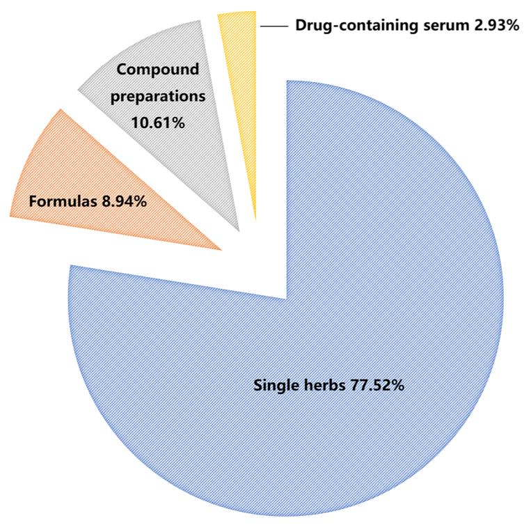
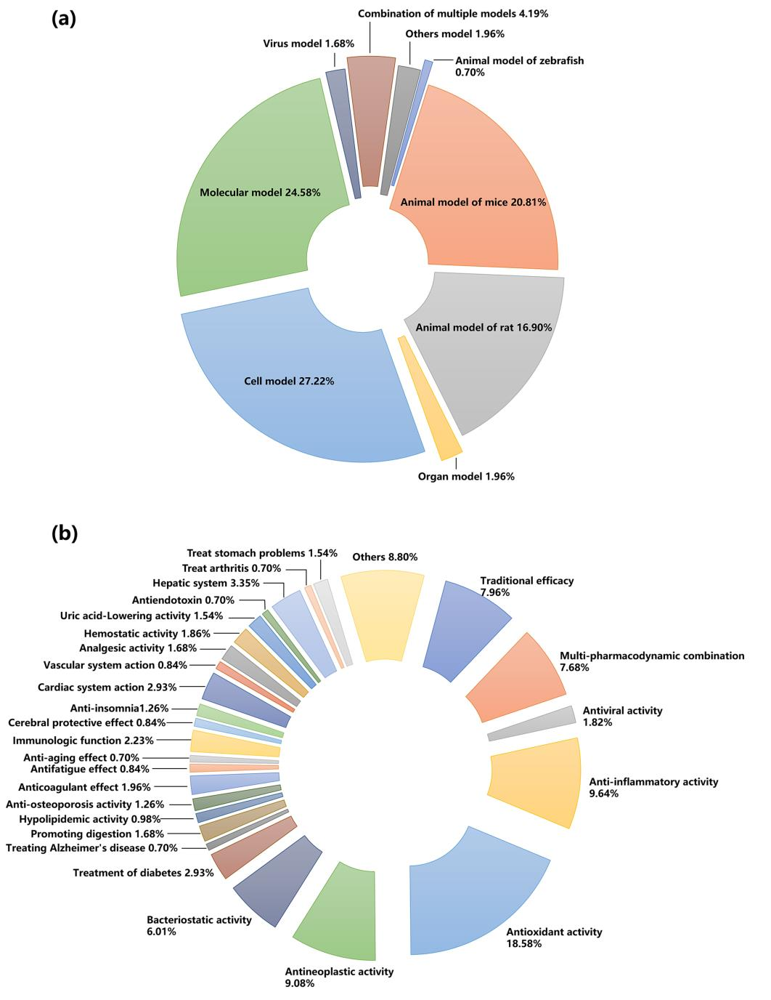

<!-- 方針: 総説につき「ほぼ全訳＋必要に応じた補足」。原文の構成・節立てに沿って忠実に訳す。表（Table 1〜5）は原文の情報量を落とさず翻訳・保持。化合物名・生薬のラテン名/英名は原文表記のまま残す（他論文の訳例に準拠）。「> 補足:」は訳者注。 -->

## 書誌情報

- 標題（原題）: Spectrum–Effect Relationships as an Effective Approach for Quality Control of Natural Products: A Review
- 著者・所属: Peiyu He†・Zhang Chunling†・Yaosong Yang・Shuang Tang・Xixian Liu・Jin Yong・Teng Peng*（成都中医薬大学 薬学院／School of Pharmacy, Chengdu University of Traditional Chinese Medicine, 中国・成都）†は共同筆頭著者、*は責任著者
- 掲載誌・巻号・DOI: *Molecules* 2023, 28, 7011. https://doi.org/10.3390/molecules28207011
- インパクトファクター: **4.6**（*Molecules*誌、JCR2024／Clarivate、2025年6月発表分。同誌はChemistry, Multidisciplinary分野で75/239位・Q2、Biochemistry and Molecular Biology分野で82/319位・Q2）
- 受理経過 / ライセンス: 受理 2023年9月5日（投稿）→ 2023年10月5日（改訂）→ 2023年10月6日（受理）→ 2023年10月10日（公開）。Open Access、Creative Commons Attribution (CC BY) 4.0ライセンス。

> 補足: 本稿は個別の生薬・製剤の分析論文ではなく、「スペクトル-効果相関（フィンガープリントと薬効データを化学統計的手法で結びつけ、有効成分を絞り込む研究モデル）」という方法論そのものを、2002年の提唱から20年間の進展にわたって俯瞰した総説です。当サイトで既出の`hgwd-uplc-fingerprint-spectrum-effect-qmarker.md`や`rdn-uplc-orbitrap-spectrum-effect.md`など個別研究の位置づけを理解する上での「地図」として読める内容です。

## 要旨（Abstract）

天然物質としての生物活性を持つ伝統中薬（TCM）は、その品質が臨床応用の鍵を握る。TCMの化学成分の種類・含量に基づくフィンガープリントは国際的に認められた品質評価法であるが、化学成分と薬効との相関を無視している。ケモメトリクス（化学統計学）的手法を通じて、TCMの化学成分を表すフィンガープリントをその薬効（薬力学）評価結果と相関させることで、TCMの「スペクトル-効果相関」を得ることができる。これにより薬効活性に関連する薬効成分の情報を明らかにし、TCM研究における化学成分研究と薬効研究の分断という限界を解決できる。スペクトル-効果相関の提唱から20周年を迎えるにあたり、本総説はTCM分野におけるその研究の進展を、フィンガープリントの確立、薬効評価法、ケモメトリクス手法、およびTCM分野における実際の応用を含めてレビューする。さらに、近年のスペクトル-効果相関研究における新戦略についても論じ、本技術の応用展望について議論する。

**キーワード**: スペクトル-効果相関; フィンガープリント; 薬効; ケモメトリクス手法; 天然物質; 伝統中薬

---

## 1. 序論（Introduction）

アジアなどの地域では、伝統中薬（TCM）に代表される天然物質中の生物活性化合物が幅広い生物活性を有している。歴代のTCM理論と実践に基づき、TCMは疾病の臨床治療において良好な治療効果を達成しており、世界的に大きな関心を集めている。TCM産業の近代化・国際化の進展に伴い、TCMの品質管理モデルの研究は、単純な外観形質の観察から顕微鑑別、さらに特定の薄層鑑別・内在成分の定量検出へと段階的に発展してきた[1]。しかし、単味生薬であれ複合製剤であれ、その治療効果は多成分・多標的・多経路の協働作用の結果であり、1つないし数個の化学成分の定性・定量検出だけではTCMの品質管理を実現することは困難である。現在、TCMのフィンガープリント技術はTCMの品質を評価しその一貫性・安定性を確保する有効な手法として世界的に広く用いられているが、TCMの薬効との相関は依然として不明確である[2]。薬理活性を指標とした分離法（bioaction-guided separation）やオンラインスクリーニング技術は生物活性化合物の探索に有効であるが、作業量が多く実験機器の要件が厳しいため、TCMの一般的な品質管理法としての高スループット応用が制限されている[3–6]。

TCMの原料的基盤と薬効を結び付けた品質評価モデルを確立するため、2002年にLiらは、特徴的なピークを持つフィンガープリント中の化学成分の変化を薬効と関連付けることで、TCMの「スペクトル-効果相関」を確立することを提唱した[7]。スペクトル-効果相関の研究モデルは次の通りである。差異のあるサンプルを基に試料の化学フィンガープリントを確立し、薬効モデルおよび適切な薬効指標を設定する。最大限に取得した化学情報と薬効データをデータ処理手法により相関分析し、TCMの品質管理を実現しうる薬効の物質的基盤を明らかにする。この研究モデルにより、化合物のみに着目し薬効を無視してきた従来の品質評価モデルの欠点を補うことができるだけでなく、フィンガープリント研究と薬効研究の有機的な統合を実現し、フィンガープリントと薬効の一致度を高め、スペクトル-効果相関に基づくTCMの品質評価という目的を達成することができる。

TCMなど天然物質の複雑なマトリックス中の有効成分の薬理情報はスペクトル-効果相関によって正確に反映され得るため、過去20年間、スペクトル-効果相関の研究はTCMの品質評価、製薬プロセスの最適化、薬物含有血清の探索において広く用いられてきた。PubMed、SciFinder、ScienceDirect、Scopus、Web of Science、Google Scholar、中国知網（CNKI）などのオンライン科学データベース、および博士・修士学位論文から過去20年間のスペクトル-効果相関に関する論文を検索し、重複を除去した結果、合計716件の関連研究論文が抽出された。このうち英語誌掲載が230件、中国語誌掲載が486件であった。発表論文数は年を追うごとに増加傾向を示した（Figure 1）。

初期には、一部の研究者がスペクトル-効果相関に関する研究をレビューし、研究対象とデータ処理法を説明していた[8–10]が、主に概念の説明に重点が置かれ、応用面での実践的な手引きに欠けており、研究者がスペクトル-効果相関研究の実験設計を十分に理解するには不十分であった可能性がある。特に近年、機器の発展と研究システムの成熟に伴い、研究者らはより高度な分析技術と薬理モデルを採用し、スペクトル-効果相関についてより深い研究を行うようになった。さらに、単量体化合物やコンポーネント・ノックアウトによる薬効検証、ネットワーク薬理学・分子ドッキングに基づく機序解明、ケモメトリクス手法に基づく薬効予測、単一マーカーによる多成分定量分析（QAMS）に基づく多成分品質評価など、新規の戦略もスペクトル-効果相関の研究に応用されるようになった。スペクトル-効果相関モデルの確立プロセスに基づき、本総説は、異なる試料の選択、適切な分析技術の選択、薬理モデルの確立（異なる動物モデルの選択を含む）、および化学量論的手法に基づくデータ処理法の選択を含む、フィンガープリントの確立について詳細に紹介・総括する。TCMの品質評価、製薬プロセスの最適化、薬物含有血清の探索におけるスペクトル-効果相関研究の最新の応用を、具体的かつ実践的な観点からレビューする。さらに、スペクトル-効果相関に応用されている最先端の戦略をまとめ、スペクトル-効果相関研究の現在の課題と将来動向についてさらに議論する。同時に、本総説はこの研究モデルの研究ガイドを読者に提供し、TCM品質管理分野におけるスペクトル-効果相関研究のさらなる応用への参考を提供することを試みる。

## 2. スペクトル-効果相関の確立プロセス

TCMの化学組成は、植物種、採取時期、栽培地域、保存条件、加工方法などの要因により大きく変動しうるため、その品質の一貫性に影響を与える。TCMの化学組成情報に基づく包括的かつ定量化可能な鑑別法として、フィンガープリントは天然薬物の品質管理における最も効果的な方法として国際的に認められており、TCMの特性によく適合し、その品質管理・分析を実現できる。フィンガープリントの確立後、対象となる有効成分群に基づく薬効評価をどのように完了するかが、TCMのスペクトル-効果相関研究のもう一つの鍵となる。現在、特定の疾患モデルの薬理研究には、動物・臓器・細胞・分子などの薬理モデルがしばしば用いられる。次に、適切な化学量論的手法により、TCMの化合物情報を表すフィンガープリントと、薬効指標を表す薬効情報とを組み合わせることで、スペクトル-効果相関の確立を完了できる。したがって、本章は主に、差異のあるサンプル、フィンガープリントの確立、薬効に基づく評価、ケモメトリクス手法に基づく相関付けという4点を含む。

### 2.1. 差異のあるサンプル（Samples with Differences）

公表文献の分析を通じて、単味生薬が研究のホットスポットとして大きな注目を集めており、スペクトル-効果相関の研究対象の70%以上を占めることが分かった（Figure 2）。現在、TCMのスペクトル-効果相関の研究では、試料の多くは異なるロット、異なる栽培地域、または異なるメーカーに由来しており、同一由来の試料も後続の差異処理を容易にするために用いられうる。異なる由来の試料については、組成と薬効の差異があるため、通常は同一の方法で各試料を個別に処理すれば十分である。例えば、産地の異なるArtemisia frigida Willd.（ヨモギ属植物）[11]やSaposhnikoviae Radix（防風）[12]の異なるロットは、同一の方法で前処理される。試料前処理の過程では、有効な部位を選択し有効成分を最大限保持することが最終的な目標となる[13]。さらに、単一由来の試料については、試料前処理は主として成分差異を意図的に作り出すことを目的とする。例えば、異なる抽出法や加工法によって差異のある試料を調製し、それらの間のスペクトル-効果相関における差異を探すことによって有効成分のスクリーニングが完了する[14,15]。

TCMの方剤・製剤のスペクトル-効果相関については、処方から1種または一群の薬物を段階的に除去し、残った薬物の薬効を検討することで、処方全体に対する除去薬物の効果を得ることができ、これにより処方・製剤中の単一薬物の相互作用を探索するとともに、複数薬物の最適な組み合わせを見出すことができる。例えば、Lanらは処方分解分析により梔子金花丸（Zhizi Jinhua pills）中の8種の生薬の定性的・定量的寄与を明らかにした[16]。また、異なるロットの方剤・製剤のスペクトル-効果相関の研究を通じて、主要な有効成分についても議論することができる。同様の研究は半夏白朮天麻湯（Banxia Baizhu Tianma decoction）[17]、複方甘草片（compound licorice tablets）[18]、天夢口服液（Tianmeng oral liquid）[19]でも行われている。

さらに、投与後の血清が真の薬効を持つ「製剤」である可能性もある。投与形態にかかわらず、作用を発揮する成分は主に体内の血液循環に入る成分であり、これらの成分は薬効の物質的基盤である可能性があり、主に生薬の原型成分、代謝物質、生理活性物質を含む。早くも2002年に、TCMの血清薬化学（serum pharmacochemistry）に関する研究が学者らにより報告されている[20]。薬物含有血清のスペクトル-効果相関の研究では、成分特性の異なる試料の多くは、投与後の異なる時点、異なる用量、または同時点での異なる製剤の投与後に採血することで得られる[21,22]。血清試料は通常単一の方法で前処理される。動物血清試料には血中成分の検出を著しく妨げる各種の内因性タンパク質が含まれるため、アセトニトリルやメタノールなどの有機溶媒をそのまま加えてタンパク質を沈殿させることが多い。さらに、検出感度を向上させるため、抽出により試料の精製・濃縮を行うことが多い。また、個体差を減らすため、異なる個体の血清試料を混合することもある。

### 2.2. フィンガープリントの確立（Establishment of Fingerprints）

試料前処理の完了後、TCM中の対象成分の分析法選択が特に重要となる。TCMフィンガープリントの確立に用いられる分析法は、主に（超）高速液体クロマトグラフィー（HPLCまたはUHPLC）、ガスクロマトグラフィー（GC）、キャピラリー電気泳動（CE）、薄層クロマトグラフィー（TLC）、紫外分光法（UV）、赤外分光法（IR）などである。中でもクロマトグラフィーが主流の方法であり、HPLCは最も一般的な分析法として認められている。分離効率が高い、選択性が高い、検出感度が高い、分析速度が速い、応用範囲が広いという特徴から、TCM成分の大部分はHPLCで分析・検出可能であり、TCMフィンガープリントを確立する際の第一選択法となっている。スペクトル-効果相関の研究では、TCM成分の複雑性・多様性のため、適切な分析法を選択することが特に重要である。

HPLCに異なる種類の検出器（UV/フォトダイオードアレイ検出器(DAD)/蒸発光散乱検出器(ELSD)）を接続することで異なる種類の化合物を検出でき[23,24]、異なる種類の検出器を直列接続することで複数種類の化合物を検出できる。そのため、小分子・大分子化合物の両方の検出に最も広く用いられている。GC-水素炎イオン化検出器(FID)は分離能が高い、感度が高い、選択性が高い、試料消費量が少ないという利点があり[25,26]、分解しにくい揮発性化合物の分離・分析に適している。HPLCと比較して、CE-UVは小・中分子化合物だけでなくHPLCでは分析が難しい大分子化合物も分析でき、分析速度が速く溶媒消費量が少ない[27,28]。TLCは入手が容易・簡便・迅速・安価であるが、目視によるデータ取得が必要でサンプルのスペクトル-効果相関の構築には不向きであり、応用例は多くない[29–31]。クロマトグラフィー分析法と比較して、UV[32]スペクトルは主に不飽和化学結合・共役構造を含む化合物の全体的な品質を反映し、IR[33]スペクトルは主に各成分の官能基情報を反映する。分光分析法を通じて異なる試料間の全成分情報の差異を見出すことができるが、個々の成分を正確に特徴付けることができないという欠点がある。これに基づき、（異なる検出器を含む）一般的な分析法数種の基本情報（利点・限界を含む）をTable 1に簡潔にまとめる。

**Table 1. スペクトル-効果相関研究における各種分析法の比較。**

| 分析法 | 利点 | 限界 |
| :--- | :--- | :--- |
| H/UHPLC-UV/DAD | 大半の化合物に適用可能。操作が簡便・特異性が高い・再現性が良い・感度が高い・直線範囲が広い・低コスト | 分析時間が長く溶媒消費量が多い。UV-可視吸収を持たない化合物は検出不可 |
| H/UHPLC-ELSD | 移動相より揮発性の低い多様な試料を検出できる汎用検出器 | 感度が低い（特にUV吸収を持つ化合物）。移動相への要求が高い |
| H/UHPLC-MS | ハイスループット検出、未知化合物の構造解析、高い安定性・感度・再現性 | 機器が高価、イオン源が汚染されやすい、操作が複雑 |
| GC-FID | 破壊型の質量汎用検出器。直線範囲が広く分離効率が高く分析速度が速く試料使用量が少なく検出感度が高い | 分析時間が長い。定性分析には既知化合物が必要 |
| GC-MS | 定性の信頼性が高く感度が高い。大半の揮発性化合物に適する | 機器が高価。熱に不安定な化合物の分析には不向き |
| CE-UV | 分析時間が短く溶媒消費・試料量が少なく低コスト。発色やフルオレセイン染色が不要 | 芳香族分子や共役構造を持ちUV領域で吸収する化合物しか検出不可 |
| UV | 非破壊分析、迅速、低コスト | 再現性が低く、スペクトルの重なりが著しく精度が低い |
| IR | 迅速、溶媒不要、前処理不要、低コスト | 定量精度が低く特異性が低い |
| TLC | 操作が簡便、機器要件が低い、分析速度が速い | 定量が難しく高分子化合物の分離が悪い |
| ICP-MS | 複数元素の同時検出に適し検出限界が低い | 装置が高価、自動化度が低く信号ドリフトが顕著 |
| 組み合わせ法 | 複数の機器分析法・検出条件を組み合わせることで化学組成情報をより包括的に把握できる | — |

分析機器の発展に伴い、より高いフラックス・強い感度・化合物構造の同定機能を持つ高分解能質量分析（MS）を上記の技術と組み合わせることができ、特にHPLC-MS[34,35]、GC-MS[36,37]、誘導結合プラズマ(ICP)-MS[38,39]は、TCMの内在成分をより包括的かつ正確に定性・定量分析できる。さらに、二次元クロマトグラフィーはより高いピーク容量とより強力な分離・分析能力を示し、TCMの複雑な有効成分の分析・スクリーニングにおいて優位性を発揮する[40]。

分析機器の開発に加え、一部の研究者は、複雑な物質系の全体的な化学的特性を完全に特徴付けることを目的として、従来技術に基づく革新的な概念を提唱している。TCMの組成が複雑であるため、単一の検出器または単一の分析法により確立された単一の化学フィンガープリントでは、その化学組成の特性を正確に表現することがしばしば困難である。TCMの「多次元フィンガープリント」の概念が提唱されている[41]。異なる試料前処理法・異なる機器分析法・検出器を用いて複数のフィンガープリントを取得することで、相補的な情報を実現し、より多くかつ完全な試料情報を取得し、最終的にTCMの化学的特性を効果的に表現できるフィンガープリントを得ることができる。さらに、HPLC-UVを用いる際、単一の検出波長で確立されたフィンガープリントでは試料の全体的な化学組成情報を包括的・体系的に反映できない場合がある。この場合、多波長融合フィンガープリント法によりこの限界を補い、試料のより包括的な分析を実現できる[42]。一般に、異なる試料についてはできるだけ一致するフィンガープリントを見出し、化学成分をできるだけ詳細に特徴付け、試料の重要な情報を見落とさないよう努める必要がある。適切な生薬試料分析技術を選択した後、原データの適切な前処理は、ピーク比較・類似度分析・データ変換などのさらなるデータ解析の前提条件となる[43,44]。スペクトル-効果相関確立の第一歩として、包括的かつ詳細なフィンガープリントは真の有効成分のスクリーニングのための強固な基盤を築くことができる。

### 2.3. 薬効に基づく評価（Evaluation Based on Pharmacodynamics）

TCMの生体への作用と機序は複雑であり、多成分・多標的・多経路の相乗効果により、適切な薬効評価法を見出すことは決して小さな課題ではない。適切な薬効評価法をどう確立するかは、次のように要約できる。すなわち、後続の実験のために、安定性が高く再現性の良い、適切で迅速かつ広く認められた薬効評価モデルと薬効指標を選択することである。動物モデルまたはin vitro臓器は薬物の直感的な薬効を観察するためによく用いられる。細胞培養・生化学的実験は通常、作用機序を研究するために用いられる。ここでは、過去20年間のスペクトル-効果相関研究における異なる種類の薬理モデルと異なる薬効指標の応用状況をまとめる（Figure 3）。

現在の薬効研究は主に動物・臓器・細胞・分子などの薬理モデルに基づいている。動物の全体レベルと比較して、他の3種の研究はTCMの生体全体への調節作用や、TCMの体内吸収・代謝・分布の複雑な過程を考慮していない。さらに、全体レベルの動物は「補腎壮陽」[24]、「活血化瘀」[45]、「健脾消腫」[46]といった伝統的な薬効に応答する際により代表性が高い。したがって現在、スペクトル-効果相関研究の多くは、ラット・マウス・ゼブラフィッシュなどの動物全体モデルを採用している。このモデルの利点は、生体の完全性と外界との正常な接触環境を確保できる点にあり、また後続の臨床研究とも整合性が高い。Figure 3に示すように、スペクトル-効果相関研究における動物モデルの割合は約38.41%であり、臓器モデルの1.96%、細胞モデルの27.22%、分子モデルの24.58%を上回った。しかし、in vivoモデルの欠点は、コストが高く、時間を要し、研究対象疾患の発症機序が複雑な場合、ヒトの疾患プロトタイプの全特徴を備えた動物モデルの確立が困難な点である。

臓器・細胞・分子レベルのin vitro実験は、対象部位を複雑な生体内環境から分離できるため、TCMの薬効活性を直接反映できる。さらに、薬効検出の低スループット問題も緩和できる。これらのin vitro薬効評価法は、低コスト・短時間・良好な再現性・良質な実験データを得やすいという理由から多くの場面で応用されている。例えば、抗炎症活性を測定する一酸化窒素(NO)阻害アッセイ[37]、抗菌活性を判定する3-(4,5-ジメチルチアゾール-2-チアゾリル)-2,5-ジフェニルテトラゾリウムブロミド(MTT)アッセイ[47]、抗酸化活性を評価する1,1-ジフェニル-2-トリニトロフェニルヒドラジン(DPPH)、2,2'-アジド-ビス(3-エチルベンゾチアゾリン-6-スルホン酸)二アンモニウム塩(ABTS)、鉄還元抗酸化力(FRAP)アッセイ[48]などである。したがって、スペクトル-効果相関の研究において抗酸化効果の応用割合が18.28%（原文ママ。Figure 3bの図示値は18.58%）と高いのも、この理由の一つと考えられる。とはいえ、これら単一モデルもまた生体の全体的作用を分離しており、多くの病理モデルにはなお限界がある。

血清薬理学の発展により、上記モデルに加え、薬物含有血清のin vivo・in vitro実験群も、スペクトル-効果相関研究のホットトピックとなっている。実験動物にTCMまたは方剤を1回または複数回投与し、一定時間後に血液試料を採取する[49]。血清はそのまま化学分析に用いるか、単離してTCMまたは方剤の粗抽出物の代替としてin vitro薬理実験に用いる。これに基づき、薬物含有血清は薬物が体内環境で薬理効果を生み出す過程を客観的にシミュレートできる[8]。同時に、薬物含有血清の包括的な分析に基づき、薬効実験を行うことで真の有効成分を確定し、有効成分の動的代謝を探索できる。しかし、薬物含有血清の研究には多くの課題がある。試料前処理過程が比較的複雑で成分の損失を生じやすく実験結果の偏差につながる、大量の血液を消費するため小動物には不向きである、動物モデルへの影響を評価しにくく大きな誤差を招く可能性がある、などである[49]。

薬効指標はTCMの薬効を測定する重要な基準である。現在、スペクトル-効果相関の評価には1つまたは複数の薬効指標が用いられている。Figure 3bに示すように、スペクトル-効果相関研究でよく用いられる薬効指標は、抗酸化（18.58%）、抗炎症（9.64%）、抗腫瘍（9.08%）、抗菌（6.01%）などである。さらに、薬効の包括性を確保するため、一部の学者はスペクトル-効果相関研究に多指標薬効評価を組み込むことを提唱している[41,50]。多指標の薬効指標は相互に補完・裏付けし合えるものの、時に矛盾した結果を導くこともある点には留意が必要である。TCMの疾病治療プロセスの違いを踏まえると、疾病の症状・根本原因における異なる成分の現れ方は異なりうるため、疾病の発症機序を明確にし薬物の作用機序・標的を明らかにすることが、正しく適切な薬効指標の選択につながる。総じて、TCMの主要な薬効を代表しうる標的化された指標を選択することが鍵となる。

### 2.4. ケモメトリクス手法に基づく相関付け（Association Based on Chemometric Methods）

得られたフィンガープリントとTCMの薬効情報との相関を実現し、そこから求める情報を掘り起こすことは、スペクトル-効果相関研究のもう一つの重要な関門である。現在、多様なケモメトリクス（化学統計学）手法がスペクトル-効果相関の研究に応用されており、灰色関連分析(GRA)、二変量相関分析(BCA)、階層的クラスター分析(HCA)、人工ニューラルネットワーク(ANN)、重回帰分析(MLR)、部分最小二乗回帰(PLSR)分析、正準相関分析(CCA)、主成分分析(PCA)などが含まれる。

異なるケモメトリクス手法にはそれぞれ重点の方向性がある。適切なデータ解析法を選択することで、複雑なTCMマトリックス中の薬効機序をより効果的に精密分析できる。同時に、分析結果の正確性を確保するため、多くの研究者は2つ以上のケモメトリクス手法を組み合わせてスペクトル-効果相関研究の解析法を選択し、総合的な分析効果を達成している。各データ解析法の特徴・利点・欠点をTable 2にまとめる。さらに、これらの手法は、各成分と薬効の相関を予測する手法、各成分の薬効への寄与度を明らかにする手法、データ構造を単純化して主要な有効成分を見出す手法の3つに分類することもできる[51]。

**Table 2. スペクトル-効果相関に応用されるケモメトリクス手法の比較。**

| 手法 | 特徴 | 利点 | 欠点 |
| :--- | :--- | :--- | :--- |
| GRA（灰色関連分析） | 変数間の変化傾向の幾何学的形状の類似度・差異度を測定することで、変数間の相関を測る | 既知情報を用いて未知情報を明らかにできる。データ需要・データ要件が少ない | ピークに対応する成分の全体的な寄与を記述するのが難しい |
| BCA（二変量相関分析） | 試料の原データを用いて2変数間の相関度を分析する | 2変数間の方向性を反映できる | 全体性が無視され、各ピークの薬効への相乗効果を説明できない |
| HCA（階層的クラスター分析） | 試料や変数を類似度に応じて分類する教師なし分析法 | 直感的・簡潔で、実際のモデリング前の予備分析を実現できる | フィンガープリントのピークと薬効指標の相関の大きさ・方向を反映できない |
| ANN（人工ニューラルネットワーク） | 既存情報の内部機能の複雑性と関係の曖昧性を考慮する | 非線形フィッティング能力、データの単純化、自己適応性 | モデル訓練時間が長く収束が遅く記憶システムが不安定。小標本データでは過学習の恐れがあり、ブラックボックスモデルで機序の理解が困難 |
| MLR（重回帰分析） | 従属変数と独立変数間の線形関係を確立する | 難しい指標を易しい指標から予測・分析できる | 独立変数間に多重線形関係がある場合、モデルの正確性を保証しにくい |
| PLSR（部分最小二乗回帰分析） | 多変数の場合に従属変数と独立変数間の線形関係を確立する | データ需要が少なく、データ情報を最大限活用でき、計算量が小さく予測精度が高い | 潜在変数の定義により結果の解釈が難しい |
| CCA（正準相関分析） | 2つの正準変数間の相関を用いて2群の指標間の全体的な相関を反映する | 複雑なデータを単純化し、線形相関の度合いを定量的に記述できる | 次元削減によりデータ内容が減少する。1変数対1変数の相関のみを考慮し、変数群内の変数間相関は考慮できない |
| PCA（主成分分析） | データの分散への寄与を最大限維持しつつデータの次元を削減する | データ抽出、冗長情報の除去 | 主成分の特性次元の意味が曖昧で解釈性に乏しい。次元削減によりデータが失われる場合がある |

#### 2.4.1. 各成分と薬効の相関を予測する手法

薬効指標とクロマトグラフィーピークとの相関は、GRA・BCA・HCA・ANN法により算出でき、有効成分を予測する可能性を提供する。GRAは変数間の曲線の幾何学的形状の類似度に基づいて変数間の相関を判定するものであり、情報量の少ない複雑な変数に特に適している[52]。さらに、GRAで得られる情報を用いて未取得の情報を予測することもできる。ただし、各ピークに対応する成分の全体的な寄与を記述することは依然として難しい。

BCAは、スペクトル-効果相関研究において最も広く用いられている相関ケモメトリクス手法の一つである。2変数間の相関係数を計算することで、ある変数と別の変数との関係の性質・密接さを研究する[53]。最もよく用いられる相関係数はピアソン相関係数であり、2変数間の相関の度合いと正負の方向を反映する。残念ながら、これもTCMの全体性を無視しており、各ピークの薬効への相乗効果を説明できない。

「類は類を呼ぶ」という原理に基づき、クラスター分析において最も広く用いられるデータ解析法であるHCA[54]は、異なる試料のフィンガープリントを分析し、その結果に基づいて適切な試料群を選択し、他のケモメトリクス手法と組み合わせてスペクトル-効果相関を研究するためによく用いられる。しかし、HCAはフィンガープリントのピークと薬効指標の相関の大きさ・方向を反映できない。そのため、通常は実際のモデリング前の予備分析として用いられる。

ANNは動物の神経ネットワークの信号伝達様式を模倣した数理モデリングアルゴリズムであり、情報処理を行う。中でも誤差逆伝播(BP)型ANNは、スペクトル-効果相関研究において最も広く用いられる、BPアルゴリズムに基づく多層順伝播型ネットワークの一つである。既存のフィンガープリント中の化学成分の信号を用い、変換・圧縮によって複雑な情報を効果的に抽出し、これらの信号と対応する薬効指標との間のファジィ写像関数関係を確立できる。しかし、その原理は経験リスク最小化に基づいているため、小標本データでは過学習のリスクを招く可能性がある[55]。

#### 2.4.2. 各成分の薬効への寄与度を明らかにする手法

上記4つのケモメトリクス手法では、フィンガープリント中の各成分の薬効への寄与率を記述することが難しい。回帰分析法により各ピークと薬効データの回帰モデルを確立することで、有効成分の薬効データへの寄与率を測定でき、その中でMLRとPLSRがよく用いられる2つの手法である。

複数の独立変数と単一変数による回帰モデルを確立することで、MLRは各独立変数が従属変数に与える影響についてパラメータ評価を行う手法であり、スペクトルと生物活性の関係を定量化する有用な方法である[33]。従属変数と独立変数間の線形関係を確立する際、計算の複雑さを単純化するため独立変数のスクリーニングにステップワイズ回帰がよく採用される。ただし、モデルに選択されなかったクロマトグラフィーピークの薬効関係は無視されることになる。しかし、独立変数間に多重線形関係がある場合や標本数が少ない場合、MLRは確立されたスペクトル効果モデルの正確性・信頼性を保証できないため、この場合はPLSRを用いることができる[56]。

内部変数が高度に線形相関している場合、PLSRはより効果的であり、標本数が変数数より少ないという問題をよりよく解決できる。データ情報を最大限活用できるだけでなく、計算量が小さい・予測精度が高い・定性的解釈が容易という利点もある[57]。さらに、直交射影潜在構造(OPLS)では、第一潜在変数は応答との共分散が最大となる方向に定義された顕在変数の線形結合を用いて計算される。以降の潜在変数は、第一潜在変数の周囲の残差分散（共分散ではない）の方向、すなわち第一・第二の間の平面において定義される。化学組成の表現と試料クラスとの間の判別分析(OPLS-DA)モデルは、試料クラスの予測を実現するために用いられ、2群の試料間の分離や差異変数の掘り起こしに適している。変数のモデルへの寄与は、変数重要度(VIP)値により探索できる。VIP値が大きいほど（一般に1.0超）寄与が大きい[58,59]。異なる化合物のVIP値をスクリーニングすることで、薬理指標との相関係数が高い有効化合物を容易に見出すことができる。

#### 2.4.3. データ構造を単純化して主要な有効成分を見出す手法

TCMの化学組成は複雑であり、多くの複雑な変数が相互に関連しているため、重要な有効成分を見出すことは容易ではない。CCAとPCAはいずれも次元削減の考え方を用い、元の複数の指標情報をいくつかの総合指標にまとめて分析することで、総合指標に基づき元の変数の相関度を判定する。要するに、これらは元の多次元データを2次元または3次元データに縮約して分析し、データの単純化という目的を達成できる[51]。2群の変数から抽出される最も代表的な2つの総合変数（2つの変数群内の変数の線形結合）が正準変数である。CCAは2つの正準変数間の相関を用いて2群の指標間の全体的な相関を反映できる。ただし、複雑なデータを単純化する一方で、次元削減後のデータ情報も減少する[60]。

PCAは次元削減技術を用いて元の複数変数をいくつかの総合変数（主成分、PC）に置き換え、元の変数の情報の大部分を保持する。一般に、PCの数は累積寄与率と固有値の大きさによって決定され、累積寄与率85%超・固有値λi≥1が適切とされる。しかし、PCAは数理モデルを通じて変数間の相関を定量的に分析することができないため、スペクトル-効果相関の研究ではクラスター分析・相関分析・回帰分析など他のケモメトリクス手法と組み合わせて用いられることが多い[22]。PCAとCCAはいずれも元の変数の適切な線形結合を構成することで異なる情報を抽出するが、PCAは1つの変数群内の相互依存性のみを扱うのに対し、CCAは2つの変数群間の相互依存性に拡張され、2群の変数間の関係の強さを測定する。

上記のケモメトリクス手法の分類から、各手法にはそれぞれ固有の特徴があることが分かる。これらの手法に共通するのは、薬効と相関する成分を見出そうとする点である。各データ解析技術の利点・欠点とその特徴を踏まえ、TCMのスペクトル-効果相関研究を推進する目的を達成するためには、これらの手法を包括的に応用し相互検証することが望ましい。

## 3. スペクトル-効果相関の応用（Applications of Spectrum–Effect Relationships）

### 3.1. TCMの品質評価（Quality Evaluation of TCM）

TCMなど天然物質の品質は、スペクトル-効果相関を用いてTCMおよびその複合製剤に含まれる薬効成分を正確に分析することで、科学的に評価できる（Table 3）。TCMの多くは野生で育成・栽培された天然物質に由来し、形状・色・香り・味などの伝統的な経験的基準によって異なる規格等級に分類できる。中薬材の商品規格等級は、TCMの品質を示す代表的な指標であるだけでなく、流通・取引における価格決定の根拠の一つでもある[61]。Anらはこの手法を用いて規格の異なる3等級の番瀉葉(Sennae Folium)を分析した。その結果、最上位等級は緑葉、次いで黄葉、病葉の順であった。彼らは6種のセンノシドがin vitro抗菌活性の物質的基盤および等級区分のマーカーである可能性を同定した[58]。同様のパターンは、12種の異なる商品規格を持つ三七(Notoginseng)[62]や3種の商業規格を持つ羌活(Notopterygii Rhizoma)[63]のスペクトル-効果相関研究にも成功裏に応用されている。異なる規格のTCM間のスペクトル-効果相関の研究を通じて、TCM商品規格の分類に参考を提供することができる。

植物の遺伝型、特有の生態環境、栽培措置の共同作用のもとで、道地薬材はその産地に応じて形成される[64]。多産地栽培は中薬材の特徴の一つであり、スペクトル-効果相関の研究は異なる産地のTCMの品質管理に用いることができる。中国の異なる4産地に由来する防風(Saposhnikoviae Radix)の10ロットを用いて、1-フェニル-3-メチル-5-ピラゾロン(PMP)-HPLC、フーリエ変換赤外分光法(FT-IR)、高性能サイズ排除クロマトグラフィー(HPSEC)フィンガープリントと、その多糖の抗アレルギー活性とのスペクトル-効果相関が研究され、内モンゴル産の原料が最良の抗アレルギー活性を有することが確認された[12]。また、Jiangらは、中国各地域由来の49試料における化学組成とその抗DPPH活性との相関を研究することで、産地の異なる中国プロポリスの品質評価法を開発した[56]。さらに、TCMには多様な種があり、同一植物にも複数の薬用部位が存在する。これら異なる品種・異なる薬用部位の化学フィンガープリントの特徴は概して類似しているものの、その薬効基盤はスペクトル-効果相関によりさらに明確化できる。近年、一部の学者は黄連(Rhizoma Coptidis)[65]、キク(Chrysanthemum morifolium)[66]、シコン(Zicao)[67]の異なる品種のスペクトル-効果相関をそれぞれ研究し、また桑(Morus alba L.)[68]と栝楼仁(Trichosanthis Semen)[69]の異なる薬用部位の物質基盤・活性も探索している。

単味生薬の品質評価に加え、スペクトル-効果相関はTCM方剤・製剤中の主要な有効物質を特定し、その主要有効物質に着目することでその品質を評価するためにも用いられる。方剤・製剤間のスペクトル-効果相関研究の難しさは、複合フィンガープリントの高スループット化と、伝統的な薬効に基づく薬効モデルの選択にある。分析機器・薬効モデルの発展に伴い、過去5年間で方剤・製剤間のスペクトル-効果相関に関する報告が増加している。中薬薬対（生薬ペア）とは、方剤における比較的固定された最小処方単位である2種のTCMの共通した組み合わせ使用を指す。中でも、丹参(Salvia miltiorrhiza)と紅花(Carthamus tinctorius)からなる丹参-紅花薬対は、活血の効果を持つTCMの組み合わせであり、心血管疾患の治療に広く用いられている[70]。近年、一部の学者は丹参-紅花薬対の抗血管性認知症作用[71]、チロシナーゼ阻害作用[72]、活血作用[73]をスペクトル-効果相関により系統的に研究している。

より多くの種類のTCMを含む一部の方剤についても、半夏白朮天麻湯(Banxia Baizhu Tianma Decoction)[17]、半夏瀉心湯(Banxia Xiexin Decoction)[74]、四君子湯(Si Jun Zi Tang)[75]など各種化合物の薬効成分の発見にスペクトル-効果相関が成功裏に応用されている。祁玉三龍湯(Qi-Yu-San-Long decoction, QYSLD)は10種の生薬からなるTCM方剤で、主に非小細胞肺がん(NSCLC)の臨床治療に用いられる[76]。Huangらは、GRA・PLSR・BPANNの3つのケモメトリクス手法を用いてQYSLDのUHPLC-Q/TOF-MSフィンガープリントを確立し、これを方剤の抗酸化作用・抗NSCLC作用と相関させ、異なる活性に関連する異なる物質基盤を見出した。最終的に、スクリーニングされていない成分と比較して、スペクトル-効果相関により得られた潜在的有効成分は、確認実験によりより優れた薬効を示した[55]。方剤に加え、スペクトル-効果相関の研究は現代中薬製剤の品質評価システムの確立を導くためにも用いられる。Lanらは、梔子金花丸(Zhizi Jinhua pills)中の8種の単味生薬の寄与をスペクトル-効果相関によりインテリジェントモデルで解析した[16]。複数の抗酸化活性を持つ有効成分を組み合わせることで、フィンガープリント輪郭管理に基づく品質モニタリング法が実現されている。また、ある研究では、ミクログリア媒介性神経炎症を抑制する銀丹心脳通軟カプセル(Yindan Xinnaotong soft capsule)を用いて、画像に基づくフィンガープリント-薬効スクリーニング戦略を確立した[77]。タンシノン類とフラボノイド類が製剤中の潜在的抗神経炎症化合物であることが判明した。さらに、心可舒錠(Xinkeshu Tablets)[78]や榕爾益腎口服液(Rong'e Yishen oral liquid)[79]などのTCM製剤の品質評価においても、スペクトル-効果相関により多くの成果が得られている。

**Table 3. TCM品質評価におけるスペクトル-効果相関の応用。**

| 目的 | 対象TCM | フィンガープリント法 | 薬効評価 | ケモメトリクス | 同定成分 | 文献 |
| :--- | :--- | :--- | :--- | :--- | :--- | :--- |
| 等級 | 番瀉葉(Sennae Folium) | UHPLC-Q-TOF/MS | 瀉下作用（リパーゼ阻害活性） | PCA, OPLS-DA | センノシド・アントラキノン類8種、フラボノイド類11種、ベンゾフェノン類3種 | [58] |
| 等級 | 三七(Notoginseng) | HPLC | 止血作用（ラット血漿再石灰化実験・ラット胃出血実験） | PLSR | Notoginsenoside R1, Ft1, ginsenoside Rg1・Re・Rg2・Rh1・F1・Rk1, dencichine, 未確認ピーク4,6,8,9,13,14,15 | [62] |
| 等級 | 羌活(Notopterygii Rhizoma) | HPLC | 抗炎症活性（マウス耳腫脹モデル・LPS誘導マクロファージRAW264.7モデル） | GRA | 17成分（クロロゲン酸、フェルラ酸、イソインペラトリンなど） | [63] |
| 産地 | 防風(Saposhnikoviae Radix) | PMP-HPLC, FT-IR, HPSEC | 抗アレルギー活性（RBL-2H3細胞MTTアッセイ） | GRA | 単糖2種（ラムノース・ガラクトース）、多糖断片(Mn=8.67×10⁶〜9.56×10⁶Da)、FT-IR吸収ピーク892cm⁻¹ | [12] |
| 産地 | 中国プロポリス | HPLC | 抗酸化活性（DPPHアッセイ） | PCA, MLR | イソフェルラ酸、カフェ酸、カフェ酸フェネチルエステル、3,4-ジメトキシケイ皮酸、クリシン、アピゲニン | [56] |
| 品種 | 黄連(Rhizoma Coptidis) | UHPLC/QqQ-MS | アルツハイマー病治療（抗アセチルコリンエステラーゼ活性） | Random forest, Boruta, Pearson相関 | コルンバミン、ベルベリン、パルマチン | [65] |
| 品種 | キク(Chrysanthemum morifolium) | HPLC | 抗酸化活性（DPPH, OH, ABTSアッセイ） | PCA | クロロゲン酸、3,5-O-ジカフェオイルキナ酸、未知ピーク1、4,5-O-ジカフェオイルキナ酸、kaempferol-3-O-rutinoside | [66] |
| 品種 | シコン(Zicao) | UHPLC-QTRAP-MS/MS | 抗腫瘍活性（HeLa細胞） | OPLS | 27成分（シコニン類、シコノフラン類、β,β-ジメチルアクリルシコニンなど） | [67] |
| 薬用部位 | 桑(Morus alba L.) | HPLC | 抗糖尿病活性（α-グルコシダーゼ阻害活性） | OPLS | モリン、桑根皮素C、桑酮G、モルシン、ケンフェロール、ケルセチン、ルチン、イソクエルシトリン、1-デオキシノジリマイシン | [68] |
| 薬用部位 | 栝楼仁(Trichosanthis Semen) | HPLC | 抗凝固活性（マウスのプロトロンビン時間・活性化部分トロンボプラスチン時間） | Deng's correlation degree | アデニン、ウラシル、ヒポキサンチン、キサンチン、アデノシン | [69] |
| 方剤 | 丹参-紅花薬対 | HPLC | 血管性認知症への治療効果（ゼブラフィッシュのフェニルヒドラジン誘発血栓緩和・ビスフェノールF/ポナチニブ誘発脳損傷改善） | PLSR | ダンシェンス、ヒドロキシサフラワー黄A、kaempferol-3-O-rutinoside、ロズマリン酸、リトスペルミン酸、サルビアノール酸B・A、ジヒドロタンシノンI、クリプトタンシノン、タンシノンI・IIA | [71] |
| 方剤 | 半夏白朮天麻湯 | UHPLC | 抗酸化・抗炎症活性（活性酸素種・高感度CRPモデル） | HCA, BCA | ガストロジン、リキリチン、ヘスペリジン、イソリキリチン、イソリキリチゲニン | [17] |
| 方剤 | 四君子湯 | UPLC | 抗増殖効果（PC9細胞） | HCA, CCA | ginsenoside Ro, ginsenoside Rg1 | [75] |
| 方剤 | 祁玉三龍湯(QYSLD) | UHPLC-Q/TOF-MS | 抗酸化活性（DPPH, FRAPアッセイ）・A549細胞の増殖/水平遊走/垂直遊走/浸潤能抑制 | GRA, PLSR, BPANN | 6つの薬効にそれぞれ対応する8・9・6・22・5・12成分 | [55] |
| 製剤 | 梔子金花丸 | HPLC | 抗酸化活性（マウス血清SOD・MDA、DPPH・ABTSアッセイ） | OPLS | 30本中24本のフィンガープリントピーク | [16] |
| 製剤 | 銀丹心脳通軟カプセル | LC-MS, GC-MS | 抗神経炎症活性（ミクログリア媒介性神経炎症抑制） | Pearson相関分析 | スクテラリン、apigenin-7-O-glucuronide、スクテラレイン、アピゲニン、プレツァキノンA、ジヒドロタンシノンI、タンシノンI、クリプトタンシノン、タンシノンIIA、ミルチロン | [77] |
| 製剤 | 心可舒錠 | HPLC | 抗不整脈効果（ゼブラフィッシュ幼生の心拍回復率） | OPLS | ダンシェンス、サルビアノール酸A・B、ダイゼイン、プエラリン | [78] |
| 製剤 | 榕爾益腎口服液 | HPLC・電気化学フィンガープリント | 抗酸化活性（ABTS） | PLSR, BCA | 48共通ピーク中15成分 | [79] |

### 3.2. TCMの製薬プロセス最適化（Pharmaceutical Process Optimization of TCM）

スペクトル-効果相関は、TCMおよび複合製剤の品質評価だけでなく、TCM製薬プロセス最適化の評価システムとしても提供され得る。スペクトル-効果相関研究を通じて、有効成分の発見・追跡を実現し、製薬技術の最適化プロセスを導くことができ、有効成分を最大限保護しつつ潜在的な毒性物質を減らし、TCMの臨床効果を最大化するという目的を達成できる。実際の応用では、有効成分の性質に応じて有効画分と抽出プロセスをスクリーニング・最適化できる（Table 4）。枳殻(Aurantii Fructus)は中国でよく用いられる理気類生薬であり、消化管運動障害(GMD)の治療に広く用いられている。Qiaoらは、石油エーテル・クロロホルム・酢酸エチル・n-ブタノール・水の5画分の枳殻について、正常マウスとGMDラットへの作用を体系的に比較した。その結果、スペクトル-効果相関により最も強い理気作用を持つ酢酸エチル画分を見出し、そのうち9つの化合物が主要な理気成分であった[80]。しかし研究者らは、枳殻には体液を損なう可能性のある強い燥性があることを発見した[81]。枳殻の異なる画分の燥性とその物質基盤をさらに探索するため、上記の研究を基に、酢酸エチル画分と石油エーテル画分がモデルラットにおける枳殻の燥性作用の主要な由来であることがスペクトル-効果相関により明らかにされた[82]。さらに、一部の学者は紫珠(Callicarpa nudiflora)[83]、紅芪(Radix Hedysari)[84]、プロポリス[85]など各種TCMのスペクトル-効果相関を研究し、主要画分の有効成分の所在を特定している。単一因子実験と組み合わせて、白芷(Angelica dahurica)の異なる抽出条件下でのフリーラジカル消去能を比較し、最適な抽出条件を得た[86]。この結果は白芷の抗酸化成分の有効利用に参考を提供する。新規抽出技術の登場により、従来の抽出法と比較して有効物質の抽出効率に改善の余地がある場合がある。黒種草(Nigella glandulifera Freyn)の抗糖尿病有効成分に対するマイクロ波支援抽出法が、スペクトル-効果相関に基づき開発された[87]。従来の抽出法と比較して、この方法は所要時間が短く収率が高く生物活性も高い。

加工（炮製）は、TCM理論の指導の下、特定の臨床ニーズに応じて中薬の使用を促進する中国独自の製薬技術である[88]。TCMの加工後は薬効を高め毒性を低減できる場合があり、例えば続断(Radix Dipsaci)の抗骨粗鬆症作用は塩製後に強化され[89]、何首烏(Polygonum multiflorum Thunb.)は加工後に毒性が低減する[90]。加工前後の試料のスペクトル-効果相関研究により、薬効変化に関連する物質を正確に見出すことができ、加工前後のTCMの薬効変化を説明できる。Yangらは、UPLCに基づき、生および蜂蜜炙の款冬花(Farfarae Flos)試料の鎮咳・去痰・抗炎症活性の間で初めてスペクトル-効果相関を確立し、生・加工いずれの款冬花にも鎮咳・抗炎症効果があるが、加工後にのみ去痰効果があることを証明した[91]。ある報告では、異なる蒸製パラメータ下での三七(Panax Notoginseng)の化学的性質と神経保護/抗酸化活性を組み合わせ、スペクトル-効果相関に基づく手法を確立し、加工中のTCM成分の変化を分析した[92]。さらに、生三七と蒸製三七の間のスペクトル-効果相関についても、抗炎症・抗凝固・抗酸化活性の観点から系統的に研究されている[93,94]。

**Table 4. TCM製薬プロセス最適化探索におけるスペクトル-効果相関の応用。**

| 目的 | 対象TCM | フィンガープリント法 | 薬効評価 | ケモメトリクス | 最適化結果 | 文献 |
| :--- | :--- | :--- | :--- | :--- | :--- | :--- |
| 抽出画分 | 枳殻(Aurantii Fructus) | UHPLC-Q-TOF/MS | 消化管運動促進活性（正常マウス・GMDモデルラット） | PCA, BCA, OPLS | 酢酸エチル画分が主要有効画分 | [80] |
| 抽出画分 | 紫珠(Callicarpa nudiflora) | HPLC | 抗炎症効果（炎症ラットの足腫脹） | Pearson分析, OPLS | 画分1・2・3・5が対照群より強い抑制効果 | [83] |
| 抽出画分 | 紅芪(Radix Hedysari) | HPLC | 骨粗鬆症治療（ラットの最大骨量増加） | GRA | 紅芪の全抽出物が最も有効 | [84] |
| 抽出画分 | プロポリス | UHPLC-MS | 抗酸化活性（DPPH, ABTS）・抗菌活性（グラム陽性・陰性菌、真菌） | PLSR | 50%エタノール抽出物が良好な抗酸化能を確保。全抽出物が抗菌・抗真菌活性を示した | [85] |
| 抽出条件 | 白芷(Angelica dahurica) | GC-MS | 抗酸化活性（DPPH, FRAP, ABTS） | HCA, PCA, PLSR | 超音波抽出、80%メタノール、液固比20:1(mL/g)、抽出時間30分 | [86] |
| 抽出条件 | 黒種草(Nigella glandulifera Freyn) | HPLC | 抗糖尿病効果（in vitro抗酸化活性、アルドース還元酵素・PTP1Bアッセイ） | GRA | マイクロ波支援抽出、固液比1:20 g/mL、エタノール濃度70%、抽出時間35.00分、抽出温度66℃ | [87] |
| 加工条件 | 款冬花(Farfarae Flos) | UPLC | 鎮咳（アンモニア誘発マウス咳嗽）・去痰（腹腔内フェノールレッド投与マウス）・抗炎症（キシレン誘発マウス耳腫脹） | GRA, PLSR | 蜂蜜炙後のみ去痰効果を有する | [91] |
| 加工条件 | 三七(Panax notoginseng) | HPLC | 抗アルツハイマー病活性（PC12細胞のAβ1-42細胞毒性軽減による神経保護活性）・抗酸化効果（ORAC） | PLSR | 蒸製時間が短く蒸製温度が高いほど神経保護・抗酸化効果が優れる | [92] |
| 加工条件 | 何首烏(Polygonum multiflorum) | UPLC-Q-TOF-MS | 肝毒性（L02, HepG2肝細胞） | GRA, OPLS, BPANN | エモジンジアンスロン類、emodin-8-O-β-D-glucopyranoside、PM 14-17が毒性マーカーとなり得る | [90] |
| 加工条件 | 巴戟天(Morinda officinalis) | HPLC | 生殖系酸化ストレス損傷への保護効果（シクロホスファミド誘発雄マウス） | GRA | フルクトフラノシルニストース、ニストース、1-ケストース、イヌリンオリゴ糖・イヌロオリゴ糖が加工品のQ-markerとなり得る | [14] |
| 方剤・製剤加工条件 | 芩金化痰湯(Qin Jin Hua Tan Tang) | UHPLC | 抗炎症活性（キシレン誘発マウス耳腫脹モデル） | GRA, PLSR, 冗長性分析 | エタノール抽出物1が良好な抗炎症活性を示す | [95] |
| 方剤・製剤加工条件 | 何首烏-牛膝方(Radix Polygoni multiflori-Achyranthes bidentate) | HPLC | 抗骨粗鬆症効果（レチノイン酸誘発マウス） | MLR | 各画分の活性順位: 石油エーテル＞水＞エタノール＞酢酸エチル＞メタノール＞アセトン | [96] |
| 方剤・製剤加工条件 | 牛黄上清丸(Niuhuang Shangqing Pill) | 2D-LC | 抗菌成分（抗肺炎連鎖球菌） | PCA, OPLS, OPLS-DA | 全画分が異なる程度の抗肺炎連鎖球菌効果を示し、60%エタノール画分が最強 | [40] |
| 方剤・製剤加工条件 | 元胡止痛方(Yuanhu Zhitong prescription) | UPLC | 抗アルコール性胃潰瘍作用（無水エタノール誘発胃病変マウス） | GRA, PLSR | 酢炙延胡索で調製した元胡止痛方が最も強い効果 | [97] |
| 成分配合 | 立冲勝随飲(Lichong Shengsui Yin) | HPLC | 抗卵巣がん活性（in vitro腫瘍抑制実験、担癌ヌードマウスの生存延長率） | 回帰分析(ENTER法・ステップワイズ法)、相関分析 | 群3と群9の組み合わせが抗卵巣がん活性を示す | [98] |
| 成分配合 | 丹参-川芎薬対(Salviae Miltiorrhizae Radix et Rhizoma-Chuanxiong Rhizoma) | HPLC | トロンビン阻害活性（THR・第Xa因子阻害活性アッセイ） | CCA | 丹参:川芎=1:1の比率が第Xa因子阻害で最強 | [99] |
| 成分配合 | 莪朮-三稜(Curcumae Rhizoma-Sparganii Rhizoma) | HPLC | 抗腫瘍活性（A549, HepG2, Hela, BGC-823, MCF-7細胞） | Random forest | 80%エタノール溶出画分が強い抗腫瘍効果 | [100] |
| 成分配合 | 朱砂安神丸(Zhusha Anshen Pill) | HPLC | 鎮静催眠効果（マウス自発運動量試験・ペントバルビタール誘発睡眠試験） | MLR, GRA | Hg2+をFe2+に置換し鉄霜安神処方(Tieshuang Anshen Prescription)を創製 | [101] |

> 補足: 何首烏(PM 14-17)や朱砂安神丸（水銀→鉄への置換）の事例は、スペクトル-効果相関が「有効性の最大化」だけでなく「毒性マーカーの特定・より安全な処方への改良」にも使えることを示す好例です。QC実務では、単なる規格試験の設計だけでなく、安全性プロファイルの根拠づけにも応用できる観点として参考になります。

### 3.3. TCM薬物含有血清の探索（Exploration of Drug-Containing Serum of TCM）

血清フィンガープリントの直接分析法は、体内代謝がTCMに与える影響を排除でき、製剤の薬効物質基盤をより良く反映できるため、薬効物質基盤を決定するためのより効果的な手段である（Table 5）。黒参（黒ニンジン、Black ginseng）はニンジンの加工品である。ラットに黒参抽出物を胃内投与して薬物含有血清を得た。MTTアッセイにより前立腺がん細胞の増殖抑制効果が検出され、黒参の抗前立腺がん有効成分がスペクトル-効果相関により確認された[102]。Zhangらは、中大脳動脈閉塞ラットに養陰通脳顆粒(Yangyin Tongnao Granules)を異なる時点で投与した際の血漿フィンガープリントをHPLCにより決定した。薬物投与血漿中の炎症因子レベルの異なる時点での変化を検出し[103]、スペクトル-効果相関の研究により6成分が炎症指標と相関することを見出した。薬物含有血清のスペクトル-効果相関に基づく戦略は、防已黄耆湯(Fangji Huangqi Tang)の糸球体保護効果[21]や大黄蟅虫丸(Dahuang Zhechong Pill)の抗肝がん効果[104]の有効成分スクリーニングにも用いられている。さらに、スペクトル-効果相関は、薬物安全性の観点からTCMの品質を管理するため、毒性・副作用関連成分の研究にも応用できる。双黄連注射液(Shuang Huang Lian injection)は急性呼吸器感染症治療に有効な中薬であるが、多くの重篤なアナフィラキシー反応を引き起こす。製剤をラットの尾静脈に注射し、in vivoで血清試料を採取してスペクトル-効果相関が研究された[105]。クロロゲン酸などの成分が製剤中のアナフィラキシー様反応成分として同定され、他のTCM製剤におけるアレルギー成分のスクリーニングを導く指針となった。

**Table 5. TCM薬物含有血清の探索におけるスペクトル-効果相関の応用。**

| 対象TCM | フィンガープリント法 | 薬効評価 | 動物 | ケモメトリクス | 同定成分 | 文献 |
| :--- | :--- | :--- | :--- | :--- | :--- | :--- |
| 黒参(Black ginseng) | HPLC | 抗がん活性（前立腺がん細胞DU145のMTTアッセイ） | ラット | BCA, GRA | 主にジンセノシドRg5・S-Rg3・R-Rg3・RK1・S-Rg2 | [102] |
| 養陰通脳顆粒(Yangyin Tongnao Granules) | HPLC | 炎症因子（腫瘍壊死因子-α, インターロイキン-18） | 脳虚血再灌流障害ラット | GRA, MLR, PLSR | 6成分 | [103] |
| 防已黄耆湯(Fangji Huangqi Tang) | UHPLC-ESI-Q-TOF-MS | 抗アドリアマイシン腎症生物効果（シスタチンC、血中尿素窒素、血清クレアチニン） | ラット | CCA | テトランドリン、N-メチルファンチノリン、テトランドリン-M2〜M4、ファンチノリン、キュリン、リコリコン-M1、リコカルコンB-M3、フェンファンジンF-M2、グリチルレチン酸 | [21] |
| 大黄蟅虫丸(Dahuang Zhechong Pill) | UPLC | 抗肝がん効果（HepG2, HUVEC細胞） | ジエチルニトロソアミン誘発肝硬変・肝細胞がんラット | PLSR | アラントイン、ヒポキサンチン、サリドロシド、ヒドロキシパエオニフロリン、リキリチン、イソリキリチンほか計26成分 | [104] |
| 双黄連注射液(Shuang Huang Lian Injection) | UPLC | アナフィラキシー様成分のスクリーニング（RBL-2H3細胞） | ラット | 回帰分析, CCA | クロロゲン酸、シリンギン、フェルラ酸誘導体、5-ヒドロキシ-7,3',4',5'-テトラメトキシフラボン、カフェ酸メチルエステル | [105] |

## 4. スペクトル-効果相関における新戦略（Novel Strategy in Spectrum–Effect Relationships）

スペクトル-効果相関研究の継続的な発展に伴い、その研究体系はさらに拡張されており、TCM品質評価モデルのための一連の新戦略が開発されている。一部の研究では、スペクトル-効果相関の基準により得られた有効化合物だけでは満足せず、最終結果の正確性を確保するために初期結果の化合物の薬効活性をさらに検証している。さらに、スペクトル-効果相関とネットワーク薬理学・分子ドッキング技術との組み合わせにより、得られた有効化合物の作用機序を解明でき、その後の薬効機序研究の方向性を示すことができる。また、QAMS技術も現行の研究戦略と組み合わせることができ、有効化合物の定量分析に寄与する。

### 4.1. 単体化合物・コンポーネント「ノックアウト」による薬効検証

スペクトル-効果相関の研究では、化学量論的手法により薬効活性を持つ一部のクロマトグラフィーピークがスクリーニングされ、研究者はしばしば標準物質の保持時間・質量分析同定などの技術により化合物の定性分析を完了し、結果の正確性を検証する。しかし、クロマトグラフィーピークの構造同定が達成できない場合もあり、これはスペクトル-効果相関の結果にとって欠陥となる。構造が確定した有効成分については、選択された単一または複数成分を再構成して再度薬効試験を行い、候補有効成分と元のTCMとの間に生物学的活性の等価性があるかを検証することができ、これは既存の報告を参照できる[106,107]。近年、「ノックアウト（knock-out）」法に基づくもう一つの薬効検証戦略がスペクトル-効果相関研究に応用されている。TCMの薬効物質を確定した後、成分「ノックアウト」によりTCMから有効物質を除去し、有効物質除去後のTCMの薬効変化を調べる[108,109]。この方法により、TCM中で薬効特性を持つ化合物の薬効的役割がさらに明確化され、これもまたスペクトル-効果相関研究における有効成分検証の補完となる。

> 補足: 「ノックアウト法」は薬理学の遺伝子ノックアウトの発想を化学成分に応用したもので、フィンガープリントから特定成分を除去（または低減）した試料を再調製し、薬効が実際に低下するかを確認する手法です。相関分析だけでは「相関＝因果」の保証がないため、この除去実験は候補成分の因果的な寄与を補強する重要な検証ステップと位置づけられます。

### 4.2. ネットワーク薬理学・分子ドッキングに基づく機序解明

「多成分・多標的・多経路」パラダイムに基づくネットワーク薬理学は、ネットワークモデルの構築により薬物・標的・代謝経路の関係を分析する新しい創薬研究のパターンである[110]。ネットワーク薬理学とスペクトル-効果相関研究の組み合わせにより、有効成分の薬物-標的-経路ネットワークを確立し、これらの有効成分が一部の重要な標的とその経路に及ぼす影響を予測することで、薬効機序を探索できる。例えば、莪朮(Curcuma wenyujin Y. H. Chen et C. Ling)の駆瘀血作用の薬効物質基盤を探索するため、血漿中の10成分の標的部位・代謝経路がネットワーク薬理学により予測された[111]。ネットワークにより、10成分に密接に関連する80の標的が予測され、そのうち48標的はアラキドン酸代謝・スフィンゴ脂質シグナル伝達経路・リノール酸代謝など159の代謝経路に関連することが分かった。しかし、ネットワーク薬理学は「成分-標的-経路」の関連性を示すものの、実験による相関検証を欠くことが多い。

分子ドッキングは、受容体標的タンパク質の特性と、受容体標的タンパク質と化合物との相互作用様式に基づく化合物スクリーニング法であり、化合物と結合する受容体を逆スクリーニングするためにも用いられる[112]。これはリガンドと受容体など分子間の相互作用の理論的シミュレーションであり、その結合様式と親和性を予測する[113]。スペクトル-効果相関の研究では、分子ドッキング技術は有効化合物の範囲をさらに絞り込み、構造-活性相関のレベルから有効化合物の可能な機序を明らかにするためによく用いられる。スペクトル-効果相関と分子ドッキング戦略を組み合わせた分析により、Zhuらは、莕草（Sceptridium ternatum）由来のquercetin 3-O-rhamnosid-7-O-glucosideがインターロイキン-6に結合し高い抗炎症活性を持つことを明らかにした[114]。この戦略は、金銭草(Glechomae Herba)の抗尿路結石活性成分とCaSR受容体との分子ドッキング[115]や、釣藤鈎(Uncariae Rammulus Cum Uncis)の抗糖尿病成分とα-グルコシダーゼとの分子ドッキング[116]にも成功裏に応用されている。

### 4.3. ケモメトリクス手法に基づく薬効予測

スペクトル-効果相関はTCMのフィンガープリントを実際の薬効と関連付ける特性を持つため、TCMの薬効を予測するために用いることができる。化学量論的手法により、複数試料のピーク情報と薬効情報を関連付けたスペクトル効果関係モデルを訓練できる。このモデルにより、既知試料のピーク情報を用いて対応する薬効を予測できる。現在、これは抗酸化[27]、止血[117]、免疫活性[118]の予測に成功裏に用いられている。ただし、この戦略の適用にはモデル内の試料数を厳格に管理する必要がある。標本サイズが小さく入力情報が少ないと、モデルのロバスト性の欠如と予測精度の低下につながる。

### 4.4. QAMSに基づく多成分品質評価

2006年、Wangらは初めて、TCMの多成分品質評価にQAMS法を用いることを提唱し、対照品の不足により多成分の定量分析が制限されるという問題を解決した[119]。多指標定量分析において、QAMS法はある成分（対照品供給あり）を内部標準として、この成分と他成分との間の相対補正係数(RCF)を確立し、RCFを通じて他成分の含量を算出する。現行の多指標成分定量法と比較して、QAMSは経済性・正確性という特徴を持つため、広く普及・応用されている。QAMS法とスペクトル-効果相関研究を組み合わせることで、スペクトル-効果相関により生薬の有効成分を決定し、見出された化学成分をQAMS法により包括的に評価できる[120]。例えば、菟絲子(Porana sinensis Hemsl.)の品質管理評価モデルではscopoletinを内部標準としてQAMSを確立し[121]、大戟(Blumea riparia)の止血活性の主要4成分の包括的定量にはクロロゲン酸を内部標準として用いた[122]。

> 補足: QAMS（Quantitative Analysis of Multi-components by Single marker、単一マーカーによる多成分定量法）は、標準品が入手困難・高価な成分を、入手しやすい別成分（内部標準）との相対補正係数から換算して定量する手法です。当サイトでは`qams-single-marker-review.md`で詳しく扱っています。スペクトル-効果相関で「どの成分を測るべきか」を決め、QAMSで「その成分をどう効率的に定量するか」を解決する、という役割分担として理解すると実務に落とし込みやすい構図です。

## 5. 結論と展望（Conclusions and Future Perspectives）

TCMの品質管理における有効なアプローチとして、スペクトル-効果相関の研究はケモメトリクス手法を通じてフィンガープリントと薬効を関連付け、TCMにおいて治療的役割を果たす生物活性成分を探索し、薬効および内在的品質をより包括的かつ正確に反映する。約20年間の探索を経て、TCMの品質評価、製薬プロセス最適化、薬物含有血清の探索など、興味深い成果が得られてきた。さらに、単量体化合物・コンポーネントノックアウトによる薬効検証、ネットワーク薬理学・分子ドッキングに基づく機序解明、ケモメトリクス手法に基づく薬効予測、QAMSに基づく多成分品質評価など、新規戦略もスペクトル-効果相関の研究に応用されている。20年間の継続的な更新・発展にもかかわらず、本総説を通じて、スペクトル-効果相関の研究にはなお進歩の余地があることが分かる。

方剤・市販複合製剤いずれにおいても最小の構成単位は単味生薬であり、これが現在の研究対象の多くが単味生薬に集中している理由と考えられる。しかし、今後のスペクトル-効果相関研究においては、「君臣佐使」など複方・製剤における異なるTCM間の相互作用を、主要な研究課題として解決すべきである。なぜなら、現在の臨床治療プロセスにおいて、単味の中薬のみで疾病を治療することは稀だからである。同様に、一部の成分の生体利用率が低いことから、研究者を真の生物活性化合物により近づける可能性のある方法として、薬物含有血清の研究にも関心が寄せられるべきである。ただし、こうした実験は複雑になりがちで、より多くの資源を要する。

複雑な基質を持つ天然物質の化学組成は極めて複雑である。多くの成分はフィンガープリント中の含量が低いものの、TCMの薬効活性において決定的な役割を果たしており、これは研究者にしばしば見過ごされている。したがって、フィンガープリント中の化学成分をどのように正確に選択するかが解決すべき課題である。現在、H/UHPLCはスペクトル-効果相関研究においてフィンガープリントを確立する最も一般的な方法である。検出限界・分離度・化合物同定の要件から、H/UHPLCとMS検出器の組み合わせにより未知の有効化合物の構造同定を実現できる。さらに、極性・分子量・官能基の異なる化合物を異なる分析法で検出することで、包括的な化学プロファイル情報を得ることができる。

さらに、TLCはスペクトル-効果相関研究においてあまり用いられていないものの、フィンガープリント分析において無視できない利点を持つ。近年の新規クロマトグラフィープレート[123]、より自動化された機器[124]、高度な画像解析技術、さらにはスマートフォン[125,126]の発展に伴い、スポットのより精密・迅速な定量が可能となっている。TLCは他の技術と組み合わせて用いることもでき、例えば抗酸化活性を持つ有効成分をスクリーニングするフィンガープリント[127]や、レーザーアブレーション支援リアルタイム質量分析による天然物質中の生物活性化合物の直接分析[128]などである。TLCの改良に伴い、この技術はスペクトル-効果相関の研究により適したものとなるだろう。

現在、より多くの分子・細胞モデルが薬効研究に用いられており、初期段階での薬効の高スループットスクリーニングに大きな利便性を提供している。しかし、全体観に基づき薬効を反映するTCMにおいては、スペクトル-効果相関研究の結果の正確性・適用性を確保するため、よりin vivoモデルに近い理想的なモデルを考慮する必要がある点にも留意すべきである。客観的に見て、in vivoモデリングにも厄介な問題がいくつかある。臨床において、中医学は弁証論治を重視する。異なる証や異なる体質状態は、TCMの疾病治療における異なる考慮につながる可能性がある。その結果、疾病の代表的なモデルを完全に再現することは困難である。また、現行の研究では伝統的な薬効に基づく現代的な薬効評価法の使用例が少なく、これはスペクトル-効果相関の研究が薬効物質基盤の探索にとどまらず、「薬性」「薬味」といったTCMの伝統的性質の潜在的物質基盤の研究においてもさらなる発展の展望を持つことを示唆している。さらに、薬理指標の評価において、Molinspiration、Swiss TargetPrediction、SuperPredなどのソフトウェアプログラムも化合物の活性スクリーニングや標的予測に利用でき、スペクトル-効果相関の研究をより効率的かつ深いものにできる。

多変量統計的手法は、数理モデルを通じてTCMのスペクトル-効果相関を確立するために用いることができる。しかし、単量体化合物を用いて予測結果を検証した研究は少数にとどまっており、結果のさらなる検証が必要である。統計解析については、大半の研究がGRAとPLSを用いてスペクトル-効果相関モデルを確立しており、どのデータ解析法を用いるべきかについて統一された規定はない。後続の研究者の多くは先行研究者を模倣し、同じデータ解析法を採用している。同時に、現行研究の多くは単一のデータ解析法のみを用いてスペクトル-効果相関モデルを確立している。単一手法によるモデリング結果には限界がある可能性がある。今後の研究では、複数の統計解析法を組み合わせて、モデルから複数の視点で有効な情報を探索することを試みるべきである。

スペクトル-効果相関の研究は、TCMの品質評価、製薬プロセス最適化、薬物含有血清の探索において成功裏に応用されてきた。スペクトル-効果相関の研究は現行の手法・技術のみに限定されるべきではなく、オンライン分析技術・オンライン活性検出のボトルネックを突破する必要もある。例えば、オンライン抗酸化活性測定とスペクトル-効果相関の組み合わせにより、フィンガープリントと薬効の同時検出を完了し、有効化合物のハイスループットオンライン測定を実現でき、スペクトル-効果相関の革新的発展に新たな着想を提供できる。

要するに、分析機器・分析技術の急速な発展、全体観に適合する薬効モデル・薬効指標の継続的な成熟、データ処理法の段階的な標準化・多様化に伴い、TCMの品質管理の有効な手段としてのスペクトル-効果相関は、TCMの品質管理・プロセス最適化の基準に対してより包括的な参考を提供できるようになるだろう。

---

## 訳者補足

### 用語の整理

- **スペクトル-効果相関（Spectrum–Effect Relationships）**: フィンガープリント（クロマトグラフィーなどで得られるピークパターン）と薬効データを化学統計学的手法で結びつけ、フィンガープリント中のどのピーク（成分）が薬効に寄与しているかを見出す研究アプローチ。単なる「フィンガープリントの類似性」評価とは異なり、薬効との相関を明示的に扱う点が特徴。
- **君臣佐使（Jun-Chen-Zuo-Shi）**: 中医方剤理論における配合原則で、処方を構成する生薬を主薬（君）・補助薬（臣）・調整薬（佐）・誘導薬（使）の役割に分類する考え方。本総説では、Q-marker選定や有効成分の適合性評価における伝統理論的な裏付けとして言及されている。
- **弁証論治**: 患者ごとの証（症候パターン）に基づき治療法を個別化する中医学の基本原則。本総説の結論部で、動物モデルがTCMの多様な証を十分に再現できていない限界として言及されている。

### 実務者への示唆（訳者見解）

- 本総説は個別の実験手法書ではないが、QC担当者が新規にスペクトル-効果相関研究を企画する際の「設計図」として使える。すなわち（1）差異のある試料セットの用意、（2）適切なフィンガープリント法の選定（Table 1参照）、（3）目的に合った薬効評価モデル・指標の選定、（4）複数のケモメトリクス手法（Table 2参照）を併用した相互検証、という4段階を踏むことが推奨される。
- Table 2に示されるように、単一のケモメトリクス手法（特にGRAやPLS単独）に偏った先行研究が多いという本総説の指摘は重要である。相関分析（GRA/BCA）と寄与度分析（MLR/PLSR）を組み合わせることで、結果の頑健性を高められる可能性がある。
- 3.2節（製薬プロセス最適化）や毒性マーカー同定（何首烏の例）は、スペクトル-効果相関が規格試験の設計だけでなく、抽出条件・加工条件の最適化や安全性評価にも応用可能であることを示しており、QC以外の製剤開発部門との連携価値がある観点として参考になる。

### 限界・留意点

- 本総説自体が指摘する通り、多くの先行研究は相関分析にとどまり、単量体化合物や成分ノックアウトによる因果的検証を行っていない（4.1節）。相関係数の高さのみで「有効成分」と断定するのは早計であり、本総説の新戦略（4.1〜4.4節）の併用が望ましい。
- 引用されている個々の研究（Table 3〜5）の定量値・統計量（相関係数r、VIP値、パーセンテージなど）は原論文由来であり、本総説内でも要約的な記載にとどまる。実務で個別事例を参照する際は、当該一次文献（引用番号）に当たることが望ましい。
- 本文中「抗酸化効果の応用割合が18.28%」という記述箇所（2.3節）は、Figure 3bのグラフ表示値（18.58%）とわずかに異なっていた。原文の記載差と考えられるため、本訳でも原文どおりの数値を両方明記した（「原文参照」に相当する箇所として付記）。
