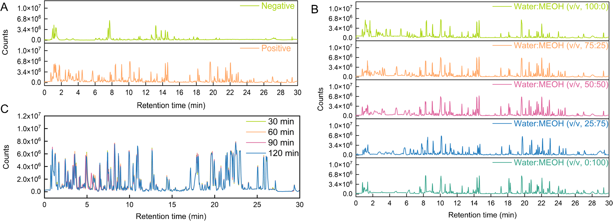
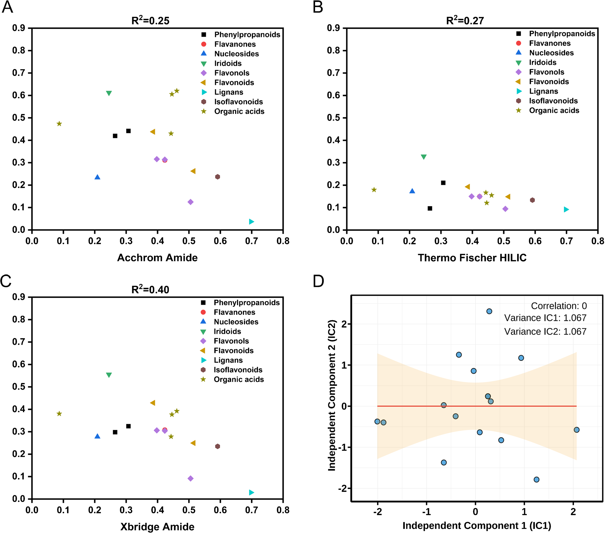
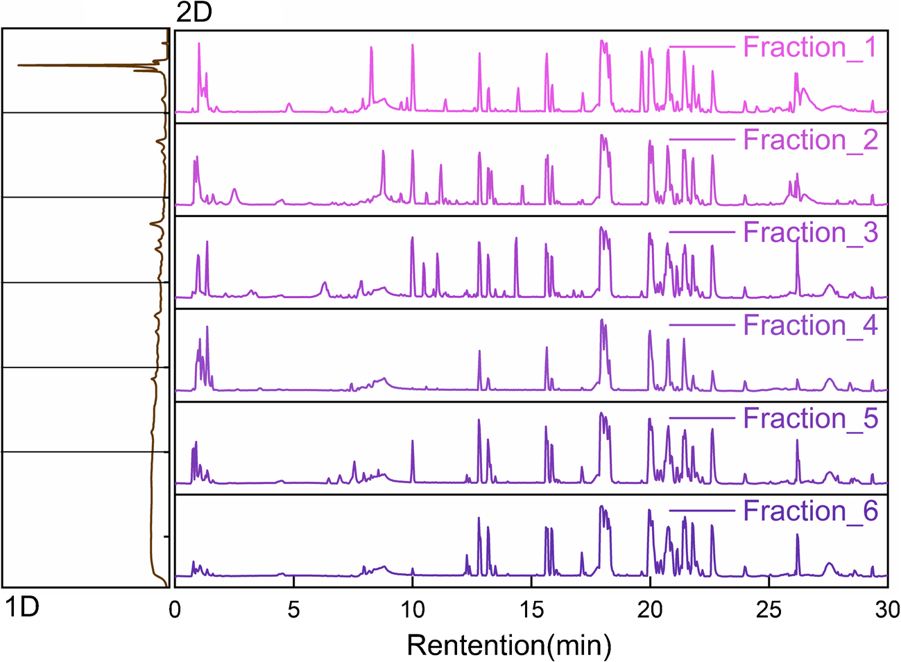
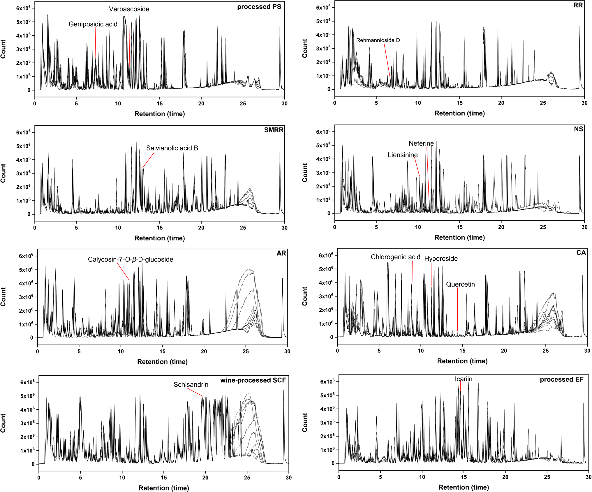
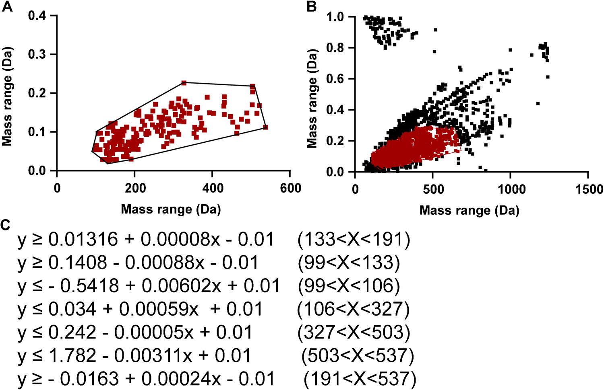
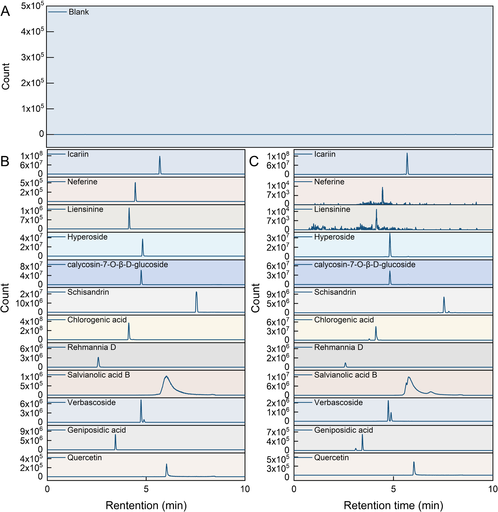

<!-- 方針: ほぼ全訳＋必要に応じた補足。原文構成に沿って訳出。「> 補足:」は訳者注。 -->

## 書誌情報

- 原題: Comprehensive chemical profiling and quality marker discovery in Shenxiao granules via orthogonal HILIC×RP 2D-LC/MS and mass defect filtering algorithm
- 著者: Jian Gao, Jia Li, Jinyan Wang, Yang Wang, Dake Yang, Zixin Zhang, Zhifei Fu, Fengchao Wang, Liming Wang, Shiwei Chai, Lifeng Han（天津中医薬大学 ほか, 中国）
- 掲載: *Analytical and Bioanalytical Chemistry* (2025) 417:6915–6931. https://doi.org/10.1007/s00216-025-06180-9
- インパクトファクター: **4.2**（*Anal. Bioanal. Chem.*, JCR 2024 / Clarivate）
- 受理経過: 受領 2025-07-29 / 改訂 2025-09-12 / 採録 2025-10-04 / オンライン公開 2025-11-18

> 補足: SXG = 参消顆粒（Shenxiao granules。糖尿病性腎症に用いられる多生薬製剤）。DN = 糖尿病性腎症。HILIC×RP = 親水性相互作用×逆相の直交2次元LC。MDF = 質量欠損フィルタ。Q-TOF = 四重極飛行時間型質量分析。本論文は先進分析法開発(2D-LC/MS)の研究論文。

## 要旨（Abstract）

参消顆粒(SXG)は糖尿病性腎症(DN)の臨床に用いられる有効な漢方だが、多生薬組成と広い極性範囲のため品質管理が難しい。本研究は、**オフライン直交HILIC×RP 二次元液体クロマトグラフィ(理論ピーク容量 7161)**、高分解能Q-TOF MS、**質量欠損フィルタ(MDF)** に基づくデータ取得アルゴリズムを統合した新規分析プラットフォームを開発。これにより **260成分** を系統的に特性化(うち **36成分を標準品で確認**)し、SXGの過去最も網羅的な化学プロファイルを得た。さらに、薬局方適合・腎保護への薬理学的関連・コンセンサス指紋ピークを包含する **3次元評価枠組み** で **12の重要Q-marker** を同定。厳密なバリデーションで、精度 **RSD < 5%**、検出限界(LOD) **0.02〜6.56 ng/mL**、回収率 **84〜119%** を示した。「多次元分離−計算機支援アノテーション−階層的Q-markerスクリーニング」アプローチは、SXGの網羅的プロファイルとQ-marker探索を提供し、複雑なTCM製剤の品質標準化の優れた青写真となる。

## 1. 序論（Introduction）

DNは重要な細小血管合併症で、SXGはDN治療に用いられる。従来の1次元LC(1D-LC)はピーク容量が限られ(通常 < 1000)、複雑な多生薬の網羅的解析に不十分。HILICと逆相を組み合わせた **HILIC×RP 2D-LC** はピーク容量を大幅に高め(理論的に7000超)、広極性範囲の網羅に有利。本研究は2D分離・計算機支援同定・体系的Q-marker選定枠組みを統合した。

## 2. 材料と方法（Materials and Methods）

### 標準品（12成分＝Q-marker）

12参照化合物を1 mg/mLでメタノール調製: **クロロゲン酸・ゲニポシド酸・シザンドリン・カリコシン-7-O-β-D-グルコシド・ハイペロシド・イカリイン・ネフェリン・レーマンニオシドD・サルビアノール酸B・ベルバスコシド・ケルセチン・リエンシニン**。

### 2D-LC/MS条件

- **1次元(HILIC)**: Acchrom Xamide カラム（4.6 × 150 mm, 3.5 μm）、25 ℃、移動相(水／アセトニトリル系)、流速 1.0 mL/min、UV 254 nm(Waters 2489)。カラム過負荷を避けて分画。
- **2次元(RPLC)**: Waters UPLC HSS T3（2.1 × 100 mm, 1.8 μm）、40 ℃、グラジエント(5%B平衡化)、流速 0.3 mL/min。
- **MS(Q-TOF)**: ガス温度 400 ℃、シースガス 11 L/min、キャピラリー電圧等を最適化。

### データ処理（MDF）

プロトタイプ成分の質量欠損値[(精密質量−公称質量)×10⁶]から **20 mDa 許容窓** の多角形MDFウィンドウを生成し、目的成分を濃縮。同定スコア > 80%、共有フラグメントイオン ≥ 2 を条件に同定(保持時間アラインメントは不要)。

## 3. 結果（Results）

### 網羅的化学プロファイル

オフラインHILIC×RP 2D-LC(理論ピーク容量 **7161**)＋Q-TOF＋MDFにより、**260成分** を系統的に同定(うち **36成分を標準品で確認**)。これはSXGの過去最も網羅的な化学プロファイル。

### 12 Q-markerの選定（3次元枠組み）

①薬局方規格との適合、②腎保護への薬理学的関連、③コンセンサス指紋ピーク——の3次元枠組みで候補を絞り、**12の重要Q-marker**(クロロゲン酸・ゲニポシド酸・シザンドリン・カリコシン-7-O-β-D-グルコシド・ハイペロシド・イカリイン・ネフェリン・レーマンニオシドD・サルビアノール酸B・ベルバスコシド・ケルセチン・リエンシニン)を選定。複数の構成生薬(黄耆・五味子・地黄・丹参・淫羊藿・蓮子等)に由来する。

### バリデーションと定量

12 Q-markerの定量法を確立し、複数バッチで定量(n=3)。精度 **RSD < 5%**、LOD **0.02〜6.56 ng/mL**、回収率 **84〜119%** で頑健性を確認。

## 4. 結論（Conclusion）

オフライン直交HILIC×RP 2D-LC/MSとMDFアルゴリズムを統合し、SXGで260成分(36を標準品確認)を同定。薬局方適合・腎保護薬理関連・コンセンサス指紋の3次元枠組みで12の重要Q-markerを選定・定量した。「多次元分離−計算機支援アノテーション−階層的Q-markerスクリーニング」アプローチは、SXGの網羅的化学プロファイルとQ-marker探索に加え、複雑なTCM製剤の品質標準化の移転可能な青写真を提供する。

> 補足（実務的示唆）: 本研究の要点は「①2次元LC(HILIC×RP)で極性の広い多生薬成分を桁違いのピーク容量(理論7161)で分離 → ②MDFで効率的にアノテーション → ③薬局方・薬効・指紋の3軸でQ-markerを絞る」という上流から下流までの一貫設計。網羅同定(260成分)は研究・規格策定の基盤であり、実務では選定された12成分をルーチン定量の対象に据える形で活かせる。LODが ng/mL オーダーと高感度な点も微量成分管理に有利。
