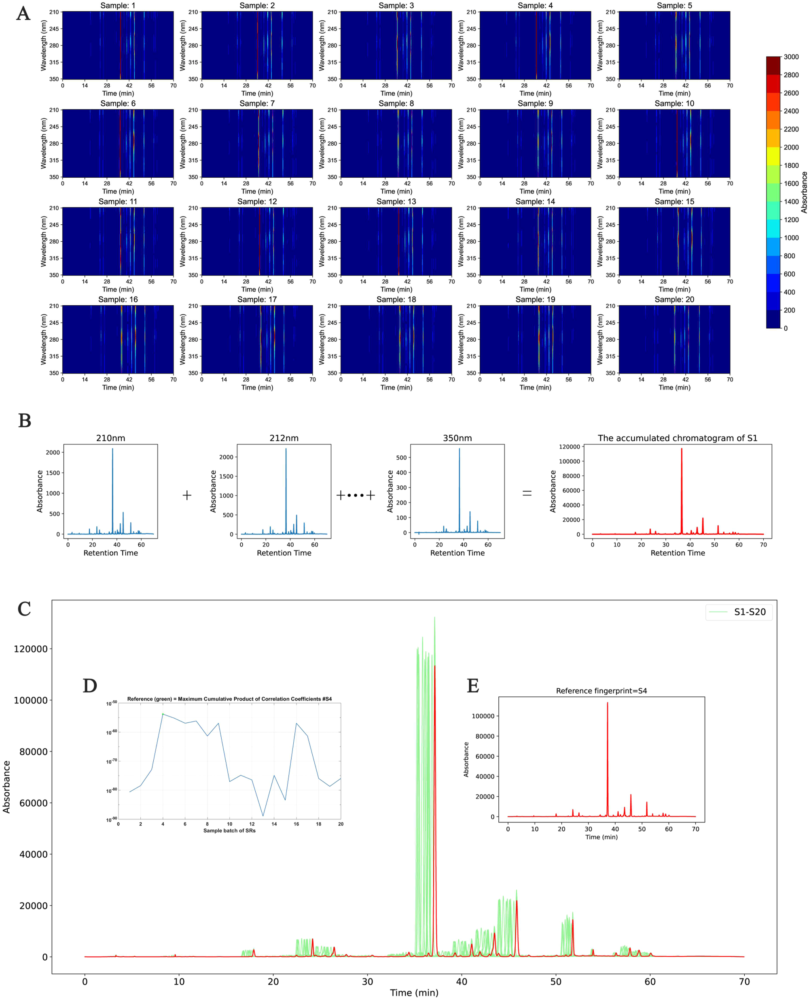
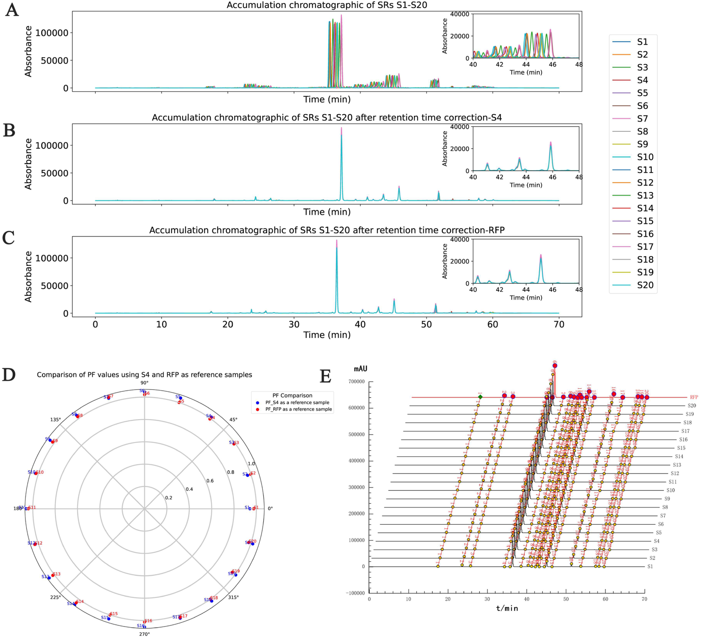
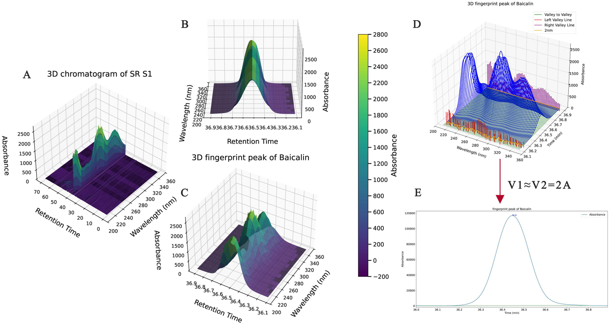
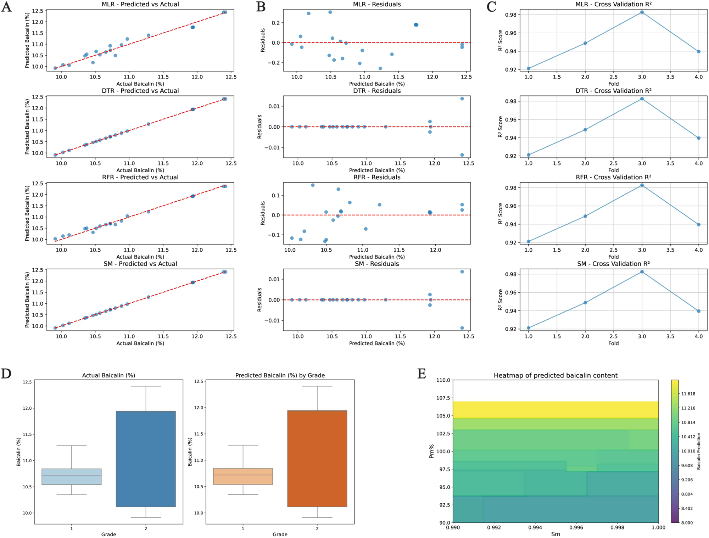

<!-- 方針: ほぼ全訳＋必要に応じた補足。原文構成に沿って訳出。「> 補足:」は訳者注。数式はKaTeXで表示。 -->

## 要旨 (Abstract)
本研究では、HPLC-DADデータ解析の効率と精度を向上させることを目的として、三次元（3D）データ処理と機械学習を統合した、中薬（TCM）の革新的な品質評価手法を提示する。3Dデータ積分により、時間領域および波長領域からの多次元信号を二次元データに変換し、分析プロセスを簡素化しつつ、成分含有量の正確な定量化を保証する。この基礎の上に、異なる試料バッチ間における保持時間のドリフトを効果的に解決するため、動的時間伸縮法（DTW）および相関最適化ワーピング（COW）アルゴリズムを適用し、クロマトグラフピーク形状の全体的および局所的なアライメント（整合）を両立させた。マクロ定性的類似度（Sm）およびマクロ定量的類似度（Pm）を組み込んだ二値評価系（BES）を採用し、TCM試料の品質を包括的に評価した。さらに、評価システムの自動化と精度をさらに向上させるため、重線形回帰（MLR）、決定木回帰（DTR）、ランダムフォレスト回帰（RFR）などの機械学習モデルを導入した。黄芩（Scutellaria baicalensis）の20バッチの分析において、本手法はバイカリン（Baicalin）含量に対して±0.2 %の予測誤差範囲を示した。このアプローチは、データ処理効率を向上させ、実験リソースの消費を削減するだけでなく、TCMの品質評価のための堅牢な理論的および技術的基盤を提供する。最終的に、本研究の結果は、TCMの品質管理における3D積分と機械学習の幅広い適用性を裏付け、TCM品質評価システムの現代化に向けた革新的な技術的支援を提供するものである。

---

## 1. はじめに (Introduction)
中薬（TCM）の品質管理は、TCMの現代化において極めて重要な側面である [1]。TCM品質管理における主要な課題の一つは、その化学組成の複雑さと試料のバッチ間変動にある。高速液体クロマトグラフィー、特にダイオードアレイ検出器（HPLC-DAD） [2] は、現在TCMの品質評価に広く採用されている標準的な手法である。これは多波長データを提供し、複雑なクロマトグラフピークを捉える。しかし、TCMにおける成分の共溶出やピーク形状の変動のため、単一波長分析では成分の真の分布を正確に反映できないことが多く、データ処理において大きな課題となっている。この課題に対処するため、近年、分析の精度と効率の両方を向上させるために、研究者は三次元（3D）クロマトグラフィーデータ技術 [3,4] をますます採用するようになっており、多次元信号分析はTCMの品質評価における重要なツールとして浮上している [5,6]。HPLC-DADは、時間経過に伴う様々な波長での吸光度信号を捉え、三次元クロマトグラムを生成する [7]。しかし、このような3Dデータの複雑さは、従来のデータ処理方法に対して大きな課題を突きつけており [8]、特に大規模な試料分析において、3Dデータを効率的に積分・分析することが重要なハードルとなっている。

クロマトグラフ分析における電子遷移理論の適用は、複雑な試料を扱うための新しいアプローチを提供する。波長の変化に伴う異なる化合物の吸収特性（電子遷移として知られる）は、クロマトグラムに独自のシグネチャーを生み出す。3Dデータを通じて、複数の波長にわたる吸収情報を捉えることができ [9]、これによりTCM試料の品質のより包括的な評価が可能になる。従来のクロマトグラフデータ処理と比較して、この方法は不適切な波長選択やノイズの干渉によって生じる誤差を低減する。この目的のために、我々は3D積分技術の使用を提案し、クロマトグラフ分析の精度と信頼性を向上させる。

従来の二次元データ処理とは異なり、3D積分は時間と波長の両方の次元にわたって信号を累積する。異なる波長にわたる吸光度信号を合算（累積）することにより、3Dデータをより扱いやすい2D信号に変換でき、これにより分析効率が向上するだけでなく、重要な化学組成情報が保持される。このアプローチは、TCMフィンガープリントプロファイルの構築において特に価値があり、成分含有量の定量分析のための信頼性の高い方法を提供する。

これらの進歩にもかかわらず、試料バッチ間の保持時間（RT）ドリフトは、依然として分析精度に影響を与える重要な要因であることが多い [10,11]。実験条件のわずかな変動がクロマトグラフピーク位置のシフトを頻繁に引き起こし、データの比較可能性を複雑にする。この問題を克服するため、本研究では動的時間伸縮法（DTW） [12] と相関最適化ワーピング（COW） [13] アルゴリズムを統合し、大域的（全体的）および局所的な精度を両立させた保持時間補正手法を提示する。DTWは、時間軸の非線形な歪みを大域的に効果的に補正し、一方COWは、セグメント化された最適化を通じて局所レベルでのピーク形状の完全性を保証し、異なる試料間でのクロマトグラムの精密なアライメントを達成する。

この基礎の上に、本研究はさらに、マクロ定性的類似度（Sm）とマクロ定量的類似度（Pm）に基づくTCM品質の二値評価系（BES）を開発した。定性的および定量的な情報を組み合わせることにより、このシステムはTCM試料の総合的な品質を評価するための科学的かつ系統的なアプローチを提供する。評価プロセスの自動化と精度を高めるために、決定木回帰（DTR） [14] やランダムフォレスト回帰（RFR） [15] を含むいくつかの機械学習モデルを導入し、試料の品質特性をモデル化および分析した。これらの革新的な手法を通じて、本研究はHPLC-DADデータ処理ワークフローを洗練させるだけでなく、TCMの品質管理のための堅牢な理論的および技術的基盤を確立し、TCMの品質評価のための革新的で科学的に厳密な枠組みを提供する。

---

## 2. 材料および方法 (Materials and methods)

### 2.1. 装置および条件 (Apparatus and conditions)
分析には、Agilent 1100 HPLCシステム（インライン脱気装置、4液グラジエントポンプ、オートサンプラー、ダイオードアレイ検出器を装備）、ChemStationワークステーション（Agilent Technologies Co., Ltd.）、Sartorius BS110S分析天秤（Beijing Sartorius Balance Co., Ltd.）、およびJP-040超音波洗浄機（Shenzhen Jiemeng Cleaning Equipment Co., Ltd.）を使用した。

クロマトグラフィー条件は以下の通りである：分離はCOSMOSIL C-18 BDSカラム（250 mm × 4.6 mm, 5 µm）を用いて行った。水相Aとして0.2%リン酸水溶液（0.005 mol/Lのヘプタンスルホン酸ナトリウムを含む）を使用し、有機相Bとしてアセトニトリル-メタノール（9:1）溶液を使用した。検出波長は280 nmに設定し、カラム温度は35 ℃に維持し、流速は1.0 mL/minとした。溶液の5 µLのアリコートを分析のためにHPLCカラムに注入した。グラジエントプログラムは以下のように採用された：
- 0〜5分：96–90% A
- 5〜10分：90–88% A
- 10〜12分：88–85% A
- 12〜20分：85–80% A
- 20〜25分：80–79% A
- 25〜30分：79–75% A
- 30〜45分：75–68% A
- 45〜50分：68–55% A
- 50〜65分：55% A（等吸着保持）
- 65〜70分：55–94% A
DAD収集の波長範囲：210 nm–350 nm。

### 2.2. 試薬および材料 (Reagents and materials)
リン酸（クロマトグラフィーグレード、Chengdu Kelon Chemical Reagent Factory、ロット番号：2016122601）。メタノール（クロマトグラフィーグレード、Shandong Yuwang Huitian New Materials Co., Ltd.、ロット番号：20231007316）。アセトニトリル（クロマトグラフィーグレード、Shandong Yuwang Huitian New Materials Co., Ltd.、ロット番号：20230715118）。Wahaha純水（Shenyang Wahaha Qili Food Co., Ltd.）。ヘプタンスルホン酸ナトリウム（Zhongmei Chromatography Products Factory、山東省禹城市製、ロット番号：20230828）。

標準品：
- バイカリン（中国薬品生物製品検定所［NICPP］、ロット番号：110715-200112）
- ウォゴノシド（中国薬品生物製品検定所［NICPP］、ロット番号：112002-201501、純度 98.8%）
- バイカレイン（中国薬品生物製品検定所［NICPP］、ロット番号：111595-200301）
- ウォゴニン（中国薬品生物製品検定所［NICPP］、ロット番号：111514-200403）

黄芩（Scutellariae Radix, SR）の20バッチ試料の産地：
- S1〜S4（産地A）
- S6, S8, S9, S16, S17（産地B）
- S5, S7, S10〜S15, S18〜S20（産地C）

### 2.3. 試料および標準溶液の調製 (Sample and standard solution preparation)
バイカリン標準溶液：バイカリン標準品を適量精密に秤量し、70%エタノールに溶解して、1 mLあたり200 µg of baicalinを含む溶液を調製し、十分に振り混ぜる。

混合標準溶液：ウォゴノシド、バイカレイン、およびウォゴニンの標準品を適量精密に秤量する。これらを70%エタノールに溶解して、1 mLあたりウォゴノシド 363 µg、バイカレイン 162 µg、およびウォゴニン 50 µgを含む溶液を調製し、十分に振り混ぜる。

試料溶液：黄芩（Scutellariae Radix）の粉末約0.5 gを精密に秤量し、25 mLのメスフラスコに移し、70%エタノールを加えて標線まで定容し、45 ℃で30分間超音波処理（出力240 W、周波数40 kHz）を行う。室温まで冷却し、0.45 µmのメンブランフィルターでろ過し、ろ液を回収する。

### 2.4. データ解析 (Data analysis)
HPLCデータは、当研究室で開発された「中薬色譜指紋図譜超信息特征数字化評価システム4.0」（中国ソフトウェア著作権登録番号：0407573）を用いて分析および評価された。データ解析には Python および Matlab プログラムを使用した。COW分析は、http://www.models.life.ku.dk/algorithms の公式アルゴリズムコードを利用した。

---

## 3. 理論と原理 (Theory and principle)

### 3.1. 二値評価系の理論 (Theory of binary evaluation system)
二値評価系（BES）は、マクロ定性的類似度（Sm）とマクロ定量的類似度（Pm）の組み合わせに基づいており、定性的評価と定量的評価の両方を包括的に統合することを目指している。このアプローチの主な強みは、主要な成分の個別の定量化を必要とせずに、複雑な中薬システムを系統的かつ科学的に分析できる能力にある [16,17]。

試料フィンガープリントベクトルを $\vec{X} = (x_1, x_2, \dots, x_n)$、参照フィンガープリントベクトルを $\vec{Y} = (y_1, y_2, \dots, y_n)$ と表し、それらの定性的および定量的な差異を比較する。ここで $x_i$ および $y_i$ は各フィンガープリントピークの面積を表す。

$\vec{X}$ と $\vec{Y}$ の間の角度のコサイン値は、定性的類似度 $S_F$（式1）として定義される。

> 補足: 定性的類似度 $S_F$ の数式定義は以下の通りです。
> $$S_F = \cos\theta = \frac{\sum_{i=1}^{n} x_i y_i}{\sqrt{\sum_{i=1}^{n} x_i^2} \sqrt{\sum_{i=1}^{n} y_i^2}}$$ (1)

$S_F$ によって生じる、大きなピークが小さなピークを覆い隠してしまう現象を排除するために、比率定性的類似度（$S'_F$）が提案されている。これは、ベクトル $\vec{X}' = (x_1/y_1, x_2/y_2, \dots, x_n/y_n)$ を試料フィンガープリント、ベクトル $\vec{Y}' = (1, 1, \dots, 1)$ を参照フィンガープリントと表すようにする。$\vec{X}'$ と $\vec{Y}'$ の間の角度のコサイン値は、定性的類似度 $S'_F$（式2）として定義される。

> 補足: 比率定性的類似度 $S'_F$ の数式定義は以下の通りです。
> $$S'_F = \frac{\sum_{i=1}^{n} \frac{x_i}{y_i}}{\sqrt{n \sum_{i=1}^{n} \left(\frac{x_i}{y_i}\right)^2}}$$ (2)

しかし、$S'_F$ は大きなピークの変化に敏感ではないため、$S_F$ と $S'_F$ の平均がマクロ定性的類似度（$Sm$）としてさらに定義される（式3）。$Sm$ は、$S_F$ における支配的なピークがより小さなピークを覆い隠す問題と、$S'_F$ における等しい重み付けの問題を解決し、試料と参照フィンガープリントプロファイルの間における化学成分の数と分布の類似性を正確に捉える。

> 補足: マクロ定性的類似度 $Sm$ の数式定義は以下の通りです。
> $$Sm = \frac{1}{2}(S_F + S'_F) = \frac{1}{2} \left[ \frac{\sum_{i=1}^{n} x_i y_i}{\sqrt{\sum_{i=1}^{n} x_i^2} \sqrt{\sum_{i=1}^{n} y_i^2}} + \frac{\sum_{i=1}^{n} \frac{x_i}{y_i}}{\sqrt{n \sum_{i=1}^{n} \left(\frac{x_i}{y_i}\right)^2}} \right]$$ (3)

定量的類似度（$Pm$）は、投影含量類似度（$C$）と定量的類似度（$P$）を組み合わせたものである。$C$ は、同じ方向における試料 $\vec{X}$ と参照 $\vec{Y}$ の大きさの比率を指し、$P$ は参照成分の総ピーク面積に対する試料フィンガープリント成分の総ピーク面積の比率である。$C$ と $P$ を平均することにより、マクロ定量的類似度（$Pm$）が得られる（式4〜6）。$Pm$ は、試料内の全体的な化学物質含有量を包括的に表現し、生薬製品や製剤の徹底的な品質評価の手段を提供する。

> 補足: 投影含量類似度 $C$、定量的類似度 $P$、マクロ定量的類似度 $Pm$ の数式定義は以下の通りです。
> $$C = \frac{\|\vec{x}\|}{\|\vec{y}\|} \cdot S_F = \frac{\sqrt{\sum_{i=1}^{n} x_i^2}}{\sqrt{\sum_{i=1}^{n} y_i^2}} \cdot S_F \times 100\%$$ (4)
> $$P = \frac{\sum_{i=1}^{n} x_i}{\sum_{i=1}^{n} y_i} \cdot S_F \times 100\%$$ (5)
> $$Pm = \frac{1}{2}(C + P) = \frac{1}{2} \left[ \frac{\sum_{i=1}^{n} x_i y_i}{\sum_{i=1}^{n} y_i^2} + \frac{\sum_{i=1}^{n} x_i}{\sum_{i=1}^{n} y_i} S_F \right] \times 100\%$$ (6)

$Sm$ と $Pm$ の統合を通じて、中薬の品質に対する二値評価系が確立され、定性的および定量的属性の両方に基づいて品質が8つのグレードに分類される。分類基準は Table 1 に概説されている。

**Table 1: 二値評価系（BES）のグレード分類基準表**
| グレード (Grade) | マクロ定性的類似度 ($Sm$) | マクロ定量的類似度 ($Pm$, %) |
| :---: | :---: | :---: |
| 1 | $\ge 0.95$ | $95 \sim 105$ |
| 2 | $\ge 0.90$ | $90 \sim 110$ |
| 3 | $\ge 0.85$ | $85 \sim 115$ |
| 4 | $\ge 0.80$ | $80 \sim 120$ |
| 5 | $\ge 0.70$ | $70 \sim 130$ |
| 6 | $\ge 0.60$ | $60 \sim 140$ |
| 7 | $\ge 0.50$ | $50 \sim 150$ |
| 8 | $< 0.50$ | $0 \sim \infty$ |

### 3.2. 3D積分法 (3D integration method)
3D積分法は、クロマトグラフ分析において波長 $\lambda$ と時間 $t$ に応じて変化する吸光度信号 $F(\lambda, t)$ を処理するための重要なアプローチである。その主な目的は、式(7)に示すように、三次元クロマトグラフィーデータを積分することである。

> 補足: 3D積分 $V_1$ の数式定義は以下の通りです。
> $$V_1 = \int_{t_{min}}^{t_{max}} \left( \int_{\lambda_{min}}^{\lambda_{max}} F(\lambda, t) d\lambda \right) dt$$ (7)

ここで、$F(\lambda, t)$ は波長 $\lambda$ および時間 $t$ における吸光度信号であり、$\lambda_{min}$ と $\lambda_{max}$ は波長範囲、$t_{min}$ と $t_{max}$ は時間範囲、および $d\lambda$ は波長間隔である。

上記の3D積分計算の複雑さのため、本研究では、三次元データ（波長と時間にわたる吸光度信号）を二次元データに縮約（平坦化）することでプロセスを簡素化し、ピーク面積や総信号などの重要情報の抽出を容易にする。コアコンセプトは、各時間点において異なる波長にわたる吸光度信号 $F(\lambda, t)$ を合算し、時間とともに変化する総信号を得ることである。この総信号を積分して、総ピーク面積などの値を得る。

波長 $\lambda$ と時間 $t$ に応じて変化する吸光度信号 $F(\lambda, t)$ があり、波長範囲が $\lambda_{min}$ から $\lambda_{max}$ まで、時間範囲が $t_{min}$ から $t_{max}$ までであると仮定すると、各時間点 $t$ において、波長範囲 $[\lambda_{min}, \lambda_{max}]$ にわたって信号 $F(\lambda, t)$ を合計することにより、総吸光度信号 $F_{total}(t)$ を得ることができる：

> 補足: 総吸光度信号 $F_{total}(t)$ の数式定義は以下の通りです。
> $$F_{total}(t) = \sum_{\lambda_{min}}^{\lambda_{max}} F(\lambda, t)\Delta\lambda$$ (8)

総吸光度信号 $F_{total}(t)$ が得られると、時間 $t$ にわたって積分することにより、総信号量 $V_2$ を計算できる：

> 補足: 総信号量 $V_2$ の数式定義は以下の通りです。
> $$V_2 = \Delta\lambda \times \sum_{\lambda_{min}}^{\lambda_{max}} F_{total}(t) dt$$ (9)
> ※ 式 (9) は原文のまま記載しています。

データ収集時の波長間隔は $d\lambda = 2\text{ nm}$ に固定された。

信号の合算前に、個々の波長ごとにバックグラウンド補正とスムージングが適用された。バックグラウンド補正は、装置のドリフトや環境ノイズに起因するベースラインの揺らぎを排除するために極めて重要であり、スムージングは高周波ノイズを抑制する。その結果、合算前に各波長信号に保持されている重要な吸収情報が最適化される。統合されたアプローチでは、全波長範囲にわたる合算が適用された。この手法は、さまざまな電子遷移のスペクトルを取り入れつつ、計算負荷を大幅に削減した。信号の累積によって小さなピークが覆い隠されないことを保証するため、バックグラウンド補正とスムージングに加えて、ピーク純度分析を用いてスペクトルフィンガープリントを観察することにより、累積されたピークの純度を評価することができる。もし覆い隠し現象（マスク現象）が見出された場合は、マスクされた小さなピークの特徴を回復し定量化を行うために、ピークデコンボリューション技術（ガウスフィッティングなど）を組み合わせる必要がある。これらの操作により、完全な定量データの保持が保証され、分析結果の精度が向上した。

### 3.3. クロマトグラフピークアライメントアルゴリズム：動的時間伸縮法および相関最適化ワーピング (Chromatographic peak alignment algorithm: dynamic time warping and correlation optimization warping)

#### 3.3.1. 動的時間伸縮法 (Dynamic time warping)
動的時間伸縮法（DTW） [18] は、時系列データをアライメントするために設計されたアルゴリズムであり、長さが異なるシーケンスや、非線形な時間変動を示すシーケンスに対して特に効果的である。クロマトグラフ分析において、バッチ間のわずかな実験の不一致は、全体的な傾向が類似している場合でもピークシフトを引き起こす可能性がある。DTWは、時間軸に非線形変換を適用し、これらのシフトを補正してバッチ間での正確なアライメントを可能にすることで、この問題に対処する。2つの時系列 $X = (x_1, x_2, \dots, x_n)$ と $Y = (y_1, y_2, \dots, y_n)$ が与えられたとき、各時間点での差はユークリッド距離を用いて測定される：

> 補足: ユークリッド距離 $D(i, j)$ の数式定義は以下の通りです。
> $$D(i, j) = \sqrt{(x_i - y_j)^2}$$

ここで、$D(i, j)$ は系列 $X$ の $i$ 番目の点と系列 $Y$ の $j$ 番目の点との間の距離を表す。クロマトグラフアライメントにおいて、これは異なるバッチ間の同じ保持時間における吸光度の差を反映している。2つの系列間の最適なアライメントパスを決定するため、DTWは、開始点から現在の点までの最小累積距離を表す累積距離マトリクス $C(i, j)$ を構築する：

> 補足: 累積距離マトリクス $C(i, j)$ の数式定義は以下の通りです。
> $$C(i, j) = D(i, j) + \min(C(i - 1, j), C(i, j - 1), C(i - 1, j - 1))$$

ここで、最小値は $X$ または $Y$ のいずれかにおける点をスキップすること、あるいは両方の系列の現在の点を一致させることに対応する。累積距離マトリクスを計算した後、右下隅から最適なパスを逆追跡し、$X$ と $Y$ の時間点をどのように整合させるかを決定することによって、全体的な差異を最小限に抑える。DTWは、時間点を挿入または削除することにより、長さの異なる時系列のアライメントを達成する。この「弾性」アライメントは、クロマトグラフピークの保持時間シフトを補正するために特に重要であり、試料間で類似したピークが同じ保持時間に整列することを保証し、それによってデータの比較可能性を高める。

#### 3.3.2. 相関最適化ワーピング (Correlation optimized warping)
相関最適化ワーピング（COW） [19,20] は、時系列データのアライメントに広く使用されているアルゴリズムであり、特にクロマトグラフィーデータ処理において保持時間シフトの補正に効果的である。COWのコアコンセプトは、試料信号と参照信号の間の相関が最大化されるように時間軸を調整し、異なる試料間で同じクロマトグラフピークが同一の保持時間で整列することを保証しつつ、ピーク形状の一貫性を維持することである。

COWアルゴリズムは、主に3つのステップで構成される：第一に、参照クロマトグラムが選択される。通常は、ピークが最も多いもの、または他の試料との相関が最も高いものが選ばれる。次に、ともに長さ $N$ である参照信号 $X$ とターゲット信号 $Y$ が、長さ $m$ のセグメントに分割される。すなわち $X = [x_1, x_2, \dots, x_N]$ および $Y = [y_1, y_2, \dots, y_N]$ である。最後に、各セグメントについて、アライメントを達成するために時間軸の引き伸ばしまたは圧縮が適用され、新しい時間シーケンスが得られる：

> 補足: アライメント後の時間配列 $w_j$ の数式定義は以下の通りです。
> $$w_j = y_s + j \times \frac{y_e - y_s}{m - 1}, \quad j = 0, 1, \dots, m - 1$$

ここで、$y_s$ と $y_e$ はセグメントの開始点と終了点を示す。変形された時間点はもはや離散的な整数ではないため、信号値を推定するために線形補間が必要となる。任意の新しい時間点 $t_i$ について、信号値は以下のように隣接する点 $t_{i-1}$ と $t_{i+1}$ を用いて計算される：

> 補足: 線形補間 $A(t_i)$ の数式定義は以下の通りです。
> $$A(t_i) = A(t_{i-1}) + \frac{A(t_{i+1}) - A(t_{i-1})}{t_{i+1} - t_{i-1}} \times (t_i - t_{i-1})$$

このプロセスにより、信号の再構成とクロマトグラフィーデータの最終的なアライメントが可能になる。

DTWはグローバルな非線形ドリフトを効果的に管理するものの、局所的なピーク歪みを導入する可能性がある。逆に、COWは局所的なピーク形状の保存に優れているが、セグメント分割パラメータに非常に敏感であり、大きなドリフトやピークが重なり合った複雑なクロマトグラフィーデータを扱う際に課題が生じる可能性がある。ベースライン補正などの追加のプレプロセスや、パラメータのさらなる最適化がこれらの問題を克服するために要求される場合がある。

### 3.4. 機械学習モデル (Machine learning model)

#### 3.4.1. 重線形回帰 (Multiple linear regression)
重線形回帰（MLR） [21] は、従属変数と1つ以上の独立変数の間の定量的な関係を記述する数学的モデルを構築する統計的手法である。この関係は試料データを用いて分析される。MLRにおいて、従属変数は $Y$ と表記され、$Y$ に影響を与える $k$ 個の独立変数 $X_1, X_2, \dots, X_k$ が存在する。他のすべての変数が一定であると仮定すると、$Y$ の値は各独立変数 $X_k$ の変化に伴って変化する。これにより、式(10)に示すような母回帰モデルが確立される。

> 補足: 重線形回帰式は以下の通りです。
> $$Y = \beta_0 + \beta_1 X_1 + \beta_2 X_2 + \dots + \beta_k X_k + \varepsilon$$ (10)

ここで、$\beta_0, \beta_1, \dots, \beta_k$ は回帰係数を表し、$\varepsilon$ は誤差項である。

#### 3.4.2. 決定木回帰 (Decision tree regression)
決定木回帰（DTR） [22] は、特徴空間を再帰的に分割することによって予測を行うのに適した非線形モデルである。従属変数を $Y$、 $k$ 個の独立変数を $X_1, X_2, \dots, X_k$ と仮定すると、決定木は $X_1$ および $X_k$ の異なる値に基づいて二分木分割を行う。各分割において、ターゲット変数 $Y$ の分散を最小化する特徴と閾値が選択される。木の各葉ノードは、類似した試料のグループに対する平均バイカリン含量を表す。線形回帰とは異なり、決定木は特徴とターゲット変数の間の線形関係を仮定しないため、$X_1$ と $X_k$ の間の非線形な相互作用を効果的に捉えることができる。しかし、単一の決定木は、特にデータが複雑な場合や特徴量が多い場合に過学習（オーバーフィッティング）を起こしやすい。これにより、モデルがデータ内のノイズに対して過度に敏感になり、汎化能力が低下する可能性がある。

#### 3.4.3. ランダムフォレスト回帰 (Random forest regression)
ランダムフォレスト回帰（RFR） [15] は、複数の決定木を構築することによってモデルの堅牢性と予測精度を向上させるように設計されたアンサンブル学習法である。$Y$ を従属変数とし、これが $k$ 個の独立変数 $X_1, X_2, \dots, X_k$ に影響されるとする。ランダムフォレストは、$X_1$ から $X_k$ をランダムにサンプリングして複数の決定木を生成し、最終的な予測はこれらの木の出力の平均をとることで得られる。単一の決定木と比較して、ランダムフォレストは過学習の問題を緩和し、モデルの汎化性能を高める。各木はデータと特徴のサブセットのみを分割し、特徴間のより複雑な関係を捉えるため、モデルは $X_1$ および $X_k$ の変動に対してより頑健になる。複数のモデルからの予測を統合することにより、ランダムフォレストは個々の木における過学習に起因する誤差を減らしつつ、より正確な $Y$ の予測を提供する。

---

## 4. 結果と考察 (Results and discussion)

### 4.1. 3D積分結果の分析 (Analysis of 3D integration results)
クロマトグラフ3Dデータを積分する主な目的は、個々の成分の含有量と分布を正確に定量化することであり、これはTCMの品質評価にとって極めて重要である。クロマトグラフィーデータは時間、波長、および応答強度の3次元で構成されており、これらの次元の複雑さはデータ処理や成分同定において課題をもたらす。第一に、3D積分は時間と波長の両方の次元を考慮しなければならず、計算の複雑さが大幅に増加する。さらに、ピークの形状と位置は波長によって変化する可能性があり、特にベースラインに接続された谷を必要とする場合、ピークの同定と積分をさらに複雑にする。ベースラインのドリフトとノイズも積分の精度に悪影響を及ぼす。

これらの課題に対処するため、本研究では簡略化された手法を提案する：波長次元にわたって信号を合計することにより、3Dデータが2Dデータに変換され、データ処理がより直感的かつ効率的になる。我々が3D積分法を採用したことは、本質的に電子遷移理論に基づいている。この理論は、異なる化合物が様々な波長範囲で異なる電子遷移を起こし、それによって固有の吸収スペクトルプロファイルが生成されるというものである。従来の2Dアプローチでは、通常、検出と積分の両方に単一の波長が使用されていた。これらの方法はスペクトルプロファイルの一部の側面を捉えていたものの、完全なスペクトル環境を考慮できていないことが多かった。その結果、選択された波長では吸収が比較的弱いが、他の波長ではより強い吸収を示す化合物が過小評価されたり、見落とされたりする可能性があり、この欠点は複雑なマトリクスにおける定量分析の精度を損なう可能性がある。3D積分は、すべての関連波長における信号が統合されるため、不適切な波長選択から生じる系統的バイアスのリスクを軽減する。3D積分法の能力は、異なる波長にわたる吸収特性のわずかな違いを利用して分離が達成される多成分システムにおいて、特に価値があることが証明された。これにより定量精度が向上し、複雑なクロマトグラフプロファイルのより精細な積分が容易になる。さらに、複数の波長で取得された信号の合算は、ランダムノイズを部分的に相殺する役割を果たし、S/N比（シグナル/ノイズ比）を改善して、定性的および定量的な頑健性の両方を強化する。最後に、3Dアプローチはランプのドリフトやベースラインの変動などの系統誤差に対する感受性の低下を示し、異なる機器、ラン、および実験バッチにわたる結果の一貫性と比較可能性を高める。（黄芩［SR］のクロマトグラフィー条件詳細、ピーク同定、方法論的バリデーション、および含量測定の詳細については原文の補足資料を参照。含量測定結果は Table 3 に示す）。

試料採取中のHPLC脱気装置の不具合により、一部のバッチで保持時間のシフトが発生した。リソースの無駄と試薬消費を最小限に抑えるため、本研究では保持時間補正のためにDTWおよびCOW技術を利用した。当初、時間、波長、および応答強度の次元を示す20バッチからの3Dクロマトグラフィーデータの概要では、データの複雑さが明確に見て取れる（図1Aを参照）。線形補間を用いて時間点を統一した後、式(11)に記載されているように、71波長からの三次元データを二次元プロファイルに集約した（図1Bは3Dデータから2Dプロファイルへの集約を詳細に示している）。最後に、集約された20バッチのプロファイルに保持時間補正を施し、データの正確性と一貫性を確保した。

> 補足: 2D集約プロファイル $A_{sum}(t)$ の数式定義は以下の通りです。
> $$A_{sum}(t) = \sum_{i=1}^{n} \left[ A(t_k, \lambda_i) + \frac{A(t_{k+1}, \lambda_i) - A(t_k, \lambda_i)}{t_{k+1} - t_k} \cdot (t - t_k) \right] + E_{sum}$$ (11)

ここで、$n$ は総波長数を示し、$i=1$ は $\lambda_1$ を表し、$A(t_k, \lambda_i)$ は時間点 $t_k$ および波長 $\lambda_i$ における吸光度値を示す。$E_{sum}$ は集約プロセス中に導入されたノイズまたは誤差を表し、無視できるものとみなされる。

保持時間補正において、適切な参照信号の選択は重要なステップである。DTWまたはCOWキャリブレーション方法のいずれを採用する場合でも、まずアライメントの基準となる代表的な参照信号を特定することが不可欠である。医薬品の品質評価システムを構築する際、通常、異なる試料バッチ間で類似度が高いため、適切な参照信号選択戦略を使用することで、アライメントの精度と効率を大幅に向上させることができる。参照信号は、通常、メディアン信号ベクトル、最大信号ベクトル、および最大累積相関係数法（MCCCM）などの方法を用いて決定される。

メディアン信号ベクトルは、各時間点での中央値を計算し、参照信号に対する極端な値や外れ値の影響を低減する。しかし、特にデータが大きな偏差を示す場合に、信号の全体的な形状を完全に捉えることができない可能性がある。最大信号ベクトルは、各時間点においてすべての試料から最大値を選択して参照信号とする。この方法は、信号強度に大きな変動がある場合や試料間に大きな差がある場合に適しているが、ノイズや極端な値に敏感であり、試料の一般的な傾向を表すことができない可能性がある。

MCCCMは、各試料と他のすべての試料との間の相関係数を計算し、累積相関が最も高い試料を参照信号として選択する。この方法は、最も代表的な試料を特定するため、データが高い相関を示すものの形状が異なるシナリオに理想的である。しかし、計算負荷が高く、試料数が比較的少ないシナリオに特に適している。我々の研究では、参照信号を選択するためにMCCCMが好ましいアプローチであった。この方法は、各試料と他のすべての試料との間の相関係数を計算し、これらの係数を掛け合わせて各試料の累積相関値を得ることを含む。累積相関値が高いほど、その試料と他の試料との類似性が高くなり、代表的な参照信号の候補として適している。具体的な公式は以下の通りである：

> 補足: MCCCMの数式定義は以下の通りです。
> $$r(a, b) = \frac{(X(a, :) - \bar{X}(a, :)) \cdot (X(b, :) - \bar{X}(b, :))}{\|X(a, :) - \bar{X}(a, :)\| \|X(b, :) - \bar{X}(b, :)\|}$$ (12)
> $$R(a) = \prod_{b=1}^{n} r(a, b)$$ (13)
> $$N = \operatorname{argmax}_{a} R(a)$$ (14)

ここで、$X(a, :)$ は試料 $a$ の信号ベクトルを表し、$\bar{X}(a, :)$ は試料 $a$ の平均ベクトルを示す。$r(a, b)$ は試料 $a$ と $b$ の間の相関係数であり、$R(a)$ は各試料 $a$ の累積相関値を指す。$N$ は最も高い累積相関値を持つ試料を示す。

図1Cは、異なる試料間の保持時間のシフトを明確に示している。MCCCM法は、Matlabプログラムを用いて相関係数の最大累積積（MCPCC）を計算することにより、最も代表的な試料を特定する [20]。図1Dはすべての試料について計算されたMCPCC値を示しており、試料S4が最も高いMCPCCを示すことが明らかになった。したがって、図1Eに示すように、当初は試料S4が参照信号として選択された。

現在の実験データセットにおいて、MCCCMを介して選択された参照信号は強力な代表性と安定性を示したものの、より大きなサンプルサイズやより高いレベルのノイズに直面した場合のいくつかの限界も認識している。特に、累積相関係数の計算にはすべての試料間のペアワイズ比較が必要であり、データセットが大きくなるにつれて計算要求が急速にエスカレートし、効率が低下する可能性がある。さらに、大幅な変動や顕著なノイズが存在する場合、外れ値が相関係数の積に過大な影響を及ぼし、参照信号選択の安定性を損なう可能性がある。これらの懸念に対処するため、我々はすべての試料にわたる共通の特性を捉える「参照フィンガープリント（RFP）」を構築することを提案する。これにより、単一サンプルの参照信号に代わる、あるいはそれを補完する選択肢を提供する。保持時間アライメントのための標準化されたクロマトグラフプロファイルを提供することにより、RFPアプローチは、外れ値がMCCCMに与える影響を緩和するだけでなく、特に大規模なデータセットにおいて、より堅牢で効率的な参照選択を可能にする。その結果、この戦略は、複雑な実験環境におけるデータアライメントおよび定量分析のためのより強力な基盤を築く。

DTWはグローバルな非線形歪みの処理に優れているが、局所的な詳細の保持には限界があり、クロマトグラフピークの引き伸ばしや圧縮を引き起こす可能性があり、これが局所的なアライメントの精度に影響を与え、ピークの歪みを引き起こす。対照的に、COWは局所的な時間軸の歪みを補正する際により高い精度を示すが、グローバルな非線形シフトに対する感受性が低く、顕著なグローバルドリフトを伴う時系列を整列させる場合には効果が低下する。

COWのアライメント性能は、セグメントの長さ（$m$）とスラックパラメータ（$t$）の選択に大きく依存する。参照信号とターゲット信号の間の相関を最大化する最適な構成を特定するために、通常、$m$ と $t$ の複数の組み合わせをテストする必要がある。

変形された信号と参照信号の間のアライメントを評価するために、ピアソン相関係数 $\rho$ を用いてそれらの相関を定量化する。同時に、アライメントプロセス中のピーク形状の一貫性を検証するために、ピーク因子（Peak Factor, PF）を導入する [20]。この因子は、バッチ $i$ における各ピーク $j$（総ピーク数を $N$ とする）に適用され、具体的な公式は以下の通りである：

> 補足: ピアソン相関係数 $\rho$ およびピーク因子 $PF$ の数式定義は以下の通りです。
> $$\rho = \frac{\sum_{i=1}^{m}(x_i - \bar{x})(w_i - \bar{w})}{\sqrt{\sum_{i=1}^{m}(x_i - \bar{x})^2} \sqrt{\sum_{i=1}^{m}(w_i - \bar{w})^2}}$$ (15)
> $$PF_j = \frac{\text{area}_{before, j} \times \text{height}_{before, j} \times \text{width}_{before, j}}{\text{area}_{after, j} \times \text{height}_{after, j} \times \text{width}_{after, j}}$$ (16)
> $$PF_i = \frac{1}{N}\sum_{j=1}^{N}PF_j$$ (17)

ここで、$x_i$ および $w_i$ は、それぞれ参照信号セグメントおよび変形された信号セグメントの値を表し、$\bar{x}$ および $\bar{w}$ はそれらのそれぞれの平均値である。パラメータ $\text{area}_{before, j}$、$\text{height}_{before, j}$、および $\text{width}_{before, j}$ は、アライメント前のピーク $j$ の面積、高さ、および幅に対応し、$\text{area}_{after, j}$、$\text{height}_{after, j}$、および $\text{width}_{after, j}$ はアライメント後の同じ測定値を示す。相関係数 $\rho$ の値が 1 に近いほど、2つの信号セグメント間の良好な一致を示す。理想的には、PFは 1 に近づくべきであり、これはアライメント後にピーク形状が良好に維持されていることを意味する。

本研究では、DTWとCOWアルゴリズムの統合は Matlab プログラムを用いて実行された。図2Aに示すように、元のクロマトグラムは明確な保持時間ドリフトを示している。これに対処するため、まずDTWを用いてグローバルアライメントを行い、続いてパラメータを $m = 50$ および $t = 10$ に設定してCOWによる局所補正を行った。図2Bは、単一の試料（S17）を参照信号として使用して補正されたクロマトグラムを示す（※原文の記述に準拠）。図2Cは、RFPを参照信号として使用することの優れた性能を浮き彫りにしており、単一の試料を使用する場合と比較して、ピークのアライメントがより正確かつ安定しており、RFPアプローチの強化された信頼性を示している。さらに、$\rho$ および PF が Python プログラムを用いて計算され、その結果は Table 2 に示されている。

表に示されているように、どちらの参照シナリオも 0.99 を超えて 1 に近づく $\rho$ 値を達成し、変形された信号と参照信号の間の高い一致度を示唆している。PF値の可視化は図2Dに示されている。どちらの参照シナリオも 1 に近い PF 値を示したものの、RFPを参照として使用したPF値は全体としてより 1 に近かった。これは、RFPがより優れた代表性と安定性を備えており、他の試料とよりよく一致し、それによってより一貫したフィンガープリントプロファイルを構築できることを示している。これにより、アライメントの信頼性と評価システム全体の堅牢性が向上する。

統一された参照信号として、RFPは実験条件や機器の変動によって生じるバイアスを効果的に排除し、それによってバッチ間のデータの比較可能性を高め、より客観的な評価を保証する。我々は、クロマトグラフィーデータにおける保持時間ドリフトに対処し、クロマトグラフピーク形状の補正のための二値評価系（BES）を最適化するために、DTWとCOWアルゴリズムを組み合わせた。各手法は明確な特徴を持ち、異なる実験条件下で異なる優位性を示す。

DTWは、2つの時系列間の累積距離を最小化することによって時間軸のアライメントを達成するため、試料間に大きな非線形保持時間ドリフトが存在する場合に特に効果的である。しかし、DTWは、保持時間ドリフトが不均一である場合やクロマトグラフピークが深刻に重複している場合など、局所的なピーク形状の細部を処理する際に歪みを導入する可能性がある。

対照的に、COWアルゴリズムは、局所的な時間軸の調整においてより高い精度を提供し、ピーク形状の細部を効果的に保持するため、試料間に大きな局所的時間ドリフトが存在する状況に特に適している。しかし、COWはグローバルなドリフトに対処する効果が低く、特に大規模なグローバル保持時間シフトを伴うデータセットでは顕著である。

比較分析を通じて、大規模な時間ドリフトの補正にはDTWの方が効率的であり、データセット全体のグローバルアライメントを可能にする一方で、複雑な局所ドリフト、ピーク形状の歪み、およびピークの重複をより高い精度で処理するにはCOWが優れていることがわかった。本研究では、まずDTWを適用して試料のグローバル時間軸を整列させ、その後に局所的なピーク形状の最適化のためにCOWを使用した。この組み合わせたアプローチは、試料間の保持時間ドリフトを正常に解決し、クロマトグラフピーク形状の一貫性を確保し、データの正確性と比較可能性を維持した。

グローバルアライメント用のDTWと局所リファインメント用のCOWの組み合わせは、個々のアルゴリズムに固有の限界を部分的に緩和するものの、著しいグローバル保持時間シフトや深刻なピーク重複を示す試料では、依然として局所的なピーク形状の歪みが発生する可能性がある。今後の調査では、複数のプレプロセス戦略の組み合わせを探索することが計画されている。特にピークデコンボリューションアルゴリズムの実施に焦点が当てられた。同時に、複雑なクロマトグラフィーデータセットにおけるキャリブレーションの精度を高めるために、アライメントパラメータを最適化する取り組みも行われた。

保持時間を補正した後、20バッチの黄芩（SR）データを「中薬色譜指紋図譜超信息特征数字化評価システム4.0」にインポートして積分を行った。二値評価系（BES）を使用して新しいRFPを生成し、20バッチの黄芩（SR）を包括的に評価した。評価結果は Table 2 に詳しく示されており、対応する評価クロマトグラムは図2Eに表示されている。従来の方法は、単一波長検出と標準曲線法によって黄芩（SR）中のバイカリンの品質を決定するものである。本研究の目的は、この従来の限界を打破し、二値パラメータ（Sm と Pm）を使用して生薬の品質（真偽）を迅速に特定することであった。

**Table 2: S4およびRFPを参照とした場合の $\rho$ および PF 値、ならびに保持時間補正後の二値評価系（BES）の $Sm$、$Pm$、グレード結果**
| 試料 (Sample) | S4参照 $\rho$ | S4参照 PF | RFP参照 $\rho$ | RFP参照 PF | BES $Sm$ | BES $Pm$ (%) | BES グレード (Grade) |
| :---: | :---: | :---: | :---: | :---: | :---: | :---: | :---: |
| S1 | 0.9997 | 0.9421 | 0.9985 | 0.9762 | 0.991 | 94.1 | 2 |
| S2 | 0.9997 | 0.9690 | 0.9987 | 0.9976 | 0.992 | 92.6 | 2 |
| S3 | 0.9996 | 0.9913 | 0.9987 | 0.9877 | 0.991 | 97.5 | 1 |
| S4 | 1.0000 | 1.0156 | 0.9981 | 0.9942 | 0.991 | 93.4 | 2 |
| S5 | 0.9996 | 1.0432 | 0.9991 | 1.0006 | 0.999 | 102.8 | 1 |
| S6 | 0.9993 | 1.0467 | 0.9989 | 1.0221 | 0.995 | 105.7 | 2 |
| S7 | 0.9994 | 1.0404 | 0.9983 | 1.0485 | 0.998 | 100.8 | 1 |
| S8 | 0.9978 | 1.0331 | 0.9957 | 1.0186 | 0.985 | 108.4 | 2 |
| S9 | 0.9993 | 1.0438 | 0.9989 | 1.0168 | 0.996 | 105.8 | 2 |
| S10 | 0.9952 | 1.0268 | 0.9962 | 1.0218 | 0.994 | 99.8 | 1 |
| S11 | 0.9959 | 1.0597 | 0.9964 | 1.0400 | 0.996 | 97.2 | 1 |
| S12 | 0.9972 | 1.0282 | 0.9979 | 1.0329 | 0.996 | 97.1 | 1 |
| S13 | 0.9990 | 1.0538 | 0.9993 | 1.0142 | 0.996 | 103.4 | 1 |
| S14 | 0.9992 | 1.0640 | 0.9993 | 1.0414 | 0.996 | 98.8 | 1 |
| S15 | 0.9993 | 1.0365 | 0.9982 | 1.0004 | 0.995 | 97.4 | 1 |
| S16 | 0.9993 | 1.0587 | 0.9989 | 1.0143 | 0.996 | 105.8 | 2 |
| S17 | 0.9978 | 1.0304 | 0.9957 | 1.0219 | 0.985 | 108.4 | 2 |
| S18 | 0.9995 | 1.0214 | 0.9991 | 1.0003 | 0.997 | 94.4 | 2 |
| S19 | 0.9992 | 1.0079 | 0.9993 | 0.9688 | 0.998 | 97.8 | 1 |
| S20 | 0.9995 | 1.0170 | 0.9994 | 0.9798 | 0.998 | 98.6 | 1 |

図3Aは黄芩（SR）試料S1の3次元画像を示し、図3BおよびCは異なる角度から見たバイカリンの3次元画像を示している。クロマトグラムを合算することにより、図3Eに示すようにバイカリンのピーク面積が抽出され、対応する3Dクロマトグラムにおけるピーク体積 $V_2$ の計算が可能になった。この方法の実行可能性を検証するため、3Dデータセットから波長ごとにバイカリンの吸光度データを抽出し、波長と時間の両方の次元にわたって積分を行って、図3Dに示すようにバイカリンのピーク体積 $V_1$ を得た（$V_1$ および $V_2$ の値は Table 3 に詳細に記載されている）。

加算（合算）法が定量分析の精度に与える影響を検証するために、相対変化率（Relative Rate of Change, RC）（式18）および $\rho$ を、2つのデータセット間の変化の大きさと相関を評価するための指標として導入した。我々は $V_1$ と $V_2$ を詳細に比較し、その結果を Table 3 に示す。$V_1$ と $V_2$ の間の $\rho$ は 0.97 に達し、また $V_1$ と $V_2$ の間のRCは許容範囲内に留まった。これは、2つの方法の定量結果が概ね一致していることを示している。これらの統計指標は、前処理および合算後の多波長信号が、計算がより容易であるだけでなく、試料中の各成分の含有量を真に反映でき、複雑な混合物の定量分析に重大な影響を与えないことを十分に証明しており、分析結果の安定性と正確性を保証している。

> 補足: 相対変化率 $RC$ の数式定義は以下の通りです。
> $$RC = \frac{V_1 - V_2}{V_2}$$ (18)

**Table 3: 20バッチの黄芩（SR）における $V_1$、$V_2$、相対変化率 (RC) 値、および各成分の定量結果 (%)**
| 試料 (Sample) | 3D積分結果 $V_1$ | 2D累積積分結果 $V_2$ | 相対変化率 $RC$ | バイカリン 含量 (%) | ウォゴノシド 含量 (%) | バイカレイン 含量 (%) | ウォゴニン 含量 (%) |
| :---: | :---: | :---: | :---: | :---: | :---: | :---: | :---: |
| S1 | 2,789,069.6 | 2,636,157.9 | 0.06 | 10.47 | 2.00 | 0.48 | 0.15 |
| S2 | 2,667,426.7 | 2,568,355.3 | 0.04 | 9.91 | 1.93 | 0.61 | 0.18 |
| S3 | 2,810,875.7 | 2,707,213.7 | 0.04 | 10.51 | 1.99 | 0.52 | 0.18 |
| S4 | 2,699,970.3 | 2,550,074.5 | 0.06 | 10.03 | 2.00 | 0.56 | 0.19 |
| S5 | 2,934,068.1 | 2,827,901.2 | 0.04 | 10.97 | 2.10 | 0.69 | 0.20 |
| S6 | 3,163,317.5 | 2,937,526.6 | 0.08 | 11.94 | 2.19 | 0.61 | 0.15 |
| S7 | 2,920,584.6 | 2,762,350.7 | 0.06 | 10.89 | 2.00 | 0.71 | 0.19 |
| S8 | 3,289,113.2 | 3,054,006.8 | 0.08 | 12.39 | 2.39 | 0.39 | 0.11 |
| S9 | 3,163,316.5 | 2,937,526.6 | 0.08 | 11.93 | 2.19 | 0.61 | 0.15 |
| S10 | 2,845,362.3 | 2,800,082.1 | 0.02 | 10.72 | 2.02 | 0.67 | 0.21 |
| S11 | 2,864,538.4 | 2,711,782.5 | 0.06 | 10.80 | 2.06 | 0.64 | 0.18 |
| S12 | 2,771,057.2 | 2,725,748.6 | 0.02 | 10.35 | 2.02 | 0.61 | 0.17 |
| S13 | 2,978,091.4 | 2,874,601.0 | 0.04 | 11.28 | 2.15 | 0.68 | 0.22 |
| S14 | 2,836,746.2 | 2,738,635.6 | 0.04 | 10.72 | 2.05 | 0.67 | 0.21 |
| S15 | 2,749,848.4 | 2,652,290.6 | 0.04 | 10.37 | 1.98 | 0.74 | 0.24 |
| S16 | 3,163,317.5 | 2,937,526.6 | 0.08 | 11.94 | 2.19 | 0.61 | 0.15 |
| S17 | 3,289,114.2 | 3,054,006.8 | 0.08 | 12.42 | 2.39 | 0.40 | 0.11 |
| S18 | 2,708,976.8 | 2,611,274.3 | 0.04 | 10.12 | 1.91 | 0.66 | 0.22 |
| S19 | 2,805,275.9 | 2,706,274.6 | 0.04 | 10.57 | 2.07 | 0.62 | 0.20 |
| S20 | 2,833,646.1 | 2,732,358.0 | 0.04 | 10.65 | 2.07 | 0.62 | 0.20 |

> 補足: 各成分の含有量範囲は、バイカリンが約 9.91〜12.42%、ウォゴノシドが約 1.91〜2.39%、バイカレインが約 0.39〜0.74%、ウォゴニンが約 0.11〜0.24% でした。

### 4.2. 機械学習モデルの探索 (Exploration of machine learning models)
複数の独立変数と従属変数の関係を調査し、提案された二値評価系の自動化と精度をさらに検証および強化するために、Pythonを用いていくつかの機械学習モデルを構築した。本研究では、バイカリン含量を従属変数とし、Sm および Pm を独立変数とした。予測分析は、重線形回帰（MLR）、決定木回帰（DTR）、およびランダムフォレスト回帰（RFR）を用いて実施した。予測精度をさらに向上させるために、ベースモデルの利点を統合したスタッキングモデル（SM）を導入した。我々はまずMLR、DTR、およびRFRを採用してバイカリン含量を推定した。これらのアルゴリズムは、それぞれ線形関係の捕捉、複雑な非線形性のモデル化、および全体的な頑健性の向上に優れている。その後、これら3つのモデルの出力を、ベースモデルの結果を統合する第2層モデルの新しい入力特徴として使用した。この階層的学習戦略を通じて、スタッキングモデルは、異なるデータの特性に対する各モデルの独自の強みを活用するだけでなく、単一のモデルによってもたらされる過学習のリスクを効果的に低減する。

最初に、バイカリン含量を予測するために重線形回帰（MLR）を採用し、以下の回帰方程式を得た：
$$Y_{\text{Baicalin}} (\%) = -27.4358 \times Sm + 0.1467 \times Pm + 23.5558$$

このモデルは、訓練セットで $r^2 = 0.9571$、平均二乗誤差平方根（RMSE）で $0.1562$ を示し、交差検証の $r^2$ 値は $0.92$ から $0.99$ の範囲であった。予測値はほとんどのデータ点において実際の値に概ね近かったものの、残差分析により、線形回帰モデルにおいて一部の試料で予測の不一致が示され、特にバイカリン含量が高いまたは低い試料において誤差がより顕著になることが明らかになった。

第二に、決定木回帰（DTR）はデータパターンの捕捉において例外的な能力を示し、訓練セットで $r^2 = 1.0000$、RMSEで $0.0044$ を達成した。また、交差検証中も高い安定性を維持し、$r^2$ 値は一貫して $0.92$ から $0.99$ の範囲であった。モデルの予測値は実際の値とほぼ完全に一致し、残差はゼロに近づいた。これは、バイカリン含量と独立変数の間の複雑な非線形関係を正確に捉える能力を示している。

ランダムフォレスト回帰（RFR）も強力な性能を示し、$r^2 = 0.9889$、RMSE $= 0.0795$ であった。交差検証中、それは $r^2$ 値を $0.92$ から $0.99$ の間に維持した。RFRの適合度はDTRほど精密ではなかったものの、複雑なデータパターンを処理する上でかなりの安定性と精度を示した。

各モデルの強みを活かすため、3つのベースモデルからの予測値を新しい入力として使用して、これらの予測を統合する二次モデルを訓練するスタッキングモデル（SM）を採用した。MLRの線形捕捉能力、DTRの非線形能力、およびRFRの堅牢性を組み合わせることで、最終的な公式は以下のようになった：
$$Y_{\text{Baicalin}} (\%) = 0.0000 \times Y_{\text{MLR-Baicalin}} (\%) + 1.0000 \times Y_{\text{DTR-Baicalin}} (\%) + 0.0000 \times Y_{\text{RFR-Baicalin}} (\%) + 0.0000$$

この公式から明らかなように、スタッキングモデル（SM）はほぼ完全にDTRの予測に依存しており、現在のデータセットにおいてはDTRの性能がすでに十分に頑健であり、SMによるさらなる最適化を必要としないことを示している。さらに、DTRは訓練データと交差検証の両方において顕著な安定性を示し、$r^2$ 値は一貫して 1 に近づいた。これは、過学習のリスクを最小限に抑えながら、未学習のデータに対して一般化するモデルの有効性を示唆している（具体的な予測結果は Table 4 を参照。バイカリン含量予測の誤差範囲は $\pm 0.2\%$ であった）。

しかし、この結果が他のデータセットで再現されるとは限らないことに注意することが重要であり、全体的な性能を高めるために複数のベースモデルを組み合わせる価値があることを強調している。SMは、異なるモデルの独自の強みを統合することにより、単一のモデルに依存することに関連する過学習リスクを軽減し、頑健性を向上させることができる。本研究のデータセットにおいては、DTRの予測精度で十分であり、推奨される最終モデルとなる。

モデルの可視化は、この結論をさらに裏付けている。図4Aでは、予測値と実際の値の適合が示されており、DTRとSMの点の両方が参照線に沿ってほぼ完全に並んでいるのに対し、MLRとRFRの予測値はわずかな偏差を示している。図4Bの残差プロットは、DTRとSMの残差がほぼゼロであるのに対し、MLRとRFRの残差はわずかに大きいものの許容範囲内に留まっていることを示している。図4Cは、各モデルの交差検証における $r^2$ 値の分布を示しており、すべてのモデルで一貫した性能が示されている。図4Dの箱ひげ図は、異なる品質グレードにおけるバイカリン含量の予測分布を示しており、グレード1の予測バイカリン含量は約 10.1% から 11.0%、グレード2は約 10.2% から 12.3% の範囲であり、実際の値と密接に一致している。図4Eはヒートマップを利用して、様々な Sm と Pm の範囲における予測バイカリン含量の分布を示しており、高いバイカリン含量に関連する地域的な変動を効果的に捉えている。

**Table 4: 各種機械学習モデルを用いた試料中の実際のバイカリン含量と予測バイカリン含量の比較**
| 試料 (Sample) | 実際のバイカリン含量 (%) | MLR予測値 (%) | DTR予測値 (%) | RFR予測値 (%) | スタッキングモデル (SM) 予測値 (%) |
| :---: | :---: | :---: | :---: | :---: | :---: |
| S1 | 10.47 | 10.17 | 10.47 | 10.32 | 10.47 |
| S2 | 9.91 | 9.93 | 9.91 | 10.03 | 9.91 |
| S3 | 10.51 | 10.67 | 10.51 | 10.50 | 10.51 |
| S4 | 10.03 | 10.07 | 10.02 | 10.15 | 10.02 |
| S5 | 10.97 | 11.23 | 10.97 | 11.04 | 10.97 |
| S6 | 11.94 | 11.77 | 11.94 | 11.93 | 11.94 |
| S7 | 10.89 | 10.96 | 10.89 | 10.82 | 10.89 |
| S8 | 12.39 | 12.44 | 12.40 | 12.36 | 12.40 |
| S9 | 11.93 | 11.75 | 11.93 | 11.92 | 11.93 |
| S10 | 10.72 | 10.93 | 10.72 | 10.70 | 10.72 |
| S11 | 10.80 | 10.49 | 10.80 | 10.67 | 10.80 |
| S12 | 10.35 | 10.48 | 10.35 | 10.48 | 10.35 |
| S13 | 11.28 | 11.40 | 11.28 | 11.23 | 11.28 |
| S14 | 10.72 | 10.73 | 10.72 | 10.70 | 10.72 |
| S15 | 10.37 | 10.55 | 10.37 | 10.50 | 10.37 |
| S16 | 11.94 | 11.75 | 11.93 | 11.92 | 11.93 |
| S17 | 12.42 | 12.44 | 12.40 | 12.36 | 12.40 |
| S18 | 10.12 | 10.05 | 10.12 | 10.20 | 10.12 |
| S19 | 10.57 | 10.52 | 10.57 | 10.59 | 10.57 |
| S20 | 10.65 | 10.64 | 10.65 | 10.66 | 10.65 |

### 4.3. 定量分析における3D積分および機械学習手法の利点に関する考察 (Discussion on the advantages of 3D integration and machine learning methods in quantitative analysis)
TCMの従来の品質評価、特に黄芩（オウゴン、SR）のような複雑な生薬においては、バイカリンなどの化合物の含有量は、通常、標準検量線に基づく単一波長検出を使用して定量化されている。このアプローチは実務において比較的信頼性の高い結果を提供するものの、単一の波長における成分情報しか捉えられず、ランダムノイズの影響を非常に受けやすいという点で限界が明らかである。

対照的に、3D積分法は、クロマトグラフィーデータ内の複数の波長にわたる情報を統合することにより、異なる波長における各成分の吸収特性をより包括的に捉えることを可能にし、それによって化合物分析の精度を大幅に向上させる。具体的には、従来の手法は定量分析を 280 nm におけるクロマトグラフピークのみに依存しており、ピーク形状の変動、ベースラインのドリフト、およびランダムノイズからの干渉を受けやすい。これは、定量結果にバイアスが生じる可能性がある複雑な試料を扱う場合に特に問題となる。3Dデータを積分することにより、より広い波長範囲（例：210–350 nm）を利用することができ、これはバイカリンなどの活性成分の同定を向上させるだけでなく、単一波長での変動によって引き起こされる誤差を効果的に低減する。さらに、3Dデータの処理により、異なる波長で取得された信号を累積して局所的なノイズ干渉を相殺することができ、S/N比を向上させて定量分析の精度をさらに確保することができる。

さらに、MLR、DTR、およびRFRなどの機械学習手法の導入は、複数の波長次元にわたる複雑なデータを処理する能力を高めると同時に、試料内の変数間の潜在的な非線形関係を特定し、予測精度を大幅に向上させる。本研究では、訓練された機械学習モデルが非常に高い精度を達成した。例えば、DTRモデルの訓練セットの $r^2$ 値は $1.0000$ に達し、交差検証の $r^2$ 値は一貫して $0.92$ から $0.99$ の範囲であり、複雑な多次元データを処理する際のモデルの高い安定性と精度を示している。これらの結果は、手動で設定された単一波長および線形仮定に依存する従来の手法の限界を機械学習モデルが効果的に克服し、異なる波長における吸光度変化などの様々な試料特性に基づいて、より詳細で正確な分析を可能にすることを示している。さらに、機械学習モデルの統合は、定量分析結果を最適化するだけでなく、プロセス全体を自動化し、人的介入を減らし、実験効率を高め、データ処理の一貫性を向上させる。

本研究は主に黄芩（Scutellaria baicalensis）試料に焦点を当てているが、この手法の枠組みは他の中薬（TCM）の複雑な試料にも広く適用可能であることは注目に値する。3Dデータ積分と機械学習手法の組み合わせは、バイカリンの定量分析だけでなく、人参（ginseng）やクコの実（goji berries）などの他のTCM成分の分析にも適用できる。これは、異なるTCM成分が異なる波長で独自の吸収特性を示し、3Dデータ積分がより多くの波長情報を提供するためであり、これは成分間のわずかな差異を捉えるために極めて重要である。3Dデータ処理を機械学習手法と組み合わせて様々なTCM成分に適用することにより、試料内の成分の定量分布と品質管理基準をより正確に反映させることができる。したがって、この手法は異なる試料間で強力な適応性を示し、他のTCMの品質評価のための新しい技術的アプローチを提供する。

要約すると、二値評価系（BES）に基づいて構築された3D積分と機械学習手法の組み合わせは、単一波長の情報のみに依存する従来の手法に関連する精度の問題を解決するだけでなく、データの安定性と分析結果の精度を大幅に向上させる。特に複雑なTCM試料の定量分析において、このアプローチは試料の電子遷移特性を包括的に捉え、ノイズ干渉を効果的に排除し、機械学習モデルを通じて定量結果を最適化することを可能にする。これは、TCMの品質評価のための革新的でより正確、かつ自動化されたソリューションを提供する。

---

## 5. 結論 (Conclusion)
本研究は、HPLC-DADデータ取得、3D積分技術、および機械学習分析を統合することにより、中薬（TCM）品質評価のための革新的な二値評価系（BES）の確立に成功した。3D積分の導入は、複雑なクロマトグラフィーデータの処理を大幅に簡素化し、3Dデータを2D信号に変換することで、ピーク面積および成分含有量の定量化精度を向上させた。このアプローチは、黄芩（SR）試料の分析効率を高めただけでなく、他の複雑なTCMの品質を評価するための参照モデルを提供した。

DTWとCOWを組み合わせることで、異なるバッチ間でのクロマトグラムの保持時間ドリフトの問題を解決し、ピーク形状と位置の一貫性を達成した。さらに、マクロ定性的類似度（Sm）とマクロ定量的類似度（Pm）に基づく二値評価系は、TCM品質の定性的および定量的特性を包括的に反映した。3D積分の適用は、3Dデータの正確な積分と定量化を可能にし、黄芩（SR）試料の品質評価のための強固な基盤を築いた。機械学習モデルの使用は、二値評価系の自動化と精度をさらに高め、決定木回帰（DTR）およびランダムフォレスト回帰（RFR）モデルがバイカリン含量の予測において優れた性能を示し、信頼性の高い予測結果を提供した。

全体として、3D積分、保持時間補正、および機械学習の組み合わせは、TCMの品質評価のための新しいアプローチを提供するだけでなく、将来的に他のTCMに適用するための理論的根拠を確立するものである。

---

## 略語 (Abbreviations)
- **BES**: 二値評価系 (binary evaluation system)
- **COW**: 相関最適化ワーピング (correlation optimized warping)
- **DTW**: 動的時間伸縮法 (dynamic time warping)
- **DTR**: 決定木回帰 (decision tree regression)
- **HPLC-DAD**: ダイオードアレイ検出器を装備した高速液体クロマトグラフィー (high-performance liquid chromatography with diode-array detection)
- **MLR**: 重線形回帰 (multiple linear regression)
- **Pm**: マクロ定量的類似度 (macro quantitative similarity)
- **RT**: 保持時間 (retention time)
- **Sm**: マクロ定性的類似度 (macro qualitative similarity)
- **TCM**: 中薬 / 伝統中国医学 (traditional Chinese medicine)
- **3D**: 三次元 (Three-dimensional)
- **RFR**: ランダムフォレスト回帰 (random forest regression)
- **SR**: 黄芩 (Scutellariae Radix)

## 参考文献

> 原論文の参考文献。番号は本文の引用 [N] に対応（クリックで該当文献へジャンプ）。各文献はDOIリンク。

1. T. Kanai, T. Shirahata, S. Nakamori, Y. Koizumi, E. Kodaira, N. Sato, H. Fuchino, N. Kawano, N. Kawahara, T. Hoshino, K. Yoshimatsu, Y. Kobayashi, Development of a determination method for quality control markers utilizing metabolic profiling and its application on processed Zingiber officinaleRoscoe rhizome, J. Nat. Med. 78 (4) (2024) 952–969 — [DOI](https://doi.org/10.1007/s11418-024-01837-8)
2. J.J. Guo, C.T. Ho, N.S. Bai, Utilizing HPLC-DAD, multivariate analysis, molecular docking, and in vitro validation methods to investigate phenolic compounds with potential antidiabetic properties in Fraxinus mandshurica, Microchem. J. 207 (2024) — [DOI](https://doi.org/10.1016/j.microc.2024.111771)
3. S.W. Simpkins, J.W. Bedard, S.R. Groskreutz, M.M. Swenson, T.E. Liskutin, D. R. Stoll, Targeted three-dimensional liquid chromatography A versatile tool for quantitative trace analysis in complex matrices, J. Chromatogr. A 1217 (49) (2010) 7648–7660 — [DOI](https://doi.org/10.1016/j.chroma.2010.09.023)
4. X.Y. Xu, M.T. Jiang, X.H. Li, Y. Wang, M.Y. Liu, H.D. Wang, Y.G. Mi, B.X. Chen, X. M. Gao, W.Z. Yang, Three-dimensional characteristic chromatogram by online comprehensive two-dimensional liquid chromatography: application to the identification and differentiation of ginseng from herbal medicines to various Chinese patent medicines, J. Chromatogr. A (2023) 1700, https://doi.org/ 10.1016/j.chroma.2023.464042. — [Google Scholarで探す](https://scholar.google.com/scholar?q=X.Y.%20Xu%2C%20M.T.%20Jiang%2C%20X.H.%20Li%2C%20Y.%20Wang%2C%20M.Y.%20Liu%2C%20H.D.%20Wang%2C%20Y.G.%20Mi%2C%20B.X.%20Chen%2C%20X.%20M.%20Gao%2C%20W.Z.%20Yang%2C%20Three-dimensional%20characteristic%20chromatogram%20by%20online%20comprehensive%20two-dimensional%20liquid%20chrom)
5. Q.L. Xu, X.Y. Huo, X.G. Yin, X.H. Zhao, M.X. Chen, L.L. Wu, Y.F. Zhou, Multivariate HPLC system assessment and optimization for traditional Chinese medicine: a case study of Gastrodia elata, Anal. Methods 16 (40) (2024) 6916–6928, https://doi. org/10.1039/d4ay01451k. — [Google Scholarで探す](https://scholar.google.com/scholar?q=Q.L.%20Xu%2C%20X.Y.%20Huo%2C%20X.G.%20Yin%2C%20X.H.%20Zhao%2C%20M.X.%20Chen%2C%20L.L.%20Wu%2C%20Y.F.%20Zhou%2C%20Multivariate%20HPLC%20system%20assessment%20and%20optimization%20for%20traditional%20Chinese%20medicine%3A%20a%20case%20study%20of%20Gastrodia%20elata%2C%20Anal.%20Met)
6. F.L. Yang, G.X. Sun, J. Chen, Development of a HPLC-DAD method combined with multicomponent chemometrics and antioxidant capacity to monitor the quality consistency of compound bismuth aluminate tablets by comprehensive quantified fingerprint method, Anal. Methods 9 (27) (2017) 4082–4090, https://doi.org/ 10.1039/c7ay00916j. — [Google Scholarで探す](https://scholar.google.com/scholar?q=F.L.%20Yang%2C%20G.X.%20Sun%2C%20J.%20Chen%2C%20Development%20of%20a%20HPLC-DAD%20method%20combined%20with%20multicomponent%20chemometrics%20and%20antioxidant%20capacity%20to%20monitor%20the%20quality%20consistency%20of%20compound%20bismuth%20aluminate%20table)
7. H.W. Gu, X.L. Yin, T.Q. Peng, Y. Pan, H.N. Cui, Z.Q. Li, W.Q. Sun, B.M. Ding, X. C. Hu, Z.H. Zhang, Z. Liu, Geographical origin identification and chemical markers screening of Chinese green tea using two-dimensional fingerprints technique coupled with multivariate chemometric methods, Food Control 135 (2022) — [DOI](https://doi.org/10.1016/j.foodcont.2021.108795)
8. L.Z. Cui, J. Poon, S.K. Poon, H. Chen, J.B. Gao, P. Kwan, K. Fan, Z.H. Ling, An improved independent component analysis model for 3D chromatogram separation and its solution by multi-areas genetic algorithm, BMC Bioinform. 15 (2014) — [DOI](https://doi.org/10.1186/1471-2105-15-s12-s8)
9. T. Themelis, A. Amini, J. De Vos, S. Eeltink, Towards spatial comprehensive three- dimensional liquid chromatography: a tutorial review, Anal. Chim. Acta 1148 (2021) — [DOI](https://doi.org/10.1016/j.aca.2020.12.032)
10. B. Rohrback, Controlling retention time drift in industrial chromatography, LCGC N. Am. 39 (6) (2021) 298, 298-. — [Google Scholarで探す](https://scholar.google.com/scholar?q=B.%20Rohrback%2C%20Controlling%20retention%20time%20drift%20in%20industrial%20chromatography%2C%20LCGC%20N.%20Am.%2039%20%286%29%20%282021%29%20298%2C%20298-.)
11. H. Parastar, M. Jalali-Heravi, R. Tauler, Comprehensive two-dimensional gas chromatography (GC x GC) retention time shift correction and modeling using bilinear peak alignment, correlation optimized shifting and multivariate curve resolution, Chemom. Intell. Lab. Syst. 117 (2012) 80–91 — [DOI](https://doi.org/10.1016/)
12. C. Bork, K. Ng, Y. Liu, A. Yee, M. Pohlscheidt, Chromatographic peak alignment using derivative dynamic time warping, Biotechnol. Prog. 29 (2) (2013) 394–402 — [DOI](https://doi.org/10.1002/btpr.1680)
13. K. Kumar, Chemometric assisted correlation optimized warping of chromatograms: optimizing the computational time for correcting the drifts in chromatographic peak positions, Anal. Methods 10 (9) (2018) 1006–1014 — [DOI](https://doi.org/10.1039/)
14. Z. Mohammadi-Pirouz, K. Hajian-Tilaki, M. Sadeghi Haddat-Zavareh, A. Amoozadeh, S. Bahrami, Development of decision tree classification algorithms in predicting mortality of COVID-19 patients, Int. J. Emerg. Med. 17 (1) (2024) 126 — [DOI](https://doi.org/10.1186/s12245-024-00681-7)
15. P. Sahu, S.N. Londhe, P.S. Kulkarni, Modelling water quality parameters using model tree, random forest, and non-linear regression for Mula-Mutha River, Pune, India, Environ. Monit. Assess. 196 (11) (2024) — [DOI](https://doi.org/10.1007/s10661-)
16. X. Li, D. Gong, G. Sun, H. Zhang, W. Sun, High performance liquid chromatography three-wavelength fusion fingerprint combined with electrochemical fingerprint and antioxidant method to evaluate the quality consistency of Mingmu Dihuang Pill, J. Chromatogr. A (2022) 1681 — [DOI](https://doi.org/10.1016/j)
17. Y. Chen, L. Lan, W. Sun, H. Zhang, G. Sun, Quality control of Hugan capsule based on four-wavelength fusion profiling and electrochemical fingerprint combined with antioxidant activity and chemometric analysis, Anal. Chim. Acta (2023) 1251 — [DOI](https://doi.org/10.1016/j.aca.2023.341015)
18. L. Jiao, X. Wang, S. Bing, L. Wang, H. Li, The application of dynamic time warping to the quality evaluation of Radix Puerariae thomsonii: correcting retention time shift in the chromatographic fingerprints, J. Chromatogr. Sci. 53 (6) (2015) 968–973 — [DOI](https://doi.org/10.1093/chromsci/bmu161)
19. L. Jiao, S. Bing, X. Wang, Z. Xue, H. Li, The application of automated correlation optimized warping to the quality evaluation of Radix Puerariae thomsonii: correcting retention time shift in the chromatographic fingerprints, Quim. Nova 38 (1) (2015) 8–13 — [DOI](https://doi.org/10.5935/0100-4042.20140276)
20. K. Kumar, Optimizing the process of reference selection for correlation optimised warping (COW) and interval correlation shifting (icoshift) analysis: automating the chromatographic alignment procedure, Anal. Methods 10 (2) (2018) 190–203 — [DOI](https://doi.org/10.1039/c7ay02340e)
21. M. Abbod, N. Safaie, K. Gholivand, Genetic algorithm multiple linear regression and machine learning-driven QSTR modeling for the acute toxicity of sterol biosynthesis inhibitor fungicides, Heliyon 10 (16) (2024), https://doi.org/ 10.1016/j.heliyon.2024.e36373. — [Google Scholarで探す](https://scholar.google.com/scholar?q=M.%20Abbod%2C%20N.%20Safaie%2C%20K.%20Gholivand%2C%20Genetic%20algorithm%20multiple%20linear%20regression%20and%20machine%20learning-driven%20QSTR%20modeling%20for%20the%20acute%20toxicity%20of%20sterol%20biosynthesis%20inhibitor%20fungicides%2C%20Heliyon%2010)
22. A.A. Freitas, K. Limbu, T. Ghafourian, Predicting volume of distribution with decision tree-based regression methods using predicted tissue : plasma partition coefficients, J. Cheminform. 7 (2015) — [DOI](https://doi.org/10.1186/s13321-015-0054-)
