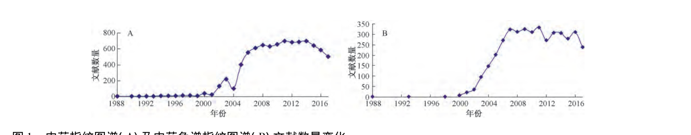

<!-- 方針: ほぼ全訳＋必要に応じた補足。原文（中文）構成に沿って訳出。本文の[N]は原文の番号引用に対応し末尾の参考文献にリンクする。図1（文献数推移）を原本から抽出。表1（類似度評価法の問題点と改良）は原文の技術的中核。「> 補足:」は訳者注。 -->

## 書誌情報

- 原題: 我国中药色谱指纹图谱相似度评价方法30年（1988—2017年）研究进展与展望（Research progress on chromatographic fingerprint similarity evaluation method for traditional Chinese medicine in the past 30 years (1988—2017) and its prospect）
- 著者: 邹纯才（ZOU Chun-cai）・鄢海燕（YAN Hai-yan）*（皖南医学院 薬学院, 安徽省蕪湖, 中国）
- 掲載: *中国中药杂志（China Journal of Chinese Materia Medica）*, 2018, Vol. 43, No. 10, 1969–1977. DOI: 10.19540/j.cnki.cjcmm.20180115.018
- インパクトファクター: **該当なし**（中文核心誌でJCR収載外）
- 種別: 綜述（レビュー）／安徽高校省級自然科学研究重大項目（KJ2015ZD41, KJ2016SD60）

> 補足: **中薬指紋図（フィンガープリント, 指紋图谱）** ＝薬材・飲片・抽出物・中成薬を適切に処理し、一定の分析技術で得た「化学的・生物学的その他の特徴を示す図」。中薬は多成分系のため、単一指標成分でなく「図全体のパターン」で品質を捉える。**類似度評価（相似度评价）** ＝被検品の指紋図と対照（共有モード）がどれだけ似ているかを0〜1の数値で表す手法。**夾角余弦（コサイン類似度）・相関係数・Nei係数（ピーク重畳率）** などが代表的指標。本レビューは、この「類似度の数値化」の30年の技術史を体系化したもの。

## 要旨（摘要）

30年の発展を経て、中薬クロマトグラフィー指紋図技術は学術的探討から中薬研究開発へ深化し実践に応用され、中薬産業の技術革新と中薬品質標準の進歩を推進した。中薬クロマト指紋図の類似度評価法はこの過程で決定的な役割を果たした。30年間に発表された文献数の変化と研究傾向に基づき、中薬クロマト指紋図の類似度評価を3段階——**直観比較段階（1988–1999）・類似度評価始動段階（2000–2009）・類似度評価発展完善段階（2010–2017）**——に区分した。本稿は30年の研究進展を総括し、将来の発展方向を展望して、本評価法が成熟段階へ進むことを期する。

**キーワード:** 中薬クロマトグラフィー指紋図；類似度評価法；品質管理

## 序論

中薬指紋図とは、薬材・飲片・抽出物・中薬成方製剤等を適切に処理後、一定の分析技術・方法で得た、その化学的・生物学的その他の特徴を示す図であり、中薬の品質評価・品質管理・新薬研究に用いる[1]。1988–2017年の、中薬指紋図および中薬クロマト指紋図のCNKI等データベースの文献数変化を図1に示す。クロマト法は分析化学分野で最も速く発展し最も広く応用され、中国の国情に適した分析法の一つで、高感度・高正確性・科学的で、中薬産業近代化の鍵となる品質管理技術であり、中薬指紋図構築の最も常用される方法である[2]。常用のクロマト指紋図技術には薄層クロマト（TLC）・液体クロマト（HPLC）・ガスクロマト（GC）・高速毛細管電気泳動（CE）指紋図等がある。各技術に利点・欠点・適用範囲の差があり、どれを選ぶかは被検品の性質と研究目的による[3]。クロマト指紋図研究の実際に基づき、類似度評価の研究過程を3段階（直観比較段階1988–1999・類似度評価始動段階2000–2009・類似度評価発展完善段階2010–2017）に区分できる（図1）。

## 1. 直観比較段階（1988–1999年）

中薬の近代化・国際化理念の深化に伴い、中薬材から中薬製剤までの全面的品質管理と複雑成分検出の方法が切実に求められ、指紋図技術が生まれた[3]。指紋図は1959年から関連研究が始まり1988年まで報告は少なく、1988–1999年に研究が徐々に増えた。

- **1.1 薄層クロマト（TLC）:** 1991年、蘇薇薇[4]はTLCで5種黄芩10試料の化学成分を分析、斑点情報を特徴抽出して定性情報を数値化し、数学演算・クラスター分析で正品黄芩と非正品を正確に区別した。1993年、顔玉貞ら[5]は展開剤を最適化し2回展開で黄連のプロトベルベリン型アルカロイドを分離、9〜13の蛍光斑点を黄連の指紋図として異なる試料を鑑別した（TLC指紋図技術による鑑別の初期報告）。
- **1.2 ガスクロマト（GC）:** 1988年、楊維稼ら[6]はGCで生薬柴胡のデータを取得、保持時間・保持指数を定性根拠に未知試料と標準を比較。洪筱坤ら[7]は相対保持値を用い19種柴胡属植物の精油クロマトを「GC-相対保持値指紋譜」に誘導、重畳ピークと8強ピークを比較分析した。相対保持指数は成分・固定相性質・カラム温度のみに依存し、カラム長・内径・流速・充填状態に依らないため、より正確・信頼できる。1991年、王智華・洪筱坤ら[8]はGC-相対保持値指紋譜で輸入白檀・麝香を分析比較[8]。洪筱坤ら[9]は相対保持指数・相対保持値分析法を提唱、後のデジタル化クロマト指紋譜理論の基礎を築いた。
- **1.3 高速液体クロマト（HPLC）:** 1993年、洪筱坤ら[10]はGC指紋譜原理に基づき19バッチの大黄のHPLC指紋譜を構築、大黄試料の鑑別・内在品質評価に使えることを示した。
- **1.4 毛細管電気泳動（CE）:** 1997年、胡平ら[11]は菟絲子の高速CE指紋図を構築（3.5〜7 minの指紋図で鑑別）。1998年、張朝暉ら[12]は高速CEで2種のタツノオトシゴ・ヨウジウオ類薬材を鑑別、種間差が明瞭であった。ただし指紋図間の差をどう比較するかの具体的方法は未確立であった。

この段階では中薬指紋図の理論体系はまだ形成されず、類似度の報告もなく、評価法は単一で、多くは直観対比法（被検試料と標準図の特徴比較）を用い、相対指数・重畳率・八強ピーク等の定量データの導入で直観対比法より科学的・正確になった。

## 2. 類似度評価始動段階（2000–2009年）

国家食品薬品監督管理局は2000年に《中薬注射剤クロマト指紋図研究の技術要求》通知（国薬管注[2000]348号）を発出。国家薬典委員会は2000年12月から実施を組織し、可行性調査（重点はクロマト指紋図）・規範的技術文書起草を進めた。2000年、屠鵬飛[13]は中薬指紋図の概念（一定の分析手段で得る、その中薬材の特性を示す共有ピークの図）を述べ、検出標準・起草説明を示した。羅国安ら[14]は中薬クロマト指紋図が現代技術で中薬の複雑系を最もよく表現できる方法とした。2001年、梁逸曾[15]はクロマト指紋図が中薬材の内在化学成分の濃度分布等の全体像を光譜指紋図より充分に表現できるとし、GAP・GMP・GLPに深遠な影響を及ぼす中薬品質管理の里程標とした[16]。謝培山[17]は、類似性がクロマト指紋図の最も基本的な属性で、中薬・製剤の内在品質の安定性・均一性の有効な評価法であると強調した。

- **2.1 TLC:** 2001年、李彩君ら[18]は高良姜のTLC指紋図を構築、高良姜素・山柰素等8指標成分の蛍光斑点の大きさ・スキャンピーク強度を評価指標に12種の高良姜を鑑別（文献[4-5]に対しスキャンピーク強度を追加）。2004年、謝培山ら[20]は10バッチの白芍総苷のTLC全譜画像を構築しバッチ間の高い類似性を示した。
- **2.2 HPLC:** 2001年、張文生ら[21]は10バッチの商洛丹参水溶性抽出物のHPLC指紋図で12共有ピーク・相対保持時間・相対ピーク面積を確定。この段階の類似度評価は主に、ピークの多少・大小の直観定性比較や共有/非共有ピーク比の人手計算で、個人の主観性を帯び、選定した数ピークの類似性のみを考慮して全体特徴を反映できなかった。そこで内在品質を定量的に反映する類似度ツールの創出が求められた。2002年、程翼宇ら[25]は指紋図類似性測度の概念を提唱、計算機シミュレーションで6種の類似性測度を比較し、参麦注射液に応用、**夾角余弦測度がバッチ間品質安定性の評価により適する** とした。陳閩軍ら[26]はピーク面積比較法がデータ点比較法より安定・信頼できるとした。張南平ら[27]は「対照指紋図」を参照系に用いることを提唱した。2003年、陳斌ら[28]は掌葉大黄のRP-HPLC(DAD)指紋図で共有モードを構築し、程翼宇・范骁輝提供の類似度ソフトで比較。張克栄ら[29]は赤芍のHPLC指紋図で夾角余弦・ユークリッド距離・相関係数で18試料の類似度を算出（赤芍0.80〜1.00、川赤芍<0.79）。馬欣ら[30]は銀杏葉抽出物のHPLC-DAD-MS-MS多次元指紋図で標準EGb 761との類似度を検討し、**ソフトのアルゴリズムが異なると類似度結果が異なり、類似度閾値の科学的決定が課題** と指摘した。
- **2.3 GC:** 2001年、銭浩泉ら[35]は10産地の高良姜精油のGC指紋図で偽品を区別。2004年、周欣ら[39]はGC-MSで温莪朮精油の指紋図（21共有ピーク）を構築。汤丹ら[40]は広藿香のGC-MS指紋図解析に人工ニューラルネットワーク（ANN）-誤差逆伝播（BP）ネットワークを構築。2007年、尹蓮ら[41]は加味四妙丸のGC指紋図と薬理データを数理統計で関連づけ、複方全体の成分-配合-薬効の相関を表現した（谱效関係の萌芽）。
- **2.4 CE:** 2003年、季一兵ら[42]は丹参のCE指紋図（11共有ピーク）を構築。魏英勤ら[43]は黄連の高速CE指紋図で各ピークの相対保持時間・面積比の相関係数がいずれも0.999超であった。

**国家薬典委員会のソフト開発:** 2004年、国家薬典委員会は瀋陽薬科大学・浙江大学・中南大学・清華大学等8機関を組織し《計算機補助中薬指紋図類似度計算ソフト》を集中テスト・定型化した。常用される類似度評価法には、ピーク重畳率法（Nei係数法）・相関係数法・距離係数法・ベクトル夾角余弦法・（ピーク重畳率と共有ピーク強度を結合した）改良Nei係数法がある。大量の計算化学的比較・検証により、指紋図の変動・小ピーク/大ピーク欠失の影響度を総合考慮して **夾角余弦法** を選択、データ標準化法と対照モードの計算（平均ベクトル〈重心〉・中位数ベクトル）を検討し、研究版（2004A、対照図生成機能あり）と検験版（2004B）を開発した。国家薬典委員会推奨は中南大学版（相関係数・相合係数を採用）と浙江大学版（夾角余弦を採用）である[34]。この段階で発見された類似度評価法の不足と改良法を表1に示す。

### 表1. 類似度評価法の問題点と改良法（原論文 Table 1）

| 年 | 著者 | 問題点 | 解決法 | 例と結果 |
|---|---|---|---|---|
| 2004 | 易倫朝ら[46] | 高含量成分が試料間の微差を遮蔽し類似度に影響 | 加重相似度法で判別 | 青皮のGC/HPLC指紋図で、リモネンの加重値0.2で微差を顕在化 |
| 2004 | 乔善磊ら[47] | 保持時間校正・内標ピーク選択が類似度に影響 | 内標ピーク選択と保持時間校正を規範化（保持時間校正式・ピーク面積校正 X校正=Xi/A内標） | 金銀花HPLC指紋図で安定した類似度を取得 |
| 2004 | 李博岩ら[48] | 主要特徴成分の保持時間ドリフト | 光譜相関クロマト＋局所最小二乗法でドリフト校正 | 銀杏/紅花抽出物HPLCで相関係数が明瞭に向上 |
| 2004 | 聂磊ら[49] | 一次元データは部分情報しか反映しない | 保持時間%とピーク面積%の二次元情報で表徴 | 銀杏製剤HPLCで二次元情報がより全面的・特異的 |
| 2005 | 劉永鎖ら[50] | 相関係数・夾角余弦はデータ範囲の広狭差に鈍感 | 改良程度相似度Q'（Q'=1−Σ|1−Xai/Xbi|/n） | 香丹注射液HPLCでデータ差をよく反映 |
| 2006 | 范骁輝ら[51] | 単一指紋図では全体を反映しにくく多対多比較が困難 | 各単元指紋図の並列/直列ピクセル級情報融合後に多元指紋図で類似度評価 | 複方丹参滴丸HPLCでバッチ間品質差を反映 |
| 2006 | 田潤涛ら[52] | 類似度評価法に曖昧な認識・誤区がある | 常用法の特性と特徴変数選択範疇を多角的に検討 | 灯盞細辛でピーク面積を指標に夾角余弦・相関係数法を推奨 |
| 2006 | 田潤涛ら[53] | 評価法の規範化が必要 | 計算機フィッティングとHPLCで各法の性能・特徴指標選択基準を検討 | 北柴胡HPLCで、成分含量情報＋中位数で参照指紋図を構築し信頼度を検討すべき |
| 2007 | 楊雲ら[54] | 夾角余弦（ピーク高/面積）は全局を精密に考慮せず基線分離・時間ドリフトに影響される | ピーク高（面積）重み係数で全譜類似度基数を校正 | 3組の田基黄HPLCで高精度に実際の類似度を算出 |
| 2008 | 孙国祥ら[55] | 夾角余弦・相関係数・Nei・改良Nei係数は定量機能を示しにくく、距離係数法は直観的総合定量結果を与えない | 乗方相似度・定量乗方相似度 Si=⁵√(xi/yi)−1 で評価 | 銀杏葉抽出物HPLCで定性定量評価が可能な新法 |
| 2008 | 安金兵ら[56] | 保持時間ドリフトでピーク面積値に大差が生じ信頼性に影響 | 擬分布関数＋Kolmogorov検定で異なる類別試料間の類似性分析 | 北/南マブリ（マンジュシャゲ属）HPLCでピーク面積変異問題を解決、鋭敏・頑健 |
| 2008 | 楊忠民ら[57] | 夾角余弦・相関係数法は溶媒に鈍感 | ピーク面積重みの非均一性で類似度を計算 | 中薬と香料のGC分析で総量関連の質量分析に適す |
| 2009 | 邹纯才ら[58] | クロマト保持時間ドリフトが識別・鑑定に影響 | 漸進窓正射影分析法（EWOPA）で異なる指紋図間のピークを正確にマッチング | 決明子HPLCで高速・漏れなくピークマッチング |
| 2009 | 冯启余ら[59] | 同一成分の保持時間が図ごとに異なり内標/標定ピークが必要 | 時間マッチング＋光譜情報（最大吸収波長）補助、VB6.0自作プログラムで無人の共有ピーク識別・類似度分析 | 肉苁蓉HPLCで省時・客観的に指紋図構築 |

## 3. 類似度評価発展完善段階（2010–2017年）

《中国薬典》2010年版は人参茎葉総サポニン等14種の植物油脂・抽出物、天舒カプセル等6種の成方製剤・単味製剤にHPLC指紋図で類似度評価を採用した[60]。国家薬典委員会は2012年に《中薬色谱指纹图谱相似度评价系统》2012年版を公開、電子標準図と類似度評価ソフトを各機関に提供した。《中国薬典》2015年版は羌活等2薬材、23種の植物油脂・抽出物、三七通舒カプセル等38種の成方・単味製剤にHPLC指紋図で類似度評価を採用[61]。**2010年版から2015年版で、クロマト指紋図で品質評価する中薬は20種から63種に増加** した。

2010年、鍾敬華ら[62]はクロマト指紋図が近い中薬材類別の定量評価類似度計算の新法を構築し、既存の全体類似度法が類別類似程度を評価できない限界を補った。王康ら[63]は偏最小二乗（PLS）でクロマト/光譜データから情報を抽出し類似度を計算（計算量少・信頼性）。詹雪艶ら[64]は最大ピーク比例同態性を指標に、組合せ相似度で非共有ピークの適切な重みを導入し、2試料のピーク面積差が大きいとき夾角余弦が鋭敏に差を反映できない問題を解決。2011年、孫国祥ら[65]は同一試料の多波長指紋図信号の加算平均で「均譜法」を構築、指紋情報を最大化。2013年、詹雪艶ら[66]は新程度相似度で複数共有ピークの平均差と離散度を反映、成分群配比の変動を管理。2015年、呉璐ら[67]は商権（エントロピー重み）法で江梔子と標準モードの類似度を計算。2016年、彭晶晶ら[68]は系統指紋定量法の宏定性・宏定量相似度で49バッチの芪参益気滴丸の全体品質を評価。2017年、李国強ら[69]はUPLC-UV＋UPLC-Q-TOF-MSで11バッチの当帰芍薬散含薬血漿の指紋図（類似度0.933超）を構築し15成分を分析、指紋図＋MS連携を体内成分の識別に応用した。

この段階は主に、指紋図情報量の最大取得、夾角余弦のデータ差異への鋭敏性向上、指紋図＋MS連携による含薬血漿指紋図構築などをより深く探討し、中薬品質管理への指紋図応用の完善を推進した。

## 4. 結論と展望

中薬標準化戦略は国家戦略であり、革新の重要な担い手である。中薬クロマト指紋図の類似度評価法は30年で、直観比較から、類似度の数値化、そして情報融合・MS連携・体内成分解析へと発展し、中薬の品質標準の進歩を支えてきた。今後は、夾角余弦のデータ差異感度のさらなる改善、指紋図と薬効の関連（谱效関係）の深化、質量分析連携による体内成分指紋図など、多方面での探討により、本評価法が成熟段階へ進むことが期待される。

> 補足（実務的示唆）: 本レビューは、中薬の「多成分パターンをどう1つの数値（類似度）に落とすか」の技術史を体系化したもの。実務の要点は3つ。①**指標はほぼ夾角余弦（コサイン）に収束**——薬局方ソフト（国家薬典委員会版）も夾角余弦を採用。単純だが「高含量成分が微差を遮蔽する」「2試料の面積差が大きいと差に鈍感」という弱点がある。②**最大の実務的敵は保持時間ドリフト**——カラム・条件で保持時間がずれると同じ成分が別ピーク扱いになり類似度が崩れる。対策として内標校正・局所最小二乗・窓正射影（EWOPA）などのピークマッチング／校正が繰り返し提案されてきた（表1）。③**改良の方向は「情報量の最大化」と「定量化」**——多波長均譜・情報融合・乗方相似度（定性定量両用）・MS連携。本サイトのスペクトル効果（谱效関係）系や指紋図＋定量（QAMS/Q-marker）系の論文を読む際、「その類似度は何の指標で、ドリフトをどう処理したか」を見る目安になる総説。

## 参考文献（References）

1. 杭太俊. 药物分析. 8版. 人民卫生出版社, 2016: 478.
2. 蔡宝昌, 潘扬, 殷武. 指纹图谱在中药研究中的应用. 世界科学技术, 2000, 2(5): 9.
3. 李强, 杜思邈, 张忠亮, 等. 中药指纹图谱技术进展及未来发展方向展望. 中草药, 2013, 44(22): 3091.
4. 苏薇薇. 聚类分析法在黄芩鉴别分类中的应用. 中国中药杂志, 1991, 16(10): 579.
5. 颜玉贞, 林巧玲, 谢培山. 黄连薄层指纹图谱研究. 中国中药杂志, 1993, 18(6): 329.
6. 杨维稼, 罗燕, 杨健, 等. 生药挥发油的气相色谱鉴定. 中日友好医院学报, 1988, 2(3): 135.
7. 洪筱坤, 王智华, 郭济贤, 等. 柴胡属19种植物挥发油的气相色谱-相对保留值的指纹分析. 药学学报, 1988, 23(11): 839.
8. 王智华, 洪筱坤. 进口檀香木的GC比较分析. 中国中药杂志, 1991, 16(1): 40.
9. 洪筱坤, 王智华, 朱孝芸. 麝香质量标准初探. 中国中药杂志, 1991, 16(4): 230.
10. 洪筱坤, 王智华, 李旭. 19个大黄样品HPLC指纹谱的比较分析. 上海中医药杂志, 1993(8): 32.
11. 胡平, 罗国安, 王如骥, 等. 中药菟丝子的高效毛细管电泳法鉴别. 中国中药杂志, 1997, 32(7): 549.
12. 张朝晖, 范国荣, 徐国均, 等. 12种海马、海龙类药材高效毛细管电泳法鉴别. 中国中药杂志, 1998, 23(5): 259.
13. 屠鹏飞. 中药材指纹图谱的建立及技术要求实例解说. 中国药品标准, 2000, 1(4): 22.
14. 罗国安, 王义明, 饶毅, 等. 中药注射剂指纹图谱建立实践分析. 中国药品标准, 2000, 1(4): 36.
15. 梁逸曾. 浅议中药色谱指纹图谱的意义、作用及可操作性. 中药新药与临床药理, 2001, 12(3): 196.
16. 任德权. 中药质量控制的里程碑-中药指纹图谱. 中成药, 2001, 23(1): 1.
17. 谢培山. 中药色谱指纹图谱鉴别的概念、属性、技术与应用. 中国中药杂志, 2001, 26(10): 653.
18. 李彩君, 林巧玲, 谢培山, 等. 高良姜中黄酮类成分薄层色谱指纹图谱鉴别. 中药新药与临床药理, 2001, 12(3): 183.
19. 聂孝平, 向大雄, 李焕德, 等. 薄层扫描指纹图谱法对克瘾宁胶囊中延胡索和夏天无的鉴别. 湖南中医学院学报, 2002, 22(1): 34.
20. 谢培山, 林巧玲. 白芍总苷的薄层色谱指纹图谱实验研究. 中药新药与临床药理, 2004, 15(3): 171.
21. 张文生, 叶正良, 岳洪水, 等. 丹参药材指纹图谱研究. 中药材, 2001, 24(7): 478.
22. 徐艳春, 魏璐雪, 周玉新, 等. 红车轴草中异黄酮的指纹图谱研究. 中国中药杂志, 2002.
23. 何春年, 李敏, 曹志高, 等. 葛根药材HPLC指纹图谱研究. 中国中药杂志, 2003, 28(12): 1141.
24. 邹华彬, 袁久荣. 共有峰率和变异率双指标指纹图错分析法分析马甲三维HPLC指纹图谱. 世界科学技术—中药现代化, 2003, 5(4): 36.
25. 程翼宇, 陈闽军, 吴永江. 化学指纹图谱的相似性测度及其评价方法. 化学学报, 2002, 60(11): 2017.
26. 陈闽军, 程翼宇, 林瑞超. 中药色谱指纹图谱相似性计算方法的研究. 中成药, 2002, 24(12): 905.
27. 张南平, 肖新月, 张萍, 等. 建立中药"对照指纹图谱"的可行性探讨. 中国药事, 2003, 17(6): 347.
28. 陈斌, 蔡宝昌, 潘扬, 等. 不同产地掌叶大黄HPLC指纹图谱的比较. 中草药, 2003, 34(5): 457.
29. 张克荣, 毕开顺. 赤芍HPLC指纹图谱的研究. 中草药, 2003, 34(11): 1048.
30. 马欣, 孙毓庆. 银杏叶提取物的多维指纹图谱研究. 色谱, 2003, 21(6): 562.
31. 钱浩泉, 谢培山. 中药液相色谱指纹图谱的方法学研究—银杏叶总黄酮指纹图谱个例剖析. 分析测试学报, 2004, 23(5): 7.
32. 张克荣, 毕开顺. 白芍HPLC指纹图谱相似度的分析. 中国中药杂志, 2004, 29(4): 380.
33. 孙国祥, 毕雨萌, 刘金丹, 等. 柴胡高效液相色谱数字化指纹图谱研究. 中南药学, 2007, 5(1): 79.
34. 刘永锁, 孟庆华, 蒋淑敏, 等. 相似系统理论用于中药色谱指纹图谱的相似度评价. 色谱, 2005, 23(2): 158.
35. 钱浩泉, 李彩君, 谢培山. 高良姜及其近缘植物挥发油成分的气相色谱指纹图谱研究. 中药新药与临床药理, 2001, 12(3): 179.
36. 魏刚, 符红, 王淑英, 等. GC-MS法建立广藿香挥发油指纹特征图谱研究. 中成药, 2002, 24(6): 407.
37. 张卫明, 姜洪芳, 张玖. 不同居群生姜呈香部位的气相色谱指纹图谱研究. 中国野生植物资源, 2003, 22(5): 53.
38. 袁敏, 曾志, 宋力飞, 等. 气相色谱指纹图谱用于连翘的质量控制. 分析化学, 2003, 31(4): 455.
39. 周欣, 李章万, 王道平, 等. GC-MS法建立温莪术挥发油指纹图谱研究. 中国中药杂志, 2004, 29(12): 1138.
40. 汤丹, 李薇, 许毅, 等. 广藿香指纹图谱解析的人工神经网络方法研究. 中药材, 2004, 27(7): 534.
41. 尹莲, 钱俊. 加味四妙丸有效部位群GC指纹图谱谱效关系及配伍变化研究. 中成药, 2007, 29(5): 634.
42. 季一兵, 郑朝华, 陈玉英. 丹参的毛细管电泳指纹图谱研究. 中成药, 2003, 25(12): 953.
43. 魏英勤, 袁久荣, 闫滨. 黄连的毛细管电泳特征指纹图谱研究. 中草药, 2003, 34(6): 563.
44. 元四辉. 国际色谱指纹图谱评价中药质量研讨会在广州召开. 中药材, 2001, 24(3): 198.
45. 谢培山. 刍议中药指纹图谱的现状、发展和问题. 中药材, 2007, 30(3): 257.
46. 易伦朝, 谢培山, 梁逸曾, 等. 青皮的指纹图谱研究. 中药新药与临床药理, 2004, 15(6): 403.
47. 乔善磊, 朱臻宇, 王建军, 等. 中药指纹图谱相似度计算的规范化研究. 第二军医大学学报, 2004, 25(10): 1114.
48. 李博岩, 梁逸曾, 胡芸, 等. 中药色谱指纹图谱组分保留时间漂移的校准. 分析化学, 2004, 32(3): 313.
49. 聂磊, 罗国安, 曹进, 等. 中药二维信息指纹图谱模式识别. 药学学报, 2004, 39(2): 136.
50. 刘永锁, 孟庆华, 蒋淑敏, 等. 相似系统理论用于中药色谱指纹图谱的相似度评价. 色谱, 2005, 23(2): 158.
51. 范骁辉, 叶正良, 程翼宇. 基于信息融合的中药多元色谱指纹图谱相似性计算方法. 高等学校化学学报, 2006, 27(1): 26.
52. 田润涛, 谢培山, 杨云. 色谱指纹图谱相似度评价方法的规范化研究(一). 中药新药与临床药理, 2006, 17(1): 40.
53. 田润涛, 谢培山, 杨云. 色谱指纹图谱相似度评价方法的规范化研究(二). 中药新药与临床药理, 2006, 17(2): 113.
54. 杨云, 朱学峰. 一种新的计算中药指纹图谱相似度方法与实现. 计算机测量与控制, 2007, 15(10): 1376.
55. 孙国祥, 史香芬, 毕雨萌, 等. 乘方相似度法定性定量评价银杏叶提取物HPLC指纹图谱. 中成药, 2008, 30(2): 157.
56. 安金兵, 许玉琼, 贺东奇, 等. 基于拟分布函数的中药色谱指纹图谱的相似性分析. 北京大学学报: 自然科学版, 2008, 44(5): 695.
57. 杨忠民, 李忠民, 赵曰利, 等. 指纹图谱相似度新算法的研究. 中国测试技术, 2008, 34(3): 141.
58. 邹纯才, 鄢海燕, 方洪壮. 渐进窗口正交投影分析法用于决明子色谱指纹图谱峰的匹配. 中国中药杂志, 2009, 34(22): 2876.
59. 冯启余, 等. 相似度评价方法(色谱指纹图谱). 分析科学学报, 2009, 25(1): 41.
60. 中国药典. 一部. 2010.
61. 中国药典. 一部. 2015.
62. 钟敬华, 侯晓蓉, 范骁辉. 化学指纹图谱类别相似性计算方法研究. 中国中药杂志, 2010, 35(4): 477.
63. 王康, 李华. 偏最小二乘方法在中药指纹图谱相似度研究中的应用. 计算机与应用化学, 2010, 27(12): 1681.
64. 詹雪艳, 史新元, 段天璇, 等. 色谱指纹图谱组合相似度的算法. 色谱, 2010, 28(11): 1071.
65. 孙国祥, 车磊, 李闫飞. 一种评价多波长中药色谱指纹图谱新方法-均谱法. 中南药学, 2011, 9(7): 533.
66. 詹雪艳, 史新元, 袁瑞娟, 等. 基于相似系统理论色谱指纹图谱相似度算法的研究. 计算机与应用化学, 2013, 30(9): 1033.
67. 吴璐, 黎晓丽, 刘婧, 等. 基于熵权相似度计算法的"江栀子"指纹图谱研究. 江西中医药, 2015, 46(396): 66.
68. 彭晶晶, 李晓稳, 李东翔, 等. 双波长超高效液相色谱指纹图谱鉴定芪参益气滴丸质量. 中南药学, 2016, 14(11): 1188.
69. 李国强, 王运来, 周敏, 等. 当归芍药散含药血浆UPLC-UV指纹图谱研究. 中草药, 2017, 48(19): 4017.
70. 张伯礼, 张俊华. 中医药现代化研究20年回顾与展望. 中国中药杂志, 2015, 40(17): 3331.
71. 谢培山. 中药色谱指纹图谱. 人民卫生出版社, 2005.
72. 罗国安, 粱琼麟, 王义明. 中药指纹图谱-质量评价、质量控制与新药研发. 化学工业出版社, 2009.
73. 申庆荣, 李刚. 中药谱-效关系研究进展. 右江民族医学院学报, 2010, 32(3): 412.
74. 陶金华, 狄留庆, 文红梅, 等. 中药指纹图谱谱效相关性研究思路探讨. 中国中药杂志, 2009, 34(18): 2410.
75. 陈闽军, 程翼宇. 基于遗传算法的色谱指纹峰配对识别方法. 分析化学, 2003, 31(5): 513.
76. Nielsen N, Carstensen J, Smedsgaard J. Aligning of single and multiple wavelength chromatographic profiles for chemometric data analysis using correlation optimised warping. *J. Chromatogr. A*, 1998, 805: 17.
77. 倪力军, 王国东, 郭佳, 等. 基于图论的色谱指纹图谱相似度评价方法. 分析科学学报, 2009.
