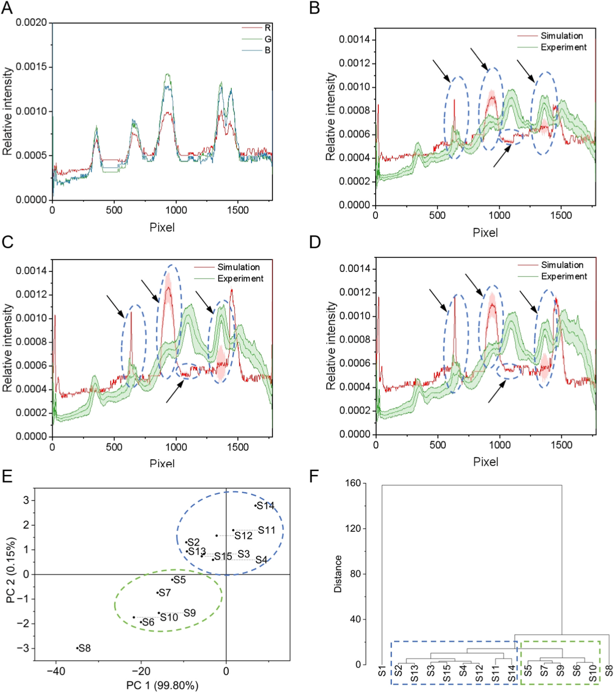
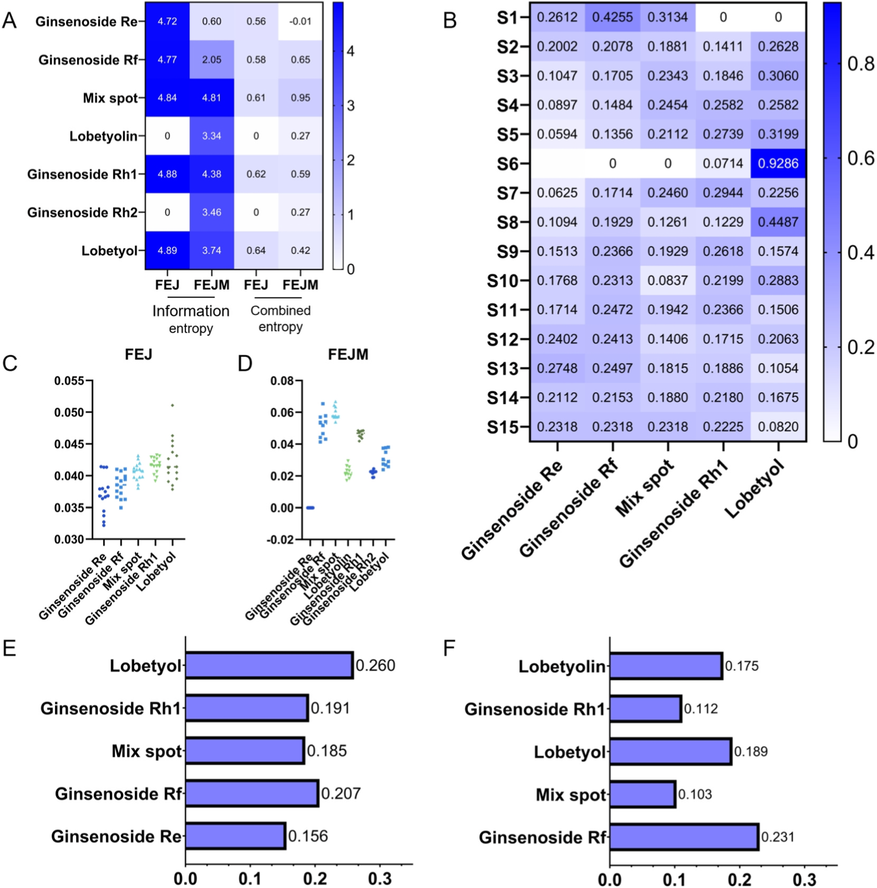

<!-- 方針: ほぼ全訳＋必要に応じた補足。原文構成に沿って訳出。「> 補足:」は訳者注。 -->

## 書誌情報

- 標題（原題）: Multidimensional chromatographic fingerprint fusion with machine learning: Entropy-based feature evaluation for TCM quality marker discovery
- 著者・所属: Jiamu Ma, Fang Lv, Letian Ying, Yongqi Yang, Yuqing Yang, Xiaodan Qi, Jianling Yao, Yu Cao, Lingzi Wu, Wanzhu Wang, Jiaqian Xing, Xinru Wu, Juan Qin, Yan Zhang（責任著者）, Gaimei She（責任著者）／ School of Chinese Materia Medica, Beijing University of Chinese Medicine（北京中医薬大学 中薬学院, 北京市房山区）／ Dong'e Ejiao Co., Ltd., Shandong Key Laboratory of Gelatine Medicines Research and Development（東阿阿膠股份有限公司, 山東省膠類薬物研究開発重点実験室, 山東省聊城市）
- 掲載誌・巻号・DOI: Talanta 303 (2026) 129500／https://doi.org/10.1016/j.talanta.2026.129500
- インパクトファクター: 6.1（Talanta, JCR 2024 / Clarivate。2025年6月公開のJournal Citation Reportsに基づく。なお一部のScopusベース指標サイトでは6.71という異なる値が示されるが、これはCiteScore系の別指標であり、JCRのImpact Factorとは算出方法が異なるため注意。数値は原文には記載されていないため訳者が別途調査した参考情報）
- 受理経過 / ライセンス: Available online 2 February 2026／Received 5 December 2025; Received in revised form 19 January 2026; Accepted 1 February 2026／© 2026 Elsevier B.V. All rights are reserved, including those for text and data mining, AI training, and similar technologies.

## 要旨（Abstract）

クロマトグラフィーは、中薬（TCM）の品質評価に用いられる基幹的な手法である。しかし、複数の化合物由来のシグナルが重なり合い干渉し合うというクロマトグラフィーデータの複雑さは、化学的に重要な特徴の正確な同定を妨げることが多い。本研究は、代表的なTCM方剤である複方阿膠漿（Fufang E'jiao Jiang, FEJ）における特徴的化合物の分子起源を追跡するため、多次元クロマトグラフィー指紋分析と機械学習を組み合わせた統合的アプローチを提案するものである。包括的な化学プロファイリングに続き、TLCおよびLC-HRMSを含むクロマトグラフィー指紋から多次元データセットを構築した。各データセットは、保持時間、m/z、RGB値に由来する1700を超える特徴量から構成される。ランダムフォレストなどの機械学習アルゴリズムを用いて判別特徴を選択し、FEJにおいて5つのパターン、その中間体において7つのパターンを特定した。これらは主にジンセノシド類として同定された。さらにシミュレーションモデルにより、単一化合物のクロマトグラフィースポットが試料の特徴を効果的に代表しうることを示し、これらの特徴の重要性を検証した。また、選択された特徴を評価・重み付けするために、修正エントロピー値と障害度（obstacle factor）を導入した。その結果、ロベチオリン（lobetyolin）およびジンセノシドRf（ginsenoside Rf）が、それぞれFEJおよびその中間体における主要な品質関連マーカーとして認識された。実験的検証により、本手法が重複するクロマトグラフィーシグナルを効果的にデコンボリューション（分離）し、重要な品質関連特徴を同定できることが示され、複雑な系における品質管理のための効率的かつスケーラブルな計算フレームワークが提供された。要約すると、本戦略は一般的なデータ構造とモジュール化されたアルゴリズム設計に基づいており、特定のドメイン知識に依存することなく、複雑なクロマトグラフィー指紋を持つあらゆる試料系（医薬品、環境、食品試料など）へ適用できることが期待される。

## 1. 序論（Introduction）

クロマトグラフィーは、中薬（TCM）方剤の品質評価に最も広く用いられる手法の一つであり、その中でも薄層クロマトグラフィー（TLC）と液体クロマトグラフィー（LC）の組み合わせが最も一般的である[1]。TLCは、複雑な化合物混合物のルーチンの化学分析に一般的に用いられており、特に迅速な定性・定量分析が低コストで強く求められる場合に有用である。TLCは、迅速な分離と操作の容易さから、様々な化合物とその代謝物を含む混合物の分離において依然として代替の効かない重要な地位を占めている[2–5]。広く用いられるクロマトグラフィー手法の中でも、TLCは化合物とその代謝物の分析における最も単純な方法であると評価する研究者もいる[6,7]。TLCは、移動相選択の幅広さ、試料識別における柔軟性、そして高い試料負荷容量という特徴を有しており、そのため複雑な化学物質の化学組成プロファイルを得ることが可能である[8]。TLCが色によって豊富な化学物質に関するより明確な情報を提供するのに対し、質量分析と組み合わせたLC（LC-MS）はほぼすべての種類の二次代謝産物に関する詳細な情報を提供する。液体クロマトグラフィー－高分解能質量分析（LC-HRMS）は高い感度と広範な試料適応性を有しており、これにより化学的特性の包括的かつ効率的な研究と、試料間の動的変化のモニタリングが可能となる。しかし、TLCおよびLC-HRMSの生データの解析は、化学プロファイルのさらなる徹底的な理解を制限している。

TCMの複雑性を探索するための全体論的かつ定量化可能なアプローチとしてのクロマトグラフィー指紋は、化学化合物の比較的完全な包括的プロファイルを構築するために本研究に導入された[9,10]。これまでの研究では、天然物の構造分類[11]、生薬原料の植物起源[12,13]などを分類するためのモデルが確立されてきた。これらの研究はコンピュータ処理によるTLCフィンガープリントの評価を試みているものの、分類を決定する特徴量や、選択されたマーカー化合物の性能は依然として不明確なままである。化合物のプロファイリングは、まったく同じ条件下で同時に多数の試料を可視化できるTLC画像を通じて正確に達成されうる[13]。各バンドについて、化合物組成プロファイリングの特徴情報のセットは、バンドの色とパターンのグレースケールを調べることによって作成できる。しかし、TLC画像特徴であれLC-HRMSスペクトルデータであれ、依然として残る主要な課題は、ノイズや無関係な変動ではなく、真に品質を示す数百から数千の変数の中から最も有益な特徴をいかに効果的に選択するかである。

TLCフィンガープリントから意味のある特徴、あるいは対応する化合物を特徴づけることは、クロマトグラム中の微妙な変化が定義しにくいことが多いため、複雑な作業である。ケミインフォマティクスは、フィンガープリント分析において重要な役割を果たしている[9,10]。ケミインフォマティクス分析を用いることで、複雑な分析手順を排除できる[14]。一方で、より単純な機器や最小限の手順に切り替える際には、分析精度の低下が生じる可能性がある。機械学習やエントロピーモデルなどの他の評価方法の助けを借りることで、この損失を十分に補う可能性が提供される[15–17]。したがって、TLCフィンガープリント分析と、ケミインフォマティクス、機械学習に基づく特徴選択、およびエントロピーに基づく評価の統合は、TLCデータを評価し重要な品質マーカーを特定するための強力なアプローチを構成しうるものであり、これが本研究の焦点である。

複方阿膠漿（FEJ）は、阿膠（Colla corii Asini）、熟地黄（Radix Rehmanniae Preparata）、紅参（red ginseng）、党参（Radix Codonopsis Pilosulae）、山楂（Fructus Crataegi）から構成される、よく知られたTCM方剤である。これは中医臨床において広く用いられ、気血両虚の治療に処方される[18]。我々の先行研究に続き、「スペクトル－効果」関係とネットワーク薬理学を通じて品質マーカーがスクリーニングされ、FEJの品質規格も改善されてきた[2,18]。しかしながら、FEJの製造プロセスにおける主要化合物の伝達性・追跡可能性は依然として不明である。サポニンおよびトリテルペノイドに富むn-ブタノール層は、中国薬典[19]によってFEJの品質評価における主要な画分として認識されている。したがって本研究では、全化学物質ではなく、この特定の画分に焦点を当てた。

我々は、TCM方剤における化学物質評価を低コストで行うことの重要性に対処するため、TLCとLC-MSクロマトグラフィー指紋を組み合わせた統合的アプローチを提案した。機械学習を活用した特徴選択と計算的評価手法を用いることで、最終FEJ製品だけでなくその中間体製品（FEJM）においてもマーカー化合物を識別することを目指した。このアプローチにより、FEJにおいてロベチオリン（lobetyolin）が、FEJMにおいてジンセノシドRf（ginsenoside Rf）が重要な化合物として同定され、複雑なTCM方剤の製造プロセス全体を通じた品質モニタリングと追跡可能性のための新規な戦略が提供された。さらに、本アプローチは「特徴融合－機械学習スクリーニング－エントロピー重み付け選択」として実施されるモジュール化された計算パイプラインとして設計されており、特定のドメイン知識を必要とすることなく、医薬品や環境試料など多様な複雑系に適応可能である。

## 2. 材料と方法（Materials and methods）

### 2.1. 化学物質、材料および試薬（Chemicals, materials and reagents）

複方阿膠漿（FEJ）15バッチ、FEJの7つの製造プロセスに由来する中間体21バッチ、および単一の生薬を欠く陰性試料（N1〜N4）は、すべて東阿阿膠股份有限公司（Dong'e Ejiao Co., Ltd.）から提供された。それぞれS1〜S15（FEJ試料）、I1〜I21（FEJ中間体）、N1〜N4（陰性試料）と番号付けされ、対応するロット番号はTable S1（補足資料）に示されている。

紅参（121045–200604）およびCodonopsis radix（党参, 121057–202107）の対照生薬、ならびにジンセノシドRg2（111779–200801）、ジンセノシドRb1（110704–202230）、ジンセノシドRb2（111715–202104）、ジンセノシドRd（111818–202104）、ジンセノシドRe（LENA-CAAA）、ジンセノシドRg1（110703–202235）、ジンセノシドRg3（110804–201504）、ジンセノシドRh2（111748–202102）、およびジンセノシドRo（111903–202106）の対照標準品は、中国食品薬品検定研究院（Chinese Academy of Food and Drug Control）から入手した。ジンセノシドRc（DST180120-013）、ジンセノシドRb3（DST180913-008）は成都デシテ生物科技有限公司（Chengdu DeSiTe Biological Technology Co. Ltd.、中国）から入手した。ジンセノシドRh1（AF20050408）、ジンセノシドRg5（AF21051605）、ロベチオール（lobetyol, 136171-87-4）は成都アイファ生物科技有限公司（Chengdu Aifa Biotechnology Co. Ltd.、中国）から入手した。ジンセノシドRf（PRF9061942）およびロベチオリン（lobetyolin, PRF9121002）はBiopurify Phytochemicals Ltd.（中国）から入手した。すべての対照標準品の純度は98%を超えていた。上記以外の他の試薬はすべて市販品を使用した。

### 2.2. 試料調製および標準溶液調製（Sample preparation and standard solutions preparation）

FEJおよびFEJM（中間体）のいずれについても、各試料20 mLを、水飽和n-ブタノール等量（20 mL）で一段階抽出した。n-ブタノール層を分離し、アンモニア溶液20 mLで1回洗浄した後、さらに水飽和n-ブタノール20 mLで3回抽出した。合わせた有機相を蒸発乾固した。得られた乾燥残渣をメタノール1 mLに再溶解し、これを分析用の試験試料溶液とした。

生薬試料1.0 gを水50 mLで45分間超音波抽出に供した。定性ろ紙でろ過した後、抽出液を対照溶液とした。この対照溶液は試料と同様の手順で処理した。標準品（ジンセノシドRo、ジンセノシドRe、ジンセノシドRf、ジンセノシドRh1、ジンセノシドRh2）はメタノールに溶解して濃度1 mg/mLとし、標準溶液として用いた。

### 2.3. TLCクロマトグラフィーパラメータおよび条件（TLC chromatographic parameters and conditions）

分離は10 cm × 10 cmのシリカゲルGプレート（Qingdao Ltd.、中国）を用いて実施した。FEJ試料（8 µL）、対照標準溶液（1 µL）、紅参対照生薬（2 µL）、Codonopsis radix対照生薬（8 µL）を、定量キャピラリーを用いてプレート下端から10 mmの位置に点着した。次いでプレートを、トリクロロメタン：メタノール：1%ギ酸水溶液（6.5：2.5：0.5, v/v）から構成される移動相であらかじめ飽和させた二槽式展開槽に入れ、展開剤がプレート下端から80 mmに達するまで室温で約30分間展開した。展開後のプレートを展開槽から取り出し、乾燥後、10%硫酸エタノール溶液に浸漬し、パターンが明瞭な発色を示すまで105 ℃で加熱した。すべてのプレート画像は可視光下で撮影した。

### 2.4. UPLC-QE-MS/MS分析（UPLC-QE-MS/MS analysis）

UPLC分析はVanquish UPLCシステム（Thermo Fisher Scientific, Waltham, MA, USA）を用いて実施した。クロマトグラフィー条件は以下の通りである：HSS T3カラム（2.1 mm × 100 mm, 1.8 µm, Waters Co., Milford, MA, USA）を用い、流速0.3 mL/min、カラム温度35 ℃とした。移動相A・Bはそれぞれ0.1%ギ酸水溶液（v/v）およびアセトニトリルとした。溶媒プログラムは以下の通りである：
- 0〜5分：95–75% A
- 5〜15分：75–50% A
- 15〜20分：50–30% A
- 20〜25分：30–5% A
- 25〜28分：5–95% A
- 28〜30分：95% A

試料は15 ℃に維持し、注入量は5.0 µLとした。

質量分析は、ESI（エレクトロスプレーイオン化）ポジティブおよびネガティブイオン化モードにおいてQ Exactive Orbitrap高分解能質量分析計（Waltham, MA, USA）を用いて実施した。取得条件は以下の通りである：スプレー電圧 3.8 kVまたは−3.2 kV、キャピラリー温度 350 ℃、補助ガスヒーター 350 ℃、シースガス 40 Arb、補助ガス 15 Arb、質量範囲 100〜1500 Da。フルMS分解能：70000、MS/MS分解能：17500、衝突エネルギー：NCEモードで15/30/45。

### 2.5. データセットプロファイリングおよびTLC・LC-HRMSフィンガープリントの構築（Dataset profiling and conduction of TLC and LC-HRMS fingerprint）

#### 2.5.1. TLCフィンガープリントの構築

TLC画像はスマートフォンのカメラを用いて取得した。スマートフォンは固定スタンドに設置し、TLCプレートは水平面に置いた。一貫性を確保するため、すべての画像はカメラのフラッシュを使用せず、一定の周囲の室内照明下で撮影した。前処理を標準化するため、元のTLCプレート画像をAdobe Photoshopに読み込んだ。簡潔に述べると、各試料チャンネルの脱彩色・ノイズ除去にはメディアンフィルタを用い、単一の均一サイズの画像を得た。ImageJを用いて、画像のピクセルのRGB（赤・緑・青）チャンネルから「Plot Profile」機能によりデータを抽出した。RGBチャンネルの強度値は反転させ、各チャンネルの強度値を差し引くことで、最大強度値255の「ピクセル強度」マトリクスを作成した。ImageJの「Measure」機能はパターンの灰色値の決定に用いられ、同時にRf値を算出した。元のTLCプレート画像はまずグレースケールに変換した。各ピクセル位置における相対グレースケール強度は、その絶対強度をレーン全体（あるいは該当する場合はプレート全体）のグレースケール強度の合計値で正規化することによって算出した。このプロセスは式(1)として表現され、各ピクセルの強度が全化学プロファイルへの相対的寄与を表す、正規化された二次元データセットを生成する。したがって、「グレー値－Rf値」マトリクスが得られた。

> 補足: 相対グレースケール強度の計算式は以下の通りです（原文の式(1)）。
> $$I_{rel} = \frac{I_{pixel}}{I_{total}}$$ (1)
> ここで $I_{rel}$ は個々のピクセルの相対グレースケール強度、$I_{pixel}$ は算出対象ピクセルの絶対グレースケール強度、$I_{total}$ はすべてのピクセルの絶対グレースケール強度の合計を表す。

TLC平板のピクセル強度マトリクスを用いてFEJおよびその中間体のTLCフィンガープリントを解析した。ピクセル補正およびピークマッチングのため、試料S1のRGB強度マップを参照パターンとして用いた。データ幅は1ピクセルに設定した。平均強度値を算出することで対照マップを作成した。解析は10 cm × 10 cmのTLCプレートに対して実施し、元画像の解像度はFEJで2300 × 2250ピクセル、FEJMで2800 × 2250ピクセルであった。ピーク補正・マッチング後、FEJのTLCフィンガープリントを構築した。

類似度評価は対照マップを標準としたコサイン類似度法により実施した。算出式(2)は以下の通りである：

> 補足: コサイン類似度 $S$ の計算式は以下の通りです（原文の式(2)）。
> $$S = \frac{\sum_{i=1}^{n} x_i y_i}{\sqrt{\sum_{i=1}^{n} x_i^2} \sqrt{\sum_{i=1}^{n} y_i^2}}$$ (2)
> ここで $x_i$ はピクセル値、$y_i$ は対応するピクセルの強度を表す。

#### 2.5.2. LC-HRMSフィンガープリントの構築

すべての生データファイルはMSDIAL（v 5.4.24）を用いて.mzML形式に変換し、MS/MSレベルですべてのスペクトルを抽出した。スペクトルの強度、プレカーサーイオンm/z、および保持時間も保存された。次に、保持時間が0.5分未満、またはMS/MSスペクトルを欠くスペクトルは除外した。スペクトルは、自社データ、対照標準品、およびMSFinder（v 3.61）による計算に基づいて注釈付けし、主要なフラグメントを記録した。保持時間は、絶対保持時間をそれぞれの最大保持時間で除することにより正規化した。フラグメント強度は、各スペクトルの各ピークについて、そのピークの強度をスペクトルの総強度で除することにより正規化した。

LC-HRMSフィンガープリントは、解析用に2つの相補的なデータセットを生成するよう処理された。第一に、各試料について「保持時間－全イオン強度」マトリクスを構築した。これらのマトリクスのコサイン類似度を算出し、全体的なプロファイル類似度を評価するとともに、試料間で有意なばらつきを示す保持時間領域を特定した（TLC画像マトリクス解析に用いた手法と類似の方法論）。第二に、特定された差異領域について、「相対保持時間－プレカーサーイオンm/z」リストを抽出し、ばらつきに寄与する特定の化合物の同定を可能にした。

### 2.6. 意味のある特徴を選択するための計算モデル（Computational models for selecting the meaningful features）

#### 2.6.1. ケミインフォマティクス解析

7つの異なる製造プロセスに由来するFEJ 15バッチおよびFEJM 7バッチの合計を、検証のために対象とした。ケミインフォマティクス解析は、TLCおよびLC-HRMSフィンガープリントの両方を評価し、これらのバッチ間の類似点と相違点を明らかにするために用いられた。主成分分析（PCA）と階層的クラスタリング解析（HCA）を併用してFEJおよびその中間体を評価した。解析はOrigin 2024bで実施した。

#### 2.6.2. 特徴選択

TLCおよびLC-HRMSフィンガープリントから判別特徴を選択するため、ランダムフォレスト（RF）分類器を実装した。解析はPython（バージョン3.9）およびscikit-learn機械学習ライブラリ（バージョン1.2）を用いて実施した。RFモデルは以下のハイパーパラメータで構成した：決定木の数は1000に設定し、各木の最大深さはNone（すべての葉が純粋になるまでノードが拡張されることを許容）に設定し、各ノードで最良の分割を検討する特徴量の数は「sqrt」（総特徴量数の平方根）に設定した。分割の質を測定するにはジニ不純度基準を用いた。その他のすべてのパラメータはscikit-learnバージョン1.2のデフォルト設定を使用した。頑健な判別特徴を特定するため、二段階の基準を適用した。第一に、PLS-DAモデルから変数重要度プロジェクション（VIP）スコアが1.0を超える特徴を選択した[20,21]。続いて、これらの候補特徴の重要度を、RFモデルにおける平均ジニ係数低下量によって検証し、両方の独立したアルゴリズムにおいて一貫して上位の寄与因子としてランク付けされることを確認した。

#### 2.6.3. 選択された特徴によりTLCフィンガープリントをシミュレートするための適合モデル

選択された特徴が全体のTLCフィンガープリントプロファイルに対して果たす寄与を定量的に評価するため、線形適合モデルを確立した。このモデルは、ある位置におけるクロマトグラフィーシグナルの強度が、対応する化合物の濃度に比例するという原理に基づく。任意の点における累積フィンガープリント $F(\tilde{p})$ は、すべての個々の成分からの寄与の合計としてモデル化できる。式は以下の通りである：

> 補足: 累積フィンガープリント $F(\tilde{p})$ の計算式は以下の通りです（原文の式(3)）。
> $$F(\tilde{p}) = \sum_i C_i \times I_i(\tilde{p})$$ (3)
> ここで $\tilde{p}$ はTLCフィンガープリント内の空間座標（例：相対保持係数 Rf）を表し、$C_i$ は化合物 $i$ の濃度、$I_i(\tilde{p})$ は化合物 $i$ の強度を表す。$I_i(\tilde{p})$ は、単位濃度における化合物 $i$ の純標準品の標準化された強度プロファイルであり、化合物の化学的性質と固定相との相互作用によって支配される特徴的な空間位置とバンド形状を規定する。

> 補足: 原文には式(2)（TLCのコサイン類似度）とほぼ同じ数式が本文中に「式(2)」として再掲されていますが、これはF(p̃)の展開に用いられるコサイン類似度の一般形（本補足の式(2)参照）に対応するものであり、原文の記述順に沿って訳出しています（原文参照）。

### 2.7. 修正エントロピー値と障害因子による特徴評価（Evaluation of the characteristic features by modified entropy values and obstacle factors）

クロマトグラフィーフィンガープリントから選択された特徴を定量的に評価し、FEJまたはFEJMの全体的な化学プロファイリングへのそれらの相対的寄与を評価するため、修正結合エントロピーモデルを用いた。このモデルは各特徴のエントロピー重みを算出することで機能し、これは情報的重要性の客観的な尺度となる。エントロピーが低い（すなわち、試料間でシグナル分布がより一貫しておりランダム性が低い）特徴は、より安定していると見なされ、より高い重みが与えられ、品質マーカーとしての可能性がより高いことを示す。プロセスは、各特徴のグレースケール強度を抽出し正規化するデータ前処理から始まった。第i番目の特徴について、全試料にわたるその強度値は式(4)によって確率様の値に変換され、その相対的な存在量を表す。続いて、式(5)を用いて各特徴の情報エントロピー（Eᵢ）を算出し、試料集合全体にわたるその強度分布の無秩序性・ランダム性を定量化した。Eᵢの値が大きいほど、ばらつきが大きく安定性が低いことを示す。最後に、式(6)によりエントロピーを重み付け係数に変換したエントロピー重み（Wᵢ）を導出した：

> 補足: 各式は以下の通りです（原文の式(4)〜(6)）。
> $$p_i = \frac{x_i}{\sum x_i}$$ (4)
> $$E_i = -\frac{\sum_{i=1}^{n} p_i \ln(p_i)}{\ln(n)}$$ (5)
> $$W_i = \frac{1 - E_i}{\sum (1 - E_i)}$$ (6)
> ここでiはi番目の特徴、$x_i$ は絶対強度を表す。この計算により、より安定した（すなわちエントロピー $E_i$ がより低い）特徴には、より高い重み（$W_i$）が与えられることが保証される。これは最大エントロピー状態からの乖離度を表すためである。式(6)の分母における総和は全特徴にわたって計算され、重みの合計が1になるよう正規化する。この枠組みにおいて、より高いエントロピー重みを持つ特徴は、その一貫したシグナルがより信頼性の高い製品品質の指標となるため、潜在的な品質マーカーとして優先された[22]。

フィンガープリントプロファイル中の有用なパターンの情報エントロピーを包括的に評価するため、以下の算出が提案された：

> 補足: 各式は以下の通りです（原文の式(7)〜(9)）。
> $$g_i = 1 - W_i$$ (7)
> $$R_i = \frac{W_i}{\sum_{i=1}^{n} W_i}$$ (8)
> $$C_i = \sum_{i=1}^{n} R_i X_i$$ (9)
> ここで $g_i$ は情報効用値、$R_i$ は関連TLCパターンの重み、$C_i$ は有用な特徴の結合効用値を示す。

障害因子診断モデルは、FEJ試料およびFEJ中間体の品質に対する各有用化合物の障害度（obstacle degree）を算出するために用いられた。障害因子診断モデルの計算式は以下の通りである：

> 補足: 障害度 $O_{ij}$ の計算式は以下の通りです（原文の式(10)）。
> $$O_{ij} = \frac{\sum_{j=1}^{n} Co_{ij} De_{ij}}{\sum_{i=1}^{m} Co_{ij} De_{ij}}$$ (10)
> ここで $O_{ij}$ はj番目のバッチにおけるi番目の化合物の障害度を表す。$Co_{ij}$ は因子寄与度であり、本研究では等しい重みが割り当てられている。$De_{ij}$ は偏差度を表し、各化合物の目標（望ましい）値と実際の値との差として算出される。本研究では、各化合物の目標値は正規化された最大値（すなわち1）と定義され、したがって $De_{ij}$ は各指標の正規化値の補数として表される。

## 3. 結果と考察（Results and discussion）

### 3.1. TLCおよびLC-HRMSフィンガープリントのプロファイリング（Profiling of TLC and LC-HRMS fingerprint）

#### 3.1.1. TLCプロファイリング解析

確立されたFEJのTLC条件は、中国薬典に収載されている方法と比較して改変されたものである。この方法は、同一の試料調製方法とTLC条件を用いて、1枚のプレート上で2種類の生薬（紅参とCodonopsis radixの薬片）を同時に識別するという目標を達成し、識別効率を大幅に向上させた。先行研究と比較して、本方法は2種類の生薬由来のより多くの標準品を参照しており、有用な化合物を特定する可能性を高めている[2]。確立されたFEJおよびFEJM試料のTLC法は、特異性、再現性、耐久性を評価することにより検証された（Fig. S1）。方法検証に続き、FEJの異なるバッチのTLCプレート解析により、標準溶液との比較で6種の化合物が同定された（Fig. S2A）。紅参およびCRの主要化合物についても、生薬対照試料との比較によりFEJ試料中に同様に認められた。FEJ試料に関しては、バンドの大部分は本質的に同一であったが、色の濃淡にわずかな変動が依然として認められ、これはジンセノシドRo、ジンセノシドRe、ジンセノシドRfなどの化合物含量が大きく変動していたことを示唆した。「生薬原料－生薬飲片－中間体－製剤」のTLCプレートにおいても、バンドは同様の傾向を示した（Fig. S2B）。FEJの製造プロセス中にバンドが大きく変化したことは明らかであり、これは化学プロファイルが著しい変化を経たことを示している。標準対照および陰性対照試料と比較して、ジンセノシド類（例：ジンセノシドRg1およびRg5）が顕著に濃縮されていた。対照的に、地黄（Rehmanniae Radix Praeparata）や山楂（Crataegi Fructus）由来と推定される特定の化合物の含量は減少していた。一方で、経験や標準対照の種類が従来のTLC分析手法における厳しい制約であることは依然として不足点であった。これにより、試料中の重要な分子を正確に同定することが困難となり、試料の品質を評価・管理することが困難であった。

#### 3.1.2. LC-HRMSプロファイリング解析

FEJおよびFEJMの化合物プロファイリングは、フルスキャンモードのUPLC-HRMSにより調査された。全イオンクロマトグラム（TIC、Fig. 1D・E）に示されるように、よく分離されたピークが観察された。本研究では、18種のジンセノシド、ステロイド類、脂肪酸類、フラボノイド類など、合計826種の化合物が特徴づけられた。標準品との保持時間、分子量、タンデム質量スペクトルの比較により、15種のトリテルペノイドサポニンが同定された。化合物リストはTable S2に示されている。

ここでは、FEJの代表的な主要化学タイプであるプロトパナキサトリオール（PPT）型ジンセノシドおよびプロトパナキサジオール（PPD）型ジンセノシドを例として用い、化合物特性決定プロセスを示す。ジンセノシドは主に2つの大きなグループに分類され、C-3位に糖鎖（C-20位への付加の有無を問わず）を有するPPD型と、C-6位に糖鎖（C-20位への付加の有無を問わず）を有するPPT型に大別されることが判明した。

化合物#341（保持時間10.74分に溶出）と化合物#571（保持時間18.36分に溶出）は、いずれもm/z 799.48に同一のプレカーサー質量を有することが観察された。これらの化合物は、単一のグルコース単位の脱離に対応するm/z 637.4335のフラグメントイオンを生じた（[M-H-Glu]-）。続くフラグメントイオンはm/z 475.3732に観察され、これは2つ目のグルコース単位の脱離に対応する（[M-H-2Glu]-）。これらのイオン間の約162 Daの質量差は、2つのヘキソース残基の連続的な脱離を確実に裏付け、二配糖体構造であることを示している。提案されたフラグメンテーション経路に従い、自社ライブラリ中の候補構造をスクリーニングすることにより、化合物#341はジンセノシドRg1またはジンセノシドRfのいずれかであると同定された。これらのC logP値を比較すると、ジンセノシドRg1は2.292、ジンセノシドRfは3.097であり、ジンセノシドRfのほうがより長い保持時間を示すことを示している。したがって、化合物#341はジンセノシドRg1、化合物#571はジンセノシドRfと同定された。

化合物#366は保持時間11.39分に溶出し、プレカーサー質量はm/z 1107.5958であった。C-20位のオレフィン鎖の解離により形成される特徴的フラグメントイオンであるm/z 375.2913のプロダクトイオンは、この化合物がPPD型ジンセノシドに属する可能性を示している。さらに、m/z 945.6276、m/z 783.4916、m/z 621.4384のフラグメントは、プレカーサーイオンから1つのグルコース置換基が連続的に脱離することによって形成された。したがって化合物#366はジンセノシドRb1と同定された。

総じて、FEJとFEJMの化合物組成にはわずかな差異が認められたが、これは製造プロセス中の化合物変換に起因する可能性がある。UPLC-HRMS分析は、二次代謝産物の同定に十分な情報を提供することができた。

### 3.2. 多重フィンガープリントデータセットの構築と評価（Construction and evaluation of multiple fingerprint dataset）

生のTLC画像は従来の分析対象であるが、デジタル解析なしにぼやけたパターンを識別することは困難である。さらに、パターンの色の濃淡の違いによってもたらされるTLCの定量的性質も、有用な化合物を識別する難しさを増大させる。本研究では、確立された手法に従って修正されたRGBチャンネルの信号をそれぞれ抽出することにより、TLC画像を信号スペクトルに変換した[12]。ピクセル強度マトリクスとグレー値-Rf値マトリクスは異なる分析目的に供された。前者はクロマトグラム画像全体の完全な高解像度RGB情報を捉えたものであり、その3次元（FEJで3×15×2180、FEJMで3×14×2180）はそれぞれRGBカラーチャンネル、試料数、展開方向に沿った総ピクセル数を表す。このマトリクスは大域的なパターン認識と類似性解析に利用された。対照的に、グレー値-Rf値マトリクスは、特定の化学バンドの定量的評価のために設計された縮約特徴マトリクスであった。これは画像をグレースケールに変換し、あらかじめ定めたRf位置における平均グレー値を抽出することによって生成された。その結果、その次元（FEJで1×15×12、FEJMで1×14×12）は、単一のデータチャンネル（グレー値）、試料数、追跡バンド数（Rfポイント）にそれぞれ対応する。TLC画像はピクセル、強度、グレー値の3つの要素から構成される。これらの要素は連携して、元のTLC画像を容易に検査可能なデータセットに変換する。複雑な化合物混合物の分子起源を明らかにするため、TLCプレート中の有用な化合物を同定する手法を、フィンガープリント構築の初期段階から提案した。Fig. 1Aに示すワークフローの通り、TLCフィンガープリントを構築し、FEJおよびFEJMのTLCフィンガープリントをFig. 1B・C・Fに示した。さらに、LC-HRMSフィンガープリントも、TLCフィンガープリントと同様のワークフローに従い若干の調整を加えて構築し、大規模な化学空間から見た並行的な参照となることを目指した。予想通り、より多くの化合物がLC-HRMSフィンガープリントによって検出された（Fig. 1D・E・G）。しかし、これらの化合物の寄与や、その特徴的化合物が混合物全体を理解する上で十分であるかどうかは不明であった。

TLCフィンガープリントデータセット（「ピクセル強度」マトリクスおよび「グレー値-Rf値」マトリクスを含む）は、前処理（例えば各チャンネルの脱彩色・ノイズ除去、マトリクスへの変換）後に構築された。FEJ試料の「ピクセル強度」マトリクスでは、データセットは1781×19の特徴量で構成された。同時に「グレー値-Rf値」マトリクスには2181×22の特徴量が存在した。目視検査では異なるバッチのFEJの主要な特徴はほぼ同一であったにもかかわらず、いくつかのピーク（TLCパターン）が試料間でわずかな違いを示すことは明らかであった（Fig. S3 A-C）。化学組成だけでなく、主要化合物の相対含量もフィンガープリントプロファイリングに影響を与えた。この結果は、製品の安定した高品質を保証するためにFEJ中の有用化合物を管理する必要性を示している。FEJMのTLCフィンガープリントについては、より多くの化合物がFEJと比較して製造プロセス中に大きく変化した（Fig. S3 D-F）。これは、製造プロセスが化学組成および化合物含量を変化させることを示し、より多くの注意を紅参に向けるべきことを示唆した。FEJ試料の多様性と共通性、およびその伝達プロセスを理解するため、PCA解析およびHCA解析が採用された。Fig. 2に示すように、FEJ試料はR、G、Bチャンネルにおいて3つのグループに分類された。Rチャンネルのプロカ分析において、試料は強度と相対ピクセル（対応する化学成分の含量にも関連する）に応じて、PC1（説明分散48.82%）およびPC2（説明分散23.42%）に沿った傾向を示すようであった。GおよびBチャンネルの結果については、PC1はそれぞれ45.12%と47.90%であり、PC2は29.89%と28.10%であった。同様の分類結果はHCA解析でも観察された（Fig. 2D–F）。RGBチャンネルにおける異なる分類結果として、RチャンネルとBチャンネルは同一の分類結果を示し、これは化合物組成がRチャンネルとBチャンネルで同じ色特徴を有することを示している。さらに、S6、S9、S10を除き、ほとんどのFEJ試料はその異なる色特徴と強度に基づいて区別することが困難であった。FEJ試料における不安定な分類とは異なり、FEJM試料のRGBチャンネルでは一貫した分類結果が観察され（Fig. S4）、これは試料に対する製造プロセスの影響が大きいことを示している。LC-HRMSフィンガープリントのPCAおよびHCA解析の結果は、TLCフィンガープリントの結果と類似していた。しかし、化合物組成に関するより詳細な情報が分類結果にわずかに影響を与える可能性がある（Fig. S5）。TLCフィンガープリント解析の結果と一致して、ネガティブイオンモードの分類結果は化学組成の変化により影響を受けやすかった。さらに、ポジティブイオンモードとネガティブイオンモードで同じ分類結果が得られたことから、FEJM試料が有意な差異を示すという同じ結果に到達した。総じて、FEJ試料および伝達プロセスのTLCフィンガープリントおよびLC-HRMSフィンガープリントに対するケミインフォマティクス解析は、パターンが変動することを実証し、化合物の含量がFEJ製品の品質と製造効率に影響を与えうることを示した。その場合、鍵となるパターンまたは化合物を同定することは、FEJの品質管理と評価にとって極めて重要であった。

> 補足: 図2キャプションの詳細は本文中に明示されていない箇所がありますが、原文本文の記述（PC1・PC2の分散説明率、S5・S8・S13などの境界付近試料）に基づき忠実に訳出しています。

これらの試料間の差異を評価するため、FEJおよびFEJMのTLCフィンガープリントプロファイリングから得られた「ピクセル強度」データセットについて類似度評価を実施した。結果は、FEJのTLCフィンガープリントのR、G、Bチャンネルにおける試料クロマトグラムと対照クロマトグラムとの間の類似度が0.9551〜0.9981の範囲にあることを示した（Table S2-S4）。これは、異なるバッチのFEJが高い類似性と安定した製造プロセスを有することを示している。「生薬原料－生薬飲片－中間体－製剤」のTLCフィンガープリントにおいては、R、G、Bチャンネルと対照スペクトルとの間の類似度は0.8383〜0.9962であった（Table S5-S7）。RGBチャンネル間の同様の傾向として、RチャンネルとGチャンネルはより高い類似度を示し、これはFEJおよびその中間体に影響を与える化合物が青色の染色を有することを示した。天然物の染色は赤色または青色になる傾向があると報告されている[11]。LC-HRMSフィンガープリントの結果として、FEJ試料のポジティブおよびネガティブイオンモードにおける類似度は0.9733〜0.9990の範囲であり（Table S8-S9）、FEJ中間体における類似度は0.8627〜0.9975の範囲であった（Table S10-S11）。ネガティブイオンモードはポジティブイオンモードと比較してより低い類似度値を示し、これはバッチ間の差異が主にネガティブイオンモードで検出されたことを示している。トリテルペノイドサポニンが紅参とCodonopsis pilosulaの化合物としてn-ブタノール画分に濃縮されているため、FEJおよびその中間体の主要な化学タイプであった。これは我々にこの化学タイプに焦点を当てる動機を与えた。結論として、これらの結果はTLCフィンガープリントのプロファイリング結果と一致し、試料間の化学組成と相対含量の違いを裏付けた。TLCフィンガープリントとLC-HRMSフィンガープリントの類似性を比較すると、LC-HRMSフィンガープリントの結果はより高い類似度を有していたが、TLCフィンガープリントの結果との間に有意な差はなかった。これは、試料をプロファイリングするためにTLCフィンガープリントを利用することが実現可能であることを示している。

ケミインフォマティクス解析は、クロマトグラフィーフィンガープリントを評価するための適切な方法として認識されている。これは、分析物分離に必要な簡素化された試料調製手順からしばしば生じる非理想的な分析シグナルを効果的に処理する[14]。したがって、TLCフィンガープリントの構築に続いて、複雑な物理的操作への依存を評価・低減するためにPCAおよびHCAを採用した。「ピクセル強度」マトリクスを入力として用い、いくつかの主成分に分解した。文献で報告されているように、生薬の異なるバッチ、煎じ工程、その他の製造要因が化合物の組成プロファイルに共同で影響を与える[25,26]。本研究では、FEJおよびその中間体のTLCフィンガープリントのPCAおよびHCAにより、製造バッチ間、および最終製品(FEJ)とその中間体(FEJM)の間の化学組成に顕著な違いが明らかになった。TLCフィンガープリントにおいて、紅参よりもCodonopsis radix薬片とFEJMの類似性が高いことは注目に値する。これは、トリテルペノイドサポニンの動的変化への寄与が製造プロセス中に生じることに起因する可能性がある[26]。これは、より適切にFEJを評価するために紅参により注目すべきことを示唆した。報告によると、ジンセノシドの化学変換は通常、抽出プロセスおよびpHの変化の際に起こる[23,24]。サポニンおよびトリテルペン類の含量は、抽出プロセスにより増加または減少する可能性もある。ここで、特徴的な代謝産物を同定・注釈付けすることは、試料の変動に関する重要な情報を提供し、それにより品質評価のための証拠を提供した。LC-HRMSフィンガープリント（Fig. 1D・E）に関しては、TLCフィンガープリントにおけるピーク差異の比較的集中した分布と比較して、ピーク差異はより均等に分布していた。これは、極性の類似した化合物がTLCフィンガープリントとは異なり容易に区別されることから、LC-HRMSが優れた分離能力を発揮したことは理解しやすい。TLCフィンガープリントは既知化合物を直感的に同定する上で代替不可能な利点を有しており、品質評価を達成するための作業量と時間を削減する。言い換えれば、特徴的化合物が明らかになれば、TLCフィンガープリントは化合物混合物の品質を評価するための最も便利な分析方法の一つである。

### 3.3. TLCフィンガープリントおよびLC-HRMSフィンガープリントプロファイリングの特徴選択（Feature selection of TLC fingerprint and LC-HRMS fingerprint profiling）

ケミインフォマティクスによるTLCフィンガープリントの基本評価の後、特徴的化合物を見出すことを目的として、ランダムフォレストによるTLCフィンガープリント信号の特徴選択を実施した。ランダムフォレストは、高い安定性と強い汎化能力を持つ分類法として広く用いられている。ランダムフォレストは、予測因子と結果の間の関係を解釈する内部テストも達成できる[27,28]。これらの特性は、信頼性の高い特徴選択結果を提供する。我々の先行研究において、FEJから5つの特徴パターン、FEJM試料から7つの特徴パターンが選択された。次いで、標準溶液との比較により、FEJでは合計7化合物（ジンセノシドRg1、ジンセノシドRg2、ジンセノシドRg3の混合パターンを含む）、FEJMでは9化合物（同じ混合パターンを含む）が同定された。ランダムフォレストは、RGBチャンネルの「ピクセル強度」マトリクス、およびフラグメント強度と相対保持時間に基づき、TLCプロファイルおよびLC-HRMSの特徴に顕著な影響を持つ特徴を選択するために採用された。Fig. 3に示すように、FEJ試料のTLCフィンガープリントから5本のピクセルバンド、LC-HRMSフィンガープリントのネガティブイオンモードから6本のバンド、ポジティブイオンモードから4本のバンドが選択された。Fig. 3Aにおいて、No.1〜No.5のバンドは、標準溶液との比較によりそれぞれジンセノシドRe、ジンセノシドRf、混合スポット、ジンセノシドRh1、ロベチオールと同定された。ここで、混合スポットは、少なくともジンセノシドRg1、ジンセノシドRg2、ジンセノシドRg3を含むことが、対照標準品との共移動により同定された。しかし、TLCフィンガープリントの選択は依然として、明確な形態と最適な分離特性を持つ主要スポットを優先しており、一方で低存在量または顕著なバンドテーリングを示す微量成分は識別困難であることが多く、結果として解析から除外された。TLCフィンガープリントと比較して、LC-HRMSフィンガープリントはバッチ間の差異を引き起こす有用化合物についてより詳細な情報を有していた。Fig. 3B・Cに示す結果の通り、LC-HRMSフィンガープリントの選択された特徴はより詳細な情報を有し、相対RT約0.45〜0.71（ポジティブイオンモード）および約0.15〜0.38（ネガティブイオンモード）において高いRF重要度値を示した。この保持時間帯の主要な化合物種としては、ジンセノシドRb1、ノトジンセノシドR2、ロベチオリンなどが挙げられる。LC-HRMSフィンガープリントの選択結果は、FEJおよびFEJMの主要な化学タイプに関する既存の知見と正確に一致した。これは、主要な化学タイプに焦点を当てることが化合物混合物の品質を評価する優れた方法であることを示している。しかし、FEJの品質に顕著に寄与する特定の化合物は依然として不明であり、さらなる解析が必要であった。

FEJM試料における特徴選択の結果として（Fig. S6）、ほぼ同じ結果が観察された。わずかな違いとして、FEJMではTLCフィンガープリントで7本の特徴バンドが選択され、それぞれジンセノシドRe、ジンセノシドRf、混合化合物、ロベチオリン、ジンセノシドRh1、ジンセノシドRh2、ロベチオールと同定された。より多くの化合物が選択されたことは、伝達プロセスが試料間の差異に関するより多くの情報を有しており、試料間の差異がFEJ試料と比較して大きいことも示した。一方、FEJMのLC-HRMSフィンガープリントの選択においては、同様の範囲が得られた。さらに、RF重要度値は、FEJ試料において顕著に高い値を示したものとは異なっていた。これはFEJMの組成と含量の変動に起因する可能性がある。総じて、伝達プロセスにおいてロベチオリンとジンセノシドRh2は、FEJ試料とは異なる特徴的化合物であった。

### 3.4. 選択された特徴に基づくTLCフィンガープリントのシミュレーション（Simulation of TLC fingerprint based on the selected features）

選択された特徴の全試料に対する特性およびこれらの特徴の重要性を把握するため、特徴のみが存在する場合のTLCフィンガープリントプロファイリングの変化を記述するシミュレーションモデルを提案した[29]。このシミュレーションモデルは、フィンガープリントを主要化合物のスペクトル寄与の線形結合として定式化するもので、異なる試料間の化学組成の変化をうまく明らかにし、スペクトル差異を特定の化合物濃度変化に直接結びつける。FEJ試料の類似度評価は、TLCフィンガープリントまたはLC-HRMSフィンガープリントの構築と同じコサイン類似度法に基づき、R、G、Bチャンネルからそれぞれ算出された（Table S12-S17）。シミュレーションTLCフィンガープリントと実験TLCフィンガープリントとの間の類似度は、R、G、Bチャンネルにおいてそれぞれ0.9440〜0.9950、0.8836〜0.9827、0.8590〜0.9856の範囲であった。そしてこれらのシミュレーションTLCフィンガープリント自身の間の類似度は、0.9931〜0.9999(Rチャンネル)、0.9738〜0.9999(Gチャンネル)、0.9746〜0.9999(Bチャンネル)の範囲であった。一方、FEJM試料においては、実験試料と比較して0.9106〜0.9997(Rチャンネル)、0.8850〜0.9994(Gチャンネル)、0.8778〜0.9956(Bチャンネル)の類似度が得られた。また、それら自身の類似度評価は0.9733〜0.9999(Rチャンネル)、0.9393〜0.9999(Gチャンネル)、0.9616〜0.9999(Bチャンネル)であった。これらの結果は、Rチャンネルにおいてより良好なシミュレーションを示す一方、含量が高く点形成特性に優れたスポットにおいて優れたシミュレーション性能が観察された。これは、識別可能なスポットのみが同定可能であるというTLC自体の特性による可能性がある。一方でこれは、化学物質を完全に特徴付けるためにはより多くの相条件が必要であることを示している。本研究の場合、トリテルペノイドがFEJのn-ブチルアルコール相物質の主要な化学タイプであったため、本研究はこの化学タイプに焦点を当てて実施された。

TLCフィンガープリント(強度-ピクセル)の単純なシミュレーションモデルを得たことで、選択された特徴の性能を容易に得ることができた。Fig. 4に示す結果の通り、FEJM試料はより良好なシミュレーション性能を示した。予想通り、混合スポットは劣ったシミュレーション性能を示し、これは混合スポットがジンセノシドRg1、ジンセノシドRg2、ジンセノシドRg3だけでなく、リグストロシド、ノトジンセノシドR2など類似した極性を持つより多くの化合物から構成されていたことを示している。さらに、PCAおよびHCA解析における分類は実験結果とほぼ同じ結果を示し、これは正確な特徴選択法とシミュレーション法の信頼性を示している。

結論として、確立されたシミュレーション法の結果は、特徴によって全体のTLCフィンガープリントを代替するという手法が実現可能であることを証明した。

### 3.5. 修正エントロピー法に基づく有用化合物の評価（Evaluation of valuable compound based on the modified entropy method）

特徴的化合物を評価しFEJおよび伝達プロセスへのそれらの寄与を理解するため、結合エントロピーモデルおよび閾値が確立された。TLCフィンガープリントの「グレー値-Rf値」マトリクスは、情報エントロピーおよび結合エントロピーを算出するために用いられた。

情報エントロピーは不確実性の尺度である。不確実性が大きいほど、より無秩序である。TLCフィンガープリントの解析は試料間のかなりの不均一性を明らかにした。プロファイルは化学特徴の数と強度の両方において明確な違いを示し、試料間の高い変動性を示していた。FEJ試料の平均情報エントロピー値は1.6072であり、伝達プロセスの値は1.5983であった。FEJ試料および伝達プロセスの平均情報エントロピー値は、両システムの均等な複雑さを示した。情報エントロピーはまた、FEJ試料における5つの主要化合物の重要性がほぼ同じであることを示した。一方、伝達プロセスにおける7つの主要化合物は多様な情報エントロピー値を示した。総じて、ロベチオール、ジンセノシドRh1、そしてジンセノシドRg1、ジンセノシドRg2、ジンセノシドRg3から構成される混合パターンが、FEJ試料と伝達プロセスの両方において上位ランクの最も価値ある化合物として同一であった（Fig. 5A）。しかし、主要化合物の近接した情報エントロピー値は、依然として有用な化合物を区別することを困難にした。そのため、結合エントロピーが、主要化合物を正確にランク付けするための評価方法として提案された。化合物の結合エントロピー値の総計算結果として示される通り(Fig. 5B)、情報エントロピー値において同定された主要化合物にもかかわらず、ジンセノシドRfはFEJ試料と伝達プロセスの両方にとってもう一つの有用な化合物であると考えられた。

> 補足: この一文は原文の記述をそのまま訳出しています。直前の文脈（FEJ試料と伝達プロセス双方の主要化合物）との整合性が原文自体でやや読み取りにくい箇所ですが、意訳せず原文の構文に沿って訳しています（原文参照）。

さらに、FEJおよび伝達プロセスにおける各試料の結合エントロピーは、試料間の詳細な違いを示した(Fig. 5C〜D)。伝達プロセスと比較して、FEJ試料はより分散した結合エントロピーを有していた。これは、FEJ試料のTLCプロファイルが伝達プロセスよりも複雑であるという同じ結論に達した。

障害度は、修正エントロピー値から得られるもう一つの値であり、システム全体への化合物の寄与度に関する情報を提供する。具体的には、閾値が高い（1に近い）ほどシステムにおいてより重要な役割を果たすことを意味し、閾値が低い（0に近い）ほどファジィシステムへの寄与が少ないことを意味する。Fig. 5B・E-Fに示す結果の通り、ロベチオール(lobetyol)はFEJ試料において最高の障害度0.260を得ており、ジンセノシドRfはFEJM試料において障害度0.231を有していた。これは、それぞれFEJおよびFEJM試料において大きな寄与を持つ特徴的化合物であることを示している。また、この結果は修正エントロピー評価と同じ結果にとどまった。全体のTLCプロファイル、試料の結合エントロピー値の分布と分散を要約すると、ロベチオール、ジンセノシドRh1、ジンセノシドRg1、ジンセノシドRg2、ジンセノシドRg3(混合パターン)が、FEJ試料に顕著な影響を持つマーカー化合物として同定された。一方、ジンセノシドRg1、ジンセノシドRg2、ジンセノシドRg3(混合スポット)、ジンセノシドRf、ジンセノシドRh1が伝達プロセスのマーカーであった。この結果は、Codonopsis radix由来の化合物が製品の伝達過程において安定であることを示し、HCA解析結果と一致した。

> 補足: 上記のFEJ試料マーカー（ロベチオール等）についての記述は原文本文（結果セクション3.5）の表記に基づいています。一方、原文の要旨・結論では「ロベチオリン(lobetyolin)」がFEJの主要マーカーとして記載されており、本文中の「ロベチオール(lobetyol)」との間で表記の不一致が見られます。ロベチオールとロベチオリンは別の対照標準品として区別されて実験に用いられているため、原文における実際の対象化合物の異同については「原文参照」とし、本訳文では各セクションの原文表記をそのまま訳し分けています。

マーカー化合物を同定するため、これらの差異化合物の寄与は依然として解決すべき重要な課題であった。エントロピーは動的複雑性を測定する典型的な概念であり、ファジィシステムの評価に導入されてきた[30]。本研究では、情報エントロピーと結合エントロピーの両方が主要化合物の評価に用いられた。情報エントロピーは、信号処理における重要な手法の一つとして認識されている微視的な無秩序さの直接的な測定法である[31]。その目的は、ランダム変数の情報量または固有の不確実性を定量化することであり[16]、これは時系列データや画像データに適用されてきた[32,33]。情報エントロピーとシグナル強度との関連性は最近の展望において考慮されており[16,34]、化合物の情報エントロピーが小さいほど、一貫したシグナル強度分布を持つ可能性が高いことに関連付けられる。言い換えれば、製造プロセスによって大きく影響を受けるマーカー化合物は、より大きな情報エントロピーを有する。したがって、マーカー化合物を重み付けするために結合エントロピーが提案された。その結果、ジンセノシドRh1、およびジンセノシドRg1、ジンセノシドRg2、ジンセノシドRg3によって混合された顕著なパターンが、FEJ試料と伝達プロセスの両方の品質マーカーとして同定された。一方、ロベチオールはFEJ試料に特異的なマーカーであり、ジンセノシドRfは伝達プロセスに特異的なマーカーであった。ジンセノシドは、人参および人参含有TCM方剤の主要な品質管理指標として用いられている[35]。これらの化合物は製造プロセス中に容易に変換されるため、ジンセノシドの変化を重視することは製品のより良い利用を可能にするかもしれない[36,37]。伝達プロセスにおけるマーカー化合物の同定はまた、紅参が調製プロセス中により影響を受けやすいというHCAのクラスタリング結果を裏付けた。さらに、FEJ試料および伝達プロセスのマーカー化合物は、高コストの検出方法（例えばHPLCフィンガープリント）と相互に補完的であった[2,18]。

## 4. 結論（Conclusion）

クロマトグラフィーは、中薬（TCM）のような複雑系の品質評価における基幹的技術である。本研究は、視覚的比較と参照Rf値に主に依拠する古典的なTLC手法を超えて、多チャンネルフィンガープリンティングとケミインフォマティクス、エントロピー計算を組み合わせた統合的分析アプローチを確立した。この戦略により、重なり合うシグナルに対する分解能とデコンボリューション能力を強化しつつ、TLCとLC-HRMSの両データから差異のある品質関連マーカー化合物を正確に同定することが可能となった。

FEJに適用した結果、本手法はジンセノシド類（Rh1、Rg1、Rg2、Rg3を含む）を、最終製品とその製造プロセスの両方に共通するマーカーとして首尾よく認識した。さらに、ロベチオリンはFEJ試料に特異的なマーカーとして同定され、一方でジンセノシドRfは製造中間段階に特異的であった。本研究では分離上の課題により一部の重要な共溶出化合物を徹底的に調査することができなかったが、この限界は今後の方法論的な改良の方向性を示すものである。

結論として、多次元フィンガープリンティングとデータ駆動型モデリング、エントロピー評価を統合することにより、本研究は複雑なTCMマトリクスに特に適したマーカー探索のための迅速かつ効果的な戦略を提供する。本アプローチは、近赤外分光法などの多次元処理を要する他の分析データソースにも適応可能であることが期待される。したがって本研究は、TCM製剤の品質評価システムを構築するための実践的な方法論を提供するだけでなく、医薬品、環境分析などの他の複雑系にも適用可能な、化学計量学的に強化された新規フレームワークを提供する。

## 訳者補足

- **試料の呼称対応**: FEJ = 複方阿膠漿（Fufang E'jiao Jiang, S1〜S15の15バッチ）／FEJM = FEJの7つの製造プロセスから得られた中間体（I1〜I21の21バッチ）／N1〜N4 = 単一の生薬を欠く陰性対照試料。原文Table S1〜S17は補足資料（Supplementary data、本論文のDOIページからアクセス可能）に収載されており、本解説では入手できていない（原文参照）。
- **「lobetyol」と「lobetyolin」について**: 両者は別の対照標準品として個別に入手・使用されており（2.1節）、化学的には異なる化合物（ロベチオールはアグリコン、ロベチオリンはその配糖体と推測される。原文には両者の構造関係の明示はなく、原文参照とする）。しかし要旨・結論では「lobetyolin」がFEJの主要マーカーとされる一方、結果セクション3.5の障害度・修正エントロピー評価の記述では「lobetyol」がFEJの最高障害度化合物として挙げられており、原文内でこの2つの用語の使い分けにやや揺れがある。実務上、規格化・品質マーカーとして採用する際はどちらの化合物を指すか原著者への確認、または原文Table・Supplementary dataでの照合を推奨する。
- **実務的示唆**: 本研究の「TLC＋LC-HRMSの多次元指紋データ化 → 機械学習(ランダムフォレスト)による判別特徴選択 → 線形結合モデルによるシミュレーション検証 → 修正エントロピー/障害度によるマーカーの重み付け」という一連のパイプラインは、単一の対照標準品やHPLC定量に依存しない低コストなTCM原料・中間体・製剤間のトレーサビリティ確認に応用できる可能性がある。特にTLCはスマートフォン撮影＋画像処理のみで実施でき、高価なLC-MS機器を持たない現場でもスクリーニング的な品質確認に転用しやすい設計である点は、規格設定や工程内管理（IPC）の実務において参考になる。
- **モジュール性について**: 著者らは本手法を「特徴融合－機械学習スクリーニング－エントロピー重み付け選択」という汎用的なモジュール型パイプラインとして設計しており、TCM以外の医薬品・環境試料・食品試料など、複雑なクロマトグラフィー指紋を持つ系全般への転用を想定している（ドメイン知識に依存しない設計）。
