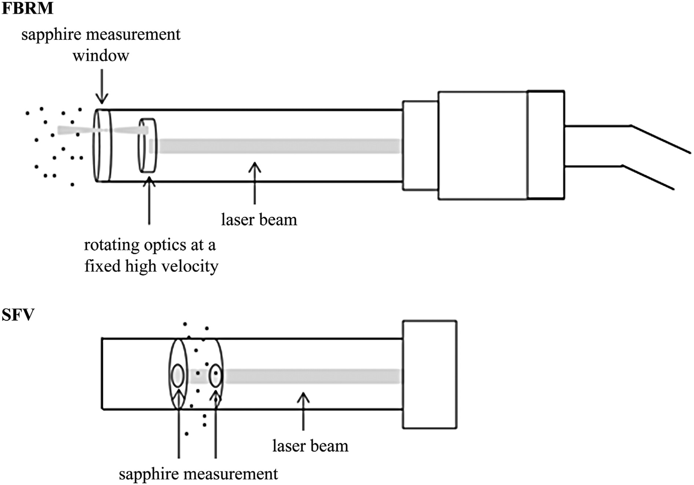
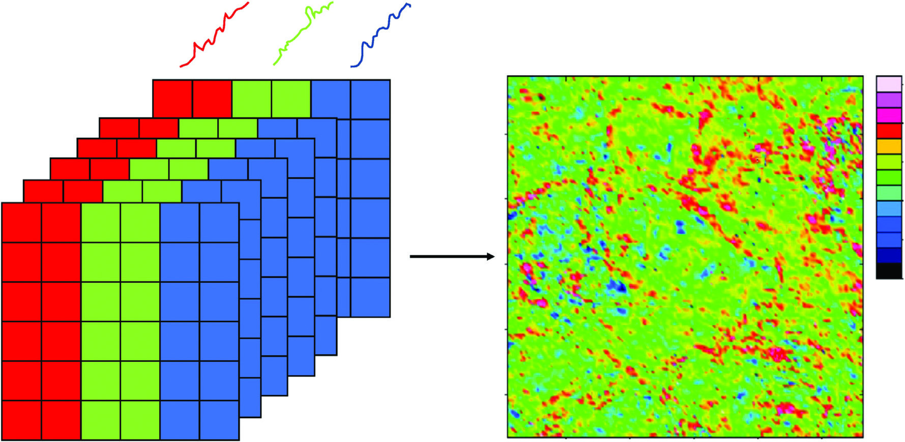
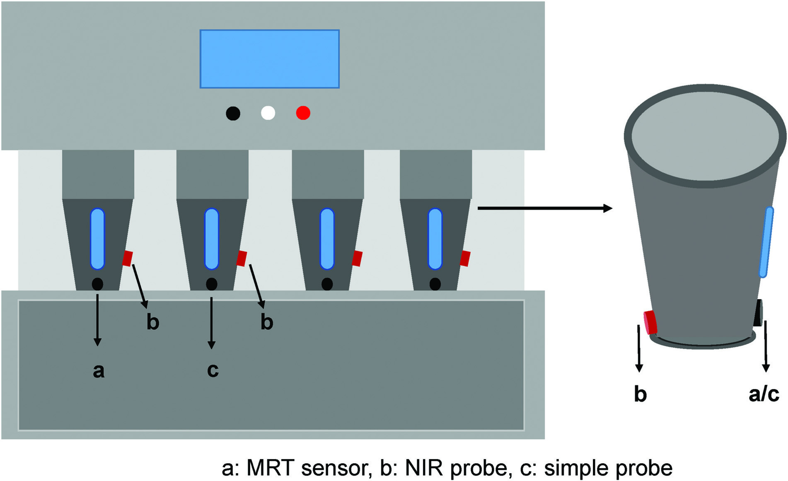

<!-- 方針: 総説の忠実訳。原文構成に沿う。「> 補足:」は訳者注。 -->

## 書誌情報

- 原題: Granulation process analysis technologies and potential applications in traditional Chinese medicine
- 著者: Tongcan Cui, Yizhe Hou, Huimin Feng, Sijun Wu, Wenlong Li（責任著者）, Zheng Li（責任著者）（天津大学ほか, 中国）
- 掲載: *Acupuncture and Herbal Medicine* 2023. https://doi.org/10.1097/HM9.0000000000000015
- インパクトファクター: 新しい学術誌のため未収載（近年創刊）

> 補足: 本稿は分析データでなく、**TCMの製造(造粒)工程をPAT(プロセス解析技術)でリアルタイム監視する**方法論の総説。当サイトの「製造法」タグ(FCG造粒最適化・標準湯液)と同系統で、連続生産・工程管理の視点を補う。

## 抄録
医薬品製造はバッチ生産から連続生産へと移行しつつあり、その中で造粒は最も重要な単位操作の一つである。大量生産される製品の品質は、従来はオフライン試験を実施することによって保証されていたが、これでは医薬品造粒技術の重要工程パラメータ（CPP）および重要品質特性（CQAs）をリアルタイムで監視するという連続生産の要求を満たすことができない。2004年に米国食品医薬品局（FDA）がプロセス解析技術（PAT）を提案して以来、造粒プロセスを監視し、造粒の操作条件や終点決定に関する情報を提供するために、多くのPATツールが開発されてきた。本論文では、医薬品造粒プロセスの技術水準を総合的に向上させるための参考資料を提供することを目的として、造粒プロセスにおける2つのPATモード、すなわち単一CQA監視PATと複数CQA監視PATの最近の研究と応用についてレビューする。さらに、伝統中薬（TCM）における潜在的な応用についても議論する。

キーワード：Critical process parameters, Critical quality attributes, Pharmaceutical granulation technology, Process analytical technology

## イントロダクション
造粒は、医薬品製剤の製造において最も重要な単位操作の一つである。医薬品プロセスにおける理想的な粒子特性には、良好な流動性、形状、空隙率、密度、含量均一性、狭い粒度分布（PSD）、圧縮性、および適切な水分含量と硬度が含まれる。造粒プロセスの重要品質特性（CQAs）には、主に粒子の水分含量、粒子径、および密度が含まれ、これらは粒子の流動性、圧縮性、および安定性に影響を与える[1–2]。

いかなる造粒技術の主な目的も、必要な粒子径、形状、および水分含量を持つ粒子を製造することである。しかし、粒子の理想的な特性や薬物の物理的・化学的安定性に関する高い品質要求は、造粒技術に多くの課題をもたらしている。特に、伝統中薬（TCM）の造粒において、原料の大部分は複雑な組成、容易な吸湿性、大きな粘着性、および多様な物理化学的特性を持つTCM抽出エキス（浸出液）である。一部の薬剤には、粒子径や密度が不均一で、流動性が悪く、層分離しやすい生薬末（原薬粉末）も含まれている。従来の造粒プロセスをTCMの造粒に直接適用することは困難であり、TCMの粒剤調製においては、適切な造粒プロセスや設備を選択する際に、独自の物理化学的特性に基づかなければならない。従来の造粒品質の監視および終点検出は間接的かつオフラインであったが、造粒プロセスにおけるCQAsは、プロセス解析技術（PAT）ツールを用いてリアルタイムで直接監視することができる。

医薬品製造プロセスの品質管理で一般的に使用されているオフライン試験は事後分析に適用されるものであり、製造プロセスをタイムリーに調整することができず、連続プロセスの品質管理には適していない。2004年、米国食品医薬品局（FDA）はPATに関する業界ガイダンス[3]を発行し、その中でPATは、原材料、中間体、およびプロセスのCQAsのリアルタイム分析によって医薬品製造を設計、分析、および制御するためのシステムと定義された。場合によっては、PATを使用してプロセス制御を強化し、CQAsが適切な範囲内にあることを確認して品質を保証することができる。PATの枠組みにおいて、これらのツールは5つのカテゴリー（多変量設計ツール、データ収集および分析、プロセス分析計、プロセス制御ツール、ならびに継続的改善および知識管理ツール）に分類できる[4]。PATは、重要な品質および性能特性を検出し、生産を設計、分析、および制御するために使用できるため、生産サイクルを短縮し、最終製品の品質を保証することができる。

造粒プロセスにおける分析技術の研究進捗に関する、公表されたすべてのシステムレビューを見つけるために文献レビューが実施された。PCに関する評価ツールの包括的な体系的文献検索が、IEEE、PubMed、Wiley Inter-Science、SCImago、Elsevier、Springer、Web of Science、CNKI、およびEMBASEの電子データベースにおいて実施される。文献検索（体系的検索およびハンドサーチ）は、2004年9月から2020年12月までの期間を対象としている。

## 造粒法
造粒法は主に乾式と湿式の2つのタイプに分類される。凝集粒子を形成するための主な方法には、架橋、焼結、化学反応、結晶化、およびコロイド粒子の沈着が含まれる。さらに、高粘度結合剤の付着力および凝集力によっても凝集粒子を得ることができる。方法の選択には、薬物、添加剤の性質、要求される流動性、および放出特性を十分に理解する必要がある。乾式造粒は機械的な圧力によって乾燥粉末粒子の凝集を促進し、湿式造粒は原材料粉末と造粒液を混合して湿潤物を形成し凝集を促進する。これら2つの造粒技術のうち、湿式造粒が最も広く使用されている。乾式造粒は主にローラーコンパクト（乾式圧縮）造粒（roller compaction granulation）[5–6]であり、湿式造粒には流動層造粒（FBG）[7–9]、高剪断湿式造粒（HSWG）[10–11]、および二軸ねじ造粒（TSG）[12–13]が含まれる。Shanmugam[14]は造粒技術の最近の進歩をまとめ、各造粒技術の概略図を提供した。頻繁に使用される造粒技術とそのメカニズムの簡潔な説明を表1に示す。

表1 頻繁に使用される造粒技術とそのメカニズムの簡潔な説明
| 造粒法 (Granulation methods) | 造粒メカニズム (Granulation mechanisms) |
| :--- | :--- |
| Roller compaction granulation | 原材料粉末は、2つの対向回転するローラーによって連続的にリボン状のブロックに圧縮され、その後、粉砕ユニットによって粒子に粉砕される。 |
| Fluidized bed granulation | 医薬品粉末はガス流の下で懸濁状態に維持され、流動室に液体が注入されて粉末がコア（核）へと調和し、徐々に粒子が形成される。 |
| High shear wet granulation | 剪断力により粉末と造粒液の間に液体架橋が形成され、液体が運動している粉末混合物中に分散すると、粒子が成長し形成され始める。 |
| Twin-screw granulation | Twin-screw granulationは材料を混合ゾーンに搬送し、処方中の特定の結合剤の助けを借りて、あるいは借りずに原材料を塊状に混練し、排出点で粒子として回収する。 |
| Pneumatic dry granulation | ローラープレスと空気力による分級方法を組み合わせて粒子を得る。 |
| Reverse wet granulation | 結合剤溶液を調製し、乾燥粉末添加剤を造粒機内で混合して結合剤溶液に添加するか、あるいは薬物を結合剤と混合して薬物-ポリマー/結合剤スラリーを造粒液として形成し、その後、他の乾燥添加剤と混合して粒子を形成する。 |
| Steam granulation | 従来の液体の水の代わりに、水蒸気を結合剤（造粒液）として使用する。 |
| Moisture-activated dry granulation | ごく少量の水を使用して結合剤を活性化し、凝集をトリガーする。2つのステップに分かれる：1）粉末粒子の湿潤凝集、および2）水分の分配。 |
| Thermal adhesion granulation | 少量の水を溶媒と混合してペレット化液体とし、加熱して粒子形成を促進する。乾燥工程は排除される。 |
| Melt granulation | 溶融性結合剤を用いて粉末粒子の凝集を促進する。 |
| Freeze granulation | 液状の泥（スラリー）または懸濁液の液滴を液体窒素中に噴霧し、その後、凍結乾燥および泡乾燥を行って粒子を形成する。 |
| Foam granulation | 液体/水ベースの結合剤を泡状でAPI粉末と混合して造粒する。 |
| API: Active pharmaceutical ingredient. | |

### 乾式造粒
乾式造粒は、単位操作が少なく、時間消費が短く、溶媒蒸発を伴う乾燥工程がないため、水分や熱に敏感な活性医薬品成分（APIs）に適している[15]。

Roller compaction granulationは、粉末混合物を2つの対向回転するローラー間で圧縮して緻密なベルト状のプレスクロック（リボン）とし、その後、スクリーンを通してリボンを粉砕して粒子にし、さらにその粒子を添加剤と混合して圧縮またはカプセル充填用の混合物を形成する。ロール圧縮プロセスに影響を与える要因には、粒子径や形態などの原材料の物理的および機械的特性のほか、供給スクリュー速度、ロール速度、ロール力、ロールギャップ、ロール表面などの工程変数、および環境水分含有量の変化が含まれる[16]。これらのパラメータは、ドラッグストリップ（リボン）のCQAs（密度、空隙率、強度、薬物含量など）に影響を与え、その結果、粒子のCQAs（PSD、流動性、含量均一性、および圧縮性）に影響を与える。PATがなければ、これらのパラメータをリアルタイムで決定することはできない。近赤外分光法（NIRS）、近赤外化学イメージング（NIR-CI）、マイクロ波共鳴技術（MRT）、熱浸透率（thermal effusivity）、およびさまざまな画像化技術が、オフライン、アットライン、オンライン、およびインラインのモードで使用され、ロール圧縮リボンおよびその後に製造される粒子や錠剤のCQAsを予測してきた。これらすべての技術の共通の目標は、造粒プロセスの理解と制御を向上させ、高品質な製品の出力を増加させることである[17]。

### 湿式造粒
#### 流動層造粒
押出造粒、高/低剪断造粒、転動造粒などの他の多段階の湿式造粒法と比較して、混合、造粒、および乾燥プロセスを粉塵のない単一のプロセスに統合できるFBGは、多くの技術的利点を持っている。FBGプロセスは熱および物質移動効率が高く、流動化された粉末粒子に結合剤溶液を噴霧することにより、流動性、かさ密度、均一性、圧縮性、および溶解性などの粒子CQAsを向上させることができる。したがって、一定の品質の製品を確実に輸送するためには、FBGプロセスにおけるいくつかのCQAsを監視する必要がある[18]。Da Silvaら[19]、Changら[20]、およびその他の研究者は、FBGプロセスの流動化状態、粒子径、および水分を監視および制御するための主要な技術をレビューし、最近報告されたFBGの方法と成果、コーティングプロセスの監視および制御に焦点を当てた。これらの前述のレビューでは、FBGプロセス監視におけるNIRS、focused beam reflectance measurement（FBRM）、spatial filter velocity measurement（SFV）、音響エミッション（AE）法、静電容量測定、マイクロ波共鳴法、および分光法の応用について詳細に議論されている。

#### 高剪断湿式造粒
HSWGは剪断力を利用し、造粒液（純水、デンプンのり、またはポリマー結合剤溶液）中の静電気力または水素結合を介して、粉末材料と造粒液の間に液体架橋を形成させる。液体が運動している粉末混合物中に分散すると、粒子が成長し始め、その結果、凝集塊が形成される。粒子の成長プロセスは最終的に動的平衡状態に近づき、その状態では造粒液が製品ブロック全体に均一に分布するようになる。材料の性質や主要な工程条件にもよるが、湿潤凝集の「平衡」段階には約5分で到達する。この終点を超えて液体を添加し続けたり、あるいは混合を続けたりすると、液体架橋の崩壊、湿潤材料の崩壊が起こり、最終的には過造粒（過剰造粒）につながる。

HansuldおよびBriens[21]は、打錠やコーティングなどの下流プロセスのために粉末の特性を改善するために常に使用される、医薬品業界におけるHSWGの応用をレビューした。しかし、プロセスが原材料の特性や操作条件に敏感であるため、粒子の成長を予測することは困難である。規制当局は、プロセスの理解と品質監視をオンラインで改善するために、PATツールの使用を推奨している。HSWGの監視に使用される主要な技術には、NIRS、Raman spectroscopy（RS）、静電容量測定、マイクロ波測定、画像化、FBRM、SFV、応力および振動測定、ならびにAEが含まれる。

#### 二軸スクリュー造粒
TSGは、乾式、湿式、および溶融造粒に分類できる[22]。TSG[23]は材料を混合ゾーンに搬送し、処方中の特定の結合剤の助けを借りて、あるいは借りずに原材料を塊状に混練し、その後、排出点において粒子として回収する。バレル内の混練ゾーンは、後段の造粒に適した粒子を得るために必要に応じて任意の位置に調整できる。TSGを使用して得られた粒子は、さらなる処理に直接使用するか、または所望の粒子径を得るためにサイズを小さくすることができる。TSGはバッチロスと生産時間を削減し、薬物の安全性、生産出力、品質を向上させることができ、特に熱に不安定な薬物に適している。しかし、堅牢で再現性のある連続造粒プロセスを開発するためには、PATツールを用いた広範な研究を実施しなければならない。

TSGの工程パラメータには、スクリュー速度および供給速度、L/S比（湿式造粒の場合）、スクリュー構成、バレル温度、滞留時間、トルク、およびバレル充填率が含まれる。TSGに関する多くの研究が、必要な粒子を得る上での工程変数および処方変数の重要性を示している[24–27]。Seemら[28]によってリストされた、TSGの造粒メカニズムの監視に使用されるPATには、NIRS、RS、NIR化学イメージング、陽電子放出粒子追跡（positive emission particle tracking）、3D形状キャラクタリゼーション、およびオンライン粒子径測定が含まれる。

#### その他の最近開発された造粒技術
近年、乾式造粒技術における研究の進展は限られている。Pneumatic dry granulation（空気式乾式造粒）は、ロール圧縮と空気分級を利用した新しい造粒法である。しかし、湿式造粒は幅広い応用範囲を持っている。近年、高剪断ミキサーおよびスプレーと組み合わせることができる逆湿式造粒（reverse wet granulation）、蒸気造粒（steam granulation）、および水分活性化乾式造粒（moisture-activated dry granulation）や、高剪断ミキサーおよび流動層造粒機で使用できる熱付着造粒（thermal adhesion granulation）および溶融造粒（melt granulation）、凍結造粒（freeze granulation）ならびに泡造粒（foam granulation）など、多くの新しい湿式造粒技術が開発されている[14]。これらの新しく開発された造粒技術は進歩しており、既存の造粒技術の欠点やギャップを埋め、連続的な医薬品開発のための新たなサポートを提供している。

## 医薬品造粒技術におけるPATの導入
近年、製剤製品の品質監視および制御のためのさまざまなPATツールがレビューされている[29–30]。造粒プロセスにおいて、これらのPATツールは、その適用範囲に応じて単一CQA監視ツールと複数CQA監視ツールに分類できる。PATのオンライン監視は大量のデータを生成するため、造粒プロセスをよりよく理解し監視するためのモデルを構築するために、多変量データ処理技術と組み合わせる必要がある。Jangら[31]はPATに基づくモデリング手法を導入した。これは、造粒プロセスにおけるリアルタイムのCQA監視を使用して、設計された粒子を得るために工程パラメータを調整し、CQAsの測定に必要な時間を短縮することで、より効率的な造粒プロセスを達成できるようにするものである。

### 単一CQA監視のPAT
PSDは粒子の最も重要な特性の一つであり、造粒プロセスにおけるCQAであり、粒子の流動性と圧縮性に影響を与える。異なる粒子径は異なる粒子体積に対応し、最終製剤の品質および含量均一性に影響を与える[32]。したがって、造粒プロセスにおいてPSDを監視することは有意義である。レーザー回折[33]および動的画像解析（DIA）[34]は粒子のPSDを測定するための成熟した技術であり、新興技術にはFBRM[9,13,35–38]、SFV[39–45]、3Dカラー画像法[46]、測光ステレオ画像（photometric stereo imaging）[47]、およびAEが含まれる。Figure 1に示すように、FBRMは後方散乱光を使用してそれを寸法測定に変換し、一方、SFVは生じた影を使用する。PSDは、弦長分布（CLD）の原理に基づいてFBRMおよびSFVを用いて直接予測できる。FBRMおよびSFVは、主にリアルタイムで粒子径を測定し、粒子径に影響を与える要因や成長傾向を評価するために使用される。さらに、測定分析は迅速かつ正確である。画像技術は粒子に関する直感的な情報を提供することができ、操作が容易で、再現性があり、正確で、乾式および湿式造粒の両方に適している。最大粒子を測定したり、円形度やアスペクト比などの形態パラメータを分析したり、直感的でクリアな粒子画像を作成したりするために使用できる。しかし、これら2つのPATツールにとって、微細粒子の画像は必ずしも非常に鮮明であるとは限らず、時には深刻な誤差が生じることがある。

#### SFV測定
SFVは、レーザービームを通過して流れる材料の粒子径と速度を同時に測定することができ、それによって光ファイバーの線形アレイ上に影を生成する[43,48]。SFV測定は、50–6,000mmの粒子径測定のサイズ範囲、および0.01–50m/sの粒子速度範囲に適しており、データレートは毎秒最大20,000粒子に達する。測定結果は、篩分け分布（フラクション、パス）、体積分布、個数分布、および速度分布など、さまざまな方法で報告される。Huangら[36]は、商業規模のFBGで複数の造粒バッチを監視するためにSFV-Parsumプローブを使用した。バッチプロセスのパフォーマンスおよびバッチ間の違いを評価し、潜在的な制御戦略を開発するために、多変量/バッチ統計的プロセス管理手法が使用された。その結果、測定値はオフラインのMalvern Master Sizerの参照測定値とよく一致しており、Parsumアナライザーがオンライン粒子径キャラクタリゼーションのための有望なツールであることを示した。複数のツールと組み合わせることで、FBGプロセスの理解を向上させることができる。
> 補足: 原文中の「50–6,000mm」は、粒子径の単位としてマイクロメートル（µm）の誤植であると考えられます。

Reimersらは、インラインSFVによるリアルタイムの粒子径測定のために改良された時間ベースのバッファシステムを使用して、特定の量の結合剤溶液を噴霧した後の目標粒子径を定義する、FBGバッチプロセスPATのフィードバック制御システム[44–45]を研究した。適切な制御変数を決定した後、適切なフィードバック制御戦略が確立され、その後、統合システムの最良のパフォーマンスを得るために制御ループが調整された。最終的な目標粒子径を指定された範囲内に調整することにより、システムの機能を大幅に向上させることができる。さらに、実装されたシステムは、プロセスパラメータや処方パラメータを変更することによって、事前定義された目標粒子径を生成することができる。

Ismailら[49]は、同方向回転TSGにおけるPSDを予測するためのコンパートメント母集団バランスモデル（compartment population balance model）を開発した。このモデルは、TSGの主要なプロセスパラメータを表す液固比とスクリュー速度に基づいている。この数学的モデルは、不均一なスクリュー構造を持つTSGの5つのコンパートメントにおける粒子の凝集と破砕を考慮している。

#### Focused beam reflectance measurement (FBRM)
FBRMは、レーザービームを使用して移動する粒子を照射し、レーザーをプローブへと後方散乱させることで、粒子の弦長（chord length）の計算を可能にする。FBRMは、連続TSG[13]およびHSWG[36]におけるオンライン粒子径分析のためのPATツールとして使用されている。前者の主な目的は、CLDとPSDの相関関係に対する工程パラメータの影響を評価することである。スクリュー速度およびインペラ速度がある範囲内で変化したときに結果が得られ、CLDとPSDの間の有意な関係が観察された。後者の研究では、造粒プロセスにおける粒子の大きさおよび数に対する異なる量の水と湿潤凝集時間の影響を研究するためにFBRMが使用された。加水プロセスにおいて、粒子の湿潤/核生成に起因するノイズのため、PSDの測定は理想的ではなかった。スケーリング（付着物）を回避するために機械的スクレーパーを備えたFBRMプローブが、HSWGプロセスの監視に使用された[43]。Narang[50]は、高薬物負荷のbrivanib alaninate処方のHSWG期間中の粒子成長に対する処方パラメータおよび工程パラメータの影響を研究するために、オンラインのFBRM-C35プローブを使用した。このプローブは、造粒プロセスに伴う粒子の弦長分布の変化を監視することに成功し、造粒プロセスにおける水濃度の影響を説明した。

#### 画像解析
画像技術は、粒子径や形状の情報など、直感的な情報を提供することができる。Narvanenら[46]は、画像技術を用いた粒子径監視の実現可能性を研究した。粒子の表面は3つの異なる方向から照射され、赤、緑、青の3色画像を使用して物体の表面、すなわちFBGプロセスにおける粒子径の中央値トレンドが示された。したがって、デジタル画像によって試料表面の3次元地形画像が形成され得る。

DIAおよびフラッシュイメージング技術は、粒子径および形状情報を提供することができる。DIAは迅速かつ非侵襲的な方法であり、高速で移動する粒子の画像を提供でき、サイズや形状の違いに敏感である。近年、粒子径および形状を評価するために医薬品業界で頻繁に使用されている[51]。Huら[35]は、画像解析に基づいて、二軸スクリューを用いた湿式造粒のリアルタイムフィードバック制御を実現した。Silvaら[52]は、さまざまな発光ダイオード（LED）を用いて異なる角度から粒子を照射し、画像内の表面の色をキャプチャすることにより、強力な短光パルスで鮮明な粒子画像をキャプチャした。これらのデータに基づいて表面高さマッピングが行われ、画像の勾配が得られる。この勾配を用いて粒子のエッジに楕円をフィッティングし、楕円の最大および最小直径をさらに使用して平均アスペクト比が計算される。

Sandler[47]は、適切な粒子径および形状を決定するためのDIAの能力を評価した。彼らは、直径測定計を用いて球状および棒状のサンプルを評価し、それぞれレーザー回折および走査型電子顕微鏡による評価と比較した。直径測定計は、粉末粒子の粒子径および形状を決定して、その流動性を予測するために使用されてきた[51,53]。Madaraszら[54]は、乳糖とデンプンの混合物の造粒をモデル薬物として使用し、連続湿式造粒用のDIAベースの粒子径アナライザーを開発して粒子径をリアルタイムで監視および制御し、連続二軸湿式造粒プロセスの監視とフィードバック制御に成功した。Wilmsら[55]は、連続サンプリングとDIAを用いて連続オンラインPSDを測定し、検出限界やこれらの変化を即座に検出する能力を決定し、連続造粒プロセスにおけるPSDを制御するツールを開発するために、異なる粒子径がテストされた。

Eyeconはデジタルサイズ分布に基づくフラッシュイメージング技術であり、Camsizerはデジタルおよび体積ベースの動的イメージング技術を使用できる。Eyecon高速イメージングカメラまたはParsumプローブは粒子径および形状を監視することができ、一方、El Hagrasyは流動層コーティングおよび粉砕の際の粒子特性を監視するために使用できる。Mcauliffeら[56]は、従来の篩分け分析方法とCamsizerおよびEyecon 3D粒子特性評価装置を使用して、ロール圧縮プロセスに粒子径測定を適用した。3つの方法を使用して得られたPSDトレンド結果は非常に類似しており、これは従来のプロセス制御方法である篩分け分析と新しいPSD測定方法の間に良好な一致があることを示している。EyeconおよびCamsizerは、オンラインPATツールとして大きな見通しを示している。

Kumarら[57]は、連続TSGの後かつ乾燥システムの前において、オンライン粒子イメージング（Eyecon™）を実施する可能性を評価した。オフライン篩分け法を参照PSD分析法として使用し、TSGを出る粒子のPSDをEyecon™カメラでオンライン測定した。オフラインの測定結果は、乾燥機の運転前後で収集された粒子サンプルを篩分けすることによって得られたオフライン測定結果と比較された。Sayinらの研究[58]では、リアルタイム高速直接イメージングEyecon™システムを使用して、二軸ねじを用いて製造された粒子を分析し、正確なPSDと粒子カウントをキャプチャすることができた。その後、シューハート管理図（Shewhart control chart）を用いて、サイズパラメータおよび粒子カウントが適切な管理手段としての能力を有するかどうかを評価した。粒子流が密集しているにもかかわらず、Eyecon™は満足のいくオンライン画像を提供できる。しかし、これが標準的なオンライン粒子径監視ツールおよび制御目的として適用できるようになるには、これらの画像の解析が非常に重要である。

測光ステレオ画像技術（photometric stereoscopic imaging technique）は、2つの異なる角度の光源によって照射されたサンプル画像を組み合わせて、テストサンプルの3D表面画像を得る。表面画像は、PSDや形状の決定に使用されるだけでなく、表面粗さに関する情報も提供する。Sandler[47]は、自動画像処理アルゴリズムと組み合わせた造粒プロセスにおける粒子径および表面粗さのオンライン測定への測光ステレオ画像の適用を実証した。さらに、粒子径決定をSFVおよび従来の篩分け法と比較した。測光ステレオ画像（Flash-sizer 3D）は、Fonteyneらの研究[59]において、湿潤粒子のPSD、粗さ、および形状を評価するためにも使用されている。

Wilmsら[60]は、オンラインレーザー回折を使用して、滞留時間パラメータや添加剤処方を含む異なるプロセスパラメータの影響を研究および評価した。インラインおよびオンラインのレーザー回折データは、オフラインのレーザー回折およびDIAデータと比較された。結果は、システムがさまざまなプロセスおよび製造パラメータの下でPSDの監視に成功することを示している。このシステムは工程パラメータや材料混合物の変化に敏感であり、これらは最終医薬品の品質に対する潜在的な脅威となる可能性がある。圧縮ゾーンからレーザー回折システムへの平均伝播時間は17.7秒であり、システムの迅速な反射（応答）時間を示している。

Madaraszら[61]は、カメラ画像ベースの質量流量測定システムと粒子径アナライザーを粉末のマイクロ供給および測定に使用した。これは、リアルタイムの質量流量および粒子径の監視、ならびに質量流量の制御を実行するために使用できる。このビデオ測定システムは、分配された粉末の品質を十分な精度で予測する（100mgでの予測誤差は3.32%である）。開発された画像解析システムと天秤を用いて質量流量を同時に測定することにより、ビデオ測定システムが連続マイクロ供給（0.2–1 g/min）を監視する能力もテストされ、ビデオ質量流量測定に基づくAPIマイクロ供給のフィードバック制御が実現された。開発されたシステムの品質予測アルゴリズムはさらに改善される可能性があり、ビデオ測定方法は非常に低い質量流量範囲（30 g/h未満）において重量供給方法を変更または代替する可能性がある。このビデオ測定システムは、マイクロ供給の範囲におけるオンライン粒子径分析にも適用することに成功し、開発されたシステムを多機能なPATツールにしている。

### 複数CQA監視のPAT
NIRS、RS、およびMRTは、複数の造粒プロセスの特性を同時に監視することができる。レビュー[62]では、NIRSおよびRSの基本原理と、造粒プロセスの水分含有量、PSD、API固体状態、および終点のオンライン監視におけるそれらの応用について紹介されている。さらに、造粒プロセスの理解を深めるために、分光プロセスのフィンガープリント（spectral process fingerprints）が使用されている。分光イメージング技術、およびいくつかの新しく開発されたマイクロ波共鳴測定技術やAE技術も、造粒プロセスの複数CQA監視において重要な役割を果たしている。

#### 近赤外分光法
NIRSは、米国FDAのPAT業界ガイダンスの重要な部分となっている。水素結合（C–H、N–H、およびO–H）の分子振動の倍音および結合音に基づいて、NIRSはケモメトリックス（化学計量学）アルゴリズムと組み合わされ、その迅速性、非破壊性、および低コスト特性により、広く使用されるツールとなっている。また、NIRスペクトル情報の複雑さから、微分、Savitzky-Golay平滑化、標準正規変量（SNV）、乗法散乱補正（MSC）などのNIRスペクトル前処理が必要である。

FBGおよびコーティングプロセスにおけるCQAsでの水分含有量、PSD、および錠剤/粒子厚さの監視におけるNIRSの応用がLiu[63]によってレビューされた。Razucら[64]は、FBGにおける水分含有量、粒子径、かさ密度、およびコーティングの決定におけるNIRSの応用を要約した。このレビューでは、NIRSの基本原理を説明するために多くのスペクトルが提供され、混合、打錠、およびコーティングの監視におけるその応用が議論された。

Pauliら[65]は、連続的な造粒および乾燥中のPSDをリアルタイムで監視するためにNIRSを使用した。部分的最小二乗回帰（PLSR）に基づいて、連続二軸湿式造粒および流動層乾燥機（FBD）プロセスにおける乾燥粒子のPSDを予測するために、3つのオンラインNIRS法が開発された。3つの独立したオンラインデータセットを使用して、水分含有量および活性薬物成分に対するオンラインプロセスの適用可能性とロバスト性がリアルタイムでさらに検証され、予測値と参照値の間に良好な一致が示された。これらの方法が、連続的な造粒および乾燥のプロセスにおける乾燥粒子の傾向および突然の変化を監視できることが証明されている。NIRS法は高度に製品特異的（product-specific）であるため、処方や製品が変更された場合には、再バリデーション、調整、あるいは再キャリブレーションを行う必要がある。

ShibayamaおよびFunatsu[66]は、PATモデルの構築と管理においてどのような要因を考慮し解決すべきか、またどのように予測モデルを構築するかを調査するために、ビニルアミド（vinyl amide）造粒およびコーティング工程におけるNIRSの応用を研究した。研究者らは造粒工程用のモデルを構築し、外部データセットに従ってモデルの予測能力を検証した。外部検証によると、手動で波長を選択したPLSRモデルが、乾燥減量（drying loss）に対して最良の予測精度を示した。乾燥減量の予測は正確であったが、粒子径の予測は十分正確ではないことが判明した。

Crowleyら[67]は、ロール圧密リボンの密度を監視するために、リボン品質のばらつきがNIRS検出結果にどのように影響するかを研究し、外れ値スペクトルを排除する単純な方法を提案した。Guptaら[68]は、NIRSを使用して、異なるロール速度および供給速度で調製されたサンプルの圧密強度およびPSDを、最良適合曲線の傾きと相関させた。上記の相関関係は、微結晶セルロース粉末、およびトマチンナトリウム二水和物（tomatine sodium dihydrate）、微結晶セルロース、リン酸水素カルシウム二水和物を含む典型的な直接打錠用薬物粉末混合物から調製されたコンパクト（圧密体）に適していることが判明した。トマチン粉末の混合物から調製されたコンパクトのNIRスペクトルもリアルタイムで収集された。スペクトルのリアルタイムの傾きは、オフラインデータとよく一致していた。コンパクトの強度は3点曲げ試験法を用いて測定され、PSDは篩分け分析を用いて決定された。その結果、最良適合線の傾きのリアルタイム値は信頼性が高く、提案されたNIRSベースの方法が単純かつ迅速であり、ロール乾燥造粒の生産およびスケールアッププロセスの監視および制御に使用できることを示した。

Martinetzら[69]は、NIRSに基づいて、連続乾燥造粒および打錠ラインの単一単位操作（ミキサー、ローラープレス、および打錠機）の滞留時間分布（RTD）モデルを確立した。半連続バケットコンベアおよび空気輸送については、動作周波数に基づく仮定が使用された。パラメータ化されたプロセスモデルを検証するために、予測されたAPIの変動とその生産ライン上での伝播が計算され、完全に組み立てられた連続運転での生産ラインのマルチスケール実験運転と比較された。完全な連続乾式造粒生産ラインにおいて、この新しい方法は、選択された質量流量下で満足のいく予測能力を示した。さらに、医薬品製造の開発と制御をサポートするツールとしてのプロセスシミュレーションの機能を示した。

Gavanら[70]は、造粒プロセスにおけるリアルタイムの水分レベルを監視するためのオンラインNIRS法を研究した。Quality by Design（QbD）戦略を用いた2つの活性薬物成分のFBGプロセスにおいて、重要な造粒パラメータの精密な制御が投入原料のばらつきを低減できることが実証された。そのスペクトル範囲は狭いものの、microNIR分光計は強力なPATツールとして機能することに成功した。実験計画法（DoE）の結果は、薬局方に従った明らかに互換性のあるAPIsおよび賦形剤の使用が、最終製品の異なる重要な特性につながることを示した。原料の特性に応じてCPPs（すなわち、結合剤注入速度および噴霧圧力）を調整することにより、平均粒子径は280–320マイクロメートルの狭い範囲内に収まり、低規格部分は5%未満となった。したがって、処方の特殊性に応じた工程パラメータの精密な制御により、設計スペース内での製品の維持が実現され、原材料に起因するばらつきが排除された。

Chablaniら[71]は、連続二軸造粒機-流動層乾燥機の粉末製造プロセスにおける粒子の水分含有量を決定するために、リアルタイムNIRSを使用した。カールフィッシャー（KF）法および乾燥減量（LOD）法で決定された水分含有量を参照値として、水分含有量のPLSRモデルを構築した。その結果、水分測定にはLODよりもKFの方が適した参照方法であることが示された。中心複合応答曲面設計（central composite response surface design）の実験計画法を用いて、吸気温度および露点が粒子の水分含有量に及ぼす影響を研究した。吸気温度はNIRS、KF、およびLODで測定された粒子の水分含有量に有意な影響を及ぼしたが、研究された吸入空気露点の範囲内ではその影響は無視できることが判明した。

Tianら[72]は、粒子のCQAsであるオンライン定量分析のために、パルススプレーと水分含有量フィードバック制御法およびNIRSを導入することにより、FBGの品質一貫性制御を研究した。自己調整ファジィPIDコントローラーが開発され、FBGプロセスに適用された。これらの戦略の品質一貫性制御における性能が検証され、これらの方法を使用して製造された粒子の品質一貫性を評価するために、類似度および主成分分析（PCA）が使用された。パルススプレーおよび水分含有量制御戦略を使用して製造された粒子のCQAの相対標準偏差は5%未満であったが、従来の方法では5%を超えていた。その結果、水分含有量フィードバック制御戦略は、最終的な粒子の品質を向上させる効果的な方法を提供し、重要な品質特性を安定させることによって品質一貫性制御を簡素化することを示した。いくつかの故障モードに対する目標製品品質プロファイル（target product quality profile）の境界は、造粒プロセスの操作スペースを構築するために使用できる。Tianらによる別の研究[73]では、ラボスケールの造粒機を使用してパルススプレーFBGのプロセス設計および開発が実施された。

Zhaoら[74]は、パルススプレーFBGのリアルタイム監視および異常検出のために、NIRSおよび多変量プロセス軌跡を使用した。造粒プロセス全体のバッチ変化を監視するために、さまざまなタイプの多変量統計的プロセス管理（MSPC）モデル（PCA、Hotelling-T2、およびDModX管理図）が開発された。結果は、NIRSに基づくMSPCモデルがモデルを構成するサンプルセットのばらつきを含んでおり、外部のばらつきに耐えられることを示した。この研究は、同期NIRSと多変量バッチモデリングの併用が、パルススプレーFBGプロセスを効果的に制御できる魅力的なプロセス監視ツールおよび故障診断方法であることを証明した。

プロセス監視に適用されるPATは、一般に、異なるセンサーから、あるいは単一の多変量センサーから生成された異なるモデル出力から、複数の出力を提供することができる。De Oliveiraら[75]は、MSPCモデルの開発における現在のデータフュージョン（融合）戦略へのセンサーおよび/またはモデル出力の組み合わせに寄与した。データフュージョンは、同じセンサーからの多変量モデル出力、またはこれらの出力と他のプロセス変数センサーとの組み合わせをユニークに組み合わせた3つの実際のプロセス例を使用して探索された。研究された3つの例は、モデル出力を選択する柔軟性の利点を示した。例えば、多変量キャリブレーションを用いた主要特性の予測、多解像度法から公開されたプロセスプロファイル、およびモデル出力とモデル出力に基づくモデルを含む融合情報に基づくMSPCモデルの使用である。単一センサーの元の出力は、プロセス制御および異常なプロセス状態の診断と解釈に使用された。提案されたデータフュージョン戦略は、一般に、複数のセンサーおよび/またはモデル出力を生成するあらゆる分析または生体分析プロセスに適している。

Roman-Ospinoら[76]は、多変量解析の予測性能に基づいて、TSG用の3つのNIRプローブインターフェースを評価した。API濃度の変化と一致するキャリブレーションモデルが、2番目のインターフェースを通じて得られたデータから得られた。スクリューとシリンダーのインターフェース間の粉末の薄い層のNIRセンサーは、粉末の密度情報をキャプチャできるサンプル提示モデルを作成し、その結果、より高い説明分散とより低い予測誤差を持つキャリブレーションモデルが得られた。密度の影響は予測性能に及ぶものの、結果は、インターフェースの性能を利用するために、この重要な材料特性をキャリブレーションセットに含めるべきであることを示した。排出インターフェースは、バレルインターフェースの動特性と回転プロペラインターフェースの大容量を兼ね備えている。振動面上に一定の粒子流が生成され、湿潤粒子中の低API濃度を予測する上で優れた性能を持つキャリブレーションモデルの構築が促進される。

Avilaら[77]は、水分監視、終点検出、および物質移動監視プロセスの解析を含む、FBG中のファブリ・ペロー干渉計（Fabry-Perot interferometer）に基づく低コストのNIRセンサーの性能をテストした。流動層乾燥粒子の14バッチのスペクトルデータおよびオフライン水分含有量が記録された。終点測定および物質移動性能評価のための高解像度水分信号を生成するために、PLSRに基づく水分モデルが構築された。その結果、センサーは振動や環境温度の変化に対して堅牢であり、水分含有量予測の精度（±13%）は高コストのNIRセンサーと同様であることが示された。マイクロNIRセンサーのスペクトル品質と耐久性は、部分的最小二乗（PLS）およびMSPCモデルの構築に十分であった。

Roggoら[78]は、固体製剤の連続生産ラインにおけるFBDの後の粒子、および打錠機の供給ラックで篩い分けされた粒子を監視するために、2つの異なる機器から3つのNIRプローブをオンライン設置し、NIRプローブが安定した含量均一性の結果を提供できることを示した。すべての工程内管理（IPC）結果が規格範囲内であることを確認した後、PATプローブは安定した結果を提供し、工程パラメータに重要な変化は検出されなかった。Roggoらによる別の研究[79]では、商業用製剤の処方が選択され、品質特性を予測するためにNIRSと深層学習（deep learning）を組み合わせた監視プロセスパラメータが使用された。深層学習の使用は、ノイズを低減しデータの解釈を簡素化して、プロセスをよりよく理解するのに役立つ。PATとプロセスデータ処理技術の間のシナジー（相乗効果）は、連続生産ラインのための優れた監視フレームワークを作成し、連続製造ラインの理解を深めた。

Mengら[80]は、粒子のCQAsのリアルタイム監視と予測を実現するために、連続TSGプロセスにおける3種類のPATツール、すなわちEyecon™ 3D画像システム、NIRS、およびRSを研究し比較した。モデル薬物の低用量処方として無水カフェインを含む粒子を製造するために、Thermo Scientific™ Pharma11 TSGが使用された。各分析ツールの性能を評価するために、3つのCPPs（液固比、バレル温度、および流量（flux））を含む30操作の全因子計画が実施された。Eyecon™は、異なる実験条件からの粒子径および形状の変化を捉えることに成功し、プロセスの乱れがある中で粒子径パラメータD10の変動に対して十分に敏感であることを証明した。PLSRモデルは、ほとんどの粒子の予測された物理的特性の相対標準誤差が比較的小さいこと（5%未満）を示した。それに対して、RSベースのPLSRモデルは、キャリブレーションモデルの開発中に原材料の不均一な予備混合が行われたため、粒子の薬物濃度の予測誤差が高くなった。Alcalàら[81]は、定性的および定量的なNIRSモデルを確立し、処方の関連品質パラメータ、水分含有量、PSD、および充填密度を監視した。

#### ラマン分光法
RSは、光の非弾性散乱の基本原理に基づく光学的振動技術である。NIRSと比較して、RSは水の影響を受けにくい。RSはサンプルの前処理を必要とせず、測定速度が速く感度が高いため操作が容易であるが、光学系のパラメータに影響を受けやすい。

Nagyら[82]は、造粒の単位操作におけるRSの応用を要約した。RSは湿式造粒プロセスにおいて水による変化を分析するために使用できるが、乾式造粒におけるRSの応用は少なかった。Mcauliffeら[56]は、ロール圧縮によって調製された錠剤の機械的強度を分析するために、錠剤の表面の滑らかさに関連するスペクトルの違いを検出した。NIRS分析では、造粒プロセスに大量の水が存在する場合、水の光吸収が強すぎる。したがって、このような状況ではRSの方が適している。

Fonteyneら[48,59]は、オンラインのNIRSおよびRSと同時に、リアルタイムの粒子径アナライザーを使用して粒子のCQAsを評価した。NIRSは水分含有量を監視するのに最も適した方法であり、粒子径分析は流動性を予測するために使用できる。RSは、テオフィリン-乳糖モデルシステムにおける水和変態を監視するのに最も正確な方法である。

HartingおよびKleinebudde[83]は、オンラインのRamanプローブを使用して、二軸連続造粒におけるAPI含量の監視に関する最初の研究を実施した。RSはTSGプロセスの分析において大きな可能性を秘めている。Ramanプローブは、リセドロネート（risedronate）の水和などの相転移を分析するために流動層に挿入することができる[84]。

Bhavanaら[85]は、ニクロサミド（niclosamide）の二成分および多成分混合物中のNHa（niclosamide anhydrate）の結晶形を同定および定量するために、PLSアルゴリズムと組み合わせたRS、MIR（中赤外）、およびNIRSを使用した。MIRと比較して、NIRSおよびRSは二成分および多成分混合物中のNHaの同定および定量においてより正確であることが判明した。さらに、これらの技術により、ボールミル粉砕および粒子の乾燥中におけるNHaの同定および定量が可能になり、NIRSおよびRSの結果はMIRと同等であった。しかし、RSはNHaの存在下でNHaを検出することができ、より効果的である。
> 補足: 原文の「RS can detect NHa in the presence of NHa」（NHaの存在下でNHaを検出できる）は、異なる水和物や溶媒和物などの存在下で無水物（NHa）を検出できるという意味か、あるいは他の結晶形の誤記である可能性があります。

HartingおよびKleinebudde[86]は、室内光の下での測定を可能にし、予測性能をさらに向上させるために、Ramanプローブの測定設定を最適化した。2つの異なるキャリブレーションモデルが開発され、比較された。第1のキャリブレーションモデルでは、以前と同様に暗所においてスペクトルが収集され、第2のモデルでは室内光の下で収集された。暗所でのキャリブレーションモデルは、予測の平方平均二乗誤差（RMSEP）値0.31%でAPI含量を予測でき、一方、明所でのキャリブレーションモデルはRMSEP値0.29%を予測した。したがって、2つのPLSモデルは同程度の予測誤差を示す。このように、室内光の下で収集されたRamanスペクトルを評価することができる。さらに、以前の予測誤差0.60%を大幅に削減することができる。最適化されたRSは、シャントフィード（分流供給）プロセスにおけるTSGの混合効率を評価するのに適している。RSを用いて異なるバレル部品の後方で混合物の品質を監視し、開発されたキャリブレーションモデルを用いて対応するAPI濃度を予測する。

Reddyら[87]は、オンラインRSを使用して、HSWGおよび乾燥中における多溶媒誘起の薬物形態変化を監視し、水分、温度、湿潤重合（wet polymerization、あるいは湿式凝集）時間、および乾燥プロセスが薬物の変換に及ぼす影響を調査した。プロセス中の各薬物の濃度を予測するために、一連の校正標準を使用して定量的なPLSRモデルが確立された。

Otakiらの研究[88]では、インサイチュ（in situ）監視のために低周波数（LF）RS（10–200 cm–1）が使用され、LF RSは固体状態の分子間および/または格子振動に関する情報を取得することができた。フロセミド/ニコチンアミド共結晶から得られた監視結果は、LF RSが懸濁液およびFBGプロセスのインサイチュ監視のための効果的な技術であり、共結晶の転移リスクを検出するためのPATツールとして使用できることを示した。さらに、LF RSは、APIsおよび製品の反応、結晶化、および製造プロセスを監視するために使用できる。

非接触型低周波数Ramanプローブ監視技術に基づいて、Nomuraら[89]は、HSWGのプロセスにおける結晶化状態を検証するために、さまざまな結晶面と添加剤を使用した。LF Ramanプローブは、湿潤塊中の2つのモデル薬物（アセトアミノフェンおよびインドメタシン）の5%–20%の監視において比較的高い感度を示した。結果は、プローブ型の低周波数RSが、HSWGプロセスにおいてリアルタイムでAPIの結晶化状態および潜在的な結晶転移リスクを区別および監視するためにうまく使用できることを示した。

HisazumiおよびKleinebudde[90]は、RSを使用して多層フィルムのコーティングプロセスをオンラインで監視した。PLSおよびMCR分析を用いて、RSによるフィルム厚さを予測するためのキャリブレーションモデルが確立され、異なるバッチのコーティング厚さを正確に予測することができた。MCR分析は混合物のスペクトルを純成分のスペクトルに分離できるため、粒子多層フィルムコーティングプロセス用のロバストな定量キャリブレーションモデルの開発に適しており、MCR分析の予測結果はPLS分析よりも優れていることが判明した。よりロバストで信頼性の高い予測モデルを開発するために、Ramanスペクトルに影響を与えるさまざまなパラメータを持つ追加のキャリブレーションバッチデータがキャリブレーションに追加されることは明らかである。

#### スペクトルイメージング技術
NIR-CIは、従来のNIRSとデジタル画像の組み合わせであり、収集されたNIRスペクトル情報と空間情報を画像にコンパイルすることができる（Figure 2）。NIR-CIは、ドラッグストリップ（リボン）の化学的および物理的特性（バンド密度、空間的空隙率分布、引張強度、圧力空間分布の視覚化、API濃度と分布など）、およびその後の粒子や錠剤のCQAsに関する定性的および定量的な情報を提供する。したがって、ほとんどの研究は簡略化された処方で実施されているため、実際の処方の適用可能性を確認するには、より多くの実験的インプットが必要である。プロセスとデータの複雑さから、パイロット規模および工業規模の両方でリアルタイムの分析とプロセス監視を迅速かつ正確に行えるようにプロセス分析計を改良するための統計的手法も研究されるべきである[91–92]。

赤外線サーモグラフィ（赤外線熱画像技術）は非破壊的かつ非侵襲的な技術であり、製品の表面温度をリアルタイムで取得するために使用できる。赤外線放射の主な源は熱である。サーモグラフィは製品の熱特性をキャプチャし、さらなるデータ分析のために情報を変換することができる。ロール圧密リボンの相対密度は、空隙率とPSDを決定するローラーコンパクトプロセスにおけるCQAsの一つである。Yu et al.[93]は、粉末へのローラー圧力を間接的に監視するために、ローラーリボン内の粉末温度分布を監視および分析する赤外線熱画像技術を使用した。サーモグラフィはオンラインで粉末温度曲線を記述することができ、ローラー力の増加は粉末温度曲線の傾きの増加につながる。さらに、供給から圧密までのローラーリボン粉末の密度分布を検証するために、オフラインのX線CT測定が使用された。粉末温度分布と密度分布の結果が分析され、非ローラーの圧力ゾーンを識別するために使用された。WiedeyおよびKleinebuddeは、X線マイクロコンピュータトモグラフィー（X線マイクロCT）を用いてリボンの均一性を分析した。WiedeyおよびKleinebuddeによる他の研究[94–95]では、ロールリボンの相対密度をオンラインで測定するために赤外線熱画像技術が使用された。測定されたリボン温度とリボン密度の間に相関が観察され、圧密後の冷却速度を使用してリボン密度を決定することができた。興味深いことに、熱画像はガラス状リボン内の温度分布も明らかにし、これはX線マイクロCTスキャンを用いて測定および分析されたリボン密度分布の均一性と一致させることができる[96]。この技術はプロセスの変化に対して短い反応時間を示し、長期的な実験において時間経過に伴う温度ドリフトは検出されなかった。この研究は、相対的なリボン密度を決定するためのPATツールとしての熱画像カメラの適用可能性を証明している。

テラヘルツパルスイメージング（TPI）は、遠赤外線とマイクロ波領域（300 GHz–10 THz）の間の1から0.1 mmの波長範囲の電磁波であるテラヘルツ放射に基づいている。テラヘルツ放射はほとんどの医薬品添加剤を透過する能力があり、屈折率は密度と化学組成の変化を反映する。テラヘルツ放射はフォトンイオン化エネルギーが低いため、顆粒材料の化学的および物理的特性の安全なキャラクタリゼーションにおけるその潜在的な応用がますます関心を集めている[97]。Zhang et al.[98]は、TPI技術を使用してロールリボンの体積密度分布を監視し、TPIで測定された屈折率を体積密度に変換できるキャリブレーション方法を開発した。TPIおよびスライシング法を用いて決定された密度分布が比較され、TPIを用いて決定された密度分布は断面積法を用いて測定されたものとよく一致していることが判明した。これは、キャリブレーションモデルを用いることで、TPIが密度分布を正確に決定するために使用できることを示した。さらに、TPI測定は薬物の化学組成に非常に敏感であることが判明した。

Wesholowski et al.[99]は、ホットメルト押出造粒プロセスにおける滞留時間分布（RTD）のオンライン決定のためのColVisTecのUV/Vis分光光度計の適用可能性を研究しテストした。二軸同方向回転押出機における2つの異なる測定位置が、参照方法としてのオフラインの高速液体クロマトグラフィー-紫外線（HPLC-UV）と比較され、結果は一致した。これは、オンラインのUV–Vis分光光度計が二軸押出造粒におけるRTDの決定に適していることを示している。測定位置が再現性に及ぼす影響が判明したため、PATを導入する際にはこれを考慮しなければならない。

連続生産の場合、製造された医薬品の品質はリアルタイムで評価されるべきである。Sayin et al.[58]は、連続的に製造された粒子の品質特性を予測するために、相補的なPATツールを使用した。彼らの研究では、粉末から錠剤への生産ライン（Consigma-25）において連続湿式TSGによって製造された粒子のリアルタイムオンライン分析のための3つのPATツールが評価された。固体状態の情報と粒子径データを得るために、RSとNIRSが測光画像技術と共に使用された。これらの多変量データは、粒子の水分含有量、かさ密度、および流動性を予測するために使用された。Sayinらの研究で評価された3つのPATツールは、連続製造された粒子の品質特性を予測するための補足情報を提供する。残留水分含有量は主にスペクトルデータに関連しており、画像データは粒子の流動性を予測する能力が最も高かった。

#### 音響エミッション
音は、振動波の形でのエネルギーの生成、伝達、および受信と定義され、オンラインの監視および制御システムの開発の基礎として使用できる。医薬品業界では、パッシブAE（passive AE）がHSWGやFBGのプロセス、および流動層乾燥の監視に使用されてきた。Tsujimoto et al.[100]は、流動層からのパッシブAEの生成が、粒子または粒子と装置との衝突、これらの衝突の摩擦、および流動化空気によって生成される空気の乱流に起因することを説明した。AE監視の主な利点は、プロセス情報の非侵襲的かつリアルタイムの収集である。これは、オリフィスやインターフェースを一切必要としない、完全に非破壊的な間接的技術である。

Poutiainen et al.[101]は、流動層噴霧造粒プロセスにおけるPSDをオフラインで予測するためにAE法を使用した。流動層噴霧造粒プロセスの24バッチの音響スペクトルが記録され、噴霧段階における音響データが異なるシステムに分割された。各システムは、プロセスの異なる段階における異なる物理的および化学的条件に対してPLSRを用いて音響スペクトルを分析し、PSDの予測モデルが確立された。その結果、モデルは良好なPSD予測の正確さと精度を示した。さらに、プロセスの偏差を検出するための早期警戒システムとしてのAE技術の選択が評価された。3つの異なるモデリング手法によってPLSモデルの精度は大幅に向上するものの、AE技術は空気の乱流などの小さな外乱に非常に敏感であり、安定した造粒プロセスに適していた。

Hansuld et al.[102]は、可聴音響エミッション（audible acoustic emissions: AAEs）と粒子径および密度との関係を実証し、製品品質のオンライン監視の可能性について議論した。実験計画のためにAAEsを収集するために、コンデンサーマイクロホンがpma-10 HSWGの排気管内に配置された。粒子径および密度は、処方中のAvicelグレードを変更することによって変化させた。その結果、粒子径および密度の増加が、造粒の終了時および過湿潤（overwetting）プロセス中に観察されるAAEsの低下に影響を与えることが示された。さらに、粒子径および密度の変化は、10Hz周波数グループの異なる組み合わせによって表すことができ、多変量スコアの傾向はオンライン監視をサポートした。

SheahanおよびBriens[103]は、流動層における粒子コーティングへのパッシブAE監視の適用を研究した。マイクロホンは、局所的な流動化条件とノズルの性能情報を反映するために、噴霧流動層の上部に接続された。液体スプレーと流動化粒子層との間の界面からのAEは流動化条件の低下を決定し、これが層全体におけるスプレーの分布と核（コア）周囲のフィルムコーティングの乾燥に影響を与えた。塔頂排出口の排気から得られたAE情報は、ノズルの閉塞を検出するために使用できる。パッシブAE監視の開発に関する継続的な研究は、粒子の流動層コーティングに関する重要な情報を提供し、最適なコーティング終点を決定するためのプロセス制御を改善する可能性がある。

Watson et al.[104]は、造粒に対する工程変数の影響を研究するために、高速カメラとAEを組み合わせることにより、造粒プロセスの異なる段階を識別できる監視システムを開発した。この研究は、AE監視が湿式造粒プロセスの監視に有益であることを示した。粒子径と有害事象の間に明確な関連はなかったものの、AEは造粒プロセスの異なる段階を識別することができた。計算モデリングと高速写真の組み合わせにより、AE結果の理解が深まる。さらなる修正と適切な統計分析を通じて、この技術はより効果的な実際の粒子特性監視システムへとさらに発展させることができる。

#### マイクロ波共鳴技術
MRTは、水分子と電磁場の相互作用に基づいて材料の物理的特性を測定するために使用される新しい方法である。NIRS[105]と同様に、MRTは造粒プロセスにおける複数のCQAsを同時に監視することができる。Austin et al.[5]は、水の誘電特性がほとんどの固体材料の誘電特性と大きく異なるため、マイクロ波センサーが水に対して非常に敏感であることを見出した。したがって、マイクロ波センサーはppm範囲で水の濃度を検出できるのに対し、NIRS検出では、スペクトル中の物理的影響を排除し化学組成を正確に監視するために、複雑な化学計量学ソフトウェアおよびスペクトル前処理方法を使用しなければならない。MRTおよびNIRSのデータ分析において、水分含有量の予測ではANNモデルの方がPLSRモデルよりも優れている。

Peters et al.[106–110]は多共鳴マイクロ波センサーを開発し、特定の薬物（ドネペジル塩酸塩など）の製造に使用できる一連の実験室およびパイロット規模拡大の研究を実施した。満足のいく水分予測モデルを確立するために、異なる工程パラメータを持つサンプルが使用された。その結果、このセンサーがFBGプロセスにおける粒子の水分含有量を監視するツールとして使用できることが示された。Figure 3は、MRTおよびNIRSを用いた半連続流動層乾燥機のリアルタイムプロセス監視を示している。MRTセンサーの表面における水分子と電磁迷散電場（electromagnetic stray field）との相互作用により、MRTはNIRSよりも水に対して敏感であり[109]、これが、着色された粒子やかさ密度の大きな違いなど、湿式造粒プロセスの分析におけるNIRSの限られた適用可能性を補っている[106]。

ローラーコンパクトの事前処理において、粉末混合物が偏析し、その後の圧密操作において品質偏差を引き起こす可能性があるため、ロールリボン中のAPI濃度を知ることは非常に重要である。Gupta et al.[6]は、ロールリボン（テープ）中のAPI濃度をオンラインで測定するための新しいタイプのマイクロ波センサーを開発した。その結果、市販のNIRプローブと比較して、マイクロ波センサーはロールリボンの含量均一性および密度のオンライン監視において高い精度を示すことが示された。同様に、ロールリボンの密度および水分監視におけるNIRSとMRTの適用を比較したAustin Jらの研究[5]で実証されているように、マイクロ波共鳴はNIRSと比較して特性の測定において優れた精度、ロバスト性、および使いやすさを備えていた。

#### その他のPAT技術
電気容量トモグラフィー（Electrical capacitance tomography: ECT）は、物体の境界の静電容量測定と数学的アルゴリズムを使用して物体内部の誘電率分布を計算する電気的画像化方法の一種である。オンライン監視を実現できる非侵襲的技術である。この方法は、再構成された断面画像を介して対象からの局所的な点ごとの情報を提供し、断面画像全体によって計算された特徴量によって全体的な情報を提供することができる。これは、ECTが湿潤粒子の水分含有量および流体力学（ハイドロダイナミクス）を特徴づけられることを意味する。Rimpilainen et al.[111]は、実験的に決定された粒子の水分と相対誘電率との関係に基づいて、3次元の水分分布を計算した。湿潤粒子の流体力学的特性は、風速（空気速度）および粒子の水分に応じて特徴づけられた。Che et al.[112]は、流動層における造粒およびコーティングプロセスを監視するために静電容量トモグラフィーを使用した。

熱浸透率（Thermal effusivity）は非破壊的な測定技術であり、メソッド開発のために集中的なデータ前処理や化学計量学的なデータ分析を必要としない。熱浸透率は、材料の熱伝導率、密度、および熱容量を組み合わせたものであり、熱伝達特性に基づいて医薬品製剤中の固体、液体、および粉末成分を区別することができる。粉末の熱伝導率は、粒子内および粒子間で熱を伝達する能力に依存する。浸透率は、材料の粒子径、形状、密度、および水分含有量の関数でもある。センサーとリボンを接触させる必要があり、それらの間の空気が測定方法に影響を与えるため、長いロールリボンを監視することはできず、表面測定のみに限定されており、開発が必要である[113]。

流動抵抗力センサーであるドラッグフローフォース（drag flow force: DFF）は、直径約1mmの中空の円筒形のピンである。流れの中でのピンのたわみは、ピンの内面に取り付けられた2つの光学式歪みゲージによって測定される。このセンサーは、材料の密度や剪断粘度などの基本パラメータに関連する情報を測定できる。このセンサーはまた、毎秒最大500サンプルの測定速度でピンの温度を出力することができる。造粒機内のDFFセンサーの流動抵抗力の局所測定は、高いロバスト性、感度、および分解能を有している。しかし、粒子密度のリアルタイムオンライン評価は依然として困難である。Narangらの研究[114]では、流動抵抗DFFセンサーが粒子の湿潤質量濃度をリアルタイムで検出し、FBRMおよびDFFセンサーの造粒プロセス監視能力を比較して、2つのプローブからの造粒プロセス情報の相補性を評価した。同時に、粒子径の成長、緻密化、およびDFFセンサーの応答が測定された。さらに、造粒スケールアップにおけるDFFセンサーの応用も研究された。Narangら[115]は、湿式造粒中の異なる結合剤含有量を持つ3種類のプラセボ処方の流動抵抗を測定するためにDFFセンサーを使用し、その結果をオンラインFT4粉体レオメーターによって異なる処理時間で収集された粒子特性データと比較した。DFFセンサーを使用して測定された湿潤質量濃度と、FT4粉体レオメーターを使用して測定された粒子の流動抵抗および粒子間の相互作用との間に良好な関係が観察された。DFFセンサーを用いて測定された力パルス振幅は、造粒中の剪断粘度や粒子径/密度などの材料特性の変化を示すことができた。これらの研究は、DFFセンサーが湿式造粒の処方設計、プロセス開発、スケールアップ、ならびに生産プロセスにおける日常的な監視のための価値あるツールとして使用できることを示した。

## 伝統中薬（TCM）における潜在的応用
### 伝統中薬（TCM）の造粒技術
TCMの近代化という背景のもとで、TCMの剤形はもはや従来の煎剤、丸剤、散剤、膏剤、昇華製剤などに限定されない。従来の煎剤に基づいて開発された顆粒剤、錠剤、カプセル剤などの新しい固体剤形が現在の市場における主要な剤形となっており、これらの剤形の製造は造粒プロセスと不可分である。得られた顆粒は、最終製品として、または錠剤やカプセル剤などの他の剤形の中間体として製造され得る[116]。

現在、TCM業界における一般的な造粒方法は、乾式造粒、噴霧乾燥造粒、および押出造粒、FBG、HSWGなどの湿式造粒である。TCMの湿式造粒技術は徐々に成熟し、乾式造粒もTCMの造粒生産に徐々に適用されてきている。しかし、大部分の化学薬品と比較して、これらの造粒方法は、原材料の物理化学的特性、複雑な成分、およびTCMの生産に適用される場合にさまざまな難解な問題に直面している[117–118]。

### 伝統中薬（TCM）の造粒技術における課題
TCMの造粒に使用される原材料のほとんどは抽出エキスであり、これらは複雑な組成、容易な吸湿性、大きな粘着性、および多様な特性を持っており、一部の薬物はまた、異なる粒子径、不均一な密度、劣悪な流動性、および容易な層分離などのいくつかの問題を有する生薬末を含んでいる[119]。そのため、海外の多くの新しい造粒技術をTCMの造粒に直接使用することは困難であり、TCM顆粒の調製は、独自の物理化学的特性に基づいて適切な造粒技術と設備を選択しなければならない。

湿式造粒では、TCM抽出エキスの大部分が高粘度であるため、装置の内壁やコンポーネントに付着しやすく、インターフェースやセンサーを塞ぎ、洗浄を困難にする。さらに重要なことに、材料の粘度が非常に高いため、凝集や、材料組成および粒子径の不均一な分布などの問題が容易に発生する可能性がある。造粒後には移送と乾燥が必要であり、これが汚染のリスクにつながる可能性がある。高湿度かつ高温である造粒環境は、湿熱に敏感な成分を含むTCMには適していない。

TCMの造粒における乾式造粒の適用はより限定されている。TCMの組成は複雑で、材料は粘性があり、吸湿しやすい。乾式造粒では、ローラーへの粘着（viscous wheel）、粘性インパルス（viscous impulse）などが容易に現れる可能性がある。リボン分布が不均一で、剥離（デラミネーション）が深刻であり、一次造粒の収率が低い。複雑な成分を含むTCM粉末の場合、大量の添加剤および製造プロセスをスクリーニングする必要がある[120–122]。TCMの特性に従って、乾式造粒プロセスが最適化される。その後、最適化に基づいて適切な乾式造粒装置が開発され、数値シミュレーションの助けを借りて、TCMの乾式造粒プロセスが研究される[123]。

### 伝統中薬（TCM）造粒におけるPATの応用展望
現在、TCMの固体製剤の生産は、従来の回分式（バッチ）生産から連続的かつインテリジェントな生産へとシフトしており[124–125]、連続造粒はそのユニットの一つにすぎない。TCMの造粒は、連続生産を達成するために上記のような多くの問題を解決する必要がある。本論文で挙げたPATはTCM造粒において幅広い応用が可能であり、適切なPATは、TCM原材料および添加剤のCQAs、ならびに造粒プロセス中の材料粒子のCQAsをリアルタイムで監視し、リアルタイムのフィードバックを提供して前段の工程、プロセス、および装置のパラメータを調整し、製造される最終的な顆粒の品質を確保することができる[126–127]。

Liuら[128]は、NIRと自動制御システムを組み合わせてPLSモデルを確立し、感冒霊（Ganmaoling、原文：cold spirit）顆粒の濃縮プロセスにおけるいくつかの重要な指標をリアルタイム自動検出においてオンライン検出することに成功した。Wangら[129]は、サイクロンセパレーター内の固相粒子径のAE予測モデルを確立するためにAE検出技術を使用し、その研究はAE技術が固相粒子径の正確で非侵襲的なリアルタイムオンライン測定を達成できることを示した。TCM原材料の不均一な品質と製造プロセスにおけるオンライン制御の欠如は、TCM造粒およびTCM製剤の生産品質の違いにつながる重要な要因である。TCM造粒プロセスの品質管理におけるPATの適用は、「フレキシブル製造（flexible manufacturing）」を実現し、製品品質を保証することができる。

## 結論
造粒プロセスの監視において、AEやMRTなどの新しい手法がPATの重要な部分になりつつある。異なるPATアプローチは急速に増加しているものの、NIRSやRSなどの分光技術は実績があり、造粒プロセスにおいて最も広く使用されているPATツールである。分光技術および新興のマイクロ波共鳴やAE技術は、複数のCQAsを同時に監視することができるが、これらの技術の監視には複数のモデルの開発が必要であり、多大な時間と人的資源を必要とする。分光技術とは異なり、SFV、FBRM、および画像技術は複雑な化学計量学的なデータ分析を必要とせず、関心のあるプロセスパラメータおよびCQAsを直接測定できる。デメリットとしては、適用範囲が狭く、通常は粒子径や水分などの単一の特性を測定するように設計されていることである。複数のプロセス分析計の同時適用は、すべての重要な品質および性能特性の包括的なプロセス監視と効果的な制御のためのソリューションの一つである。また、多数の造粒プロセスパラメータや材料特性が存在するため、プロセス監視戦略を設計する際には、異なる造粒技術のプロセス特性およびプロセス分析能力を総合的に考慮しなければならない。結論として、多くのプロセス分析計が、造粒プロセスの包括的な設計、分析、および制御に適用できる。他のPATツールと組み合わせた効果的なプロセス監視は、造粒プロセスを包括的に設計、分析、および制御するために適用できる。しかし、既存の方法には依然として多くの欠点や制限があるため、将来的にはさらなる研究開発を実施すべきである。

近年、TCM顆粒およびTCMの配方顆粒（調剤顆粒 / dispensing granules）は臨床でより広く使用されるようになっている[130–132]。TCM顆粒は、一般的に使用される剤形の一つであるだけでなく、錠剤やカプセル剤などの経口固体製剤の調製において重要な工程でもある。TCMの顆粒成形プロセスにおいて、TCM抽出粉末（エキス末）は、抽出、濃縮、乾燥、粉砕などの工程を経て得られる。抽出エキス末の吸湿性は、顆粒の成形に大きな影響を与える。造粒プロセスにおいて、粘着性が高く、吸湿性が強く、成形が困難であるほど、凝集塊や微粉が発生しやすくなり、その結果、材料の造粒不良を招くか、あるいは造粒の失敗にさえ至る[133–136]。さらに、上述したすべてのタイプの造粒PATツールは、TCM顆粒の製造および開発応用に大きく役立つことができる。制御可能な造粒プロセスは、TCM顆粒の物理的および化学的特性を向上させ、より優れた製剤をもたらす。将来の造粒PATも、TCMの固体製剤開発およびTCMの近代化開発を強力に後押しし、しっかりと支える（safeguard and escort）ために、さらに向上するであろう。
> 補足: 原文の「protect escorts」は、中国語の「保駕護航」（安全を守り、保護・支援すること）の直訳に由来するものと思われ、「発展を強力に後押しし、しっかりと支える」と解釈して訳出しています。

## 利益相反に関する声明
著者は利益相反がないことを宣言する。

## 資金提供
本研究は、中国国家自然科学基金（No. 82074276）および天津市科学技術プロジェクト（No. 20ZYJDJC00090）からの資金援助を受けて行われた。

## 著者貢献
Wenlong Li および Zheng Li：プロジェクト管理、資金獲得、および概念化。Tongcan Cui：原案（ドラフト）の執筆。Tongcan Cui、Yizhe Hou、Huimin Feng、Sijun Wu、および Wenlong Li：校閲および編集。すべての著者が原稿の出版バージョンを読み、同意した。

## 研究の倫理的承認およびインフォームドコンセント
該当なし。

## 謝辞
なし。

## 図（原論文より）

## 参考文献

> 原論文の参考文献。番号は本文の引用 [N] に対応。各文献はDOIまたはGoogle Scholar検索へのリンク。

1. Narvanen T, Lipsanen T, Antikainen O, et al. Controlling granule size by granulation liquid feed pulsing. Int J Pharm 2008;357(1– 2):132–138. — [Google Scholarで探す](https://scholar.google.com/scholar?q=Narvanen%20T%2C%20Lipsanen%20T%2C%20Antikainen%20O%2C%20et%20al.%20Controlling%20granule%20size%20by%20granulation%20liquid%20feed%20pulsing.%20Int%20J%20Pharm%202008%3B357%281%E2%80%93%202%29%3A132%E2%80%93138.)
2. Gabbott IP, Al Husban F, Reynolds GK. The combined effect of wet granulation process parameters and dried granule moisture content on tablet quality attributes. Eur J Pharm Biopharm 2016;106(9):70–78. — [Google Scholarで探す](https://scholar.google.com/scholar?q=Gabbott%20IP%2C%20Al%20Husban%20F%2C%20Reynolds%20GK.%20The%20combined%20effect%20of%20wet%20granulation%20process%20parameters%20and%20dried%20granule%20moisture%20content%20on%20tablet%20quality%20attributes.)
3. U.S. Food and Drug Administration. Guidance for Industry. PAT- a framework for innovative pharmaceutical development, manufacturing and quality assurance. Silver Spring, MD: FDA; 2004. Available from: https://www.fda.gov/media/71012/down load. Accessed January 21, 2021. — [Google Scholarで探す](https://scholar.google.com/scholar?q=U.S.%20Food%20and%20Drug%20Administration.%20Guidance%20for%20Industry.%20PAT-%20a%20framework%20for%20innovative%20pharmaceutical%20development%2C%20manufacturing%20and%20quality%20assurance.%20Silve)
4. U.S. Food and Drug Administration. Pharmaceutical cGMPs for the 21st century—a risk-based approach. September 2004. Available from: https://www.fda.gov/media/77391/download. Accessed January 20, 2021. — [Google Scholarで探す](https://scholar.google.com/scholar?q=U.S.%20Food%20and%20Drug%20Administration.%20Pharmaceutical%20cGMPs%20for%20the%2021st%20century%E2%80%94a%20risk-based%20approach.%20September%202004.%20Available%20from%3A%20https%3A//www.fda.gov/media/77)
5. Austin J, Gupta A, Mcdonnell R, et al. The use of near-infrared and microwave resonance sensing to monitor a continuous roller compaction process. J Pharm Sci 2013;102(6):1895–1904. — [Google Scholarで探す](https://scholar.google.com/scholar?q=Austin%20J%2C%20Gupta%20A%2C%20Mcdonnell%20R%2C%20et%20al.%20The%20use%20of%20near-infrared%20and%20microwave%20resonance%20sensing%20to%20monitor%20a%20continuous%20roller%20compaction%20process.%20J%20Pharm%20Sci%202)
6. Gupta A, Austin J, Davis S, et al. A novel microwave sensor for real-time on-line monitoring of roll compacts of pharmaceutical powders on-line - a comparative case study with NIR. J Pharm Sci 2015;104(5):1787–1794. — [Google Scholarで探す](https://scholar.google.com/scholar?q=Gupta%20A%2C%20Austin%20J%2C%20Davis%20S%2C%20et%20al.%20A%20novel%20microwave%20sensor%20for%20real-time%20on-line%20monitoring%20of%20roll%20compacts%20of%20pharmaceutical%20powders%20on-line%20-%20a%20comparative%20)
7. Lourenco V, Herdling T, Reich G, et al. Combining microwave resonance technology to multivariate data analysis as a novel PAT tool to improve process understanding in fluid bed granulation. Eur J Pharm Biopharm 2011;78(3):513–521. — [Google Scholarで探す](https://scholar.google.com/scholar?q=Lourenco%20V%2C%20Herdling%20T%2C%20Reich%20G%2C%20et%20al.%20Combining%20microwave%20resonance%20technology%20to%20multivariate%20data%20analysis%20as%20a%20novel%20PAT%20tool%20to%20improve%20process%20understand)
8. Zhao J, Li W, Qu H, et al. Application ofdefinitive screening design to quantify the effects of process parameters on key granule characteristics and optimize operating parameters in pulsed-spray fluid-bed granulation. Particuology 2019;43(2):56–65. — [Google Scholarで探す](https://scholar.google.com/scholar?q=Zhao%20J%2C%20Li%20W%2C%20Qu%20H%2C%20et%20al.%20Application%20ofde%EF%AC%81nitive%20screening%20design%20to%20quantify%20the%20effects%20of%20process%20parameters%20on%20key%20granule%20characteristics%20and%20optimize%20op)
9. Alshihabi F, Vandamme T, Betz G. Focused beam reflectance method as an innovative (PAT) tool to monitor in-line granulation process in fluidized bed. Pharm Dev Technol 2013;18(1):73–84. — [Google Scholarで探す](https://scholar.google.com/scholar?q=Alshihabi%20F%2C%20Vandamme%20T%2C%20Betz%20G.%20Focused%20beam%20re%EF%AC%82ectance%20method%20as%20an%20innovative%20%28PAT%29%20tool%20to%20monitor%20in-line%20granulation%20process%20in%20%EF%AC%82uidized%20bed.%20Pharm%20Dev%20Te)
10. Kuriyama A, Osuga J, Hattori Y, et al. In-line monitoring of a high-shear granulation process using the baseline shift of nearinfrared spectra. AAPS PharmSciTech 2018;19(2):710–718. — [Google Scholarで探す](https://scholar.google.com/scholar?q=Kuriyama%20A%2C%20Osuga%20J%2C%20Hattori%20Y%2C%20et%20al.%20In-line%20monitoring%20of%20a%20high-shear%20granulation%20process%20using%20the%20baseline%20shift%20of%20nearinfrared%20spectra.%20AAPS%20PharmSciTec)
11. Narang AS, Stevens T, Paruchuri S, et al. Inline focused beam reflectance measurement during wet granulation. Handbook of Pharmaceutical Wet Granulation 2019;14(2):417–512. — [Google Scholarで探す](https://scholar.google.com/scholar?q=Narang%20AS%2C%20Stevens%20T%2C%20Paruchuri%20S%2C%20et%20al.%20Inline%20focused%20beam%20re%EF%AC%82ectance%20measurement%20during%20wet%20granulation.%20Handbook%20of%20Pharmaceutical%20Wet%20Granulation%202019%3B14%28)
12. E.L Hagrasy AS, Cruise P, Jones I, et al. In-line size monitoring of a twin screw granulation process using high-speed imaging. J Pharm Innov 2013;8(2):90–98. — [Google Scholarで探す](https://scholar.google.com/scholar?q=E.L%20Hagrasy%20AS%2C%20Cruise%20P%2C%20Jones%20I%2C%20et%20al.%20In-line%20size%20monitoring%20of%20a%20twin%20screw%20granulation%20process%20using%20high-speed%20imaging.%20J%20Pharm%20Innov%202013%3B8%282%29%3A90%E2%80%9398.)
13. Kumar V, Taylor MK, Mehrotra A, et al. Real-time particle size analysis using focused beam reflectance measurement as a process analytical technology tool for a continuous granulation-drying- milling process. AAPS Pharmscitech 2013;14(2):523–530. — [Google Scholarで探す](https://scholar.google.com/scholar?q=Kumar%20V%2C%20Taylor%20MK%2C%20Mehrotra%20A%2C%20et%20al.%20Real-time%20particle%20size%20analysis%20using%20focused%20beam%20re%EF%AC%82ectance%20measurement%20as%20a%20process%20analytical%20technology%20tool%20for%20a%20)
14. Shanmugam S. Granulation techniques and technologies: recent progresses. BioImpacts 2017;5(1):55–63. — [Google Scholarで探す](https://scholar.google.com/scholar?q=Shanmugam%20S.%20Granulation%20techniques%20and%20technologies%3A%20recent%20progresses.%20BioImpacts%202017%3B5%281%29%3A55%E2%80%9363.)
15. Teng Y, Qiu Z, Wen H. Systematical approach of formulation and process development using roller compaction. Eur J Pharm Biopharm 2009;73(2):219–229. Cui et al.  Volume 2  Number 1  2022 www.ahmedjournal.com 21 — [Google Scholarで探す](https://scholar.google.com/scholar?q=Teng%20Y%2C%20Qiu%20Z%2C%20Wen%20H.%20Systematical%20approach%20of%20formulation%20and%20process%20development%20using%20roller%20compaction.%20Eur%20J%20Pharm%20Biopharm%202009%3B73%282%29%3A219%E2%80%93229.%20Cui%20et%20al.%20)
16. Berkenkemper S, Keizer HL, Lindenberg M, et al. Functionality of disintegrants with different mechanisms after roll compaction. Int J Pharm 2020;584(6):119434. — [Google Scholarで探す](https://scholar.google.com/scholar?q=Berkenkemper%20S%2C%20Keizer%20HL%2C%20Lindenberg%20M%2C%20et%20al.%20Functionality%20of%20disintegrants%20with%20different%20mechanisms%20after%20roll%20compaction.%20Int%20J%20Pharm%202020%3B584%286%29%3A119434.)
17. Vovko AD, Vrečer F. Process analytical technology tools for process control of roller compaction in solid pharmaceuticals manufacturing. Acta Pharm (Zagreb, Croatia) 2020;70(4):443– 463. — [Google Scholarで探す](https://scholar.google.com/scholar?q=Vovko%20AD%2C%20Vrec%CC%8Cer%20F.%20Process%20analytical%20technology%20tools%20for%20process%20control%20of%20roller%20compaction%20in%20solid%20pharmaceuticals%20manufacturing.%20Acta%20Pharm%20%28Zagreb%2C%20Cr)
18. Kona R, Qu H, Mattes R, et al. Application of in-line near- infrared spectroscopy and multivariate batch modeling for process monitoring in fluid bed granulation. Int J Pharm 2013;452(1–2):63–72. — [Google Scholarで探す](https://scholar.google.com/scholar?q=Kona%20R%2C%20Qu%20H%2C%20Mattes%20R%2C%20et%20al.%20Application%20of%20in-line%20near-%20infrared%20spectroscopy%20and%20multivariate%20batch%20modeling%20for%20process%20monitoring%20in%20%EF%AC%82uid%20bed%20granulation)
19. DA Silva CAM, Butzge JJ, Nitz M, et al. Monitoring and control of coating and granulation processes in fluidized beds – a review. Adv Powder Technol 2014;25(1):195–210. — [Google Scholarで探す](https://scholar.google.com/scholar?q=DA%20Silva%20CAM%2C%20Butzge%20JJ%2C%20Nitz%20M%2C%20et%20al.%20Monitoring%20and%20control%20of%20coating%20and%20granulation%20processes%20in%20%EF%AC%82uidized%20beds%20%E2%80%93%20a%20review.%20Adv%20Powder%20Technol%202014%3B25%281%29%3A1)
20. Chang E, Guo F, Yao J, et al. Application of process analytical technology in fluidized bed granulation and pellet coating process. Pharm Today 2019;29(12):857–860. — [Google Scholarで探す](https://scholar.google.com/scholar?q=Chang%20E%2C%20Guo%20F%2C%20Yao%20J%2C%20et%20al.%20Application%20of%20process%20analytical%20technology%20in%20%EF%AC%82uidized%20bed%20granulation%20and%20pellet%20coating%20process.%20Pharm%20Today%202019%3B29%2812%29%3A857%E2%80%938)
21. Hansuld EM, Briens L. A review of monitoring methods for pharmaceutical wet granulation. Int J Pharm 2014;472(1– 2):192–201. — [Google Scholarで探す](https://scholar.google.com/scholar?q=Hansuld%20EM%2C%20Briens%20L.%20A%20review%20of%20monitoring%20methods%20for%20pharmaceutical%20wet%20granulation.%20Int%20J%20Pharm%202014%3B472%281%E2%80%93%202%29%3A192%E2%80%93201.)
22. Censi R, Gigliobianco M, Casadidio C, et al. Hot melt extrusion: highlighting physicochemical factors to be investigated while designing and optimizing a hot melt extrusion process. Pharmaceutics 2018;10(3):89. — [Google Scholarで探す](https://scholar.google.com/scholar?q=Censi%20R%2C%20Gigliobianco%20M%2C%20Casadidio%20C%2C%20et%20al.%20Hot%20melt%20extrusion%3A%20highlighting%20physicochemical%20factors%20to%20be%20investigated%20while%20designing%20and%20optimizing%20a%20hot%20me)
23. Bandari S, Nyavanandi D, Kallakunta VR, et al. Continuous twin screw granulation-an advanced alternative granulation technolo- gy for use in the pharmaceutical industry. Int J Pharm 2020;580 (4):119215. — [Google Scholarで探す](https://scholar.google.com/scholar?q=Bandari%20S%2C%20Nyavanandi%20D%2C%20Kallakunta%20VR%2C%20et%20al.%20Continuous%20twin%20screw%20granulation-an%20advanced%20alternative%20granulation%20technolo-%20gy%20for%20use%20in%20the%20pharmaceutical%20)
24. Dhenge RM, Cartwright JJ, Doughty DG, et al. Twin-screw wet granulation: effect of powder feed rate. Adv Powder Technol 2011;22(2):162–166. — [Google Scholarで探す](https://scholar.google.com/scholar?q=Dhenge%20RM%2C%20Cartwright%20JJ%2C%20Doughty%20DG%2C%20et%20al.%20Twin-screw%20wet%20granulation%3A%20effect%20of%20powder%20feed%20rate.%20Adv%20Powder%20Technol%202011%3B22%282%29%3A162%E2%80%93166.)
25. EL Hagrasy AS, Litster JD, et al. Granulation rate processes in the kneading elements of a twin screw granulator. AIChE J 2013;59 (11):4100–4115. — [Google Scholarで探す](https://scholar.google.com/scholar?q=EL%20Hagrasy%20AS%2C%20Litster%20JD%2C%20et%20al.%20Granulation%20rate%20processes%20in%20the%20kneading%20elements%20of%20a%20twin%20screw%20granulator.%20AIChE%20J%202013%3B59%20%2811%29%3A4100%E2%80%934115.)
26. EL Hagrasy AS, Hennenkamp JR, Burke MD, et al. Twin screw wet granulation: influence of formulation parameters on granule properties and growth behavior. Powder Technol 2013;238 (4):108–115. — [Google Scholarで探す](https://scholar.google.com/scholar?q=EL%20Hagrasy%20AS%2C%20Hennenkamp%20JR%2C%20Burke%20MD%2C%20et%20al.%20Twin%20screw%20wet%20granulation%3A%20in%EF%AC%82uence%20of%20formulation%20parameters%20on%20granule%20properties%20and%20growth%20behavior.%20Powder%20)
27. Lee KT, Ingram A, Rowson NA. Twin screw wet granulation: the study of a continuous twin screw granulator using positron emission particle tracking (PEPT) technique. Eur J Pharm Biopharm 2012;81(3):666–673. — [Google Scholarで探す](https://scholar.google.com/scholar?q=Lee%20KT%2C%20Ingram%20A%2C%20Rowson%20NA.%20Twin%20screw%20wet%20granulation%3A%20the%20study%20of%20a%20continuous%20twin%20screw%20granulator%20using%20positron%20emission%20particle%20tracking%20%28PEPT%29%20techni)
28. Seem TC, Rowson NA, Ingram A, et al. Twin screw granulation — a literature review. Powder Technol 2015;276:89–102. — [Google Scholarで探す](https://scholar.google.com/scholar?q=Seem%20TC%2C%20Rowson%20NA%2C%20Ingram%20A%2C%20et%20al.%20Twin%20screw%20granulation%20%E2%80%94%20a%20literature%20review.%20Powder%20Technol%202015%3B276%3A89%E2%80%93102.)
29. Zhong L, Gao L, Li L, et al. Trends-process analytical technology in solid oral dosage manufacturing. Eur J Pharm Biopharm 2020;153(8):187–199. — [Google Scholarで探す](https://scholar.google.com/scholar?q=Zhong%20L%2C%20Gao%20L%2C%20Li%20L%2C%20et%20al.%20Trends-process%20analytical%20technology%20in%20solid%20oral%20dosage%20manufacturing.%20Eur%20J%20Pharm%20Biopharm%202020%3B153%288%29%3A187%E2%80%93199.)
30. Nadeem H, Heindel TJ. Review of noninvasive methods to characterize granular mixing. Powder Technol 2018;332(6): 331–350. — [Google Scholarで探す](https://scholar.google.com/scholar?q=Nadeem%20H%2C%20Heindel%20TJ.%20Review%20of%20noninvasive%20methods%20to%20characterize%20granular%20mixing.%20Powder%20Technol%202018%3B332%286%29%3A%20331%E2%80%93350.)
31. Jang EH, Park YS, Kim MS, et al. Model based scale up methodologies for pharmaceutical granulation. Pharmaceutics 2020;12(5):453. — [Google Scholarで探す](https://scholar.google.com/scholar?q=Jang%20EH%2C%20Park%20YS%2C%20Kim%20MS%2C%20et%20al.%20Model%20based%20scale%20up%20methodologies%20for%20pharmaceutical%20granulation.%20Pharmaceutics%202020%3B12%285%29%3A453.)
32. Shekunov BY, Chattopadhyay P, Tong HHY, et al. Particle size analysis in pharmaceutics: principles, methods and applications. Pharm Res 2007;24(2):203–227. — [Google Scholarで探す](https://scholar.google.com/scholar?q=Shekunov%20BY%2C%20Chattopadhyay%20P%2C%20Tong%20HHY%2C%20et%20al.%20Particle%20size%20analysis%20in%20pharmaceutics%3A%20principles%2C%20methods%20and%20applications.%20Pharm%20Res%202007%3B24%282%29%3A203%E2%80%93227.)
33. Chan LW, Tan LH, Heng PWS. Process analytical technology: application to particle sizing in spray drying. AAPS PharmSci- Tech 2008;9(1):259–266. — [Google Scholarで探す](https://scholar.google.com/scholar?q=Chan%20LW%2C%20Tan%20LH%2C%20Heng%20PWS.%20Process%20analytical%20technology%3A%20application%20to%20particle%20sizing%20in%20spray%20drying.%20AAPS%20PharmSci-%20Tech%202008%3B9%281%29%3A259%E2%80%93266.)
34. Madarász L, Nagy ZK, Hoffer I, et al. Real-time feedback control of twin-screw wet granulation based on image analysis. Int J Pharm 2018;547(1–2):360–367. — [Google Scholarで探す](https://scholar.google.com/scholar?q=Madar%C3%A1sz%20L%2C%20Nagy%20ZK%2C%20Hoffer%20I%2C%20et%20al.%20Real-time%20feedback%20control%20of%20twin-screw%20wet%20granulation%20based%20on%20image%20analysis.%20Int%20J%20Pharm%202018%3B547%281%E2%80%932%29%3A360%E2%80%93367.)
35. Hu X, Cunningham JC, Winstead D. Study growth kinetics in fluidized bed granulation with at-line FBRM. Int J Pharm 2008;347(1–2):54–61. — [Google Scholarで探す](https://scholar.google.com/scholar?q=Hu%20X%2C%20Cunningham%20JC%2C%20Winstead%20D.%20Study%20growth%20kinetics%20in%20%EF%AC%82uidized%20bed%20granulation%20with%20at-line%20FBRM.%20Int%20J%20Pharm%202008%3B347%281%E2%80%932%29%3A54%E2%80%9361.)
36. Huang J, Kaul G, Utz J, et al. A PAT approach to improve process understanding of high shear wet granulation through in-line particle measurement using FBRM C35. J Pharm Sci 2010;99 (7):3205–3212. — [Google Scholarで探す](https://scholar.google.com/scholar?q=Huang%20J%2C%20Kaul%20G%2C%20Utz%20J%2C%20et%20al.%20A%20PAT%20approach%20to%20improve%20process%20understanding%20of%20high%20shear%20wet%20granulation%20through%20in-line%20particle%20measurement%20using%20FBRM%20C35)
37. Narang AS. Resolution and sensitivity of inline focused beam reflectance measurement during wet granulation in pharmaceuti- cally relevant particle size ranges. J Pharm Sci 2016;105 (12):3594–3602. — [Google Scholarで探す](https://scholar.google.com/scholar?q=Narang%20AS.%20Resolution%20and%20sensitivity%20of%20inline%20focused%20beam%20re%EF%AC%82ectance%20measurement%20during%20wet%20granulation%20in%20pharmaceuti-%20cally%20relevant%20particle%20size%20ranges.%20)
38. Greaves D, Boxall J, Mulligan J, et al. Measuring the particle size of a known distribution using the focused beam reflectance measurement technique. Chem Eng Sci 2008;63(22):5410–5419. — [Google Scholarで探す](https://scholar.google.com/scholar?q=Greaves%20D%2C%20Boxall%20J%2C%20Mulligan%20J%2C%20et%20al.%20Measuring%20the%20particle%20size%20of%20a%20known%20distribution%20using%20the%20focused%20beam%20re%EF%AC%82ectance%20measurement%20technique.%20Chem%20Eng%20Sc)
39. Narvanen T, Lipsanen T, Antikainen O, et al. Gaining fluid bed process understanding by in-line particle size analysis. J Pharm Sci 2009;98(3):1110–1117. — [Google Scholarで探す](https://scholar.google.com/scholar?q=Narvanen%20T%2C%20Lipsanen%20T%2C%20Antikainen%20O%2C%20et%20al.%20Gaining%20%EF%AC%82uid%20bed%20process%20understanding%20by%20in-line%20particle%20size%20analysis.%20J%20Pharm%20Sci%202009%3B98%283%29%3A1110%E2%80%931117.)
40. Wiegel D, Eckardt G, Priese F, et al. In-line particle size measurement and agglomeration detection of pellet fluidized bed coating by spatial filter velocimetry. Powder Technol 2016;301 (6):261–267. — [Google Scholarで探す](https://scholar.google.com/scholar?q=Wiegel%20D%2C%20Eckardt%20G%2C%20Priese%20F%2C%20et%20al.%20In-line%20particle%20size%20measurement%20and%20agglomeration%20detection%20of%20pellet%20%EF%AC%82uidized%20bed%20coating%20by%20spatial%20%EF%AC%81lter%20velocimetry.)
41. Rossteuscher-carl K, Fricke S, Hacker MC, et al. In-line monitoring of particle size in a fluid bed granulator: investigations concerning positioning and configuration of the sensor. Int J Pharm 2014;466(1–2):31–37. — [Google Scholarで探す](https://scholar.google.com/scholar?q=Rossteuscher-carl%20K%2C%20Fricke%20S%2C%20Hacker%20MC%2C%20et%20al.%20In-line%20monitoring%20of%20particle%20size%20in%20a%20%EF%AC%82uid%20bed%20granulator%3A%20investigations%20concerning%20positioning%20and%20con%EF%AC%81gur)
42. Burggraeve A, Van Den Kerkhof T, Hellings M, et al. Batch statistical process control of a fluid bed granulation process using in-line spatial filter velocimetry and product temperature measurements. Eur J Pharm Sci 2011;42(5):584–592. — [Google Scholarで探す](https://scholar.google.com/scholar?q=Burggraeve%20A%2C%20Van%20Den%20Kerkhof%20T%2C%20Hellings%20M%2C%20et%20al.%20Batch%20statistical%20process%20control%20of%20a%20%EF%AC%82uid%20bed%20granulation%20process%20using%20in-line%20spatial%20%EF%AC%81lter%20velocimetry%20)
43. Burggraeve A, Van Den Kerkhof T, Hellings M, et al. Evaluation of in-line spatial filter velocimetry as PAT monitoring tool for particle growth during fluid bed granulation. Eur J Pharm Biopharm 2010;76(1):138–146. — [Google Scholarで探す](https://scholar.google.com/scholar?q=Burggraeve%20A%2C%20Van%20Den%20Kerkhof%20T%2C%20Hellings%20M%2C%20et%20al.%20Evaluation%20of%20in-line%20spatial%20%EF%AC%81lter%20velocimetry%20as%20PAT%20monitoring%20tool%20for%20particle%20growth%20during%20%EF%AC%82uid%20bed%20g)
44. Reimers T, Thies J, Stockel P, et al. Implementation of real-time and in-line feedback control for a fluid bed granulation process. Int J Pharm 2019;567(6):118452. — [Google Scholarで探す](https://scholar.google.com/scholar?q=Reimers%20T%2C%20Thies%20J%2C%20Stockel%20P%2C%20et%20al.%20Implementation%20of%20real-time%20and%20in-line%20feedback%20control%20for%20a%20%EF%AC%82uid%20bed%20granulation%20process.%20Int%20J%20Pharm%202019%3B567%286%29%3A11845)
45. Reimers T.Evaluationofin-lineparticle measurement with anSFT- probe as monitoring tool for process automation using a new time- based buffer approach. Eur J Pharm Sci 2019;128(1):162–170. — [Google Scholarで探す](https://scholar.google.com/scholar?q=Reimers%20T.Evaluationofin-lineparticle%20measurement%20with%20anSFT-%20probe%20as%20monitoring%20tool%20for%20process%20automation%20using%20a%20new%20time-%20based%20buffer%20approach.%20Eur%20J%20Pha)
46. Narvanen T, Seppala K, Antikainen O, et al. A new rapid on-line imaging method to determine particle size distribution of granules. AAPS PharmSciTech 2008;9(1):282–287. — [Google Scholarで探す](https://scholar.google.com/scholar?q=Narvanen%20T%2C%20Seppala%20K%2C%20Antikainen%20O%2C%20et%20al.%20A%20new%20rapid%20on-line%20imaging%20method%20to%20determine%20particle%20size%20distribution%20of%20granules.%20AAPS%20PharmSciTech%202008%3B9%281%29%3A)
47. Sandler N. Photometric imaging in particle size measurement and surface visualization. Int J Pharm 2011;417(1–2):227–234. — [Google Scholarで探す](https://scholar.google.com/scholar?q=Sandler%20N.%20Photometric%20imaging%20in%20particle%20size%20measurement%20and%20surface%20visualization.%20Int%20J%20Pharm%202011%3B417%281%E2%80%932%29%3A227%E2%80%93234.)
48. Fonteyne M, Vercruysse J, Cordoba Diaz D, et al. Real-time assessment of critical quality attributes of a continuous granula- tion process. Pharm Dev Technol 2013;18(1):85–97. — [Google Scholarで探す](https://scholar.google.com/scholar?q=Fonteyne%20M%2C%20Vercruysse%20J%2C%20Cordoba%20Diaz%20D%2C%20et%20al.%20Real-time%20assessment%20of%20critical%20quality%20attributes%20of%20a%20continuous%20granula-%20tion%20process.%20Pharm%20Dev%20Technol%2020)
49. Ismail HY, Shirazian S, Singh M, et al. Compartmental approach for modelling twin-screw granulation using population balances. Int J Pharm 2020;576(2):118737. — [Google Scholarで探す](https://scholar.google.com/scholar?q=Ismail%20HY%2C%20Shirazian%20S%2C%20Singh%20M%2C%20et%20al.%20Compartmental%20approach%20for%20modelling%20twin-screw%20granulation%20using%20population%20balances.%20Int%20J%20Pharm%202020%3B576%282%29%3A118737.)
50. Narang AS. Application of in-line focused beam reflectance measurement to brivanib alaninate wet granulation process to enable scale-up and attribute-based monitoring and control strategies. J Pharm Sci 2017;106(1):224–233. — [Google Scholarで探す](https://scholar.google.com/scholar?q=Narang%20AS.%20Application%20of%20in-line%20focused%20beam%20re%EF%AC%82ectance%20measurement%20to%20brivanib%20alaninate%20wet%20granulation%20process%20to%20enable%20scale-up%20and%20attribute-based%20monit)
51. Yu W, Hancock BC. Evaluation of dynamic image analysis for characterizing pharmaceutical excipient particles. Int J Pharm 2008;361(1–2):150–157. — [Google Scholarで探す](https://scholar.google.com/scholar?q=Yu%20W%2C%20Hancock%20BC.%20Evaluation%20of%20dynamic%20image%20analysis%20for%20characterizing%20pharmaceutical%20excipient%20particles.%20Int%20J%20Pharm%202008%3B361%281%E2%80%932%29%3A150%E2%80%93157.)
52. Silva AFT, Burggraeve A, Denon Q, et al. Particle sizing measurements in pharmaceutical applications: comparison of in-process methods versus off-line methods. Eur J Pharm Biopharm 2013;85(3):1006–1018. — [Google Scholarで探す](https://scholar.google.com/scholar?q=Silva%20AFT%2C%20Burggraeve%20A%2C%20Denon%20Q%2C%20et%20al.%20Particle%20sizing%20measurements%20in%20pharmaceutical%20applications%3A%20comparison%20of%20in-process%20methods%20versus%20off-line%20methods.%20)
53. Yu W, Muteki K, Zhang L, et al. Prediction of bulk powder flow performance using comprehensive particle size and particle shape distributions. J Pharm Sci 2011;100(1):284–293. — [Google Scholarで探す](https://scholar.google.com/scholar?q=Yu%20W%2C%20Muteki%20K%2C%20Zhang%20L%2C%20et%20al.%20Prediction%20of%20bulk%20powder%20%EF%AC%82ow%20performance%20using%20comprehensive%20particle%20size%20and%20particle%20shape%20distributions.%20J%20Pharm%20Sci%202011%3B1)
54. Madarasz L, Nagy ZK, Hoffer I, et al. Real-time feedback control of twin-screw wet granulation based on image analysis. Int J Pharm 2018;547(1–2):360–367. — [Google Scholarで探す](https://scholar.google.com/scholar?q=Madarasz%20L%2C%20Nagy%20ZK%2C%20Hoffer%20I%2C%20et%20al.%20Real-time%20feedback%20control%20of%20twin-screw%20wet%20granulation%20based%20on%20image%20analysis.%20Int%20J%20Pharm%202018%3B547%281%E2%80%932%29%3A360%E2%80%93367.)
55. Wilms A, Knop K, Kleinebudde P. Combination of a rotating tube sample divider and dynamic image analysis for continuous on-line determination of granule size distribution. Int J Pharm 2019;12 (1):100029. — [Google Scholarで探す](https://scholar.google.com/scholar?q=Wilms%20A%2C%20Knop%20K%2C%20Kleinebudde%20P.%20Combination%20of%20a%20rotating%20tube%20sample%20divider%20and%20dynamic%20image%20analysis%20for%20continuous%20on-line%20determination%20of%20granule%20size%20di)
56. McauliffeF MaP , O’mahony GE, Blackshields CA, et al. The use of PAT and off-line methods for monitoring of roller compacted ribbon and granule properties with a view to continuous processing. Org Process Res Dev 2015;19(1):158–166. — [Google Scholarで探す](https://scholar.google.com/scholar?q=McauliffeF%20MaP%20%2C%20O%E2%80%99mahony%20GE%2C%20Blackshields%20CA%2C%20et%20al.%20The%20use%20of%20PAT%20and%20off-line%20methods%20for%20monitoring%20of%20roller%20compacted%20ribbon%20and%20granule%20properties%20with%20)
57. Kumar A, Dhondt J, De Leersnyder F, et al. Evaluation of an inline particle imaging tool for monitoring twin-screw granula- tion performance. Powder Technol 2015;285(5):80–87. — [Google Scholarで探す](https://scholar.google.com/scholar?q=Kumar%20A%2C%20Dhondt%20J%2C%20De%20Leersnyder%20F%2C%20et%20al.%20Evaluation%20of%20an%20inline%20particle%20imaging%20tool%20for%20monitoring%20twin-screw%20granula-%20tion%20performance.%20Powder%20Technol%20201)
58. Sayin R, Martinez-marcos L, Osorio JG, et al. Investigation of an 11mm diameter twin screw granulator: screw element perfor- mance and in-line monitoring via image analysis. Int J Pharm 2015;496(1):24–32. — [Google Scholarで探す](https://scholar.google.com/scholar?q=Sayin%20R%2C%20Martinez-marcos%20L%2C%20Osorio%20JG%2C%20et%20al.%20Investigation%20of%20an%2011mm%20diameter%20twin%20screw%20granulator%3A%20screw%20element%20perfor-%20mance%20and%20in-line%20monitoring%20via%20im)
59. Fonteyne M, Soares S, Vercruysse J, et al. Prediction of quality attributes of continuously produced granules using complemen- tary PAT tools. Eur J Pharm Biopharm 2012;82(2):429–436. — [Google Scholarで探す](https://scholar.google.com/scholar?q=Fonteyne%20M%2C%20Soares%20S%2C%20Vercruysse%20J%2C%20et%20al.%20Prediction%20of%20quality%20attributes%20of%20continuously%20produced%20granules%20using%20complemen-%20tary%20PAT%20tools.%20Eur%20J%20Pharm%20Bioph)
60. Wilms A, Meier R, Kleinebudde P. Development and evaluation of an in-line and on-line monitoring system for granule size distributions in continuous roll compaction/dry granulation based on laser diffraction. J Pharm Innov 2021;16(2):247–257. — [Google Scholarで探す](https://scholar.google.com/scholar?q=Wilms%20A%2C%20Meier%20R%2C%20Kleinebudde%20P.%20Development%20and%20evaluation%20of%20an%20in-line%20and%20on-line%20monitoring%20system%20for%20granule%20size%20distributions%20in%20continuous%20roll%20compac)
61. Madarasz L, Kote A, Gyurkes M, et al. Videometric mass flow control: a new method for real-time measurement and feedback control of powder micro-feeding based on image analysis. Int J Pharm 2020;580(4):119223. — [Google Scholarで探す](https://scholar.google.com/scholar?q=Madarasz%20L%2C%20Kote%20A%2C%20Gyurkes%20M%2C%20et%20al.%20Videometric%20mass%20%EF%AC%82ow%20control%3A%20a%20new%20method%20for%20real-time%20measurement%20and%20feedback%20control%20of%20powder%20micro-feeding%20based%20on)
62. Beer TD. Near-infrared and Raman spectroscopy for the inprocess monitoring of pharmaceutical production processes. Int J Pharm 2011;16. Cui et al.  Volume 2  Number 1  2022 www.ahmedjournal.com 22 — [Google Scholarで探す](https://scholar.google.com/scholar?q=Beer%20TD.%20Near-infrared%20and%20Raman%20spectroscopy%20for%20the%20inprocess%20monitoring%20of%20pharmaceutical%20production%20processes.%20Int%20J%20Pharm%202011%3B16.%20Cui%20et%20al.%20%01%20Volume%202%20%01%20)
63. Liu R. Near-infrared spectroscopy monitoring and control of the fluidized bed granulation and coating processes – a review. Int J Pharm 2020;417(1–2):32–47. — [Google Scholarで探す](https://scholar.google.com/scholar?q=Liu%20R.%20Near-infrared%20spectroscopy%20monitoring%20and%20control%20of%20the%20%EF%AC%82uidized%20bed%20granulation%20and%20coating%20processes%20%E2%80%93%20a%20review.%20Int%20J%20Pharm%202020%3B417%281%E2%80%932%29%3A32%E2%80%9347.)
64. Razuc M, Grafia A, Gallo L, et al. Near-infrared spectroscopic applications in pharmaceutical particle technology. Drug Dev Ind Pharm 2019;45(10):1565–1589. — [Google Scholarで探す](https://scholar.google.com/scholar?q=Razuc%20M%2C%20Gra%EF%AC%81a%20A%2C%20Gallo%20L%2C%20et%20al.%20Near-infrared%20spectroscopic%20applications%20in%20pharmaceutical%20particle%20technology.%20Drug%20Dev%20Ind%20Pharm%202019%3B45%2810%29%3A1565%E2%80%931589.)
65. Pauli V, Roggo Y, Kleinebudde P, et al. Real-time monitoring of particle size distribution in a continuous granulation and drying process by near-infrared spectroscopy. Eur J Pharm Biopharm 2019;141(8):90–99. — [Google Scholarで探す](https://scholar.google.com/scholar?q=Pauli%20V%2C%20Roggo%20Y%2C%20Kleinebudde%20P%2C%20et%20al.%20Real-time%20monitoring%20of%20particle%20size%20distribution%20in%20a%20continuous%20granulation%20and%20drying%20process%20by%20near-infrared%20spect)
66. Shibayama S, Funatsu K. Investigation of preprocessing and validation methodologies for PAT: case study of the granulation and coating steps for the manufacturing of ethenzamide tablets. AAPS PharmSciTech 2021;22(1):41. — [Google Scholarで探す](https://scholar.google.com/scholar?q=Shibayama%20S%2C%20Funatsu%20K.%20Investigation%20of%20preprocessing%20and%20validation%20methodologies%20for%20PAT%3A%20case%20study%20of%20the%20granulation%20and%20coating%20steps%20for%20the%20manufacturi)
67. Crowley ME, Hegarty A, Mcauliffe MAP, et al. Near-infrared monitoring of roller compacted ribbon density: investigating sources of variation contributing to noisy spectral data. Eur J Pharm Sci 2017;102(5):103–114. — [Google Scholarで探す](https://scholar.google.com/scholar?q=Crowley%20ME%2C%20Hegarty%20A%2C%20Mcauliffe%20MAP%2C%20et%20al.%20Near-infrared%20monitoring%20of%20roller%20compacted%20ribbon%20density%3A%20investigating%20sources%20of%20variation%20contributing%20to%20noi)
68. Gupta A, Peck GE, Miller RW, et al. Nondestructive measure- ments of the compact strength and the particle-size distribution after milling of roller compacted powders by near-infrared spectroscopy. J Pharm Sci 2004;93(4):1047–1053. — [Google Scholarで探す](https://scholar.google.com/scholar?q=Gupta%20A%2C%20Peck%20GE%2C%20Miller%20RW%2C%20et%20al.%20Nondestructive%20measure-%20ments%20of%20the%20compact%20strength%20and%20the%20particle-size%20distribution%20after%20milling%20of%20roller%20compacted%20p)
69. Martinetz MC, Karttunen A-P, Sacher S, et al. RTD-based material tracking in a fully continuous dry granulation tableting line. Int J Pharm 2018;547(1–2):469–479. — [Google Scholarで探す](https://scholar.google.com/scholar?q=Martinetz%20MC%2C%20Karttunen%20A-P%2C%20Sacher%20S%2C%20et%20al.%20RTD-based%20material%20tracking%20in%20a%20fully%20continuous%20dry%20granulation%20tableting%20line.%20Int%20J%20Pharm%202018%3B547%281%E2%80%932%29%3A469%E2%80%9347)
70. Gavan A, Iurian S, Casian T, et al. Fluidised bed granulation of two APIs: QbD approach and development of a NIR in-line monitoring method. Asian J Pharm Sci 2020;15(4):506–517. — [Google Scholarで探す](https://scholar.google.com/scholar?q=Gavan%20A%2C%20Iurian%20S%2C%20Casian%20T%2C%20et%20al.%20Fluidised%20bed%20granulation%20of%20two%20APIs%3A%20QbD%20approach%20and%20development%20of%20a%20NIR%20in-line%20monitoring%20method.%20Asian%20J%20Pharm%20Sci%2020)
71. Chablani L, Taylor MK, Mehrotra A, et al. Inline real-time nearinfrared granule moisture measurements of a continuous granulation-drying-milling process. AAPS PharmSciTech 2011;12(4):1050–1055. — [Google Scholarで探す](https://scholar.google.com/scholar?q=Chablani%20L%2C%20Taylor%20MK%2C%20Mehrotra%20A%2C%20et%20al.%20Inline%20real-time%20nearinfrared%20granule%20moisture%20measurements%20of%20a%20continuous%20granulation-drying-milling%20process.%20AAPS%20P)
72. Tian G, Wei Y, Zhao J, et al. Application of pulsed spray and moisture content control strategies on quality consistency control in fluidized bed granulation: a comparative study. Powder Technol 2020;363(3):232–244. — [Google Scholarで探す](https://scholar.google.com/scholar?q=Tian%20G%2C%20Wei%20Y%2C%20Zhao%20J%2C%20et%20al.%20Application%20of%20pulsed%20spray%20and%20moisture%20content%20control%20strategies%20on%20quality%20consistency%20control%20in%20%EF%AC%82uidized%20bed%20granulation%3A%20a%20)
73. Tian G, Wei Y, Zhao J, et al. Application of near-infrared spectroscopy combined with design of experiments for process development of the pulsed spray fluid bed granulation process. Powder Technol 2018;339:521–533. — [Google Scholarで探す](https://scholar.google.com/scholar?q=Tian%20G%2C%20Wei%20Y%2C%20Zhao%20J%2C%20et%20al.%20Application%20of%20near-infrared%20spectroscopy%20combined%20with%20design%20of%20experiments%20for%20process%20development%20of%20the%20pulsed%20spray%20%EF%AC%82uid%20bed)
74. Zhao J, Li W, Qu H, et al. Real-time monitoring and fault detection of pulsed-spray fluid-bed granulation using nearinfra- red spectroscopy and multivariate process trajectories. Partic- uology 2020;53(12):112–123. — [Google Scholarで探す](https://scholar.google.com/scholar?q=Zhao%20J%2C%20Li%20W%2C%20Qu%20H%2C%20et%20al.%20Real-time%20monitoring%20and%20fault%20detection%20of%20pulsed-spray%20%EF%AC%82uid-bed%20granulation%20using%20nearinfra-%20red%20spectroscopy%20and%20multivariate%20proc)
75. De Oliveira RR, Avila C, Bourne R, et al. Data fusion strategies to combine sensor and multivariate model outputs for multivariate statistical process control. Anal Bioanal Chem 2020;412 (9):2151–2163. — [Google Scholarで探す](https://scholar.google.com/scholar?q=De%20Oliveira%20RR%2C%20Avila%20C%2C%20Bourne%20R%2C%20et%20al.%20Data%20fusion%20strategies%20to%20combine%20sensor%20and%20multivariate%20model%20outputs%20for%20multivariate%20statistical%20process%20control.%20)
76. Román-Ospino AD, Tamrakar A, Igne B, et al. Characterization of NIR interfaces for the feeding and in-line monitoring of a continuous granulation process. Int J Pharm 2020;574(12): 118848. — [Google Scholarで探す](https://scholar.google.com/scholar?q=Rom%C3%A1n-Ospino%20AD%2C%20Tamrakar%20A%2C%20Igne%20B%2C%20et%20al.%20Characterization%20of%20NIR%20interfaces%20for%20the%20feeding%20and%20in-line%20monitoring%20of%20a%20continuous%20granulation%20process.%20Int%20J)
77. Avila CR, Ferré J, De Oliveira RR, et al. Process monitoring of moisture content and mass transfer rate in a fluidised bed with a low cost inline MEMS NIR sensor. Pharm Res 2020;37 (5):1–19. — [Google Scholarで探す](https://scholar.google.com/scholar?q=Avila%20CR%2C%20Ferr%C3%A9%20J%2C%20De%20Oliveira%20RR%2C%20et%20al.%20Process%20monitoring%20of%20moisture%20content%20and%20mass%20transfer%20rate%20in%20a%20%EF%AC%82uidised%20bed%20with%20a%20low%20cost%20inline%20MEMS%20NIR%20sensor)
78. Roggo Y, Pauli V, Jelsch M, et al. Continuous manufacturing process monitoring of pharmaceutical solid dosage form: a case study. J Pharm Biomed Anal 2020;179(2):112971. — [Google Scholarで探す](https://scholar.google.com/scholar?q=Roggo%20Y%2C%20Pauli%20V%2C%20Jelsch%20M%2C%20et%20al.%20Continuous%20manufacturing%20process%20monitoring%20of%20pharmaceutical%20solid%20dosage%20form%3A%20a%20case%20study.%20J%20Pharm%20Biomed%20Anal%202020%3B179%282)
79. Roggo Y, Jelsch M, Heger P, et al. Deep learning for continuous manufacturing of pharmaceutical solid dosage form. Eur J Pharm Biopharm 2020;153(8):95–105. — [Google Scholarで探す](https://scholar.google.com/scholar?q=Roggo%20Y%2C%20Jelsch%20M%2C%20Heger%20P%2C%20et%20al.%20Deep%20learning%20for%20continuous%20manufacturing%20of%20pharmaceutical%20solid%20dosage%20form.%20Eur%20J%20Pharm%20Biopharm%202020%3B153%288%29%3A95%E2%80%93105.)
80. Meng W, Roman-ospino AD, Panikar SS, et al. Advanced process design and understanding of continuous twin-screw granulation via implementation of in-line process analytical technologies. Adv Powder Technol 2019;30(4):879–894. — [Google Scholarで探す](https://scholar.google.com/scholar?q=Meng%20W%2C%20Roman-ospino%20AD%2C%20Panikar%20SS%2C%20et%20al.%20Advanced%20process%20design%20and%20understanding%20of%20continuous%20twin-screw%20granulation%20via%20implementation%20of%20in-line%20process)
81. Alcalà M, Blanco M, Bautista M, et al. On-line monitoring of a granulation process by NIR spectroscopy. J Pharm Sci 2010;99 (1):336–345. — [Google Scholarで探す](https://scholar.google.com/scholar?q=Alcal%C3%A0%20M%2C%20Blanco%20M%2C%20Bautista%20M%2C%20et%20al.%20On-line%20monitoring%20of%20a%20granulation%20process%20by%20NIR%20spectroscopy.%20J%20Pharm%20Sci%202010%3B99%20%281%29%3A336%E2%80%93345.)
82. Nagy B, Farkas A, Borbas E, et al. Raman spectroscopy for process analytical technologies of pharmaceutical secondary manufacturing. AAPS Pharmscitech 2019;20(1):1–16. — [Google Scholarで探す](https://scholar.google.com/scholar?q=Nagy%20B%2C%20Farkas%20A%2C%20Borbas%20E%2C%20et%20al.%20Raman%20spectroscopy%20for%20process%20analytical%20technologies%20of%20pharmaceutical%20secondary%20manufacturing.%20AAPS%20Pharmscitech%202019%3B20%281)
83. Harting J, Kleinebudde P. Development of an in-line Raman spectroscopic method for continuous API quantification during twin-screw wet granulation. Eur J Pharm Biopharm 2018;125 (2):169–181. — [Google Scholarで探す](https://scholar.google.com/scholar?q=Harting%20J%2C%20Kleinebudde%20P.%20Development%20of%20an%20in-line%20Raman%20spectroscopic%20method%20for%20continuous%20API%20quanti%EF%AC%81cation%20during%20twin-screw%20wet%20granulation.%20Eur%20J%20Pharm%20B)
84. Hausman DS, Cambron RT, Sakr A. Application of on-line Raman spectroscopy for characterizing relationships between drug hydration state and tablet physical stability. Int J Pharm 2005;299(1–2):19–33. — [Google Scholarで探す](https://scholar.google.com/scholar?q=Hausman%20DS%2C%20Cambron%20RT%2C%20Sakr%20A.%20Application%20of%20on-line%20Raman%20spectroscopy%20for%20characterizing%20relationships%20between%20drug%20hydration%20state%20and%20tablet%20physical%20stab)
85. Bhavana V, Chavan RB, Mannava MKC, et al. Quantification of niclosamide polymorphic forms-a comparative study by Raman, NIR and MIR using chemometric techniques. Talanta 2019;199 (3):679–688. — [Google Scholarで探す](https://scholar.google.com/scholar?q=Bhavana%20V%2C%20Chavan%20RB%2C%20Mannava%20MKC%2C%20et%20al.%20Quanti%EF%AC%81cation%20of%20niclosamide%20polymorphic%20forms-a%20comparative%20study%20by%20Raman%2C%20NIR%20and%20MIR%20using%20chemometric%20techniques.)
86. Harting J, Kleinebudde P. Optimisation of an in-line Raman spectroscopic method for continuous API quantification during twin-screw wet granulation and its application for process characterisation. Eur J Pharm Biopharm 2019;137(4):77–85. — [Google Scholarで探す](https://scholar.google.com/scholar?q=Harting%20J%2C%20Kleinebudde%20P.%20Optimisation%20of%20an%20in-line%20Raman%20spectroscopic%20method%20for%20continuous%20API%20quanti%EF%AC%81cation%20during%20twin-screw%20wet%20granulation%20and%20its%20appli)
87. Reddy JP, Jones JW, Wray PS, et al. Monitoring of multiple solvent induced form changes during high shear wet granulation and drying processes using on-line Raman spectroscopy. Int J Pharm 2018;541(1–2):253–260. — [Google Scholarで探す](https://scholar.google.com/scholar?q=Reddy%20JP%2C%20Jones%20JW%2C%20Wray%20PS%2C%20et%20al.%20Monitoring%20of%20multiple%20solvent%20induced%20form%20changes%20during%20high%20shear%20wet%20granulation%20and%20drying%20processes%20using%20on-line%20Ram)
88. Otaki T, Tanabe Y, Kojima T, et al. In situ monitoring of cocrystals in formulation development using low-frequency Raman spectroscopy. Int J Pharm 2018;542(1–2):56–65. — [Google Scholarで探す](https://scholar.google.com/scholar?q=Otaki%20T%2C%20Tanabe%20Y%2C%20Kojima%20T%2C%20et%20al.%20In%20situ%20monitoring%20of%20cocrystals%20in%20formulation%20development%20using%20low-frequency%20Raman%20spectroscopy.%20Int%20J%20Pharm%202018%3B542%281%E2%80%932)
89. Nomura K, Titapiwatanakun V, Hisada H, et al. In situ monitoring of the crystalline state of active pharmaceutical ingredients during high-shear wet granulation using a low- frequency Raman probe. Eur J Pharm Biopharm 2020;147(2): 1–9. — [Google Scholarで探す](https://scholar.google.com/scholar?q=Nomura%20K%2C%20Titapiwatanakun%20V%2C%20Hisada%20H%2C%20et%20al.%20In%20situ%20monitoring%20of%20the%20crystalline%20state%20of%20active%20pharmaceutical%20ingredients%20during%20high-shear%20wet%20granulation)
90. Hisazumi J, Kleinebudde P. In-line monitoring of multi-layered film-coating on pellets using Raman spectroscopy by MCR and PLS analyses. Eur J Pharm Biopharm 2017;114(5):194–201. — [Google Scholarで探す](https://scholar.google.com/scholar?q=Hisazumi%20J%2C%20Kleinebudde%20P.%20In-line%20monitoring%20of%20multi-layered%20%EF%AC%81lm-coating%20on%20pellets%20using%20Raman%20spectroscopy%20by%20MCR%20and%20PLS%20analyses.%20Eur%20J%20Pharm%20Biopharm%20201)
91. Brouckaert D, De Meyer L, Vanbillemont B, et al. Potential of near-infrared chemical imaging as process analytical technology tool for continuous freeze-drying. Anal Chem 2018;90(7):4354– 4362. — [Google Scholarで探す](https://scholar.google.com/scholar?q=Brouckaert%20D%2C%20De%20Meyer%20L%2C%20Vanbillemont%20B%2C%20et%20al.%20Potential%20of%20near-infrared%20chemical%20imaging%20as%20process%20analytical%20technology%20tool%20for%20continuous%20freeze-drying.)
92. Zhou L, Xu M, Wu Z, et al. PAT: from Western solid dosage forms to Chinese materia medica preparations using NIR-CI. Drug Test Anal 2016;8(1):72–86. — [Google Scholarで探す](https://scholar.google.com/scholar?q=Zhou%20L%2C%20Xu%20M%2C%20Wu%20Z%2C%20et%20al.%20PAT%3A%20from%20Western%20solid%20dosage%20forms%20to%20Chinese%20materia%20medica%20preparations%20using%20NIR-CI.%20Drug%20Test%20Anal%202016%3B8%281%29%3A72%E2%80%9386.)
93. Yu M, Omar C, Weidemann M, et al. Roller compaction: infrared thermography as a PAT for monitoring powder flow from feeding to compaction zone. Int J Pharm 2020;578(3):119114. — [Google Scholarで探す](https://scholar.google.com/scholar?q=Yu%20M%2C%20Omar%20C%2C%20Weidemann%20M%2C%20et%20al.%20Roller%20compaction%3A%20infrared%20thermography%20as%20a%20PAT%20for%20monitoring%20powder%20%EF%AC%82ow%20from%20feeding%20to%20compaction%20zone.%20Int%20J%20Pharm%202020%3B)
94. Wiedey R, Kleinebudde P. Potentials and limitations of thermography as an in-line tool for determining ribbon solid fraction. Powder Technol 2019;341(1):2–10. — [Google Scholarで探す](https://scholar.google.com/scholar?q=Wiedey%20R%2C%20Kleinebudde%20P.%20Potentials%20and%20limitations%20of%20thermography%20as%20an%20in-line%20tool%20for%20determining%20ribbon%20solid%20fraction.%20Powder%20Technol%202019%3B341%281%29%3A2%E2%80%9310.)
95. Wiedey R, Kleinebudde P. Infrared thermography—a new approach for in-line density measurement of ribbons produced from roll compaction. Powder Technol 2018;337:17–24. — [Google Scholarで探す](https://scholar.google.com/scholar?q=Wiedey%20R%2C%20Kleinebudde%20P.%20Infrared%20thermography%E2%80%94a%20new%20approach%20for%20in-line%20density%20measurement%20of%20ribbons%20produced%20from%20roll%20compaction.%20Powder%20Technol%202018%3B337%3A)
96. Wiedey R, Sibanc R, Wilms A, et al. How relevant is ribbon homogeneity in roll compaction/dry granulation and can it be influenced? Eur J Pharm Biopharm 2018;133(12):232–239. — [Google Scholarで探す](https://scholar.google.com/scholar?q=Wiedey%20R%2C%20Sibanc%20R%2C%20Wilms%20A%2C%20et%20al.%20How%20relevant%20is%20ribbon%20homogeneity%20in%20roll%20compaction/dry%20granulation%20and%20can%20it%20be%20in%EF%AC%82uenced%3F%20Eur%20J%20Pharm%20Biopharm%202018%3B133)
97. Zeitler JA, Shen Y, Baker C, et al. Analysis of coating structures and interfaces in solid oral dosage forms by three dimensional terahertz pulsed imaging. J Pharm Sci 2007;96(2):330–340. — [Google Scholarで探す](https://scholar.google.com/scholar?q=Zeitler%20JA%2C%20Shen%20Y%2C%20Baker%20C%2C%20et%20al.%20Analysis%20of%20coating%20structures%20and%20interfaces%20in%20solid%20oral%20dosage%20forms%20by%20three%20dimensional%20terahertz%20pulsed%20imaging.%20J%20Ph)
98. Zhang J, Pei C, Schiano S, et al. The application of terahertz pulsed imaging in characterising density distribution of roll- compacted ribbons. Eur J Pharm Biopharm 2016;106(9):20–25. — [Google Scholarで探す](https://scholar.google.com/scholar?q=Zhang%20J%2C%20Pei%20C%2C%20Schiano%20S%2C%20et%20al.%20The%20application%20of%20terahertz%20pulsed%20imaging%20in%20characterising%20density%20distribution%20of%20roll-%20compacted%20ribbons.%20Eur%20J%20Pharm%20Bio)
99. Wesholowski J, Berghaus A, Thommes M. Inline determination of residence time distribution in hot-melt-extrusion. Pharmaceu- tics 2018;10(2):49. — [Google Scholarで探す](https://scholar.google.com/scholar?q=Wesholowski%20J%2C%20Berghaus%20A%2C%20Thommes%20M.%20Inline%20determination%20of%20residence%20time%20distribution%20in%20hot-melt-extrusion.%20Pharmaceu-%20tics%202018%3B10%282%29%3A49.)
100. Tsujimoto H, Yokoyama T, Huang CC, et al. Monitoring particle fluidization in a fluidized bed granulator with an acoustic emission sensor. Powder Technol 2000;113(1–2):88–96. — [Google Scholarで探す](https://scholar.google.com/scholar?q=Tsujimoto%20H%2C%20Yokoyama%20T%2C%20Huang%20CC%2C%20et%20al.%20Monitoring%20particle%20%EF%AC%82uidization%20in%20a%20%EF%AC%82uidized%20bed%20granulator%20with%20an%20acoustic%20emission%20sensor.%20Powder%20Technol%202000%3B113)
101. Poutiainen S, Matero S, Hämäläinen T, et al. Predicting granule size distribution of a fluidized bed spray granulation process by regime based PLS modeling of acoustic emission data. Powder Technol 2012;228(9):149–157. — [Google Scholarで探す](https://scholar.google.com/scholar?q=Poutiainen%20S%2C%20Matero%20S%2C%20H%C3%A4m%C3%A4l%C3%A4inen%20T%2C%20et%20al.%20Predicting%20granule%20size%20distribution%20of%20a%20%EF%AC%82uidized%20bed%20spray%20granulation%20process%20by%20regime%20based%20PLS%20modeling%20of%20ac)
102. Hansuld EM, Briens L, Sayani A, et al. Monitoring quality attributes for high-shear wet granulation with audible acoustic emissions. Powder Technol 2012;215-216(1):117–123. — [Google Scholarで探す](https://scholar.google.com/scholar?q=Hansuld%20EM%2C%20Briens%20L%2C%20Sayani%20A%2C%20et%20al.%20Monitoring%20quality%20attributes%20for%20high-shear%20wet%20granulation%20with%20audible%20acoustic%20emissions.%20Powder%20Technol%202012%3B215-216)
103. Sheahan T, Briens L. Passive acoustic emissions monitoring of the coating of pellets in a fluidized bed—a feasibility analysis. Powder Technol 2015;283(10):373–379. — [Google Scholarで探す](https://scholar.google.com/scholar?q=Sheahan%20T%2C%20Briens%20L.%20Passive%20acoustic%20emissions%20monitoring%20of%20the%20coating%20of%20pellets%20in%20a%20%EF%AC%82uidized%20bed%E2%80%94a%20feasibility%20analysis.%20Powder%20Technol%202015%3B283%2810%29%3A373%E2%80%933)
104. Watson NJ, Povey MJW, Reynolds GK, et al. Acoustic emission monitoring from a lab scale high shear granulator—a novel approach. Int J Pharm 2014;465(1–2):262–274. — [Google Scholarで探す](https://scholar.google.com/scholar?q=Watson%20NJ%2C%20Povey%20MJW%2C%20Reynolds%20GK%2C%20et%20al.%20Acoustic%20emission%20monitoring%20from%20a%20lab%20scale%20high%20shear%20granulator%E2%80%94a%20novel%20approach.%20Int%20J%20Pharm%202014%3B465%281%E2%80%932%29%3A262%E2%80%9327)
105. Rantanen J, Wikstrom H, Turner R, et al. Use of in-line nearinfrared spectroscopy in combination with chemometrics for improved understanding of pharmaceutical processes. Anal Chem 2005;77(2):556–563. — [Google Scholarで探す](https://scholar.google.com/scholar?q=Rantanen%20J%2C%20Wikstrom%20H%2C%20Turner%20R%2C%20et%20al.%20Use%20of%20in-line%20nearinfrared%20spectroscopy%20in%20combination%20with%20chemometrics%20for%20improved%20understanding%20of%20pharmaceutical%20)
106. Peters J, Bartscher K, Doescher C, et al. In-line moisture monitoring in fluidized bed granulation using a novel multi- resonance microwave sensor. Talanta 2017;170(4):369–376. — [Google Scholarで探す](https://scholar.google.com/scholar?q=Peters%20J%2C%20Bartscher%20K%2C%20Doescher%20C%2C%20et%20al.%20In-line%20moisture%20monitoring%20in%20%EF%AC%82uidized%20bed%20granulation%20using%20a%20novel%20multi-%20resonance%20microwave%20sensor.%20Talanta%202017%3B)
107. Peters J, Taute W, Doscher C, et al. From laboratory to pilot scale: moisture monitoring in fluidized bed granulation by a novel microwave sensor using multivariate calibration approaches. Drug Develop Indus Pharm 2018;44(6):961–968. — [Google Scholarで探す](https://scholar.google.com/scholar?q=Peters%20J%2C%20Taute%20W%2C%20Doscher%20C%2C%20et%20al.%20From%20laboratory%20to%20pilot%20scale%3A%20moisture%20monitoring%20in%20%EF%AC%82uidized%20bed%20granulation%20by%20a%20novel%20microwave%20sensor%20using%20multivari)
108. Peters J, Taute W, Döscher C, et al. Moisture monitoring in fluidbed granulation by multi-resonance microwave sensor: Cui et al.  Volume 2  Number 1  2022 www.ahmedjournal.com 23 applicability on crystal-water containing donepezil granules. AAPS PharmSciTech 2019;20(1):1–9. — [Google Scholarで探す](https://scholar.google.com/scholar?q=Peters%20J%2C%20Taute%20W%2C%20D%C3%B6scher%20C%2C%20et%20al.%20Moisture%20monitoring%20in%20%EF%AC%82uidbed%20granulation%20by%20multi-resonance%20microwave%20sensor%3A%20Cui%20et%20al.%20%01%20Volume%202%20%01%20Number%201%20%01%202022%20www)
109. Peters J, Taute W, Bartscher K, et al. Design, development and methodvalidationofanovelmulti-resonancemicrowavesensorfor moisture measurement. Anal Chim Acta 2017;961(4):119–127. — [Google Scholarで探す](https://scholar.google.com/scholar?q=Peters%20J%2C%20Taute%20W%2C%20Bartscher%20K%2C%20et%20al.%20Design%2C%20development%20and%20methodvalidationofanovelmulti-resonancemicrowavesensorfor%20moisture%20measurement.%20Anal%20Chim%20Acta%2020)
110. Peters J, Teske A, Taute W, et al. Real-time process monitoring in a semi-continuous fluid-bed dryer-microwave resonance technol- ogy versus near-infrared spectroscopy. Int J Pharm 2018;537(1– 2):193–201. — [Google Scholarで探す](https://scholar.google.com/scholar?q=Peters%20J%2C%20Teske%20A%2C%20Taute%20W%2C%20et%20al.%20Real-time%20process%20monitoring%20in%20a%20semi-continuous%20%EF%AC%82uid-bed%20dryer-microwave%20resonance%20technol-%20ogy%20versus%20near-infrared%20spectr)
111. Rimpilainen V, Heikkinen LM, Vauhkonen M. Moisture distribution and hydrodynamics of wet granules during fluidized bed drying characterized with volumetric electrical capacitance tomography. Chem Eng Sci 2012;75(6):220–234. — [Google Scholarで探す](https://scholar.google.com/scholar?q=Rimpilainen%20V%2C%20Heikkinen%20LM%2C%20Vauhkonen%20M.%20Moisture%20distribution%20and%20hydrodynamics%20of%20wet%20granules%20during%20%EF%AC%82uidized%20bed%20drying%20characterized%20with%20volumetric%20elect)
112. Che HQ, Ye JM, Tu QY, et al. Investigation of coating process in Wurster fluidised bed using electrical capacitance tomography. Chem Eng Res Design 2018;132(2):1180–1192. — [Google Scholarで探す](https://scholar.google.com/scholar?q=Che%20HQ%2C%20Ye%20JM%2C%20Tu%20QY%2C%20et%20al.%20Investigation%20of%20coating%20process%20in%20Wurster%20%EF%AC%82uidised%20bed%20using%20electrical%20capacitance%20tomography.%20Chem%20Eng%20Res%20Design%202018%3B132%282%29%3A1)
113. Ghorab MK, Chatlapalli R, Hasan S, et al. Application of thermal effusivity as a process analytical technology tool for monitoring and control of the roller compaction process. AAPS PharmSci- Tech 2007;8(1):E155–E161. — [Google Scholarで探す](https://scholar.google.com/scholar?q=Ghorab%20MK%2C%20Chatlapalli%20R%2C%20Hasan%20S%2C%20et%20al.%20Application%20of%20thermal%20effusivity%20as%20a%20process%20analytical%20technology%20tool%20for%20monitoring%20and%20control%20of%20the%20roller%20com)
114. Narang AS, Sheverev VA, Stepaniuk V, et al. Real-time assessment of granule densification in high shear wet granulation and application to scale-up of a placebo and a brivanib alaninate formulation. J Pharm Sci 2015;104(3):1019–1034. — [Google Scholarで探す](https://scholar.google.com/scholar?q=Narang%20AS%2C%20Sheverev%20VA%2C%20Stepaniuk%20V%2C%20et%20al.%20Real-time%20assessment%20of%20granule%20densi%EF%AC%81cation%20in%20high%20shear%20wet%20granulation%20and%20application%20to%20scale-up%20of%20a%20placebo%20)
115. Narang AS, Sheverev V, Freeman T, et al. Process analytical technology for high shear wet granulation: wet mass consistency reported by in-line drag flow force sensor is consistent with powder rheology measured by at-line ft4 powder rheometer®. J Pharm Sci 2016;105(1):182–187. — [Google Scholarで探す](https://scholar.google.com/scholar?q=Narang%20AS%2C%20Sheverev%20V%2C%20Freeman%20T%2C%20et%20al.%20Process%20analytical%20technology%20for%20high%20shear%20wet%20granulation%3A%20wet%20mass%20consistency%20reported%20by%20in-line%20drag%20%EF%AC%82ow%20force%20s)
116. Ba Y, Xu LL, Nian H, et al. Review on granulation technology of traditional Chinese medicine granules. Chin Pharmacist 2010;13 (5):733–736. — [Google Scholarで探す](https://scholar.google.com/scholar?q=Ba%20Y%2C%20Xu%20LL%2C%20Nian%20H%2C%20et%20al.%20Review%20on%20granulation%20technology%20of%20traditional%20Chinese%20medicine%20granules.%20Chin%20Pharmacist%202010%3B13%20%285%29%3A733%E2%80%93736.)
117. Gong A, Chen GH. Application of fluidized bed in the production of traditional Chinese medicine. J Chin Med Mater 2007; (10):1329–1332. — [Google Scholarで探す](https://scholar.google.com/scholar?q=Gong%20A%2C%20Chen%20GH.%20Application%20of%20%EF%AC%82uidized%20bed%20in%20the%20production%20of%20traditional%20Chinese%20medicine.%20J%20Chin%20Med%20Mater%202007%3B%20%2810%29%3A1329%E2%80%931332.)
118. Wu SQ, Wu ZF, Yang M, et al. Research overview of granulation technology and equipment of traditional Chinese medicine. Chin J Pharm 2016;47(3):341–346. — [Google Scholarで探す](https://scholar.google.com/scholar?q=Wu%20SQ%2C%20Wu%20ZF%2C%20Yang%20M%2C%20et%20al.%20Research%20overview%20of%20granulation%20technology%20and%20equipment%20of%20traditional%20Chinese%20medicine.%20Chin%20J%20Pharm%202016%3B47%283%29%3A341%E2%80%93346.)
119. Li GR, Hou HF, Huang JJ, et al. Study on the preparation method of compound Shuangshen granules. Ginseng Res 2019;31(4):5–7. — [Google Scholarで探す](https://scholar.google.com/scholar?q=Li%20GR%2C%20Hou%20HF%2C%20Huang%20JJ%2C%20et%20al.%20Study%20on%20the%20preparation%20method%20of%20compound%20Shuangshen%20granules.%20Ginseng%20Res%202019%3B31%284%29%3A5%E2%80%937.)
120. Optimization of dry granulation prescription and technology of anti-Hashimoto’s thyroiditis formula granules based on physical characteristics of raw materials in preparations. Chin Tradit Herb Drugs 2018; 49(3):575-581. — [Google Scholarで探す](https://scholar.google.com/scholar?q=Optimization%20of%20dry%20granulation%20prescription%20and%20technology%20of%20anti-Hashimoto%E2%80%99s%20thyroiditis%20formula%20granules%20based%20on%20physical%20characteristics%20of%20raw%20materials%20)
121. Dong DY, Zang S, Pan HJ, et al. Application of dry granulation technology in granulation process of extract powder from Chinese traditional medicine. Chin J Exp Tradit Med Formul 2012;18(14):306–309. — [Google Scholarで探す](https://scholar.google.com/scholar?q=Dong%20DY%2C%20Zang%20S%2C%20Pan%20HJ%2C%20et%20al.%20Application%20of%20dry%20granulation%20technology%20in%20granulation%20process%20of%20extract%20powder%20from%20Chinese%20traditional%20medicine.%20Chin%20J%20Exp)
122. Application of dry granulation technology in preparation of oral solid preparation of traditional Chinese medicine. Mod Chin Med 2020;22(5):827–834. — [Google Scholarで探す](https://scholar.google.com/scholar?q=Application%20of%20dry%20granulation%20technology%20in%20preparation%20of%20oral%20solid%20preparation%20of%20traditional%20Chinese%20medicine.%20Mod%20Chin%20Med%202020%3B22%285%29%3A827%E2%80%93834.)
123. Yang XJ, Chen L. Application of numerical simulation to tablet formation. Chin J Pharm 2012;43(9):790–795. — [Google Scholarで探す](https://scholar.google.com/scholar?q=Yang%20XJ%2C%20Chen%20L.%20Application%20of%20numerical%20simulation%20to%20tablet%20formation.%20Chin%20J%20Pharm%202012%3B43%289%29%3A790%E2%80%93795.)
124. Wang F, Xu B, Qiao YJ, et al. Chinese medicine quality derived from design methods and applications for-(VI): continuous manufacturing. World Chin Med 2018;13(3):566–573. — [Google Scholarで探す](https://scholar.google.com/scholar?q=Wang%20F%2C%20Xu%20B%2C%20Qiao%20YJ%2C%20et%20al.%20Chinese%20medicine%20quality%20derived%20from%20design%20methods%20and%20applications%20for-%28VI%29%3A%20continuous%20manufacturing.%20World%20Chin%20Med%202018%3B13%283)
125. Yu JQ, Xu B, Qiao YJ, et al. Chinese medicine quality derived from design methods and applications for-(VII): intelligent manufacturing. World Chin Med 2018;13(3):574–579. — [Google Scholarで探す](https://scholar.google.com/scholar?q=Yu%20JQ%2C%20Xu%20B%2C%20Qiao%20YJ%2C%20et%20al.%20Chinese%20medicine%20quality%20derived%20from%20design%20methods%20and%20applications%20for-%28VII%29%3A%20intelligent%20manufacturing.%20World%20Chin%20Med%202018%3B13%28)
126. Hu YJ, Wang G, Yi C, et al. Optimization of dry granulation formulation and process of andrographis herba granules by L18- hunter design based on critical quality attributes. J Chin Med Mater 2017;40(12):2908–2912. — [Google Scholarで探す](https://scholar.google.com/scholar?q=Hu%20YJ%2C%20Wang%20G%2C%20Yi%20C%2C%20et%20al.%20Optimization%20of%20dry%20granulation%20formulation%20and%20process%20of%20andrographis%20herba%20granules%20by%20L18-%20hunter%20design%20based%20on%20critical%20quali)
127. Kuang WW, Wu ZF, Yang M, et al. Discussion on research thought of dry granulation of traditional Chinese medicine: research progress at home and abroad based on dry granulation technology. China J Chin Mater Media 2019;44(15):3195–3202. — [Google Scholarで探す](https://scholar.google.com/scholar?q=Kuang%20WW%2C%20Wu%20ZF%2C%20Yang%20M%2C%20et%20al.%20Discussion%20on%20research%20thought%20of%20dry%20granulation%20of%20traditional%20Chinese%20medicine%3A%20research%20progress%20at%20home%20and%20abroad%20based%20on)
128. Liu X, Chen J, Chen GQ, et al. On-line detection of concentration process of Ganmaoling granules by near infrared spectroscopy combined with automatic control system. Acta Pharm Sin 2017;52(3):462–467. — [Google Scholarで探す](https://scholar.google.com/scholar?q=Liu%20X%2C%20Chen%20J%2C%20Chen%20GQ%2C%20et%20al.%20On-line%20detection%20of%20concentration%20process%20of%20Ganmaoling%20granules%20by%20near%20infrared%20spectroscopy%20combined%20with%20automatic%20control%20s)
129. Wang ZC, Yuan XJ, Wang P, et al. Analysis of acoustic emissions and measurement of particle sizes in cyclone. Chem Eng (China) 2016;44(12):70–74. — [Google Scholarで探す](https://scholar.google.com/scholar?q=Wang%20ZC%2C%20Yuan%20XJ%2C%20Wang%20P%2C%20et%20al.%20Analysis%20of%20acoustic%20emissions%20and%20measurement%20of%20particle%20sizes%20in%20cyclone.%20Chem%20Eng%20%28China%29%202016%3B44%2812%29%3A70%E2%80%9374.)
130. Zhang CY, Li XX, Li HJ, et al. Consistency evaluation between dispensing granule and traditional decoction from Coptidis Rhizoma by using an integrated quality-based strategy. Phyto- chem Anal 2021;32(2):153–164. — [Google Scholarで探す](https://scholar.google.com/scholar?q=Zhang%20CY%2C%20Li%20XX%2C%20Li%20HJ%2C%20et%20al.%20Consistency%20evaluation%20between%20dispensing%20granule%20and%20traditional%20decoction%20from%20Coptidis%20Rhizoma%20by%20using%20an%20integrated%20quality-)
131. Zhou JL. Review and prospect of the progress of Chinese medicine formula granules. Mod Chin Med 2016;18(9):1093–1096. — [Google Scholarで探す](https://scholar.google.com/scholar?q=Zhou%20JL.%20Review%20and%20prospect%20of%20the%20progress%20of%20Chinese%20medicine%20formula%20granules.%20Mod%20Chin%20Med%202016%3B18%289%29%3A1093%E2%80%931096.)
132. Zeng YH, Xiao J, Yang XF, et al. Discussion on the reform of dosage form of traditional Chinese medicine. J Tradit Chin Med Manag 2020;28(2):225–226. — [Google Scholarで探す](https://scholar.google.com/scholar?q=Zeng%20YH%2C%20Xiao%20J%2C%20Yang%20XF%2C%20et%20al.%20Discussion%20on%20the%20reform%20of%20dosage%20form%20of%20traditional%20Chinese%20medicine.%20J%20Tradit%20Chin%20Med%20Manag%202020%3B28%282%29%3A225%E2%80%93226.)
133. Zhang K, Zhong XM. Research progress on forming technology of traditional Chinese medicine granules. Strait Pharm 2010;22 (1):27–28. — [Google Scholarで探す](https://scholar.google.com/scholar?q=Zhang%20K%2C%20Zhong%20XM.%20Research%20progress%20on%20forming%20technology%20of%20traditional%20Chinese%20medicine%20granules.%20Strait%20Pharm%202010%3B22%20%281%29%3A27%E2%80%9328.)
134. Research progress in preparation technology of Chinese medicine granules. Inner Mongol Tradit Chin Med 2018;37(5):103–105. — [Google Scholarで探す](https://scholar.google.com/scholar?q=Research%20progress%20in%20preparation%20technology%20of%20Chinese%20medicine%20granules.%20Inner%20Mongol%20Tradit%20Chin%20Med%202018%3B37%285%29%3A103%E2%80%93105.)
135. Li HC, Deng XM, Peng XP, et al. Analysis of the present situation of research on standardization of traditional Chinese medicine formula granules. Chin J Inform Tradit Chin Med 2017;24 (7):11–14. — [Google Scholarで探す](https://scholar.google.com/scholar?q=Li%20HC%2C%20Deng%20XM%2C%20Peng%20XP%2C%20et%20al.%20Analysis%20of%20the%20present%20situation%20of%20research%20on%20standardization%20of%20traditional%20Chinese%20medicine%20formula%20granules.%20Chin%20J%20Inform)
136. Jin Z, Andong Y, Wei Z, et al. Research status of key technologies and intelligent manufacturing equipment for quality assurance of traditional Chinese medicine formula granules. Pharmacol Clin Tradit Chin Med 2021;1–16. How to cite this article: Cui TC, Hou YZ, Feng HM, Wu SJ, Li WL, Li Z. Granulation process analysis technologies and potential applications in tradi- tional Chinese medicine. Acupunct Herb Med 2022;2(1):9–24. doi: 10.1097/ HM9.0000000000000015 Cui et al.  Volume 2  Number 1  2022 www.ahmedjournal.com 24 — [Google Scholarで探す](https://scholar.google.com/scholar?q=Jin%20Z%2C%20Andong%20Y%2C%20Wei%20Z%2C%20et%20al.%20Research%20status%20of%20key%20technologies%20and%20intelligent%20manufacturing%20equipment%20for%20quality%20assurance%20of%20traditional%20Chinese%20medicine)
