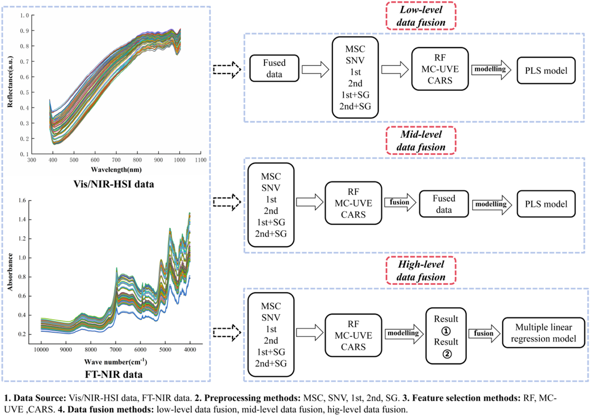
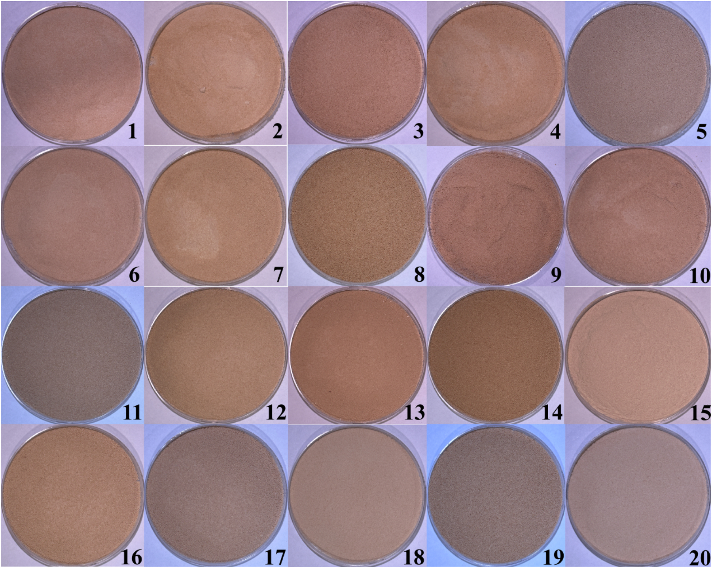
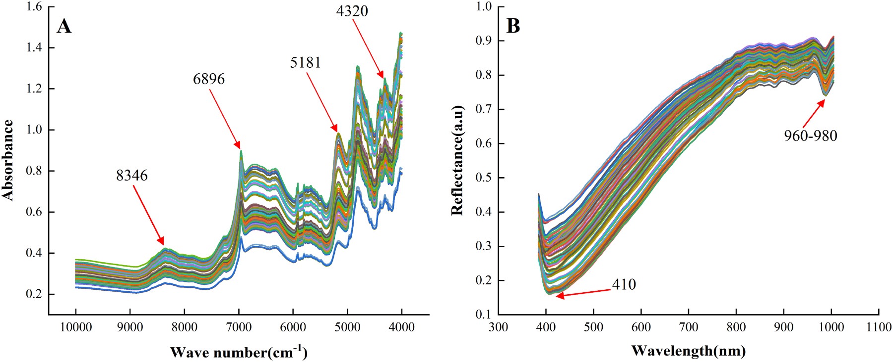
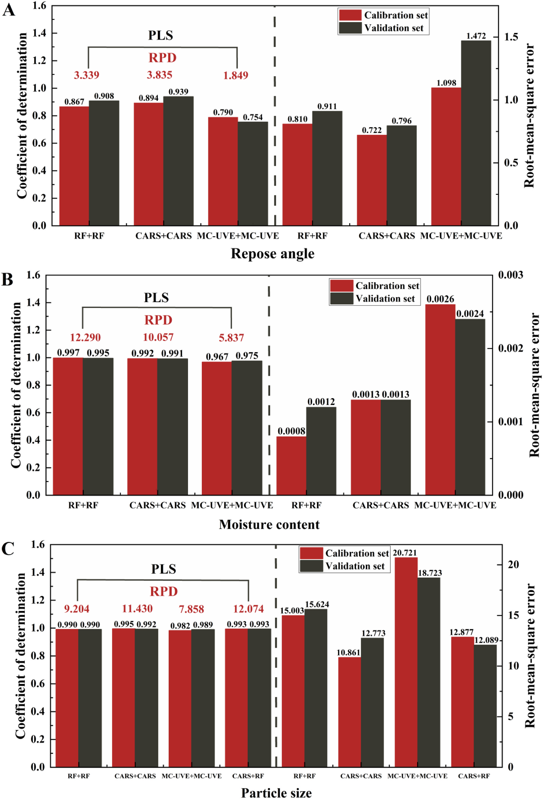
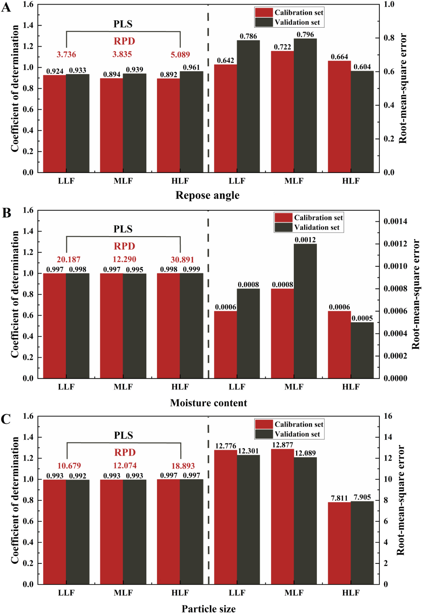
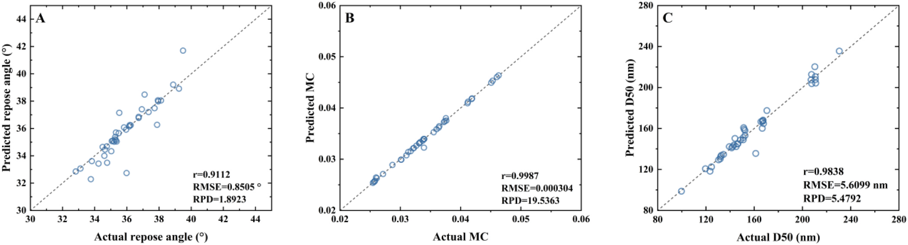

<!-- 方針: ほぼ全訳＋必要に応じた補足。原文構成に沿って訳出。「> 補足:」は訳者注。 -->

## 書誌情報

- 原題: Development of a data fusion strategy combining FT-NIR and Vis/NIR-HSI for non-destructive prediction of critical quality attributes in traditional Chinese medicine particles
- 著者: Ziqian Wang, Xinhao Wan, Xiaorong Luo, Ming Yang, Xuecheng Wang, Zhijian Zhong, Qing Tao（責任著者）, Zhenfeng Wu（責任著者）（江西中医薬大学・中国医学古典名方現代化国家重点実験室、江西省薬品検査センター、江西中医薬大学計算機学院、華潤江中製薬集団ほか。中国江西省南昌）
- 掲載: *Vibrational Spectroscopy* 137 (2025) 103780. https://doi.org/10.1016/j.vibspec.2025.103780
- インパクトファクター: **約3.1**（*Vibrational Spectroscopy*、各種集計サイトの JCR 2024 値は 3.1〜3.2。分光分析分野。**Clarivate 公式値は要確認**として捏造しない）
- 受領 2024-11-27 / 改訂 2025-01-12 / 採録 2025-01-30 / オンライン公開 2025-02-01
- 資金: 中国国家重点研究開発計画（課題番号 2023YFC3504500, 2023YFC3504503）。データは請求により提供。著者は利益相反なしと申告。

> 補足: 本論文は「特定の生薬の成分を定量する」タイプの論文ではなく、**漢方顆粒（TCMP＝Traditional Chinese Medicine Particles）を造粒する製造工程を、光を当てるだけの非破壊センサーでリアルタイム監視する**ための研究。分析化学というより **PAT（Process Analytical Technology＝プロセス分析技術）／製造DX** の論文。2つの分光センサーの「良いとこ取り」をどう組み合わせるか（データ融合）が主題。用語はこの節末尾でまとめて補足する。

> 補足（用語ミニ辞典）:
> - **CQA（重要品質特性）**: 製品の品質・安全性・有効性を保つため一定範囲内に収めるべき物性・特性。本研究では**流動性・粒径・水分**の3つ。
> - **CMA（重要原料特性）／CPP（重要工程パラメータ）**: それぞれ原料側（例：原料の水分・粒径）と工程側（例：造粒温度・結合剤の添加速度）の管理項目。CMAとCPPを制御することでCQAが決まる、という品質設計の考え方。
> - **PAT**: 製造中にセンサーで品質を測りながら工程を調整する枠組み。FDAの産業向けガイダンスにも位置づけられる。
> - **FT-NIR**: フーリエ変換近赤外分光。分子（水・糖・セルロース等）の振動を捉える。ここでは 1000–2500 nm（波数 4000–10000 cm⁻¹）を使用。
> - **Vis/NIR-HSI**: 可視/近赤外ハイパースペクトル・イメージング。分光と画像を同時に取り、各画素のスペクトルから**空間的な（見た目の）ムラ**まで捉える。ここでは 384.4–1004.6 nm。
> - **PLS（部分最小二乗回帰）**: スペクトル（説明変数が多く相関も強い）から目的値（水分など）を予測する定番の多変量回帰。
> - **RPD**: 予測性能の指標。標準偏差÷予測誤差。一般に **3超で優秀**とされる。
> - **安息角**: 粉体を積み上げたときの山の斜面の角度。小さいほど流れやすい（流動性が良い）。本研究では流動性の代理指標。
> - **D50**: 粒度分布の中央値（累積50%径）。粒径の代表値。

## 要旨（Abstract）

本研究は、漢方顆粒（TCMP）の重要品質特性（CQA）を予測するためのデータ融合戦略を開発するにあたり、フーリエ変換近赤外分光（FT-NIR）と可視/近赤外ハイパースペクトル画像（Vis/NIR-HSI）の相補的な能力を探索する。研究は、これらの技術を先進的なプロセス分析技術（PAT）プラットフォームに統合することに重点を置く。分子特性評価に強い FT-NIR と、空間的な品質評価に強い Vis/NIR-HSI のそれぞれ固有の強みを活かし、予測精度を高めるために複数のデータ融合戦略を評価した。**20 バッチ**の TCMP を流動化ベッド造粒により製造し、その性状を FT-NIR と Vis/NIR-HSI で特性評価した。比較解析の結果、水分と粒径の単独予測では **FT-NIR が Vis/NIR-HSI を上回った**。次に、両スペクトル領域の相補的情報を組み合わせる先進的な融合スキームを開発し、部分最小二乗（PLS）モデルを構築した。評価した 3 段階の融合のうち、**高レベル融合（HLF）戦略**が、流動性・粒径・水分について最も正確な予測を達成した。本研究は、FT-NIR と Vis/NIR-HSI データの高レベル融合が、TCMP の CQA 予測の効率と精度を大幅に向上させうることを示す。さらに、提案手法は顆粒状医薬品の迅速・非破壊的な品質分析を可能にし、リアルタイムのオンライン監視を実現し、自動化された医薬品安全プロセス制御を前進させる実務的な知見を提供する。

## 1. 序論（Introduction）

造粒（グラニュレーション）は経口固形剤形を製造する上で不可欠な工程であり、製剤化において重要な役割を果たす。粒径が均一で外観が一定した粒子を作ることは、原料の流動性・溶解性などの物理的特性を高め、正確な秤量や携帯性の向上といった利点をもたらす[1,2]。これらの粒子は、顆粒剤やカプセル剤のような最終製品にも、良好な圧縮成形性が求められる錠剤製造の中間体にもなりうる。

造粒工程は原料水分の変動や、混合時間・造粒速度などの工程条件のばらつきを含み、多様で複雑であるため、次の管理が不可欠である：原料の粒径・流動性などの**重要原料特性（CMA）**、造粒温度・結合剤添加速度などの**重要工程パラメータ（CPP）**、および周囲湿度・作業者の取り扱いなどの外的要因。これらの管理は、**重要品質特性（CQA）**——製品の品質・安全性・有効性を保証するため所定の限度内に維持すべき物理的・化学的・生物学的・微生物学的な特性——を管理するために重要である。造粒工程における CQA には均一性・溶出速度・安定性が含まれ、高品質な経口固形剤形の一貫した製造に不可欠である。例えば、水分（CMA）と造粒温度（CPP）の管理が不十分だと、顆粒の流動性（CQA）が悪化し、下流工程に悪影響を及ぼしうる。近年の研究は、CMA・CPP・CQA を体系的に管理して造粒工程を最適化し製品品質を高めることの重要性を一層強調している[3–5]。

造粒に影響する要因の理解を深めるため、多くの研究が単一または複数の PAT ツールを用いて CQA 評価を改善してきた[6]。流動性・粒径・水分といった特性は、打錠時の圧縮性・緻密化・付着性に大きく影響し、最終的に錠剤品質を左右するため重要である[7–9]。例えば、広く使われる PAT ツールである NIR 分光は、水分と粒径をリアルタイムに監視し工程パラメータを動的に調整するのに用いられてきた。同様に、ラマン分光は化学的均一性の評価に用いられ、造粒中の一定した製品品質を保証してきた。各種 PAT ツールは製剤科学における製品品質の監視・制御にも広く採用されている[10,11]。これらは、粒径や水分など特定の属性に着目する**単一 CQA 監視ツール**と、複数の特性を同時に評価する**多 CQA 監視ツール**に分類できる。

しかし、漢方顆粒（TCMP）の造粒は、原料特性のばらつきに起因する固有の課題を抱える。TCMP の原料の多くは、複雑な化学組成・高い吸湿性・強い付着性・多様な物理化学的性質をもつ生薬エキス（ハーブ抽出物）である[12]。加えて、一部の薬物は粒径・密度が不均一で流動性が悪く層分離しやすい原末を含む。従来の造粒工程はこれらの特性のため TCMP に直接適用しにくい。品質評価や終点検出のための従来のオフライン監視法は、こうした課題に対処するために必要なリアルタイムのフィードバックを欠き、しばしば非効率と不整合を招く[13]。対照的に、NIR 分光やラマン分光などの PAT ツールは、流動性・水分・化学的均一性などの CQA を検出できるリアルタイム監視能力を提供する[14–16]。これらは製造工程の設計・解析・制御を容易にし、サイクルタイムを短縮し、最終製品の品質を保証するため、TCMP 造粒の複雑な要求に特に適している。同時に、造粒工程中に単一または複数の PAT ツールで CQA を監視する流れが強まっている。多変量データ処理技術と組み合わせることで、造粒の理解と制御を高める予測モデルの開発が進む[17]。

**FT-NIR** と **Vis/NIR-HSI** は、食品・製薬産業で広く使われる迅速・非破壊の技術である。FT-NIR は FDA の PAT ガイダンスの構成要素の一つとして、所定の分布内の粒径の微妙な変動を検出し、圧縮粒子の変形特性を評価するのに優れる[18]。また、粒子の水分や流動性の測定にも頻繁に用いられ、CQA 監視に有用なツールである[19]。ただし FT-NIR 単独では、TCMP の CQA を正確に予測するのに必要な複雑な物理・化学特性を十分に捉えきれない限界がある。もう一つの高速・非破壊法である Vis/NIR-HSI は、画像と分光を組み合わせて空間的に分解された品質データを提供し、顆粒の内部・外部の属性を捉えることで FT-NIR を補完する。FT-NIR が分子特性評価に優れる一方、Vis/NIR-HSI は均一性や粒径変動などの空間分布を評価する能力を加える。これらの相補的な強みにより、両者の統合は TCMP の CQA 監視に特に有益となる。例えば、流動性・化学的均一性・顆粒の均質性などの追加の CQA を効果的に監視できる。近年、ハイパースペクトル画像は製薬分野での応用が拡大している。例えば Tao らは、造粒工程中の水分・粒度分布・4 種の生理活性成分量を監視するハイパースペクトル画像解析法を開発した[20]。これは Vis/NIR-HSI が FT-NIR を補完し、製薬製造における複雑な CQA の監視を強化する可能性を示す。

FT-NIR や Vis/NIR-HSI といった単一技術は製薬産業の CQA 監視に広く研究・応用されてきたが、スペクトル範囲の制限やデータ被覆の不完全さといった限界から、データ融合法の利用が必要となる。現行の分光・ハイパースペクトル画像システムは、センサー製作上の課題により 400–2500 nm の全範囲をカバーすることはまれである。そのため、**384.4–1004.6 nm に感度をもつ CMOS 検出器**と **1000–2500 nm に感度をもつ InGaAs 検出器**の 2 つの検出器を用いるのが実用的解である[21]。例えば FT-NIR は分子特性と水分の分析に優れ、Vis/NIR-HSI は空間分布と粒径データを提供するため、両者の統合は TCMP に特に価値がある。複数機器の情報を組み合わせるデータ融合は、相補的なデータを統合してこれらの限界に対処し、工程理解と制御を高める。例えば FT-NIR と Vis/NIR-HSI のデータを組み合わせることで、TCMP の重要 CQA である粒径と水分の予測を改善できる。

データ融合は **低・中・高**の 3 段階に分類され、スペクトル情報を統合する体系的アプローチを提供する[22,23]。**低レベル融合**では、生スペクトルデータを前処理して直接結合する（例：FT-NIR と Vis/NIR-HSI のスペクトルを併合して包括的なスペクトル被覆を得る）。この手法は異なるスペクトル領域の相補的情報を捉え、粒子特性の微妙な変動の検出に特に有用である。**中レベル融合**では、化学組成や粒径などの重要特徴を各データ源から抽出し、統合してモデリング・解析する。例えば FT-NIR 由来の水分と Vis/NIR-HSI 由来の空間的粒子分布を組み合わせると、化学・空間の両属性を捉えて CQA の予測精度を高められる。**高レベル融合**は個々のモデルの予測を集約し（例：水分と流動性の別個のモデルを組み合わせ）、最終的な判断を下す。この手法は各モデルの強みを活かして意思決定を改善するのに特に有用である。データ融合は、不規則な粒径・密度・水和レベルなど、従来法では効果的に扱いにくい原料特性の固有のばらつきをもつ TCMP に特に価値がある。例えば Casian らは NIR スペクトルデータと粒度分布を統合する高レベル融合の可能性を示し、錠剤製造の制御を改善した[18]。同様に Fu らは NIR と AE（音響放出）技術を高レベル融合で組み合わせ、粒径分析の精度と信頼性を高めた[24]。有望であるにもかかわらず、**FT-NIR と Vis/NIR-HSI をデータ融合で組み合わせて TCMP の CQA を予測した研究は報告されておらず**、本研究はこの分野への革新的な貢献となる。

したがって本研究は、FT-NIR と Vis/NIR-HSI をデータ融合戦略で統合し、TCMP の CQA をリアルタイムかつ精密に予測する多機器 PAT プラットフォームの開発を目的とする。具体的目標は、(1) 個別の分光技術ならびに低・中・高レベルのデータ融合を用いて TCMP の CQA の PLS 予測モデルを開発すること、(2) 異なる融合戦略でモデル性能を比較し、最適なデータ融合スキームを特定し、CQA 監視のための堅牢な多機器 PAT プラットフォームを確立すること、である。本研究の対象 CQA は、TCMP 製造の品質・一貫性の確保に重要な**流動性・粒径・水分**である。

## 2. 材料と方法（Materials and Methods）

### 2.1. 材料

本研究で用いた TCMP の構成成分は、中薬エキス末（Chinese materia medica extract powder）・山薬（ヤマイモ）末・糖末・デキストリンで、いずれも江西江中製薬有限公司から入手した。詳細は次のとおり：中薬エキス末は生理活性成分含量が規格化された微粉末、山薬末は 100–120 メッシュに調製、糖末は純度 ≥99% の医薬品グレードのショ糖、デキストリンはデキストロース当量（DE）10–15 の医薬品グレード。全材料は医薬品グレードで、関連薬局方規格に適合。

### 2.2. 試料調製

**20 バッチ**の TCMP を、6 因子・各 2 水準の部分実施要因計画（partial factorial design）で調製した。造粒温度・乾燥時間・結合剤濃度・給気圧・噴霧圧・供給速度を、Table 1 の行列に従って変化させた。造粒は流動化ベッド造粒機で固定の材料比を用いて行った。流動化ベッド造粒工程は 3 段階：(1) 流動化ベッドの加熱、(2) 各種濃度の結合剤を配合して水浴で加熱、(3) 実験計画で指定した工程パラメータに従って造粒。異なる濃度での TCMP の処方組成・用量は Table 2 に示す。

**Table 1. TCMP 調製時の因子変動を示す DoE 行列。**

| Exp | 乾燥温度(℃) | 結合剤含量(%) | 噴霧圧(MPa) | 供給速度(mL/min) | 給気量(m³/h) | 乾燥時間(min) |
|---|---|---|---|---|---|---|
| 1 | 65 | 18 | 0.3 | 15.0 | 40 | 8.0 |
| 2 | 55 | 13 | 0.2 | 11.5 | 35 | 5.5 |
| 3 | 65 | 18 | 0.1 | 15.0 | 30 | 3.0 |
| 4 | 45 | 18 | 0.1 | 15.0 | 40 | 3.0 |
| 5 | 65 | 8 | 0.3 | 8.0 | 30 | 8.0 |
| 6 | 45 | 18 | 0.1 | 8.0 | 40 | 8.0 |
| 7 | 65 | 8 | 0.1 | 15.0 | 40 | 8.0 |
| 8 | 65 | 8 | 0.3 | 15.0 | 30 | 3.0 |
| 9 | 45 | 18 | 0.3 | 8.0 | 30 | 3.0 |
| 10 | 45 | 8 | 0.1 | 8.0 | 30 | 3.0 |
| 11 | 55 | 13 | 0.2 | 11.5 | 35 | 5.5 |
| 12 | 45 | 18 | 0.3 | 15.0 | 30 | 8.0 |
| 13 | 45 | 8 | 0.1 | 15.0 | 30 | 8.0 |
| 14 | 65 | 18 | 0.3 | 8.0 | 40 | 3.0 |
| 15 | 45 | 8 | 0.3 | 8.0 | 40 | 8.0 |
| 16 | 65 | 8 | 0.1 | 8.0 | 40 | 3.0 |
| 17 | 55 | 13 | 0.2 | 11.5 | 35 | 5.5 |
| 18 | 45 | 8 | 0.3 | 15.0 | 40 | 3.0 |
| 19 | 65 | 18 | 0.1 | 8.0 | 30 | 8.0 |
| 20 | 55 | 13 | 0.2 | 11.5 | 35 | 5.5 |

**Table 2. TCMP の処方組成・用量。**（結合剤濃度 8%／13%／18% の 3 条件）

| 成分 | 8% | 13% | 18% |
|---|---|---|---|
| 中薬エキス末（g） | 375 | 375 | 375 |
| 山薬末（g） | 675 | 675 | 675 |
| 糖末（g） | 1875 | 1875 | 1875 |
| デキストリン（g） | 75 | 75 | 75 |
| 水使用量（mL） | 863 | 502 | 342 |

（注：水使用量は各結合剤濃度の調製に要する水量。）

### 2.3. CQA の測定

#### 2.3.1. 水分

TCMP の水分測定では、まず清浄な秤量瓶を 105 ℃ の乾燥器で 1 時間乾燥。取り出してデシケーター中で室温まで冷却し秤量。連続測定の差が 2 mg 以内になるまで繰り返して恒量を確保する。空瓶の質量を m3 とする。次に TCMP 試料を秤量瓶に加え、試料と瓶の合計質量を m1 とする。試料入りの瓶を 105 ℃ の乾燥器に 12 時間置いて水分を除去。この乾燥・秤量を差が 2 mg 以内になるまで繰り返し、乾燥後の試料と瓶の最終質量を m2 とする。水分（MC）は次式で算出する（乾燥で除去された水の割合を反映）：

MC = (m1 − m2) / (m1 − m3)　……(1)

#### 2.3.2. 粒径

試料の粒径は、Malvern Scirocco 2000 乾式分散ユニットを備えた Malvern Mastersizer 2000（Malvern Instruments, 英国）を用い、レーザー回折の乾式分散モードで測定した。1 回の測定に約 3 g の試料を用い、測定時間 6 秒、分散気圧 2 bar。Mastersizer 2000 は Mie 散乱理論に基づき、乾式分散での精度・適合性が広く認められる。粒径解析には造粒工程の CQA であり流動性に大きく影響する **D50** を用いた。

#### 2.3.3. 流動性

TCMP の流動性は BT-1001 インテリジェント粉体特性試験機で測定した。約 50 g の試料を投入口に加え、直径 10 mm の篩を備えた漏斗を通して均一に流し落として測定台上に円錐を形成させた。円錐が安定・対称になり粉体が均一に落ちるようになったら供給を停止。円錐斜面と台面の角度を**安息角**として測定した。3 回測定の平均を最終安息角とした。安息角は粒子の流動性を評価する重要パラメータで、本研究では TCMP の流動性指標として用いた（流動性が悪いと造粒ムラ・粒子分布の不均一・圧縮困難を招き最終製品品質に影響するため）。

### 2.4. FT-NIR 分光

試料の拡散反射スペクトルは Antaris™ II FT-NIR（Thermo Fisher Scientific, 米国 Waltham）で収集した。スペクトル範囲 **1000–2500 nm**、分解能 **8 cm⁻¹**、1 測定あたり **64 スキャン**、バックグラウンドスペクトルは精度確保のため毎時収集。安定した信号を得るため、**25 ℃・相対湿度 47% 未満**の制御条件下で運転し、データ収集前に 1 時間ウォームアップ。各試料でスキャンを 3 回反復し、平均値を以後の統計解析に用いた。

### 2.5. Vis/NIR ハイパースペクトル画像

試料のハイパースペクトル画像は Vis/NIR ハイパースペクトルカメラ（GaiaField-V10, 四川双利合譜科技, 中国成都）で、波長範囲 **384.4–1004.6 nm** で撮影した。本機は **128 スペクトルバンド**、空間分解能 **640 点**を備える。焦点距離 17 mm のレンズをカメラに装着し、暗箱内で試料の 50 cm 上方に設置して均一照明と外乱の最小化を図った。照明は 120 W ハロゲンランプ 4 灯で、露光時間とフレーム周期は光強度に応じて 5 ms に設定。

正確なスペクトルデータのため、スペクトル画像撮影前に黒板・白板の参照画像を取得した。黒板参照画像はカメラの暗電流を、白板参照画像は照明変動と検出器感度のばらつきを補正し、較正済み反射率データを確保する。較正は次式で生ハイパースペクトル画像を反射率画像に変換する：

RC = (RS − RD) / (RW − RD)　……(2)

（RW＝白板参照画像、RD＝黒板参照画像、RC＝較正済み反射率画像、RS＝生ハイパースペクトル画像）

計 **100 セット**のハイパースペクトル画像を取得・較正した。較正画像は ENVI 5.3 に取り込み、各試料で関心領域（ROI）を手動選択し、各バンドで ROI 内全画素の平均スペクトル値を算出した。

### 2.6. データセット分割とスペクトル前処理

Kennard-Stone アルゴリズムを用いて、**75 試料を検量（キャリブレーション）セット、25 試料を検証（バリデーション）セット**として選定し、スペクトル空間で試料が均等に分布するようにしてモデルの頑健性を高めた[25]。ランダムノイズやベースラインドリフトなどの外的要因による誤差に対処するため、複数のスペクトル前処理を適用：**多重散乱補正（MSC）・標準正規変量変換（SNV）・1 次微分（1st）・2 次微分（2nd）・1st+SG 平滑フィルタ・2nd+SG 平滑フィルタ**[26]。各前処理の有効性はモデル性能の比較で評価し、予測精度とスペクトル品質を高める能力に基づき最適法を選定した[27]。

### 2.7. 特徴変数選択

スペクトルデータには必須情報と冗長情報が混在するため、モデルの簡素化・計算複雑性の低減・予測性能の向上に特徴変数選択が重要となる[28]。**競合的適応的再重み付けサンプリング（CARS）・ランダムフロッグ（RF）・モンテカルロ非情報変数除去（MC-UVE）**の 3 つの特徴変数選択法を用いた。これらはノイズを減らし関連スペクトル情報に集中することで、予測モデルの効率と精度を高める重要変数を特定する[29–31]。例えば RF を適用すると水分に関連する波長変数をうまく特定でき、モデル精度を大きく高めた。

### 2.8. 多源データ融合

本研究で用いた 3 つのデータ融合スキームを Fig. 1 に示す[32]。
- **低レベル融合（LLF）**: NIR とハイパースペクトルの前処理済みデータを結合し、試料の入力変数として一括処理する。
- **中レベル融合（MLF）**: 2 つのシナリオがある。i) 同じ特徴選択法を NIR とハイパースペクトルそれぞれに用いて特徴変数を選び、両スペクトルの特徴変数を融合する（一般的な中間レベル戦略）[33,34]。ii) 複数の特徴選択法を FT-NIR と Vis/NIR-HSI にそれぞれ用い、両スペクトルの最良の変数選択結果を融合する。
- **高レベル融合（HLF）**: NIR とハイパースペクトルそれぞれに別個の多変量解析モデルを作り、各モデルの結果を組み合わせる。本研究では高度融合の問題を**多重線形回帰**で解いた。式は次のとおり：

Yac = b + K1·X1,pc + K2·X2,pc　……(3)
Ydfpc = b + K1·X1,pvc + K2·X2,pvc　……(4)
Ydfpv = b + K1·X1,pvv + K2·X2,pvv　……(5)

（Yac＝検量セットの実測値、Ydfpc・Ydfpv＝それぞれ検量・検証セットの高度データ融合の予測値、X1,pc・X2,pc＝それぞれ NIR・ハイパースペクトルの検量セット予測値、X1,pvv・X2,pvv＝それぞれ NIR・ハイパースペクトルの検証セット予測値、K1・K2＝それぞれ NIR・ハイパースペクトルの重み、b＝多重線形回帰の切片）

> 補足: 原文の式(3)–(5)の添字は表記に不整合がある（例：式(4)は本文説明では検量セット、(5)は検証セットの予測を指すが添字 pvc/pvv の対応が読み取りにくい）。式の意味は「NIR モデルの予測値とハイパースペクトルモデルの予測値を、重み K1・K2 と切片 b で線形結合して最終予測を作る」というもの。数式の添字は原文ママとし改変しない。

### 2.9. モデル構築と統計解析

NIR・HSI データの共線性・ノイズに対処しつつ、スペクトルと TCMP の CQA（水分・粒径・流動性）の関係を効果的にモデル化するため **PLS モデル**を用いた。過学習リスクを抑え頑健性を高めるため、**10 分割交差検証**で最適な主因子数を決定した。モデル性能は、検量セット（RMSEC）と予測セット（RMSEP）の**二乗平均平方根誤差（RMSE）**、および検量（R²c）・予測（R²p）の**決定係数（R²）**で評価した。RMSEp が低く R²p が高いほど予測精度が良い。加えて**相対百分率偏差（RPD）**を用いてモデルの信頼性を検証した（**RPD が 3 超で一般に優れた予測能**を示す）[35]。

### 2.10. ソフトウェア

NIRS データの形式変換・前処理に The Unscrambler X 10.4、ハイパースペクトル画像取得・黒白板較正に SpecView、ROI 選択に ENVI 5.3、全スペクトル解析とモデル評価に Matlab R2018b を用いた。

## 3. 結果と考察（Results and Discussion）

### 3.1. スペクトル解析

異なる造粒条件で調製した TCMP は色・粒径・水分・流動性に顕著な差を示すが、これらの差を迅速・正確に見分けるのは依然難しい（Fig. 2）。TCMP の品質評価は外観のみに頼るべきでなく、生産ニーズに沿った CQA の定量規格を伴うべきである。

20 バッチ試料の平均スペクトル値を算出したところ、生の Vis/NIR-HSI・FT-NIR スペクトルにおいて、異なる CQA をもつ TCMP の平均スペクトル曲線は同一バンド内で似た振動傾向を示し、ピーク位置・大きさも一致した（Fig. 3）。観測された振幅変動は主に水分と化学組成の差に帰属され、これらが粒径・流動性・安定性などの CQA に直接影響する。Fig. 3A は波数 **4000–10000 cm⁻¹**のスペクトルバンドを示し、**4320・5181・6896・8346 cm⁻¹**の 4 つの明確な吸収ピークが見られる。Ciccoritti ら[36]によれば、約 4320・5181・8346 cm⁻¹ のピークは**水・セルロース・糖**の吸収に、6896 cm⁻¹ のピークは主要な化学成分である**ヘスペリジン**に対応する。5181 cm⁻¹ のピークは O-H 伸縮と変角の組み合わせ、4320 cm⁻¹ のピークは C-H 部分の変角・伸縮振動の組み合わせに帰属される[37]。Fig. 3B は各バッチの **384.4–1004.6 nm**の平均スペクトルバンドを示す。各バッチの曲線は同じ傾向を示し、384.4–410 nm でわずかに反射率が低下した後 410 nm から増加する。**960–980 nm** に明瞭な吸収の谷が観測され、主に第 3・第 4 倍音および他の結合バンドに関連する[38]。Badaró ら（2020）[39]によれば反射率結果にピークが見られうるが、本研究では有意なピークは観測されなかった。Vis/NIR-HSI のスペクトル範囲（384.4–1004.6 nm）は主に可視光に集中するため、生データから異なる化学結合の伸縮振動を区別するのは難しい。したがって、ノイズと冗長情報を除去し重要スペクトル特徴を増幅して、TCMP の CQA 予測の精度・信頼性を高める必要がある。

### 3.2. 最適前処理の選択

前処理済みの FT-NIR・Vis/NIR-HSI データに基づき TCMP の CQA 予測モデルを構築し、Table 3 にまとめた。**安息角・粒径・水分**の予測について、**FT-NIR** の最適前処理はそれぞれ **SNV・1 次微分・1st+SG 平滑**で、RPD はそれぞれ **2.591・10.154・24.295**。**Vis/NIR-HSI** の最適前処理はそれぞれ **1st+SG・2 次微分・1st+SG**で、RPD はそれぞれ **2.763・6.991・4.732**。FT-NIR の粒径予測では 1 次微分の RPD が 1st+SG よりわずかに低かったが、訓練セットの RMSE が試験セットに近く性能が良かったため、粒径予測には 1 次微分を最適前処理として選んだ。

前処理法の選択はスペクトルデータの特性と、各検出指標のスペクトル特徴への依存性で決まる。例えば粒径予測では、1 次微分が背景ノイズを効果的に除去し粒径変動に関わる微妙なスペクトル特徴を強調する。水（強い吸収ピークをもつ）が関与する水分予測では、1st+SG のような平滑フィルタがノイズ除去と重要特徴保持により効果的。さらに安息角は粒子の物理的散乱特性への依存が強く、水分は化学吸収特徴と密接に結びつく。これらの違いが、指標ごとに異なる前処理を要する理由を説明する。単一の前処理を全てに普遍的に適用することはできない。

**Table 3. 異なる前処理法での PLS モデリング結果。**（各 CQA について FT-NIR・Vis/NIR-HSI ごとに 6 前処理。R²c・RMSEC・RMSECV・R²p・RMSEP・RPD の順）

| 指標 | データ | 前処理 | R²c | RMSEC | RMSECV | R²p | RMSEP | RPD |
|---|---|---|---|---|---|---|---|---|
| 安息角(°) | FT-NIR | MSC | 0.687 | 1.223 | 1.726 | 0.854 | 1.205 | 2.552 |
| | | SNV | 0.693 | 1.212 | 1.814 | 0.862 | 1.187 | 2.591 |
| | | 1st | 0.680 | 1.267 | 1.846 | 0.850 | 1.318 | 2.314 |
| | | 2nd | 0.563 | 1.403 | 1.830 | 0.841 | 1.642 | 1.900 |
| | | 1st+SG | 0.666 | 1.279 | 1.848 | 0.820 | 1.369 | 2.253 |
| | | 2nd+SG | 0.805 | 1.071 | 1.699 | 0.717 | 1.399 | 1.896 |
| 安息角(°) | Vis/NIR-HSI | MSC | 0.819 | 1.109 | 1.617 | 0.628 | 1.353 | 1.627 |
| | | SNV | 0.780 | 1.214 | 1.654 | 0.644 | 1.368 | 1.608 |
| | | 1st | 0.811 | 1.074 | 1.360 | 0.794 | 1.130 | 2.130 |
| | | 2nd | 0.781 | 1.092 | 1.684 | 0.883 | 1.047 | 2.684 |
| | | 1st+SG | 0.805 | 1.040 | 1.410 | 0.872 | 0.983 | 2.763 |
| | | 2nd+SG | 0.811 | 1.179 | 1.733 | 0.491 | 1.407 | 1.248 |
| 水分(%) | FT-NIR | MSC | 0.996 | 0.001 | 0.001 | 0.997 | 0.001 | 17.171 |
| | | SNV | 0.996 | 0.001 | 0.001 | 0.997 | 0.001 | 16.866 |
| | | 1st | 0.997 | 0.001 | 0.001 | 0.998 | 0.001 | 22.364 |
| | | 2nd | 0.997 | 0.001 | 0.001 | 0.994 | 0.001 | 13.041 |
| | | 1st+SG | 0.997 | 0.001 | 0.001 | 0.998 | 0.001 | 24.295 |
| | | 2nd+SG | 0.999 | 0.001 | 0.001 | 0.997 | 0.001 | 17.574 |
| 水分(%) | Vis/NIR-HSI | MSC | 0.959 | 0.003 | 0.004 | 0.959 | 0.004 | 3.771 |
| | | SNV | 0.959 | 0.003 | 0.004 | 0.963 | 0.004 | 3.833 |
| | | 1st | 0.963 | 0.003 | 0.004 | 0.934 | 0.004 | 3.538 |
| | | 2nd | 0.958 | 0.003 | 0.005 | 0.947 | 0.003 | 4.408 |
| | | 1st+SG | 0.959 | 0.003 | 0.005 | 0.957 | 0.003 | 4.732 |
| | | 2nd+SG | 0.943 | 0.004 | 0.006 | 0.846 | 0.006 | 2.485 |
| 粒径(μm) | FT-NIR | MSC | 0.977 | 23.903 | 31.255 | 0.977 | 21.405 | 6.127 |
| | | SNV | 0.980 | 22.640 | 29.297 | 0.976 | 21.979 | 5.967 |
| | | 1st | 0.991 | 14.710 | 21.476 | 0.991 | 14.240 | 10.154 |
| | | 2nd | 0.992 | 13.843 | 21.333 | 0.988 | 17.690 | 8.511 |
| | | 1st+SG | 0.989 | 15.787 | 22.745 | 0.993 | 12.855 | 11.696 |
| | | 2nd+SG | 0.995 | 10.948 | 20.326 | 0.987 | 16.590 | 8.593 |
| 粒径(μm) | Vis/NIR-HSI | MSC | 0.971 | 25.488 | 36.358 | 0.973 | 25.251 | 6.143 |
| | | SNV | 0.966 | 27.106 | 34.827 | 0.977 | 23.315 | 6.653 |
| | | 1st | 0.974 | 25.539 | 33.019 | 0.965 | 23.019 | 5.260 |
| | | 2nd | 0.974 | 24.270 | 32.752 | 0.979 | 21.714 | 6.991 |
| | | 1st+SG | 0.966 | 27.387 | 33.146 | 0.976 | 22.914 | 6.515 |
| | | 2nd+SG | 0.976 | 23.552 | 38.932 | 0.956 | 31.709 | 4.651 |

> 補足: 水分の RMSE が 0.001 と極端に小さいのは、水分が小数（比率）で表現されているため（例：4% = 0.04）。同じ理由で水分の RPD が 13〜24 と非常に大きく出る。R²p は前処理間で大差ないので、実務上は「どの前処理でも水分予測は良好」と読める。太字にした最適値の RPD（FT-NIR: 安息角2.591・粒径10.154・水分24.295／Vis/NIR-HSI: 安息角2.763・粒径6.991・水分4.732）が本文の主張と一致することを確認済み。

**Table 4. 異なる特徴変数選択法での PLS モデリング結果。**（各 CQA の最適前処理に RF/CARS/MC-UVE を組み合わせ）

| 指標 | データ | 方法 | R²c | RMSEC | RMSECV | R²p | RMSEP | RPD |
|---|---|---|---|---|---|---|---|---|
| 安息角(°) | FT-NIR | SNV+RF | 0.717 | 1.145 | 2.032 | 0.862 | 1.154 | 2.664 |
| | | SNV+CARS | 0.758 | 1.068 | 1.233 | 0.891 | 1.036 | 2.968 |
| | | SNV+MC-UVE | 0.401 | 1.618 | 1.634 | 0.802 | 1.798 | 1.710 |
| 安息角(°) | Vis/NIR-HSI | 1st+SG+RF | 0.829 | 0.969 | 1.694 | 0.855 | 1.026 | 2.646 |
| | | 1st+SG+CARS | 0.841 | 0.947 | 1.139 | 0.915 | 0.807 | 3.365 |
| | | 1st+SG+MC-UVE | 0.690 | 1.323 | 1.385 | 0.797 | 1.234 | 2.201 |
| 水分(%) | FT-NIR | 1st+SG+RF | 0.999 | 0.001 | 0.009 | 0.998 | 0.001 | 20.664 |
| | | 1st+SG+CARS | 0.999 | 0.001 | 0.001 | 0.998 | 0.001 | 19.673 |
| | | 1st+SG+MC-UVE | 0.971 | 0.002 | 0.002 | 0.982 | 0.002 | 7.401 |
| 水分(%) | Vis/NIR-HSI | 1st+SG+RF | 0.957 | 0.003 | 0.013 | 0.924 | 0.004 | 3.629 |
| | | 1st+SG+CARS | 0.956 | 0.003 | 0.003 | 0.924 | 0.004 | 3.509 |
| | | 1st+SG+MC-UVE | 0.825 | 0.006 | 0.007 | 0.822 | 0.006 | 2.353 |
| 粒径(μm) | FT-NIR | 1st+RF | 0.998 | 7.637 | 46.216 | 0.994 | 11.657 | 12.403 |
| | | 1st+CARS | 0.996 | 9.305 | 10.485 | 0.992 | 13.371 | 10.814 |
| | | 1st+MC-UVE | 0.958 | 31.554 | 35.481 | 0.951 | 39.235 | 3.685 |
| 粒径(μm) | Vis/NIR-HSI | 2nd+RF | 0.980 | 20.883 | 79.062 | 0.981 | 20.710 | 7.329 |
| | | 2nd+CARS | 0.983 | 19.692 | 25.177 | 0.981 | 20.746 | 7.317 |
| | | 2nd+MC-UVE | 0.939 | 37.378 | 42.787 | 0.956 | 32.178 | 4.717 |

### 3.3. 単一スペクトルによる予測結果

続いて、FT-NIR・Vis/NIR-HSI データで TCMP の水分・粒径・安息角の予測モデルを構築した（各 CQA の最適モデリング法は Table 4）。**水分と粒径**の予測では、**FT-NIR モデルの R²・RPD が Vis/NIR-HSI を有意に上回り**、FT-NIR がこれらのパラメータで優れた予測精度を示した。これは FT-NIR が分子振動と赤外吸収を分析でき、水分・粒径に伴う微妙な化学変動を捉えられることに帰属される。NIR は迅速・非破壊・高感度ゆえ、粒子の物理特性検出に理想的とされる[40]。対照的に**安息角**の予測では **Vis/NIR-HSI モデルが FT-NIR を上回った**。これは両技術の波長域の違いによると考えられ、Vis/NIR-HSI は分光と画像を統合して粒子表面の反射スペクトル情報（安息角のような物理属性と密接に関連）を捉えられるためである[41]。

とはいえ安息角予測は依然として大きな課題である。一方で安息角は粒子形状・サイズ・表面特性に強く影響されるが、これらはスペクトルデータに直接反映されないことがある。他方で安息角測定に内在するばらつきがモデル性能に影響しうる。将来的にはモデリングアルゴリズムの最適化や 3D 画像などの追加技術の統合で安息角予測をさらに高めうる。総じて本研究は、TCMP の CQA 予測における FT-NIR と Vis/NIR-HSI それぞれの強みと適用性を明確に示した。FT-NIR は化学成分の定量的特性評価に優れ、Vis/NIR-HSI は物理特性の捕捉により効果的である。

### 3.4. データ融合による予測結果

LLF 戦略に基づく前処理・特徴変数選択の結果を Table 5 にまとめる。FT-NIR データは **1557 変数**、Vis/NIR-HSI データは **128 変数**を含み、直接統合して **1685 変数**の LLF データセットを形成した。最適化・前処理を経て、この LLF データセットで安息角予測の全波長 PLS モデルを構築し、**R²p=0.949・RPD=4.259** を達成した。これは単一スペクトルモデル（FT-NIR: R²p=0.862, RPD=2.591／Vis/NIR-HSI: R²p=0.872, RPD=2.763）を有意に上回った。ただし LLF 全波長モデルは冗長・ノイズ変数を多数含み、さらなる次元削減が必要だった。個別データセットに最適前処理後 RF・CARS・MC-UVE の 3 特徴選択法を適用したが、粒径・水分の予測改善への効果は限定的で、RF・MC-UVE では R²p・RPD がむしろ低下し、MC-UVE の低下が最大だった。安息角の予測モデルも全波長モデルより性能が低下した。これらは、LLF 戦略はモデル性能を高めうるが、高次元データの扱いと予測結果の最適化に依然限界があることを示唆する。

MLF 戦略では、特徴変数選択法のさらなる最適化により予測性能が有意に改善した（Fig. 4）。**安息角**予測では、CARS 前処理を用いた FT-NIR と Vis/NIR-HSI の融合モデルが最良で、R²c・RMSEC・R²p・RMSEP はそれぞれ **0.894・0.722・0.939・0.796**。その RPD（**3.835**）は単一スペクトルモデル（FT-NIR: 2.968, Vis/NIR-HSI: 3.365）と LLF モデル（3.558）を上回った。**粒径**予測では **CARS+RF** 法で構築した MLF モデルが最良で RPD **12.074**（単一 FT-NIR モデルの 12.403 をわずかに下回る）。**水分**予測では RF ベースの MLF モデルが優れ、R²c・RMSEC・R²p・RMSEP・RPD はそれぞれ **0.997・0.008・0.995・0.001・12.290**。総じて MLF モデルは複数データ源の物理化学特性を効果的に統合し、特に粒径・水分の予測精度を有意に高めた。

MLF に比べ HLF 戦略は全体の予測性能をさらに改善した（Fig. 5）。HLF モデルでは、安息角予測に **CARS**、水分に **RF**、粒径予測に **RF+CARS** が最良だった。多重線形回帰分析から、**FT-NIR データが融合モデルへより大きく寄与**することが判明し、単一スペクトル・LLF モデルの知見と一致した。他モデルと比べ、HLF モデルは安息角・粒径・水分で有意に高い RPD（それぞれ **5.090・18.893・30.891**）に達した。加えて HLF モデルの RMSEC はそれぞれ **0.664・7.811・0.001** に大幅低減した。これらは HLF モデルが MLF・LLF より予測性能で優れるだけでなく、特に粒径・水分予測でより高い安定性・信頼性を示すことを意味する。

要するに本研究は、低・中・高レベル融合戦略の TCMP CQA 予測性能を明示的に比較した。融合戦略は FT-NIR と Vis/NIR-HSI の相補的情報を効果的に統合し、単一スペクトルモデルより予測精度・モデル安定性を有意に改善する。とりわけスペクトルと画像を組み合わせる HLF モデルは TCMP の品質管理指標の予測を大きく高め、複雑試料の解析におけるデータ融合の潜在力と価値を示した。

**Table 5. 低レベル融合(LLF)データの前処理・特徴選択法別 PLS モデル比較。**

| 指標 | データ | 方法 | R²c | RMSEC | RMSECV | R²p | RMSEP | RPD |
|---|---|---|---|---|---|---|---|---|
| 安息角(°) | LLF | MSC | 0.870 | 0.835 | 1.308 | 0.826 | 1.203 | 2.410 |
| | | SNV | 0.854 | 0.886 | 1.358 | 0.809 | 1.254 | 2.314 |
| | | 1st | 0.882 | 0.799 | 1.142 | 0.949 | 0.689 | 4.259 |
| | | 2nd | 0.907 | 0.708 | 1.057 | 0.907 | 0.895 | 3.281 |
| | | 1st+SG | 0.876 | 0.818 | 1.285 | 0.945 | 0.740 | 3.975 |
| | | 2nd+SG | 0.902 | 0.786 | 1.233 | 0.861 | 0.935 | 2.683 |
| | | 1st+RF | 0.924 | 0.642 | 2.207 | 0.933 | 0.786 | 3.736 |
| | | 1st+CARS | 0.888 | 0.773 | 0.871 | 0.919 | 0.825 | 3.558 |
| | | 1st+MC-UVE | 0.425 | 1.724 | 1.797 | 0.754 | 1.821 | 1.613 |
| 水分(%) | LLF | MSC | 0.997 | 0.001 | 0.001 | 0.996 | 0.001 | 15.880 |
| | | SNV | 0.997 | 0.001 | 0.001 | 0.998 | 0.001 | 19.507 |
| | | 1st | 0.997 | 0.001 | 0.001 | 0.994 | 0.001 | 13.136 |
| | | 2nd | 0.997 | 0.001 | 0.001 | 0.997 | 0.001 | 16.638 |
| | | 1st+SG | 0.997 | 0.001 | 0.001 | 0.995 | 0.001 | 13.479 |
| | | 2nd+SG | 0.998 | 0.001 | 0.001 | 0.997 | 0.001 | 16.927 |
| | | SNV+RF | 0.998 | 0.001 | 0.009 | 0.998 | 0.001 | 20.187 |
| | | SNV+CARS | 0.998 | 0.001 | 0.001 | 0.998 | 0.001 | 20.138 |
| | | SNV+MC-UVE | 0.986 | 0.002 | 0.002 | 0.995 | 0.002 | 10.068 |
| 粒径(μm) | LLF | MSC | 0.990 | 15.798 | 21.902 | 0.989 | 14.564 | 9.630 |
| | | SNV | 0.993 | 13.344 | 18.541 | 0.987 | 15.959 | 8.790 |
| | | 1st | 0.990 | 15.678 | 20.244 | 0.987 | 13.130 | 8.423 |
| | | 2nd | 0.992 | 13.726 | 20.297 | 0.991 | 12.984 | 10.117 |
| | | 1st+SG | 0.990 | 16.072 | 20.502 | 0.990 | 11.107 | 9.954 |
| | | 2nd+SG | 0.993 | 13.443 | 19.769 | 0.988 | 14.310 | 8.854 |
| | | 2nd+RF | 0.994 | 12.431 | 43.629 | 0.987 | 14.939 | 8.793 |
| | | 2nd+CARS | 0.993 | 12.776 | 14.386 | 0.992 | 12.301 | 10.679 |
| | | 2nd+MC-UVE | 0.970 | 26.271 | 27.706 | 0.972 | 21.918 | 5.993 |

### 3.5. モデル比較

一般に、単一スペクトルモデルの予測結果が不十分なとき、データ融合法を用いてさらに予測精度を高める[42]。本研究では、FT-NIR・Vis/NIR-HSI モデルは粒径・水分の予測では優れた性能を示したが、両者とも安息角予測では不十分だった。単一スペクトルモデルの改善を何度も試みたが予測性能は限定的なままだった。これは単一スペクトルモデルが、複雑試料 TCMP の CQA を包括的に特徴づけるのに重要な「相補的スペクトル情報」と「空間的変動」を同時に捉えられないためである。データ融合戦略を用いると、LLF・MLF モデルは単一 Vis/NIR-HSI モデルを上回ったが、単一 FT-NIR モデルの性能は超えなかった。これはおそらく、化学組成の特性評価における FT-NIR モデルの優れた予測能が、物理情報を補う Vis/NIR-HSI の寄与を覆い隠したためである。また LLF・MLF で採用した等重み融合戦略が、近赤外スペクトルの可視域のモデリングの有効性を下げ、これら融合手法の全体の予測性能を制限した可能性がある。

対照的に、HLF モデルは安息角・粒径・水分の予測で最良を示した。Fig. 6 は 3 つの CQA について、単一スペクトルモデルと最良融合モデルによる実測値（X）対予測値（Y）の散布図を示す。予測能の順位は、**安息角**: HLF > MLF > LLF > Vis/NIR-HSI > FT-NIR、**粒径**: HLF > FT-NIR > MLF > LLF > Vis/NIR-HSI、**水分**: HLF > FT-NIR > LLF > MLF > Vis/NIR-HSI であった。

3 融合戦略のモデル複雑性を比較するため、波長選択・モデリング・データ予測（テスト）に要する時間を評価した（Table 6）。複雑性は **HLF が最も高く、次いで MLF、LLF が最も低い**。詳細には、HLF は MLF と同じ波長選択手順を用いるが、まず 2 つのスペクトルデータに別々の予測モデルを構築し、それらを多重線形回帰で結合する。つまり HLF は **3 つの予測モデル**の構築を要し、MLF は 1 モデルで済む。ゆえに HLF は MLF より複雑。一方、LLF に比べ MLF は両スペクトルデータの波長選択（2 回）を要するが LLF は 1 回で済む。ゆえに MLF は LLF より複雑。**ただし 3 戦略の複雑性の差は統計的に有意に達しない。したがってデータ融合戦略の選定では、まず予測精度を重視すべきである。**

HLF モデルの著しい性能向上は、FT-NIR と Vis/NIR-HSI の強みを統合する能力に帰属される。FT-NIR は化学組成と分子構造の詳細情報を、Vis/NIR-HSI は分光と画像で粒子物性に関わる物理特性を提供する。これらを意思決定レベルで効果的に統合することで HLF は優れた予測性能を達成した。特に HLF は粒径・水分だけでなく安息角予測でも他手法を有意に上回り、階層的データ融合戦略が多源データの相補性を最大限に活かし、単一スペクトルモデルの限界を克服して段階的な性能改善を実現できることを示した。

**Table 6. 3 データ融合戦略のモデリング時間複雑性の分析。**（複雑度時間＝波長選択時間＋モデリング時間＋テスト時間）

| モデル区分 | 波長選択時間(s) | モデリング時間(s) | テスト時間(s) | 複雑度時間(s) |
|---|---|---|---|---|
| LLF | 0.8613 | 0.00098 | 0.0104 | 0.87268 |
| MLF | 1.016 | 0.00071 | 0.0116 | 1.02831 |
| HLF | 1.016 | 0.03428 | 0.0223 | 1.07258 |

> 補足: Fig. 6（各モデルの検量セット・検証セットの予測値対実測値のパリティプロット。安息角 A–E／水分 F–J／粒径 K–O を FT-NIR・Vis/NIR-HSI・融合データ別に配置）は本体PDF内に図として存在するが、細かなサブプロットの数値は読み取れないため本稿では画像を割愛し「原文参照」とする。

### 3.6. 高度融合モデルの外部検証

本研究で HLF モデルは安息角・粒径・水分の予測に優れた性能を示した。高度融合モデルの安定性・汎化能を評価するため、**独立した 10 バッチ（40 試料）**からなる外部検証セットを予測させた。検証では予測値と実測値を比較して HLF モデルの予測精度を評価した（Fig. 7・8）。Fig. 7 は外部検証の予測値対実測値の散布図で、HLF モデルが特に安息角・粒径の予測で高い精度を維持し、強い線形関係と小さな予測誤差を示した。Fig. 8 は Fig. 7 の詳細で、同一バッチ内試料の予測値対実測値の散布図を示す。同一バッチ内で若干の差はあったが、予測値は実測値に近いままだった。バッチ間・バッチ内試料とも強い線形関係と小さな予測誤差を示した。これは複雑なスペクトルデータを扱う高度融合手法の有効性・信頼性をさらに裏付ける。結論として、外部検証結果は HLF モデルの安息角・粒径・水分予測における優位性をさらに強固にし、今後の研究・実応用の確かな基盤を築いた。

（Fig. 8 の説明として原文は次を付す：3 特性を各種実験バッチで測定した実測値と予測値の比較を、(A) 安息角(°)・(B) 水分(MC)・(C) 粒径(D50、mm)の 3 サブプロットで示す。各点は特定の実験バッチ（A〜J）を表し、実測値＝赤点、予測値＝黒点、エラーバーはデータのばらつきを示す。）

> 補足: 原文本文 3.6 節と Fig. 8 説明では外部検証を「10 バッチ 40 試料」とする一方、結論 (iv) の前段や図説明では表現が揺れる箇所がある。ここでは本文の「10 独立バッチ（40 試料）」を採用。Fig. 8 は本体PDF内の図であり、細部数値は読み取れないため画像は割愛し「原文参照」とする。

## 4. 結論（Conclusions）

本研究は、データ融合法と PLS アルゴリズムを用いて FT-NIR と Vis/NIR-HSI データを統合し、TCMP の CQA——流動性・粒径・水分——を予測する PAT プラットフォームを開発した。主要な知見：

i) Vis/NIR-HSI モデルに比べ、FT-NIR モデルは粒径・水分の予測でより高精度、一方 Vis/NIR-HSI モデルは安息角予測でより良好だった。
ii) LLF・MLF モデルは粒径・水分について Vis/NIR-HSI モデルより良い予測を与えたが、FT-NIR モデルより精度は低かった。
iii) MLF モデルは全指標の予測精度を高め、特に粒径予測で最も顕著な改善を示した。
iv) FT-NIR と Vis/NIR-HSI を統合した HLF モデルが全指標で最高精度を達成した。安息角・粒径・水分の RPD は単一モデルや LLF/MLF モデルに比べ有意に増加した。

既存法と比べた本研究の革新は、データ融合戦略（特に HLF）を通じて FT-NIR と Vis/NIR-HSI の利点を有機的に統合した点にある。この手法は化学組成の分子特性を捉えるだけでなく粒子の物理特性も反映し、より高い予測精度と広い適用性を達成する。さらに TCMP 造粒工程中の CQA のリアルタイム・オンライン監視を支え、製薬プロセスの自動化・品質最適化の重要な基盤を提供する。柔軟性ゆえ、他の複雑な医薬品材料の検出・品質分析にも拡張でき、製薬産業のプロセス制御・品質管理に新たな解を提供する。

これらの成果にもかかわらず本研究には限界がある。第一に、安息角モデリングに用いたデータセットの多様性が乏しく、モデルの予測精度を制約した可能性がある。加えて PLS モデルのみを用い、性能を高めうる支持ベクトル回帰（SVR）やランダムフォレスト（RF）などの他の回帰法を検討していない。PLS モデルは生産要件を満たしたが、今後はより多様なデータセット・試料の導入と各種回帰モデリング手法の系統的評価により、モデル性能の最適化と頑健性の向上に注力する。CQA 予測の精度・適用性をさらに高めるため、深層学習アルゴリズムを統合し TCMP の化学組成・物理特性をより詳細に解析する計画である。これらは TCMP の物理化学的属性の包括的理解と制御を目指し、製薬企業にリアルタイムのオンライン検出・プロセス制御のための信頼できる効率的なツールを提供する。

## 参考文献

1. S. van den Ban, D.J. Goodwin, The impact of granule density on tabletting and pharmaceutical product performance, Pharm. Res. 34 (2017) 1002–1011. https://doi.org/10.1007/s11095-017-2115-5

2. T. Casian, S. Iurian, A. Gâvan, A. Porfire, A. Pop, S. Crişan, In-depth understanding of granule compression behavior under variable raw material and processing conditions, Pharmaceutics 14 (1) (2022) 177. https://doi.org/10.3390/pharmaceutics14010177

3. M. Peeters, A.A. Barrera Jiménez, K. Matsunami, M. Ghijs, E. Dos Santos Schultz, M. Roudgar, T. Vigh, F. Stauffer, I. Nopens, T. De Beer, Analysis of the effect of formulation properties and process parameters on granule formation in twin-screw wet granulation, Int. J. Pharm. 650 (2024) 123671. https://doi.org/10.1016/j.ijpharm.2023.123671

4. C. Portier, K. Pandelaere, U. Delaet, T. Vigh, A. Kumar, G. Di Pretoro, T. De Beer, C. Vervaet, V. Vanhoorne, Continuous twin screw granulation: Influence of process and formulation variables on granule quality attributes of model formulations, Int. J. Pharm. 576 (2020) 118981. https://doi.org/10.1016/j.ijpharm.2019.118981

5. I. Munu, A.L. Nicusan, J. Crooks, K. Pitt, C. Windows-Yule, A. Ingram, Predicting tablet properties using In-Line measurements and evolutionary equation Discovery: a high shear wet granulation study, Int. J. Pharm. 661 (2024) 124405. https://doi.org/10.1016/j.ijpharm.2024.124405

6. M.A. Alam, Z. Shi, J.K. Drennen III, C.A. Anderson, In-line monitoring and optimization of powder flow in a simulated continuous process using transmission near infrared spectroscopy, Int. J. Pharm. 526 (1-2) (2017) 199–208. https://doi.org/10.1016/j.ijpharm.2017.04.054

7. I. Wünsch, J.H. Finke, E. John, M. Juhnke, A. Kwade, The influence of particle size on the application of compression and compaction models for tableting, Int. J. Pharm. 599 (2021) 120424. https://doi.org/10.1016/j.ijpharm.2021.120424

8. A. Porfire, L. Rus, A.L. Vonica, I. Tomuta, High-throughput NIR-chemometric methods for determination of drug content and pharmaceutical properties of indapamide powder blends for tabletting, J. Pharm. Biomed. Anal. 70 (2012) 301–309. https://doi.org/10.1016/j.jpba.2012.07.026

9. R. Mathe, T. Casian, I. Tomuță, Multivariate feed forward process control and optimization of an industrial, granulation based tablet manufacturing line using historical data, Int. J. Pharm. 591 (2020) 119988. https://doi.org/10.1016/j.ijpharm.2020.119988

10. L. Zhong, L. Gao, L. Li, H. Zang, Trends-process analytical technology in solid oral dosage manufacturing, Eur. J. Pharm. Biopharm. 153 (2020) 187–199. https://doi.org/10.1016/j.ejpb.2020.06.008

11. H. Nadeem, T.J. Heindel, Review of noninvasive methods to characterize granular mixing, Powder Technol. 332 (2018) 331–350. https://doi.org/10.1016/j.powtec.2018.03.035

12. Z. Jie, G. Tian, H.B. Qu, Research on comprehensive quality consistency evaluation strategy for TCM granules: a case study with sugar-free Yangwei Granules produced by fluid-bed granulation, Chin. Herb. Med. (2024). https://doi.org/10.1016/j.chmed.2024.11.001

13. T. Cui, Y. Hou, H. Feng, S. Wu, W. Li, Z. Li, Granulation process analysis technologies and potential applications in traditional Chinese medicine, Acupunct. Herb. Med. 2 (1) (2022) 9–24. https://doi.org/10.1097/HM9.0000000000000015

14. D.L. Galata, A. Domokos, B. Démuth, P. Záhonyi, G. Fülöp, Z.K. Nagy, B. Nagy, In-line indirect concentration measurement of ultralow dose API during twin-screw wet granulation based on NIR and Raman spectroscopy, Int. J. Pharm. 664 (2024) 124650. https://doi.org/10.1016/j.ijpharm.2024.124650

15. A. Haser, N. Kittikunakorn, E. Dippold, J.C. DiNunzio, W. Blincoe, Continuous twin-screw wet granulation process with in-barrel drying and nir setup for real-time moisture monitoring, Int. J. Pharm. 630 (2023) 122377. https://doi.org/10.1016/j.ijpharm.2022.122377

16. C. Peng, L. Zhong, L. Gao, L. Li, L. Nie, A. Wu, R. Huang, W. Tian, W. Yin, H. Wang, Q. Miao, Y. Zhang, H. Zang, Implementation of near-infrared spectroscopy and convolutional neural networks for predicting particle size distribution in fluidized bed granulation, Int. J. Pharm. 655 (2024) 124001. https://doi.org/10.1016/j.ijpharm.2024.124001

17. D.L. Galata, Z. Könyves, B. Nagy, M. Novák, L.A. Mészáros, E. Szabó, A. Farkas, G. Marosi, Z.K. Nagy, Real-time release testing of dissolution based on surrogate models developed by machine learning algorithms using NIR spectra, compression force and particle size distribution as input data, Int. J. Pharm. 597 (2021) 120338. https://doi.org/10.1016/j.ijpharm.2021.120338

18. T. Casian, B. Nagy, C. Lazurca, V. Marcu, E.O. Tőkés, É.K. Kelemen, K. Zöldi, R. Oprean, Z.K. Nagy, I. Tomuta, Development of a PAT platform for the prediction of granule tableting properties, Int. J. Pharm. 648 (2023) 123610. https://doi.org/10.1016/j.ijpharm.2023.123610

19. M. Razuc, A. Grafia, L. Gallo, M.V. Ramírez-Rigo, R. Romañach, Near-infrared spectroscopic applications in pharmaceutical particle technology, Drug Dev. Ind. Pharm. 45 (10) (2019) 1565–1589. https://doi.org/10.1080/03639045.2019.1641510

20. Y. Tao, J. Bao, Q. Liu, L. Liu, J. Zhu, Deep residual network enabled smart hyperspectral image analysis and its application to monitoring moisture, size distribution and contents of four bioactive compounds of granules in the fluid-bed granulation process of Guanxinning tablets, Spectrochim. Acta A Mol. Biomol. Spectrosc. 287 (2023) 122083. https://doi.org/10.1016/j.saa.2022.122083

21. C. Cevoli, E. Iaccheri, A. Fabbri, L. Ragni, Data fusion of FT-NIR spectroscopy and Vis/NIR hyperspectral imaging to predict quality parameters of yellow flesh “Jintao” kiwifruit, Biosyst. Eng. 237 (2024) 157–169. https://doi.org/10.1016/j.biosystemseng.2023.12.011

22. X. Li, M. Cai, M. Li, X. Wei, Z. Liu, J. Wang, K. Jia, Y. Han, Combining Vis-NIR and NIR hyperspectral imaging techniques with a data fusion strategy for the rapid qualitative evaluation of multiple qualities in chicken, Food Control 145 (2023) 109416. https://doi.org/10.1016/j.foodcont.2022.109416

23. H. An, C. Zhai, F. Zhang, Q. Ma, J. Sun, Y. Tang, W. Wang, Quantitative analysis of Chinese steamed bread staling using NIR, MIR, and Raman spectral data fusion, Food Chem. 405 (2023) 134821. https://doi.org/10.1016/j.foodchem.2022.134821

24. H. Fu, K.X. Teng, Y.F. Shen, J. Zhao, H.B. Qu, Quantitative analysis of moisture content and particle size in a fluidized bed granulation process using near infrared spectroscopy and acoustic emission combined with data fusion strategies, Spectrochim. Acta A Mol. Biomol. Spectrosc. 305 (2024) 123441. https://doi.org/10.1016/j.saa.2023.123441

25. R.W. Kennard, L.A. Stone, Computer aided design of experiments, Technometrics 11 (1) (1969) 137–148. https://doi.org/10.1080/00401706.1969.10490666

26. Z. Bai, X. Hu, J. Tian, P. Chen, H. Luo, D. Huang, Rapid and nondestructive detection of sorghum adulteration using optimization algorithms and hyperspectral imaging, Food Chem. 331 (2020) 127290. https://doi.org/10.1016/j.foodchem.2020.127290

27. Z. Jiang, A. Lv, L. Zhong, J. Yang, X. Xu, Y. Li, Y. Liu, Q. Fan, Q. Shao, A. Zhang, Rapid prediction of adulteration content in atractylodis rhizoma based on data and image features fusions from near-infrared spectroscopy and hyperspectral imaging techniques, Foods 12 (15) (2023) 2904. https://doi.org/10.3390/foods12152904

28. Y. He, W. Zhang, Y. Ma, J. Li, B. Ma, The classification of rice blast resistant seed based on raman spectroscopy and SVM, Molecules 27 (13) (2022) 4091. https://doi.org/10.3390/molecules27134091

29. H.D. Li, Q.-S. Xu, Y.-Z. Liang, Random frog: an efficient reversible jump Markov Chain Monte Carlo-like approach for variable selection with applications to gene selection and disease classification, Anal. Chim. Acta 740 (2012) 20–26. https://doi.org/10.1016/j.aca.2012.06.031

30. W. Cai, Y. Li, X. Shao, A variable selection method based on uninformative variable elimination for multivariate calibration of near-infrared spectra, Chemom. Intell. Lab Syst. 90 (2) (2008) 188–194. https://doi.org/10.1016/j.chemolab.2007.10.001

31. H. Li, Y. Liang, Q. Xu, D. Cao, Key wavelengths screening using competitive adaptive reweighted sampling method for multivariate calibration, Anal. Chim. Acta 648 (1) (2009) 77–84. https://doi.org/10.1016/j.aca.2009.06.046

32. A. Sanaeifar, X. Li, Y. He, Z. Huang, Z. Zhan, A data fusion approach on confocal Raman microspectroscopy and electronic nose for quantitative evaluation of pesticide residue in tea, Biosyst. Eng. 210 (2021) 206–222. https://doi.org/10.1016/j.biosystemseng.2021.08.016

33. L. Yun, J.Y. Zhang, Y.Z. Wang, FT-MIR and NIR spectral data fusion: a synergetic strategy for the geographical traceability of Panax notoginseng, Anal. Bioanal. Chem. 410 (1) (2018) 91–103. https://doi.org/10.1007/s00216-017-0692-0

34. P. Corona, M.T. Frangipane, R. Moscetti, G. Lo Feudo, T. Castellotti, R. Massantini, Chestnut cultivar identification through the data fusion of sensory quality and FT-NIR spectral data, Foods 10 (11) (2021) 2575. https://doi.org/10.3390/foods10112575

35. F. Shen, Q. Wu, P. Liu, X. Jiang, Y. Fang, C. Cao, Detection of Aspergillus spp. contamination levels in peanuts by near infrared spectroscopy and electronic nose, Food Control 93 (2018) 1–8. https://doi.org/10.1016/j.foodcont.2018.05.039

36. R. Ciccoritti, M. Paliotta, T. Amoriello, K. Carbone, FT-NIR spectroscopy and multivariate classification strategies for the postharvest quality of green-fleshed kiwifruit varieties, Sci. Hortic. 257 (2019) 108622. https://doi.org/10.1016/j.scienta.2019.108622

37. J. Hu, Z. Wang, Y. Wu, Y. Liu, J. Ouyang, Rapid determination of the texture properties of cooked cereals using near-infrared reflectance spectroscopy, Infrared Phys. Technol. 94 (2018) 165–172. https://doi.org/10.1016/j.infrared.2018.09.023

38. J. Workman, Jr, L. Weyer, Practical Guide To Interpretive Near-infrared Spectroscopy, CRC press, 2007. https://doi.org/10.1201/9781420018318

39. A.T. Badaró, J.F. Garcia-Martin, M. del Carmen López-Barrera, D.F. Barbin, P. Alvarez-Mateos, Determination of pectin content in orange peels by near infrared hyperspectral imaging, Food Chem. 323 (2020) 126861. https://doi.org/10.1016/j.foodchem.2020.126861

40. S. Wu, X. Zhang, G. Zhou, J. Wu, W. Song, Y. Zhang, Z. Li, W. Li, Physical fingerprint transformation of herbal medicines powders using near-infrared spectroscopy, Adv. Powder Technol. 34 (12) (2023) 104244. https://doi.org/10.1016/j.apt.2023.104244

41. B.S. Luka, B.M. Yunusa, Q.M. Vihikwagh, K.F. Kuhwa, T.H. Oluwasegun, R. Ogalagu, T.K. Yuguda, M. Adnouni, Hyperspectral imaging systems for rapid assessment of moisture and chromaticity of foods undergoing drying: principles, applications, challenges, and future trends, Comput. Electron Agric. 224 (2024) 109101. https://doi.org/10.1016/j.compag.2024.109101

42. J. Zhu, X. Fan, L. Han, C. Zhang, J. Wang, L. Pan, K. Tu, J. Peng, M. Zhang, Quantitative analysis of caprolactam in sauce-based food using infrared spectroscopy combined with data fusion strategies, J. Food Compost Anal. 104 (2021) 104130. https://doi.org/10.1016/j.jfca.2021.104130

## 訳者補足

> 補足（本稿の位置づけと実務的示唆）:
> - 本論文は「特定の生薬成分をどれだけ精確に定量するか」ではなく、**漢方顆粒の製造工程（流動化ベッド造粒）を光センサーで非破壊監視する PAT の設計論**。分析対象は最終製品の成分ではなく、**工程中の物性 CQA（流動性・粒径・水分）**である。したがって QC 試験室というより、製造現場のリアルタイム品質管理（RTRT＝実時間出荷試験や工程内管理）への応用を志向している。
> - **要点は「2 つのセンサーの良いとこ取り」**。FT-NIR は分子（化学組成・水分）に強く、Vis/NIR-HSI は画像を含むので見た目のムラ（空間・物理特性＝安息角）に強い。単独では一長一短だが、**各センサーで作った予測モデルの出力を多重線形回帰で結合する「高レベル融合(HLF)」**が、全 CQA で最良となった。生データを混ぜる低レベルや特徴量を混ぜる中レベルより、予測結果を賢く重み付けする方が効く、という結論。
> - **数値の読み方の注意**: 水分は比率（小数）で扱われているため RMSE が 0.001 と極端に小さく、RPD が 13〜31 と大きく出る。RPD は「大きいほど良い（>3 で優秀）」指標だが、桁の大きさそのものを他指標と直接比較しないほうがよい。粒径（μm）は RMSE が 7〜40 のオーダーで、こちらは実誤差の大きさとして解釈しやすい。
> - **限界（原文が明記）**: 20 バッチという少数試料、安息角データの多様性不足、PLS 単独（他の回帰・深層学習は未検討）。実装時はこれらを踏まえ、自社の造粒品目・原料ロット幅でモデルを再構築・検証する必要がある。
> - 同ワークスペースの関連解説として、造粒 PAT の総説「tcm-granulation-pat-review（伝統中薬の造粒プロセス解析技術(PAT)と応用）」があり、本論文はその総説が扱う技術群を具体的な 1 事例（マルチセンサー・データ融合）として実装・比較した位置づけ。
