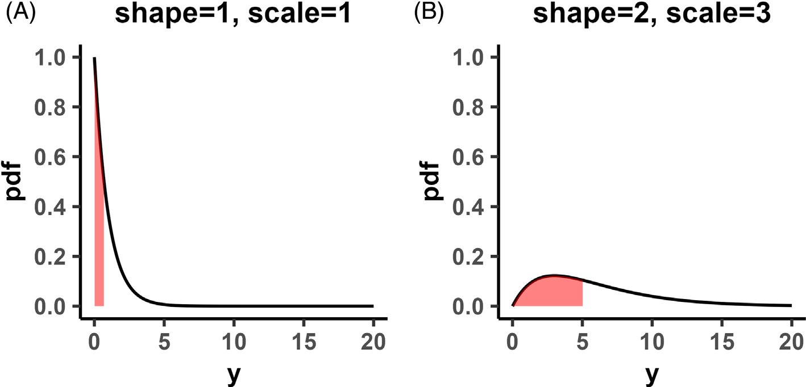
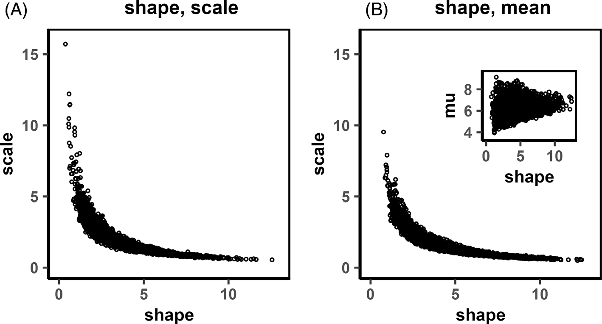
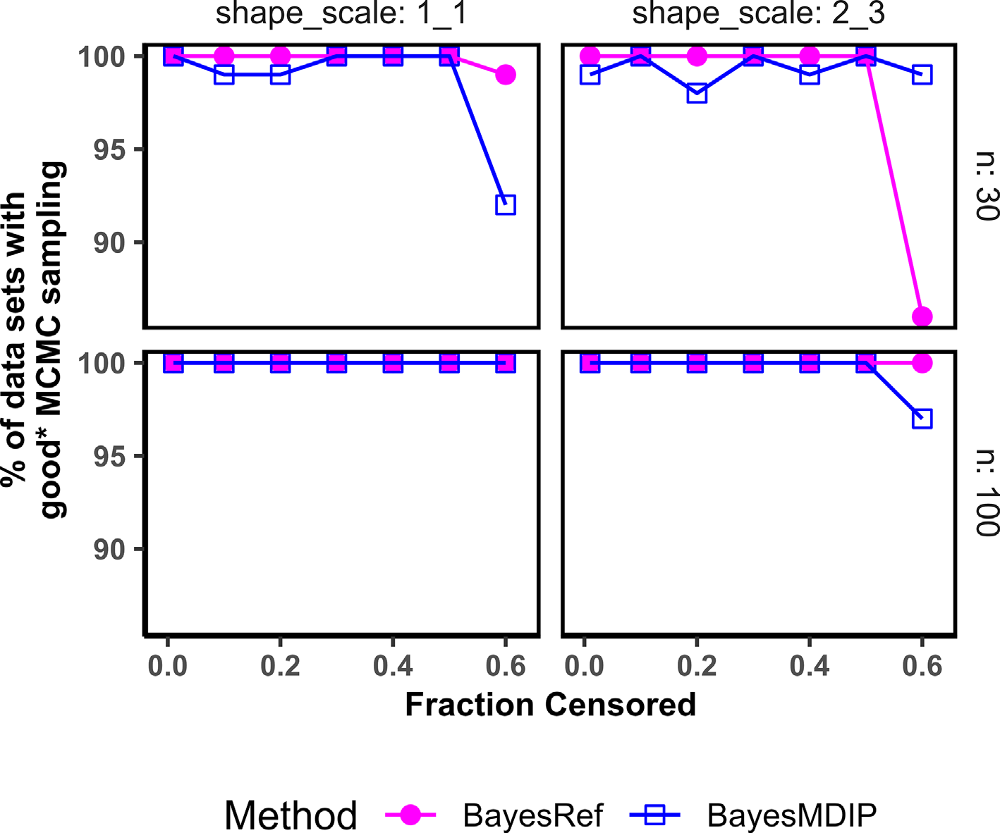
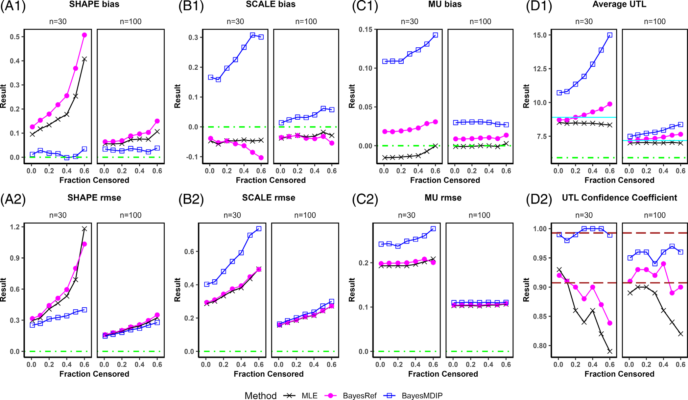
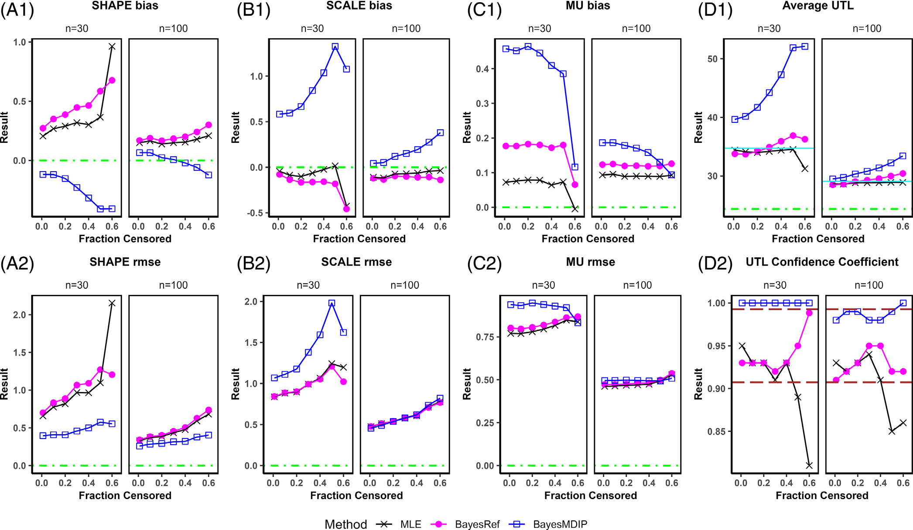
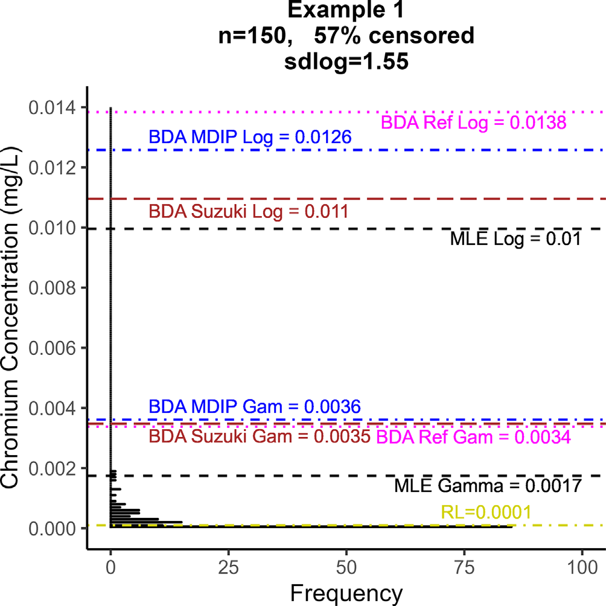
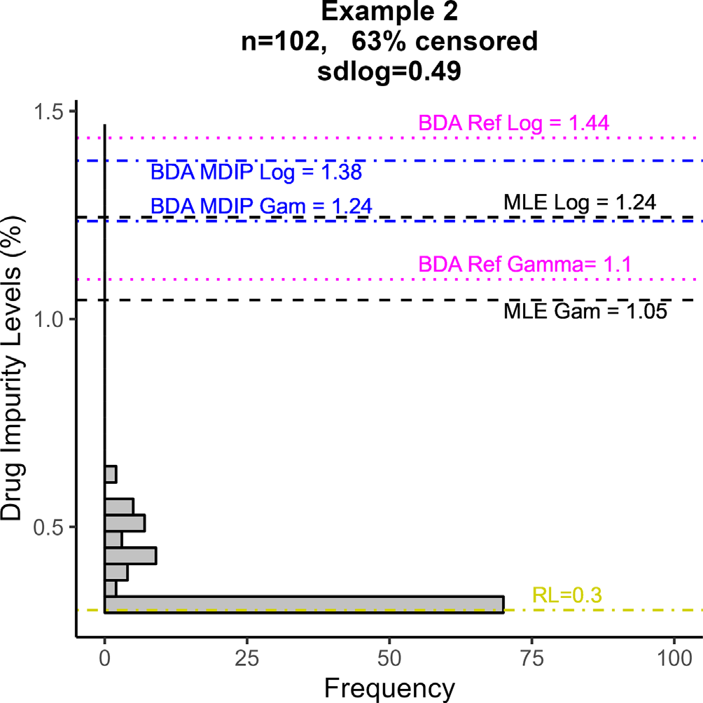

<!--
Montes RO. Frequentist and Bayesian tolerance intervals for setting specification limits
for left-censored gamma distributed drug quality attributes. Pharmaceutical Statistics
2024;23(2):168-184. doi:10.1002/pst.2344 の全訳密度日本語版。
-->

> **補足（本サイトでの位置づけ）:** 本論文は生薬そのものの研究ではなく、**医薬品の「規格限度（spec）」を統計的にどう決めるか**を扱う製薬統計の論文である。ただし当サイトが扱う漢方・生薬 QC でも、「不純物・有害成分・品質特性の上限規格をどう設定するか」は中心課題で、しかも生薬では **測定値が定量下限（LOQ）未満になる（＝左側打ち切り）** ことが頻繁に起こる（微量の重金属・農薬・カビ毒など）。本論文はまさにその「LOQ 未満のデータが混じり、かつ右に長く裾を引く（ガンマ分布的な）品質データ」から、母集団の 99.73% を 95% 信頼度で含む **上側許容限度（UTL）** を求め、それを規格限度にする方法を、MLE とベイズで比較する。実際この PDF はツムラ（漢方メーカー）がダウンロードしており、生薬製剤の規格設定への関心がうかがえる。当サイトの USP 生薬品質規格・AOAC 公定法・シックスシグマ等の「規格・品質保証」系論文の、統計的な裏付けを与える文献。数式・シミュレーションが中心で専門性は高いが、「なぜ対数正規でなくガンマなのか」「MLE で十分か、ベイズが要るか」を理解する実務指針になる。

---

# 書誌情報

- **原題:** Frequentist and Bayesian tolerance intervals for setting specification limits for left-censored gamma distributed drug quality attributes
- **和題（本稿）:** 左側打ち切りガンマ分布の医薬品品質特性に対する規格限度設定のための頻度論・ベイズ許容区間
- **著者:** Richard O. Montes（Alnylam Pharmaceuticals, Inc., Cambridge, MA, 米国）
- **責任著者:** R. O. Montes（rmontes@alnylam.com）
- **掲載誌:** Pharmaceutical Statistics 2024; 23(2): 168–184
- **DOI:** 10.1002/pst.2344
- **受理経緯:** 2023年4月26日受付 / 2023年8月27日改訂受付 / 2023年10月4日受理
- **© 2023 John Wiley & Sons Ltd**
- **キーワード:** ベイズ／ガンマ分布／左側打ち切り／最大尤度推定（MLE）／規格（specification）／許容区間（tolerance interval）
- **雑誌インパクトファクター:** 1.49（Pharmaceutical Statistics・JCR2024。英国製薬統計家協会 PSI の公式誌）
- **注記:** 本 PDF のダウンロード記録に「by Tsumura And Co.」の透かしあり。

---

# 要旨（Abstract）

品質特性測定値から得る許容区間（tolerance interval, TI）は、医薬品の規格限度の設定に用いられる。一部の特性測定値は報告限度未満、すなわち**左側打ち切り（left-censored）データ**でありうる。データが長い右裾（right-skew）をもつ場合、ガンマ分布が適用できる。本論文は、打ち切りガンマ分布の形状・尺度パラメータを推定し、標本数と打ち切り程度を変えて許容区間を計算する、**最大尤度推定（MLE）とベイズ法**を比較する。事前分布は**無情報の参照事前分布（reference prior）と最大データ情報事前分布（MDIP）**を用い、事前分布選択の影響を比較する。指標は、パラメータ推定にはバイアスと二乗平均平方根誤差（RMSE）、TI 評価には平均長と信頼係数（confidence coefficient）。

評価したシナリオでは、**参照事前分布を用いたベイズ法が総じて MLE より良い性能**を示す。標本数が小さいとき、MDIP を用いたベイズ法は保守的に広すぎる TI を生み、規格設定の基盤として不適である。全手法の指標は打ち切り程度の増加で悪化し、標本数の増加で改善した（予想通り）。本研究は、MLE が比較的単純でユーザーフレンドリーな統計ソフトで利用できるが、シナリオによっては表明した信頼水準を保つ許容限度を正確・精密に生成できないことを示す。無情報事前分布を用いたベイズ法は、計算負荷が大きく相当な統計プログラミングを要するが、規格設定に実用的な許容限度を生む。シミュレーション研究の知見を、実世界の実例で示す。

---

# 1. 序論（Introduction）

## 1.1. 許容区間（Tolerance interval）
**許容区間（TI）** は、指定した 100(1−α)% の信頼度で、母集団の少なくとも割合 P を含むと主張できる区間である[1]。TI は大量生産される製品の工程能力に限度を設定する際にとくに重要で、分布からの推論であるため医薬品規格の設定の統計的道具として用いられてきた[2]。TI を計算する統計手法は、データ構造（ロットあたり単一測定＝出荷データか、複数測定＝安定性データか）と品質特性の性質（安定性指示か否か、経時変化が線形か非線形か、母集団分布が正規・対数正規・ガンマか等）に依存する[3]。

## 1.2. 左側打ち切り（Left-censoring）
データに左側打ち切りがあると TI 計算に複雑さが加わる。**左側打ち切りデータ**は、分析法の限界のため、ある閾値未満であることだけが分かる結果である。報告限度（RL）未満の結果は真に「観測」されたとはみなされず（ゆえに「打ち切り」）、検出限度未満（<LOD）・定量限度未満（<LOQ）としてのみ報告される。左側打ち切りデータは、バイオアッセイ[4]・オリゴヌクレオチドのクロマトグラフィー分析[5]・環境モニタリング[6]・賦形剤の元素不純物[7]など製薬応用で一般的。右側・区間打ち切り（信頼性・生存研究）と区別するため「左側」と呼ぶが、本稿では簡潔に「打ち切りデータ」で左側打ち切りを指す。

## 1.3. MLE とベイズデータ解析（BDA）
打ち切りデータの扱いには、除外・定数代入（例：LOQ/2）[8, 9]・順序統計量回帰[10]・MLE[11]・ノンパラメトリック Kaplan-Meier[12]など多様な手法が環境統計で比較され、**多くのシナリオで MLE が最良**と結論されてきた。近年、マルコフ連鎖モンテカルロ（MCMC）サンプリングと計算能力の向上でベイズデータ解析（BDA）が普及した。本稿は打ち切りデータ解析の頻度論的 MLE と BDA に焦点を当てる。

## 1.4. 打ち切りガンマ分布 TI の研究・計算ツールの必要性
MLE/BDA で打ち切りデータを解析した研究を原著 Table 1 に要約。**調査した研究のほぼすべてが対数正規分布を扱った**が、対数正規・ガンマの両方が打ち切りデータの長い右裾をモデル化しうる。打ち切り対数正規 TI の計算ツールは統計パッケージで容易に利用できる。環境統計の文献は、**ガンマ分布に基づく MLE が対数正規より、データの歪度の変動やモデル誤設定に頑健**と示す[13, 14]。EPA のガイダンス[15]は、対数変換データの標準偏差（sdlog）が1超で標本が小さい（n<30）とき非現実的な統計上限を計算するとして対数正規の使用を戒め、代わりにガンマ分布を推奨する。打ち切りガンマデータの研究、とくにその TI 計算は少ないため、本稿の焦点とする。

## 1.5. 本研究の焦点
シミュレーションで、打ち切り程度・標本数を変えたガンマ分布パラメータ推定の MLE と BDA を比較する。パラメータ推定を用いて、医薬品規格限度設定の統計的基盤としての TI を計算する。データ構造はロットあたり単一測定（出荷データ）に限定し、打ち切り安定性データは対象外。主動機は、打ち切り正規・対数正規 TI のみが R パッケージに実装されているため、**打ち切りガンマ TI を計算するツール**を提示すること。対数正規とガンマの直接比較は文献[13–15]で明確な推奨とともに扱われているため含めず、代わりに2つの実世界例（4.2節）で MLE と BDA を両分布に適用して示す。

---

# 2. 方法論（Methodology）

## 2.1. ガンマ分布
ガンマ分布は正に歪んだ分布で、信頼性・寿命研究のモデルに頻用される[23]。パラメータ設定次第で指数・Weibull・正規など多くの分布を捉える柔軟な分布。2パラメータガンマ分布 Y ~ Gamma(k, θ) の確率密度関数（pdf）と累積分布関数（cdf）：

$$
f(y|k,\theta) = \frac{1}{\Gamma(k)\theta^k}e^{-y/\theta}y^{k-1}, \quad y>0,\ k>0,\ \theta>0 \tag{1}
$$
$$
F(y|k,\theta) = \frac{1}{\Gamma(k)\theta^k}\int_0^y e^{-y/\theta}y^{k-1}dy \tag{2}
$$

Y＝医薬品品質特性測定値、k＝形状（shape）、θ＝尺度（scale）、Γ()＝ガンマ関数。柔軟性のため全形状・尺度の組合せを一般化できず、計算負荷の高いベイズの制約もあり、製薬で遭遇しうるデータセットを例示する **2つの[形状, 尺度]の組[1,1]・[2,3]** をシミュレーションに用いる。Gamma(1,1) は Gamma(2,3) より相対的に右に歪む。打ち切りデータの割合 fcens はこの場合 0.5。

## 2.2. 打ち切りガンマ分布パラメータの推定

### 2.2.1. MLE
打ち切りガンマ分布の尤度関数（式3）。yobs・ycen は観測・打ち切りデータ部分集合。観測部分は pdf（式1）、打ち切り部分は cdf（式2、y=RL）で説明する：

$$
L(y|k,\theta) = \prod_{y_{obs}}f(y|k,\theta)\prod_{y_{cen}}F(RL|k,\theta) \tag{3}
$$

MLE は式(3)を最大化（負の対数尤度を最小化）する k・θ を解く。微分してゼロとおくと、複雑なディガンマ関数 ψ(k) を含む方程式系となり閉形式の推定量はない。R（数値グリッド解・optim 関数）、環境統計用パッケージ（EnvStats・NADA・fitdistrplus）、JMP/Minitab などを使える。本稿は EnvStats を MLE に用いる。BDA では形状 k と平均 μ=kθ で再パラメータ化するため、MLE でも k̂·θ̂ を掛けて μ̂ を得て直接比較する。

### 2.2.2. BDA（ベイズデータ解析）
ベイズの定理（分母の周辺分布は定数として除く）で比例関係（式4）を得る。事後分布 ∝ 尤度 × 事前分布：

$$
f(k,\theta|y) \propto f(y|k,\theta)f(k,\theta) \tag{4}
$$

パラメータの専門知識がないと仮定し**無情報事前分布**を用いる。ガンマのような多パラメータ分布には Jeffreys 事前分布より適切な**参照事前分布（reference prior）**（式5、ψ'(k)＝トリガンマ関数）：

$$
\pi(k,\theta) = \frac{1}{\theta}\sqrt{k\psi'(k)-1}\Big/k \tag{5}
$$

加えて事前分布選択の影響を評価するため、**最大データ情報事前分布（MDIP）**（正則な事後密度を与える修正版[28]）（式6）：

$$
\pi(k,\theta) \propto \frac{\theta}{\Gamma(k)}\exp\!\left[\frac{(k-1)\psi(k)-\ln\Gamma(k)}{k}\right] \tag{6}
$$

MCMC は Stan（R パッケージ rstan 経由）で事後分布からサンプリング。計算負荷が高いため、各シナリオで100シミュレーションデータセットを生成。診断基準（トレースプロット・neff・R̂）で MCMC の良否を評価し、**neff≥1000 かつ R̂≈1** を満たすデータセットのみ信頼できるとして指標評価に含める。ガンマの形状・尺度は強相関でサンプリング効率が落ちるため、尤度の rate を β=k/μ、事前の scale を θ=μ/k と再パラメータ化（μ＝平均）。4連鎖×2000反復（うち500ウォームアップ）でサンプリング。

## 2.3. 打ち切りガンマ分布の許容区間

### 2.3.1. MLE
EnvStats は打ち切り正規・対数正規の TI を計算できるがガンマは不可。ガンマ TI の閉形式はない。**Wilson-Hilferty[34]の3乗根変換**により、Y~Gamma(k,θ) なら Y^(1/3) は近似的に正規。完全観測データなら x=y^(1/3) と変換して標本統計量（μ̂x・σ̂x）を計算し、片側正規 TIx（式7、k1＝片側許容限度の許容係数）を構築、3乗して生データの TI を得る。本稿は監視対象特性（製薬不純物・環境汚染物質等）に適する**片側上側許容限度（UTL）**を対象とする：

$$
\text{Upper 1-sided } TI_x = \hat{\mu}_x + k_1\hat{\sigma}_x \tag{7}
$$

打ち切りデータでは全データが観測されず3乗根変換ができない。Y^(1/3) の平均・分散は k・θ の関数（式8, 9）：

$$
\mu = \theta^{1/3}\frac{\Gamma(k+1/3)}{\Gamma(k)} \tag{8}
$$

$$
\sigma^2 = \theta^{2/3}\frac{\Gamma(k+2/3)}{\Gamma(k)}-\mu^2 \tag{9}
$$

EnvStats の egammaCensored 関数で打ち切りガンマの MLE 形状・尺度推定値を出し、それを式(8)(9)に入れて式(7)の正規 TIx を計算、3乗して TI とする（**WH 近似**と呼ぶ）。この方法が正確な TI を生むかは不明で、Millard[24]が今後の研究課題としており、本稿がこれに答える。

### 2.3.2. BDA
TI は本来、仮想的反復標本で長期的に目標割合を主張信頼水準で覆う頻度論的枠組み。ベイズでも TI を導けるが解釈は異なる。ガンマパラメータの事後分布があれば、頻度論の仮想的反復標本をベイズで便利に実現できる。本稿では各100データセットについて、k̂・θ̂ 事後で定義されるガンマ分布の P 分位点 gP,i をとり、その (1−α) 分位点をとってベイズ UTL（厳密には目標割合の信用限度）を構築。

## 2.4. シミュレーション研究計画（原著 Table 2）

| 研究因子 | 水準 |
|---|---|
| 形状・尺度 [k, θ] | [1,1], [2,3] |
| 標本数 n | 30, 100 |
| 打ち切り率 fcens | 0.01, 0.1, 0.2, 0.3, 0.4, 0.5, 0.6 |
| アプローチ | MLE, BDA |
| BDA の事前分布 | 参照事前（BayesRef）, MDIP（BayesMDIP） |
| シミュレーションデータセット数 S | 100 |

打ち切り率に対応する上側分位点を閾値 RL とし、それ未満を打ち切りに再符号化。**(1−α)=0.95 信頼、P=0.9973 割合の UTL** を計算。データシミュレーション→パラメータ推定→UTL 計算を S=100 回反復。

## 2.5. シミュレーション指標
パラメータ Θ=[k, θ, μ] の推定を**バイアス（式10）と RMSE（式11）**で評価（低いほど良い）：

$$
\text{bias} = \frac{1}{S}\sum_{j=1}^{S}(\hat{\Theta}_j - \Theta) \tag{10}
$$

$$
\text{RMSE} = \sqrt{\frac{1}{S}\sum_{j=1}^{S}(\hat{\Theta}_j-\Theta)^2} \tag{11}
$$

UTL は**平均 UTL と信頼係数**で評価。信頼係数＝100データセットのうち UTL が母集団の目標 P=0.9973（Gamma(1,1) で 5.91、Gamma(2,3) で 24.38）を含む割合。より短い平均 UTL が望ましいが、まず主張信頼水準を保つことが必要。真の信頼係数0.95なら S=100 での期待範囲は二項近似で [0.91, 0.99]。この範囲内に収まるほど良い。

## 2.6. 統計ソフト
RStudio 1.2.5033／R 4.0.5。MLE は EnvStats の egammaCensored（パラメータ推定のみ、TI は出さない）。実例では tolIntLnormCensored で打ち切り対数正規 TI を直接出力。BDA は Stan＋rstan＋rethinking。

---

# 3. 結果（Results）

## 3.1. BDA の形状-尺度 vs 形状-平均パラメータ化
小標本（n=30）・高打ち切り（fcens=0.5）はパラメータ推定が難しい。Gamma(2,3) から1標本を引き参照事前で BDA を適用すると、[k, θ] パラメータ化では k̂・θ̂ 事後が強相関だが、**[k, μ] パラメータ化では k̂・μ̂ 事後の相関が消え**、極端値を回避できる（原著 Fig. 2）。[k, μ] パラメータ化の計算上の利点を確認し、本稿で採用。

## 3.2. MCMC サンプリング診断
neff≥1000・R̂≈1 を満たす割合を原著 Fig. 3 に示す。fcens≤0.5 では MCMC が信頼できない例は1〜2件のみ（小標本 n=30 で多い）。fcens=0.6 で信頼できないサンプリングの頻度が増す。信頼できないサンプリングの事後平均は指標評価から除外。

## 3.3. MLE と BDA の指標比較

### 3.3.1. パラメータ推定のバイアス・RMSE
Gamma(1,1)（原著 Fig. 4）n=30 で、BayesMDIP は最小の正の形状(k)バイアスだが（k,θ 逆相関の結果）最大の正の尺度(θ)バイアス。BayesRef は MLE よりわずかに大きい正の k バイアス、fcens≥0.3 で MLE よりやや負の θ バイアス。BayesMDIP は最大の正の平均(μ)バイアス、次いで BayesRef、MLE は負の μ バイアス。BayesMDIP は最小の k RMSE だが最大の θ RMSE。BayesRef は MLE よりわずかに大きい k・θ RMSE。Gamma(2,3)（Fig. 5）でも同傾向（BayesMDIP は負の k バイアス・正の μ バイアス）。**バイアス・RMSE は打ち切り増で悪化、標本30→100で改善**。

### 3.3.2. 平均 UTL と信頼係数
Gamma(1,1)（Fig. 4 D）n=30 で、BayesMDIP の平均 UTL は広すぎて目標割合を過大評価し、信頼係数が1.0に近い（保守的すぎる）。BayesRef の平均 UTL は MLE よりわずかに広く信頼係数もやや良いが、両手法とも fcens≥0.1 で期待範囲外に落ちる。Gamma(2,3)（Fig. 5）では BayesRef・MLE とも fcens=0.4 まで信頼係数を保つが、それ以降 MLE は基準外。標本30→100で全手法改善。

---

# 4. 考察（Discussion）

## 4.1. 文献とのベンチマーク
完全観測ガンマを MLE で研究した Bowman-Shenton（B&S）[37]と比較（原著 Table 3）。打ち切りなしでも MLE は形状にわずかな正、尺度に負のバイアス。低打ち切り（fcens=0.01）で EnvStats は B&S に非常に近い。BayesRef 推定は EnvStats に匹敵（無情報事前のベイズは頻度論と似た数値を生む、という一般的知見を補強）。打ち切りが増すと EnvStats と BayesRef は乖離。**BayesMDIP は小標本では fcens=0.01 でも BayesRef と根本的に異なる**（MDIP が事前より観測データを重視するため。打ち切りが増すと観測データが減るのに、なお事前より重み付けされ、非常に広い UTL となる）。小標本での事前分布選択の影響の大きさを示す。

### 原著 Table 3（抜粋）：fcens=0.01 での結果と文献（fcens=0）のベンチマーク

| k,θ | n | 手法 | fcens | 平均形状 | 平均尺度 | 平均 UTL | WH UTL | 信頼係数 |
|---|---|---|---|---|---|---|---|---|
| 1,1 | 30 | True | 0 | 1.000 | 1.000 | – | 8.903 | – |
| 1,1 | 30 | EnvStats(MLE) | 0.01 | 1.095 | 0.953 | 8.524 | 8.779 | 0.93 |
| 1,1 | 30 | BayesRef | 0.01 | 1.126 | 0.961 | 8.714 | 8.946 | 0.92 |
| 1,1 | 30 | BayesMDIP | 0.01 | 1.012 | 1.166 | 10.719 | 10.429 | 0.99 |
| 2,3 | 100 | True | 0 | 2.000 | 3.000 | – | 29.091 | – |
| 2,3 | 100 | EnvStats(MLE) | 0.01 | 2.149 | 2.890 | 28.660 | 28.952 | 0.93 |
| 2,3 | 100 | BayesRef | 0.01 | 2.168 | 2.879 | 28.491 | 28.959 | 0.91 |
| 2,3 | 100 | BayesMDIP | 0.01 | 2.066 | 3.042 | 29.501 | 29.932 | 0.98 |

平均事後形状・尺度を WH 近似に入れた UTL（8列目）が、各データセットで UTL を計算して平均した値（7列目）と実質同じ。これは事後平均が事後分布の良い代表であり、WH 近似がガンマ分布の良いモデルであることを示す。WH 近似の精度は代入するパラメータの精度に依存し、鍵は可能な限り不偏なパラメータ（ただし相関する形状・尺度＋打ち切りでバイアスは不可避）。

## 4.2. 2つの実世界例への適用

### 4.2.1. 例1：鉱泉水中クロム濃度（sdlog>1）
Suzuki ら[20]（元は Kataoka ら[40]）の150個のクロム濃度、57%が打ち切り。対数正規なら MLE 推定 sdlog=1.55>1＝重度右歪。ガンマ仮定で **MLE の UTL は最大観測値を覆えず（UTL/max=0.9）**——これはシミュレーションの Gamma(1,1) n=100（低打ち切りでも名目未満で、打ち切り増で悪化）と整合。BDA の UTL は全て最大観測を超えるが過大でない（UTL/max=1.8〜1.9）。事前分布選択の影響は例1では小さい。**対数正規仮定の UTL は全て過度に広い（UTL/max≥5.24）**——重度右歪データで対数正規が非現実的に広い UTL を出すという文献[13–15]と整合。Suzuki 事前分布での再現が元論文とよく一致し、本稿の BDA 実装の正しさを検証。

### 4.2.2. 例2：ある医薬品の不純物レベル（sdlog<1）
102個の不純物レベル、63%が打ち切り。機密保持のため小さな乱数誤差を加えてマスク（右歪傾向は維持）。対数正規なら MLE 推定 sdlog=0.49<1＝中程度右歪。ガンマ仮定で **MLE の UTL は最も狭いが最大観測を覆う（UTL/max=1.7）**。BayesRef は MLE に匹敵（1.8）、BayesMDIP が最も広い（2.1）——シミュレーションの Gamma(2,3) n=100 と整合。対数正規仮定の UTL は全てガンマより広いが例1ほど過度でない（UTL/max=2.1〜2.4）——中程度右歪のため。

### 原著 Table 4-5（要点）
例1（sdlog>1）：ガンマ仮定で MLE UTL/max=0.9（失敗）、BDA 1.8-1.9；対数正規仮定は MLE 5.2・BDA 6.6-7.3（過大）。例2（sdlog<1）：ガンマ仮定で MLE 1.7・BayesRef 1.8・MDIP 2.1；対数正規仮定 2.1-2.4。

## 4.3. ベイズ計算の課題と支援ツール
BDA は EnvStats・JMP・Minitab のような使いやすいツールに比べ計算負荷が大きく相当な統計プログラミングを要する。ベイズ解析者はソフト（WinBUGS・JAGS・Stan）の構文習得、事前分布の合理的選択、マルコフ連鎖の問題診断が必要。BDA 入門書[31, 42]や医薬品開発向けの事例書[43–45]がある。ベイズは古典的手法で数学的に扱いにくい複雑データ構造（例：本稿で対象外とした階層的・縦断的な安定性データ）に柔軟。

---

# 5. まとめと結論（Summary and Conclusion）

頻度論的 MLE とベイズ法を、左側打ち切りガンマ分布の形状・尺度パラメータ推定について比較した。最終目的はパラメータ推定を用いて規格限度設定の基盤となる TI を計算すること。製薬で遭遇しうる2つのガンマ母集団を検討。**Gamma(1,1) では標本が大きいとき参照事前のベイズが名目信頼水準の維持で MLE より良く、Gamma(2,3) では MLE と BayesRef が同等**。これらは打ち切り0.4まで成立。**MDIP は小標本で保守的に広い TI を生み規格限度に不適**——事前分布選択の合理的根拠の必要性を強調（とくに小標本で情報不十分なとき、誤設定されうる情報事前分布を克服できない）。信頼できる情報事前分布がなければ、本稿の無情報参照事前分布が良い客観的選択と思われる。総じて**参照事前のベイズが MLE より良い性能**。実例がシミュレーション傾向を示し、対数正規仮定の統計区間はガンマより広い（とくに重度右歪で）という文献を補強。

計算ツールとして、EnvStats に実装された MLE は打ち切りガンマの便利な道具だが、標本数・打ち切り程度・ガンマ分布のシナリオによっては不適。ベイズは利点があるが、ベイズ枠組みに不慣れな実務者には広範なコーディングと急な学習曲線を要する。

---

# 主要記号

- **TI**＝許容区間、**UTL**＝上側許容限度（片側）、**RL**＝報告限度、**LOD/LOQ**＝検出/定量限度、**fcens**＝打ち切り率
- **Gamma(k,θ)**＝形状 k・尺度 θ のガンマ分布、**μ=kθ**＝平均、**β=1/θ**＝rate
- **MLE**＝最大尤度推定、**BDA**＝ベイズデータ解析、**MCMC**＝マルコフ連鎖モンテカルロ、**参照事前分布**／**MDIP**＝最大データ情報事前分布
- **WH 近似**＝Wilson-Hilferty 3乗根変換によるガンマ→正規近似、**neff/R̂**＝MCMC 診断、**P=0.9973・1−α=0.95**＝目標割合・信頼度

---

# 主要参考文献（抜粋）

- [1] Meeker WQ, Hahn GJ, Escobar LA. Statistical Intervals: A Guide for Practitioners and Researchers. 2nd ed. Wiley, 2017.
- [2] Dong X, Tsong Y, Shen M. Statistical considerations in setting product specifications. J Biopharm Stat. 2014;25(2):280-294.
- [3] Krishnamoorthy K, Mathew T. Statistical Tolerance Regions: Theory, Applications, and Computation. Wiley, 2009.
- [13] Gibbons RD, Coleman DE. Statistical Methods for Detection and Quantification of Environmental Contamination. Wiley, 2001.
- [15] US EPA. ProUCL Version 5.1.002 Technical Guide, EPA/600/R-07/041, 2015.（対数正規への警告・ガンマ推奨）
- [20] Suzuki Y, et al. Bayesian estimation from left-censored data using MCMC: Cr(VI) in mineral water. Food Saf. 2020;8(4):67-89.（例1の元データ）
- [24] Millard SP. EnvStats: An R Package for Environmental Statistics. 2nd ed. Springer, 2013.
- [26] Berger JO, Bernardo JM. On the development of reference priors. Bayesian Statistics 4. OUP, 1992.
- [27] Zellner A. Models, prior information, and Bayesian analysis. J Econ. 1996;75(1):51-68.（MDIP）
- [34] Wilson EB, Hilferty MM. The distribution of chi-square. Proc Natl Acad Sci. 1931;17:684-688.（3乗根変換）
- [37] Bowman KO, Shenton LR. Properties of estimators for the gamma distribution. Commun Stat Simul Comput. 1982;11(4):377-519.

（全45文献。詳細は原著参照。R コードは Supporting Information S1。）
