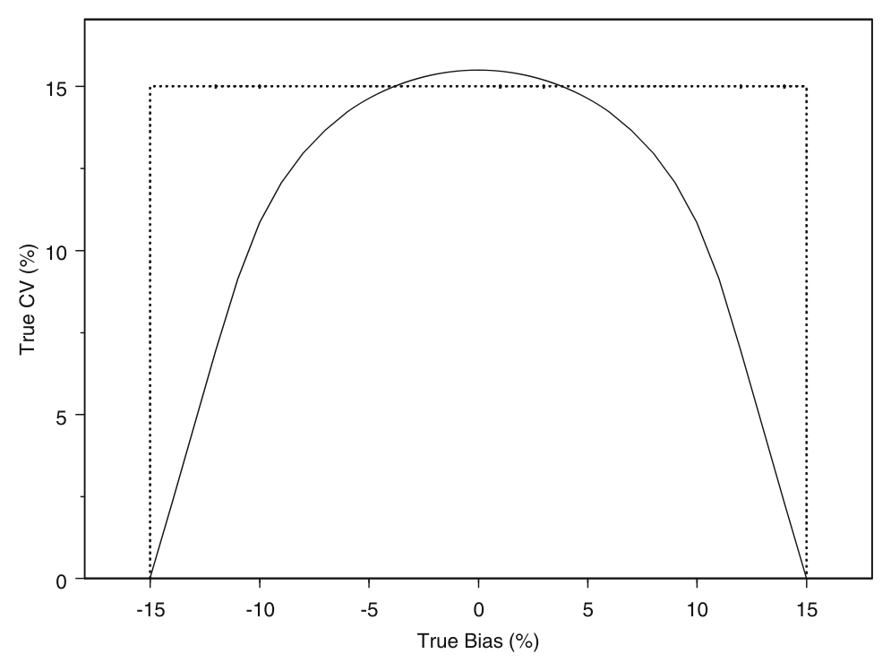
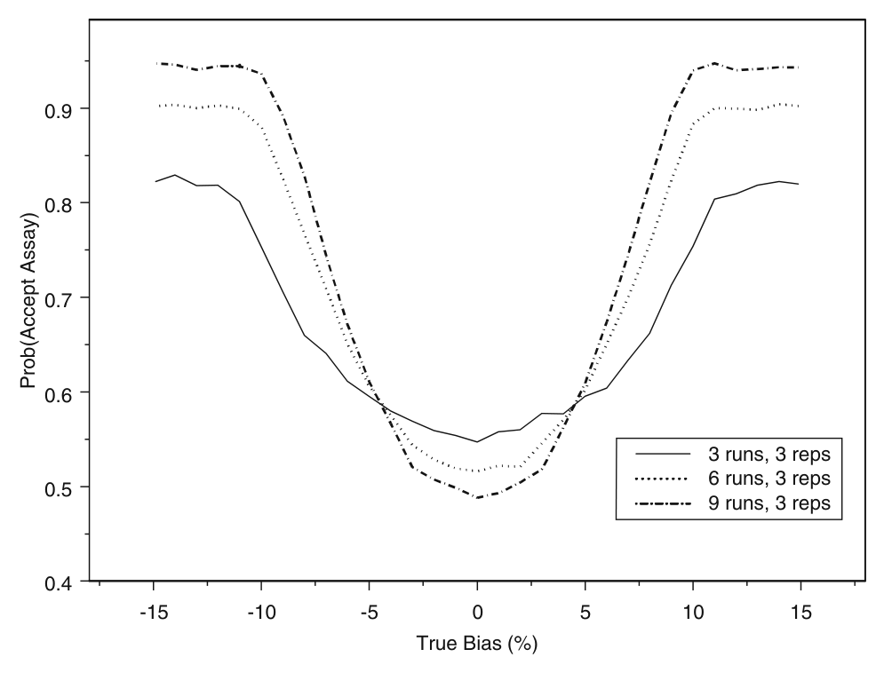
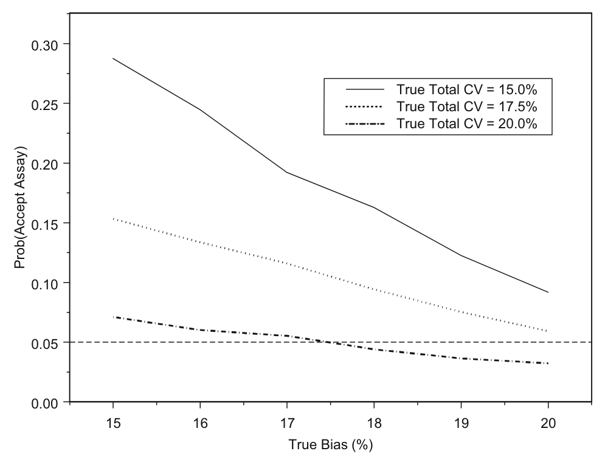
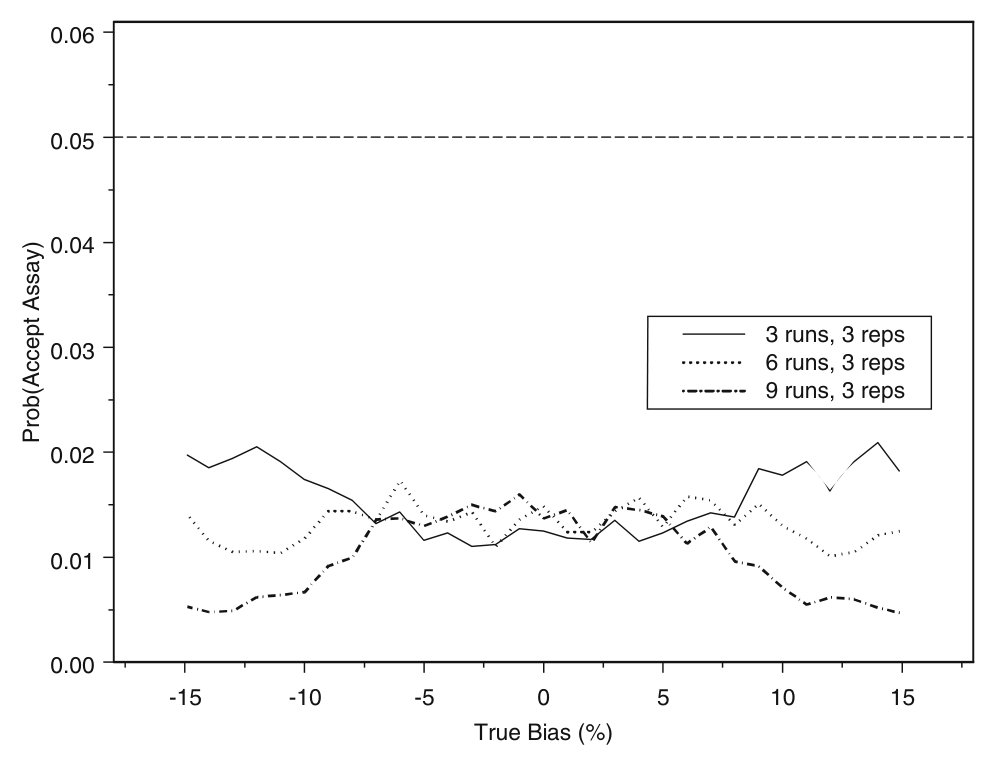
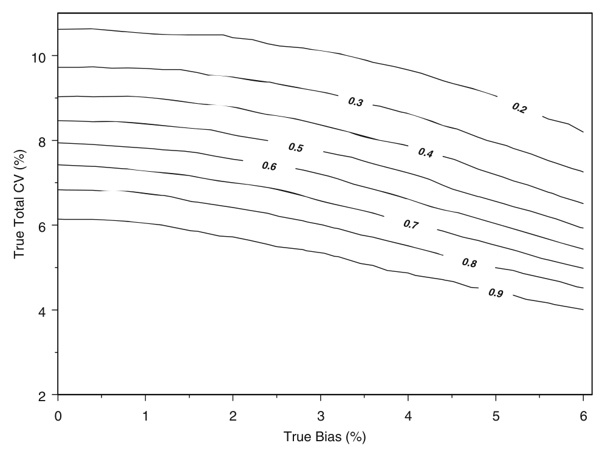
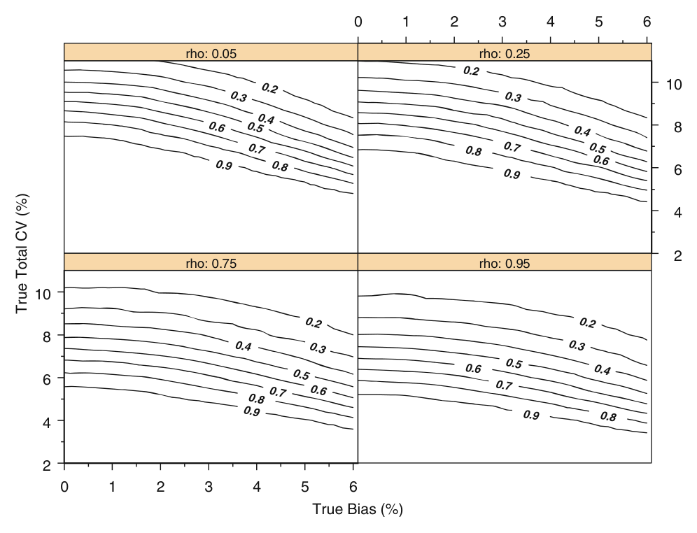
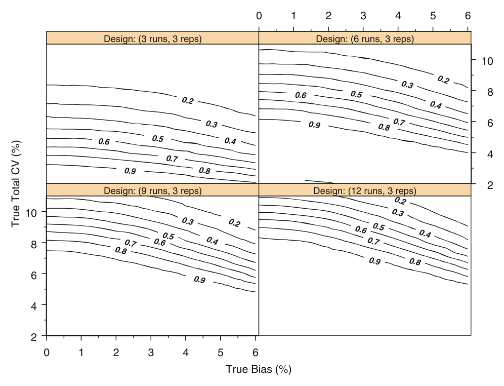

<!-- 方針: ほぼ全訳＋必要に応じた補足。原文（英語・Pharmaceutical Research 原著）の節構成に沿って訳出。図1〜図7は原本PDFのベクター図をPyMuPDFで領域レンダリングしReadで内容確認のうえ全訳キャプションで埋め込んだ。表I〜表VIIIは全行・全数値を転記。原本PDFのテキスト層は数式・記号が壊れて抽出されるため（β→b、σ→、χ²→2 など）、数式は前後の文脈と数値例から復元し、復元が確定できない箇所はその旨を明記した。「> 補足:」は訳者注。 -->

> **この論文について（重要）**
>
> このページの原本は **Hoffman D, Kringle R. "A Total Error Approach for the Validation of Quantitative Analytical Methods." *Pharmaceutical Research* 24(6):1157–1164 (2007)** です。
>
> 本サイトには別途「[Total Error（総合誤差）アプローチによるバイオアナリティカル法バリデーションの妥当性判定——学会抄録（Rozet ら, 2009）]」というページがありますが、そちらは **Rozet・Boulanger・Hubert ら（リエージュ大学ほか）による2009年の学会抄録**で、**著者も掲載媒体も異なる別の文献**です。両者はいずれも「総合誤差による分析法バリデーション」という同じ考え方を扱っており、内容的には密接な姉妹関係にありますが、一方が他方の抄録／完全版という関係ではありません。本ページは Hoffman & Kringle の原著論文の全訳です。

## 書誌情報

- 原題: A Total Error Approach for the Validation of Quantitative Analytical Methods
- 著者: **David Hoffman\*** ・**Robert Kringle**（sanofi-aventis 前臨床・研究生物統計部門〈Preclinical and Research Biostatistics〉, 米国ニュージャージー州 Bridgewater）
- 責任著者: David Hoffman（1041 Route 202-206, Mailstop M-203A, Bridgewater, NJ 08807-0800／david.hoffman2@sanofi-aventis.com）
- 掲載: *Pharmaceutical Research* Vol. **24**, No. 6, June 2007, pp. 1157–1164. DOI: 10.1007/s11095-007-9242-3
- 受理: 2006年11月3日受付／2007年1月9日受理／2007年3月21日オンライン公開
- 種別: 原著論文（Research Paper）
- キーワード: 分散分析（analysis of variance）／バイオアナリティカルアッセイ／分析法バリデーション／許容区間（tolerance interval）／総合誤差（total error）

> 補足: 著者2名はいずれも製薬企業（sanofi-aventis）の**生物統計部門**の所属である。つまり本稿は、統計学者が「現場で使われている合否基準は統計的におかしい」と指摘し、代案を出した論文である。共著者の **Robert Kringle** は、本文で引用されている **4-6-20 ルールの評価論文（文献13, Pharm Res 1994）** の著者でもあり、この問題を10年以上追いかけてきた人物である。
>
> 掲載誌 *Pharmaceutical Research* は AAPS（米国薬学会）の基幹誌で、バイオアナリシスの方法論議論の主戦場のひとつだった。

## 要旨（Abstract）

**目的（Purpose）**——分析法に対する典型的な合否判定基準は、**分析法の適合性（method suitability）という概念を考慮して選ばれておらず**、一般に**場当たり的（ad-hoc）な規則**に基づいている。そうしたアプローチは、**不適切な分析法を合格させ、適切な分析法を不合格にするリスクが未知かつ制御されていない**という帰結をもたらす。本稿は、**総合誤差（total error）の使用を組み込み、誤った意思決定のリスクを制御する**、分析法バリデーションのための形式的な統計的枠組みを提案する。

**材料と方法（Materials and Methods）**——**両側 β含有許容区間（two-sided β-content tolerance intervals）** の使用に基づく、分析法バリデーションのための総合誤差アプローチを提案する。提案アプローチの性能を、シミュレーション技術によって現行の場当たり的アプローチの性能と比較する。

**結果（Results）**——分析法バリデーションに対する現行の場当たり的アプローチは、**不適切な分析法を誤って合格させるリスクを制御することに失敗している**。提案する総合誤差アプローチは、不適切な分析法を誤って合格させるリスクを制御し、かつ**真に適切な分析法を合格させるための十分な検出力を提供する**。

**結論（Conclusion）**——分析法バリデーションに対する現行の場当たり的アプローチは、分析法の適合性の確保と整合していない。両側β含有許容区間の使用に基づく総合誤差アプローチを開発した。総合誤差アプローチは、分析法性能を評価するための形式的な統計的枠組みを提供する。本アプローチは分析法の適合性という概念と整合し、**不適切な分析法を誤って合格させるリスクを制御する**。

## 緒言（Introduction）

分析法は、医薬品開発プロセス全体、および原薬・製剤の製造を通じて利用される。分析結果は、例えば**バイオアベイラビリティ・生物学的同等性・有効期間（shelf life）・バッチ出荷判定**についての意思決定に用いられる。したがって、これら分析法のバリデーションは、医薬品の安全性と有効性を確保するために決定的に重要である。それゆえ分析法バリデーションは、しばらく前から科学的にも規制上も関心の的となってきた。

**分析法バリデーションの目標が、その分析法が意図された目的に対して「適合（suitable）」していることを実証することにある**というのは、広く受け入れられている [1, 2]。任意の分析法について、望ましい「適合性」を構成する**性能特性（performance characteristics）** が定義されなければならない。これら性能特性について適切に選ばれた合否判定基準が、意図された用途に対する分析法の適合性を確保するはずである。

**しかしながら、分析法の精度と真度に対する典型的な合否判定基準は、分析法の適合性という概念を考慮して選ばれておらず、一般に場当たり的な規則に基づいている。**

例えば、バイオアナリティカル法に対する現行の**事前（pre-study）バリデーション基準**は、**観測平均が公称値の ±15% 以内**であり、**観測精度が変動係数（%CV）で 15%以下**であることを要求する。そうした場当たり的アプローチは規制要件を満たしうる [1] が、**適切なバイオアナリティカル法を不合格にするリスク（生産者危険, producer risk）と、不適切なバイオアナリティカル法を合格させるリスク（消費者危険, consumer risk）が、未知かつ制御されていない**という帰結をもたらす。さらに、そうした合否判定基準は、**実運用中（in-study）の合否判定基準についての一般的な推奨と両立しない**。

そうした場当たり的な合否判定基準の不十分さは明確に認識されてきた [3]。**総合誤差（total error）** の使用を強調する代替的な合否判定基準が、分析法バリデーションの文献で議論され、あるいは提案されてきた [3–11]。**系統誤差と偶然誤差の両方を組み込む総合誤差の基準を用いることは、統計的にも科学的にも論理的なアプローチ**である。しかしながら、**総合誤差の使用を組み込み、かつ誤った意思決定のリスクを制御する、分析法バリデーションのための形式的な統計的枠組みは、まだ提案も評価もされていない。**

本稿は、**両側β含有許容区間の使用を通じた、アッセイバリデーションのための総合誤差基準を提案する**。提案アプローチの性能を、シミュレーション技術によって現行の場当たり的アプローチの性能と比較する。提案アプローチの使用を、実際のアッセイバリデーションデータへの適用によって実証する。焦点は一貫してバイオアナリティカル法に置くが、**提案アプローチは他の分析法（例: 高分子、原薬など）にも容易に適用可能かつ関連する**。

> 補足: この論文の主張を一言でいえば——**「真度と精度を別々に見るな。合わせて1つの指標で見ろ。しかも将来の測定値についての保証として見ろ」** である。
>
> 従来の「±15% かつ CV≤15%」という基準の何がまずいのか。直感的にはこうである。バイアスがちょうど15%、CVもちょうど15%の分析法を考える。この分析法で測ると、測定値は「真値の15%ずれた位置」を中心に、CV 15%でばらつく。すると**測定値のかなりの部分が真値の±15%の外に出てしまう**。それでも従来基準では「バイアス15%以内、CV 15%以内」なので**合格**になる。
>
> 真度と精度は独立に効くのではなく、**足し合わさって測定値の総合的なずれを作る**。だから合わせて評価すべきだ——これが「総合誤差」の考え方である。

## 材料と方法（Materials and Methods）

### 一元配置変量効果モデル

事前（pre-study）分析法バリデーションでは、**複数の独立したアッセイラン（assay run）にわたって測定が行われ、各ラン内で反復測定が行われる**。測定値を記述する統計モデルは次式で与えられる。

$$
Y_{ij} = \mu + b_i + e_{ij}
$$

ここで $Y_{ij}$ は第 $i$ ラン（$i = 1, 2, \ldots, I$）における第 $j$ 反復（$j = 1, 2, \ldots, J$）の観測値、$\mu$ はその分析法の真の（未知の）分析平均、$b_i$ は第 $i$ ランの偶然誤差、$e_{ij}$ は第 $i$ ランの第 $j$ 反復観測値の偶然誤差である。

偶然誤差 $b_i$ と $e_{ij}$ は、それぞれ平均0・分散 $\sigma^2_B$ および $\sigma^2_E$ の正規分布に独立に従うと仮定する。これらの分散 $\sigma^2_B$、$\sigma^2_E$ は、分析法の**ラン間（バッチ間, between-run／inter-batch）** および**ラン内（バッチ内, within-run／intra-batch）** のばらつきに対応する。分析法の**総分析ばらつき**は次式で与えられる。

$$
\sigma^2_{TOT} = \sigma^2_B + \sigma^2_E
$$

上記は一般に**一元配置変量効果モデル（one-way random effects model）** と呼ばれる [12]。便宜上、データは**バランスしている**（すなわち $I$ 個の各ランに $J$ 個の反復がある）と仮定する。

測定値の全体平均を $\bar{Y} = \sum_{i=1}^{I}\sum_{j=1}^{J} Y_{ij} \big/ IJ$、第 $i$ ランの平均を $\bar{Y}_i = \sum_{j=1}^{J} Y_{ij} \big/ J$ と表す。**表I**に、バランス型一元配置変量効果モデルの分散分析（ANOVA）表を示す（EMS は期待平均平方を表す）。

**表I　バランス型一元配置変量効果モデルの分散分析表**

| 変動要因 | 自由度 | 平方和 | 平均平方 | 期待平均平方（EMS） |
|---|---|---|---|---|
| ラン間（Between-run） | $df_B = I - 1$ | $SS_B = J\sum_{i=1}^{I}(\bar{Y}_i - \bar{Y})^2$ | $MS_B = SS_B / df_B$ | $J\sigma^2_B + \sigma^2_E$ |
| ラン内（Within-run） | $df_E = I(J-1)$ | $SS_E = \sum_{i=1}^{I}\sum_{j=1}^{J}(Y_{ij} - \bar{Y}_i)^2$ | $MS_E = SS_E / df_E$ | $\sigma^2_E$ |
| 合計（Total） | $df_T = IJ - 1$ | $SS_T = \sum_{i=1}^{I}\sum_{j=1}^{J}(Y_{ij} - \bar{Y})^2$ | — | — |

表Iの平均平方 $MS_B$ と $MS_E$ を用いて、分析法のラン内分散・ラン間分散・総分散の推定値が得られる。**表II**に、ANOVA平均平方から得られる分散の推定値を示す。

**表II　ラン内分散・ラン間分散・総分散の推定値**

| 分散成分 | 推定値 |
|---|---|
| ラン内（Within-run） | $\hat{\sigma}^2_E = MS_E$ |
| ラン間（Between-run） | $\hat{\sigma}^2_B = (MS_B - MS_E)/J$ |
| 合計（Total） | $\hat{\sigma}^2_{TOT} = \hat{\sigma}^2_B + \hat{\sigma}^2_E$ |

表Iおよび表IIの量の計算は、**現行の場当たり的な合否判定基準**（観測変動係数を正しく計算するため）と**提案する総合誤差アプローチ**の**両方を実装するために必要**である。

### 現行の合否判定基準

バイオアナリティカル法に対する現行の**事前（pre-study）合否判定基準**は、**観測平均が公称値の ±15% 以内**であり、**観測精度が変動係数（%CV）で 15%以下**であることを要求する。ただし**定量下限（LLOQ）では両限界とも 20%** である。すなわち、$\bar{Y}$ が既知の公称値の ±15% 以内でなければならず、$\hat{\sigma}_{TOT}$ が平均値に対して 15%以下でなければならない。

次に、**実運用中（in-study）モニタリング**の現行の合否判定基準を考える。**6つのQC試料のうち少なくとも4つが、それぞれの公称濃度の15%以内でなければならない** [1]。この基準を満たさない分析ランは棄却されなければならない。これが一般に **4-6-15 ルール**として知られるものである。

**日常運用における分析法のモニタリングに用いられる実運用中の合否判定基準は、意図された用途に対するその分析法の適合性要件を定義するものと解釈できる。** すなわち、**バイオアナリティカル法は、観測されるアッセイ値の（長期的に）少なくとも 66.7% が真値の 15%以内にあれば、意図された用途に適合していると推論するのが合理的である。** これはやや単純化しすぎではある——特定の小標本（すなわち6つのQC試料）の性質は偶然変動の対象であり、その分析法の真の長期的性質とは異なりうるからである。

**真の（長期的な）公称値±15%以内の観測値の割合がちょうど 0.667 であるような分析法**を考える。すると 4-6-15 ルールを適用した場合、**棄却率はおよそ 32%** になる（すなわち将来の分析ランの32%が棄却される）。この概算棄却率は6つの独立したQC試料という仮定に基づく（単純な二項確率計算で示せる）が、実際の棄却率は、総ばらつき $\sigma^2_{TOT}$ に占めるラン間ばらつき $\sigma^2_B$ の割合によってわずかに異なる。

4-6-15 ルールのような合否判定基準の欠陥はよく知られている [13]。しかし上記の我々の長期的解釈は、4-6-15 ルールの（適用はともかく）**元来の意図**とはおそらく一致している。

したがって、事前合否判定基準の適切な選択は、**将来のアッセイ値の少なくとも 66.7% が真値の 15%以内にあることを確保すべき**である。すなわち、**事前合否判定基準は、実運用中の基準（すなわち分析法の意図された用途）と整合していなければならない。**

**図1**は、事前基準と実運用中基準がそれぞれ定義する合格領域を示す（先に述べた一元配置変量効果モデルにより、観測されるアッセイ値が正規分布すると仮定する）。

実運用中の合否判定基準に基づけば、**真に適合するアッセイは、図1の実線の曲線の内側にある真の平均と変動係数をもつ**。これらは、観測値の（長期的に）少なくとも 66.7% が真値の 15%以内にあるアッセイである。**真に不適合なアッセイは、図1の実線の曲線の外側にある真の平均と変動係数をもつ**。これらは、観測値の（長期的に）66.7% 未満しか真値の 15%以内にないアッセイである。

現行の事前基準が定義する合格領域は、図1の破線で与えられる。この領域の内側にあるアッセイは、**真のアッセイバイアスと %CV がそれぞれ15%以内**であるようなものである。

**注目すべきは、事前合格領域が実運用中の合格領域に含まれていないことである。** したがって、**真に不適合なアッセイ（すなわち図1の実線の曲線の外側にあるもの）の一部が、事前基準に従えば適合とみなされうる。**

明らかに、**現行の事前基準は実運用中の基準と整合しておらず、分析法の適合性を確保しない**。さらに、現行の基準は**真の分析法のバイアスとばらつきではなく、観測された推定値**に基づいている。したがって現行の事前基準は**消費者危険を制御しない**。すなわち、現行の事前基準に基づく判断は、**真に不適合なアッセイを誤って合格させる**結果となる。これは結果の節で例証する。

> 補足: **図1を丁寧に読むのが、この論文を理解する最短経路**である。
>
> - **実線の曲線**（山型）: 「測定値の66.7%が真値±15%に入る」という条件を満たす（真のバイアス, 真のCV）の組み合わせの境界。バイアスが0なら CV は約15.4%まで許される。バイアスが大きくなるほど、許される CV は小さくなる（バイアスで既にずれている分、ばらつく余裕がない）。これが**本来の適合域**である。
> - **破線の長方形**: 「バイアス ≤15% かつ CV ≤15%」という現行の事前基準の合格域。
>
> 決定的なのは、**長方形の四隅が曲線からはみ出している**ことである。例えば「バイアス14%・CV 14%」は長方形の内側（＝現行基準では合格）だが、曲線の外側（＝本来は不適合）にある。つまり**現行基準には、構造的に「不適合なのに合格させる領域」が組み込まれている**。
>
> しかも現行基準が見るのは**観測された**バイアスとCVであって、真の値ではない。標本のばらつきで、真には不適合な分析法が「たまたま良い数字」を出せば、さらに通りやすくなる。二重の意味で消費者危険が制御されていない。

### 提案する総合誤差アプローチ

分析法バリデーションへの信頼区間および／または総合誤差の使用は、文献で議論あるいは提案されてきた [3–11]。**総合誤差の使用は、系統誤差と偶然誤差の両方を組み込む、統計的にも科学的にも健全なアプローチ**である。総合誤差アプローチは、**測定誤差がどれだけ大きくなりうるかを反映し、分析者にも容易に理解される**。さらにこれは、**分析法のバイアスとばらつきを個別に評価するのではなく、分析法性能の単一の包括的な尺度**である。

理想的な合否判定基準は、**将来の観測値の高い割合（仮に β%）が、高い信頼度（仮に γ%）で許容限界（仮に公称値の ±15%）内にあることを確保する**ものであろう。このように見れば、**両側β含有許容区間**は明らかな選択肢である。

**両側β含有許容区間**とは、**母集団の少なくとも割合 β が、γ% の信頼度で区間 (L, U) 内にある**ような統計的区間 (L, U) である [14]。両側β含有許容区間は、**指定された割合 β の測定アッセイ値が、指定された信頼係数 γ で区間 (L, U) 内にあると主張できる**ような下限 (L) と上限 (U) を提供する。

任意の分析法について、**割合 β と許容限界 (A, B) を適切に選ぶことで、その意図された用途に対する分析法の適合性を構成する性能特性を定義できる**。すなわち、**測定アッセイ値の少なくとも割合 β が指定された許容限界 (A, B) 内にあれば、その分析法は意図された用途に適合している**。両側β含有許容区間は、**これらの適合性要件を満たさない分析法を誤って合格させるリスクを制御する統計的枠組みを提供する**。

**提案する総合誤差アプローチは以下のとおりである。**

1. 望ましい信頼水準 γ（例えば 90%）で**両側β含有許容区間 (L, U) を構成する**
2. 区間 (L, U) を**許容限界 (A, B) と比較する**
3. **(L, U) が (A, B) に完全に収まっていれば、その分析法を合格とする。そうでなければ合格としない。**

両側β含有許容区間の使用を組み込んだ類似のアプローチは、**含量均一性（content uniformity）** の評価についても提案されている [15, 16]。

注目すべきは、この許容区間の適用が**統計的仮説検定の構造**をもつことである。帰無仮説（H₀）は「測定アッセイ値のうち許容限界 (A, B) 内に入る割合が β 未満である」、対立仮説（Hₐ）は「少なくとも割合 β が内に入る」である。**提案する総合誤差の手続きは、両側β含有許容区間が許容限界 (A, B) に完全に収まる場合に帰無仮説を棄却する（したがってその分析法を合格とする）** ものである。

> 補足: ここが本稿の思想的な核心である。従来の基準は「**観測された数値が基準内に収まったか**」を見る。提案法は「**将来の測定値がどうなるかを、標本から統計的に推論する**」。
>
> この違いは実務上とても大きい。**サンプル数が少なければ、許容区間は自動的に広くなる**（推定が不確かなので保守的になる）。従来基準では、サンプル数が少ないほうがむしろ「たまたま良い数字」が出やすく、通りやすかった。提案法では**データが少ないほど通りにくくなる**——統計的に正しい方向に働く。
>
> 仮説検定の構造をもつというのも重要で、これによって「第I種の過誤＝不適合な分析法を通す確率」を γ で制御できる。従来法にはこの制御機構がそもそも無かった。

### 許容区間の計算式

バランス型一元配置変量効果モデルに対する両側β含有許容区間の構成は単純明快であり、**先に表Iと表IIで述べた量に加え、標準正規分布とカイ二乗分布の分位点のみを必要とする**。

$Z_{(1+\beta)/2}$ を標準正規分布の上側 $(1+\beta)/2$ 分位点、$\chi^2_{1-\gamma, df}$ を自由度 $df$ のカイ二乗分布の下側 $\gamma$ 分位点とする。信頼係数 $\gamma$ をもつ両側β含有許容区間は次式で与えられる [17]。

$$
\bar{Y} \pm Z_{(1+\beta)/2}\sqrt{1 + N_e^{-1}}\sqrt{\hat{\sigma}^2_{TOT} + \left\{ H_1^2 (1/J)^2 MS_B^2 + H_2^2 \big((J-1)/J\big)^2 MS_E^2 \right\}^{1/2}}
\tag{1}
$$

ここで

$$
N_e = \frac{I\big(MS_B + (J-1)MS_E\big)}{MS_B}
$$

$$
H_1 = \frac{df_B}{\chi^2_{1-\gamma, df_B}} - 1, \qquad
$$

$$
H_2 = \frac{df_E}{\chi^2_{1-\gamma, df_E}} - 1
$$

不均衡（unbalanced）なデザインについては、式(1)にわずかな修正が推奨される（**付録**を参照）。

> 補足: 原本PDFのテキスト層は、数式の記号（β・σ・χ²・平方根の入れ子など）が壊れた形で抽出される。上の式(1)は、原文の構造と**後述の数値例における実際の代入計算**（例1: $\bar{Y}=0.9798$, $\hat{\sigma}^2_{TOT}=0.00186$, $N_e=10.308$, $Z_{0.8335}=0.96809$, $H_1=2.1050$, $H_2=0.9036$, $MS_B=0.003251$, $MS_E=0.001167$ → 結果 (0.914, 1.046)）と整合するよう復元したものである。平方根の入れ子の正確な組み方は原本の組版に依存するため、**厳密な式形は原著の該当箇所を参照されたい**。

### パラメータの選択

総合誤差アプローチの実装には、**含有水準（β）・信頼水準（γ）・許容限界 (A, B)** の適切な選択が必要である。バイオアナリティカルアッセイについては、**含有 66.7%・信頼 90%・許容限界 ±15%** が論理的な選択であると我々は提案する。

すなわち、総合誤差アプローチは、**両側 β = 66.7% 含有・γ = 90% 信頼の許容区間を構成する**ことからなる。**得られた許容限界が公称値の ±15% に完全に収まっていれば、そのアッセイを合格とする。そうでなければ合格としない。**

**±15% の許容限界と 66.7% 含有という選択は、先に議論した現行の実運用中合否判定基準の長期的解釈と整合する唯一の選択**である。しかし、含有水準・信頼水準・許容限界について他の選択も明らかに可能である。

先に述べた **4-6-15 ルールの欠陥**は、**66.7% より大きい含有水準を選ぶ動機**となりうる（すなわち、先に述べたとおり、真の含有水準が 66.7% の分析法であっても 4-6-15 ルールは約32%の分析ランを棄却する）。例えば、4-6-15 ルールは、真の含有水準が公称値±15%以内で **80% と 85%** の分析法について、それぞれ**約10%と約5%の分析ランを棄却する**（単純な二項確率計算で示せる）。

しかしそうした含有水準の選択は、**4-6-15 ルールの不十分な性能を緩和するためだけに選ばれる**ことになりかねない。より満足のいく代替案は、**実運用中モニタリングのために 4-6-15 ルールを置き換える、統計的に健全な手続きを実装すること**であろう。**シューハート（Shewhart）法**のような**統計的品質管理の手続き**が、そうした実運用中モニタリングの適切な代替となりうる [13]。

> 補足: 著者らのこの一節には誠実さがある。「含有水準を上げれば通りやすくなるが、それは 4-6-15 ルールが悪いのを取り繕っているだけだ。**本当は実運用中の基準のほうを直すべきだ**」と、自分の提案の適用範囲を限定して述べている。
>
> シューハート管理図は工程管理の標準的手法で、「6つ中4つ」のような固定ルールではなく、**過去のデータから推定した管理限界に基づいて外れを検出する**。統計的により合理的である。

## 結果（Results）

### 現行の合否判定基準の性能

再び、実運用中の合否判定基準が定義する合格領域（図1の実線の曲線）を考える。**適切な事前合否判定基準は、この実線の曲線上またはその外側にある真のバイアスと総%CV をもつアッセイを合格させるリスクを制御すべき**である。事前合否判定基準は、**そうしたアッセイを合格させる確率が小さいこと（例えば5%）を確保すべき**である。

現行の事前合否判定基準の性能をシミュレーション技術によって評価した。シミュレートされたアッセイ値は、先に述べた一元配置変量効果モデルに従い、偶然誤差は正規分布すると仮定した。シミュレーションでは、**実運用中の合格境界上またはその外側にある真のアッセイバイアスと総%CVの様々な組み合わせ**を検討した。いくつかのサンプリングデザイン（$I$ = 3, 6, 9 ラン、$J$ = 3 反復／ラン）も検討した。

総ばらつきに占めるラン間ばらつきの割合 $\rho$ は **0.50**（すなわちラン間とラン内のばらつきが等しい）と仮定した。真のバイアス・真の総%CV・サンプリングデザインの各組み合わせについて、**10,000のデータセットをシミュレート**し、現行の事前合否判定基準に合格する確率を推定した。すべてのシミュレーションは **SAS（バージョン 8.2）** ソフトウェアで実施した。

**図2**は、**実運用中の合格境界のちょうど上にある**真のバイアスと総%CVをもつアッセイ（すなわち真のバイアスと総%CVが図1の実線の曲線上にある）について、現行の事前合否判定基準に合格する確率を、様々なサンプリングデザインと $\rho$ = 0.50 の固定条件で示す。図2は真の総%CVを明示していないが、それは図1から暗黙に定まる。

**図2の結果は、現行の合否判定基準が、実運用中の合格境界上にあるアッセイを合格させる確率が高いことを示す。** この確率は、バイアスのないアッセイ（真の総%CVが約15%）について **50%をわずかに上回り**、バイアスが約±10%のアッセイ（真の総%CVが約11%）については **90%にも達する**。

**図3**は、**実運用中の合格境界の外側にある**真のバイアスと総%CVをもつアッセイ（すなわち図1の実線の曲線の外側）について、現行の事前合否判定基準に合格する確率を示す。

**図3の結果は、現行の合否判定基準が、実運用中の合格境界をはるかに超えたアッセイさえも、望ましくないほど高い確率で合格させる**ことを示す。例えば、**真のバイアスが ±20%、総%CV が 15% のアッセイについてさえ、現行の合否判定基準に合格する確率は 10%を超える**。

> 補足: 図2・図3が突きつける事実は厳しい。
>
> - **図2**: ちょうど適合／不適合の境界線上にある分析法——つまり「これ以上悪くなったらアウト」というギリギリの分析法——を、現行基準は**半分から9割の確率で合格させてしまう**。境界上なら理想的には合格率5%程度に抑えたい。
> - **図3**: バイアス20%（＝許容限界15%を明確に超えている）で CV 15% という、**誰が見ても不適格な分析法**でさえ、10%超の確率で通る。
>
> さらに図2で注目すべきは、**サンプル数を増やしても改善しない**点である。3ラン→9ランと増やしても曲線は下がらない。むしろバイアスが大きい領域では**ラン数が多いほど合格確率が上がる**（推定が安定して「観測CVが小さく出る」ため）。これは統計的な判定手続きとして根本的におかしい——**データを増やすほど間違った判定に自信をもつ**ことになる。

### 総合誤差アプローチの性能

提案する許容区間アプローチの性能も、シミュレーション技術によって評価した。シミュレートされたアッセイ値は、先に述べた一元配置変量効果モデルに従い、偶然誤差は正規分布すると仮定した。シミュレーションでは、**実運用中の合格領域上またはその内側にある**真のアッセイバイアスと総%CVの様々な組み合わせを検討した。

いくつかのサンプリングデザイン（$I$ = 3, 6, 9, 12 ラン、$J$ = 3 反復／ラン）と、総ばらつきに占めるラン間ばらつきの割合 $\rho$ のいくつかの値を検討した。真のバイアス・真の総%CV・サンプリングデザイン・$\rho$ の各組み合わせについて **10,000のデータセットをシミュレート**し、提案する許容区間基準に合格する確率を推定した。すべてのシミュレーションは SAS（バージョン 8.2）で実施した。

**図4**は、実運用中の合格境界のちょうど上にある真のバイアスと総%CVをもつアッセイについて、提案する許容区間基準に合格する確率を、様々なサンプリングデザインと $\rho$ = 0.50 の固定条件で示す。

**図4の結果は、許容区間基準が、実運用中の合格境界上にあるアッセイを合格させるリスクを制御していることを示す。** この確率は、**サンプリングデザインによらず、実運用中の合格境界の全域にわたって 5%未満**である。

シミュレーションでは $\rho$ の他の値も検討した（結果は示していない）。**検討したすべての $\rho$ の値（0.05〜0.95）について、許容区間基準に合格する確率は実運用中の合格境界の全域で5%未満**であった。

### 生産者危険（検出力）の評価

許容区間基準は明らかに消費者危険を制御している。次に、許容区間アプローチに伴う**生産者危険**——すなわち**真に適合するアッセイを誤って不合格にするリスク**——を評価することにも関心がある。

**図5**は、6ラン×3反復のサンプリングデザインと $\rho$ = 0.50 の固定条件で、真のアッセイバイアスと総%CVの関数として、提案する許容区間基準に合格する確率を示す。**図6**は、6ラン×3反復の固定デザインで様々な $\rho$ について同じものを示す。**図7**は、$\rho$ = 0.50 の固定条件で様々なサンプリングデザインについて同じものを示す。

**図5の結果**は、6ラン×3反復のサンプリングデザインで、**許容区間アプローチが、バイアスが小さく総%CVが約7%以下のアッセイを合格させる良好な検出力（80%以上）をもつ**ことを示す。真の総%CVが増加するにつれ、許容区間基準に合格する検出力は相応に低下する。

**図6と図7**は、適合するアッセイを合格させる許容区間アプローチの検出力が、主として **(1) アッセイの真の総%CV** と **(2) サンプリングデザイン**に依存することを示す。明らかに真のアッセイバイアスも、適合するアッセイを合格させる検出力に影響するが、**その影響は、真のバイアスがかなり大きい（>5%）場合を除いて比較的小さい**。

比 $\rho$ も検出力にいくらか影響するが、**一般には 0 または 1 に近い極端な値の場合のみ**である（すなわち $\rho$ が 0 に近い値は検出力を上げる傾向があり、1 に近い値は下げる傾向がある）。

**3ラン×3反復のような小さいサンプルサイズ**では、真のアッセイバイアスと総%CVが小さい（3%以下）場合を除いて、**適合するアッセイを合格させる検出力は比較的低い**。しかし**中程度のサンプルサイズ**では、適合するアッセイを合格させる検出力は妥当である。例えば、**6ラン×3反復のサンプリングデザインでは、小さいバイアス（2%以下）と総%CV ≤ 6% について少なくとも 90% の検出力**がある。

**段階的（tiered）あるいは多段階（multistage）サンプリングデザイン**も検討しうる。すなわち、**計算した許容区間が指定された許容限界に収まらない場合、追加の分析ランを実施してサンプルサイズを増やす**ことができる。許容区間アプローチの相対的な保守性（すなわち誤合格率が5%未満であること）のため、**サンプリングの段階を1つ追加しても、容認できないほど高い誤合格率にはならない**。ただし、多段階サンプリングデザインの全体的な誤合格率は、ここでは正式には検討していない。

> 補足: **図5〜図7は「この方法を使うなら、どれくらいのデータを取ればよいか」を決めるための設計図**である。実務での使い方はこうなる。
>
> 1. 自分の分析法の真の総CVがおよそ何%かを見積もる（予備データから）
> 2. 図7で、そのCVの高さの水平線を引く
> 3. 各デザイン（3/6/9/12ラン）のパネルで、合格確率0.8以上の等高線がその高さに届いているかを見る
> 4. 届いていなければラン数を増やす
>
> 目安として本文が挙げるのは——**総CV 7%以下なら6ラン×3反復で検出力80%以上**、**総CV 6%以下・バイアス2%以下なら6ラン×3反復で90%以上**。逆に言えば、総CVが10%を超える分析法は、6ランでは通らない可能性が高い。
>
> $\rho$（ラン間ばらつきの寄与率）が0に近いほど有利、というのも実務的に意味がある。$\rho$ が大きい＝ラン（日・アナリスト・カラム）ごとのブレが支配的、という状況では、反復数を増やしても効かず**ラン数を増やすしかない**からである。

## 実データへの適用例（Examples）

提案する総合誤差アプローチを、**sanofi-aventis で実施された2つの実際の事前バリデーション実験のデータ**への適用によって例示する。データは**ヒト血漿中の分析対象物の算出濃度（ng/mL）** であり、表IIIおよび表Vに示す。両例とも、サンプリングデザインは **6つの独立したラン × 各ラン3反復**である。

提案する総合誤差アプローチは、**含有 β = 0.667、信頼係数 γ = 0.90 の両側β含有許容区間**の計算を伴う。**許容区間全体が公称値の ±15% 以内にあれば、その分析法は適合と判定される。**

### 例1

データを**表III**に示す。**公称濃度は 1 ng/mL** である。したがって、**両側β含有許容区間全体が (0.85, 1.15) ng/mL 以内にあれば、その分析法は適合と判定される**。

**表III　例1の算出濃度（ng/mL）**

| 反復 ＼ ラン | 1 | 2 | 3 | 4 | 5 | 6 |
|---|---|---|---|---|---|---|
| 1 | 0.969 | 0.952 | 0.989 | 1.000 | 0.959 | 1.020 |
| 2 | 0.976 | 0.993 | 0.883 | 0.969 | 0.989 | 1.090 |
| 3 | 0.938 | 0.956 | 0.981 | 0.954 | 0.998 | 1.020 |

区間を計算するため、表Iに示したとおりの分散分析表を構成する。$I$ = 6 ラン、$J$ = 3 反復／ラン、全体平均濃度 $\bar{Y}$ = **0.9798 ng/mL** である。**表IV**に分散分析を示す。

**表IV　例1の分散分析表**

| 変動要因 | 自由度 | 平方和 | 平均平方 |
|---|---|---|---|
| ラン間（Between-run） | $df_B$ = 5 | $SS_B$ = 0.016254 | $MS_B$ = 0.003251 |
| ラン内（Within-run） | $df_E$ = 12 | $SS_E$ = 0.014009 | $MS_E$ = 0.001167 |
| 合計（Total） | $df_T$ = 17 | $SS_T$ = 0.030263 | — |

表IVの平均平方から、$\hat{\sigma}^2_{TOT}$ = **0.00186**、$N_e$ = **10.308** が得られる。

適切な標準正規分位点とカイ二乗分位点は、数表または統計ソフトウェアから容易に得られ、以下のとおりである。

- $Z_{0.8335}$ = **0.96809**
- $\chi^2_{0.10, 5}$ = **1.61031**
- $\chi^2_{0.10, 12}$ = **6.30380**

表IVの自由度と上記のカイ二乗分位点から、$H_1$ = **2.1050**、$H_2$ = **0.9036** が得られる。両側β含有許容区間は式(1)を用いて次のように計算できる。

$$
0.9798 \pm 0.96809\sqrt{1 + 10.308^{-1}}\sqrt{0.00186 + \left\{ 2.1050^2(1/3)^2 \cdot 0.003251^2 + 0.9036^2(2/3)^2 \cdot 0.001167^2 \right\}^{1/2}}
$$

得られる**両側β含有許容区間は (0.914, 1.046) ng/mL** である。同等に、この区間は**公称濃度に対して (−8.6%, +4.6%)** である。したがって、**この公称濃度において、アッセイ性能は適合と判定される**。

なお、**観測されたバイアスと総%CV の推定値は、それぞれ −2.02% と 4.40%** である。観測バイアスは公称値の ±15% 以内であり、%CV も 15% 以下であるから、**このアッセイは現行の合否判定基準にも合格する**。

### 例2

データを**表V**に示す。**公称濃度は 0.1 ng/mL** である。したがって、**両側β含有許容区間全体が (0.085, 0.115) ng/mL 以内にあれば、その分析法は適合と判定される**。

**表V　例2の算出濃度（ng/mL）**

| 反復 ＼ ラン | 1 | 2 | 3 | 4 | 5 | 6 |
|---|---|---|---|---|---|---|
| 1 | 0.1260 | 0.0969 | 0.0888 | 0.0991 | 0.1070 | 0.1150 |
| 2 | 0.1220 | 0.0963 | 0.0958 | 0.0921 | 0.0961 | 0.0989 |
| 3 | 0.1330 | 0.0931 | 0.0945 | 0.0982 | 0.1080 | 0.0961 |

この例では、$I$ = 6 ラン、$J$ = 3 反復／ラン、全体平均濃度 $\bar{Y}$ = **0.10316 ng/mL** である。**表VI**に分散分析を示す。

**表VI　例2の分散分析表**

| 変動要因 | 自由度 | 平方和 | 平均平方 |
|---|---|---|---|
| ラン間（Between-run） | $df_B$ = 5 | $SS_B$ = 0.002327 | $MS_B$ = 0.000465 |
| ラン内（Within-run） | $df_E$ = 12 | $SS_E$ = 0.000422 | $MS_E$ = 0.000035 |
| 合計（Total） | $df_T$ = 17 | $SS_T$ = 0.002749 | — |

表VIの平均平方から、$\hat{\sigma}^2_{TOT}$ = **0.000179**、$N_e$ = **6.907** が得られる。適切な標準正規分位点とカイ二乗分位点は上記の例と同様に得られる。両側β含有許容区間は式(1)を用いて次のように計算できる。

$$
0.10316 \pm 0.96809\sqrt{1 + 6.907^{-1}}\sqrt{0.000179 + \left\{ 2.1050^2(1/3)^2 \cdot 0.000465^2 + 0.9036^2(2/3)^2 \cdot 0.000035^2 \right\}^{1/2}}
$$

得られる**両側β含有許容区間は (0.0799, 0.1265) ng/mL** である。同等に、この区間は**公称濃度に対して (−20.1%, +26.5%)** である。したがって、**このアッセイは、この公称濃度において適合な性能を示すことに失敗した**。

なお、**観測されたバイアスと総%CV の推定値は、それぞれ 3.16% と 12.95%** である。したがって、**このアッセイは現行の合否判定基準には合格するが、提案する総合誤差基準には不合格となる。**

> 補足: **例2こそが、この論文が示したかったことの実演**である。
>
> | 判定 | 現行基準 | 提案法 |
> |---|---|---|
> | 見る数値 | 観測バイアス 3.16%（<15% ○）／観測総CV 12.95%（<15% ○） | 許容区間 (−20.1%, +26.5%) |
> | 判定 | **合格** | **不合格** |
>
> 観測された数字だけ見ると、バイアス3%・CV13%で、どちらも15%の枠に余裕をもって収まっている。しかし**「将来の測定値の66.7%が入る範囲」を90%の信頼度で推定すると −20%〜+26%** まで広がる。つまりこの分析法を実運用に投入すれば、**測定値の1/3以上が±15%の外に出る**。4-6-15 ルールで頻繁にランが棄却されることになる。
>
> なぜこれほど広がるのか。バイアス3.16%とCV 12.95%が**足し合わさる**うえに、6ラン×3反復という限られたデータから推定しているための**不確かさの上乗せ**が効く。まさに「総合誤差」の考え方が働いている。
>
> 一方の例1は、バイアス −2.02%・総CV 4.40% と余裕があり、許容区間も (−8.6%, +4.6%) と ±15% の内側に収まる。**両方の基準で合格**する。つまり提案法は、良い分析法を無用に落としているわけではない。

## 結論（Conclusion）

分析法バリデーションのための**現行の事前合否判定基準は場当たり的な規則に基づいており、適合な分析法性能の確保と整合していない**。現行の基準は、**真に不適合なアッセイを誤って合格させる高いリスク**をもたらす。

**両側β含有許容区間の使用を組み込んだ総合誤差アプローチを提案した。** 本アプローチは、分析法性能を評価するための**形式的な統計的枠組み**を提供する。**区間の計算は単純明快であり、単純な分散分析からの量のみを必要とする。**

提案アプローチは**分析法の適合性という概念と整合し、真に不適合なアッセイを誤って合格させるリスクを制御する**。本アプローチは、**中程度のサンプルサイズで、真に適合するアッセイを合格させる良好な検出力をもつ**。

## 付録（Appendix）——不均衡デザインへの対応

**不均衡（unbalanced）なサンプリングデザイン**（すなわち反復数が各ランで同一でない場合）については、式(1)で与えた許容区間にわずかな修正が必要である。不均衡デザインでは、（表Iで与えた）通常の分散分析平方和が**非加重平方和（unweighted sums of squares）** に置き換えられる。

$J_i$ を第 $i$ アッセイランの反復数（$i = 1, 2, \ldots, I$）とする。第 $i$ ランの平均を $\bar{Y}_i = \sum_{j=1}^{J_i} Y_{ij} \big/ J_i$、測定値の全体平均を $\bar{Y} = \sum_{i=1}^{I}\bar{Y}_i \big/ I$、反復の**調和平均**を $J_H = I \big/ \sum_{i=1}^{I}(1/J_i)$ と表す。**表VII**に、不均衡型一元配置変量効果モデルの非加重平方和を示す。

**表VII　不均衡型一元配置変量効果モデルの非加重平方和**

| 変動要因 | 自由度 | 平方和 | 平均平方 | 期待平均平方（EMS） |
|---|---|---|---|---|
| ラン間 | $df_B = I - 1$ | $SS_{BU} = J_H\sum_{i=1}^{I}(\bar{Y}_i - \bar{Y})^2$ | $MS_{BU} = SS_{BU}/df_B$ | $J_H\sigma^2_B + \sigma^2_E$ |
| ラン内 | $df_E = \sum_{i=1}^{I}J_i - I$ | $SS_E = \sum_{i=1}^{I}\sum_{j=1}^{J_i}(Y_{ij} - \bar{Y}_i)^2$ | $MS_E = SS_E/df_E$ | $\sigma^2_E$ |
| 合計 | $df_T = \sum_{i=1}^{I}J_i - 1$ | $SS_T = \sum_{i=1}^{I}\sum_{j=1}^{J_i}(Y_{ij} - \bar{Y})^2$ | — | — |

ラン内分散・ラン間分散・総分散の推定値は、$MS_B$ と $J$ をそれぞれ $MS_{BU}$ と $J_H$ に置き換えて、表IIと同様に得られる。

不均衡デザインについて、信頼係数 $\gamma$ をもつ両側β含有許容区間は次式で与えられる [17]。

$$
\bar{Y} \pm Z_{(1+\beta)/2}\sqrt{1 + N_e^{-1}}\sqrt{\hat{\sigma}^2_{TOT} + \left\{ H_1^2 (1/J_H)^2 MS_{BU}^2 + H_2^2 \big((J_H-1)/J_H\big)^2 MS_E^2 \right\}^{1/2}}
\tag{2}
$$

ここですべての量は式(1)と同様であり、$MS_B$ と $J$ をそれぞれ $MS_{BU}$ と $J_H$ に置き換える。

### 不均衡データの計算例

例示として、先の表IIIの例を考える。**ラン1の最初の2反復（すなわち値 0.969 と 0.976）が欠測**していると仮定すると、不均衡デザインになる。これにより全体平均濃度は $\bar{Y}$ = **0.9759**、反復の調和平均は $J_H$ = **2.25** となる。**表VIII**に、不均衡例データの非加重平方和を示す。

**表VIII　不均衡化した例1データ（ラン1の反復1・2が欠測）の非加重平方和**

| 変動要因 | 自由度 | 平方和 | 平均平方 |
|---|---|---|---|
| ラン間 | $df_B$ = 5 | $SS_B$ = 0.015126 | $MS_B$ = 0.003025 |
| ラン内 | $df_E$ = 10 | $SS_E$ = 0.013191 | $MS_E$ = 0.001319 |
| 合計 | $df_T$ = 15 | $SS_T$ = 0.030119 | — |

表VIIIの非加重平均平方から、$\hat{\sigma}^2_{TOT}$ = **0.00208**、$N_e$ = **9.270** が得られる。適切な標準正規分位点とカイ二乗分位点は、数表または統計ソフトウェアから容易に得られ、以下のとおりである。

- $Z_{0.8335}$ = **0.96809**
- $\chi^2_{0.10, 5}$ = **1.61031**
- $\chi^2_{0.10, 10}$ = **4.86518**

表VIIIの自由度と上記のカイ二乗分位点から、$H_1$ = **2.1050**、$H_2$ = **1.0554** が得られる。両側β含有許容区間は式(2)を用いて次のように計算できる。

$$
0.9759 \pm 0.96809\sqrt{1 + 9.270^{-1}}\sqrt{0.00208 + \left\{ 2.1050^2(1/2.25)^2 \cdot 0.003025^2 + 1.0554^2(1.25/2.25)^2 \cdot 0.001319^2 \right\}^{1/2}}
$$

得られる**両側β含有許容区間は (0.904, 1.048) ng/mL**、すなわち**公称濃度に対して (−9.6%, +4.8%)** である。**この公称濃度において、アッセイ性能は適合と判定される。**

> 補足: 不均衡データへの対応は、実務では避けて通れない。分析ランのうち1つで試料が飛んだ、クロマトグラムがおかしくて除外した——といったことは日常的に起きる。
>
> ポイントは**調和平均 $J_H$** を使う点である。反復数が (1, 3, 3, 3, 3, 3) なら、調和平均は $6/(1/1 + 5/3)$ = 2.25 となる。単純平均（2.67）ではなく調和平均を使うのは、**分散の推定において「反復が少ないランの影響を適切に重く見積もる」** ためである。
>
> 結果を見ると、欠測前の (−8.6%, +4.6%) が欠測後には (−9.6%, +4.8%) とわずかに広がっている。データが減った分だけ保守的になる——**統計的に正しい振る舞い**である。

## 訳者による総括

本稿の貢献は、**「なんとなくおかしい」と言われ続けてきた分析法バリデーションの合否基準を、明快な幾何学と数値で断罪し、そのまま使える代案を出した**ことにある。

最も効いているのは**図1**である。「実運用中の基準（4-6-15ルール）を長期的に読み替えると、適合域は山型の曲線になる。ところが事前基準の合格域は長方形で、四隅がその曲線からはみ出している」——この一枚で、現行基準に**構造的な穴**があることが誰にでも分かる。

そして図2・図3のシミュレーションが、その穴の大きさを定量する。境界上の分析法を50〜90%通す。バイアス20%の明白な不適格品でさえ10%超で通す。**しかもデータを増やしても改善しない。** 統計的判定手続きとして、これは擁護しがたい。

代案の許容区間法は、思想がはっきりしている。**「観測された数値が枠に入ったか」ではなく「将来の測定値のβ%が枠に入ると、γ%の信頼度で言えるか」を問う。** 前者は過去の記述、後者は将来の予測である。品質保証で本当に知りたいのは後者だ、というのは言われてみれば当たり前のことで、それを実装可能な形（分散分析表＋正規・カイ二乗分位点だけ）に落とした点が実務的な価値である。

例2の実データが説得的である。観測バイアス3.16%・観測CV 12.95%——数字だけ見れば余裕で合格に見える。ところが許容区間は (−20.1%, +26.5%)。**この分析法を通せば、運用開始後に4-6-15ルールで頻繁に弾かれる。** 事前バリデーションの目的が「運用に耐える分析法を選ぶこと」であるなら、この分析法は落とすべきだった。現行基準はそれを見抜けない。

限界も率直に書かれている。3ラン×3反復では検出力が不足すること。多段階サンプリングの全体的な誤合格率は未検討であること。そして何より、**「4-6-15ルール自体を統計的に健全な手続き（シューハート法など）に置き換えるほうが本筋だ」** と、自分の提案が対症療法である面を認めている点は誠実である。

なお本サイトには、同じ「総合誤差」の枠組みを **β期待許容区間（β-expectation tolerance interval）＋正確性プロファイル（accuracy profile）** として展開した Rozet・Hubert・Boulanger らの系統の解説も収録している。本稿の**β含有（β-content）** 許容区間と、彼らの**β期待**許容区間は厳密には別の統計量である（前者は「割合βを信頼度γで保証」、後者は「期待値としてβ%が入る」）。Hoffman & Kringle はより保守的な保証を与える一方、Rozet らのほうが計算が簡便で、正確性プロファイルとして視覚化しやすい。実務ではどちらを採るかで結論が変わりうるので、両者を並べて読む価値がある。

## 参考文献

原文 References（17件）

1. Guidance for industry: bioanalytical method validation. Food and Drug Administration. May 2001.
2. Guidance for industry: analytical procedures and methods validation (Draft Guidance). Food and Drug Administration. August 2000.
3. Kringle RO, Khan-Malek RC. A statistical assessment of the recommendations from a conference on analytical methods validation in bioavailability, bioequivalence, and pharmacokinetic studies. *Proceedings of the Biopharmaceutical Section of the American Statistical Association*, Alexandria, VA, 510–514 (1994).
4. Findlay JWA, Smith WC, Lee JW, et al. Validation of immunoassays for bioanalysis: a pharmaceutical industry perspective. *J Pharm Biomed Anal* **21**:1249–1273 (2000).
5. Miller K, Bowsher R, Celniker A, et al. Workshop on bioanalytical methods validation for macromolecules: summary report. *Pharm Res* **18**:1373–1383 (2001).
6. DeSilva B, Smith W, Weiner R, et al. Recommendations for the bioanalytical method validation of ligand-binding assays to support pharmacokinetic assessments of macromolecules. *Pharm Res* **20**:1885–1900 (2003).
7. Boulanger B, Chiap P, Dewe W, et al. An analysis of the SFSTP guide on validation of chromatographic bioanalytical methods: progresses and limitations. *J Pharm Biomed Anal* **32**:753–765 (2003).
8. Hubert P, Nguyen-Huu JJ, Boulanger B, et al. Validation of quantitative analytical procedures, harmonization of approaches. *STP Pharma Pratiques* **13**:101–138 (2003).
9. Hubert P, Nguyen-Huu JJ, Boulanger B, et al. Harmonization of strategies for the validation of quantitative analytical procedures: a SFSTP proposal—part 1. *J Pharm Biomed Anal* **36**:579–586 (2004).
10. Smolec J, DeSilva B, Smith W, et al. Bioanalytical method validation for macromolecules in support of pharmacokinetic studies. *Pharm Res* **22**:1425–1431 (2005).
11. Hubert P, Nguyen-Huu JJ, Boulanger B, et al. Quantitative analytical procedures: harmonization of the approaches part II—statistics. *STP Pharma Pratiques* **16**:28–58 (2006).
12. Burdick R, Graybill F. *Confidence Intervals on Variance Components*, Marcel Dekker, New York, 1992.
13. Kringle R. An assessment of the 4-6-20 rule for acceptance of analytical runs in bioavailability, bioequivalence, and pharmacokinetic studies. *Pharm Res* **11**:556–560 (1994).
14. Wald A, Wolfowitz J. Tolerance limits for a normal distribution. *Ann Math Stat* **17**:208–215 (1946).
15. Hauck W, Shaikh R. Sample sizes for batch acceptance from single- and multistage designs using two-sided normal tolerance intervals with specified content. *J Biopharm Stat* **11**:335–346 (2001).
16. Hauck W, Shaikh R. Modified two-sided normal tolerance intervals for batch acceptance of dose uniformity. *Pharm Statist* **3**:89–97 (2004).
17. Hoffman D, Kringle R. Two-sided tolerance intervals for balanced and unbalanced random effects models. *J Biopharm Stat* **15**:283–293 (2005).
