<!--
Ma C, Oketch-Rabah H, Kim NC, Monagas M, Bzhelyansky A, Sarma N, Giancaspro G.
Quality specifications for articles of botanical origin from the United States Pharmacopeia.
Phytomedicine 45 (2018) 105-119. doi:10.1016/j.phymed.2018.04.014 の全訳密度日本語版。
-->

> **補足（本サイトでの位置づけ）:** 本論文は個別の分析メソッド研究ではなく、**米国薬局方（USP）が生薬・生薬系サプリメント・伝統生薬の品質をどのような枠組みで規格化しているか** を、実際のモノグラフの構造と多数の実例で解説した総説である。当サイトが扱う漢方・生薬 QC 論文の多くは「指紋分析」「多成分定量」「Q-marker」「メソッド開発（QbD）」といった **個別技術** を扱うが、本論文はそれらの技術が最終的に **どこに着地するのか——公定書（薬局方）の品質規格** という制度的到達点を俯瞰できる。とくに、桂皮・金銀花・紅景天・何首烏・当帰という **日本漢方・中医でも中心的な生薬** が実例に使われており、①同定は「直交する（互いに独立な原理の）2試験以上」を課す、②HPLC と HPTLC を相補的に使い近縁種のすり替え（金銀花に対する他 Lonicera 種、何首烏に対する Polygonum 近縁種など）を判別する、③定量は生物活性マーカー優先で単一標準品＋換算係数を用いる、といった原則は、当サイトの指紋分析・Q-marker 論文が「なぜその設計になっているか」を理解する制度的背景として有用である。謝辞に上海薬物研究所・中国薬科大学・瀋陽薬科大学が挙がっており、USP の生薬規格が中国の TCM 現代化研究と密接に連携して作られていることも読み取れる。

---

# 書誌情報

- **原題:** Quality specifications for articles of botanical origin from the United States Pharmacopeia
- **和題（本稿）:** 米国薬局方（USP）による生薬（植物由来品）の品質規格：モノグラフ7セクションの技術要件と実例
- **著者:** Cuiying Ma, Hellen Oketch-Rabah, Nam-Cheol Kim, Maria Monagas, Anton Bzhelyansky, Nandakumara Sarma, Gabriel Giancaspro（責任著者）
- **所属:** 米国薬局方協会（U.S. Pharmacopeial Convention）科学部門 栄養補助食品・生薬医薬品部（Rockville, MD, 米国）
- **責任著者:** C. Ma（CM@usp.org）, G. Giancaspro（gig@usp.org）
- **掲載誌:** Phytomedicine 45 (2018) 105–119
- **DOI:** 10.1016/j.phymed.2018.04.014
- **受理経緯:** 2017年9月28日受付 / 2018年4月4日改訂受付 / 2018年4月8日受理
- **© 2018 Elsevier GmbH 発行**
- **キーワード:** 米国薬局方（USP）／生薬系栄養補助食品／生薬（herbal medicines）／HPLC 同定／HPTLC 同定／生薬の規格
- **雑誌インパクトファクター:** 8.81（Phytomedicine・JCR2024・Q1。出典により7.9とも記載。要確認）

> **用語注:** 本稿で「生薬（botanical）」は植物材料・藻類・肉眼的真菌（キノコ）およびそれらの分泌物を含む（原著脚注1）。高度に精製・化学修飾された植物由来物質は含まない。略号：DI＝dietary ingredients（食事成分）、DS＝dietary supplements（栄養補助食品）、GC＝general chapters（一般試験法）、HM＝herbal medicines（生薬）、HMC＝Herbal Medicines Compendium（生薬集）、HPLC＝高速液体クロマトグラフィー、HPTLC＝高速薄層クロマトグラフィー、NF＝National Formulary（国民医薬品集）、OCN＝other common name、RS＝reference standard（標準品）、SCN＝standard common name、TCM＝伝統中国医学、USP＝米国薬局方。

---

# 要旨（Abstract）

**背景:** 生薬系栄養補助食品・生薬医薬品（botanical drugs）・生薬（herbal medicines）の適切な品質を定義するため、米国薬局方（USP）と生薬集（Herbal Medicines Compendium, HMC）は、各品目について同一性（identity）・純度（purity）・含量（content）の観点から完全な品質特性評価を提供する、相互に関連づけられた複数の試験を含む科学ベースの品質規格を収載している。

**目的:** 上記の公定書における生薬品目の薬局方試験と要件を包括的に記述すること。HPLC や HPTLC といった選択的クロマトグラフィー手順は、種のすり替え（species substitution）や他の混同要因を検出するために、薬局方モノグラフの **同定（Identification）試験** として用いられる。HPLC の定量試験は通常、主要成分——生物活性成分または分析マーカー化合物とみなされる植物二次代謝産物の総量または個別量——の含量を決定するために用いられる。**純度規格（Purity specifications）** は通常、有毒元素・農薬・真菌毒素などの汚染物質の含量を制限するために設定される。追加の要件は、命名・定義・標準物質の使用・包装/保存条件の重要性を強調する。

**方法:** 各モノグラフセクションの技術要件を具体例で説明した。試験は薬局方標準品を用いて真正試料で実施した。クロマトグラフィー分析手順は、同一性や品質マーカーの含量の正確な決定のための特徴的プロファイルを提供するようバリデートした。

**結果:** 各モノグラフに含まれる複数の試験は相互に補完し合い、生薬医薬品・栄養補助食品として用いられる生薬に適切な薬局方品質特性評価を提供する。モノグラフは、同一性、生物活性成分または品質マーカーの含量、汚染物質・偽和物・潜在的有毒物質の限度について詳細な規格を提供する。表示（labeling）や包装（packaging）などの追加要件も、これら製品の品質保持にさらに寄与する。

**結論:** ヘルスケア目的で用いられる生薬品目の信頼性を保証するには、薬局方規格への適合が要求されるべきである。

---

# 序論（Introduction）

品質管理のための生薬品目の標準化は、既知・未知を含む多数の成分を含む品目の複雑さのため、大きな課題を提示する。近縁の生薬種の区別は困難でありうる。

**米国薬局方協会（USP, http://www.usp.org）** は、医薬品・栄養補助食品（DS）として用いられる生薬品目とその構成物について、公的品質規格を策定する。これらの規格は、いくつかの試験・その分析手順・その許容基準の集成であり、総称して **モノグラフ（monographs）** と呼ばれる。モノグラフは、同一性・純度・含量の観点から品目の品質を確認するのに有用である。商業品目のモノグラフは、以下の USP 公定書に収載される：

1. **食品成分品目** → Food Chemicals Codex（食品化学物質規格書）
2. **医薬品品目・原薬・食事成分（DI）・DS** → 米国薬局方（USP）、賦形剤 → 国民医薬品集（NF）
3. **各国当局が承認したが FDA が承認していない生薬（HM）** → 生薬集（Herbal Medicines Compendium, HMC）

---

# 方法と材料（Methods and materials）

## 方法

本レビュー論文で示す実例は、USP モノグラフ（USP, 2017d, 2017e, 2017j, 2017r, 2017s; USP HMC, 2017）に収載された方法に基づく。

## 標準物質（Reference materials）

本レビューの実例で用いた USP 標準品（RS）。単離化合物の純度・力価データは USP Reference Standard Candidate Evaluation Package（RSCEP）による：

- USP ケイヒ酸（Cinnamic Acid）RS（Cat No 1133933, 100%）
- USP Cinnamomum cassia 小枝粉末 RS（Cat No 1133900, 混合物）
- USP クロロゲン酸（Chlorogenic Acid）RS（Cat No 1115545, 97.3%）
- USP Lonicera japonica 花 乾燥エキス RS（Cat No 1369689, 混合物）
- USP セコキシロガニン（Secoxyloganin）RS（Cat No 1611117, 97%）
- USP ルチン（Rutin）RS（1606503, 91.3%）
- USP ルテオリン 7-O-グルコシド RS（Cat No 1370837, 97%）
- USP ロサビン（Rosavin）RS（Cat No 1605588, 99%）
- USP サリドロシド（Salidroside）RS（Cat No 1609534, 99%）
- USP Rhodiola rosea 根・根茎 乾燥エキス RS（Cat No 1602580, 混合物）
- USP 2,3,5,4'-テトラヒドロキシスチルベン-2-O-β-D-グルコシド（TSG）RS（Cat No 1651654, 98%）
- USP ポリダチン（Polydatin）RS（Cat No 1546194, 99%）
- USP Angelica sinensis 根 粉末 RS（Cat No 1035209, 混合物）

## HPLC カラム・HPTLC プレート

各図で用いた HPLC カラム：Fig.2（実例1）Luna C18(2) 25 cm×4.6 mm・5 µm（Phenomenex）／Fig.3・4（実例2）Syncronis C18 25 cm×4.6 mm・5 µm（Thermo Scientific）／Fig.12（実例4）ODS-SP 25 cm×4.6 mm・5 µm（Inertsil）／Fig.15（実例5）Zorbax Eclipse Plus C18 15 cm×4.6 mm・3.5 µm（Agilent）。
HPTLC プレート：Fig.5（実例2）Nano-silica Gel 60 F254（Macherey-Nagel）／Fig.6・9・10（実例2/3/4）Silica gel 60 F254（Merck）。

---

# 結果（Results）：モノグラフの7セクション

USP 生薬医薬品・DS および HMC 生薬モノグラフはともに **7セクション** からなる：**Title（表題）、Definition（定義）、Identification（同定）、Composition（assay＝含量）、Contaminants（汚染物質）、Specific tests（固有試験）、Additional requirements（追加要件）**。HMC モノグラフはさらに Synonyms（同義語）、Potential confounding materials（潜在的混同物質）、Common names（一般名）、Constituents of interest（対象成分）の情報を提供する。

## 1. Title（表題）

表題は、USP 品質規格公定書でユーザーが最初に出会うモノグラフの要素であり、モノグラフが扱う内容を正確に反映すべきである。HMC モノグラフと USP 生薬 DS モノグラフの表題は、モノグラフの Definition セクションと整合し、簡潔で曖昧さがないよう作られる。両者の表題の決め方は以下のように異なる。

### HMC 生薬モノグラフの表題

HMC のモノグラフは、生薬伝統医療で用いられる生薬成分の品質規格を収載する。米国は生薬伝統医療を治療物質の独立カテゴリーとして認めていないが、世界の多くの国が認めている。そのため HMC モノグラフの表題/名称は多くの国で認識可能であることを意図し、**ラテン二名法（Latin binomial）の命名慣行** に従う（普遍的で世界中の生薬関係者に理解可能なため）。

HMC モノグラフの表題は HMC 命名ガイドライン（USP, 2014）に従い決定される。要約すると、HMC モノグラフの表題は権威名（authority）を除いたラテン二名に、植物部位または植物製品名（例：ラテックス、分泌物、樹脂、ガム樹脂、オレオガム樹脂）、および該当する場合は加工形態を続けたものからなる。植物部位・植物製品・加工形態は英語で書かれる。属の複数種が有効な薬局方品目としてモノグラフに含まれる場合、属名に "Species" を続ける。

### USP 生薬 DS モノグラフの表題

USP 生薬 DI・DS モノグラフの表題は DS 命名ガイドライン（USP, 2016）に従い、規制状況・利用可能な科学的慣行・DS 業界の慣行・USP の歴史的科学的慣行・国際的類似点と相違点・環境農業慣行・米国連邦規則の表示要件などを考慮して決定される。

DS モノグラフの表題は、品目が商業で最もよく知られる名称と整合し、米国連邦規則集（CFR）Title 21 §101.4(h) に定める DI・完成 DS 製品の表示要件に準拠するよう選ばれる。この表示規則により、生薬（真菌・藻類を含む）である DS 成分の「一般名または通常名は Herbs of Commerce 1992年版（HoC1）で標準化された名称と整合すべき」とされる。第2版（HoC2, 2000年）も出版されたが、規則では参照されていない。

一般に、生薬 DS の表題は次のいずれかで構成される：HoC1 の標準一般名（SCN）、HoC1 の他の一般名（OCN）、または権威名を除いたラテン二名＋植物部位/製品名＋（該当時）加工形態。

薬局方品目が USP で複数の分類群（taxa）で代表され、HoC1 の SCN が全種に適用できる場合、モノグラフ表題は SCN とし、正しく認められたラテン二名を製品ラベルに適用して含有種を明確化する。例：HoC1 は SCN「devil's claw」に Harpagophytum procumbens 1種のみを関連づけるが、欧州薬局方・EMA のモノグラフには第2種 Harpagophytum zeyheri が含まれる。そのため両種を含む DS モノグラフの表題には SCN（Devil's Claw）を用い、2種のラテン二名を Definition に含める。HoC1 に現れない種は製品ラベルで "devil's claw (Harpagophytum zeyheri)" と区別される。

### モノグラフのファミリー（精製度の階層）

各生薬について、USP はしばしば **モノグラフのファミリー** を策定する。ファミリーは未加工植物材料と加工植物材料（粉末植物材料・植物エキス・さらに加工した植物エキスを含む）で構成される。DS モノグラフファミリーの例（精製度が上がり複雑さが減る階層。原著 Fig.1）：

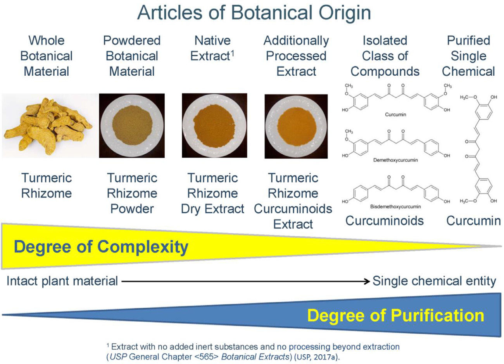

**「Turmeric Rhizome（ウコン根茎）」**（未加工生薬原料）→ 粉砕 →**「Turmeric Rhizome Powder」**→ 含水エタノール抽出 →**「Turmeric Rhizome Dry Extract」**→ 追加加工 →**「Turmeric Rhizome Curcuminoids Extract」**（部分精製天然複合体）→ 単離 →**「Curcuminoids」**（化合物クラス）→ さらに精製 →**「Curcumin」**（単一単離化学物質）。未加工原料を除く各品目は「Turmeric Rhizome Powder Capsules」「Curcumin Tablets」等の最終経口剤形にも製剤化できる。モノグラフ策定上、植物材料から単離され単一化学物質で表される精製成分は生薬品目の定義から除外される。

## 2. Definition（定義）

定義は公定書モノグラフの核心（quintessence）であり、認められた完全ラテン二名・植物科・植物部位・収穫/採集期（必要かつデータで裏付けられる場合）・該当する加工形態を含めて品目を正しく定義する。生物活性または特徴的マーカー成分の含量の許容限度が Definition に記載される。加えて、定量すべき成分の化学名と分子式も含まれる。

定義には、Medicinal Plant Names Services（MPNS）の現行植物命名に準拠する完全ラテン二名（属・種・植物学者の権威名）と植物科が含まれる。伝統的に認められたラテン二名の同義語があれば同義語も含める。例：**Centella asiatica**（ツボクサ）は Centella asiatica (L.) Urb. [Syn: Hydrocotyle asiatica L.]（セリ科 Apiaceae）の乾燥地上部からなる。商業では gotu kola としても知られる。

植物部位は常にモノグラフ定義に含まれる。例：USP の **Ganoderma lucidum（霊芝）Fruiting Body** の定義は乾燥子実体のみからなり、菌糸体は除く（薬用キノコの子実体は伝統医療で広く用いられてきたが菌糸体は用いられてこなかったため）。

一部の定義は適切な収穫時期を規定する。例：**Feverfew（ナツシロギク）** は開花期に採集した Tanacetum parthenium の乾燥葉。**Astragalus root（黄芪）** は通常2〜3年生の植物から初秋に収穫。

加工工程が規定されることもある。最も一般的な加工は乾燥、続いて粉砕・抽出。例：**Ginger（生姜）** は Zingiber officinale の乾燥根茎（削皮・部分削皮・無削皮）。**Powdered Milk Thistle Extract** はミルクシスル果実/種子から脱脂後に適切な溶媒で抽出して調製。

生物活性/特徴的マーカー成分の含量は通常、乾燥物換算（Loss on Drying 補正）または無水物換算（揮発性成分を多く含む場合の水分補正）でのパーセントで規定される。例：

- **Tienchi Ginseng Root and Rhizome（三七人参）**：Panax notoginseng の乾燥根・根茎（秋の開花前採集）。乾燥物換算で総ジンセノシド NLT（not less than＝以上）5.0%（notoginsenoside R1・ginsenoside Rg1・Re・Rb1・Rd の和）。
- **Dong Quai Root（当帰）**：Angelica sinensis の乾燥根（晩秋採集）。無水物換算で総ブチリデンフタリド NLT 0.65%（E-ligustilide・E-butylidenephthalide・Z-ligustilide・Z-butylidenephthalide の和）、総フェニルプロパノイド NLT 0.15%（フェルラ酸・coniferyl ferulate の和）。

## 3. Identification（同定）

同定セクションの目的は、検査対象の植物・植物製品が Definition と包装表示に一致することを保証する分析試験を提供することである。試験は形態学的・組織学的・化学的特性を含む植物固有の特徴を評価できる。USP 生薬 DS・HMC 生薬モノグラフは通常、**最低2つの直交する（orthogonal）同定試験** を含む。形態・組織学的特徴の同定試験に加え、HPLC・UHPLC・HPTLC・ガスクロマトグラフィーといった現代のクロマトグラフィー手法は、高い選択性と固有のフィンガープリント生成能力により強力な化学同定法となる。

### 植物学的特徴による同定（Botanical characteristics identification）

生薬 DS・HM は維管束植物と各種植物部位（根・根茎・樹皮・葉・花・果実・種子）由来で、同定に必要な診断的形態特徴をもち、近縁種との区別に用いられる。真正品と偽和物/代用品の生薬学的特徴を区別すべきである。

解剖学的診断特徴には次が含まれる（限定せず）：(1) 器官内の特定組織の存在；(2) 組織内の細胞の配置・種類；(3) 分泌管・油/樹脂道・乳管の存在と種類；(4) 分泌管を囲む上皮細胞の数；(5) デンプン・イヌリン・脂肪球・精油・シュウ酸カルシウム結晶・シストリス・ポリフェノール等の後含物（ergastic substances）の存在と種類。

- **根・根茎（横断面）:** 周辺から中心へ体系的順で診断特徴を提供。コルク細胞の種類、内皮層とその細胞/細胞壁の性質、維管束の配置/種類、道管・繊維の種類と肥厚、髄放射組織の幅と性質、石細胞（sclereids）・シュウ酸カルシウム結晶の有無・形状・種類・サイズ、デンプン粒の種類・形状・サイズ・へそ位置・条線。
- **樹皮（横断面）:** 周皮（phellem・phellogen・phelloderm）、皮層とその細胞内容物、師部繊維、石細胞、シュウ酸カルシウム結晶、髄放射組織の幅（単列/多列）。
- **葉:** 葉身・葉柄・托葉・葉序の巨視的特徴。横断面では背腹性/等面性、毛（trichomes）の存在・種類・形態、気孔の種類、表皮層と細胞、柵状/海綿状柔組織の配置、主脈の詳細、排出/分泌細胞の存在。表面観では毛・気孔・クチクラ・表皮細胞形状・細胞壁。
- **花:** 花は開花植物の最良の診断的形態特徴であり、花構造は植物分類の主要基準。花序の種類、一次花部（萼片・花弁・雄しべ・雌しべ）の存在/数/外観、対称性、子房の相対位置、胎座の種類、子房数・胚珠数、花粉粒の外観、蜜腺の存在、被覆/腺毛の存在、花托・苞などの付属構造。
- **果実:** 雌しべ数、心皮数、種子数、胎座、裂開/非裂開/多肉の判定。裂開果の縫合線数、種子と果皮壁の融合/遊離、多肉果の果皮3層（外果皮・中果皮・内果皮）、花托・苞などの付属組織。
- **種子:** 種子の形状・サイズ、種皮表面の外観、へそ・珠孔の位置、種阜・カルンクル・油体などの付属構造。胚のサイズ・形状・位置、子葉数、大配偶体遺物（裸子植物）・外胚乳（perisperm）・胚乳の存在。種皮の組織学的特徴。

### クロマトグラフィーによる同定（Chromatographic identification）

生薬医薬品・DS・HM モノグラフは通常、植物の確実な陽性同定特性を提供するため **HPLC と HPTLC の両同定試験** を含む。これらは二次代謝産物の特徴的プロファイルを検出し、潜在的混同物質の区別に役立つ。試験対象成分は生物活性または特徴的マーカー成分であるべき。**生物活性マーカー成分** は薬理活性が知られ有効性に何らか寄与するもの。臨床有効性を担う成分が不明な場合は、**特徴的マーカー成分**（明確な薬理活性はないが品目に特徴的な二次代謝産物として陽性同定に役立つ）を用いる。

同定試験の HPLC/HPTLC 手順は、潜在的混同物質を区別する十分な選択性をもたねばならない。正しいクロマトグラフィーパターン（近接溶出ピーク間の十分な分離度、類似 Rf の吸着帯の分離）が得られるようシステム適合性試験を確立すべき。確立した方法は、モノグラフが代表する植物材料の異なる供給源からの十分な数の真正試料と、潜在的混同物質の試料での試験に基づくべき。真正試料（陽性対照）で一貫した認識可能パターンが得られ、混同物質試料（陰性対照）で観測されるものと異なるべき。試料溶液調製は追加変数を避けるため可能な限り単純に。適切な標準溶液で対象ピーク/吸着帯の位置を同定しシステム適合性を確認する。標準溶液は陽性対照となり、1〜2の単離純成分 RS、生薬エキス RS、または認証済み生薬粉末 RS で調製する。種すり替えや汚染を示すマーカーを含む追加標準溶液を陰性対照として規定することもある。HPLC と HPTLC は相補的。

同一モノグラフ内の含量定量に用いるクロマトグラフィー系を同定にも用いると通常有利。許容基準では、認識可能パターンを **規定ピークの有無・ピーク溶出順（相対保持時間）・ピーク相対強度または成分含量比** で記述する。

HPTLC 試験の頑健な再現には、USP 一般試験法（GC）〈203〉「生薬品目の同定のための HPTLC 手順」の標準プロトコルに従うべき。試料塗布モード・容量、バンド長、プレート内位置、相対湿度、飽和時間、展開溶媒レベルを厳密に管理する。

### 実例1：桂皮（Cinnamomum cassia Twig）の HPLC 同定

桂皮は TCM。フェニルプロパノイド誘導体 **シンナムアルデヒド（cinnamaldehyde）** が生物活性マーカー化合物の一つ。USP Cinnamomum cassia Twig モノグラフの HPLC 同定試験では、シンナムアルデヒドとその類縁体（ケイヒ酸 cinnamic acid、シンナミルアルコール、2-メトキシケイヒ酸、2-メトキシシンナムアルデヒド）、およびマーカー化合物クマリン（coumarin）のピークを、USP ケイヒ酸 RS と USP Cinnamomum cassia Twig 粉末 RS との比較で規定した。相対保持時間・含量比によるピーク順は原著 Table 3。

**許容基準の例:** 試料溶液は、標準溶液 B のシンナムアルデヒドに対応する保持時間で最も強いピークを示す；標準溶液 A のケイヒ酸に対応する保持時間でピーク；標準溶液 B の各成分に対応する保持時間でクマリン・シンナミルアルコール・2-メトキシケイヒ酸・2-メトキシシンナムアルデヒドのピーク。これら成分のケイヒ酸に対する含量比は Table 3 の典型比範囲内。シンナムアルデヒドの含量は総フェニルプロパノイドの NLT 65%。

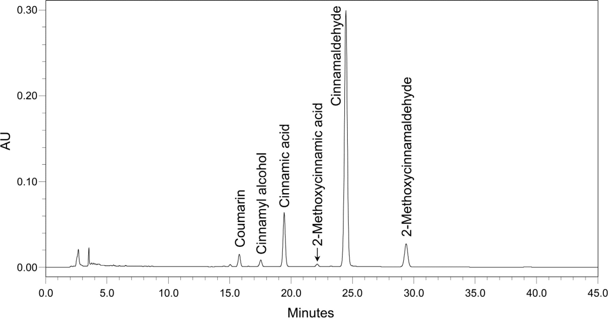

#### 原著 Table 3：USP モノグラフの COMPOSITION（assay）下の HPLC 同定追加情報（桂皮）

| 分析対象 | 概略相対保持時間 | 換算係数 | 典型含量範囲(%) | ケイヒ酸に対する含量比 |
|---|---|---|---|---|
| クマリン | 0.8 | 2.10 | 0.02–0.15 | 0.2–1.3 |
| シンナミルアルコール | 0.9 | 2.12 | 0.003–0.05 | 0.02–0.6 |
| ケイヒ酸 | 1.0 | 1.00 | 0.04–0.16 | 1.0 |
| 2-メトキシケイヒ酸 | 1.1 | 1.82 | 0.002–0.02 | 0.04–0.16 |
| シンナムアルデヒド | 1.3 | 1.47 | 0.6–2.0 | 6–30 |
| 2-メトキシシンナムアルデヒド | 1.5 | 2.69 | 0.08–0.5 | 0.5–6.0 |

### 実例2：金銀花（Lonicera japonica・Japanese Honeysuckle Flower）の HPLC・HPTLC 同定

HPTLC は金銀花を近縁 Lonicera 種（L. macranthoides, L. fulvotomentosa）から区別する。金銀花は **カフェオイルキナ酸類・イリドイド類・フラボン配糖体** を含む。植物の陽性同定特性に直交性を与えるため、モノグラフには2つの HPLC 同定試験と1つの HPTLC 同定試験を含めた。

- **カフェオイルキナ酸 HPLC 法:** USP クロロゲン酸 RS と Lonicera japonica 花乾燥エキス RS との比較でカフェオイルキナ酸の有無・相対量を試験（Fig.3）。
- **イリドイド HPLC 法:** USP セコキシロガニン RS と同エキス RS との比較でイリドイドの有無を試験（Fig.4）。
- **HPTLC 法:** USP クロロゲン酸 RS・ルチン RS・ルテオリン 7-O-グルコシド RS・同エキス RS との比較でカフェオイルキナ酸とフラボン配糖体の有無を試験（Fig.5）。

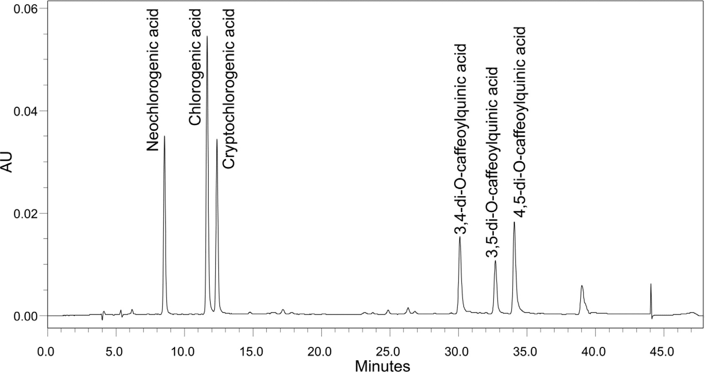

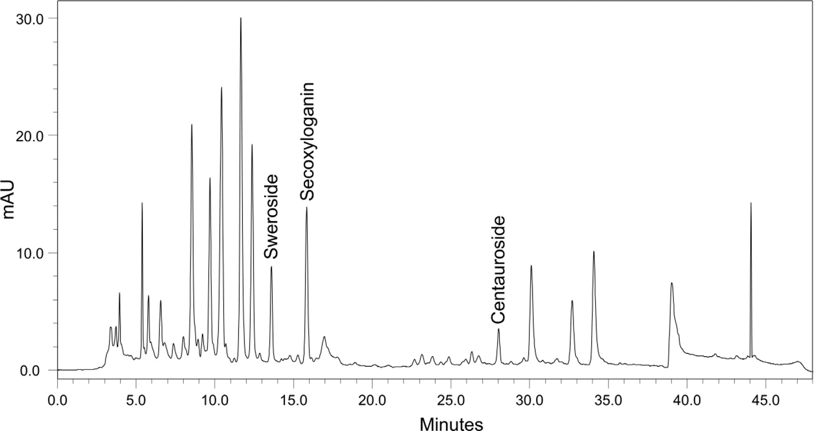

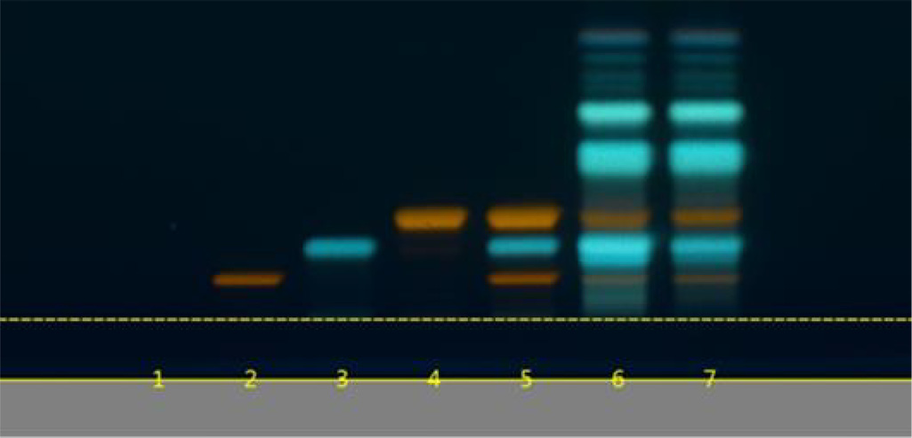

市場では他の近縁 Lonicera 種がしばしば金銀花を偽和する。文献（Li et al., 2009）は金銀花と近縁 Lonicera 種が非常に類似したカフェオイルキナ酸・フラボン配糖体・イリドイドを含むと報告し、上記陽性同定試験では区別が困難な場合がある。文献（Chai et al., 2005 ほか）によれば、近縁 Lonicera 種は金銀花に欠けるトリテルペノイドサポニンを含む。そこで、**トリテルペノイドサポニンの限度試験（limit test）** をモノグラフに含め、近縁種から区別した（Fig.6。混合標準：macranthoidin B・macranthoidin A・dipsacoside B）。

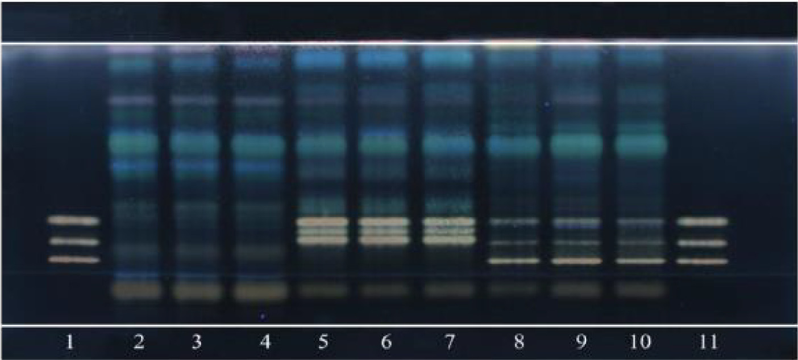

### 実例3：紅景天（Rhodiola crenulata と R. rosea の根・根茎）の HPTLC 判別

**R. crenulata 根・根茎** は TCM「紅景天（Hong-Jing-Tian）」で、シベリア・チベット高地の過酷環境に生育し、抗疲労・抗低酸素剤として用いられる。**R. rosea 根・根茎** は強力なアダプトゲンとして知られ、欧州・アジアの寒冷山地に生育、世界で最もよく知られる Rhodiola。両者は市場でしばしば混同される。しかし生物活性マーカー化合物の HPTLC で効率的に区別できる。

両者とも **サリドロシド・チロソール・没食子酸** を含む（Fig.7）が、R. rosea はさらに **rosarin・rosavin・rosin**（R. crenulata に欠ける）を含む（Fig.8）。

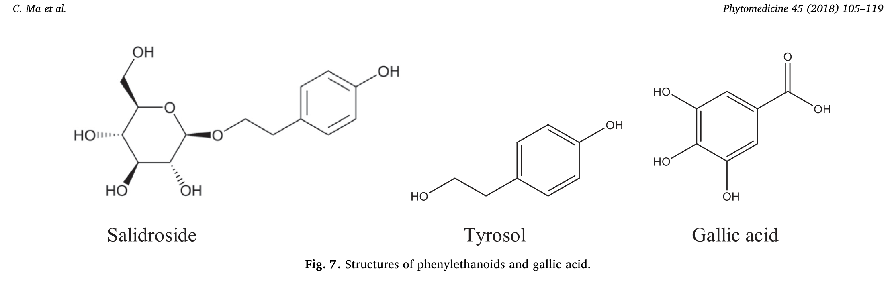

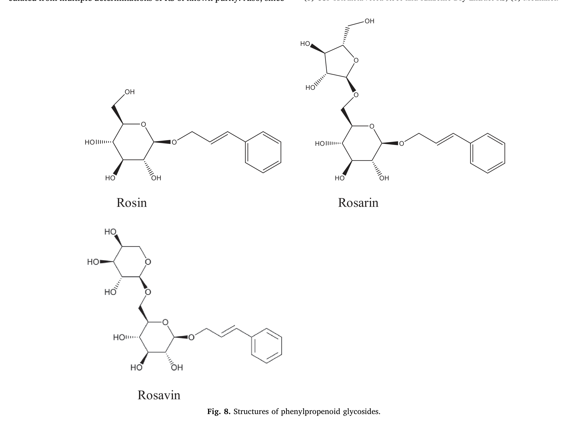

USP Rhodiola rosea モノグラフの HPTLC 同定では、USP ロサビン RS・サリドロシド RS に対応するバンドの存在と同エキス RS と類似のクロマトグラムで R. rosea を陽性同定。USP Rhodiola crenulata モノグラフでは、サリドロシド RS 対応バンドの存在と **ロサビン RS 対応バンドの不在** で R. crenulata を R. rosea から区別（Fig.9）。

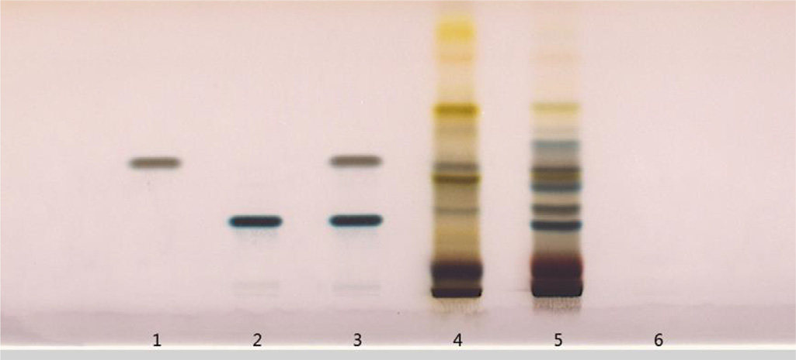

### 実例4：何首烏（Polygonum multiflorum・P. cuspidatum・P. cillinerve の根）の判別

**Polygonum multiflorum 根** は TCM「Fo-Ti / He-Shou-Wu（何首烏）」で、未加工または黒豆と煮て供される。潜在的混同物質と区別するため、HMC の HPTLC 同定法で Pteroxygonum giraldii（5）・P. cillinerve（6）・P. cuspidatum（7）・Fagopyrum esculentum（8）・Cynanchum auriculatum（9）の根を試験した。

結果（Fig.10）：5・8・9 は明確に区別されたが、6 と 7 は何首烏と類似の HPTLC プロファイルをもち、3種はアントラキノンの同じマーカー成分に対応する赤・黄バンドを示した。

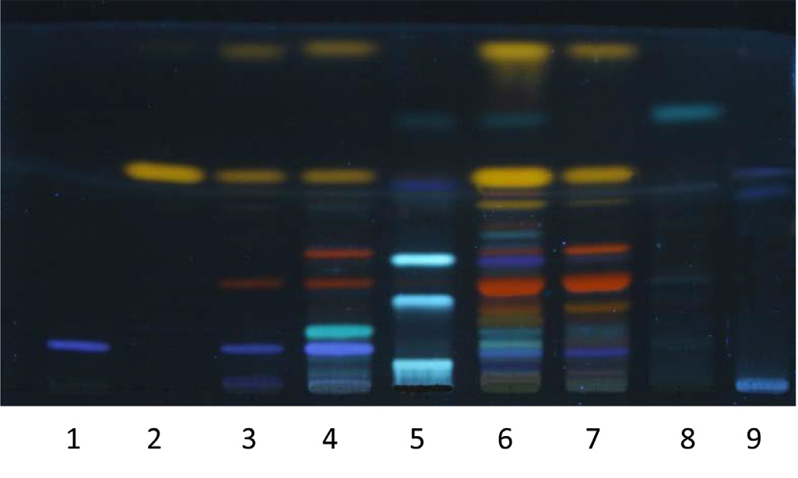

何首烏の **2,3,5,4'-テトラヒドロキシスチルベン-2-O-β-D-グルコシド（TSG）** の青バンドは、6・7 に存在する **ポリダチン（PD）** のバンドと構造類似のため位置・色が類似（Fig.11）。

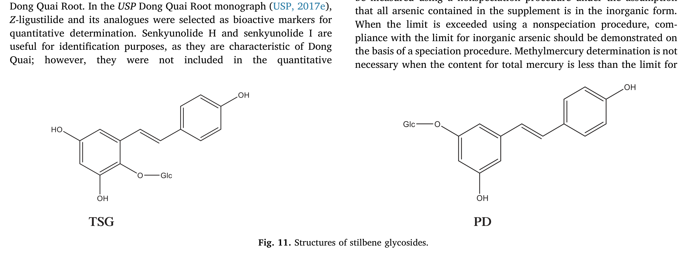

同モノグラフのスチルベン配糖体 HPLC 同定法を用いると、TSG と PD が逆相 HPLC で良好分離されるため3種を効率的に区別できた。何首烏は USP TSG RS 対応の主ピーク1本、P. cuspidatum は USP ポリダチン RS 対応の主ピーク1本、P. cillinerve は3本の主ピーク（1本はポリダチン RS 対応）を示した（Fig.12）。

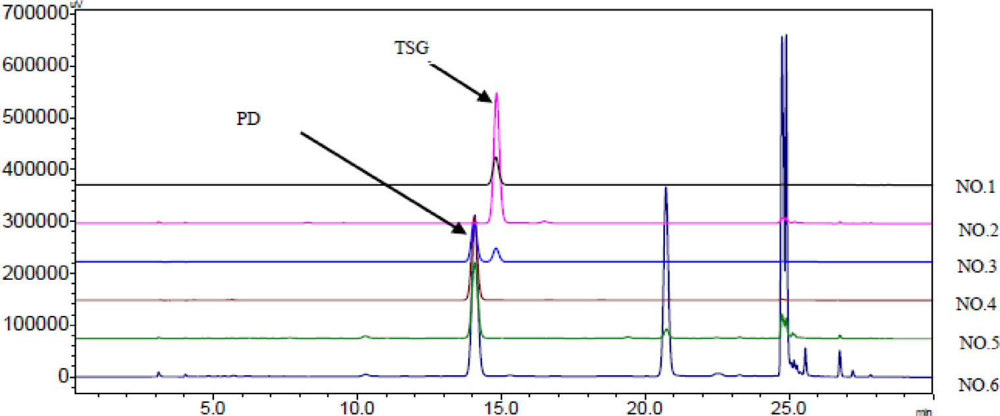

## 4. Composition（assay＝含量）

生物活性/特徴的マーカー成分の定量は品質モノグラフの重要側面の一つ。これら成分の含量が Definition の USP 規格を満たさない場合、材料が低品質であることを示す（不適切な保存・不正な収穫期による劣化、または偽和の可能性）。定量には、分析マーカー成分より **薬理学的/治療的活性成分** を選ぶのが望ましい。バリデート済みクロマトグラフィー手順を通常用いる。

植物材料の活性は多成分と標的生物の複雑な生体系との複数相互作用の結果であり、類似構造の成分は類似の生物活性を発揮するため、通常は単一の活性成分を全生物活性の担い手として同定できない。そのため、これら試験の定量結果はしばしば **個別定量した成分クラスの総量** として表される。

USP 生薬 DS・HMC HM モノグラフでは、植物材料の品質を反映する二次代謝産物の含量を決定する1つ以上の定量試験を含む。液体・ガスクロマトグラフィー法が、比色/滴定などの非特異的方法より好まれる。既知なら生物活性成分を定量。定量目的で選ぶマーカーは、対象植物に際立って高濃度で存在しない限り、他植物に遍在するものは避けるべき。

定量分析手順は GC〈1225〉「公定書手順のバリデーション」に従いバリデートすべき。典型的バリデーションパラメータ：真度、各種精度、特異性、検出限度、定量限度、直線範囲、頑健性。クロマトグラフィー法は GC〈621〉「クロマトグラフィー」のシステム適合性試験を含めるべき。これらは通常次を規定：**(1) 分離度要件**（定量ピークがベースライン分離 NLT 1.5 を達成、またはバリデーションで見た分離を再現）；**(2) 最小理論段数 N**（十分な保持と分離効率）；**(3) 最大テーリング係数**（通常 NMT＝not more than 2.0）；**(4) 相対標準偏差の最大値（%RSD）**（個別モノグラフで別途規定なき限り、要件が NMT 2.0% なら5反復注入、NMT 2.0% 超なら6反復注入のデータで %RSD 算出）。

コスト削減・分析簡略化のため、通常は **単一の精製単離成分 RS で複数化合物を定量** する。分析対象が RS と有意に異なる応答係数をもつ場合、各分析対象の RS に対する **換算係数（conversion factor）** を計算に用いる。信頼できる換算係数を得るには固定試験条件を用い、既知純度 RS の複数測定から統計的に算出する。定量する全マーカーを要求しないモノグラフでは、複数シグナル中の対象ピークを同定する方法が必要。対象ピーク位置はシステム適合性試験で同定（RS 植物材料/エキスを含む標準溶液を注入し、得られたクロマトグラムを当該 RS ロットの USP 証明書の参照クロマトグラムと比較）。モノグラフには **クロマトグラフィー類似性** のシステム適合性要件があり、各 USP 生薬エキス RS/認証植物材料 RS の HPLC プロファイルが付属参照クロマトグラムと類似すべきとする。

LC プロファイルのピーク保持時間は、定量ピーク全部のベースライン分離が達成される限り可能な限り短く。USP は **全対象ピークが30分以内に溶出** する手順開発を推奨し、60分超は強く非推奨。

### 実例5：当帰（Dong Quai Root・Angelica sinensis）のブチリデンフタリドとフェニルプロパノイドの同時 HPLC 定量

当帰はブチリデンフタリド類（Z-ligustilide・E-ligustilide・Z-butylidenephthalide・E-butylidenephthalide・senkyunolide H・senkyunolide I）を含む（Fig.13）。

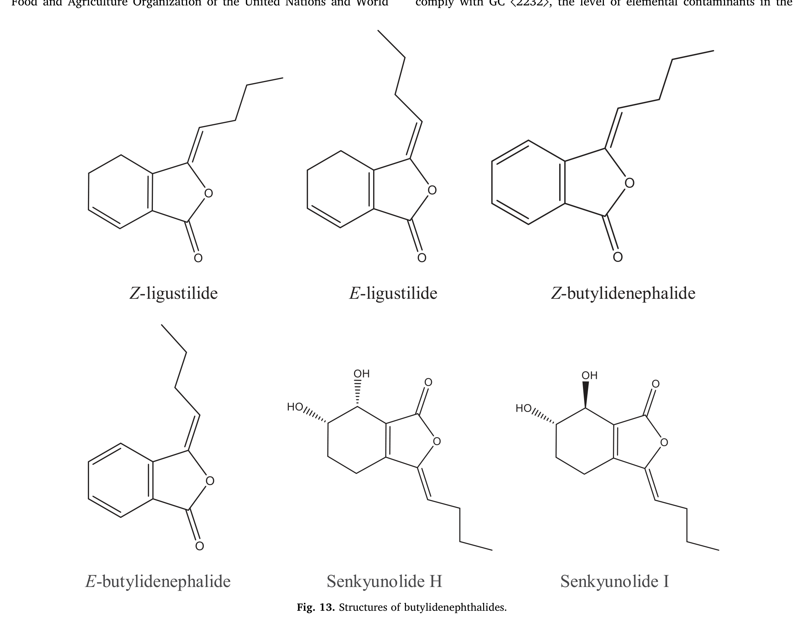

**Z-ligustilide** が主要ブチリデンフタリド成分で、血小板凝集低下・血行促進・瘀血除去が報告され、当帰の伝統的用途に対応。USP Dong Quai Root モノグラフでは Z-ligustilide とその類縁体を定量用の生物活性マーカーに選定。senkyunolide H・I は当帰に特徴的で同定に有用だが、6炭素環の2ヒドロキシ基が極性を大きく変え生物活性の不確かさを高めるため定量には含めない。**フェルラ酸と coniferyl ferulate**（Fig.14）を第2の定量対象二次代謝産物群に選定。coniferyl ferulate はフェルラ酸に容易に分解するため、両者の相対含量は植物材料の安定性の品質指標として有用。

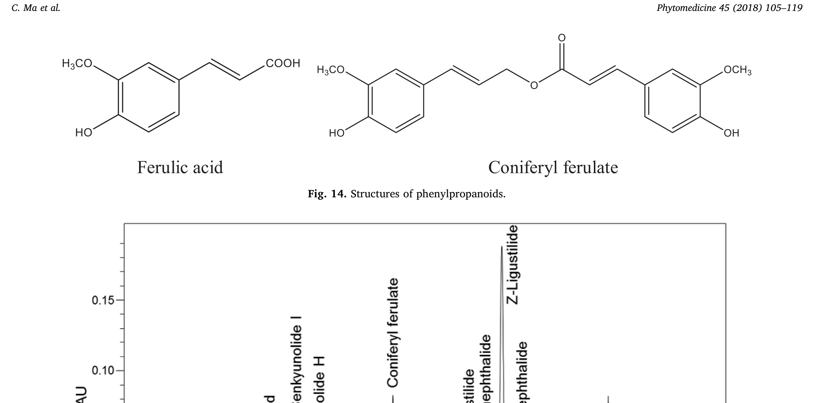

当帰モノグラフでは、ブチリデンフタリドとフェニルプロパノイドを同一クロマトグラフィー系で決定するが、適切な換算係数で別々に算出。Z-ligustilide をブチリデンフタリド定量の RS、フェルラ酸をフェニルプロパノイド定量の RS に使用。Fig.15（USP Angelica sinensis 根粉末 RS の HPLC クロマトグラム）が当帰の典型クロマトグラム。

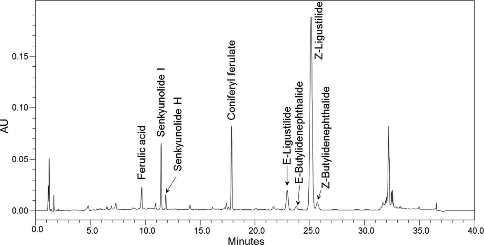

## 5. Contaminants（汚染物質）

汚染物質は、自然発生または人間活動（土壌の産業廃棄物、過剰農薬散布、汚染水灌漑、不十分な洗浄、大気汚染）の結果として生薬品目に存在しうる。加えて収穫後の乾燥・製粉操作が、**元素不純物・農薬残留・微生物汚染・カビ毒（アフラトキシン）** による生薬材料の汚染の原因となりうる。限度は安全性を考慮し関連 GC の要件に基づき合理的に設定すべき。

### 元素不純物（Elemental impurities）

毒性学上懸念される4主要元素は **ヒ素・カドミウム・鉛・水銀**。生薬 DS の元素不純物限度は GC〈561〉「生薬品目」に記載され、次のように規定：ヒ素（無機）NMT 2 µg/g、カドミウム 0.5 µg/g、鉛 5 µg/g、水銀（総）1 µg/g、メチル水銀（Hg として）0.2 µg/g。試験手順は GC〈233〉。対象元素の検出適合性に応じ、ICP–AES/ICP–OES または ICP–MS に基づく。

これら元素の毒性は酸化状態や有機/無機の性質で変わるため、ヒ素・水銀については毒性学上懸念される種（無機ヒ素・メチル水銀）を決定する **スペシエーション手順** を含む。ヒ素はサプリメント中の全ヒ素が無機形との仮定で非スペシエーション手順で測定可能。限度超過時は無機ヒ素の限度適合をスペシエーション手順で実証すべき。総水銀が限度未満ならメチル水銀決定は不要。スペシエーション手順は GC〈2232〉（2018年1月1日発効）。

DS 完成剤形の元素汚染物質限度は **1日許容曝露量（PDE）** に基づく。PDE は FAO/WHO の暫定耐容週間摂取量（PTWI）から、各元素汚染物質の大気・食品・飲料水からの1日曝露量を差し引き、体重50 kg と安全係数を用いて算出。推奨 PDE 値：ヒ素（無機）15 µg/day、カドミウム 5 µg/day、鉛 5 µg/day、水銀（総）15 µg/day、メチル水銀（Hg として）2 µg/day。

### 残留溶媒（Residual solvents）

DI 中の残留溶媒は品目製造で使用/生成される揮発性化学物質。生薬抽出では水・アルコール・アルコール水混合物などを使用。他溶媒使用時は GC〈467〉「残留溶媒」（GC〈565〉「生薬エキス」で参照）の要件を満たすべき。理想的には低毒性溶媒（クラス3溶媒、PDE 50 mg/day 以上）のみ使用。個別モノグラフのクラス3溶媒限度が 50 mg/day（5000 ppm 相当）超なら、FID 付きガスクロマトグラフィーで同定・定量すべき。

### 農薬（Pesticides）

GC〈561〉によれば「農薬」は、純粋品目の生産・加工・保存・輸送・販売中に害を与える害虫や不要種（植物・真菌・動物）を防除する物質。この章は米国で生薬医薬品に適用される **70種の農薬** の限度を含む。記載外の農薬は米国 EPA 規則（40 CFR Part 180）に準拠。限度は FAO-WHO の許容1日摂取量（ADI）・使用者体重（平均60 kg）・1日用量に基づき算出を推奨。エキス・チンキ等の製剤用途なら、製法での農薬の抽出係数を実験的に計算し考慮。

商業生薬エキスでは GC〈565〉により **植物-エキス比（plant-to-extract ratio）** を考慮。比≤10 なら農薬限度(mg/kg)＝農薬限度×植物-エキス比。比≥10 なら ADI・体重・1日用量を考慮（GC〈561〉と同様）。分析手順は EC ガイダンス（SANTE/11813/2017）または米国 EPA 法（OPPTS 860.1340）に従いバリデート。

### 微生物汚染（Microbial contamination）

GC〈2021〉「微生物数試験—栄養・栄養補助食品」は総好気性生菌数（Soybean–Casein Digest–Agar）・総真菌酵母数（Sabouraud Dextrose–Agar）・腸内細菌数（Violet-red Bile Agar）の推定手順を記述。推奨微生物限度は GC〈2023〉。総好気性菌数・総真菌酵母数・胆汁耐性グラム陰性菌・サルモネラ/大腸菌の不在について限度規定される材料：乾燥/粉末生薬、粉末生薬エキス、チンキ、流エキス、浸剤/煎剤、生薬含有栄養補助食品、使用前に熱湯処理する生薬。GC〈2022〉は不許容微生物（黄色ブドウ球菌・サルモネラ・大腸菌・クロストリジウム）の不在試験を含む。

### アフラトキシン（Aflatoxins）

アフラトキシンは最も毒性の高いカビ毒クラスの一つで、多くの Aspergillus 種の増殖から生じる。GC〈561〉の限度：**アフラトキシン B1（AFB1）NMT 5 ppb、AFB1+B2+G1+G2 の和 NMT 20 ppb**。GC〈561〉は3法を記述：Method I は TLC。Method II・III は抽出後に AFB1/B2/G1/G2 交差反応性モノクローナル抗体を含むイムノアフィニティカラムでの追加クリーンアップを推奨。クリーンアップ後、HPTLC（Method II）または後カラム誘導体化付き HPLC（光化学/後カラム臭素化誘導体化セル、Method III）で分離・検出。

## 6. Specific tests（固有試験）

古典生薬学に基づく一般品質パラメータが大半の薬局方生薬品目に適用されることは各国薬局方で概ね一致。例：**総灰分（Total ash）・酸不溶性灰分・乾燥減量または水分定量・水溶性エキス分・アルコール溶性エキス分**。加えて有害成分の不在を保証する試験を **限度試験（Limit tests）** として規定。

- **限度試験:** 植物材料が潜在的有毒成分を含むと知られる場合、その不在または安全性懸念レベル未満を保証。許容基準は通常 NMT で表す。
- **総灰分:** 生薬の灰化後に残る残渣量を測定し、植物中の無機化合物量を示す。土壌の種類で一定限度内で変動。粗生薬調製時の注意深さを示すことも。
- **酸不溶性灰分:** 総灰分を 3 N 塩酸で煮沸後の残渣。主に砂・ケイ酸塩からなり、試料中の泥・土壌・粘土量を示す。
- **水溶性灰分:** 総灰分を水で煮沸後の残渣。粗生薬中の抽出済み植物残渣（marc）の存在検出に有用（偽和を示唆）。
- **異物（Foreign organic matter）:** 生薬を構成する部分以外の植物部分や、存在しうる他の植物/動物組織を同定・測定。物理的に除去し秤量。
- **乾燥減量（Loss on drying）:** GC〈731〉条件下で駆逐される揮発性物質（水・精油・残留溶媒）の量。精油を含む生薬では不適で、水と残留溶媒を別々に定量すべき。
- **水分（Water content）:** 生薬 DS・HM は通常乾燥減量で乾燥物換算使用。精油含有時は GC〈921〉Method II で無水物換算。生薬エキスは GC〈921〉Method I。
- **アルコール溶性・水溶性エキス分:** アルコール・水・含水アルコール処理で得られるエキス物質量。他法で推定しにくい成分の評価に使用。通常 NLT 規定パーセント。許容値より低い数値は抽出済み試料での偽和を示す。
- **精油（Volatile oil）:** 生薬 DS・HM が精油を含む場合、下限を規定。GC〈561〉手順で決定。

## 7. Additional requirements（追加要件）

USP 生薬医薬品・DS・HMC HM モノグラフには **包装・保存、表示、標準品** の追加要件がある。USP RS には定量・定性用の高度精製化合物と、比較参照用の複雑植物材料（生薬エキス・認証植物粉末）が含まれる。

- **包装・保存要件:** GC〈659〉が全公定書品目の包装・保存要件を記述。規定条件下でラベル表示の使用期限まで規格保持が期待される。提出包装・保存条件での安定性試験が使用期限確立に必要。通常、生薬品目は気密容器・室温管理または冷所・遮光防湿で保存。
- **表示要件:** 「labeling」は直接容器上/包装内の全ラベル・印刷物（外装出荷容器を除く）。生薬モノグラフでは、表題に植物部位が含まれなければ製品名とラテン二名・植物部位を表示。生薬エキスは GC〈565〉の追加情報も。活性主成分/マーカー化合物の含量（%）を規定。一部モノグラフ（Black Cohosh、St. John's Wort、Salix species Bark）は注意喚起表示を含む。妊娠授乳への影響が未調査の生薬が多いため、GC〈7〉は「妊娠中・授乳中は使用前に専門家の助言を求めること」の表示を指示。
- **USP 標準品（RS）:** 定性試験（フィンガープリント同定・システム適合性・ピークマーカー）と定量試験（成分/製剤アッセイ・主成分組成・限度試験・管理試験）には十分特性評価された RS が必要。クロマトグラフィー保持時間は化合物に特徴的だが固有ではないため、RS をシステム適合性指標とし、試料の保持時間一致を同一性プロファイル/アッセイ構築の部分基準に使用可能。USP RS は共同試験・承認された真正標本で、SI 単位へのトレーサビリティ確保に役立つ。目的（同定用の定性/アッセイ用の定量）に応じ、RS は粉末植物材料・粉末エキス・精製画分・純化合物のいずれか。

---

# 結論（Conclusion）

USP 生薬 DS・HMC HM モノグラフは、同一性・生物活性成分/品質マーカーの含量・汚染物質/偽和物/潜在的有毒物質の限度について詳細な規格を提供する科学ベースの品質規格である。各モノグラフの複数試験は相互に補完し、生薬医薬品・栄養補助食品として用いられる生薬に適切な薬局方品質特性評価を提供する。クロマトグラフィー分析手順は、同一性や品質マーカー含量の正確な決定のための特徴的プロファイルを提供するようバリデートされる。表示・包装などの追加要件も品質保持に寄与する。したがって、ヘルスケア目的で用いられる生薬品目の信頼性を保証するには、薬局方規格への適合が要求されるべきである。

---

# 利益相反・謝辞

**利益相反:** 本刊行物に関連する既知の利益相反はなく、結果に影響しうる重要な財政支援もない。**謝辞:** 上記 USP モノグラフで用いた方法の開発に、(1) 上海 TCM 現代化研究センター（中国科学院上海薬物研究所）、(2) 天然薬物国家重点実験室（中国薬科大学、南京）、(3) 瀋陽薬科大学 医薬品分析学部が貢献した。

---

# 主要参考文献（抜粋）

- Ashakirin SN, et al. Chemistry and bioactivity of cinnamaldehyde. Int J Pharm Sci Res. 2017;8:2333–2340.
- Chai XY, Li SL, Li P. Quality evaluation of Flos Lonicerae through simultaneous determination of seven saponins by HPLC with ELSD. J Chromatogr A. 2005;1070:43–48.
- Gao W, et al. Unbiased metabolite profiling by LC-QTOF-MS and multivariate data analysis for herbal authentication: classification of seven Lonicera species flower buds. J Chromatogr A. 2012;1245:109–116.
- Li XQ, et al. Investigation on the chemical constituents and variation of the flower buds of Lonicera species by UPLC-ESI-MS/MS and PCA. Yaoxue Xuebao 2009;44:895–904.
- Ren MT, et al. Identification and quantification of 32 bioactive compounds in Lonicera species by HPLC-TOF-MS. J Pharm Biomed Anal. 2008;48:1351–1360.
- Zhang L, et al. Z-ligustilide extracted from Radix Angelica Sinensis decreased platelet aggregation. Yakugaku Zasshi 2009;129:855–859.
- USP 一般試験法（GC）：〈7〉Labeling、〈11〉USP Reference Standards、〈203〉HPTLC Procedure for Identification of Articles of Botanical Origin、〈233〉Elemental Impurities—Procedures、〈467〉Residual Solvents、〈561〉Articles of Botanical Origin、〈565〉Botanical Extracts、〈621〉Chromatography、〈659〉Packaging and Storage Requirements、〈731〉Loss on Drying、〈921〉Water Determination、〈1225〉Validation of Compendial Procedures、〈2021〉〈2022〉〈2023〉Microbial tests、〈2232〉Elemental Contaminants in Dietary Supplements（USP 40–NF 35）。
- USP モノグラフ：Cinnamomum cassia Twig、Dong Quai Root、Japanese Honeysuckle Flower、Rhodiola crenulata Root and Rhizome、Rhodiola rosea、HMC Polygonum multiflorum Root。
- HMC/DS 命名ガイドライン（USP 2014, 2016）、Herbs of Commerce（Foster et al. 1992; McGuffin et al. 2000）、MPNS（Medicinal Plant Names Services, 2017）。

---

## 参考文献

Ashakirin, S.N., Tripathy, M., Patil, U.K., Majeed, A.B.A., 2017. Chemistry and bioactivity of cinnamaldehyde: a natural molecule of medicinal importance. Int. J. Pharm. Sci. Res. 8, 2333–2340.

Chai, X.Y., Li, S.L., Li, P., 2005. Quality evaluation of Flos Lonicerae through a simultaneous determination of seven saponins by HPLC with ELSD. J. Chromatogr. A. 1070, 43–48.

European Commission (EC) Directorate-General For Health and Food Safety, 2017. Guidance document on analytical quality control and method validation procedures for pesticides residues analysis in food and feed, SANTE/11813/2017.

Foster, S., Moley, T., Awang, D., 1992. Herbs of Commerce. American Herbal Products Association, Austin, TX.

Gao, W., Yang, H., Qi, L.W., Liu, E.H., Ren, M.T., Yan, Y.T., Chen, J., Li, P., 2012. Unbiased metabolite profiling by liquid chromatography-quadrupole time-of-flight mass spectrometry and multivariate data analysis for herbal authentication: classification of seven Lonicera species flower buds. J. Chromatogr. A. 1245, 109–116.

Li, X.Q., Sun, X.H., Cai, S., Ying, X.X., Li, F.M., 2009. Investigation on the chemical constituents and variation of the flower buds of Lonicera species by UPLC-ESI-MS/MS and principle component analysis. Yaoxue Xuebao 44, 895–904.

McGuffin, M., Kartesz, J., Leung, A., Tucker, A., 2000. Herbs of Commerce, 2nd ed. American Herbal Products Association, Silver Spring, MD.

MPNS, Medicinal Plant Names Services, 2017.

Ren, M.T., Chen, J., Song, Y., Sheng, L.S., Li, P., Qi, L.W., 2008. Identification and quantification of 32 bioactive compounds in Lonicera species by high performance liquid chromatography coupled with time-of-flight mass spectrometry. J. Pharm. Biomed. Anal. 48, 1351–1360.

United States Environmental Protection Agency (EPA), 1996. Residue chemistry test guidelines: OPPTS 860.1340 residue analytical method [EPA 712-C-96-174].

United States Government Publishing Office (US GPO) Electronic Code of Federal Regulations. Code of Federal Regulations Title 21 § 101.4 (h), 2017a.

United States Government Publishing Office (US GPO) Electronic Code of Federal Regulations. Code of Federal Regulations Title 40 § 180, 2017b.

USP, 2014. Guideline for Assigning Titles to USP Herbal Medicines Compendium Monographs. Version 1.0: May 7, 2014.

USP, 2015. USP Dietary Supplements Compendium.

USP, 2016. Guideline for Assigning Titles to USP Dietary Supplement Monographs.

USP, 2017a. Articles of Botanical Origin 〈561〉. United States Pharmacopeial Convention, Rockville, MD, pp. 426–440 USP 40–NF 35.

USP, 2017b. Botanical Extracts 〈565〉. USP, Rockville, MD, pp. 452–454 USP 40–NF 35.

USP, 2017c. Chromatography 〈621〉. USP, Rockville, MD, pp. 8071–8082 USP 40–NF 35, First supplement.

USP, 2017d. Cinnamomum cassia Twig. USP, Rockville, MD, pp. 8443–8445 USP 40–NF 35, First supplement.

USP, 2017e. Dong Quai root. Pharm Forum 43 (5).

USP, 2017f. Elemental Contaminants in Dietary Supplements 〈2232〉. USP, Rockville, MD, pp. 2278–2282 USP 40–NF 35.

USP, 2017g. Elemental Impurities—Procedures 〈233〉. USP, Rockville, MD, pp. 298–301 USP 40–NF 35.

USP, 2017h. Guideline for the Admission of Dietary Supplement Ingredients to the USP–NF Monograph Development Process.

USP, 2017i. High-Performance Thin-Layer Chromatography Procedure for Identification of Articles of Botanical Origin 〈203〉. USP, Rockville, MD, pp. 258–260 USP 40–NF 35.

USP, 2017j. Japanese Honeysuckle Flower. USP, Rockville, MD, pp. 7055–7057 USP 40–NF 35.

USP, 2017k. Labeling 〈7〉. USP, Rockville, MD, pp. 98–104 USP 40–NF 35.

USP, 2017l. Loss on Drying 〈731〉. USP, Rockville, MD, pp. 614–615 USP 40–NF 35.

USP, 2017m. Microbiological Attributes of Nonsterile Nutritional and Dietary Supplements 〈2023〉. USP, Rockville, MD, pp. 2256–2259 USP 40–NF 35.

USP, 2017n. Microbial Enumeration Tests—Nutritional and Dietary Supplements 〈2021〉. USP, Rockville, MD, pp. 2245–2250 USP 40–NF 35.

USP, 2017o. Microbiological Procedures for Absence of Specified Microorganisms—Nutritional and Dietary Supplements 〈2022〉. USP, Rockville, MD, pp. 2250–2256 USP 40–NF 35.

USP, 2017p. Packaging and Storage Requirements 〈659〉. USP, Rockville, MD, pp. 529–534 USP 40–NF 35.

USP, 2017q. Residual Solvents 〈467〉. USP, Rockville, MD, pp. 369–384 USP 40–NF 35.

USP, 2017r. Rhodiola crenulata Root and Rhizome. USP, Rockville, MD, pp. 8904–8906 USP 40–NF 35, Second supplement.

USP, 2017s. Rhodiola rosea. USP, Rockville, MD, pp. 7149–7151 USP 40–NF 35.

USP, 2017t. USP Reference Standards 〈11〉. USP, Rockville, MD, pp. 104–106 USP 40–NF 35.

USP, 2017u. Validation of Compendial Procedures 〈1225〉. USP, Rockville, MD, pp. 8094–8099 USP 40–NF 35, First supplement.

USP, 2017v. Water Determination 〈921〉. USP, Rockville, MD, pp. 815–820 USP 40–NF 35.

U.S. Pharmacopeial Convention Herbal Medicines Compendium, 2017. Polygonum multiflorum Root.

Zhang, L., Du, J.R., Wang, J., Yu, D.K., Chen, Y.S., He, Y., Wang, C.Y., 2009. Z-ligustilide extracted from Radix Angelica Sinensis decreased platelet aggregation induced by ADP ex vivo and arterio-venous shunt thrombosis in vivo in rats. Yakugaku Zasshi 129, 855–859.
