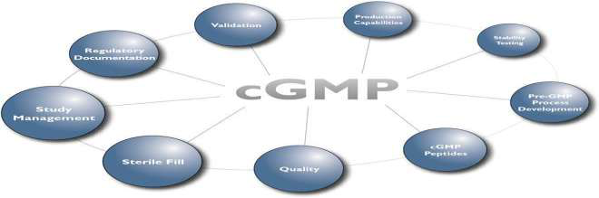

<!--
Wasiullah M, Yadav P, Yadav S, Rai A. WHO guideline on Current Good Manufacturing
Practices for Herbal medicines. International Journal of Pharmaceutical Research and
Applications 8(3) (2023) 807-816. doi:10.35629/7781-0803807816 の全訳密度日本語版。
-->

> **補足（本サイトでの位置づけ）:** 本稿は、当サイトが扱う「生薬・漢方の品質管理」の**製造現場側の土台＝GMP（適正製造規範）**を概観するレビュー。生薬の指紋分析やQ-markerが「製品をどう試験・評価するか」であるのに対し、cGMPは「そもそも製品をどうやって一貫した品質で作るか」を規定する枠組みで、品質管理・施設・文書・訓練・変更管理・バリデーションの全体像を押さえられる。生薬は原料の変動が大きいぶんGMPの重要性が高い。**掲載誌・IFの注意:** 原著は Int. J. Pharm. Res. Appl.（IJPRA）掲載で、誌面に「Impact Factor value 7.429」と記載があるが、これは**JCR（Web of Science）の正式インパクトファクターではなく雑誌の自己申告値**（IJPRAはJCR非収載）。本サイトの品質基準として、ここでは正式IFとして扱わず「自称・要確認」と明記する。また原著は本文中に「As an AI language model…」の記述があり、内容の一部が生成AIで作成された可能性がある。本稿はあくまで原文の記述を忠実に日本語化したもので、記載の正確性は原文に依存する。

---

# 書誌情報

- **原題:** WHO guideline on Current Good Manufacturing Practices for Herbal medicines
- **著者:** Mohd Wasiullah（教授）, Piyush Yadav（責任著者）, Sushil Yadav, Abhishek Rai
- **所属:** Prasad Institute of Technology / Prasad Polytechnic（インド・ウッタルプラデシュ州）
- **掲載誌:** International Journal of Pharmaceutical Research and Applications (IJPRA) 8(3) (2023) 807–816
- **DOI:** 10.35629/7781-0803807816（2023年5月5日投稿／5月15日受理）
- **キーワード:** cGMP、品質管理、品質保証、WHO、バリデーション
- **IF注記:** 誌面記載「Impact Factor value 7.429」は雑誌の自己申告であり、JCR正式IFではない（**要確認**）。

---

# 要旨（Abstract）

世界保健機関（WHO）は、生薬（ハーブ医薬品）の現行適正製造規範（cGMP）に関するガイドラインを公表した。本ガイドラインは、生薬医薬品の**製造・包装・表示・保管**に関する推奨を提供し、最終的にその**品質・安全性・有効性**を保証することを目的とする。ガイドラインは生薬のcGMPの必須構成要素——品質管理、施設の設計・保守、設備と材料、要員、文書化、苦情処理——を概説する。また、生薬原料の加工、生薬エキスの調製、生薬製品の製剤化に関する具体的な指針も提供する。

---

# 1. 序論

WHOの現行適正製造規範（cGMP）要件の手引きは、医薬品が公衆衛生を守るために一貫して高品質基準で製造されることを保証するため、WHOが策定した一連のガイドラインである。本手引きの目的は、製造業者に対し、製造工程全体を通じて従うべき包括的なcGMP要件と推奨を提供することにある。ガイドラインは、品質管理・要員・設備・文書化・記録保管を含む医薬品製造の全側面を扱う。究極の目標は、医薬品が一貫して高い品質・安全性基準で製造されることを保証し、患者に害を及ぼしうる製品の汚染・取り違え・過誤のリスクを最小化することである。WHO cGMPガイドラインに従うことで、製造業者は自社製品が最高品質で、要求される安全性・有効性基準を満たすことを保証できる。加えて、ガイドラインは規制当局が製造業者のcGMP要件遵守を評価するのを助け、市場に出る製品が患者にとって安全で有効であることを保証する。

---

# 2. 現行適正製造規範（cGMP）

cGMPは、医薬品・医療機器・食品産業が製品の安全性・品質・有効性を保証するために従う一連のガイドラインと規制である。cGMP規制は、米国食品医薬品局（FDA）や欧州医薬品庁（EMA）などの規制当局が執行する。

## 2.1 cGMPの主目的

- 品質マネジメントシステムを確立・維持する
- 製品が品質基準を満たすよう一貫して製造・管理されることを保証する
- すべての製造工程がバリデートされ文書化されることを保証する
- 設備が適切に保守・校正されることを保証する
- 要員が適切に訓練・適格化されることを保証する
- 原料・包装材料・完成品が適切に識別・保管・取扱いされることを保証する
- 確立された手順からのすべての逸脱が調査・文書化されることを保証する
- すべての製品が適切に表示・包装されることを保証する
- 記録が適用規制に従って維持・保管されることを保証する
- すべての製品が上市前に品質・安全性について試験されることを保証する

cGMP遵守は、製品が安全・有効・高品質であることを保証するために不可欠である。不遵守は製品回収・法的措置・企業評判の毀損を招きうる。したがってcGMP遵守はFDA等の規制産業における製造工程の重要な側面である。

## 2.2 cGMPの類型

産業・製品により複数のcGMP類型がある：

- **医薬品cGMP:** 医薬品（薬剤・生物製剤・ワクチン）の製造に適用。FDA・EMAが執行。
- **医療機器cGMP:** 診断機器・手術器具・インプラントなど医療機器の製造に適用。FDAが執行。
- **食品cGMP:** 食品添加物・栄養補助食品・乳児用調製粉乳など食品の製造に適用。FDA・USDA（米農務省）が執行。
- **化粧品cGMP:** メイクアップ・スキンケア・ヘアケアなど化粧品の製造に適用。FDAが執行。
- **動物用cGMP:** 動物薬・飼料など獣医製品の製造に適用。FDA・EMAが執行。

これらの類型は、産業・製品タイプに固有のガイドラインの下で製品が製造されることを保証し、製品の安全・有効・高品質を担保する。

---

# 3. cGMPの主要原則

cGMPの鍵となる原則には、品質管理・標準作業手順書・施設設計と管理・要員訓練・文書化・苦情処理・バリデーションと検証などが含まれる。以下、それぞれを詳述する。

## 3.1 品質管理（Quality control）

すべての材料・製品は、品質と純度について試験・検証されるべきである。品質管理は現行適正製造規範（CGMP）の必須構成要素である。品質管理措置は、製品が確立された規格を満たすように製造され、意図する用途に対して安全かつ有効であることを保証する。CGMP遵守のための品質管理の主要な側面は以下のとおりである。

- **製品規格（Product Specification）:** 製品規格は、製品の品質特性——同一性・力価（強度）・純度・効力——を定義する。規格は製品の意図する用途に基づいて確立されなければならず、科学的に正当化され、かつバリデートされなければならない。
- **工程内管理（In-process Control）:** 工程内管理措置は、製品が確立された規格を満たしていることを保証するため、製造工程中に実施される。工程内管理試験には、製品の物理的・化学的特性のチェックのほか、製造工程で使用する設備のチェックが含まれうる。
- **最終製品試験（Final Product Testing）:** 最終製品試験は、完成品が確立された規格を満たすことを保証するために実施される。最終製品試験には、製品の同一性・力価・純度・効力のチェックが含まれうる。
- **安定性試験（Stability Testing）:** 安定性試験は、種々の保管条件下で経時的に製品の安定性を評価するために実施される。安定性試験は、製品がその有効期間（シェルフライフ）を通じて品質特性を維持することを保証する。

## 3.2 品質保証（Quality Assurance, QA）

品質保証は、すべての品質管理措置が適切に実施され文書化されることを保証する責任を負う。品質保証要員は、製品規格・工程内管理試験・最終製品試験・安定性試験の照査（レビュー）と承認に責任をもつ。

## 3.3 規格外（OOS）調査

規格外（Out-of-Specification, OOS）調査は、製品が確立された規格を満たさなかった場合に実施される。OOS調査は、その失敗（不適合）の原因を特定し、将来同様の失敗が起きないよう是正措置がとられることを保証する。

## 3.4 バリデーション（Validation）

バリデーションは、ある工程または試験法が、あらかじめ定められた規格を満たす結果を一貫して生み出すことを示す、文書化された証拠を確立する過程である。バリデーションはすべての重要工程および試験法に対して要求される。**工程バリデーション（Process validation）**では、製造工程が高品質の製品を一貫して生み出す能力があることを保証するため、製造工程をバリデートすべきである。

---

# 4. 文書化（Documentation）

すべての製造工程（試験データおよびバリデーションデータを含む）の詳細な記録を保持すべきである。文書化は現行適正製造規範（CGMP）遵守の重要な側面である。適切な文書化は、製造工程が管理・バリデートされ、製品が確立された規格に従って一貫して製造されることを保証する。CGMP遵守のための主要な文書要件は以下のとおりである。

- **標準作業手順書（SOP）:** SOPは、特定の製造活動または試験室活動を実施するための段階的な指示を提供する文書化された手順である。SOPはすべての重要活動について利用可能かつ最新でなければならず、要員はそれに従うよう訓練されなければならない。
- **バッチ記録（Batch Records）:** バッチ記録は、ある特定バッチの製品の製造工程の詳細を文書化する。使用材料・工程パラメータ・実施した品質管理試験の情報を含む。バッチ記録は正確・完全で、照査のために利用可能でなければならない。
- **バリデーション文書（Validation Documents）:** バリデーション文書は、製造工程または分析法がバリデートされ、一貫した結果を生み出す能力があることの証拠を提供する。バリデーション過程を示すプロトコル・報告書その他の文書を含む。
- **変更管理記録（Change Control Records）:** 変更管理記録は、製造工程または分析法に加えられたあらゆる変更（変更の理由・製品への影響・変更の承認過程を含む）を文書化する。
- **設備の校正・保守記録（Equipment Calibration and Maintenance Records）:** 設備の校正・保守記録は、製造設備および試験室設備に対して実施した校正・保守活動を文書化する。これらの記録は、設備が良好な稼働状態にあり正確な結果を生み出していることを保証する。
- **訓練記録（Training Records）:** 訓練記録は、製造活動および試験室活動に関わる要員に提供した訓練を文書化する。これらの記録は、要員がその業務を遂行するために十分に訓練され、訓練が最新であることを保証する。
- **苦情・調査記録（Complaint and Investigation Records）:** 苦情・調査記録は、顧客から受けたあらゆる苦情と、その苦情の原因を究明するために実施したあらゆる調査を文書化する。これらの記録は潜在的な問題を特定するのに役立ち、必要な場合に是正措置がとられることを保証する。

CGMP遵守のための文書は、正確・完全で、照査のために利用可能でなければならない。規制要件への遵守を保証するため、文書を作成・維持・照査する手順を確立し遵守することが重要である。

---

# 5. 苦情処理・調査記録

苦情・調査記録は現行適正製造規範（CGMP）の重要な側面である。これらの記録は、製品に関連するあらゆる苦情や品質問題と、その根本原因および是正措置を判定するために実施される調査を文書化する。CGMP遵守のための苦情・調査記録の主要な側面は以下のとおりである。

1. **苦情処理手順（Complaint Handling Procedures）:** 製品苦情の受付・調査・解決のための手順と責任を記述した、文書化された苦情処理手順を確立すべきである。この手順は苦情の文書化要件も記述すべきである。
2. **苦情調査（Complaint Investigation）:** 苦情は、その根本原因と再発防止に必要な是正措置を判定するために調査すべきである。調査には、苦情が製品品質・安全性に与える影響の評価を含めるべきである。
3. **是正措置（Corrective Actions）:** 是正措置は、苦情の根本原因に対処し再発を防ぐために実施すべきである。是正措置は文書化し、完了まで追跡すべきである。
4. **傾向分析（Trend Analysis）:** 苦情・調査記録は、傾向と潜在的な品質問題を特定するために分析すべきである。傾向分析は、製造工程の改善領域を特定するために用いるべきである。
5. **規制報告（Regulatory Reporting）:** 特定の製品苦情は規制当局への報告が必要となりうる。施設は、製品苦情を規制当局へ報告する手順を確立すべきである。
6. **記録保管（Record Retention）:** 苦情・調査記録は、規制当局が要求する定められた期間、保管すべきである。適切な苦情処理・調査手順は、品質問題が特定・調査・解決されることを保証するために不可欠である。CGMP遵守は、すべての製品苦情について文書化された苦情処理手順が確立され遵守されることを要求する。

---

# 6. 要員訓練（Training）

製造に関わるすべての要員は、その職務を遂行するために訓練・適格化されるべきである。訓練は現行適正製造規範（CGMP）の必須構成要素である。適切な訓練は、製造活動および試験室活動に関わる要員が、その業務を遂行するのに十分な知識と能力をもつことを保証する。CGMP遵守のための訓練の主要な側面は以下のとおりである。

1. **要員適格性（Personnel Qualification）:** 製造活動および試験室活動に関わる要員は、その特定の業務について適格化され訓練されなければならない。適格性確認と訓練は文書化し、要員がその知識・技能を維持することを保証するため定期的に照査すべきである。
2. **GMP訓練（GMP Training）:** 製造活動および試験室活動に関わる要員は、CGMP遵守の規制要件をカバーするGMP訓練を受けなければならない。訓練には、規制の概観に加え、各自の職務責任に固有の具体的要件を含めるべきである。
3. **職務別訓練（Job-Specific Training）:** 要員は、各自の職務責任に関連する手順・工程をカバーする職務別訓練を受けなければならない。職務別訓練には実地（ハンズオン）訓練を含め、文書化すべきである。
4. **再訓練（Refresher Training）:** 要員は、知識・技能を維持することを保証するため、定期的に再訓練を受けなければならない。再訓練は文書化し、適切な間隔で予定すべきである。
5. **訓練記録（Training Records）:** 製造活動および試験室活動に関わるすべての要員について訓練記録を維持しなければならない。訓練記録には、従業員名・訓練日・訓練内容・訓練者および被訓練者の署名を含めるべきである。
6. **訓練の有効性（Training Effectiveness）:** 訓練プログラムの有効性は、要員が十分に訓練され訓練プログラムがその目的を達成していることを保証するため、定期的に評価すべきである。評価には、要員からのフィードバックと訓練記録の照査を含めるべきである。CGMP遵守は、要員がその知識・技能を維持することを保証するため、訓練が確立・文書化され定期的に照査されることを要求する。

---

# 7. 施設・設備の保守

製造に使用する施設・設備は、良好な稼働状態にあることを保証するため、定期的に保守・清掃すべきである。施設・設備の保守は現行適正製造規範（CGMP）の重要な側面である。適切な保守は、製造に使用する施設・設備が正しく稼働し、確立された規格を満たす製品を生み出すことを保証する。CGMP遵守のための施設・設備保守の主要な側面は以下のとおりである。

1. **予防保全（Preventive Maintenance）:** 予防保全は、故障を防ぎ設備・施設が正しく稼働することを保証するための定期的な保守である。予防保全は文書化し、予定された間隔で実施すべきである。
2. **校正（Calibration）:** 校正は、設備が正確で信頼できる結果を生み出していることを保証するため、設備を検証・調整する過程である。校正は予定された間隔で実施し、文書化すべきである。
3. **清掃・消毒（Cleaning and Sanitization）:** 清掃・消毒は製品の汚染防止に不可欠である。施設・設備は、適切な洗浄剤・方法を用いて予定された間隔で清掃・消毒すべきである。清掃・消毒手順は文書化すべきである。
4. **修理・改造（Repairs and Modifications）:** 設備・施設の修理・改造は、適切な手順と文書を用いて適格な要員が実施すべきである。改造は、製品品質に影響しないことを保証するためバリデートすべきである。
5. **施設・設備モニタリング（Facility and Equipment Monitoring）:** 施設・設備は、温度・湿度・空気質などの環境要因について定期的に監視すべきである。監視は文書化し、施設・設備が確立された規格の範囲内で稼働していることを保証するため定期的に照査すべきである。
6. **記録・文書（Records and Documentation）:** すべての設備・施設について保守記録・文書を維持すべきである。文書には、保守・校正スケジュール、清掃・消毒手順、修理・改造記録、モニタリング記録を含めるべきである。適切な施設・設備の保守は、製品が安全かつ有効な方法で製造されることを保証するために不可欠である。

---

# 8. 衛生（Sanitation）

製造施設は、製品の汚染を防ぐため、汚染物質のない清潔な状態に保つべきである。衛生（サニテーション）は現行適正製造規範（CGMP）の重要な側面である。衛生とは、製品の汚染を防ぐために設備・施設・表面を清掃・消毒する過程を指す。CGMP遵守のための衛生の主要な側面は以下のとおりである。

1. **清掃手順（Cleaning Procedures）:** 製品と接触するすべての設備・施設・表面について清掃手順を確立すべきである。手順には、使用する洗浄剤の種類・清掃方法・清掃頻度を含めるべきである。清掃手順は文書化すべきである。
2. **消毒手順（Disinfection Procedures）:** 消毒を要するすべての設備・施設・表面について消毒手順を確立すべきである。手順には、使用する消毒剤の種類・濃度・接触時間を含めるべきである。消毒手順は文書化すべきである。
3. **清掃・消毒手順のバリデーション:** 清掃・消毒手順は、汚染物質の除去に有効であることを保証するためバリデートすべきである。バリデーションには、残留汚染の試験と、清掃・消毒手順の有効性の検証を含めるべきである。
4. **要員衛生（Personnel Hygiene）:** 要員は、適切な手洗い・清潔な衣服の着用・病気の際の製品との接触回避を含む、良好な衛生慣行に従うべきである。施設は、適切な衛生慣行について要員に訓練を提供すべきである。
5. **防虫（Pest Control）:** 施設は、昆虫・げっ歯類・鳥類を含む害虫を防除する手順を確立すべきである。手順には、監視・捕獲・承認された殺虫剤の使用を含めるべきである。
6. **環境モニタリング（Environmental Monitoring）:** 施設は、施設・設備が清潔で汚染がないことを保証するため環境モニタリングを実施すべきである。モニタリングには、微生物・微粒子その他の汚染物質の試験を含めるべきである。適切な衛生手順は、製品が安全かつ有効な方法で製造されることを保証するために不可欠である。

---

# 9. 変更管理（Change Control）

製造工程・設備・施設へのあらゆる変更は、実施前に文書化・照査・承認されるべきである。変更管理は現行適正製造規範（CGMP）の必須の側面である。変更管理手順は、工程・設備・施設・材料・文書への変更が製品品質に影響しないことを保証するため、これらの変更を管理するために用いられる。CGMP遵守のための変更管理の主要な側面は以下のとおりである。

1. **変更管理手順（Change Control Procedures）:** 変更の起票・評価・承認・実施・検証の手順と責任を記述した、文書化された変更管理手順を確立すべきである。この手順は変更の文書化要件も記述すべきである。
2. **変更申請（Change Requests）:** 工程・設備・施設・材料・文書への提案されたあらゆる変更について、変更申請を起票すべきである。変更申請には、変更内容の記述・変更の理由・変更の影響・実施の提案スケジュールを含めるべきである。
3. **変更評価（Change Evaluation）:** 変更は、製品品質・安全性・有効性への影響について評価すべきである。変更がバリデーション・再バリデーション・適格性確認を要するかどうかを判定するため、アセスメントを実施すべきである。
4. **変更承認（Change Approval）:** 変更は、変更申請の評価に基づいて権限を有する要員が承認すべきである。承認は文書化し、変更内容の記述・変更の理由・変更の影響を含めるべきである。
5. **変更実施（Change Implementation）:** 変更は、承認された変更管理計画に従って実施すべきである。実施は、計画からのあらゆる逸脱とそれに対してとられたあらゆる是正措置を含めて文書化すべきである。
6. **変更検証（Change Verification）:** 変更は、正しく実施され製品品質に影響しないことを保証するため検証すべきである。検証は、実施したあらゆる試験・サンプリングを含めて文書化すべきである。
7. **変更クローズ（Change Closure）:** 変更管理記録は、変更が検証・承認された後にクローズすべきである。記録は、規制当局が要求する定められた期間、維持すべきである。適切な変更管理手順は、工程・設備・施設・材料・文書への変更が適切に管理され製品品質に影響しないことを保証するために不可欠である。CGMPの遵守は、医薬品・バイオテクノロジー製品・医療機器製品の安全性と有効性を保証するうえで極めて重要であり、規制当局は遵守を確認するため製造施設を定期的に査察する。

---

# 10. バリデーション（詳細）

バリデーションは、特定の工程または設備が、あらかじめ定めた規格・品質特性を満たす製品を一貫して生むことを高い保証度で示す、文書化された証拠を確立する過程。WHOのcGMP手引きの文脈では、製造工程がcGMP基準に適合し最終製品が要求品質・安全性基準を満たすことを保証する。典型的な段階：

- バリデーション過程の計画と範囲の定義
- リスクアセスメント（潜在的危害と重要工程パラメータの特定）
- バリデーションプロトコルの作成（試験手順・受入基準・文書化要件）
- プロトコルの実行（設備・工程・完成品の試験）
- 収集データの解析と結果の文書化
- バリデーション報告書の照査・承認

バリデーションは継続的な過程で、工程が管理状態を保ち高品質製品を生み続けることを保証するため、継続的モニタリングと再評価を要する。

---

# 11. cGMPの主要プロトコル

FDAが定める一連の規制として、以下が鍵となる：

1. **品質管理・保証:** 堅牢な品質管理システムを確立・維持し、原料・中間体・完成品を厳格に試験・文書化。
2. **標準作業手順書（SOP）:** 製造・試験の全側面にSOPを確立・維持し、十分に文書化・定期更新・厳守する。cGMP用SOPに含むべき主要要素：
   - **i. 目的（Purpose）:** SOPの目的と、対象工程・操作への関連性を明記。
   - **ii. 範囲（Scope）:** 適用される具体的領域・活動（設備操作・材料取扱い・試験手順など）を定義。
   - **iii. 責任（Responsibilities）:** 実施者・監視/照査者・承認者の役割と責任を明記。
   - **iv. 手順（Procedures）:** 従うべき手順（ステップ・必要材料/設備・特別な注意事項）を明確に定義。
   - **v. 訓練（Training）:** 活動遂行に必要な訓練と再訓練頻度を概説。
   - **vi. 文書化（Documentation）:** 完成・照査・承認すべき様式・記録・報告を明確に定義。
   - **vii. 変更管理:** SOPへの変更の提案・照査・承認手順を明確化。
   - **viii. 逸脱管理:** SOPからの逸脱の報告・調査・解決手順を概説。
   - **ix. 照査・承認:** SOPの照査・承認の責任者と、照査/更新頻度を概説。
   - **x. 参照（References）:** 適用される規制・ガイドライン・基準を含める。
3. **施設の設計・管理:** 汚染防止・清掃容易・交差汚染防止のための施設設計（空調・床/壁/天井/扉、操作の区分け）、設備の設計・管理、要員の訓練/適格性、SOP、品質管理、環境モニタリング、バリデーションを含む。
4. **要員訓練:** 製造・試験に関わる全要員へ十分な訓練（GMP・SOP・規制要件）を提供。
5. **文書化:** 全製造・試験活動の詳細記録（バッチ記録・試験結果・逸脱文書）を維持（第4章の文書要件を再掲）。
6. **苦情処理:** 製品苦情の処理手順を確立・維持し、迅速・効果的に調査・解決。
7. **バリデーション・検証:** 全工程・方法・設備をバリデート・検証（適切なバリデーション試験と、工程が確立パラメータ内で稼働することの検証）。

---

# 12. 分析法バリデーション（Analytical Assay Validation）

分析法バリデーションは、分析法が生む結果の信頼性・正確性を保証する重要な過程。特異性・正確性・精度・直線性・範囲・頑健性など種々の側面を評価し、意図する用途に適することを保証する。典型的な段階：

- **目的・範囲の定義:** 意図する用途と試験対象試料の種類を明記。
- **方法開発:** 信頼性・正確性・精度を保つよう分析法を開発・最適化。
- **特異性（Specificity）:** 他の干渉物質存在下で目的分析種を検出・定量する能力を評価。
- **正確性（Accuracy）:** 測定値と真値の一致度を判定。
- **精度（Precision）:** 反復試料の分析で併行精度・室内再現精度を評価。
- **直線性（Linearity）:** 正確・精密な測定が得られる濃度範囲を判定。
- **範囲（Range）:** 測定可能な最小・最大濃度を判定。
- **頑健性（Robustness）:** 分析条件の小変動の結果への影響を評価。
- **システム適合性（System Suitability）:** 試料分析前に分析系が許容限内で稼働しているか判定。
- **文書化:** 得られた全データ・結果をバリデーション報告書に記録。

要するに、分析法バリデーションは、方法が意図する用途に適することを保証するため各側面を評価する包括的な過程であり、生成データが信頼でき意思決定に用いられることを保証するのに不可欠である。

---

# 13. 結論

WHOの生薬cGMPガイドラインは、生薬医薬品の品質・安全性・有効性を保証する枠組みを提供する。生薬医薬品の製造・品質管理・流通（原料・完成品・包装材料を含む）の最低要件を確立することを目的とする。ガイドラインは、要員・施設・設備・文書化・製造・品質管理・流通の各項目を扱い、生薬医薬品の一貫性・信頼性を保証するためのバリデートされた方法・手順の使用、および潜在的リスク・問題を特定・対処する定期的な監視・評価の重要性を強調する。総じて、WHOの生薬cGMPガイドラインは、生薬医薬品が高い基準で製造され、世界中の患者が安全・有効に使用できることを保証する重要なツールである。

---

# 訳者補足

- **cGMP と 生薬QC の関係:** 当サイトの多くの論文（指紋分析・Q-marker・多成分定量）は「作られた製品をどう試験・評価するか」だが、GMPは「一貫した品質でどう作るか」の枠組み。生薬は原料（産地・収穫期・加工）の変動が大きく、GMPの品質管理（原料試験・工程内管理・最終試験・安定性）と文書化がとくに効く。
- **本稿の位置づけと限界:** 原著は一般的なcGMP概説で、タイトルは「生薬」だが本文の大半は医薬品全般のcGMP解説である。生薬固有の加工（原料の前処理・エキス調製）に踏み込んだ具体規定は、WHOの正式文書（例：TRS 1010 Annex 1 の生薬加工GMP、当サイトで別途扱う）を参照するのがよい。
- **IF・出典の扱い（重要）:** 誌面の「Impact Factor value 7.429」は雑誌の自己申告値で、Clarivate の JCR（Web of Science）が算出する正式IFではない（IJPRAはJCR非収載）。本サイトの方針として、確認できない指標は正式値として扱わず「自称・要確認」と明記する。原著の結論部に「As an AI language model…」との記述があり内容の一部が生成AI由来の可能性がある点も付記する（本稿は原文の記述を忠実に訳したもので、正確性の担保は原文に依存する）。
- **図について:** 原著の1ページ目にある「Fig-1 Current Good Manufacturing Practice」（cGMPの構成要素の概念図）を PyMuPDF で抽出し、第2章冒頭に埋め込んだ（PDF再アップロードにより対応済み）。原著の図は本図1点のみ。
