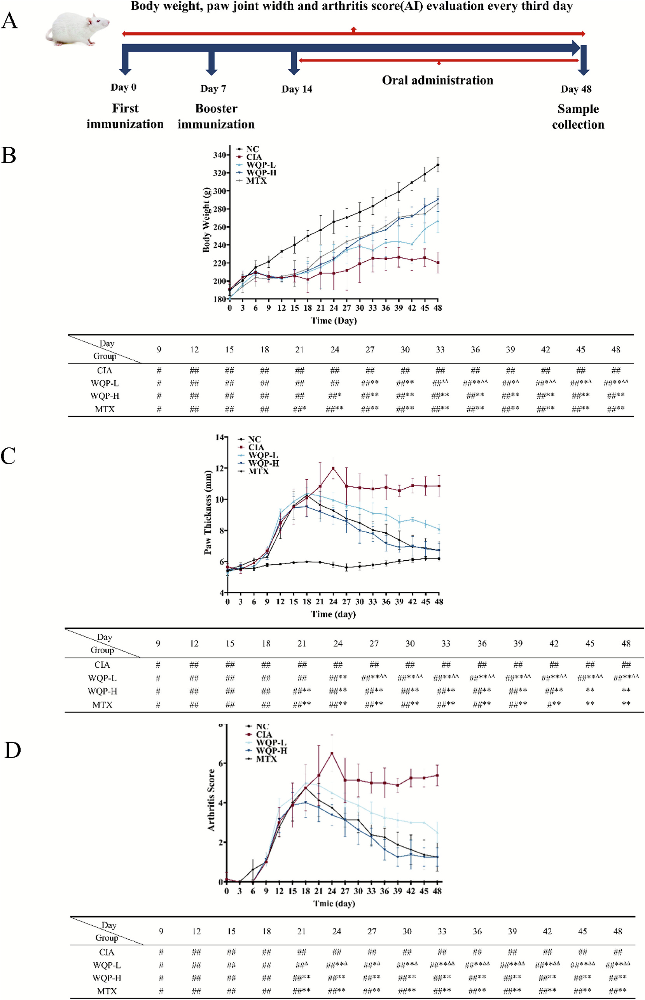
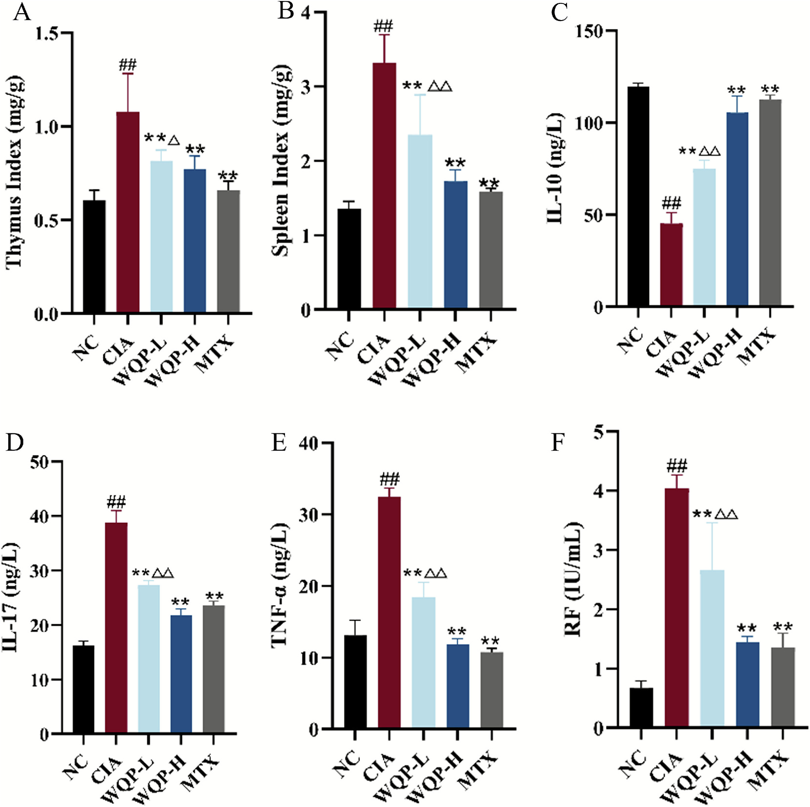
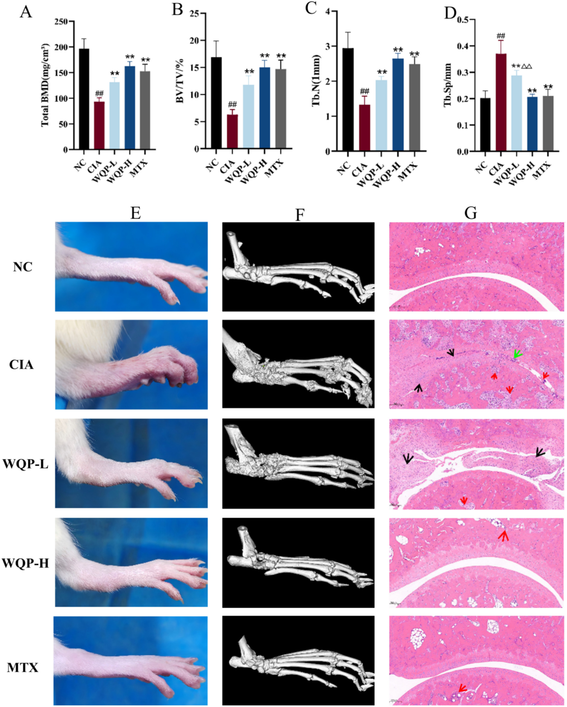
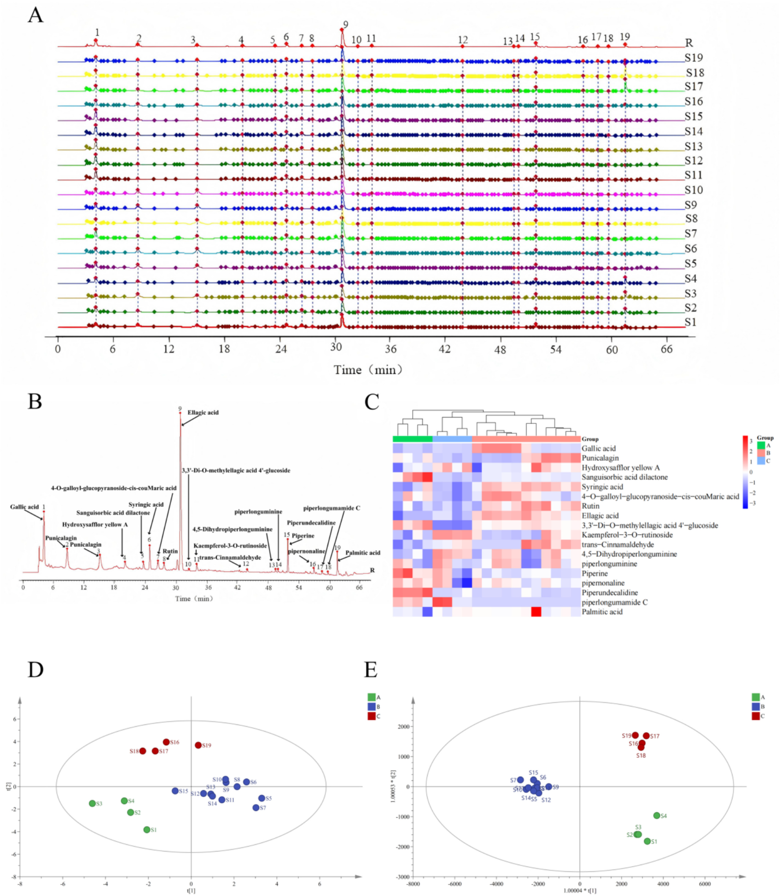
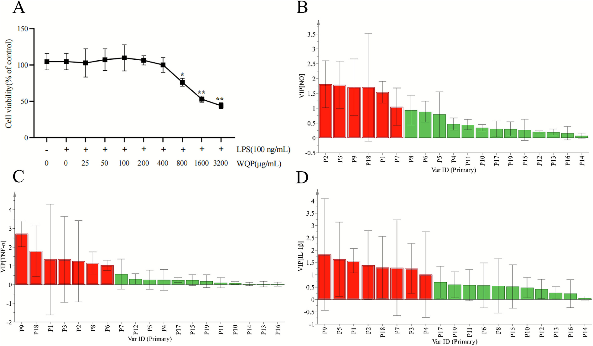
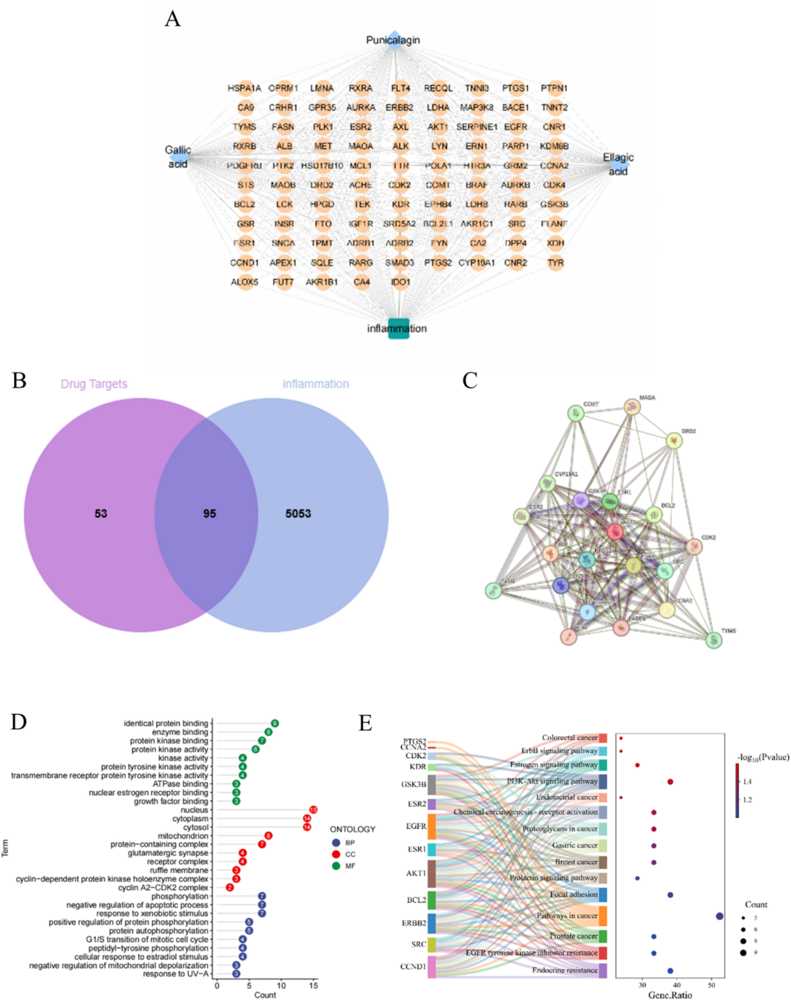
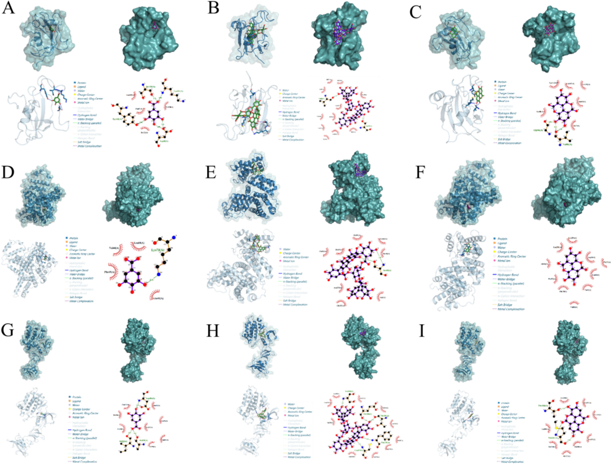
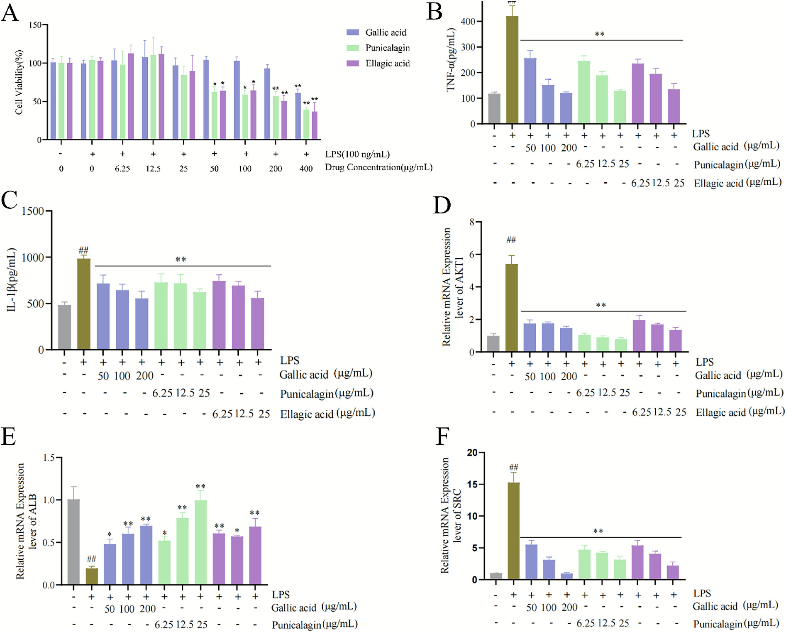

<!-- 方針: ほぼ全訳＋必要に応じた補足。原文構成に沿って訳出。「> 補足:」は訳者注。数値・条件は原文どおり。詳細数表(Table S1〜S7)・補足図(Fig. S1〜S2)は補足資料にあり本文には無いため「原文参照」とする。 -->

## 書誌情報

- 原題: From chemical profiling to bioactivity: Integrating spectrum-effect relationship and activity validation to discover anti-inflammatory markers in Wuwei Qingzhuo Pill
- 著者: Tiantian Shi, Wenhua Yang, Lizhu Yin, Xuena Zhang, Yuewu Wang, Liang Bao, Ren Bu, Jingkun Lu, Tuya Bai, Peifeng Xue*, Xin Dong*（内モンゴル医科大学 薬学部 ほか, 中国・フフホト）
- 掲載: *Journal of Chromatography B* 1269 (2026) 124876（Elsevier）. 受理 2025-11-25. https://doi.org/10.1016/j.jchromb.2025.124876
- インパクトファクター: **2.97**（*Journal of Chromatography B*, JCR 2024 / Clarivate, Q2）
- キーワード: 五味清濁丸 / 抗炎症 / クオリティマーカー / スペクトル-効果関係 / ケモメトリクス解析

> 補足: WQP = 五味清濁丸（Wuwei Qingzhuo Pill、モンゴル医学の伝統処方）。Q-marker = 品質マーカー。スペクトル-効果関係（spectrum-effect relationship）= クロマトグラム上の各ピーク（成分）と薬効指標の相関を数理的に結び付け、「効果に効いている成分」を絞り込む手法。GRA = グレー相関分析、OPLS-DA = 直交部分最小二乗判別分析、VIP = 変数重要度、CIA = コラーゲン誘発関節炎、RA = 関節リウマチ。本論文は分析法（HPLC指紋）＋ケモメトリクス＋薬理検証（in vivo/in vitro）＋in silico（ネットワーク薬理・ドッキング）を統合した研究論文。

## 要旨（Abstract）

成分構成が複雑で単一化合物の定量法だけでは不十分なため、効果指向の品質管理は伝統医療において長年の課題である。本研究では、伝統的なモンゴル医学処方である五味清濁丸（WQP）を研究モデルとして、in vivo の薬理学的検証と包括的な化学プロファイリングを組み合わせた統合的な分析パラダイムを構築した。まず、コラーゲン誘発関節炎（CIA）ラットモデルにおいてWQPが顕著な抗関節炎効果を示し、関節の腫脹・関節炎スコア・骨破壊を著しく減少させることを実証した。続いて化学的特徴付けを行い、19の製造バッチで検証済みのHPLC指紋図譜を確立し、一貫した品質パターンを明らかにした。グレー相関分析（GRA）と直交部分最小二乗判別分析（OPLS-DA）を統合した革新的なスペクトル-効果関係分析を通じて、クロマトグラフィーの特徴と抗炎症効果を相関させることに成功し、**没食子酸・プニカラジン・エラグ酸**を重要なQ-markerとして同定した。これらのマーカーの生物活性は、リポ多糖（LPS）刺激RAW264.7マクロファージにおいてさらに確認され、TNF-α および IL-1β の放出を有意に抑制した。本研究は、WQPの品質評価にHPLC指紋とスペクトル-効果関係分析を組み合わせた初の包括的アプローチであり、従来の品質管理を超える堅牢な手法を提供する。同定されたQ-markerは、効果に基づく品質管理とWQPの標準化に科学的基盤を与え、他の伝統医薬の品質評価にも応用できる可能性がある。

## 1. 序論（Introduction）

伝統モンゴル医学（TMM）の近代化は、根本的な分析上のパラドックスに直面している。すなわち、治療効果が複数成分の相乗効果に由来する一方で、品質管理は還元主義的な単一化合物パラダイムに依存し続けている [1,2]。この断絶は、植物化学的組成の複雑さが従来の品質評価手法の能力を超える天然物研究における最も根深い課題の一つである。生体アッセイガイド分画や標的化合物の定量を含む従来のアプローチは、ホリスティックな効果の基礎となる複雑な植物化学的相互作用を捉えるには本質的に不十分である [3,4]。これらの手法は単一化合物に焦点を当てるため、伝統医療の治療価値に不可欠な相乗効果を見落とす。近代のクロマトグラフィー・分光技術はTMM中の成分を特徴付け・定量する能力を劇的に高め、1試料から数百化合物の同定を可能にしたが [5]、生成データは生物活性から切り離されがちである。例えばUHPLC-MSは抽出物の全化学プロファイルを描けるが、それらの化合物がどう相互作用して疾患関連経路を制御するかは示さない [6]。同様にNMRメタボロミクスはバッチ間の化学変動を区別できるが、それを治療結果の違いに結び付けられない [7]。したがって根本的な課題は技術的限界にとどまらず、「品質」の定義に関する概念上のギャップ（品質を、生物学的効果の一貫性ではなく単離化合物の化学的一貫性と同一視してきたこと）を反映している [8]。

この苦境を鮮明に体現するのが、歴史あるモンゴル医学処方 五味清濁丸（WQP）である。本処方は8〜12世紀に遡る四部医典に記録される。臨床でWQPは胃炎・炎症性腸疾患などの炎症性疾患の治療に有効とされる [9]。WQPは異なる科の5生薬から構成される: Punica granatum L.（ザクロ／石榴, ザクロ科）、Carthamus tinctorius L.（ベニバナ／紅花, キク科）、Amomum kravanh Pierre ex Gagnep.（ビャクズク／白豆蔻, ショウガ科）、Cinnamomum cassia Presl.（ケイヒ／桂皮・肉桂, クスノキ科）、Piper longum L.（ヒハツ／蓽茇, コショウ科）。伝統モンゴル医学の枠組みでは、その作用は「痰を払い、精を活かし、滞りを解消する」メカニズムで説明される [10]。近年の研究はWQP構成生薬の抗炎症特性を探索しており、その効果は生物活性成分に根ざす。主薬（君薬）であるザクロには、プニカラジン・エラグ酸・没食子酸が含まれ、これらは前炎症性メディエーター（TNF-α・IL-1β・IL-6 等）を抑制し、NF-κB や PI3K/AKT 経路を調節する [11–14]。ベニバナは抗酸化・抗炎症成分（サフラワーイエロー、ヒドロキシサフラワーイエローA）を提供し、ビャクズクとケイヒの精油は関節炎/皮膚炎モデルで炎症細胞浸潤を減少させる [15]。ヒハツはピペリンやピペルロングミンを含み、NF-κB依存性サイトカイン発現を下方制御する [16]。

古典的処方であるWQPは、実証された抗炎症特性を持ちつつこの課題を例証する。現行のWQP品質基準は、治療効果が複数生薬の相乗効果から生じるという証拠があるにもかかわらず、限られたマーカー化合物の定量に依存している [10]。このため化学規格を満たすバッチでも治療効果にばらつきが生じ得る状況が生まれ、効果ベースの品質管理パラダイムの必要性が浮き彫りになる。

この限界に対処するため、化学的特徴付けと薬理学的検証を橋渡しする統合戦略を開発した。複数バッチの化学プロファイリングとスペクトル-効果関係分析を組み合わせれば、従来の単一化合物アプローチよりWQPの治療品質をよく表す効果関連Q-markerを同定できると仮定した。本研究の目的は、(1) 複数のWQP製造バッチで検証済みHPLC指紋を確立、(2) スペクトル-効果関係分析で化学的特徴と抗炎症活性を相関、(3) in vitro/in vivo 両モデルで効果関連Q-markerを同定・検証すること、である。

## 2. 材料および方法（Materials and methods）

### 2.1 試薬および材料

代表性確保のため、3つの独立製造業者から19の異なるWQPバッチを調達した（詳細は原文の補足資料 Table S1 参照）。酢酸アンモニウム・ウシII型コラーゲン（CII）・不完全フロイントアジュバント（IFA）は Sigma-Aldrich（米）および Chondrex（米）から入手。メトトレキサート（MTX）は上海上薬信誼薬業（中国）。IL-10・IL-17・TNF-α・IL-1β・リウマトイド因子（RF）のELISAキットは優品生物科技（中国）。認定標準品（ヒドロキシサフラワーイエローA・プニカラジン・シンナムアルデヒド・エラグ酸・ピペリン・没食子酸、いずれも純度 >98%）は中国食品薬品検定研究院（NIFDC, 中国）。RAW264.7マウスマクロファージ細胞株は上海晟北納創聯生物科技（中国）から入手し、武漢Pricella（中国）の培養基（WHAA24K53）で維持。LPS（L8880）・CCK-8 はそれぞれ北京Solarbio・New Cell & Molecular Biotech（中国）。MSグレードのアセトニトリル・エタノール・ギ酸は Fisher Scientific（中国）・天津科密欧（中国）。精製水はMilli-Qシステムで調製。

### 2.2 In vivo 抗炎症効果の評価

#### 2.2.1 使用動物・倫理

雌 Sprague-Dawley ラット40匹（SPFグレード, 8週齢, 180 ± 20 g）を斯貝福（北京）生物技術から入手。制御環境（22 ± 2 ℃, 湿度 55 ± 5%, 12時間明暗）で7日間馴化。全手順は内モンゴル医科大学動物倫理委員会（承認番号 YKD202101184）承認、ARRIVEガイドライン準拠。

#### 2.2.2 CIAモデルの確立・群分け・投与

CIAは day 0 と day 7 にラット尾根部へ 0.2 mL エマルジョン（完全フロイントアジュバント : ウシII型コラーゲン = 1:1, v/v）を皮下注射して誘発。重症度は体重・後肢腫脹容積（plethysmometer）・関節炎指数（AI, 0–16スケール）で3日ごとにモニター [17,18]。初回免疫後14日目に、CIA誘発成功（AI ≥ 4）の32匹を無作為に4群（n = 8）へ: CIA群（5% CMC-Na）、WQP-H群（3.24 g/kg/日, 臨床用量の4倍, 5% CMC-Na懸濁）、WQP-L群（0.81 g/kg/日, 臨床等価量）、MTX群（1 mg/kg を3日ごと）。非免疫の同週齢8匹を正常対照（NC群）とした。全処置を34日間連日1回、経口（胃内）投与（Fig. 1A）。

#### 2.2.3 サンプル採取と生化学分析

最終投与後、安楽死前に腹部大動脈穿刺で採血。遠心分離（3000×g, 15分, 4 ℃）で血清を分離し、−80 ℃保存後、市販ELISAキットで TNF-α・IL-1β・IL-10・RF を測定。

#### 2.2.4 マイクロCTと組織病理

右足首関節を固定し高解像度マイクロCT（MILabs, オランダ）でスキャンし、骨密度（BMD）・骨体積/総体積（BV/TV）・骨梁数（Tb.N）・骨梁分離度（Tb.Sp）を定量。組織学では膝関節を脱灰・パラフィン包埋・5 μm切片とし、H&E染色で滑膜炎症・軟骨損傷・パンヌス形成を評価 [19]。

### 2.3 HPLC指紋と化合物同定

#### 2.3.1 HPLC用試料調製

粉末WQP（40メッシュ, 10.0 g）を精密秤量し、エタノール-水（80:20, v/v）200 mL で1.5時間還流抽出。遠心後、上清を減圧濃縮し凍結乾燥。乾燥抽出物をメタノール-水（80:20, v/v）で既知濃度に再溶解、0.22 μm膜ろ過してHPLC分析に供した。

#### 2.3.2 HPLC・LC-MS/MS条件

分離は Thermo ODS-2 HYPERSIL C18 カラム（250 mm × 4.6 mm, 5 μm）を装着した島津 LC-20 システムで実施。カラム温度 35 ℃。移動相は 0.5% ギ酸水溶液（A）とアセトニトリル（B）、流速 1.0 mL/min、グラジエント: 0–10 min 7%B; 10–30 min 7→20%; 30–45 min 20→45%; 45–60 min 45→100%; 60–70 min 100→7%。注入量 10 μL、検出波長 254 nm。化合物同定では同一条件を Q-Exactive 質量分析計（Thermo Scientific）に接続し、正・負両イオン化モードで測定。MSデータはフルスキャン（m/z 100–1100）とデータ依存性MS2（ddMS2）で取得した。

#### 2.3.3 分析法バリデーションと類似度分析

HPLC法は安定性・再現性・精度（日内/日差）・回収率・定量限界（LOQ）・検出限界（LOD）について厳密に検証した（既報 [20] に準拠）。**全RSDは3%未満**（詳細は原文の補足資料 Table S3 参照）。19バッチのHPLC指紋の類似度は「中薬クロマト指紋類似度評価システム（2012版）」を用い、全バッチの中央値から導いたシミュレート参照指紋に対して評価し、**各バッチとも0.900超**であった。19バッチのWQP煎剤に対応する19共通ピークのピーク面積を、微生信（Wei Sheng Xin, https://www.bioinformatics.com.cn/ ）および SIMCA（ver. 14.1）に投入して多変量解析を実施。特徴ピークには主成分分析（PCA）・クラスター分析（CA）・部分最小二乗判別分析（PLS-DA）の3手法を適用した。

### 2.4 スペクトル-効果関係分析

#### 2.4.1 In vitro 抗炎症活性

全WQPバッチの抗炎症活性を、LPS刺激RAW264.7マクロファージモデルで評価。細胞を各種濃度のWQP抽出物で1時間前処理後、LPS（100 ng/mL）で24時間刺激。培養上清中の NO・TNF-α・IL-1β をそれぞれ Griess反応・ELISA で定量。細胞生存率は CCK-8 で同時評価し、効果が細胞毒性由来でないことを確認した。

#### 2.4.2 グレー相関分析（GRA）とOPLS-DA

GRAは多成分効果を扱いつつ、19共通ピークと薬力学指標の関連を定量化するのに優れる [21]。GRAは SPSSPRO（https://www.spsspro.com/ ）で実施し、各共通ピークのピーク面積（X）と抗炎症指標（Y: NO・TNF-α・IL-1β の阻害率）の間のグレー相関度（γ）を算出。γが高いほど効果への寄与が大きい。続くOPLS-DAは標的関連の変動をノイズから分離し、試料群分けを明確化して主要な薬力学関連ピークをスクリーニングする [22]。OPLS-DA は SIMCA 14.1 で実行し、ピーク面積を独立変数（X）、抗炎症指標を従属変数（Y）とした。VIP > 1.0 の変数を抗炎症活性への重要寄与因子とみなした。

> 補足: ピーク帰属（Fig. 5B–D）は次のとおり。P1 没食子酸(gallic acid) / P2・P3 プニカラジン(punicalagin) / P4 hydroxysafflor yellow A / P5 sanguisorbic acid dilactone / P6 syringic acid / P7 4-O-galloyl-glucopyranoside-cis-coumaric acid / P8 rutin / P9 エラグ酸(ellagic acid) / P10 3,3'-di-O-methylellagic acid 4'-glucoside / P11 kaempferol-3-O-rutinoside / P12 trans-cinnamaldehyde / P13 4,5-dihydropiperlonguminine / P14 piperlonguminine / P15 piperine / P16 pipernonaline / P17 piperundecalidine / P18 piperlongumamide C / P19 palmitic acid。

### 2.5 ネットワーク薬理による標的・経路予測

スペクトル-効果関係分析で同定した候補Q-marker（没食子酸・プニカラジン・エラグ酸）の潜在的標的・機序を予測するために実施した。3成分の経口バイオアベイラビリティ（OB ≥ 30%）とドラッグライクネス（DL ≥ 0.18）を TCMSP（https://old.tcmsp-e.com/tcmsp.php ）で評価。消化管（GI）吸収（≥ 30%）を SwissADME（http://www.swissadme.ch/ ）で確認。化合物標的を SwissTargetPrediction（http://swisstargetprediction.ch/ ）で予測し、標的名を UniProt（https://www.uniprot.org/ ）で標準化。炎症関連標的は GeneCards・OMIM・TTD からキーワード "inflammation" で取得。化合物と炎症の重複標的を Venny 2.1.0 で決定。PPIネットワークは STRING 11.5（種 "Homo sapiens"・信頼性スコア >0.7）で構築。コア標的は degree・closeness・betweenness を基準に Cytoscape 3.6.1 でスクリーニング。GO・KEGG富化分析は DAVID 6.8 で実施（有意水準 p < 0.05）。

### 2.6 分子ドッキングと候補Q-markerのin vitro検証

#### 2.6.1 ドッキング

標的タンパク質の3D構造を Protein Data Bank（PDB）から取得。試験化合物の Canonical SMILES を PubChem から取得し、ChemDraw 20.0 で3D構造を構築・結合エネルギー最小化。分子ドッキングは AutoDockTools 15.6、結果解析は PyMOL で実施した。

#### 2.6.2 細胞による効果検証

スペクトル-効果分析で同定した候補化合物（没食子酸・プニカラジン・エラグ酸）の抗炎症効果を LPS刺激RAW264.7 で検証。非細胞毒性濃度で1時間前処理後、LPS（100 ng/mL）で24時間刺激。用量は **没食子酸 50/100/200 μg/mL、プニカラジン・エラグ酸 6.25/12.5/25 mg/mL**（それぞれ低/中/高）。TNF-α・IL-1β を ELISA で測定。

#### 2.6.3 RT-PCRによる予備的機序検討

ネットワーク薬理の予測を実験的に検証するため、候補Q-markerとLPSで処理したRAW264.7で、コア標的遺伝子（AKT1・SRC・ALB）の mRNA発現を RT-PCR で測定。全RNAを抽出・逆転写し qPCR に供した（プライマー配列は原文の補足資料 Table S2 参照）。

### 2.7 統計解析

GraphPad Prism 8.0 を使用。結果は平均値 ± 標準偏差（x̄ ± s）で表す。2群間は対応のない両側 Student's t検定、3群以上は一元配置ANOVA後に Dunnett の事後検定でLPS刺激対照群と比較。有意水準は p < 0.05（*）、p < 0.01（**）とした。

## 3. 結果（Results）

### 3.1 WQPはCIAモデルで関節リウマチの重症度を改善する

CIAモデルは正常に確立され、day 12 で NC に対しモデル群の関節炎スコアが有意上昇した（p < 0.01）。day 12 に開始したWQP・MTX治療は、未治療CIAで観察された関節炎スコアの進行性上昇を著しく抑制し、day 21 までに実質的抑制が明らかになった。WQPまたはMTX投与は day 24 までにCIA群比で体重を有意増加させた（p < 0.05; Fig. 1B）。34日間の治療後、WQP群・MTX群とも関節炎指数（AI, 0–16）と足の厚さが大幅に改善した（Fig. 1C-D）。同時にWQP治療は免疫器官指数を有意に調節し（Fig. 2A-B）、血清サイトカインを変化させ、IL-17・TNF-α・RF を低下させる一方で抗炎症性 IL-10 を上昇させ（Fig. 2C-F）、足・足首の紅斑と浮腫が目に見えて減少した（Fig. 3E）。

マイクロCT評価では、CIAラットで関節腔の拡大・不規則な骨表面・BMD/BV/TV/Tb.Nの有意低下・Tb.Spの増加という著しい骨微細構造の悪化が示された。WQP介入はこれらを顕著に緩和し、関節の完全性向上・骨侵食の軽減・骨微細構造パラメータの有意改善をもたらした（Fig. 3A-D, F）。WQP-H群はMTX群と同等の治療結果を示した。組織病理でもこれを裏付け、NCラットで関節軟骨構造が保存される一方、CIAラットは顕著な炎症細胞浸潤・血管新生・パンヌス形成を示し、これらは全介入群で薬物治療後に実質改善した（Fig. 3G）。総じてWQPはCIAモデルの疾患重症度を効果的に緩和し、その抗RA特性が確認された。

### 3.2 化学指紋と多変量解析がバッチ間の一貫性を示す

厳密なバリデーションにより、確立したHPLC指紋プロトコルの信頼性が確認された。安定性・再現性・精度（日内/日差）・回収率・LOQ・LODの全RSD値が3%未満にとどまり（詳細は原文の補足資料 Table S3 参照）、頑健な分析性能を示した。19の独立WQPバッチのHPLC指紋は、導出した中央値参照指紋に対し高い類似度指数（各 >0.900）を示し（Fig. 4A、詳細は原文の補足資料 Table S1 参照）、一貫した製造品質管理を示した。クロマト分析で、90%超の試料に存在し総ピーク面積の1%超を占める19共通ピークを同定（Fig. 4B）。これら共通ピークの構造帰属は、認定標準品と HPLC-Q-Exactive-MS/MS で行った（詳細は原文の補足資料 Table S4 参照）。

多変量ケモメトリクスは品質均一性への深い洞察を与えた。CA（クラスター分析）は連結距離15で19バッチを生産起源と相関する3クラスターに分類（Fig. 4C）。PCAは群内変動を、PLS-DAは群間分化を示した（Fig. 4D-E）。モデルの頑健性は順列検定（R²Y = 0.975, Q² = 0.979; 詳細は原文の補足資料 Fig. S1 参照）で確認。続くVIP分析で、バッチ判別に寄与する VIP > 1 の6識別成分（エラグ酸・没食子酸・プニカラジンを含む）が特定された（詳細は原文の補足資料 Fig. S2 参照）。

### 3.3 スペクトル-効果相関が効果関連Q-markerを解明する

WQP曝露は濃度依存的に細胞生存率へ影響し、低濃度では細胞毒性がなく、800 μg/mL で有意低下が観察された（Fig. 5A）。そこで細胞毒性の干渉なく抗炎症活性を評価するため、以降のアッセイには 400 μg/mL を採用した。LPS活性化RAW264.7で、WQP処理は重要な炎症メディエーターの生成を有意に抑制し、NO・IL-1β・TNF-α を抑えた（詳細は原文の補足資料 Table S5 参照）。これは前炎症性サイトカイン放出の減弱を介したWQPの抗炎症効率を裏付ける。

スペクトル-効果関係モデリングは薬理活性成分をさらに解読した。GRAは19共通ピークのうち18ピークと抗炎症効果の間に強い関連（相関係数 >0.75）を示し（詳細は原文の補足資料 Table S6 参照）、相乗的な多成分機序を示唆した [23]。OPLS-DAは VIP > 1 のピークを抗炎症活性への主要寄与因子と指定した [24]。中でも **P1（没食子酸）・P2/P3（プニカラジン）・P9（エラグ酸）** が最も実質的な寄与を示した（Fig. 5B-D）。

### 3.4 ネットワーク薬理はPI3K-Akt経路のAKT1/SRC/ALBを示唆する

ネットワーク薬理により、化合物関連標的（PharmMapper・SwissTargetPrediction・Super-PRED 由来の148標的）と炎症関連標的（疾患DB由来の5148標的）の交差から、95の潜在的抗炎症タンパク質標的を同定（Fig. 6A-B）。PPIネットワーク構築とトポロジー解析により、主要ネットワークパラメータ（degree 93.94・closeness 0.0055・betweenness 16.60）に基づき21のコア標的を同定した（Fig. 6C）。機能富化分析では、リン酸化・アポトーシスの負の制御などの生物学的プロセス、同一タンパク質結合・酵素結合などの分子機能、核・細胞質などの細胞構成要素への有意な関与が示された（Fig. 6D）。KEGG富化ではエストロゲンシグナル経路とPI3K-Aktシグナル経路が有意に代表された（Fig. 6E）。

分子ドッキングは、3候補活性化合物とコア標的タンパク質（**AKT1: PDB 8R5K, ALB: PDB 6YG9, SRC: PDB 1Y57**）の安定な結合相互作用を確認した。良好な計算結合エネルギーが、予測機序枠組みでのそれらの機能的役割を支持した（詳細は原文の補足資料 Table S7 および Fig. 7A-I 参照）[25]。

### 3.5 機能アッセイがQ-markerのAKT1/SRC/ALB経由の抗炎症を確認する

没食子酸・プニカラジン・エラグ酸がLPS誘発炎症にどう影響するかを調べるため、LPS活性化RAW264.7を各種濃度の化合物に曝露し炎症度を測定。抗炎症効果が細胞毒性由来でないことを排除する細胞毒性試験を行い（Fig. 8A）、これに基づき没食子酸は 50/100/200 μg/mL、プニカラジンとエラグ酸は 6.25/12.5/25 mg/mL を低/中/高用量として用いた。3化合物はいずれもLPS誘発の TNF-α・IL-1β 増加を減少させ（Fig. 8B-C）、AKT1・ALB・SRC の mRNA発現を用量依存的に低下させた（Fig. 8D-F）。以上より、Q-markerは AKT1/SRC/ALB の下方制御を介して TNF-α/IL-1β を阻害し、抗炎症効果を発揮することが確認された。

## 4. 考察（Discussion）

伝統モンゴル医学製剤であるWQPは、関節リウマチ（RA）の緩和・骨再生の補助・骨形成促進・炎症反応の緩和で有意な治療効果を示す。RAは進行性滑膜炎を特徴とする慢性自己免疫疾患であり、一連の病理学的イベント（炎症の引き金→滑膜過増殖→TNF-αやIL-17などの前炎症性サイトカイン放出、IL-10などの抗炎症性因子）が関与する [26]。モデル作成後、CIAラットは複数関節で腫脹・紅斑を示し、病理切片は滑膜過形成・パンヌス形成・軟骨侵食・骨破壊を示す。これらはRA患者の関節病変進行と完全に一致し、本モデルは治療薬のプレクリニカル研究で重要な価値をもつ [27,28]。本研究はWQPがCIAラットの上記病変を緩和できることを確認し、抗RA効果の標的指向性と信頼性を検証した。

19バッチの化学統計評価で類似度指数が一貫して0.9超であり、製造再現性の高さが強調された。ただし構成成分プロファイルへの地域・環境要因の潜在的影響（例: 栽培地域によるザクロのエラグ酸含量の変動 [29–31]）は将来の品質評価で考慮すべきである。より厳格な調達管理や地域特異的な品質基準の導入は、バッチ間均一性と治療の信頼性をさらに高めうる [32]。

RAW264.7細胞の酸化還元バランス障害による異常な抗原提示は、より重篤なラット関節炎をもたらしRA進行に重要な役割を果たす [33]。高濃度のTNF-α・IL-1βなどの前炎症性サイトカインは相互作用して炎症カスケードを誘発し関節破壊を加速する [34–36]。WQPの抗炎症特性は、先天性免疫応答・炎症スクリーニングの確立モデルであるLPS刺激RAW264.7を用いてin vitroで実証された [37,38]。WQPはNO・TNF-α・IL-1βの分泌を有意に抑制し、RAに関連する初期炎症過程の調節における役割を支持した。

スペクトル-効果関係分析により、君薬であるザクロ由来の没食子酸・プニカラジン・エラグ酸が主要な抗炎症成分として同定された。これは複合処方の主要成分に中心的治療効果を帰属させる伝統的「君臣佐使」の原則と共鳴する [39]。ただしベニバナなど臣・佐薬の潜在的寄与も見落とすべきでなく、例えばベニバナ由来フラボノイドは腸管バリア完全性を支え全身性LPS転位を減らし、WQPの抗炎症効果を間接的に高めうる [40]。多生薬成分間の相互作用は、分画処方や比較薬力学研究でのさらなる調査が必要である。

ネットワーク薬理と分子ドッキングは、PI3K-Aktシグナル経路が中心機序であることを示唆し、3つのQ-markerと AKT1・SRC・ALB を含む主要標的の高親和性相互作用を同定した。AKT1はマクロファージの炎症・酸化ストレス応答の重要な制御因子で、その阻害はWQPの酸化還元調節効果を裏付けうる [41–43]。LPS刺激下で活性化するSRCキナーゼはPI3K-Aktの上流モジュレーターで、その転写低下は、SRCリン酸化を抑制するプニカラジンの既知の役割と一致する [44–46]。急性期反応物質とされるALBも前炎症性メディエーターの隔離を介して抗炎症効果を発揮しうる [47]。観察されたALBの上方制御はWQP機序の多面的役割を示唆する。これらは既報と一致する（没食子酸はAKT1活性を調節しサイトカイン放出を抑制 [48,49]、プニカラジンはPI3K-Akt阻害でTNF-α産生を減弱 [46]、エラグ酸は炎症下でAktリン酸化を抑制 [50]）。ただし経路調節は文脈依存的でありうる（エラグ酸は特定の癌モデルでPI3K-Aktを活性化する [51]）ため、細胞型・疾患特異的な検証が重要である。なお in silico 予測ツールとしてのネットワーク薬理は既存DB・アルゴリズムに依存し、生物系の動的複雑性を完全には捉えられず、in vivo 薬物動態（ADME）や時間依存的な多成分・多標的相互作用を再現できず、予測された高親和性結合には直接的な実験的検証を欠く。これらの限界は、in silico 予測を信頼できる機序的洞察とするための追試（共免疫沈降・経路阻害剤実験など）の必要性を示す。

In vitro 検証で候補Q-markerがNO・TNF-α・IL-1β放出を用量依存的に阻害し、AKT1・SRC・ALB発現を調節することが確認された。ただし in vivo でのバイオアベイラビリティ・代謝を考慮する必要がある。例えばプニカラジンは腸内細菌でウロリチンAへ加水分解され、多様な腸内細菌群を刺激して生物活性を発揮しうる [52] ため、代謝物が全身効果に大きく寄与する可能性がある。したがって親化合物と誘導体の役割を区別するには、将来の薬物動態・代謝物同定研究 [53] が不可欠である。

結論として、本研究はWQPの抗関節炎効果を実証し、没食子酸・プニカラジン・エラグ酸がPI3K-Akt経路の調節を介して作用する重要なQ-markerであることを同定した。伝統的使用を裏付ける一方、適応免疫モデルの統合・多生薬相乗効果の解明・代謝物薬理の特徴付けといった課題も示された。これらへの対処はRA管理でのWQPの適用性を強化し、伝統モンゴル医学の近代化の広範な取り組みに寄与する。

## 5. 結論（Conclusion）

本研究は、WQPの抗炎症Q-markerとして没食子酸・プニカラジン・エラグ酸を同定する統合的スペクトル-効果関係戦略を確立し、複数バッチの化学的一貫性を in vivo 抗関節炎効果と相関させた。さらにこれら化合物が AKT1/SRC/ALB を標的とする PI3K-Akt 経路の調節を介して炎症を緩和することを実証した。これらの知見はWQPの伝統的使用を検証するだけでなく、複雑な伝統医薬の品質評価・標準化のための頑健で効果指向のアプローチを提供する。

## 訳者補足（実務的示唆）

> 以下は原文の主張ではなく、実務者向けの整理（訳者注）。

- **「効果指向のQC」への発想転換**: 本論文の要点は、指紋（プロファイル一致性）だけ・単一指標成分だけでは「効いているか」を保証できないという問題に対し、**各ピーク（成分）と薬効指標の相関（スペクトル-効果関係）を統計的に取って、効果に効いている成分をQ-markerに選ぶ**という設計。規格成分を「量が測りやすいから」ではなく「効果に寄与するから」で選ぶ考え方は、処方製剤の規格設定を見直す際の参考になる。
- **手法の組み合わせ**: HPLC指紋（19共通ピーク・類似度>0.900・全RSD<3%）→ GRA（19中18ピークが相関>0.75）→ OPLS-DA（VIP>1）でP1没食子酸・P2/P3プニカラジン・P9エラグ酸に絞り込み → ネットワーク薬理・ドッキング・RT-PCRで機序（PI3K-Akt / AKT1・SRC・ALB）を確認、という多段の裏取り。分析QCと薬理を橋渡しするワークフローの実例。
- **数値の所在**: 検量線・LOD/LOQ・回収率などの個票、19共通ピークの帰属表、GRAのγ値、ドッキングの結合エネルギーは本文になく補足資料（Table S1〜S7・Fig. S1〜S2）にある。規格化の根拠数値が要る場合は原文の Supporting Information（https://doi.org/10.1016/j.jchromb.2025.124876 ）を参照。
- **限界（原文も明記）**: ネットワーク薬理・ドッキングはin silico予測で直接的な実験検証を欠く点、プニカラジン等は腸内代謝（ウロリチンA）を受けるため親化合物の血中挙動と効果が乖離しうる点に注意。Q-markerとして採用する場合も、実試料での定量法確立（本論文は帰属・相関中心で、各成分の実含量mg/g等は主対象でない）は別途必要。
