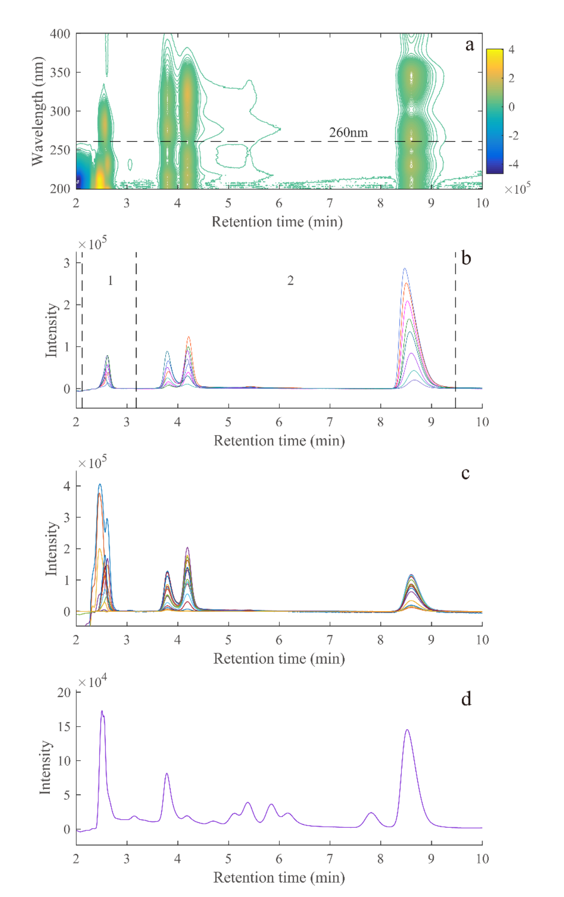
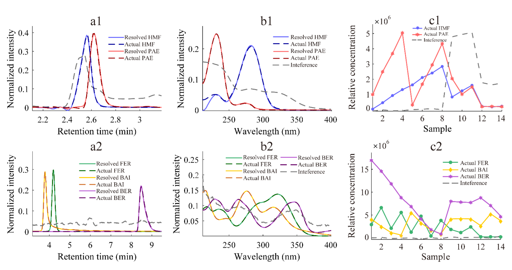
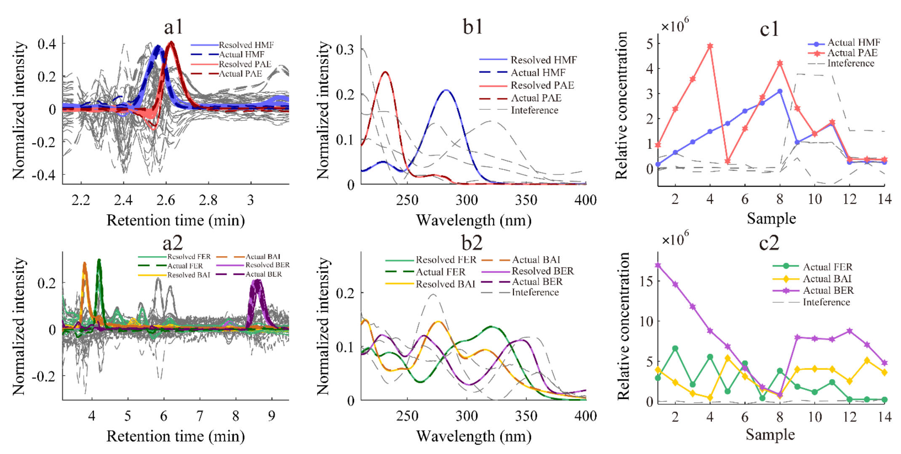

<!-- 方針: ほぼ全訳＋必要に応じた補足。原文構成に沿って訳出。「> 補足:」は訳者注。 -->

## 書誌情報

- 原題: High-Performance Liquid Chromatography–Diode Array Detection Combined with Chemometrics for Simultaneous Quantitative Analysis of Five Active Constituents in a Chinese Medicine Formula Wen-Qing-Yin
- 著者: Jun-Chen Chen, Hai-Long Wu（責任著者）, Tong Wang（責任著者）, Ming-Yue Dong, Yue Chen, Ru-Qin Yu（湖南大学 化学化工学院・化学/生物センシングとケモメトリクス国家重点実験室、中国・長沙）
- 掲載: *Chemosensors* 10 (2022) 238（Article, オープンアクセス CC BY 4.0）. https://doi.org/10.3390/chemosensors10070238
- インパクトファクター: **約3.5**（*Chemosensors*, MDPI／JCR目安。分析化学・センサー分野）
- 受理経過: 受領 2022-05-24 / 受理 2022-06-21 / 公開 2022-06-23
- 資金: 中国国家自然科学基金（No. 22174036, 21775039, 21575039）

> 補足（この解説の位置づけ）: 本研究の主役は分離カラムではなく**アルゴリズム**です。従来のHPLCが「物理的にピークを完全に分けきる」ことを目指すのに対し、本研究は**わざと分けきらず、重なったデータを数学（二次校正）で解く**という発想を採ります。当サイトの他の解説で扱う PLS・MCR・多変量校正の、クロマトグラフィーへの具体的応用例です。

## この論文が解く問題

漢方（伝統中国医薬, TCM）は多成分の集合体で、有効成分の含量が品質と効果を左右します。したがって有効成分の含量をモニタリングする方法が重要です。ところが従来のHPLCで多成分を「きれいに」定量しようとすると、次の壁にぶつかります。

- **完全分離のための煩雑な前処理**と、**長い溶出時間**（既報では1回の分析に30分超）。
- 実試料ごとに変わる**未知の妨害（バックグラウンド）**。
- **ベースラインのずれ（baseline shift）**と**保持時間のずれ（time shift）**が定量精度を損なう。

本研究は、HPLC-DAD（ダイオードアレイ検出）で得られる情報豊富なデータに、**二次校正（second-order calibration）**という手法を組み合わせ、これらの問題を「数学的分離」で回避します。狙いは、**完全分離に頼らず・短時間で・妨害があっても**、方剤中の5成分を正確に同時定量することです。

## 対象：温清飲（Wen-Qing-Yin, WQY）と指標5成分

温清飲は、**黄連解毒湯（Huang-Lian-Jie-Du-Tang）**と**四物湯（Si-Wu-Tang）**を合わせた方剤で、当帰・白芍・熟地黄・川芎・黄連・黄芩・黄柏・山梔子から構成されます。主要成分はアルカロイド・フラボノイド・テルペン配糖体・イリドイド配糖体で、抗酸化・抗潰瘍・抗炎症・抗菌・抗がん活性が報告され、婦人科出血性疾患・皮膚疾患・再発性アフタ性潰瘍などに用いられます。

本研究が定量する指標成分は次の5つ（略号は原文どおり）:

| 略号 | 成分名（日本語） | 由来・分類 |
|---|---|---|
| HMF | 5-ヒドロキシメチルフルフラール | 加工・加熱で生成する糖分解物（血虚関連の指標） |
| PAE | ペオニフロリン（芍薬苷） | 白芍由来のモノテルペン配糖体 |
| FER | フェルラ酸 | 当帰・川芎由来のフェノール酸 |
| BAI | バイカリン（黄芩苷） | 黄芩由来のフラボノイド配糖体 |
| BER | ベルベリン（小檗鹼） | 黄連・黄柏由来のアルカロイド |

> 補足: 各成分の物理化学情報は原文の補足資料 Table S1 に、5成分は「多様な化学クラス（フェノール酸・配糖体・アルカロイド）」にまたがるため、1回の分析で同時に測るのは本来難しい対象です。

## 方法

### クロマトグラフィー条件

- 装置: 島津 LC-20AT（ダイオードアレイ検出器・四元ポンプ・20 µL ループ）
- カラム: WondaSil™ C18（5 µm, 200 mm × 4.6 mm）、カラム温度 30 ℃、カラム圧 6.7 MPa
- 流速: 1.00 mL/min、注入量 20 µL
- 移動相: 0.1% ギ酸水溶液（A）／アセトニトリル（B）。**30% B のアイソクラティック（等組成）溶出**で、全成分が**10分以内**に溶出。ギ酸（最適 1.0 mL/L）を水相に加え分離能とピーク対称性を改善。

### 試料

- 実試料: 市販の温清飲3社品（いずれも台湾。Sun Ten・Kaiser・Sheng Chang を Q01〜Q03 と表記）。粉末1.00 gをメタノール10 mLに溶かし、30分超音波抽出→12時間静置→0.22 µm ナイロンフィルターで濾過。
- 検量線試料（C01〜C08）: 作業標準液をメタノールで希釈。共線性（成分間の相関）を減らすため**均一計画 U8\*(8⁵)** で濃度を設計。
- 添加回収試料（P01〜P06）: 実試料に既知量を添加。実試料中のBAI・BERはHMF・PAE・FERよりずっと高濃度のため、HMF/PAE/FER検出用は20倍希釈（P01–03）、BAI/BER検出用は50倍希釈（P04–06）と2段階で調製。

### 理論：三線成分モデルと「三次元データ」

各試料からは、**溶出時間 I 点 × 波長 J 点**の2次元データ行列が得られます。全 K 試料を同条件で測り、試料方向に積み重ねると、**三次元配列 X（I × J × K）**になります。これは次式で表せます。

> `x(ijk) = Σ[n=1..N] a(in)·b(jn)·c(kn) + e(ijk)`

- N は因子（factor）の総数＝目的成分＋共溶出する妨害＋バックグラウンド＋ベースラインのずれ＋ノイズ。
- A（I×N）＝正規化クロマトグラム行列、B（J×N）＝正規化UVスペクトル行列、C（K×N）＝相対濃度行列、E＝残差。

> 補足（なぜ「三次元」だと強いのか＝二次の利点）: 各成分は「固有のクロマト形状（溶出プロファイル）」と「固有のUVスペクトル」という**2つの指紋**を持ちます。データを時間×波長×試料の三次元にすると、この2指紋の組み合わせが各成分ごとに一意になり、**未知の妨害が混ざっていても目的成分だけを抜き出せます**。これが「二次校正（second-order calibration）」がもつ **二次の利点（second-order advantage）**で、著者らはこれを「数学的分離（mathematical separation）」と呼びます。物理的に分けきれなくても、計算で分けられる、というわけです。

### アルゴリズム① ATLD（交替三線分解）

ATLD（alternating trilinear decomposition, Wu ら 1996/1998）は、**推定因子数に鈍感**で**収束が速い**アルゴリズムです（スライス行列の三線構造を使う）。HPLC-DAD・LC-MS など大規模データの処理に向きます。特長として、

- **因子数を増やすことでバックグラウンドを近似**でき、ベースラインのずれを「妨害の一部」として除去できる。
- **軽い保持時間シフトは許容**できる（ただし深刻なシフトには不向き）。

特異値分解に基づくMoore–Penrose一般化逆行列を用いて、3つの目的関数 σ(A)・σ(B)・σ(C) を交互に最小化し、定性行列（A・B）と相対濃度行列（C）を求めます（式2〜4）。

### アルゴリズム② ATLD-MCR

ATLD-MCR（Wang ら 2019）は、**液体クロマトデータの保持時間シフト問題を解ける**新しいアルゴリズムです。手順は、(1) まずATLDでシフトのあるデータを近似し、初期スペクトル行列 B(ini) を得る、(2) MCR（多変量曲線分解）戦略で各試料の保持時間プロファイル行列 A(k) を最小二乗で求める、(3) 定性情報（A(k)・B）と定量情報（C）を得る（式5〜7）。要するに、**試料ごとに少しずつずれるピーク位置を個別に合わせ込みつつ、二次の利点を保つ**手法です。

## 結果と考察

### なぜ従来分離では難しいか（Figure 1）

5成分は10分以内に溶出し各ピークは鋭いものの、**HMFとPAEは急速溶出時に激しく重なり**（見かけ上1本のピークにしか見えず、溶媒ピークの影響も大）、**FERとBAIも共溶出**します。実試料（d）では未知成分・妨害が目的ピークに重なります。つまり**古典的HPLCだけでは満足な普遍的分離は難しい**——ここで HPLC-DAD ＋ 二次校正の出番になります。なお同日測定では明瞭なピークずれ・深刻な時間シフトは見られませんでした（b）。

分析では、無効な情報を除き分解能を上げるため、溶出時間で**2つの部分領域**に分割しています。第1領域にHMF・PAE、第2領域にBAI・FER・BERを置き、各領域で推定因子数 N（目的成分＋妨害信号の数）を設定しました（詳細は補足 Table S3）。

### 2手法による成分の分離復元（Figure 2・3）

ATLD・ATLD-MCRのいずれでも、**溶媒ピーク・ピーク重なり・未知成分の共溶出があっても**、情報豊富なHPLC-DADデータ配列から各成分の純クロマトグラム・純スペクトルをうまく抽出でき、復元プロファイルは実際のプロファイルとよく一致しました。特に、保持時間が近く溶媒ピークの妨害を受けるHMFとPAEでも満足な定性結果が得られています。

### 正確さと精度（Table 1）

相対濃度 C を実濃度に対して回帰する（擬一変量検量線）ことで、未知試料中の絶対濃度が求まります。

**Table 1. 添加予測試料（P01–06）での5成分の正確さ（ATLD／ATLD-MCR）**

| | HMF | PAE | FER | BAI | BER |
|---|---|---|---|---|---|
| **ATLD** 相関 r | 0.9991 | 0.9993 | 0.9996 | 0.9969 | 0.9978 |
| 平均回収率±SD (%) | 94.7±2.5 | 91.8±5.0 | 93.9±3.5 | 104.3±9.7 | 112.5±5.1 |
| RMSEP (µg/mL) | 0.20 | 2.07 | 0.38 | 3.94 | 4.05 |
| **ATLD-MCR** 相関 r | 0.9992 | 0.9995 | 0.9993 | 0.9985 | 0.9973 |
| 平均回収率±SD (%) | 93.3±1.4 | 92.4±5.7 | 88.6±3.5 | 101.6±9.9 | 96.8±10.3 |
| RMSEP (µg/mL) | 0.30 | 1.85 | 0.69 | 3.04 | 1.53 |

（r＝相関係数、AVG±SD＝平均添加回収率±標準偏差、RMSEP＝予測の相対二乗平均平方根誤差）

ATLDでは回収率91.8–112.5%（SD<9.7%）、r 0.9969–0.9993、RMSEP<4.05。ATLD-MCRでは r 0.9973–0.9995、RMSEP<3.04、回収率88.6–101.6%（SD<10.3%）。両者は近い結果ですが、**ATLD-MCRのRMSEPは小さく**、いずれの回収率も許容範囲でした。

### 再現性（Table 2）と性能指標

同一バッチの実試料を同日3回・連続3日で測り、日内・日間精度（RSD%）を求めました。**日間再現性はATLD-MCRがATLDより良好**でした。とりわけ**ベルベリン（BER）は、ATLDでの日間RSDが40.8%**と大きく悪化——これは連続日測定で生じた深刻な保持時間シフトのためです（補足 Figure S1）。最初の4成分は急速溶出のため軽い時間ドリフトはATLDが妨害として除去できましたが、**最後に溶出するBERのシフトは別アルゴリズム（ATLD-MCR）で解く必要**がありました。ATLD-MCRではBERの日間RSDは0.9%まで改善しています。

性能指標（Table 2）では、感度 SEN は ATLD で 1.04×10⁴〜1.24×10⁵、ATLD-MCR で 7.74×10³〜7.93×10⁴（mAU·mL/µg）、選択性 SEL は ATLD 0.20–0.56／ATLD-MCR 0.13–0.35。SELが低めなのはピーク重なりと未知妨害の影響が大きいためです。検出限界 LOD は ATLD 0.07–11.67／ATLD-MCR 0.22–4.53（µg/mL）。ATLDのBERのLODは検量線最低濃度を下回っており（時間シフトの影響）、その点でもATLD-MCRの結果の方が妥当でした。

### 2手法の統計的比較

対応のある両側t検定では、HMF・PAE・FER・BAIの p 値は 0.358・0.258・0.063・0.332で**有意差なし**。一方 BER は p=0.001 で、保持時間シフトの影響により有意差が出ました。結論として——**溶出時間が十分短く保持時間シフトが軽微なら ATLD を直接使え**、良好な再現性が得られます。**保持時間シフトが深刻なら ATLD-MCR** がその影響をうまく処理し、HPLC-DADによる主要有効成分の正確な定量を助けます。実際、他の2社の市販温清飲品にはATLD-MCRを適用しています（補足 Table S6）。

## 結論

HPLC-DAD と二次校正を組み合わせることで、温清飲中の5成分を**同時・迅速**に定量できました。全成分が検量線範囲で良好な直線性を示し、軽い時間シフトを含むデータには高感度・省時間で対応、深刻な時間シフトには ATLD-MCR が適切に対処しました。温清飲を例に、本戦略が**方剤（漢方）の有効成分定量と品質モニタリングの信頼できるツール**になりうることが示されました。

## 訳者補足（要点と漢方QCへの示唆）

- **「分離を計算に肩代わりさせる」発想**: 本研究の核心は、クロマトで**完全分離せず**（10分アイソクラティック）に、重なったデータを**二次校正で数学的に分離**する点です。前処理と分離時間を削れるので、多成分の方剤を数を絞らずに素早く測りたい品質モニタリング用途と相性が良い。当サイトで扱う QAMS（1標準で多成分定量）とは別方向の「省力化」アプローチとして対比すると理解しやすい。
- **ATLD と ATLD-MCR の使い分け**が実務メッセージ: 保持時間のずれが軽ければ ATLD（速い・因子数に鈍感）、深刻なら ATLD-MCR（試料ごとにピーク位置を合わせ込む）。**最後に溶出する成分ほど時間シフトの影響を受けやすい**（本例のベルベリン）ため、遅く出る成分がある系では ATLD-MCR を選ぶ、という指針になる。
- **統計の読みどころ**: 相関係数 r で直線性、回収率±SD で正確さと分散、RMSEP で予測誤差、LOD/LOQ で検出・定量の下限、SEN/SEL で感度・選択性、RSD% で再現性、対応のあるt検定で2手法の差——と、多変量校正の性能を評価する一式が揃っています。統計検定2級からの橋渡しとしては「単回帰（検量線）＋分散の指標（SD/RSD）＋2群の差の検定（対応のあるt検定）」に、多変量特有の SEN/SEL/二次の利点が乗った構成、と捉えると読みやすい。
- **数値の扱い**: 本文・Table 1／2 の値は原文どおり転記。補足資料（Table S1〜S6, Figure S1）は本体PDFに含まれないため、詳細は原文（Supporting Information）参照。
