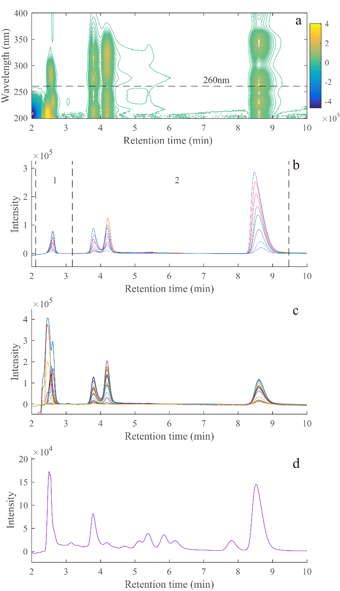
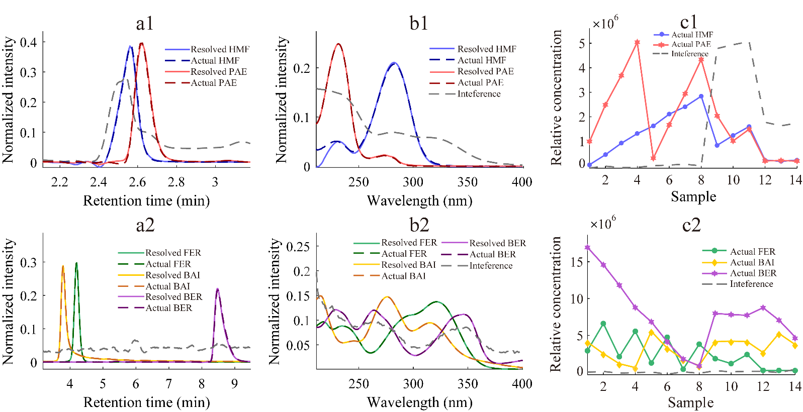
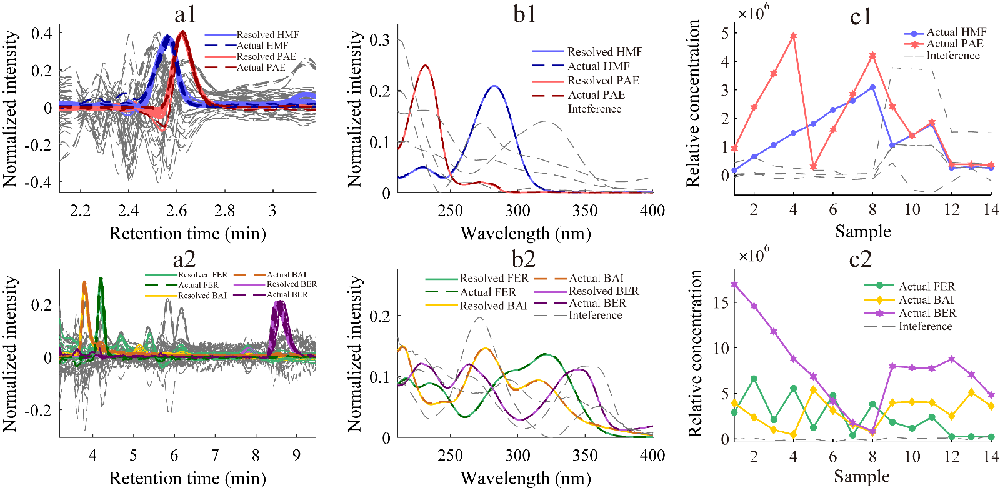

<!-- 方針: ほぼ全訳＋必要に応じた補足。原文構成に沿って訳出。「> 補足:」は訳者注。 -->

## 書誌情報

- 原題: High-Performance Liquid Chromatography–Diode Array Detection Combined with Chemometrics for Simultaneous Quantitative Analysis of Five Active Constituents in a Chinese Medicine Formula Wen-Qing-Yin
- 著者: Jun-Chen Chen, Hai-Long Wu\*, Tong Wang\*, Ming-Yue Dong, Yue Chen, Ru-Qin Yu（State Key Laboratory of Chemo/Biosensing and Chemometrics, College of Chemistry and Chemical Engineering, Hunan University, 中国・長沙）
- 掲載: *Chemosensors* 2022, 10, 238. https://doi.org/10.3390/chemosensors10070238（オープンアクセス, CC BY 4.0）
- インパクトファクター: **3.7**（*Chemosensors*, JCR 2023 / Clarivate。MDPI公式アカウントが2024年7月に発表した数値。Instruments & Instrumentation分野でQ1）
- 受理経過: 受領 2022-05-24 / 受理 2022-06-21 / 公開 2022-06-23
- 資金: 中国国家自然科学基金（No. 22174036, No. 21775039, No. 21575039）

> 補足: WQY（Wen-Qing-Yin）は、日本の漢方でよく知られる「**温清飲**（うんせいいん）」と同一処方。原文にある通り、黄連解毒湯（Huang Lian Jie Du Tang）と四物湯（Si Wu Tang）を合方したもので、構成生薬は当帰（Radix Angelicae Sinensis）・芍薬（Radix Paeoniae Alba）・熟地黄（Radix Rehmanniae Praeparata）・川芎（Rhizoma Chuanxiong）・黄連（Rhizoma Coptidis）・黄芩（Radix Scutellariae）・黄柏（Cortex Phellodendri）・山梔子（Fructus Gardeniae）の8生薬。HMF=5-ヒドロキシメチル-2-フルフラール、PAE=パエオニフロリン、FER=フェルラ酸、BAI=バイカリン、BER=ベルベリン。ATLD=交代三線分解、ATLD-MCR=ATLD援用多変量曲線分解。本論文は分析法開発（ケモメトリクス）の研究論文。

## 要旨（Abstract）

本研究では、高速液体クロマトグラフィー–ダイオードアレイ検出（HPLC-DAD）とケモメトリクス法を組み合わせた簡便な分析戦略を開発し、中医処方「温清飲（WQY）」中の5-ヒドロキシメチルフルフラール（HMF）、パエオニフロリン（PAE）、フェルラ酸（FER）、バイカリン（BAI）、ベルベリン（BER）を同時定量した。**交代三線分解（ATLD）アルゴリズム**および**ATLD援用多変量曲線分解（ATLD-MCR）アルゴリズム**を用い、時間シフト・溶媒ピーク・ピーク重複・未知の妨害成分が存在する条件下で、5つの目的分析対象成分の分離と迅速な定量を実現した。全分析対象成分は**10分以内に溶出**し、検量線セットの線形相関係数は**0.9969〜0.9996**であった。さらに、ATLDおよびATLD-MCR解析で得られた5活性化合物の平均回収率は、それぞれ**91.8〜112.5%**、**88.6〜101.6%**の範囲であった。提案手法の正確さと信頼性を検討するため、検出限界（LOD）、定量限界（LOQ）、感度（SEN）、選択性（SEL）を含む解析能パラメータ（figures of merit）を算出した。提案する分析戦略は迅速・簡便・高感度という利点を持ち、WQYの定性・定量分析に利用でき、この中医処方の品質モニタリングに実行可能な選択肢を提供する。

**キーワード**: HPLC-DAD；多変量校正；二次系優位性（second-order advantage）；中医処方；温清飲

## 1. 序論（Introduction）

中医学（TCM）は主に生薬などの天然薬物に由来し、その加工製品は毒性の低さと良好な薬効から広く注目されている。TCMは複数の成分を含み、活性成分の含量がその品質・有効性に影響する。そのため、TCM中の活性成分含量をモニタリングする適切な分析法の開発は極めて重要である。

温清飲（WQY）は黄連解毒湯と四物湯からなる中医処方であり、当帰・芍薬・熟地黄・川芎・黄連・黄芩・黄柏・山梔子を含む。先行研究によれば、アルカロイド・フラボノイド・テルペン配糖体・イリドイド配糖体がWQYの主要構成成分である[1,2]。抗酸化[3–5]、抗潰瘍[6–8]、抗炎症[9–12]、抗菌[13–15]、抗がん[16–18]作用が見出されており、婦人科出血性疾患、皮膚疾患、再発性アフタ性潰瘍などの治療に用いられる[19]。

現在、TCM中の活性成分を同時定量する手法として、超高速液体クロマトグラフィー、高速液体クロマトグラフィー（HPLC）、キャピラリー電気泳動をMS・ダイオードアレイ検出器・UVなどと組み合わせた手法が数多く開発されている[20–24]。

これらの中でも、**HPLC-ダイオードアレイ検出（HPLC-DAD）**は分離能に優れ安定性も高く、最も広く用いられている。しかし、TCMは構造が類似し複雑であるため、従来のHPLC法では目的分析対象成分を完全に分離しバックグラウンド妨害を回避するために複雑な前処理が必要となることが多い。実験条件の最適化に多くの時間を要し、溶出時間も長くなりがちである。また、実試料のバックグラウンド妨害は常に変動し、ベースラインシフトや時間シフトが解析結果の精度に影響する。

HMF、PAE、FER、BAI、BERはWQYの指標成分である[3,25–29]。5化合物の物理化学的な詳細は原文 Table S1に示す。現在、これらの化合物の同時定量分析についての報告は少ない。既報の文献によれば、クロマトグラフィー分析には30分以上を要し[30,31]、非常に時間がかかる。したがって、前述の課題を解決するより効率的な分析戦略が急務である。近年、ケモメトリクスの多変量校正はクロマトグラフィー分析で広く利用されている。中でも**二次系校正（second-order calibration）**は「数学的分離」により多くの複雑な問題を迅速に解決している。未知の妨害成分が存在する場合でも複数の目的成分を精度良く定量できるのは、二次系校正法の「**二次系優位性（second-order advantage）**」による恩恵である[32]。

そこで本研究では、2つの二次系校正アルゴリズム——ATLDアルゴリズムとATLD-MCRアルゴリズム——をHPLC-DADと組み合わせ、WQY中5活性成分の同時・迅速定量を行った。提案戦略は複雑な分離・精製工程を削減し、時間シフト・溶媒ピーク・クロマトグラフィーのピーク重複による妨害を克服する。最後に、両アルゴリズムの性能を簡潔に比較した。

## 2. 材料と方法（Materials and Methods）

### 2.1 試薬

5-ヒドロキシメチル-2-フルフラール、パエオニフロリン、フェルラ酸、バイカリン、ベルベリンの分析用標準品（純度≥98.0%）はMacklin社（中国・上海）から購入し、超純水（18.2 MΩ·cm）はMilli-Q水精製システム（Millipore, Bedford, MA, USA）で調製した。HPLCグレードのアセトニトリルとメタノールはSigma-Aldrich社（St. Louis, MO, USA）、HPLCグレードのギ酸はThermo Fisher Scientific社（Waltham, MA, USA）から入手した。

適量の標準品をメタノールに溶解してストック溶液を調製し、メタノールで希釈して最終濃度**0.4–2.0 µg mL⁻¹**の標準作業溶液を用時調製した。全ストック溶液は使用まで**4 ℃**の冷蔵庫で保管した。

### 2.2 クロマトグラフィー装置と分析条件

本研究はダイオードアレイ検出器、20 µLループ、脱気装置、四元ポンプを備えたLC-20AT液体クロマトグラフィーシステム（島津製作所, 日本）で実施した。クロマトグラフィー分離は**WondaSil™ C18カラム（5 µm, 200 mm × 4.6 mm）**を用い、**カラム温度30 ℃**・**カラム圧力6.7 MPa**で行った。流速は**1.00 mL min⁻¹**、注入量は**20 µL**とした。分離度を高めピーク対称性を改善するため、水相にギ酸を最適濃度**1.0 mL L⁻¹**で添加した。移動相は0.1%ギ酸水溶液（溶媒A）とアセトニトリル溶液（溶媒B）から構成した。**30% Bの等強度溶出条件**下で、全分析対象成分は等強度溶出モードで**10分以内**に溶出された。

### 2.3 試料調製手順

WQY市販試料は、Sun Ten Pharmaceutical Co., Ltd.（台湾・台北）、Kaiser Pharmaceutical Co., Ltd.（台湾・台南）、Sheng Chang Co., Ltd.（台湾・台北）の3社から購入し、それぞれ本文中でQ01〜Q03と表記した。まず、**WQY粉末試料1.00 g**を秤量し、HPLCグレードメタノール10 mLに溶解した。次に、この混合物を**30分間超音波処理**し、**12時間静置**して完全に抽出した後、HPLC-DAD分析前に**0.22 µmナイロンフィルター**でろ過した。

検量線試料（C01–C08）は、作業溶液を純メタノール溶液で10.0 mL褐色メスフラスコに希釈して調製した。検量線セットの濃度設計には、潜在的な共線性因子を最小化するため**均一計画 U8\*(8⁵)**（原文表記は「U8\* (85)」で上付き文字が判読しづらく、標準的な均一計画の表記法から8⁵と解釈。詳細は原文参照）を採用した。3つの添加予測試料は、処理済みWQY実試料（Sun Ten Pharmaceutical Co., Ltd.製, 台湾・台北）と適量の作業溶液を10 mLメスフラスコに移し、メタノールで希釈して調製した。WQY実試料中のBAIとBERの濃度がHMF・PAE・FERより大幅に高いことを考慮し、WQY実試料を2種類の濃度で予測試料に添加した：HMF・PAE・FERの検出用に20倍希釈（P01–P03）、BAI・BERの検出用に50倍希釈（P04–P06）とした。検量線セット試料の濃度は原文 Table S2に示す。

### 2.4 理論

#### 2.4.1 三線形成分モデル

各試料について、I個の溶出時間走査点とJ個の波長点からなる二次元データ行列が得られる。全K個の試料（検量線試料、添加予測試料、実試料を含む）を同一条件下で測定した後、これら二次元データ行列を試料次元に沿って順に積み重ねることで三次元配列**X**（I × J × K）が得られる。配列**X**は次の数式で表される：

xᵢⱼₖ = Σₙ₌₁ᴺ aᵢₙbⱼₙcₖₙ + eᵢⱼₖ  (i = 1,...,I; j = 1,...,J; k = 1,...,K)　　（式1）

Nは因子の総数（目的分析対象成分、共溶出する妨害化合物、バックグラウンド、ベースラインシフト、ノイズを含む）を表す。xᵢⱼₖは三次元配列**X**（I × J × K）の要素であり、試料kの溶出時間iおよびスペクトルチャンネルJにおける応答値を表す。aᵢₙ、bⱼₙ、cₖₙ、eᵢⱼₖは、それぞれ正規化クロマトグラフィー行列**A**（I × N）、正規化UVスペクトル行列**B**（J × N）、相対濃度行列**C**（K × N）の要素、および三次元残差配列**E**（I × J × K）に対応する。

#### 2.4.2 ATLDアルゴリズム

ATLDアルゴリズムは、Wuらが1996年に提案した汎用の無制約交代反復アルゴリズムであり[33]、推定因子数に対して感度が低い。スライス行列の三線形構造モデルを計算に用いるため、収束が速いという利点も持つ[32]。したがって、ATLDはHPLC-DAD、LC-MS、液体クロマトグラフィー–蛍光検出データなど大規模データの処理に非常に適している。本アルゴリズムを二次系クロマトグラフィーデータの処理に用いる場合、因子数を増やすことでバックグラウンド情報を近似でき、ベースラインシフトを妨害の一部として除去できる[34]。同時に、ATLDアルゴリズムは軽微な時間シフトを許容できるが、時間シフトが深刻な場合には適さない。ATLDアルゴリズムは、特異値分解に基づくムーア・ペンローズ一般化逆行列を用いて、以下の3つの目的関数を交代的に最小化することで、定性行列（**A**、**B**）と相対濃度行列（**C**）を得る：

*φ*(**A**) = Σᵢ₌₁ᴵ ‖**X**ᵢ.. − **B**diag(**a**⁽ⁱ⁾)**C**ᵀ‖²_F　　（式2）

*φ*(**B**) = Σⱼ₌₁ᴶ ‖**X**.ⱼ. − **C**diag(**b**⁽ʲ⁾)**A**ᵀ‖²_F　　（式3）

*φ*(**C**) = Σₖ₌₁ᴷ ‖**X**..ₖ − **A**diag(**c**⁽ᵏ⁾)**B**ᵀ‖²_F　　（式4）

ATLDの具体的な理論的説明と詳細情報は関連文献[33]を参照。

> 補足: 上記の数式（1）〜（4）は化学計量学（二次系校正）特有の行列演算であり、実務担当者が日常のQCで手計算する必要はない。要点は「クロマトグラム×スペクトルの二次元データを複数試料分積み重ねた三次元データから、目的成分の純粋な波形を数学的に抽出できる」という点。

#### 2.4.3 ATLD-MCRアルゴリズム

ATLD-MCRアルゴリズムは、2019年にWangらが提案した新しいアルゴリズムであり[35]、液体クロマトグラフィーデータにおける保持時間シフトの問題をうまく解決できる。その概要は次のとおりである：まずATLDを用いて時間シフトを含むデータをフィッティングし、近似値と初期スペクトル行列**B**iniを得る。次に、MCR戦略に基づき、最適化された最小二乗計算（式5参照）により各試料の保持時間プロファイル行列**A**ₖを得る。**X**..ₖは各試料のスライス行列である。最終的に、以下の式により定性情報（**A**ₖおよび**B**）と定量情報（**C**）を得る：

**A**ₖ = **X**..ₖ**D**ₖ**B**ᵀ⁺  (k = 1, 2, ..., K)　　（式5）

**B** = [Σₖ₌₁ᴷ **X**..ₖᵀ**A**ₖ**D**ₖ][Σₖ₌₁ᴷ **D**ₖ**A**ₖᵀ**A**ₖ**D**ₖ]⁻¹　　（式6）

**c**⁽ᵏ⁾ = [(**B**ᵀ**B** × **A**ₖᵀ**A**ₖ)⁻¹ diag(**A**ₖᵀ**X**..ₖ**B**)]ᵀ  (k = 1, 2, ..., K)　　（式7）

ここで+と×はそれぞれムーア・ペンローズ一般化逆行列、アダマール積を表す。⁻¹は行列の逆を表す。(.)は角括弧内の正方行列の対角要素を抽出して列ベクトルを構成することを示す。

## 3. 結果と考察（Results and Discussion）

### 3.1 HPLC-DAD実験の概要

第6標準混合試料（C06）のスペクトルプロファイルとクロマトグラフィープロファイルを図1a,cに示す。図に示すとおり、5つの目的分析対象成分は**10分以内**に完全に溶出し、すべてのピークがシャープであった。しかし、HMFとPAEのクロマトグラフィーピークは急速に溶出する際に著しく重なり、あたかも1つの応答ピークしかないように見え、溶媒ピークの影響を大きく受けていた。FERとBAIのピークも共溶出していた。図1dは実試料の260 nmにおける溶出時間プロファイルを示す。未知化合物ないし妨害成分が、目的分析対象成分のピークと重複していた。これは、同一条件下では古典的HPLC法で満足かつ普遍的な分離結果を得るのが困難であることを示す。しかし、HPLC-DADと二次系校正法の組み合わせは、上記の問題の解決に優れている。

図1bから、同日測定において顕著なピークシフトや深刻な時間シフトは観察されなかった。同時に、ATLDアルゴリズムはベースラインシフトを処理し軽微な時間シフトを許容できる[34]。さらに、時間シフトが結果の精度に影響する場合には、ATLD-MCRアルゴリズムでこの影響を除去できる。

無効な情報を除去しより良い分離を達成するため、各試料の溶出時間範囲に応じて2つの異なるサブ領域に分割した。HMFとPAEは第1領域に、BAI・FER・BERの3つの目的分析対象成分は第2領域に含めた。本研究において、推定成分数Nは、選択した領域内に（分析対象成分と妨害信号を含めて）N個の異なる信号が存在することを示す。2つの三次元サブ領域の詳細は原文 Table S3にまとめた。

### 3.2 WQY中5活性成分の定量

図2および図3に示すとおり、正規化クロマトグラム（a1, a2）、正規化スペクトログラム（b1, b2）、相対濃度プロファイル（c1, c2）は、2つの三次元サブ配列からATLDおよびATLD-MCRアルゴリズムによって良好に分解された。溶媒ピーク、ピーク重複、共溶出する未知成分の妨害が存在しても、情報量の豊富なHPLC-DADデータ配列から、分析対象成分の純粋なクロマトグラムやスペクトルといった目的情報を首尾よく抽出できた。ATLDとATLD-MCRの両アルゴリズムについて、分解されたクロマトグラフィー・スペクトルプロファイルは対応する実際のプロファイルとかなり一致していた。特にHMFとPAEについては、類似した保持時間と溶媒ピークによる妨害の下でも満足のいく定性結果が得られた。

### 3.3 正確さと精度

検量線試料における分析対象成分の実濃度に対する相対濃度（**C**）中の対応する列のピーク高さを線形回帰することで、疑似単変量検量線を構築でき、確立した線形回帰式から未知試料中の目的成分の絶対濃度を得ることができる。目的分析対象成分の直線範囲と回帰式は原文 Table S4に、ATLDおよびATLD-MCRアルゴリズムに基づく5目的分析対象成分の予測結果は下記Table 1にまとめた。また、6個の予測試料の添加濃度と回収率の詳細は原文 Table S5に示す。

**Table 1. ATLDおよびATLD-MCR法を用いたWQY市販品の添加予測試料(P01–06)における5目的分析対象成分の正確さ**

| 統計パラメータ | HMF | PAE | FER | BAI | BER |
| --- | --- | --- | --- | --- | --- |
| **ATLD** r | 0.9991 | 0.9993 | 0.9996 | 0.9969 | 0.9978 |
| ATLD AVG ± S.D.(%) | 94.7 ± 2.5 | 91.8 ± 5.0 | 93.9 ± 3.5 | 104.3 ± 9.7 | 112.5 ± 5.1 |
| ATLD RMSEP(µg mL⁻¹) | 0.20 | 2.07 | 0.38 | 3.94 | 4.05 |
| **ATLD-MCR** r | 0.9992 | 0.9995 | 0.9993 | 0.9985 | 0.9973 |
| ATLD-MCR AVG ± S.D.(%) | 93.3 ± 1.4 | 92.4 ± 5.7 | 88.6 ± 3.5 | 101.6 ± 9.9 | 96.8 ± 10.3 |
| ATLD-MCR RMSEP(µg mL⁻¹) | 0.30 | 1.85 | 0.69 | 3.04 | 1.53 |

r=相関係数。AVG ± S.D.=平均添加回収率±標準偏差。RMSEP=予測の相対二乗平均平方根誤差（RMSEP = √[Σₙ(cₚᵣₑ − cₐcₜ)²/Nₚ] × 100%、cₚᵣₑとcₐcₜはそれぞれ予測濃度と実濃度、Nₚは予測試料数）。

ATLDアルゴリズムでは、全分析対象成分の平均回収率は**91.8–112.5%**の範囲でSDは9.7%未満、分析対象成分予測の相関係数(r)は**0.9969–0.9993**、予測の二乗平均平方根誤差(RMSEP)は**4.05 µg mL⁻¹未満**であった。ATLD-MCRアルゴリズムでは、r値は**0.9973–0.9995**でRMSEPは**3.04 µg mL⁻¹未満**、平均回収率は**88.6〜101.6%**の範囲でSDは10.3%未満であった。得られた結果は比較的近い値であった。ATLD-MCRのRMSEP値は小さく、すべての回収率が許容範囲内であり、予測濃度が標準濃度と一致し概ね満足のいく結果であることを示す。

### 3.4 反復性と再現性

分析法の反復性・再現性を検討するため、同一バッチのWQY実試料を同日に3回、および連続3日間分析することで、日内・日間精度（RSD％として表示）をそれぞれ算出した。2種類のRSD（n=3）を下記Table 2にまとめる。

**Table 2. ATLDおよびATLD-MCR法による選択したWQY試料中5分析対象成分の定量における解析能パラメータ(figures of merit)と精度**

| 統計パラメータ | HMF | PAE | FER | BAI | BER |
| --- | --- | --- | --- | --- | --- |
| **ATLD** SEL | 0.49 | 0.52 | 0.56 | 0.43 | 0.20 |
| ATLD SEN(mL µg⁻¹) | 8.46×10⁴ | 1.04×10⁴ | 1.24×10⁵ | 3.00×10⁴ | 2.46×10⁴ |
| ATLD LOD(µg mL⁻¹) | 0.95 | 1.84 | 0.07 | 4.94 | 11.67 |
| ATLD LOQ(µg mL⁻¹) | 2.85 | 5.59 | 0.22 | 14.98 | 35.37 |
| ATLD 日内RSD(%, n=3) | 9.65 | 3.24 | 0.67 | 2.12 | 5.22 |
| ATLD 日間RSD(%, n=3) | 12.47 | 2.72 | 4.47 | 3.16 | 40.82 |
| **ATLD-MCR** SEL | 0.15 | 0.23 | 0.35 | 0.13 | 0.19 |
| ATLD-MCR SEN(mL µg⁻¹) | 3.09×10⁴ | 7.74×10³ | 7.93×10⁴ | 9.11×10³ | 2.24×10⁴ |
| ATLD-MCR LOD(µg mL⁻¹) | 0.22 | 1.12 | 0.17 | 4.53 | 0.84 |
| ATLD-MCR LOQ(µg mL⁻¹) | 0.65 | 3.40 | 0.51 | 13.72 | 2.54 |
| ATLD-MCR 日内RSD(%, n=3) | 3.04 | 1.12 | 1.33 | 1.83 | 0.36 |
| ATLD-MCR 日間RSD(%, n=3) | 2.90 | 1.64 | 2.65 | 2.14 | 0.92 |

SEL・SEN・LOD・LOQの算出式は原文の脚注a–dを参照（脚注中の *σ*ₓは非添加試料3種における分析対象成分予測濃度の標準偏差、h₀はブランク試料のレバレッジ値）。

ATLD-MCRで得られた日内・日間RSDはATLDより優れていた。特にBERについては、連続日測定における深刻な時間シフト（原文 Figure S1参照）のため、ATLDによる日間RSDは**40.8%**に達した。最初の4成分は速く溶出するため、わずかな時間ドリフトはATLDアルゴリズムにより妨害の一部として除去された。BERは最後に溶出する物質であり、生じた時間シフトを解決するには別のアルゴリズムが必要であった。幸いにも、二次系校正における保持時間シフトはATLD-MCRアルゴリズムによって効果的に処理された。加えて、日内RSDは通常、日間RSDより小さかった。

### 3.5 解析能パラメータ(Analytical Figures of Merit)

提案分析法の性能を評価するため、選択性(SEL)、感度(SEN)、検出限界(LOD)、定量限界(LOQ)を含む解析能パラメータを算出し、Table 2にまとめた。解析能パラメータの数学的理論についてはすでに詳細に議論されており、ここでは繰り返さない[36]。本実験では、SEN値はATLDで**1.04×10⁴〜1.24×10⁵ mAu mL µg⁻¹**、ATLD-MCRで**7.74×10³〜7.93×10⁴ mAu mL µg⁻¹**であり、ATLDおよびATLD-MCRで得られた各分析対象成分のSEL値はそれぞれ**0.20–0.56**、**0.13–0.35**の範囲であった。目的分析対象成分のSEL値が低いのは、ピーク重複と未知妨害の深刻な影響によることに留意すべきである。ATLDとATLD-MCRのLOD範囲はそれぞれ**0.07–11.67 µg mL⁻¹**、**0.22–4.53 µg mL⁻¹**であった。見てのとおり、ATLDによるLODの結果は概ね許容範囲だが、BERのLODは検量線試料の最小濃度より低い値となっており、これは時間シフトの影響による。同時に、ATLD-MCRアルゴリズムによる結果は妥当かつ満足のいくものであった。

> 補足: BERのATLD-LODが検量線最小濃度（0.4 µg mL⁻¹）を下回る点は、数学的算出値であって実測範囲外の外挿であることに注意。時間シフトの影響が大きいBERについては、ATLD-MCR法の値（LOD 0.84 µg mL⁻¹）の方が信頼できると原文は位置づけている。

### 3.6 2手法の評価

以上の議論に基づき、ATLDアルゴリズムとATLD-MCRの結果から、時間シフトが比較的軽微な場合には両手法とも満足のいく結果が得られることがわかる。両手法は両側対応のあるt検定を用いて統計的に解析した。p値が0.05未満の場合に有意差ありとする。原文 Table S5にまとめた解析結果によると、HMF・PAE・FER・BAIのp値はそれぞれ**0.358、0.258、0.063、0.332**であり、これら4成分の結果には有意差がないことを示す。一方、BERのp値は保持時間シフトの影響により**0.001**であった。他の統計パラメータも、時間シフトが存在する場合にATLD-MCRの方がより良い結果を得られることを示している。クロマトグラフィー分析において、溶出時間が十分に短く保持時間シフトが深刻でない場合には、ATLDアルゴリズムを直接分析に用いることができ、良好な反復性・再現性が得られる。加えて、ATLD-MCRアルゴリズムは保持時間シフトの影響をうまく処理でき、HPLC-DAD法によるWQY中主要活性成分の正確な定量を支援した。

### 3.7 他のWQY試料の分析

ATLDアルゴリズムを保持時間シフトのある非三線形構造データに強制的にフィッティングする場合、一定の精度を犠牲にすることになる[35]。そこで、他の2つの市販WQY試料中の主要活性成分を定量するため、ATLD-MCR戦略を適用した。対応する結果は原文 Table S6にまとめられている（原文参照）。

## 4. 結論（Conclusions）

本研究では、HPLC-DADと二次系校正法を組み合わせたスマートな戦略を開発し、WQY中5活性成分を同時かつ迅速に定量した。保持時間シフトを伴うクロマトグラフィーデータを解析する2手法の能力について適切な検討を行った。提案戦略は、軽微な時間シフトを伴うクロマトグラフィーデータの解析において高感度かつ時間節約的であり、全目的分析対象成分は検量線範囲内で良好な直線性を示した。さらに、ATLD-MCRアルゴリズムは深刻な時間シフトの問題も適切に解決した。本研究は温清飲を一例として、提案戦略が中医処方の活性成分定量および品質モニタリングの信頼できるツールとして利用できることを示した。

**補足資料**: 以下の補足情報が公開されている（https://www.mdpi.com/article/10.3390/chemosensors10070238/s1）：Figure S1（連続3日間のWQY実試料の260 nmにおける溶出時間プロファイル）、Table S1（5分析対象成分の物理化学的情報）、Table S2（検量線試料中5目的分析対象成分の濃度）、Table S3（5目的分析対象成分の2サブ領域における溶出時間・スペクトル波長の範囲、ATLDおよびATLD-MCRアルゴリズムによる三次元配列の厳密な分解のための推定因子数）、Table S4（5目的分析対象成分の直線範囲・回帰式・相関係数(r)）、Table S5（6個の予測試料の添加濃度・回収率・p値）、Table S6（ATLD-MCR法で得られた他の2つのWQY市販品中5分析対象成分の濃度）。いずれも原文参照（本解説では未取得）。

---

## 訳者補足（実務向けメモ）

> 以下は原文には無い、QC実務向けの整理（訳者注）。

- **本研究の核心は「前処理の簡略化」**: 従来のHPLC-DAD単独法では、ピーク重複・溶媒ピーク・未知妨害成分を分離するために複雑な精製工程や長い溶出時間（30分超）が必要だったのに対し、二次系校正（ATLD／ATLD-MCR）を組み合わせることで**前処理を簡略化したまま10分以内で5成分同時定量**を実現している点が最大の実務的意義。ただし装置はHPLC-DADのみでよい一方、解析にはケモメトリクス専用ソフトウェア（MATLAB等での実装が一般的）が必要になる点は導入のハードルとなりうる。
- **保持時間シフトへの耐性がアルゴリズム選択の分かれ目**: 溶出が早く時間シフトが軽微な4成分（HMF・PAE・FER・BAI）はATLDで十分だが、最後に溶出し日間の時間シフトが大きいBERはATLDでは日間RSD 40.8%と実用に耐えない一方、ATLD-MCRでは0.92%まで改善する。**複数日にまたがるルーチンQCでは、保持時間シフトが蓄積しやすい後段溶出成分ほどATLD-MCRのような時間シフト補正アルゴリズムの適用を検討すべき**。
- **感度面の留意点**: LODはATLD-MCR法でHMF 0.22、PAE 1.12、FER 0.17、BAI 4.53、BER 0.84 µg mL⁻¹（本ページ冒頭のグラフ参照）。BAIのLODが他の成分より一桁近く高い（感度が低い）点は、規格値近傍での定量可否を検討する際に留意したい。
- **限界**: 本研究は実験室内での方法論的検証（ATLD vs ATLD-MCRの比較）が主眼であり、実試料は市販WQY3社品のみで、ロット間変動やロバストネスの系統的検討は限定的。また、二次系校正の実装には専用ソフトウェア・アルゴリズムの知識が必要であり、一般的なQC現場でそのまま運用するには解析環境の整備が別途必要になる。
- 補足資料（Figure S1、Table S1–S6：時間シフトの実例、分析対象成分の物性、検量線試料濃度、サブ領域設定、検量線回帰式、予測試料の回収率・p値、他2社品の定量値）の細目は**原文参照**。
