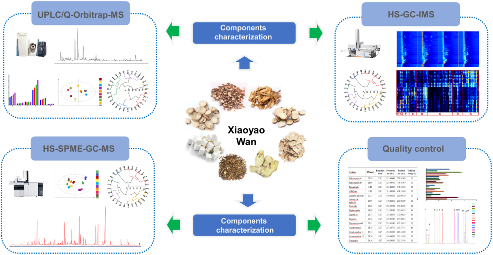
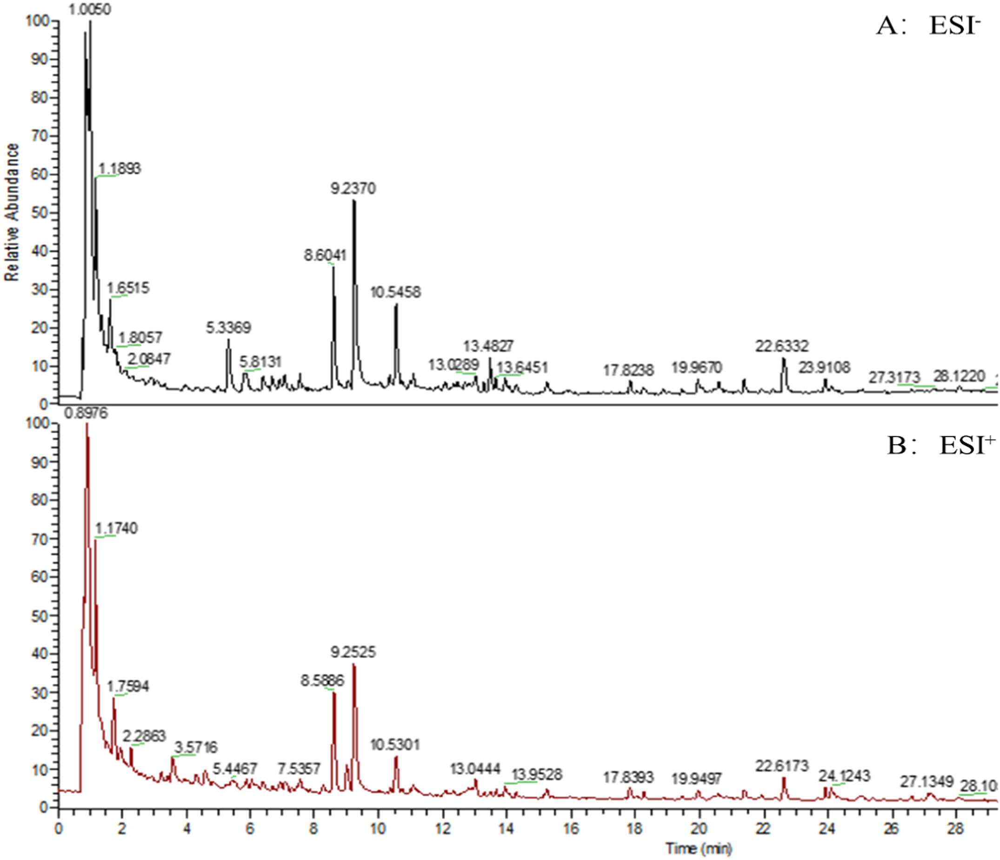

<!-- 方針: ほぼ全訳＋必要に応じた補足。原文構成に沿って訳出。「> 補足:」は訳者注。 -->

## 書誌情報

- 原題: Comprehensive multicomponent characterization and quality assessment of Xiaoyao Wan by UPLC-Q-Orbitrap-MS, HS-SPME-GC-MS and HS-GC-IMS
- 著者: Jiaxin Yin, Tong Wu, Beibei Zhu, Pengdi Cui, Yang Zhang, Xue Chen, Hui Ding, Lifeng Han, Songtao Bie, Fangyi Li, Xinbo Song, Heshui Yu*, Zheng Li*（天津中医薬大学 中薬製剤工程学院／組分中薬国家重点実験室／現代中薬海河実験室, 中国）
- 掲載: *Journal of Pharmaceutical and Biomedical Analysis* 239 (2024) 115910. https://doi.org/10.1016/j.jpba.2023.115910
- インパクトファクター: **3.6**（*Journal of Pharmaceutical and Biomedical Analysis*, JCR 2024 / Clarivate）
- 受理経過: 受領 2023-09-26 / 改訂 2023-12-02 / 採録 2023-12-05 / オンライン公開 2023-12-13（© 2023 Elsevier B.V. All rights reserved.）

> 補足: XYW = Xiaoyao Wan（逍遥丸）。原文の "Xiaoyao San"（逍遥散）は逍遥丸の基となる古典方剤名で、逍遥丸はその丸剤形。n-VOCs = 不揮発性有機化合物（non-volatile organic compounds）、VOCs = 揮発性有機化合物（volatile organic compounds）。PRM = parallel reaction monitoring（並行反応モニタリング）。

## 要旨（Abstract）

逍遥丸（Xiaoyao Wan, XYW）は「疏肝解鬱（肝を疏し鬱を解く）」「健脾養血（脾を強め血を養う）」の効能をもつ中医薬（TCM）の処方薬である。XYWはうつ病治療で広く注目されており、臨床でよく用いられる古典的処方の一つとなっている。しかし、XYWの薬効物質基盤および品質管理研究はこれまで非常に限られていた。本研究では、高度な超高性能液体クロマトグラフィー-四重極-Orbitrap質量分析（UPLC-Q-Orbitrap-MS）、ヘッドスペース固相マイクロ抽出-ガスクロマトグラフィー質量分析（HS-SPME-GC-MS）、ヘッドスペース-ガスクロマトグラフィー-イオンモビリティ分光法（HS-GC-IMS）技術を十分に活用し、XYWの薬理学的物質基盤を深く特性解析するとともにその品質を定量的に評価することを目的とする。まず、299の化合物を同定または暫定的に特性解析し、そのうち不揮発性有機化合物（n-VOCs）198種、揮発性有機化合物（VOCs）101種であった。次に、主成分分析（PCA）と階層クラスター分析（HCA）を用いて異なるメーカーのXYWの品質差を解析した。第三に、並行反応モニタリング（PRM）法を確立・バリデーションし、異なるメーカーのXYWにおける14の主要有効物質を同時に定量した。これらは、XYWの品質を評価するための基準物質として選定されたものである。結論として、本研究は、TCMの品質管理に有用な方法を提供するとともに、TCMの品質一貫性を探索する実践的なワークフローを提供することを示している。

## 1. 序論（Introduction）

近年、中医方剤製剤（TCMFPs）は、その長い歴史、確実な有効性、比較的少ない副作用から世界中でますます注目を集めている[1]。逍遥散は『太平恵民和剤局方』に由来する古典的処方で、柴胡（radix bupleuri, RB）、白芍（Paeonia lactiflora, PL）、当帰（angelica sinensis, AS）、白朮（atractylodes macrocephala, AM）、甘草（liquorice, L）、薄荷（mentha haplocalyx, MH）、茯苓（poria cocos, PC）、生姜（ginger, G）の8種の生薬から構成される。肝脾を調整し、肝鬱を解き、血を養い脾を強める機能をもつ。逍遥丸は逍遥散の製剤形態の一つである。近年、XYWはうつ病治療において広く注目を集めている[2,3]。さらに、臨床データおよび関連研究により、XYWはうつ病に対して確実な有効性をもち、うつ病治療でよく用いられる古典的処方の一つとなっていることが示されている[4,5]。しかし、既存の研究の多くは、XYWが抗うつ効果を発揮する機序の研究に焦点を当てている。これらの研究はXYWの治療効果が制御する経路・機序を解明している[6,7]。また別の多くの研究者はメタボロミクス手法を用いてXYWの代謝マーカーを研究し、うつ病治療における臨床応用のためのバイオマーカーを見出している[8–10]。以上の研究はXYWが抗うつ効果を発揮する機序を説明・証明すると同時に、臨床うつ病の早期診断のためのバイオマーカーも発見している。品質の一貫性は常にTCMの関心事であり、TCMの有効性を保証するにはその品質管理が鍵となる。残念ながら、これまで報告された研究では、XYWの物質基盤の特性解析および多成分品質管理法に関する研究はほとんどない。さらに、中国薬局方はXYWの品質評価に芍薬苷（paeoniflorin）のみを検出指標として規定している。これまでのところ、XYWの品質管理法は包括的ではなく、包括的な品質管理戦略を欠いている。したがって、TCMFPsにおける多成分の品質一貫性評価を実現するための、合理的かつ効果的な定性・定量戦略の確立が急務である。

技術の進歩と発展に伴い、クロマトグラフィーおよび質量分析技術はTCM中の物質特性解析における主要な測定手段となっている。近年、液体クロマトグラフィーを分離系、質量分析を検出系とする液体クロマトグラフィー質量分析（LC-MS）法が発展してきた。LC-MSはクロマトグラフィーとMSの相補的な利点を体現し、複雑試料に対するクロマトグラフィーの高い分離能と、MSの高い選択性・高感度、相対分子量および構造情報を提供できる能力とを組み合わせている[11]。LC-MSはTCMFPsで広く用いられている[12–14]。GC-MSは複雑系におけるVOCsの検出において強力な分離・同定機能をもつ[15]。しかし、薬物マトリクスの複雑さのため、試料抽出プロセスが複雑かつ時間を要し、試料の迅速な検出が制限される。GC-MSを基礎として、HS-SPME-GC-MSはヘッドスペース固相マイクロ抽出の抽出・濃縮技術を統合し、試料前処理法を簡略化して迅速かつ非破壊の試料検出を実現する[16,17]。HS-GC-IMSは新しい気相分離・検出技術である。この技術はGCの高い分離能とIMSの迅速な応答性を組み合わせている[18]。HS-GC-IMSはグリーンで高感度、試料前処理不要、迅速な測定という特長から、TCM、臨床、食品、環境分析で広く用いられている[19]。そこで本研究では、HS-SPME-GC-MSとHS-GC-IMSを用いてXYWのVOCsを包括的に特性解析した。HS-GC-IMSは通常VOCsの小分子を検出し、HS-SPME-GC-MSが中分子のVOCsしか捕捉できないという欠点を補う。定性的には、UPLC-Q-Orbitrap-MS、HS-SPME-GC-MS、HS-GC-IMSを組み合わせて、n-VOCsとVOCsの両面からXYWの薬理学的物質基盤を包括的に特性解析する戦略を確立した。

定量的には、UPLC-Q-Orbitrap-MSと並行反応モニタリング（PRM）を組み合わせた方法を確立し、XYW中の14の主要有効物質を定量した。従来の選択反応モニタリング（SRM）法と比較して、PRMはより広い質量範囲で複数成分を同時検出する特異性を向上させ、検出干渉の影響を最小限に抑えることができる[20]。さらに、PRMは全ての変換を同時に検出し、データ処理作業を削減し、データ解析効率を向上させることができる。PRMにおける複数成分の同時定量精度を高めるため、エネルギーレベルを調整した。調整後のPRMは、乏しいパラメータを用いることで豊富な成分の応答を抑制し、最適なパラメータを用いることで微量物質の応答を促進することができる[21]。この戦略により、XYW中の14の薬理学的活性成分を同時に定量した。

本研究では、UPLC-Q-Orbitrap-MS、HS-SPME-GC-MS、HS-GC-IMSを用いた包括的な戦略を確立した。合計299の化合物が同定または暫定的に特性解析された。同時に、47の化合物が標準品との照合によりさらに確認された。PCAおよびHCAデータは、XYWの品質が異なるメーカー間で異なることを示している。さらに、UPLC-Q-Orbitrap-MSとPRMの組み合わせにより、XYWにおける多成分品質評価のために豊富な成分と微量成分の存在量を同時にモニタリングした。本研究のデータは、XYWの多成分品質管理の基盤と参考を提供する。同時に、本戦略はTCM品質の一貫性を探索するための実践的なワークフローを提供する。実験プログラムの模式図をFig. 1に示す。

## 2. 材料と方法（Materials and methods）

### 2.1 材料と試薬

黄芩配糖体類・フラボノイド類11種（1 カテキン、2 リクイリチン、3 L-エピカテキン、4 ヘスペリジン、5 イソリクイリチンアピオシド、6 リクイリチゲニン、7 ケルセチン、8 カリコシン、9 イソリクイリチゲニン、10 リコフラノクマリン、11 リクイリチンアピオシド）、有機酸7種（12 クエン酸、13 プロトカテク酸、14 プロトカテクアルデヒド、15 クロロゲン酸、16 カフェ酸、17 フェルラ酸、18 3,5-o-ジカフェオイルキナ酸）、サポニン3種（19 サイコサポニンA、20 サイコサポニンC、21 サイコサポニンD）、ラクトン3種（22 アトラクチレノリドI、23 アトラクチレノリドII、24 アトラクチレノリドIII）、ブチルフタリド4種（25 センキュノリドI、26 センキュノリドC、27 E-リグスチリド、28 Z-リグスチリド）、テルペノイド2種（29 ヒドロキシパエオニフロリン、30 グリチルリチン酸）、配糖体11種（31 グアノシン、32 1,3-o-ジカフェオイルキナ酸、33 アルビフロリン、34 芍薬苷（paeoniflorin）、35 牡丹皮苷E、36 オノニン、37 ベンゾイル芍薬苷、38 ベンゾイルアルビフロリン、39 牡丹皮苷D、40 牡丹皮苷H、41 アトラクチロシドA）、その他6種（42 シリンギン、43 クエルシトリン、44 リコアグロカルコンB、45 センキュノリドH、46 センキュノリドA、47 レビストリドA）を含む標準品47種を上海源葉生物科技有限公司（中国上海）より入手した。ギ酸（ACS、Wilmington, DE, USA）、メタノールおよびHPLCグレードアセトニトリル（Fisher、Fair Lawn, NJ, USA）を用いた。超純水はWatsons Trademark Co., Ltd（香港中国）より購入した。XYWは10の異なるメーカーから購入し、それぞれS1、S2、S3、S4、S5、S6、S7、S8、S9、S10と表記した。HS-SPME-GC-MS用のノルマルアルカンC8-C20はSigma Aldrich Chemical Co., Ltd.（St. Louis, Missouri, USA）より、HS-GC-IMSの保持指数（RI）算出用の標準混合物N-ケトンC4-C9は国薬集団化学試薬有限公司（中国上海）より購入した。

### 2.2 試料調製

異なるメーカーのXYW試料を粉砕し、100メッシュのふるいで濾過した。等量添加法により品質管理（QC）試料を調製した。正確に量り取ったXYW試料0.5 gを水5 mLで希釈した。超音波併用の水浴中で20分間処理した。次に75%メタノールを加えて10 mLに定容し、2分間ボルテックスした。16,000 rpmで10分間遠心分離後、上清を多成分特性解析用のXYW試験溶液とした。HS-SPME-GC-MSおよびHS-GC-IMS試料は前処理を必要としない。正確に量り取ったXYW試料1.0 gを20 mLのヘッドスペース注入バイアルに入れ試料検出に供した。

### 2.3 標準溶液

14の定量対象物質のストック溶液を75%メタノールで1 mg/mLの濃度に調製した。次に、ストック溶液を75%メタノールで一連の濃度に希釈し、検量線用の検出に用いた。全ての溶液は4 ℃で保存し以降の分析に用いた。

#### 2.3.1 定性分析のためのUPLC-Q-Orbitrap-MS条件

UPLC-Q-Orbitrap-MSシステムは、Q Exactive™ハイブリッド四重極-Orbitrap質量分析計（Thermo Fisher Scientific, San Jose, CA, USA）とWaters I Class ACQUITY™ UPLCシステム（Waters Corporation, Milford, MA, USA）から構成される[22]。クロマトグラフィーカラムはACQUITY UPLC® BEH C18（2.1 × 100 mm, 1.7 µm, Waters, USA）を採用し、カラム温度は35 ℃とした。0.1%ギ酸水（A）およびアセトニトリル（B）を溶出溶媒として用い、溶出手順は以下の通りである：0–3 min, 95%A–95%A；3–12 min, 95%A–77%A；12–17 min, 77%A–71%A；17–25 min, 71%A–55%A；25–30 min, 55%A–5%A。

流速0.3 mL/min、注入量1 µLで効率的かつ対称的なピークが得られた。Q-OrbitrapマスはHESI源の正・負両イオンモードで同時に運用した。HESI源パラメータは以下の通り設定した：スプレー電圧 3.0 kV；キャピラリー温度 350 ℃；補助ガスヒーター温度 400 ℃；補助ガス流量 8 arb；シースガス流量 35 arb；正規化衝突エネルギー（NCE）は10/20/30 V。フルMS/ddMS2（TopN）スキャン法を用いてXYWの組成を特性解析し、フルスキャン範囲はm/z 100–1000とした。データ処理はCompound Discoverer™ 3.3（Thermo Fisher Scientific）とXcalibur 4.1（Thermo Fisher Scientific）で行った。

#### 2.3.2 定性分析のためのHS-SPME-GC-MS条件

HS-SPME-GC-MSは、Agilent 7890B-7000Dガスクロマトグラフ質量分析検出器（Agilent, Thermo Fisher, CA, USA）とSPMEファイバー（supelco, Bellefonte, Penn.）を組み合わせたヘッドスペースオートサンプラーシステムである[22]。クロマトグラフィーカラムはHP-5MSフェニルメチルシロキサン（30 m × 0.25 mm × 0.25 µm, Agilent Technologies, Palo Alto, CA, USA）弾性石英キャピラリーカラムを用いた[23]。試料を70 ℃で10分間インキュベートし、その後500 µLのヘッドスペース試料をDVB/CAR/PDMS SPME針（2 cm, 50/30 µm；supelco）により210 ℃で自動注入した。昇温プログラムは以下の通り：初期温度50 ℃で2分保持、その後10 ℃/minで85 ℃まで、5 ℃/minで120 ℃まで、続いて2 ℃/minで140 ℃まで、最後に5 ℃/minで210 ℃まで昇温し2分間保持した。キャリアガスはヘリウム（純度99.999%）を流速1.0 mL/minで用いた。質量分析計はEI源による正イオンモードで運用した。イオン源温度とイオン化エネルギーはそれぞれ230 ℃、70 eVに設定した。スキャン範囲はm/z 30–600とした。データ処理はMasshunterソフトウェア（Agilent Technologies）で行った。

#### 2.3.3 定性分析のためのHS-GC-IMS条件

試料は、1 mL加熱気密シリンジを備えたオートサンプラー（CTC Analytics AG, Switzerland）付きのHS-GC-IMS装置（Flavourspec®, G.A.S, Dortmund, Germany）で分析した。クロマトグラフィーカラムはFS-SE-54-CB-1（CS-Chromatographie Service GmbH, Germany）キャピラリーカラム（15 m × 0.53 mm ID, 0.5 µm）を用いた[23]。試料を70 ℃・250 rpmで10分間インキュベートし、その後500 µLのヘッドスペース試料を加熱シリンジにより70 ℃で注入口（75 ℃、スプリットレスモード）に自動注入した。窒素（99.999%）をキャリアガスとして用い、流量は最初2分間2 mL/minに設定し、その後10分かけて10 mL/minに増加、さらに20分かけて150 mL/minに増加させ10分間保持した。ドリフトチューブ（長さ9.8 cm）は一定温度45 ℃、電圧5 kVで運用した。ドリフトガス（N2）の流量は150 mL/minに設定した。

#### 2.3.4 定量分析のためのUPLC-Q-Orbitrap-MS条件

XYWの定量実験において、PRMモード下で、10 V、20 V、30 V、40 V、50 V、60 V、70 V、80 Vのエネルギー最適化グラジエントにより14の対象化合物の正規化エネルギーを調整・最適化した。最終的に調整された最適化グラジエントをTable 1に示す。

**Table 1. PRMモードにおけるXYW中14化合物の関連情報**

| 分析対象 | Rt（min） | イオン化モード | プレカーサーイオン（m/z） | プロダクトイオン（m/z） | 衝突エネルギー（V） |
|---|---|---|---|---|---|
| サイコサポニンA | 23.89 | ESI− | 825.4645 | 779.4537 | 10 |
| サイコサポニンD | 26.93 | ESI− | 825.4644 | 779.4537 | 10 |
| 芍薬苷（Paeoniflorin） | 8.89 | ESI− | 525.1614 | 479.1566 | 10 |
| アルビフロリン | 8.36 | ESI− | 525.1614 | 479.1566 | 10 |
| リクイリチンアピオシド | 10.34 | ESI− | 549.1616 | 255.0662 | 30 |
| イソリクイリチンアピオシド | 13.01 | ESI− | 549.1615 | 255.0659 | 30 |
| ケルセチン | 14.60 | ESI− | 301.0351 | 151.0022 | 60 |
| リクイリチゲニン | 13.90 | ESI− | 255.0659 | 135.0074 | 40 |
| リグスチリド | 26.72 | ESI+ | 191.1065 | 173.0962 | 60 |
| リクイリチン | 10.26 | ESI+ | 419.1338 | 257.0805 | 20 |
| グリチルリチン酸 | 22.41 | ESI+ | 823.4104 | 453.3362 | 10 |
| アトラクチレノリドI | 28.59 | ESI+ | 231.1377 | 203.5741 | 60 |
| アトラクチレノリドII | 27.54 | ESI+ | 233.1533 | 215.1432 | 50 |
| アトラクチレノリドIII | 24.56 | ESI+ | 249.1483 | 231.1375 | 30 |

さらに、確立した定量法について、検出限界（LOD）・定量限界（LOQ）、日内・日間精度、繰り返し性、安定性、直線性・範囲、および試料回収率を含む複数回のレビューを行った。検出限界（LOD）と定量限界（LOQ）は、シグナル対ノイズ比（S/N）3および10で測定した[17]。日内精度は、同一日内に同一溶液を6回反復分析して求めた。日間精度は、3日間にわたり溶液を3反復ずつ分析して評価した。繰り返し性は、6並行調製試料の分析により評価した。安定性試験では、同一試料溶液を試料室温度（20 ℃）で0、1、2、4、6、8、10、12、24時間の時点で分析した。平均回収率は、既知含量のXYW試料に低・中・高濃度の混合標準溶液を添加して測定した[20]。

## 3. 結果と考察（Results and discussion）

### 3.1 UPLC-Q-Orbitrap-MS定性分析

分解能と化合物存在量に影響しうるUPLCシステムの主要パラメータを最適化した。ACQUITY UPLC® BEH C18カラムは化合物存在量が高く分解能も良好であったため固定相として選択した。クロマトグラフィーピークの形状と数は、異なる移動相（水-メタノール／水-アセトニトリル／0.1% v/vギ酸水-メタノール／0.1% v/vギ酸水-アセトニトリル）によっても影響を受けた。0.1% v/vギ酸水-アセトニトリルを移動相として用いた場合、ピーク形状が良好であることが判明した（Fig. S1）。さらに、クロマトグラフィーカラムのカラム温度も化合物分離において重要な役割を果たす。そこで、25 ℃、30 ℃、35 ℃、40 ℃の温度グラジエントを設定して最適化を行った。その結果、複雑試料系の分離は35 ℃で良好であることが判明した（Fig. S2）。

さらに、イオン応答とフラグメンテーションに影響しうるQ-Orbitrap-MS/MS機器の主要パラメータを最適化した。ESI源パラメータと正規化衝突エネルギーを最適化し、XYWの構成化合物を特性解析するためのより有意義な構造情報を提供できるようにした。XYWの主要な薬理学的活性成分は、主にサポニン類、フラボノイド類、有機酸類の3つの異なる構造タイプを含んでいた。そこで、これら3カテゴリーから代表的な6化合物（サイコサポニンA、サイコサポニンD、リクイリチゲニン、リクイリチン、クロロゲン酸、ポリコ酸A）を選定し、質量分析パラメータ最適化の参照データとした。補助ガスヒーター温度とキャピラリー温度は、イオン輸送効率に影響を及ぼす主要な2つのパラメータである。スプレー電圧はイオン源にとってイオン応答に影響する重要なパラメータである。したがって、補助ガスヒーター温度（250 ℃、300 ℃、350 ℃、400 ℃）、キャピラリー温度（250 ℃、300 ℃、350 ℃、400 ℃）、スプレー電圧（2.5 kV、3.0 kV、3.5 kV、4.0 kV）について単一因子実験によりイオン源パラメータを最適化した。その結果、イオン応答の変化に基づき、補助ガスヒーター温度400 ℃、キャピラリー温度350 ℃、スプレー電圧3.5 kVを最適条件と決定した（Fig. S3）。

確立したUPLC-Q-Orbitrap-MS法に基づき、負・正両ESIモードで運用する高精細MSEを取得することでXYWの多成分をプロファイリングした。Compound Discoverer™ 3.3（Thermo Fisher Scientific）を定性分析ソフトウェアとしてQ-Orbitrapとマッチングさせ、オンラインデータベース（mzCloud）およびローカルデータベース（mzVault）により化合物の予備予測を行った。Compound Discoverer™でスクリーニングされた化合物は、Xcalibur 4.1ソフトウェア（Thermo Fisher Scientific）を用いたイオンピーク保持時間対比、質量電荷比、二次特性イオンフラグメンテーションによりさらに解析した。加えて、公表文献および47の標準物質との比較に基づき、XYW中の198化合物が特性解析または予備的に特性解析された。その内訳は、フラボノイド類52、サポニン・配糖体類48、有機酸26、フェノール酸14、テルペノイド11、フタリド類9、ラクトン類8、アントラキノン類5、フェニルプロパノイド類4、アミノ酸2、その他19であった。化合物情報のリストはTable S1に示されている。正・負両イオンモードでのXYWのUPLC-Q-Orbitrap-MSの総イオンクロマトグラム（TIC）図をFig. 2に示す。

### 3.2 HS-SPME-GC-MS定性分析

XYWのVOCsはHS-SPME-GC-MS技術で解析した。最適化されたHS-SPME-GC-MS条件によりVOCsを分離した（Fig. 3）。実験開始前に3つの主要パラメータを最適化した。異なる抽出ファイバーヘッド吸着膜がVOCsの吸着能に影響しうる。抽出温度と抽出時間の変化が試料の分離度に影響しうる。まず、3種類の抽出ファイバーヘッド吸着膜（PDMS、PDMS/DVB、DVB/CAR/PDMS）を最適化した（Fig. S4）。DVB/CAR/PDMSプローブを用いた場合、クロマトグラフィーピークが最も豊富であった。次に、抽出温度（50 ℃、60 ℃、70 ℃、80 ℃）と抽出時間（5分、10分、15分、20分）を最適化した（Fig. S5）。その結果、捕捉化合物の量と含量を比較した結果、HS-SPME-GC-MS検出の最適条件はインキュベート温度70 ℃、インキュベート時間10分であった。

スペクトルピークは化学ワークステーションのNIST.17標準質量分析ライブラリ（Agilent, California, USA）で検索し未知化合物を定性分析した。一方、各化合物の保持指数（RI）はN-アルカンC8-C20を外部標準として算出した[22]。保持指数、マッチング値、文献参照に基づき、正負両ESIモードで52化合物を同定した（Table 2）。その内訳は、主成分はテルペノイド類（19種）、フェノール成分9種、複素環成分6種、ケトン成分6種、エステル成分5種、アルコール成分2種、その他成分5種であった。

**Table 2. HS-SPME-GC-MSによるXYW中VOCsの同定（抜粋・全52成分中の一部）**

| No. | RT（min） | 化合物 | CAS | RI1 | RI2 |
|---|---|---|---|---|---|
| 1 | 4.24 | フルフラール | 98-01-1 | 841 | 833 |
| 2 | 5.45 | 2-アセチルフラン | 1192-62-7 | 919 | 911 |
| 6 | 9.40 | 3-ヒドロキシ-2-メチル-4H-ピラン-4-オン | 118-71-8 | 1124 | 1110 |
| 12 | 11.23 | サリチル酸メチル | 119-36-8 | 1203 | 1192 |
| 14 | 12.26 | (+)-プレゴン | 89-82-7 | 1247 | 1237 |
| 26 | 17.46 | β-カリオフィレン | 87-44-5 | 1425 | 1419 |
| 28 | 18.29 | パエオノール（牡丹皮成分） | 552-41-0 | 1448 | 1438 |
| 37 | 20.93 | ブチルヒドロキシトルエン | 128-37-0 | 1518 | 1513 |
| 45 | 26.26 | アトラクチリン | 6989-21-5 | 1664 | 1662 |
| 49 | 28.62 | Z-リグスチリド | 81944-09-4 | 1744 | 1740 |
| 51 | 34.53 | パルミチン酸エチルエステル | 628-97-7 | 1998 | 1993 |
| 52 | 37.85 | (9E,11E)-9,11-オクタデカジエン酸メチルエステル | 13038-47-6 | 2181 | 2187 |

> 補足: 原文Table 2は全52成分の一覧（No.1–52、RT・化合物名・CAS・RI1・RI2）を掲載しているが、紙面の都合上ここでは全カテゴリーを代表する成分を抜粋した。RI1はNIST.17標準質量分析ライブラリで計算した標準保持指数、RI2はN-アルカンC8-C20を外部標準として計算した実測保持指数を示す。原文全52行は原文参照。

### 3.3 HS-GC-IMS定性分析

HS-GC-IMS解析における異なるメーカーの試料情報を、トポグラフィックマップおよびフィンガープリントの形式でFig. 4に示す。Fig. 4AはXYWのHS-GC-IMS検出により得られたトポグラフィックマップで、4つの異なるメーカーの薬剤画像を示している。縦軸はガスクロマトグラフィーの保持時間、横軸はイオン移動時間を表す。画像全体の背景は青色で、横軸1.0の位置にある赤い縦線は反応イオンピーク（RIP、正規化済み）を表す。RIPピークの両側にある各点は1つのVOCを表す。色はある物質のピーク強度を表し、白は低いピーク強度、赤は高いピーク強度を示し、色が濃いほどピーク強度が高い。

GC-IMSデータの抽出と解析はLaboratory Analytical Viewer（LAV）（version 2.2.1, G.A.S, Dortmund, Germany）で行った。VOCsはGC-IMS Library Search applicationソフトウェアのIMSデータベースに基づき同定した。各化合物の保持指数（RI）はN-ケトンC4-C9を外部標準として算出した。その結果、49のVOCsが予備的に同定または同定され、詳細データはTable 3に示されている。Fig. 4Bの各行は1試料で選択された全シグナルピークを表す。各列は異なる試料における同一VOCのシグナルピークを表す。図から、各試料の完全なVOC情報と試料間のVOCの差異を視覚的に確認できる。全体的な傾向として、試料S1、S2、S6、S8は同じ変化傾向を示し、物質の含量は左から右に向かって増加傾向を示すことが分かる。逆に、試料S3、S4、S5、S7、S9、S10中の物質は徐々に減少する傾向を示した。標識領域A、B、Cから、物質（オクタン酸、4-メチルアセトフェノン、2,6-ジクロロフェノール、4-エチル-2-メトキシフェノールなど）は試料S1、S2、S6、S8に特有でかつ比較的高い含量であった。一方、領域D、E、F、G、Hに含まれる物質（プロピレングリコール、2-ヘキセン-1-オール、1-ヘキサノール、ペンタン酸など）は試料S3、S4、S5、S7、S9、S10に特有であった。

**Table 3. HS-GC-IMSによるXYW中VOCsの積分パラメータ（抜粋・全49成分中の一部）**

| No. | Rt（min） | 分子式 | 化合物 | CAS | RI |
|---|---|---|---|---|---|
| 1 | 2.59 | C4H8O | ブタナール（モノマー） | C123728 | 610 |
| 5 | 4.67 | C5H12O | 3-メチルブタノール（モノマー） | C123513 | 741 |
| 9 | 6.34 | C6H12O | ヘキサナール（モノマー） | C66251 | 799 |
| 15 | 7.63 | C6H5Cl | クロロベンゼン（モノマー） | C108907 | 853 |
| 20 | 8.43 | C5H10O2 | ペンタン酸（モノマー） | C109524 | 883 |
| 31 | 10.98 | C10H16 | ミルセン（モノマー） | C123353 | 991 |
| 36 | 11.81 | C10H16 | リモネン（モノマー） | C138863 | 1029 |
| 39 | 12.80 | C8H18O | 1-オクタノール（モノマー） | C111875 | 1072 |
| 46 | 15.73 | C8H16O2 | オクタン酸（モノマー） | C124072 | 1182 |
| 47 | 15.79 | C9H10O | 4-メチルアセトフェノン（モノマー） | C122009 | 1183 |
| 48 | 16.37 | C6H4Cl2O | 2,6-ジクロロフェノール（モノマー） | C87650 | 1203 |
| 49 | 18.88 | C9H12O2 | 4-エチル-2-メトキシフェノール（モノマー） | C2785899 | 1279 |

> 補足: 原文Table 3は全49成分（No.1–49）を掲載。ここでは代表成分を抜粋した。原文全49行は原文参照。

### 3.4 総合解析

UPLC-Q-Orbitrap-MS解析、HS-SPME-GC-MS解析、HS-GC-IMS解析により299化合物が同定された。そのうち、198化合物がUPLC-Q-Orbitrap-MSにより特性解析され、52化合物がHS-SPME-GC-MSにより同定され、49化合物がHS-GC-IMSにより同定された。198のn-VOCsの予備同定または同定では、フラボノイド類、サポニン類、ラクトン類、有機酸類が主成分であった。101のVOCsが特性解析され、主にテルペノイド類、フェノール類、エステル類を含んでいた。PCAは、大量データの次元削減により試料間の規則性・差異を解析する教師なしモード多変量統計手法である。UPLC-Q-Orbitrap-MS、HS-SPME-GC-MS、HS-GC-IMSの検出データに対しPCA解析を行った（Fig. 5）。PCAはSIMCA 14.1ソフトウェアを用いて実施した。

10の異なるメーカーのXYW試料は、化学組成において2つの主要な傾向に分かれた。試料S1、S2、S6、S8はX軸の負の半軸上に類似性をもって位置し、一方試料S3、S4、S5、S7、S9、S10はX軸の正の半軸上に類似の性質をもって位置した（Fig. 5A）。同時に、試料S1、S2、S6、S8はn-VOCsにおいて試料S3、S4、S5、S7、S9、S10と有意な差異を示した。Fig. 5C、Eに示すように、S1、S2、S6、S8とS3、S4、S5、S7、S9、S10はVOCsにおいても有意な差異を示した。HCAは、異なるカテゴリーのデータ点間の類似性を計算することで階層的なネスト型クラスタリングを作成し、これにより試料間の類似性関係の表現を実現する。HCAデータは、S1、S2、S6、S8の成分は類似しており、S3、S4、S5、S7、S9、S10の成分は非常に類似していることを示している（Fig. 5B、D、F）。試料S1、S2、S6、S8と試料S3、S4、S5、S7、S9、S10の間には有意な差異がある。したがって、PCA、HCA、フィンガープリントデータは、試料S1、S2、S6、S8に含まれる成分は類似しており、試料S3、S4、S5、S7、S9、S10に含まれる成分は類似していることを示している。10の異なるメーカーのXYW試料は、化学組成において2つの主要な傾向に分けられた。

### 3.5 UPLC-Q-Orbitrap-MS定量分析

XYWは2000年以上にわたり肝損傷の治療および抗うつ薬として広く用いられてきた[24]。まず、中国薬局方はXYWの品質管理指標として芍薬苷（paeoniflorin）の使用を規定している。柴胡（Radix bupleuri）はXYWにおいて肝疾患治療のための主薬である。サイコサポニンAとサイコサポニンDはいずれもうつ様行動を改善することが示されている[25,26]。しかし、両者が治療効果を発揮する制御機序は異なる。ケルセチンも関連する炎症因子を調節することで肝損傷を防御しうる[27]。さらに、Paeonia lactiflora（芍薬）中の芍薬苷とアルビフロリンはうつ様行動を改善する効果があることが証明されている[28–30]。特に芍薬苷は産後うつを効果的に改善できる。バイオアクティビティ研究により、甘草中のフラボノイド類はうつ病に有意な効果を示し、リクイリチゲニンは潜在的な抗うつ薬として期待されている[31]。当帰（angelica sinensis）中のリグスチリドは慢性うつを改善しうる[32]。アトラクチレノリドI、アトラクチレノリドII、アトラクチレノリドIIIは白朮（atractylodes macrocephala）の主要活性成分であり、これは白朮が抗うつ薬として一般的に用いられる理由でもある[33,34]。以上の予備検討と文献レビューに基づき、14の化合物（サイコサポニンA、サイコサポニンD、芍薬苷、アルビフロリン、リクイリチンアピオシド、イソリクイリチンアピオシド、ケルセチン、リクイリチゲニン、リグスチリド、リクイリチン、グリチルリチン酸、アトラクチレノリドI、アトラクチレノリドII、アトラクチレノリドIII）を、XYWの品質評価を達成するための最も可能性の高い参照物質として決定した。

イオン化エネルギーはイオンの二次フラグメントに影響しうる。このため、確立したPRMモードにおいて、正・負両イオンモードで14の品質マーキング成分のエネルギーを調整した。まず、14の品質基準物質のリストを確立し、異なるエネルギーレベルを設定した。次に、異なるエネルギーにおける異なる成分の応答を解析した。最後に、総合的な解析を通じて、14の品質基準物質を可能な限り合意された応答レベル範囲内で同時かつ正確に定量した。調整PRMモードは、質量応答を促進または抑制するという利点をもつ（Fig. S6）。したがって、確立した調整PRMとUPLC-Q-Orbitrap-MSを組み合わせた戦略は正確かつ信頼性が高く、XYWにおける複数成分の同時定量を達成できることが示された。さらに、この方法の確立は、TCMの複雑系の多成分品質管理に対する解決策も提供する。上記の条件下で、14の品質基準物質は干渉なく正確に検出でき、この戦略が高い選択性をもつことが示された。方法バリデーションは正・負両イオンモードで実施し、方法の直線性、繰り返し性、精度、安定性、回収率をTable S2に記載した。

14の基準物質の回帰式は、広い濃度範囲にわたり高い相関係数（**R2 > 0.999**）で定量化された。LODとLQD（原文ママ。LOQを指す）はそれぞれ**0.03–6.13 ng/mL**、**0.10–20.42 ng/mL**の範囲であった。繰り返し性、日内精度、日間精度、安定性は各化合物について**5%未満**であった。平均回収率は**84.86%–105.09%**、RSD値は**0.20%–4.93%**であった。これらの結果は、確立した方法がXYWの主要成分の定量測定において高感度・高効率・高精度であることを示している。

定量的には、XYW中の14の参照物質は異なるメーカー間で大きく変動した（Fig. S7）。異なるメーカー間でXYWの製法に差異があるものの、芍薬苷、アルビフロリン、サイコサポニンA、リグスチリド、グリチルレチン酸、リクイリチンアピオシド、イソリクイリチンアピオシドの含量はそれぞれの割合において比較的高く、これらが抗うつ活性を発揮する重要成分の一つであることが改めて確認された。サイコサポニンAはXYWの主要な抗うつ成分として、メーカー間で含量が大きく異なっていた（Fig. S7B）。例えば、試料S2と試料S9のサイコサポニンA含量は約**8倍**の差があった。芍薬苷の含量はXYW中で最も高かった（Fig. S7D）。しかし、メーカー間で有意な差があり、例えば試料S4とS10の含量は試料S7とS8の**約1.5倍**であった。さらに、他の成分の含量差も比較的大きく、特にサイコサポニンD、リクイリチゲニン、アトラクチレノリドI、アトラクチレノリドII、アトラクチレノリドIII、ケルセチン（Fig. S7 I-N）で顕著であった。特筆すべきは、サイコサポニンDの含量が試料S3、S4、S5、S7、S9、S10では極めて低いが、試料S1、S2、S6、S8では極めて高いことである。異なるメーカー間の含量変化は数十倍に及ぶ。薬品品質の一貫性は薬効に影響する主要因子の一つである。製法、原材料品質、その他の要因の違いにより、薬品の品質には有意な差異が生じる。薬品品質の差異は、臨床効果に影響しうる潜在的因子の一つである。したがって、本法はXYWの品質管理の基盤となり、臨床の抗うつ治療における投薬をより適切に導く可能性がある。

## 4. 結論（Conclusion）

実践的な品質評価法の深い調査と確立という理念に基づき、本研究はUPLC-Q-Orbitrap-MS、HS-SPME-GC-MS、HS-GC-IMSによる戦略に従い、10の異なるメーカーのXYWの包括的な多成分特性解析と品質評価を達成した。UPLC-Q-Orbitrap-MS法は、XYWにおける多成分のプロファイリングと特性解析において非常に強力であることが証明され、198化合物が暫定的に特性解析された。さらに、HS-SPME-GC-MSとHS-GC-IMSを適用してXYWを解析し、合計101のVOCsが検出され、XYW中の成分種類が豊富になった。3つの新たに開発された手法により、XYWのn-VOCsとVOCsを包括的に特性解析することができた。続いて、PCAとHCAにより、異なるメーカーが製造するXYWの化学組成に有意な差異があることが示された。XYWの異なる製法が、その品質差異の主要な原因の一つである可能性がある。最後に、調整PRM法により、10の異なるメーカーのXYW試料における14の品質マーキング成分を正確かつ高感度に定量することができた。特筆すべきは、14の薬理学的物質の含量がメーカー間で大きく異なることである。含量の変動は薬効に影響を及ぼす可能性がある。これらの結果は、提案された戦略がTCM製剤の包括的同定と品質一貫性評価の問題を解決する上で高い価値をもつことを示している。

## 訳者補足

> 補足（実務的示唆）: 本研究は、中国薬局方が芍薬苷1成分のみを品質指標としているXYWに対し、①UPLC-Q-Orbitrap-MS（不揮発性成分198種）＋HS-SPME-GC-MS／HS-GC-IMS（揮発性成分計101種）による網羅的な組成の可視化、②PCA/HCAによるメーカー間の品質群別化（10社がおおむね2群に分かれる）、③調整PRM法による14成分の同時・高精度定量（R2>0.999、LOD 0.03–6.13 ng/mL、回収率84.86–105.09%）という三段構えでXYWの品質一貫性評価の枠組みを提示している。実務的には、単一指標成分による規格設定の限界（サイコサポニンAで8倍、サイコサポニンDで数十倍というメーカー間差が実測されている）を示す好例であり、複数の指標成分（特にサポニン類・フラボノイド類・フタリド類の代表成分）を組み合わせた多成分規格への移行の必要性を裏付けるデータといえる。また、調整PRM（エネルギーレベルを成分ごとに最適化してSRMより広い質量範囲で高特異性・低干渉を実現する手法）は、含量に大きな幅がある（豊富成分と微量成分が混在する）複雑な複方製剤の同時定量に応用可能な分析法設計の一例として参考になる。なお、本研究はメーカー間差異を統計的・定量的に可視化した段階にとどまり、どちらの成分プロファイル（S1・S2・S6・S8群 vs. S3・S4・S5・S7・S9・S10群）が薬効・品質としてより望ましいかについての薬効相関検証（in vivo/in vitro等）は行われていない点に留意が必要（原文にもその旨の記載はなく、今後の課題と考えられる）。
