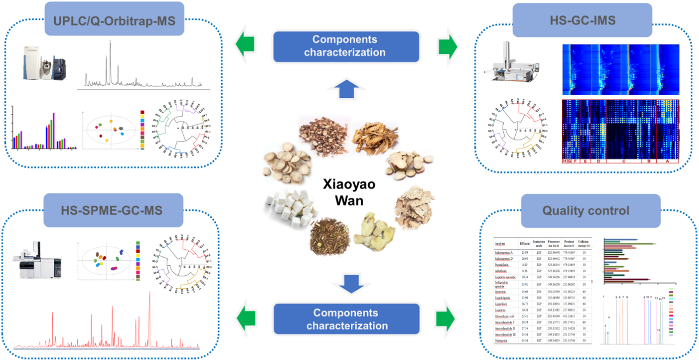
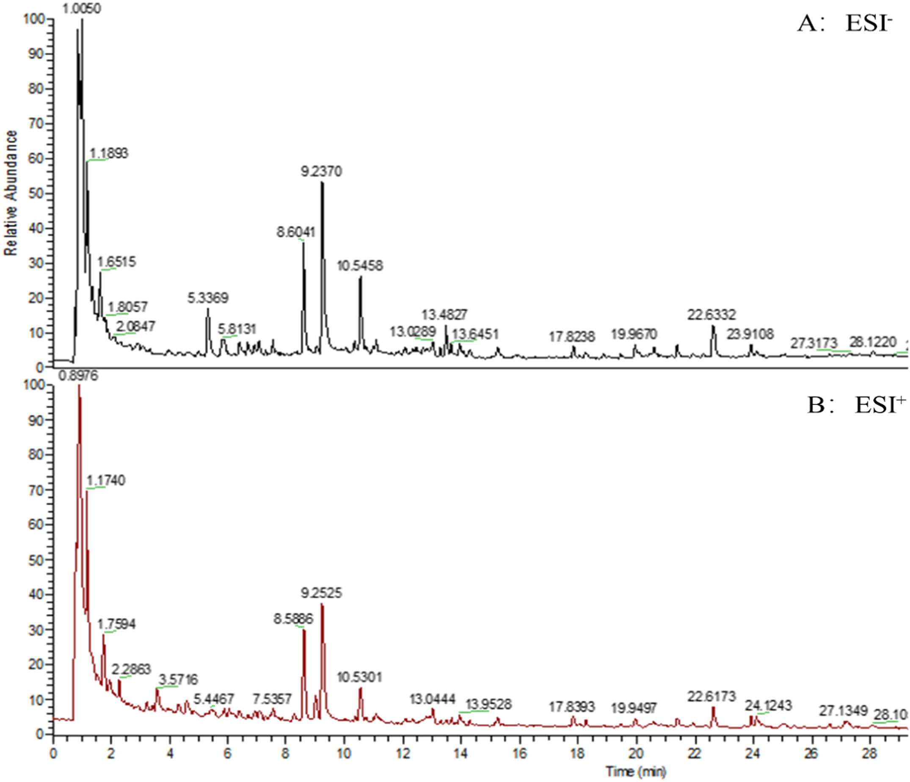
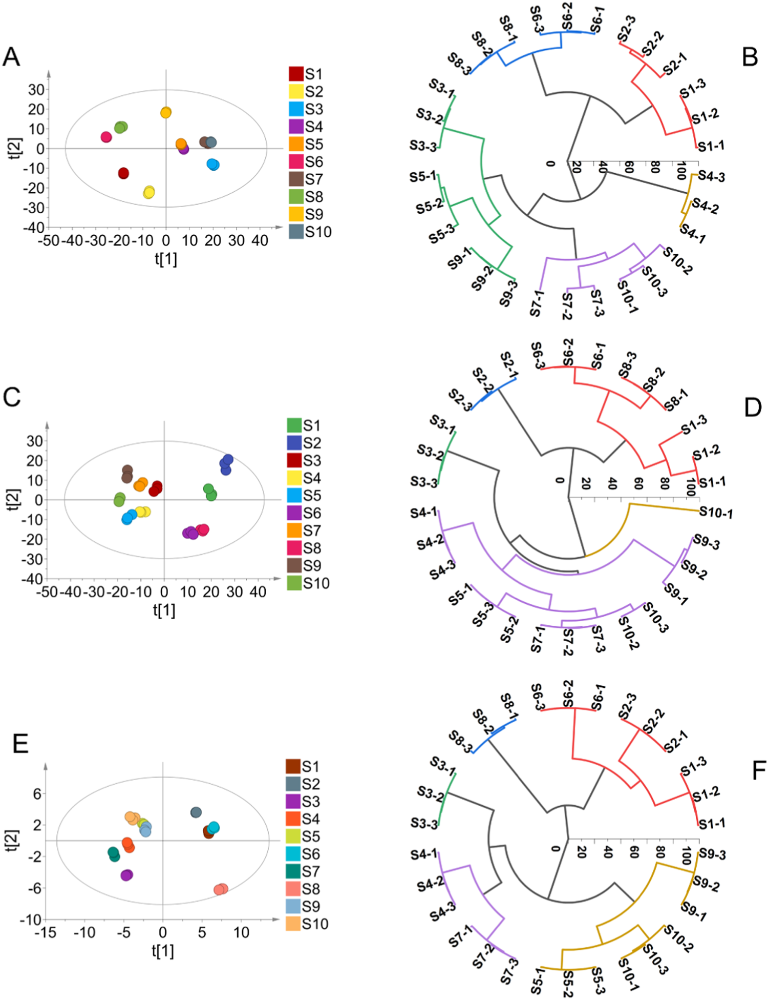

<!-- 方針: ほぼ全訳＋必要に応じた補足。原文構成に沿って訳出。「> 補足:」は訳者注。 -->

## 書誌情報

- 標題（原題）: Comprehensive multicomponent characterization and quality assessment of Xiaoyao Wan by UPLC-Q-Orbitrap-MS, HS-SPME-GC-MS and HS-GC-IMS
- 著者・所属: Jiaxin Yin, Tong Wu, Beibei Zhu, Pengdi Cui, Yang Zhang, Xue Chen, Hui Ding, Lifeng Han, Songtao Bie, Fangyi Li, Xinbo Song, Heshui Yu\*, Zheng Li\*（天津中医薬大学 中薬製薬工程学院／中薬成方組学国家重点実験室／海河実験室（現代中薬）、中国天津。＊は責任著者）
- 掲載誌・巻号・DOI: *Journal of Pharmaceutical and Biomedical Analysis* 239 (2024) 115910. https://doi.org/10.1016/j.jpba.2023.115910
- インパクトファクター: **3.6**（*Journal of Pharmaceutical and Biomedical Analysis*, JCR 2024 / Clarivate）
- 受理経過 / ライセンス: 受領 2023-09-26／改訂受理 2023-12-02／採録 2023-12-05／オンライン公開 2023-12-13。0731-7085/© 2023 Elsevier B.V. All rights reserved.

> 補足: XYW = 逍遥丸(Xiaoyao Wan)。中国古方「逍遥散」（*太平恵民和剤局方*由来、柴胡・白芍・当帰・白朮・甘草・薄荷・茯苓・生姜の8味からなる）の丸剤形。n-VOCs = 不揮発性有機化合物、VOCs = 揮発性有機化合物、PRM = parallel reaction monitoring（並行反応モニタリング）、PCA = 主成分分析、HCA = 階層クラスター分析。

## 要旨（Abstract）

逍遥丸(XYW)は「疏肝解鬱・健脾養血」の効能を持つ中医方剤製剤であり、うつ病治療で広く注目され、臨床でよく用いられる古典的処方の一つとなっている。しかしXYWの薬効物質基盤と品質管理研究はこれまで極めて限られていた。本研究は、先進的な超高速液体クロマトグラフィー四重極-Orbitrap質量分析(UPLC-Q-Orbitrap-MS)、ヘッドスペース固相マイクロ抽出-ガスクロマトグラフィー質量分析(HS-SPME-GC-MS)、およびヘッドスペース-ガスクロマトグラフィーイオン移動度分析(HS-GC-IMS)技術を十分に活用し、XYWの薬理学的物質基盤を深く特徴づけ、品質を定量的に評価することを目的とした。まず、299化合物を同定または暫定的に特徴づけた。内訳は不揮発性有機化合物(n-VOCs)198種、揮発性有機化合物(VOCs)101種である。次に、主成分分析(PCA)と階層クラスター分析(HCA)を用いて、異なるメーカー間でのXYWの品質差を解析した。第三に、並行反応モニタリング(PRM)法を確立・バリデーションし、異なるメーカーのXYWにおける14種の主要有効物質を定量した。これらは品質評価のベンチマーク物質として選定されたものである。結論として、本研究はこの戦略がTCM(中医薬)の品質管理に有用な方法を提供すること、およびTCMの品質一貫性を探索する実用的なワークフローを提供することを示す。

## 1. 序論（Introduction）

近年、中医薬方剤製剤(TCMFPs)はその長い歴史、確かな薬効、比較的少ない副作用のために、世界中でますます注目を集めている[1]。逍遥散は*太平恵民和剤局方*に由来する古典処方であり、柴胡(radix bupleuri, RB)、白芍(Paeonia lactiflora, PL)、当帰(angelica sinensis, AS)、白朮(atractylodes macrocephala, AM)、甘草(liquorice, L)、薄荷(mentha haplocalyx, MH)、茯苓(poria cocos, PC)、生姜(ginger, G)の8種の中薬から構成される。肝脾を調え、肝鬱を解消し、養血健脾の効能を持つ。逍遥丸は逍遥散の製剤形態である。近年、XYWはうつ病治療において広範な注目を集めている[2,3]。さらに、臨床データおよび関連研究はXYWがうつ病に確かな効能を持ち、うつ病治療でよく用いられる古典処方の一つとなっていることを示している[4,5]。しかし既存の研究の多くは、XYWが抗うつ効果を発揮する機序の研究に焦点を当てており、XYWの治療効果が調節する経路・機序を解明するものであった[6,7]。また別の多くの研究者はメタボロミクス手法を用いてXYWのうつ病治療における代謝マーカーを研究し、臨床応用のためのバイオマーカーを見出している[8–10]。上記研究はXYWの抗うつ機序を説明・証明し、またうつ病の早期診断のためのバイオマーカーを発見するものであるが、品質の一貫性は常にTCMにおける懸念事項であり、TCMの薬効を担保する鍵はその品質を管理して薬効を確保することにある。残念ながら、これまで報告された研究では、XYWの物質基盤の特徴づけおよび多成分品質管理法に関する研究は少ない。しかも中国薬局方はXYWの品質評価に芍薬苷(paeoniflorin)のみを検出指標として規定しているに過ぎない。これまでのところ、XYWの品質管理法は包括的とはいえず、包括的な品質管理戦略を欠いている。したがって、TCMFPsにおける多成分の品質一貫性評価を実現する、合理的かつ有効な定性・定量戦略の確立が急務である。

技術の進歩発展に伴い、クロマトグラフィーおよび質量分析技術はTCMにおける物質特徴づけの主要な測定手段となっている。近年、液体クロマトグラフィーを分離系、質量分析を検出系とする液体クロマトグラフィー質量分析(LC-MS)が発展してきた。LC-MSはクロマトグラフィーの複雑試料に対する高い分離能力と、MSの高選択性・高感度、相対分子量および構造情報を提供できるという利点とを組み合わせ、クロマトグラフィーと質量分析の相補的な利点を体現している[11]。TCMFPsで広く用いられている[12–14]。GC-MSは複雑系におけるVOCsの検出において強力な分離・同定機能を持つ[15]。しかし薬物マトリックスの複雑さのため、試料抽出プロセスが複雑で時間を要し、試料の迅速な検出を制限する。GC-MSを基盤として、HS-SPME-GC-MSはヘッドスペース固相マイクロ抽出の抽出・濃縮技術を統合し、試料前処理法を簡略化して迅速かつ非破壊的な試料検出を実現する[16, 17]。HS-GC-IMSは新しいガス相分離・検出技術である。この技術はGCの高い分離能力とIMSの迅速な応答性を組み合わせている[18]。HS-GC-IMSはそのグリーンさ、高感度、試料前処理不要、迅速な測定という特長のため、TCM・臨床・食品・環境分析で広く用いられている[19]。したがって本研究では、HS-SPME-GC-MSおよびHS-GC-IMSを用いてXYWのVOCsを包括的に特徴づけた。HS-GC-IMSは通常VOCsの小分子を検出でき、HS-SPME-GC-MSが中分子のVOCsしか捕捉できないという欠点を補う。定性的には、UPLC-Q-Orbitrap-MS、HS-SPME-GC-MS、HS-GC-IMSを組み合わせ、n-VOCsおよびVOCsの両面からXYWの薬理学的物質基盤を包括的に特徴づける戦略を確立した。

定量的には、UPLC-Q-Orbitrap-MSと並行反応モニタリング(PRM)法を組み合わせ、XYW中の14の主要有効物質を定量する手法を確立した。従来の選択反応モニタリング(SRM)法と比較して、PRMはより広い質量範囲にわたる多成分同時検出の特異性を、検出干渉の影響を最小限に抑えつつ向上させることができる[20]。加えて、PRMはすべての変換を同時に検出でき、データ処理作業を削減し、データ解析効率を向上させることができる。PRMにおける多成分同時定量の精度を向上させるため、エネルギー準位を調整した。調整後のPRMは、劣った(poor)パラメータを用いることで豊富な成分の応答を抑制し、最適(optimal)パラメータを用いることで微量物質の応答を促進することができる[21]。この戦略により、XYW中の14の薬理学的活性成分を同時に定量した。

本研究では、UPLC-Q-Orbitrap-MS、HS-SPME-GC-MS、HS-GC-IMSを組み合わせた包括的な戦略を確立した。合計299化合物を同定または暫定的に特徴づけた。同時に、47化合物を標準品によりさらに確認した。PCAおよびHCAのデータは、異なるメーカー間でXYWの品質が異なることを示している。さらに、UPLC-Q-Orbitrap-MSとPRMを組み合わせて、豊富量および微量成分の存在量を同時にモニタリングし、XYWにおける多成分品質を評価した。本研究のデータはXYWの多成分品質管理に基盤と参照を提供する。並行して、本戦略はTCM品質の一貫性を探索する実用的なワークフローを提供する。実験プログラムの模式図をFig. 1に示す。

## 2. 材料と方法（Materials and methods）

### 2.1. 材料および試薬

47種の標準品対照物質を上海源葉生物科技有限公司(Shanghai Yuanye Biotech. Co., Ltd.、中国上海)より入手した。内訳は以下の通り。

- フラボノイド11種: 1 カテキン, 2 リクイリチン(liquiritin), 3 L-エピカテキン, 4 ヘスペリジン, 5 イソリクイリチンアピオシド, 6 リクイリチゲニン(liquiritigenin), 7 クエルセチン(原文ママ表記), 8 カリコシン(calycosin), 9 イソリクイリチゲニン, 10 リコフラノクマリン, 11 リクイリチンアピオシド（原文に11番として重複表記あり／原文参照）
- 有機酸7種: 12 クエン酸, 13 プロトカテク酸, 14 プロトカテクアルデヒド, 15 クロロゲン酸, 16 カフェ酸, 17 フェルラ酸, 18 3,5-o-ジカフェオイルキナ酸
- サポニン3種: 19 サイコサポニンA(saikosaponin A), 20 サイコサポニンC(saikosaponin C), 21 サイコサポニンD(saikosaponin D)
- ラクトン3種: 22 アトラクチレノリドI, 23 アトラクチレノリドII, 24 アトラクチレノリドIII
- ブチルフタリド類4種: 25 センキュノリドI, 26 センキュノリドC, 27 E-リグスチリド, 28 Z-リグスチリド
- テルペノイド2種: 29 ヒドロキシパエオニフロリン, 30 グリチルリチン酸
- 配糖体11種: 31 グアノシン, 32 1,3-o-ジカフェオイルキナ酸, 33 アルビフロリン(albiflorin), 34 芍薬苷(paeoniflorin), 35 牡丹皮苷E(mudanpioside E), 36 オノニン, 37 ベンゾイルパエオニフロリン, 38 ベンゾイルアルビフロリン, 39 牡丹皮苷D, 40 牡丹皮苷H, 41 アトラクチロシドA
- その他6種: 42 シリンギン, 43 クエルシトリン, 44 リコアグロカルコンB, 45 センキュノリドH, 46 センキュノリドA, 47 レビストリドA

ギ酸(ACS, Wilmington, DE, USA)、メタノールおよびHPLCグレードのアセトニトリル(Fisher, Fair Lawn, NJ, USA)を使用。超純水はWatsons Trademark Co., Ltd(中国香港)より購入。XYWはS1〜S10と表される10社の異なるメーカーから購入。HS-SPME-GC-MS用のノルマルアルカンC8-C20はSigma Aldrich Chemical Co., Ltd.(米国ミズーリ州セントルイス)、HS-GC-IMSの保持指数(RI)算出用標準混合物N-ケトンC4-C9は国薬集団化学試薬有限公司(Sinopharm Chemical Co., Ltd.、中国上海)より購入。

### 2.2. 試料調製

異なるメーカーのXYW試料を粉砕し、100メッシュのふるいを通した。等量添加法により品質管理(QC)試料を調製した。正確に秤量した0.5 g のXYW試料を5 mLの水で希釈した。試料を超音波補助下で水浴中20分処理した。次いで75%メタノールを加えて全量10 mLとし、2分間ボルテックスした。試料を16,000 rpmで10分間遠心分離した後、上清を多成分特徴づけ用のXYW試験溶液とした。HS-SPME-GC-MSおよびHS-GC-IMS試料は前処理を必要としない。正確に秤量した1.0 gのXYW試料を20 mLのヘッドスペース注入バイアルに入れて検出に供した。

### 2.3. 標準溶液

14種の定量物質のストック溶液を75%メタノールで1 mg/mLの濃度に調製した。次いでストック溶液を75%メタノールで一連の濃度に希釈し、標準曲線検出用とした。すべての溶液は4 ℃で保存し、以後の分析に供した。

#### 2.3.1. 定性分析のためのUPLC-Q-Orbitrap-MS条件

UPLC-Q-Orbitrap-MSシステムはQ Exactive™ハイブリッド四重極-Orbitrap質量分析計(Thermo Fisher Scientific, San Jose, CA, USA)とWaters I Class ACQUITY™ UPLCシステム(Waters Corporation, Milford, MA, USA)を装備した[22]。クロマトグラフィーカラムにはACQUITY UPLC® BEH C18(2.1 × 100 mm, 1.7 µm, Waters, USA)を採用し、カラム温度35 ℃。0.1%ギ酸水溶液(A)とアセトニトリル(B)を溶離溶媒とし、溶出プログラムは以下の通り: 0–3 min, 95%A–95%A; 3–12 min, 95%A–77%A; 12–17 min, 77%A–71%A; 17–25 min, 71%A–55%A; 25–30 min, 55%A–5%A。

流速0.3 mL/min、注入量1 µLで効率的かつ対称なピークが得られた。Q-Orbitrap質量分析計はHESI源を用いて正・負イオンモードを同時運用した。HESI源パラメータは以下の通り: スプレー電圧 3.0 kV、キャピラリー温度 350 ℃、補助ガスヒーター温度 400 ℃、補助ガス流量 8 arb、シースガス流量 35 arb、正規化衝突エネルギー(NCE) 10/20/30 V。フルMS/dd MS2 (TopN)スキャン法を用いてXYWの組成を特徴づけ、フルスキャン範囲はm/z 100–1000。データ処理はCompound Discoverer™ 3.3(Thermo Fisher Scientific)およびXcalibur 4.1(Thermo Fisher Scientific)で実施。

#### 2.3.2. 定性分析のためのHS-SPME-GC-MS条件

HS-SPME-GC-MSはAgilent 7890B-7000Dガスクロマトグラフ質量分析検出器(Agilent, Thermo Fisher, CA, USA)とSPMEファイバー(supelco, Bellefonte, Penn.)を組み合わせたヘッドスペース自動サンプラーシステムであった[22]。クロマトグラフィーカラムはHP-5MSフェニルメチルシロキサン(30 m × 0.25 mm × 0.25 µm, Agilent Technologies, Palo Alto, CA, USA)弾性石英キャピラリーカラムを使用[23]。試料を70 ℃で10分間インキュベートした後、210 ℃のDVB/CAR/PDMS SPMEニードル(2 cm, 50/30 µm; supelco)により500 µLのヘッドスペース試料を自動注入した。昇温プログラムは以下の通り: 初期温度50 ℃で2分保持、10 ℃/minで85 ℃まで昇温、5 ℃/minで120 ℃まで昇温、次いで2 ℃/minで140 ℃まで昇温、最後に5 ℃/minで210 ℃まで昇温し2分保持。キャリアガスはヘリウム（純度99.999%）で流速1.0 mL/min。質量分析計はEI源による正イオンモードで運用。イオン源温度およびイオン化エネルギーはそれぞれ230 ℃、70 eVに設定。スキャン範囲はm/z 30–600に設定。データ処理はMasshunterソフトウェア(Agilent Technologies)で実施。

#### 2.3.3. 定性分析のためのHS-GC-IMS条件

試料はCTC Analytics AG(スイス)製オートサンプラー（1 mL加熱気密シリンジ装備）を備えたHS-GC-IMS装置(Flavourspec®, G.A.S, Dortmund, Germany)で分析した。クロマトグラフィーカラムはFS-SE-54-CB-1(CS-Chromatographie Service GmbH, Germany)キャピラリーカラム(15 m × 0.53 mm ID, 0.5 µm)を使用[23]。試料を70 ℃、250 rpmで10分間インキュベートした後、加熱シリンジにより70 ℃で500 µLのヘッドスペース試料を自動的にインジェクター(75 ℃、スプリットレスモード)へ注入した。窒素(99.999%)をキャリアガスとして使用し、その流速は最初2分間2 mL/minに設定、その後10分かけて10 mL/minに増加、さらに20分かけて150 mL/minに増加させ10分間保持した。ドリフトチューブ(長さ9.8 cm)は一定温度45 ℃、電圧5 kVで運用。ドリフトガス(N2)の流速は150 mL/minに設定。

#### 2.3.4. 定量分析のためのUPLC-Q-Orbitrap-MS条件

XYWの定量実験において、PRMモードで、10 V, 20 V, 30 V, 40 V, 50 V, 60 V, 70 V, 80 Vのエネルギー最適化グラジエントを用いて14の標的化合物の正規化エネルギーを調整・最適化した。最終的に調整された最適化グラジエントをTable 1に示す。

さらに、確立した定量法について、検出限界(LOD)・定量限界(LOQ)、日内・日間精度、繰り返し性、安定性、直線性と範囲、および試料回収率を含む複数の項目でレビューを行った。LODおよびLOQはシグナル対ノイズ比(S/N)3および10で測定した[17]。日内精度は同一溶液を同日内に6回繰り返し分析して求めた。日間精度は同一溶液を3日間にわたり3反復分析して評価した。繰り返し性は6つの並行調製試料を分析して評価した。安定性試験では、同一試料溶液を試料室温度(20 ℃)で0, 1, 2, 4, 6, 8, 10, 12, 24時間の時点で分析した。平均回収率は既知含量のXYW試料に低・中・高濃度の混合標準溶液を添加して測定した[20]。

**Table 1. PRMモードにおけるXYW中14化合物の関連情報**

| 分析対象 | 保持時間 Rt (min) | イオン化モード | プリカーサーイオン (m/z) | プロダクトイオン (m/z) | 衝突エネルギー (V) |
|---|---|---|---|---|---|
| サイコサポニンA | 23.89 | ESI− | 825.4645 | 779.4537 | 10 |
| サイコサポニンD | 26.93 | ESI− | 825.4644 | 779.4537 | 10 |
| 芍薬苷(パエオニフロリン) | 8.89 | ESI− | 525.1614 | 479.1566 | 10 |
| アルビフロリン | 8.36 | ESI− | 525.1614 | 479.1566 | 10 |
| リクイリチンアピオシド | 10.34 | ESI− | 549.1616 | 255.0662 | 30 |
| イソリクイリチンアピオシド | 13.01 | ESI− | 549.1615 | 255.0659 | 30 |
| クエルセチン | 14.60 | ESI− | 301.0351 | 151.0022 | 60 |
| リクイリチゲニン | 13.90 | ESI− | 255.0659 | 135.0074 | 40 |
| リグスチリド | 26.72 | ESI+ | 191.1065 | 173.0962 | 60 |
| リクイリチン | 10.26 | ESI+ | 419.1338 | 257.0805 | 20 |
| グリチルリチン酸 | 22.41 | ESI+ | 823.4104 | 453.3362 | 10 |
| アトラクチレノリドI | 28.59 | ESI+ | 231.1377 | 203.5741 | 60 |
| アトラクチレノリドII | 27.54 | ESI+ | 233.1533 | 215.1432 | 50 |
| アトラクチレノリドIII | 24.56 | ESI+ | 249.1483 | 231.1375 | 30 |

## 3. 結果と考察（Results and discussion）

### 3.1. UPLC-Q-Orbitrap-MSによる定性分析

分解能および化合物存在量に影響しうるUPLCシステムの主要パラメータを最適化した。ACQUITY UPLC® BEH C18カラムは、高い化合物存在量と良好な分解能を有するため固定相として選択された。クロマトグラフィーピークの形状・数は移動相の種類（水-メタノール／水-アセトニトリル／0.1% v/v ギ酸水-メタノール／0.1% v/v ギ酸水-アセトニトリル）によっても影響を受ける。0.1% v/v ギ酸水-アセトニトリルを移動相として用いた場合、ピーク形状がより良好であることが判明した(Fig. S1)。加えて、カラム温度も化合物分離において重要な役割を果たす。そのため25 ℃、30 ℃、35 ℃、40 ℃の温度勾配を設定して最適化を行い、35 ℃で複雑試料系の分離がより良好であることが判明した(Fig. S2)。

さらに、イオン応答および開裂に影響しうるQ-Orbitrap-MS/MS装置の主要パラメータも最適化した。ESI源パラメータおよび正規化衝突エネルギーを最適化し、XYWの化合物特徴づけについてより有意な構造情報を提供できるようにした。XYWの主要な薬理活性成分は主にサポニン、フラボノイド、有機酸の3つの異なる構造タイプを含む。そこで、これら3カテゴリーから6つの代表的化合物（サイコサポニンA、サイコサポニンD、リクイリチゲニン、リクイリチン、クロロゲン酸、ポリコ酸A(poricoic acid A)）を選び、質量分析パラメータ最適化の参照データを提供した。補助ガスヒーター温度とキャピラリー温度はイオン輸送効率に影響する主要な2パラメータである。スプレー電圧はイオン源にとってイオン応答に影響する重要なパラメータである。したがって、イオン源パラメータは単一因子実験により最適化した。補助ガスヒーター温度(250 ℃, 300 ℃, 350 ℃, 400 ℃)、キャピラリー温度(250 ℃, 300 ℃, 350 ℃, 400 ℃)、スプレー電圧(2.5 kV, 3.0 kV, 3.5 kV, 4.0 kV)である。結果として、イオン応答の変化に基づき、補助ガスヒーター温度400 ℃、キャピラリー温度350 ℃、スプレー電圧3.5 kVを最適条件として決定した(Fig. S3)。

確立したUPLC-Q-Orbitrap-MS法に基づき、負・正のESIモード両方で高精細MSEを取得することでXYWの多成分をプロファイリングした。定性分析ソフトウェアCompound Discoverer™ 3.3(Thermo Fisher Scientific)がQ-Orbitrapとマッチングし、オンラインデータベース(mzCloud)およびローカルデータベース(mzVault)を通じて化合物の予備予測を行った。Compound Discoverer™でスクリーニングされた化合物は、さらにXcalibur 4.1ソフトウェア(Thermo Fisher Scientific)を用いたイオンピーク保持時間対比、質量電荷比、および二次特性イオン開裂手段により解析することができる。加えて、既発表文献との照合および47種の標準品との比較に基づき、XYW中198化合物を同定または予備的に特徴づけた。内訳はフラボノイド52種、サポニン・配糖体48種、有機酸26種、フェノール酸14種、テルペノイド11種、フタリド類9種、ラクトン類8種、アントラキノン類5種、フェニルプロパノイド4種、アミノ酸2種、その他19種である。化合物情報の一覧はTable S1（補足資料）に示す。XYWのUPLC-Q-Orbitrap-MSによる正・負イオンモードの全イオンクロマトグラム(TIC)をFig. 2に示す。

### 3.2. HS-SPME-GC-MSによる定性分析

XYWのVOCsはHS-SPME-GC-MS技術により分析した。最適化されたHS-SPME-GC-MS条件を用いてVOCsを分離し、Fig. 3に示す。実験開始前に3つの主要パラメータを最適化した。VOCsの吸着容量に影響しうる異なる抽出ファイバーヘッド吸着膜、そして試料の分離度に影響しうる抽出温度・抽出時間の変化である。まず、PDMS、PDMS/DVB、DVB/CAR/PDMSの3種類の抽出ファイバーヘッド吸着膜を最適化した(Fig. S4)。DVB/CAR/PDMSプローブを使用した場合にクロマトグラフィーピークが最も豊富であった。次に、抽出温度(50 ℃, 60 ℃, 70 ℃, 80 ℃)および抽出時間(5 min, 10 min, 15 min, 20 min)を最適化した(Fig. S5)。結果として、捕捉された化合物の量および含量を比較することにより、HS-SPME-GC-MS検出の最適条件はインキュベーション温度70 ℃、インキュベーション時間10分であることが判明した。

化学ワークステーションのNIST.17標準質量スペクトルライブラリ(Agilent, California, USA)によりスペクトルピークを検索し未知化合物の定性分析を行い、各化合物の保持指数(RI)はN-アルカンC8-C20を外部標準として算出した[22]。保持指数、マッチング値、および文献参照に基づき、正・負ESIモード両方で52化合物を同定した(Table 2)。うち主要成分はテルペノイド類で19種を含む。フェノール成分9種、複素環成分6種、ケトン成分6種、エステル成分5種、アルコール成分2種、その他成分5種が含まれる。

**Table 2. HS-SPME-GC-MSによるXYW中VOCsの同定**

| No. | RT (min) | 化合物 | CAS | RI1 | RI2 |
|---|---|---|---|---|---|
| 1 | 4.24 | Furfural（フルフラール） | 98-01-1 | 841 | 833 |
| 2 | 5.45 | 2-Acetylfuran | 1192-62-7 | 919 | 911 |
| 3 | 6.31 | 5-Methyl furfural | 620-02-0 | 971 | 965 |
| 4 | 6.89 | Octamethylcyclotetrasiloxane | 556-67-2 | 1002 | 994 |
| 5 | 8.32 | 2-Acetyl pyrrole | 1072-83-9 | 1075 | 1064 |
| 6 | 9.40 | 3-Hydroxy-2-methyl-4H-pyran-4-one | 118-71-8 | 1124 | 1110 |
| 7 | 9.89 | 1,3-Benzodioxole, 3a,7a-dihydro-2,2,4-trimethyl- | 35,502-40-8 | 1147 | 1148 |
| 8 | 10.17 | 2,3-Dihydro-3,5-dihydroxy-6-methyl-4(H)-pyran-4-one | 28,564-83-2 | 1159 | 1151 |
| 9 | 10.22 | Isomenthone | 491-07-6 | 1161 | 1164 |
| 10 | 10.50 | Citronellal | 106-23-0 | 1173 | 1153 |
| 11 | 10.72 | Dihydroterpineol | 21,129-27-1 | 1182 | 1178 |
| 12 | 11.23 | Methyl salicylate | 119-36-8 | 1203 | 1192 |
| 13 | 12.11 | 5-Hydroxymethylfurfural | 67-47-0 | 1241 | 1233 |
| 14 | 12.26 | (+)-Pulegone | 89-82-7 | 1247 | 1237 |
| 15 | 12.64 | Piperitone | 89-81-6 | 1262 | 1253 |
| 16 | 13.80 | 2-Hydroxy-6-(isopropyl)-3-methylcyclohex-2-en-1-one | 490-03-9 | 1306 | 1302 |
| 17 | 14.21 | 4-Hydroxy-3-methoxystyrene | 7786-61-0 | 1321 | 1317 |
| 18 | 14.63 | 1,5,5-Trimethyl-6-methylenecyclohexene | 514-95-4 | 1336 | 1338 |
| 19 | 15.00 | 3-Methyl-6-(1-methylethylidene)cyclohex-2-en-1-one | 491-09-8 | 1348 | 1340 |
| 20 | 15.39 | Valerophenone | 1009-14-9 | 1361 | 1374 |
| 21 | 16.15 | Modhephene | 68,269-87-4 | 1386 | 1385 |
| 22 | 16.38 | Berkheyaradulene | 65,372-78-3 | 1393 | 1386 |
| 23 | 16.79 | (-)-Alpha-gurjunene | 489-40-7 | 1405 | 1409 |
| 24 | 17.02 | Cyclopenta[c]pentalene, decahydro-1,3a,5a-trimethyl-4-meth | 71,596-72-0 | 1412 | 1412 |
| 25 | 17.27 | (+)-β-Funebrene | 79,120-98-2 | 1419 | 1414 |
| 26 | 17.46 | β-Caryophyllene | 87-44-5 | 1425 | 1419 |
| 27 | 17.98 | (+)-Aromadendrene | 489-39-4 | 1440 | 1440 |
| 28 | 18.29 | Paeonol（ペオノール） | 552-41-0 | 1448 | 1438 |
| 29 | 18.65 | α-Caryophyllene | 6753-98-6 | 1458 | 1454 |
| 30 | 18.77 | Amorphadiene | 92,692-39-2 | 1462 | 1458 |
| 31 | 19.44 | Guaiene | 88-84-6 | 1479 | 1490 |
| 32 | 19.73 | Irisone | 14,901-07-6 | 1487 | 1491 |
| 33 | 19.91 | α-Selinene | 473-13-2 | 1491 | 1494 |
| 34 | 20.21 | Eremophilene | 10,219-75-7 | 1499 | 1499 |
| 35 | 20.63 | (+)-Cuparene | 16,982-00-6 | 1510 | 1505 |
| 36 | 20.73 | Eremophilene | 10,219-75-7 | 1513 | 1499 |
| 37 | 20.93 | Butylated hydroxytoluene | 128-37-0 | 1518 | 1513 |
| 38 | 21.88 | Naphthalene, decahydro-4a-methyl-1-methylene-7-(1-methylethylidene)-, (4aR,8aS)-rel- | 58,893-88-2 | 1543 | 1544 |
| 39 | 22.08 | Naphthalene, decahydro-4a-methyl-1-methylene-7-(1-methylethylidene)-, (4aR,8aS)-rel- | 58,893-88-2 | 1548 | 1544 |
| 40 | 22.24 | 1-Naphthalenol, 1,2,3,4,4a,5,6,7-octahydro-4a,5-dimethyl-3-(1-methylethenyl)- | 61,847-19-6 | 1552 | 1553 |
| 41 | 22.67 | GermacreneB, 1,5-dimethyl-8-(1-methylethylidene)-1,5-cyclodecadiene | 15,423-57-1 | 1563 | 1557 |
| 42 | 23.51 | 1H-Cycloprop[e]azulen-7-ol, decahydro-1,1,7-trimethyl-4-methylene-, (1aS,4aS,7R,7aS,7bS)- | 77,171-55-2 | 1583 | 1577 |
| 43 | 23.87 | 1H-Cycloprop[e]azulen-7-ol, decahydro-1,1,7-trimethyl-4-methylene-, (1aS,4aS,7R,7aS,7bS)- | 77,171-55-2 | 1592 | 1577 |
| 44 | 25.89 | 2-Amino-4-tert-amylphenol | 91,339-74-1 | 1653 | 1672 |
| 45 | 26.26 | Atractyline | 6989-21-5 | 1664 | 1662 |
| 46 | 26.53 | 5-Azulenemethanol | 22,451-73-6 | 1672 | 1667 |
| 47 | 26.86 | N-Butylidenephthalide | 551-08-6 | 1682 | 1675 |
| 48 | 28.46 | α-Cyperone | 473-08-5 | 1739 | 1755 |
| 49 | 28.62 | Z-Ligustilide（Z-リグスチリド） | 81,944-09-4 | 1744 | 1740 |
| 50 | 30.19 | 1(3H)-Isobenzofuranone, 3-Butylidene-4,5-dihydro-, (3E)- | 81,944-08-3 | 1802 | 1810 |
| 51 | 34.53 | Palmitic acid ethyl ester | 628-97-7 | 1998 | 1993 |
| 52 | 37.85 | (9E,11E)-9,11-Octadecadienoic acid methyl ester | 13,038-47-6 | 2181 | 2187 |

RI1: 化学ワークステーションのNIST.17標準質量スペクトルライブラリ(Agilent, California, USA)により算出した標準保持指数。RI2: N-アルカンC8-C20を外部標準として算出した実測保持指数。

### 3.3. HS-GC-IMSによる定性分析

異なるメーカーのHS-GC-IMS分析による試料情報を、地形図(topographic map)およびフィンガープリントの形式でFig. 4に示す。Fig. 4Aは4社のメーカーの薬剤画像を表示するHS-GC-IMS検出により得られた地形図を示す。縦軸はガスクロマトグラフィーの保持時間、横軸はイオン移動時間を表す。画像全体の背景は青色であり、横軸1.0における赤色の縦線は反応イオンピーク(RIP、正規化済み)を表す。RIPピークの両側の各点はそれぞれVOCを表す。色はある物質のピーク強度を表し、白はより低いピーク強度、赤はより高いピーク強度を表し、色が濃いほどピーク強度が高い。

GC-IMSデータの抽出・解析はLaboratory Analytical Viewer(LAV、バージョン2.2.1、G.A.S、Dortmund, Germany)により実施した。VOCsはGC-IMS Library Search applicationソフトウェアのIMSデータベースに基づき同定した。各化合物の保持指数(RI)はN-ケトンC4-C9を外部標準として算出した。その結果、49のVOCsが予備的に同定または同定され、詳細データはTable 3に示す。Fig. 4Bの各行はある試料中の選択されたすべてのシグナルピークを表す。各列は異なる試料における同一VOCのシグナルピークを表す。グラフから、各試料の完全なVOC情報および試料間のVOCの違いを視覚的に確認できる。全体的な傾向としては、試料S1、S2、S6、S8は同一の変化傾向を示し、物質の含量は左から右に増加する傾向を示す。対照的に、試料S3、S4、S5、S7、S9、S10中の物質は徐々に減少する傾向を示した。ラベル領域A、B、Cから、物質（オクタン酸、4-メチルアセトフェノン、2,6-ジクロロフェノール、4-エチル-2-メトキシフェノールなど）は試料S1、S2、S6、S8に特有かつ比較的高含量である。一方、領域D、E、F、G、Hに含まれる物質（プロピレングリコール、2-ヘキセン-1-オール、1-ヘキサノール、ペンタン酸など）は試料S3、S4、S5、S7、S9、S10に特有であった。

**Table 3. HS-GC-IMSによるXYW中VOCsの積分パラメータ**

| No. | Rt (min) | 分子式 | 化合物 | CAS | RI |
|---|---|---|---|---|---|
| 1 | 2.59 | C4H8O | Butanal monomer | C123728 | 610 |
| 2 | 3.91 | C5H10O2 | Ethyl propanoate monomer | C105373 | 712 |
| 3 | 3.96 | C4H8O2 | 2-butanone 3-hydroxy monomer | C513860 | 714 |
| 4 | 3.97 | C5H8O2 | Methyl methacrylate monomer | C80626 | 714 |
| 5 | 4.67 | C5H12O | 3-methylbutanol monomer | C123513 | 741 |
| 6 | 4.72 | C5H8O | (E)-2-Pentenal monomer | C1576870 | 743 |
| 7 | 5.72 | C4H8O2 | 2-Methylpropanoic acid monomer | C79312 | 775 |
| 8 | 5.74 | C3H8O2 | Propylene glycol monomer | C57556 | 776 |
| 9 | 6.34 | C6H12O | Hexanal monomer | C66251 | 799 |
| 10 | 6.82 | C4H10FO2P | Sarin monomer | C107448 | 820 |
| 11 | 6.85 | C5H10O3 | Ethyl 2-hydroxypropanoate monomer | C97643 | 821 |
| 12 | 7.08 | C5H4O2 | Furfural monomer | C98011 | 831 |
| 13 | 7.10 | C6H14O | 2-Methyl-1-pentanol monomer | C105306 | 832 |
| 14 | 7.41 | C6H10O | 2-Methylcyclopentanone monomer | C1120725 | 845 |
| 15 | 7.63 | C6H5Cl | Chlorobenzene monomer | C108907 | 853 |
| 16 | 7.86 | C6H12O | 2-Hexen-1-ol monomer | C2305217 | 862 |
| 17 | 7.88 | C6H14O | 1-Hexanol monomer | C111273 | 863 |
| 18 | 8.18 | C6H14O | 1-Hexanol dimer | C111273 | 874 |
| 19 | 8.19 | C5H10O2 | 3-Methylbutanoic acid monomer | C503742 | 874 |
| 20 | 8.43 | C5H10O2 | Pentanoic acid monomer | C109524 | 883 |
| 21 | 8.59 | C7H14O | 2-Heptanone monomer | C110430 | 888 |
| 22 | 8.83 | C7H14O | Heptanal dimer | C111717 | 898 |
| 23 | 8.87 | C7H14O | Heptanal monomer | C111717 | 900 |
| 24 | 8.87 | C8H8 | Styrene monomer | C100425 | 900 |
| 25 | 9.14 | C6H8O | 2,4-Hexadienal, (E,E)- monomer | C142836 | 913 |
| 26 | 9.23 | C7H14O2 | Hexanoic acid methyl ester monomer | C106707 | 917 |
| 27 | 9.45 | C4H6O2 | Dihydro-2(3H)-furanone monomer | C96480 | 927 |
| 28 | 9.46 | C7H14O2 | Hexanoic acid methyl ester monomer | C106707 | 927 |
| 29 | 10.38 | C7H16O | Heptanol monomer | C53535334 | 967 |
| 30 | 10.52 | C6H6O3 | Methyl 2-furoate monomer | C611132 | 973 |
| 31 | 10.98 | C10H16 | Myrcene monomer | C123353 | 991 |
| 32 | 11.09 | C9H14O | 2-pentyl furan monomer | C3777693 | 995 |
| 33 | 11.27 | C8H16O | Octanal monomer | C124130 | 1004 |
| 34 | 11.30 | C7H8O | Benzyl alcohol monomer | C100516 | 1005 |
| 35 | 11.30 | C8H14O2 | (Z)-3-hexenyl acetate monomer | C3681718 | 1005 |
| 36 | 11.81 | C10H16 | Limonene monomer | C138863 | 1029 |
| 37 | 11.90 | C10H18O | 1,8 Cineole monomer | C470826 | 1033 |
| 38 | 12.11 | C10H16 | β-Ocimene monomer | C13877913 | 1042 |
| 39 | 12.80 | C8H18O | 1-Octanol monomer | C111875 | 1072 |
| 40 | 13.28 | C6H8O3 | 2,5-dimethyl-4-hydroxy 3(2H)-furanone (Furaneol) monomer | C3658773 | 1091 |
| 41 | 13.63 | C9H18O2 | Hexyl propanoate monomer | C2445763 | 1105 |
| 42 | 13.68 | C9H18O | n-nonanal monomer | C124196 | 1107 |
| 43 | 14.44 | C8H16O3 | Ethyl 3-hydroxyhexanoate monomer | C2305251 | 1136 |
| 44 | 14.99 | C10H18O | Citronellal dimer | C106230 | 1156 |
| 45 | 15.00 | C10H18O | Citronellal monomer | C106230 | 1156 |
| 46 | 15.73 | C8H16O2 | Octanoic acid monomer | C124072 | 1182 |
| 47 | 15.79 | C9H10O | 4-Methyl acetophenone monomer | C122009 | 1183 |
| 48 | 16.37 | C6H4Cl2O | 2,6-Dichlorophenol monomer | C87650 | 1203 |
| 49 | 18.88 | C9H12O2 | 4-Ethyl-2-methoxyphenol monomer | C2785899 | 1279 |

### 3.4. 総合解析

UPLC-Q-Orbitrap-MS分析、HS-SPME-GC-MS分析、HS-GC-IMS分析を通じて299化合物が同定された。うち198化合物がUPLC-Q-Orbitrap-MSにより、52化合物がHS-SPME-GC-MSにより、49化合物がHS-GC-IMSにより同定された。198のn-VOCsの予備同定・同定では、フラボノイド、サポニン、ラクトン、有機酸が主要成分であった。101のVOCsが特徴づけられ、主にテルペノイド、フェノール類、エステル類を含む。PCAは大量のデータの次元を削減することで試料間の規則性・差異を解析する教師なし多変量統計手法である。UPLC-Q-Orbitrap-MS、HS-SPME-GC-MS、HS-GC-IMSの検出データについてPCA解析を実施し、Fig. 5に示す。PCAはSIMCA 14.1ソフトウェアを用いて実施した。

10社の異なるメーカーのXYW試料は化学組成において2つの大きな傾向に分かれた。試料S1、S2、S6、S8はX軸の負の半軸に類似性をもって位置し、一方、試料S3、S4、S5、S7、S9、S10はX軸の正の半軸に類似の性質をもって位置する(Fig. 5A)。一方、試料S1、S2、S6、S8はn-VOCsにおいて試料S3、S4、S5、S7、S9、S10と有意な差異を持つ。Fig. 5C、Eに示す通り、S1、S2、S6、S8とS3、S4、S5、S7、S9、S10もVOCsにおいて有意な差異を示す。HCAは異なるカテゴリーのデータ点間の類似性を計算することにより階層的なネストクラスタリングを作成し、それによって試料間の類似性関係の表現を実現する。HCAデータは、S1、S2、S6、S8の成分が類似しており、一方でS3、S4、S5、S7、S9、S10の成分が非常に類似していることを示している(Fig. 5B, D, F)。試料S1、S2、S6、S8と試料S3、S4、S5、S7、S9、S10の間には有意な差異がある。結果として、PCA、HCA、フィンガープリントデータは、試料S1、S2、S6、S8に含まれる成分が類似しており、一方で試料S3、S4、S5、S7、S9、S10に含まれる成分が類似していることを示している。10社の異なるメーカーのXYW試料は化学組成において2つの大きな傾向に分かれた。

### 3.5. UPLC-Q-Orbitrap-MSによる定量分析

XYWは肝損傷治療および抗うつ薬として2000年以上にわたり広く用いられてきた[24]。まず、中国薬局方は芍薬苷(paeoniflorin)をXYWの品質管理指標として規定している。柴胡(radix bupleuri)は肝疾患治療におけるXYWの主薬である。サイコサポニンAおよびサイコサポニンDは、いずれも抑うつ様行動を改善することが示されている[25,26]。しかし両者が治療効果を発揮する調節機序は異なる。クエルセチンも関連炎症因子を調節することで肝損傷を防ぐことができる[27]。さらに、白芍(Paeonia lactiflora)中の芍薬苷およびアルビフロリンは抑うつ様行動を改善する効果を持つことが証明されている[28–30]。特に芍薬苷は産後うつ病を効果的に改善できる。生物活性研究は甘草(licorice)中のフラボノイドがうつ病に対して顕著な効果を持つことを示しており、リクイリチゲニンは潜在的な抗うつ薬になることが期待されている[31]。当帰(angelica sinensis)中のリグスチリドは慢性うつ病を改善できる[32]。アトラクチレノリドI、アトラクチレノリドII、アトラクチレノリドIIIは白朮(atractylodes macrocephala)の主要活性成分であり、これは白朮が抗うつ薬として一般的に用いられる理由でもある[33,34]。上述の予備研究および文献レビューに基づき、14化合物（サイコサポニンA、サイコサポニンD、芍薬苷、アルビフロリン、リクイリチンアピオシド、イソリクイリチンアピオシド、クエルセチン、リクイリチゲニン、リグスチリド、リクイリチン、グリチルリチン酸、アトラクチレノリドI、アトラクチレノリドII、アトラクチレノリドIII）が、XYWの品質評価を実現するための最も有力な参照物質であると決定した。

イオン化エネルギーはイオンの二次断片に影響しうる。このため、確立されたPRMモードにおいて正・負両イオンモードで14の品質ベンチマーク成分のエネルギーを調整した。まず、14の品質ベンチマーク物質のリストを確立し、異なるエネルギー準位を設定した。次に、異なるエネルギーにおける異なる成分の応答を解析した。最後に、総合的な解析を通じて、可能な限り合意された応答レベル範囲内で14の品質ベンチマーク物質を同時かつ正確に定量した。調整後のPRMモードは質量応答を促進または抑制するという利点を持つ(Fig. S6)。したがって、確立された調整型PRMとUPLC-Q-Orbitrap-MSを組み合わせた戦略は正確かつ信頼性が高く、XYW中の複数成分の同時定量を達成できることが示された。加えて、この方法の確立はTCMの複雑系における多成分品質管理に対する解決策も提供する。上記の条件下で、14の品質ベンチマーク物質は干渉なく正確に検出可能であり、この戦略が高い選択性を持つことが示された。正・負イオンモードの両方で方法バリデーションを実施し、直線性、繰り返し性、精度、安定性、回収率をTable S2に示す。

14のベンチマーク物質の回帰方程式は広い濃度範囲にわたって定量され、高い相関係数(R2 > 0.999)を示した。LODおよびLOQはそれぞれ0.03〜6.13 ng/mLおよび0.10〜20.42 ng/mLの範囲であった。繰り返し性、日内精度、日間精度、安定性は各化合物についていずれも5%未満であった。平均回収率は84.86%〜105.09%の範囲であり、RSD値は0.20%〜4.93%の範囲であった。これらの結果は、確立した方法がXYW中の主要成分の定量測定において高感度・効率的・正確であることを示している。

定量的には、XYW中の14の参照物質は異なるメーカー間で大きく異なった(Fig. S7)。メーカー間でXYWの製造プロセスに違いがあるものの、芍薬苷、アルビフロリン、サイコサポニンA、リグスチリド、グリチルレチン酸、リクイリチンアピオシド、イソリクイリチンアピオシドの含量はそれぞれの割合において比較的高く、これらが抗うつ活性を発揮する主要成分の一つであることが改めて確認された。XYWの主要な抗うつ成分であるサイコサポニンAは、メーカー間で含量に大きな差がある(Fig. S7B)。例えば、試料S2と試料S9のサイコサポニンA含量は約8倍異なる。芍薬苷の含量はXYW中で最も高い(Fig. S7D)。しかしメーカー間で有意な差があり、例えば試料S4とS10の含量はS7とS8のおよそ1.5倍である。さらに、他の成分の含量差も比較的大きく、特にサイコサポニンD、リクイリチゲニン、アトラクチレノリドI、アトラクチレノリドII、アトラクチレノリドIII、クエルセチンで顕著である(Fig. S7 I-N)。特筆すべきは、サイコサポニンDの含量が試料S3、S4、S5、S7、S9、S10では極めて低いのに対し、試料S1、S2、S6、S8では極めて高いことである。異なるメーカー間の含量変化は数十倍に及ぶ。薬物品質の一貫性は薬効に影響する主要因子の一つである。調製プロセスや原料品質などの違いにより、薬物の品質に有意な差異が生じる。薬物品質の差異は臨床効果に影響しうる潜在的因子の一つである。したがって、本手法はXYWの品質管理の基盤となり、臨床の抗うつ治療における投薬をよりよく導くことができる。

> 補足: Fig. S7に示される各成分の実際の含有量(mg/g等の実数値)は補足資料（Supplementary data、本文からは参照できないファイル）に格納されており、今回参照した原文テキストには数値そのものは含まれていなかった。「約8倍」「約1.5倍」等の相対的な倍率表現は原文の記述をそのまま訳出したものであり、原文にない絶対値を補ってはいない。詳細な数値が必要な場合は原文のSupplementary materialsを参照されたい。

## 4. 結論（Conclusion）

実用的な品質評価の深い調査と確立という理念に従い、本研究はUPLC-Q-Orbitrap-MS、HS-SPME-GC-MS、HS-GC-IMSを組み合わせた戦略により、10社の異なるメーカーのXYWの包括的な多成分キャラクタリゼーションと品質評価を達成した。UPLC-Q-Orbitrap-MS法はXYW中の多成分のプロファイリングと特徴づけにおいて非常に強力であることが証明され、198化合物が暫定的に特徴づけられた。加えて、HS-SPME-GC-MSおよびHS-GC-IMSをXYWの分析に適用し、合計101のVOCsが検出され、XYW中の成分の種類が充実した。新たに開発されたこの3手法は、XYWのn-VOCsおよびVOCsを包括的に特徴づけることができる。続いて、PCAおよびHCAは、異なるメーカーが製造するXYWの化学組成に有意な差異があることを示した。XYWの異なる調製プロセスが、その品質差の主な原因の一つである可能性がある。最後に、調整型PRM法により、10社の異なるメーカーのXYW試料中の14の品質マーキング成分について、正確かつ高感度な定量作業を実施できた。特筆すべきは、14の薬理学的物質の含量がメーカー間で大きく異なることである。含量の変動は薬効に影響を及ぼす可能性がある。これらの結果は、提案された戦略がTCM製剤の包括的な同定と品質一貫性評価の課題を解決する高い価値を持つことを実証している。

> 補足（実務的示唆）: 本研究の意義は、①LC-MS系（UPLC-Q-Orbitrap-MS）とGC系（HS-SPME-GC-MS・HS-GC-IMS）を組み合わせることで、不揮発性成分（サポニン・フラボノイド・有機酸等）と揮発性成分（テルペノイド・フェノール類・エステル類等）の両方を網羅できる点、②現行の中国薬局方が芍薬苷1成分のみを指標とする現状に対し、14成分同時定量のPRM法を提示した点、③PCA/HCAにより10社の製剤が明確に2群（S1/S2/S6/S8 対 S3/S4/S5/S7/S9/S10）に分かれ、サイコサポニンD等で数十倍の含量差が見られたことから、現行の規格が製剤間の品質ばらつきを十分に捉えられていない可能性を示唆する点にある。実務的には、単一指標成分による検定では見逃されるロット間差を、複数プラットフォーム・複数マーカーの組み合わせで検出できることが示された点が、規格改定や自社製剤の品質管理設計を検討する際の参考になる。
