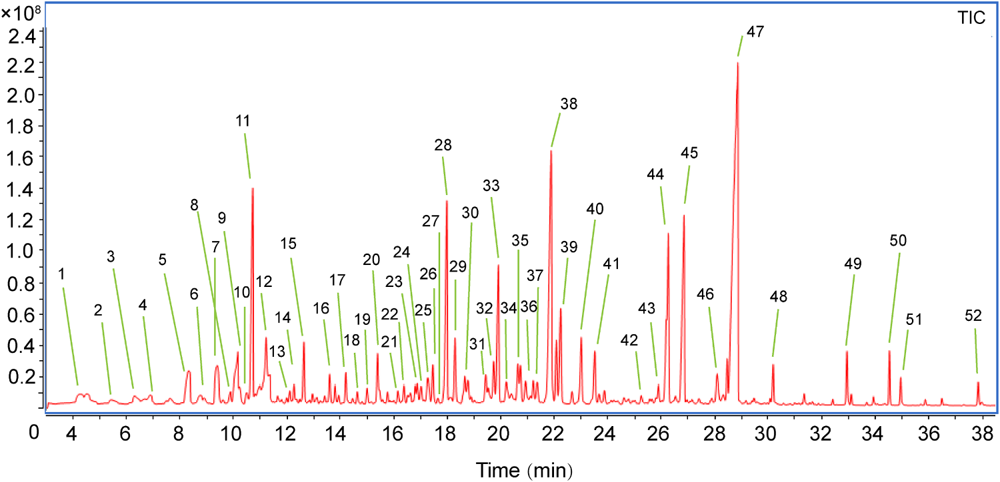
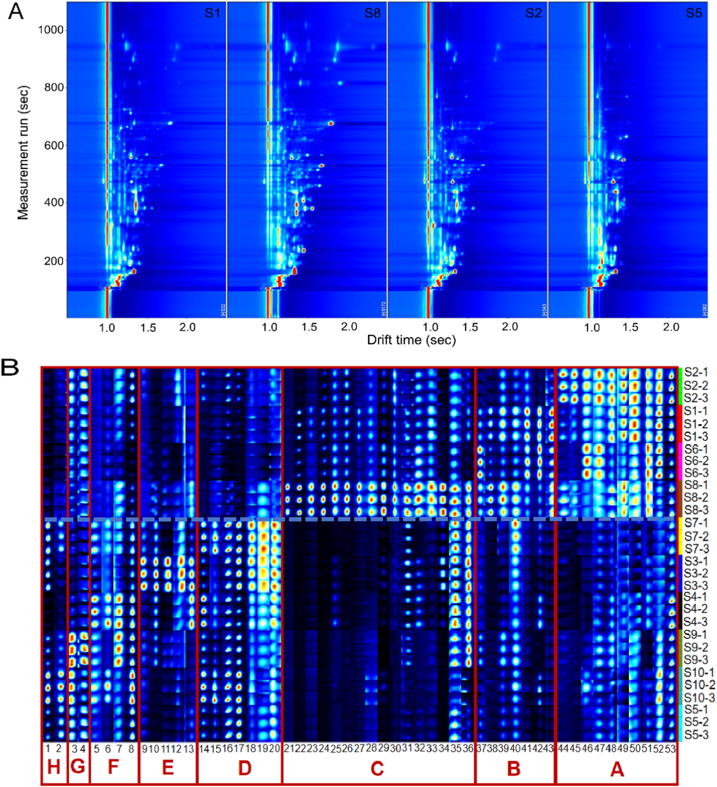

<!-- 方針: ほぼ全訳＋必要に応じた補足。原文構成に沿って訳出。「> 補足:」は訳者注。定量の詳細表（Table S1/S2・Fig. S7）は原文では補足資料（Supplementary）で本体PDFに含まれないため「原文参照」とした。 -->

## 書誌情報

- 原題: Comprehensive multicomponent characterization and quality assessment of Xiaoyao Wan by UPLC-Q-Orbitrap-MS, HS-SPME-GC-MS and HS-GC-IMS
- 著者: Jiaxin Yin, Tong Wu, Beibei Zhu, Pengdi Cui, Yang Zhang, Xue Chen, Hui Ding, Lifeng Han, Songtao Bie, Fangyi Li, Xinbo Song, Heshui Yu（責任著者）, Zheng Li（責任著者）（天津中医薬大学 中薬製薬工程学院／組分中薬国家重点実験室／現代中医薬海河実験室, 中国天津）
- 掲載: *Journal of Pharmaceutical and Biomedical Analysis* 239 (2024) 115910. https://doi.org/10.1016/j.jpba.2023.115910
- インパクトファクター: **3.1**（*J Pharm Biomed Anal*, JCR 2024 / Clarivate, Q2「Pharmacology & Pharmacy」。薬学分析分野の代表的国際誌。年により3.1〜3.6の値が報告される）
- 受領 2023-09-26 / 改訂 2023-12-02 / 採録 2023-12-05 / オンライン公開 2023-12-13。© 2023 Elsevier B.V.

> 補足: 逍遥丸（Xiaoyao Wan, XYW）は、宋代の医書『太平恵民和剤局方』由来の古典処方「逍遥散（Xiaoyao San）」を丸剤化したもの。**柴胡（radix bupleuri, RB）・芍薬（Paeonia lactiflora, PL）・当帰（angelica sinensis, AS）・白朮（atractylodes macrocephala, AM）・甘草（liquorice, L）・薄荷（mentha haplocalyx, MH）・茯苓（poria cocos, PC）・生姜（ginger, G）**の8生薬からなる。「疏肝解鬱（肝の滞りをほぐし気分を晴らす）・健脾養血（消化機能を整え血を養う）」の効能をもち、近年は抑うつ治療の常用古典方剤として注目されている。本論文は、これまで研究が薄かった XYW の「薬効物質基盤の解明」と「多成分による品質一貫性評価」を、3種の先端分析技術を組み合わせて行った報告。

> 補足（略語）: n-VOCs＝不揮発性有機化合物（non-volatile organic compounds）、VOCs＝揮発性有機化合物。UPLC-Q-Orbitrap-MS＝超高速液体クロマトグラフィー–四重極オービトラップ質量分析。HS-SPME-GC-MS＝ヘッドスペース固相マイクロ抽出–ガスクロマトグラフィー質量分析。HS-GC-IMS＝ヘッドスペース–ガスクロマトグラフィー–イオン移動度分析。PRM＝並行反応モニタリング（parallel reaction monitoring）。

## 要旨（Abstract）

逍遥丸（Xiaoyao Wan, XYW）は、「疏肝解鬱」および「健脾養血」の効能をもつ中医薬（TCM）の処方薬である。XYW は抑うつの治療で広く注目を集め、臨床でよく用いられる古典方剤の一つとなっている。しかし、XYW の薬効物質基盤と品質管理研究はこれまで極めて限られていた。本研究では、先端的な UPLC-Q-Orbitrap-MS、HS-SPME-GC-MS、HS-GC-IMS の技術を最大限に活用し、薬理学的物質基盤の深い特性解析と XYW の品質の定量的評価を目指した。第一に、**299 成分**を同定または推定的に同定した（不揮発性有機化合物（n-VOCs）198、揮発性有機化合物（VOCs）101）。第二に、主成分分析（PCA）と階層的クラスター分析（HCA）を用いて、異なるメーカーの XYW の品質差を解析した。第三に、並行反応モニタリング（PRM）法を確立・バリデーションし、XYW の品質評価の基準物質として選んだ**14 の主要有効成分**を、異なるメーカーの XYW について定量した。結論として、本戦略は中薬（TCM）の品質管理に有用な手法を提供し、TCM の品質一貫性を探るための実用的なワークフローを提供する。

## 1. 序論（Introduction）

近年、中医薬の処方製剤（TCMFPs）は、長い歴史・確かな効能・比較的少ない副作用ゆえに、世界中の人々からますます注目を集めている。逍遥散は『太平恵民和剤局方』に由来する古典処方で、**柴胡（RB）・芍薬（PL）・当帰（AS）・白朮（AM）・甘草（L）・薄荷（MH）・茯苓（PC）・生姜（G）**の8生薬からなる。肝と脾を調え、肝鬱を和らげ、血を養い、脾を強める機能をもつ。逍遥丸は逍遥散の製剤形である。近年、XYW は抑うつ治療で広く注目を集めており、臨床データと関連研究により、XYW が抑うつに確かな効能をもち、抑うつ治療の常用古典方剤の一つになっていることが示されている。

しかし既存研究の多くは、XYW が抗うつ効果を発揮する「機序」の研究に集中してきた。これらは XYW の治療効果が調節する経路や機序を解明するもので、また別の多くの研究者はメタボロミクス手法で代謝マーカーを研究し、抑うつ治療における XYW 臨床応用のバイオマーカーを見出してきた。上記の研究は XYW が抗うつ効果を発揮する機序を説明・証明するとともに、臨床的抑うつの早期診断のためのバイオマーカーも発見している。

品質の一貫性は常に TCM の懸案であり、TCM の効能の鍵は品質を管理して薬効を確保することにある。残念ながら、報告済み研究では XYW の物質基盤の特性解析と多成分品質管理手法に関する研究はほとんどない。さらに中国薬典（Chinese Pharmacopoeia）は、XYW の品質を**パエオニフロリン（芍薬苷）を検出指標として**評価すると規定するにとどまる。これまで XYW の品質管理手法は包括的でなく、総合的な品質管理戦略を欠いている。したがって、TCMFPs における多成分の品質一貫性評価を達成するため、合理的で有効な定性・定量戦略の確立が急務である。

技術の進歩とともに、クロマトグラフィーと質量分析は TCM 中の物質の特性解析における主要な測定ツールとなっている。LC–MS はクロマトグラフィーの高い分離能と、質量分析の高選択性・高感度・相対分子量および構造情報の提供という利点を相補的に併せ持ち、TCMFPs に広く用いられてきた。GC-MS は複雑系中の VOCs 検出において強力な分離・同定機能をもつが、薬物マトリックスの複雑さゆえに試料抽出が複雑かつ時間を要し、迅速検出が制限される。GC-MS を基礎に、HS-SPME-GC-MS はヘッドスペース固相マイクロ抽出の抽出・濃縮技術を統合して前処理を簡便化し、試料の迅速・非破壊検査を実現する。HS-GC-IMS は新しい気相分離・検出技術で、GC の高い分離能と IMS の迅速応答を組み合わせたもので、グリーン・高感度・前処理不要・迅速定量という特長から TCM・臨床・食品・環境分析に広く使われる。HS-GC-IMS は通常、小分子の VOCs を検出でき、中分子の VOCs しか捕捉できない HS-SPME-GC-MS の弱点を補う。

そこで本研究では、定性面では UPLC-Q-Orbitrap-MS・HS-SPME-GC-MS・HS-GC-IMS を組み合わせて、XYW の薬理物質基盤を n-VOCs と VOCs の両面から包括的に特性解析する戦略を確立した。定量面では、UPLC-Q-Orbitrap-MS に**並行反応モニタリング（PRM）**を組み合わせた手法を確立し、XYW 中の 14 の主要有効成分を定量した。従来の選択反応モニタリング（SRM）法と比べ、PRM はより広い質量範囲で複数成分を同時検出する特異性を高められ、検出干渉の影響が最小である。加えて PRM はすべての遷移を同時に検出でき、データ処理を減らし解析効率を高める。PRM での多成分同時定量の精度を高めるため、私たちはエネルギーレベルを調整した。調整後の PRM は、貧弱なパラメータで含量の多い成分の応答を抑え、最適なパラメータで微量物質の応答を促進する。この戦略により、XYW 中の 14 の薬理活性成分を同時定量した。

本研究では、UPLC-Q-Orbitrap-MS・HS-SPME-GC-MS・HS-GC-IMS を用いた包括戦略を確立し、計 **299 成分**を同定または推定同定した。同時に、**47 成分を標準品でさらに確認**した。PCA と HCA のデータは、XYW の品質がメーカー間で異なることを示した。加えて、UPLC-Q-Orbitrap-MS と PRM の組み合わせにより、含量の多い成分と微量成分を同時にモニタリングして XYW の多成分品質を評価した。本研究のデータは XYW の多成分品質管理の基礎と参照を提供し、私たちの戦略は TCM 品質の一貫性を探る実用的なワークフローを提供する。実験計画の模式図を Fig. 1 に示す。

## 2. 材料と方法（Materials and methods）

### 2.1. 材料・試薬

**47 種の標準化合物**を上海源葉生物科技（Shanghai Yuanye Biotech）から入手した。内訳は次のとおり（原文の番号順）。

- フラボノイド11種: 1 カテキン、2 リクイリチン、3 L-エピカテキン、4 ヘスペリジン、5 イソリクイリチンアピオシド、6 リクイリチゲニン、7 ケルセチン、8 カリコシン、9 イソリクイリチゲニン、10 リコフラノクマリン、11 リクイリチンアピオシド
- 有機酸7種: 12 クエン酸、13 プロトカテク酸、14 プロトカテクアルデヒド、15 クロロゲン酸、16 カフェ酸、17 フェルラ酸、18 3,5-O-ジカフェオイルキナ酸
- サポニン3種: 19 サイコサポニンA、20 サイコサポニンC、21 サイコサポニンD
- ラクトン3種: 22 アトラクチレノリドI、23 アトラクチレノリドII、24 アトラクチレノリドIII
- ブチルフタリド4種: 25 センキュノリドI、26 センキュノリドC、27 E-リグスチリド、28 Z-リグスチリド
- テルペノイド2種: 29 ヒドロキシパエオニフロリン、30 グリチルリチン酸
- 配糖体11種: 31 グアノシン、32 1,3-O-ジカフェオイルキナ酸、33 アルビフロリン、34 パエオニフロリン、35 ムダンピオシドE、36 オノニン、37 ベンゾイルパエオニフロリン、38 ベンゾイルアルビフロリン、39 ムダンピオシドD、40 ムダンピオシドH、41 アトラクチロシドA
- その他6種: 42 シリンギン、43 ケルシトリン、44 リコアグロカルコンB、45 センキュノリドH、46 センキュノリドA、47 レビストリドA

ギ酸（ACS, Wilmington, DE, 米国）、メタノールおよび HPLC グレードアセトニトリル（Fisher, 米国）。超純水は Watsons（香港）。XYW は**10 社の異なるメーカー**の製品を用い、S1〜S10 と表記した。HS-SPME-GC-MS 用の正規アルカン C8–C20 は Sigma Aldrich、HS-GC-IMS の保持指標（RI）算出用の標準混合物 N-ケトン C4–C9 は Sinopharm Chemical から購入した。

> 補足: 47 標準品の帰属は原文本文の綴りをそのまま音写した（原文には "7 quereetin"＝ケルセチン、"11 iquiritin apioside"＝リクイリチンアピオシド、"46 enkyunolide A"＝センキュノリドA など明らかな綴り欠落があり、文脈から補って訳出した）。標準品の総数は47・分類ごとの内数（11＋7＋3＋3＋4＋2＋11＋6）は原文どおり。

### 2.2. 試料前処理

異なるメーカーの XYW 試料を粉砕し、100 メッシュ篩でふるった。等量添加法で品質管理（QC）試料を調製した。XYW 試料 **0.5 g** を正確に量り、水 5 mL で希釈。超音波補助の水浴で **20 分**処理した。次に 75% メタノールを加えて **10 mL** に定容し、2 分間ボルテックス。**16,000 rpm・10 分**遠心後、上清を多成分特性解析用の XYW 試験液とした。HS-SPME-GC-MS・HS-GC-IMS 用試料は前処理不要で、XYW 試料 **1.0 g** を正確に量り、20 mL ヘッドスペースバイアルに入れて検出した。

### 2.3. 標準溶液

14 種の定量物質のストック溶液を、75% メタノールで濃度 **1 mg/mL** に調製。これを 75% メタノールで一連の濃度に希釈して検量線検出に用いた。すべての溶液は 4 ℃ で保存した。

### 2.3.1. 定性分析用 UPLC-Q-Orbitrap-MS 条件

UPLC-Q-Orbitrap-MS システムは、Q Exactive™ ハイブリッド四重極–オービトラップ質量分析計（Thermo Fisher Scientific, 米国）と Waters I Class ACQUITY™ UPLC システム（Waters, 米国）で構成。**カラムは ACQUITY UPLC® BEH C18（2.1 × 100 mm, 1.7 µm, Waters）、35 ℃**。移動相は **0.1% ギ酸水（A）とアセトニトリル（B）**で、グラジエントは以下。

| 時間（min） | 移動相A（0.1%ギ酸水）比 |
|---|---|
| 0–3 | 95% A |
| 3–12 | 95% → 77% A |
| 12–17 | 77% → 71% A |
| 17–25 | 71% → 55% A |
| 25–30 | 55% → 5% A |

流速 **0.3 mL/min**、注入量 **1 µL** で効率的かつ対称なピークが得られた。Q-Orbitrap は HESI 源の正・負イオンモードで同時運転。HESI 源パラメータ: スプレー電圧 3.0 kV、キャピラリー温度 350 ℃、補助ガスヒーター温度 400 ℃、補助ガス流量 8 arb、シースガス流量 35 arb、規格化衝突エネルギー（NCE）10/20/30 V。full MS/dd MS²（TopN）走査法で XYW の組成を特性解析し、フルスキャン範囲 m/z 100–1000。データ処理は Compound Discoverer™ 3.3 と Xcalibur 4.1（いずれも Thermo）。

> 補足: 2.3.1 の HESI 源設定は NCE 10/20/30 V・スプレー電圧 3.0 kV と記載されるが、後述 3.1 の最適化結果ではスプレー電圧 3.5 kV が最適とされる（原文ママ。最適化の最終条件は 3.5 kV と読むのが自然）。

### 2.3.2. 定性分析用 HS-SPME-GC-MS 条件

Agilent 7890B-7000D GC-MS 検出器＋SPME ファイバー（Supelco）からなるヘッドスペースオートサンプラー系。**カラムは HP-5MS フェニルメチルシロキサン（30 m × 0.25 mm × 0.25 µm, Agilent）弾性石英キャピラリー**。試料は 70 ℃・10 分インキュベート後、DVB/CAR/PDMS SPME 針（2 cm, 50/30 µm; Supelco）で 210 ℃にてヘッドスペース試料 500 µL を自動注入。昇温プログラム: 初期 50 ℃・2 分→10 ℃/min で 85 ℃→5 ℃/min で 120 ℃→2 ℃/min で 140 ℃→5 ℃/min で 210 ℃・2 分保持。キャリアガスはヘリウム（純度 99.999%）、流速 1.0 mL/min。EI 源・正イオンモード、イオン源温度 230 ℃・イオン化エネルギー 70 eV。走査範囲 m/z 30–600。データ処理は Masshunter（Agilent）。

### 2.3.3. 定性分析用 HS-GC-IMS 条件

HS-GC-IMS 装置（Flavourspec®, G.A.S, ドイツ）にオートサンプラー（CTC Analytics, スイス）と 1 mL 加熱気密シリンジを装備。**カラムは FS-SE-54-CB-1（15 m × 0.53 mm ID, 0.5 µm）**。試料は 70 ℃・250 rpm で 10 分インキュベート後、加熱シリンジで 70 ℃にてヘッドスペース試料 500 µL を注入口（75 ℃・スプリットレス）に自動注入。キャリアガスは窒素（99.999%）で、流量はまず 2 mL/min（2 分）→10 分かけて 10 mL/min →20 分かけて 150 mL/min として 10 分保持。ドリフト管（長さ 9.8 cm）は定温 45 ℃・電圧 5 kV で運転。ドリフトガス（N₂）流量 150 mL/min。

### 2.3.4. 定量分析用 UPLC-Q-Orbitrap-MS 条件

XYW の定量実験では、PRM モードで 14 標的化合物の規格化エネルギーを、10・20・30・40・50・60・70・80 V のエネルギー最適化グラジエントで調整・最適化した。最終的な調整最適化グラジエントを Table 1 に示す。

加えて、確立した定量法について、検出限界（LOD）と定量限界（LOQ）、日内・日間精度、併行精度（repeatability）、安定性、直線性と範囲、試料回収率を複数回レビューした。LOD・LOQ は S/N 比がそれぞれ 3・10 となる値で測定。日内精度は同日6反復、日間精度は3日間各3反復で評価。併行精度は6並行調製試料で評価。安定性試験は同一試料溶液を試料室温度（20 ℃）で 0・1・2・4・6・8・10・12・24 時間に分析。平均回収率は既知含量の XYW 試料に低・中・高濃度の混合標準溶液を添加して測定した。

**Table 1. PRM モードにおける XYW の 14 成分の関連情報。**

| 分析対象物 | Rt（min） | イオン化モード | 前駆体イオン（m/z） | プロダクトイオン（m/z） | 衝突エネルギー（V） |
|---|---|---|---|---|---|
| サイコサポニンA | 23.89 | ESI− | 825.4645 | 779.4537 | 10 |
| サイコサポニンD | 26.93 | ESI− | 825.4644 | 779.4537 | 10 |
| パエオニフロリン | 8.89 | ESI− | 525.1614 | 479.1566 | 10 |
| アルビフロリン | 8.36 | ESI− | 525.1614 | 479.1566 | 10 |
| リクイリチンアピオシド | 10.34 | ESI− | 549.1616 | 255.0662 | 30 |
| イソリクイリチンアピオシド | 13.01 | ESI− | 549.1615 | 255.0659 | 30 |
| ケルセチン | 14.60 | ESI− | 301.0351 | 151.0022 | 60 |
| リクイリチゲニン | 13.90 | ESI− | 255.0659 | 135.0074 | 40 |
| リグスチリド | 26.72 | ESI+ | 191.1065 | 173.0962 | 60 |
| リクイリチン | 10.26 | ESI+ | 419.1338 | 257.0805 | 20 |
| グリチルリチン酸 | 22.41 | ESI+ | 823.4104 | 453.3362 | 10 |
| アトラクチレノリドI | 28.59 | ESI+ | 231.1377 | 203.5741 | 60 |
| アトラクチレノリドII | 27.54 | ESI+ | 233.1533 | 215.1432 | 50 |
| アトラクチレノリドIII | 24.56 | ESI+ | 249.1483 | 231.1375 | 30 |

## 3. 結果と考察（Results and discussion）

### 3.1. UPLC-Q-Orbitrap-MS 定性分析

分解能と成分の存在量に影響しうる UPLC システムの主要パラメータを最適化した。ACQUITY UPLC® BEH C18 カラムは成分の存在量が高く分解能も良いため固定相に選定した。ピークの形状・数は移動相によっても変わる（水–メタノール／水–アセトニトリル／0.1% v/v ギ酸水–メタノール／0.1% v/v ギ酸水–アセトニトリル）。**0.1% v/v ギ酸水–アセトニトリル**を移動相にしたときピーク形状が最良であった（Fig. S1）。またカラム温度も分離に重要で、25・30・35・40 ℃を検討し **35 ℃**で複雑系試料の分離が最良と分かった（Fig. S2）。

Q-Orbitrap-MS/MS のイオン応答・開裂に影響しうる主要パラメータも最適化した。XYW の主要薬理活性成分は主にサポニン・フラボノイド・有機酸の3構造型を含む。そこで3カテゴリの代表6化合物（サイコサポニンA、サイコサポニンD、リクイリチゲニン、リクイリチン、クロロゲン酸、ポリコ酸A）を選び MS パラメータ最適化の参照とした。補助ガスヒーター温度・キャピラリー温度はイオン輸送効率に、スプレー電圧はイオン源のイオン応答に影響する主要因子である。単因子実験で最適化した結果——補助ガスヒーター温度（250/300/350/400 ℃）、キャピラリー温度（250/300/350/400 ℃）、スプレー電圧（2.5/3.0/3.5/4.0 kV）——イオン応答の変化から、**補助ガスヒーター温度 400 ℃・キャピラリー温度 350 ℃・スプレー電圧 3.5 kV**が最適条件と決定した（Fig. S3）。

確立した UPLC-Q-Orbitrap-MS で正・負両 ESI モードの high-definition MSᴱ を取得し XYW の多成分をプロファイルした。Compound Discoverer™ 3.3 でオンライン DB（mzCloud）・ローカル DB（mzVault）による予備予測を行い、Xcalibur 4.1 でイオンピーク保持時間・m/z・二次特性イオン開裂により更に解析した。既報文献および 47 標準品との比較により、XYW 中に **198 成分を同定または予備同定**した。内訳: **フラボノイド52、サポニン・配糖体48、有機酸26、フェノール酸14、テルペノイド11、フタリド9、ラクトン8、アントラキノン5、フェニルプロパノイド4、アミノ酸2、その他19**。成分リストは Table S1（原文補足資料）。正・負イオンモードの全イオンクロマトグラム（TIC）を Fig. 2 に示す。

### 3.2. HS-SPME-GC-MS 定性分析

XYW の VOCs を HS-SPME-GC-MS で解析した。最適条件で VOCs を分離した結果を Fig. 3 に示す。実験前に3つの主要パラメータを最適化した。抽出ファイバー膜の種類は VOCs の吸着能に、抽出温度・時間は試料の分離度に影響しうる。まず PDMS・PDMS/DVB・DVB/CAR/PDMS の3種の抽出ファイバー膜を最適化（Fig. S4）。**DVB/CAR/PDMS プローブ**でクロマトピークが最も豊富であった。次に抽出温度（50/60/70/80 ℃）と抽出時間（5/10/15/20 min）を最適化（Fig. S5）。捕捉化合物の量と含量の比較から、**インキュベート温度 70 ℃・時間 10 分**が最適と分かった。

スペクトルピークは化学ワークステーションの **NIST.17** 標準質量スペクトルライブラリで未知化合物を定性解析し、各化合物の保持指標（RI）は **N-アルカン C8–C20 を外部参照**として算出した。保持指標・マッチング値・文献参照により正・負両 ESI モードで **52 成分**を同定した（Table 2）。主成分はテルペノイド19種、ほかフェノール成分9、複素環成分6、ケトン成分6、エステル成分5、アルコール成分2、その他5。

**Table 2. HS-SPME-GC-MS による XYW 中 VOCs の同定。**（RI1: NIST.17 標準質量スペクトルライブラリで算出した標準保持指標／RI2: N-アルカン C8–C20 を外部参照として算出した実測保持指標）

| No. | RT（min） | 化合物 | CAS | RI1 | RI2 |
|---|---|---|---|---|---|
| 1 | 4.24 | フルフラール | 98-01-1 | 841 | 833 |
| 2 | 5.45 | 2-アセチルフラン | 1192-62-7 | 919 | 911 |
| 3 | 6.31 | 5-メチルフルフラール | 620-02-0 | 971 | 965 |
| 4 | 6.89 | オクタメチルシクロテトラシロキサン | 556-67-2 | 1002 | 994 |
| 5 | 8.32 | 2-アセチルピロール | 1072-83-9 | 1075 | 1064 |
| 6 | 9.40 | 3-ヒドロキシ-2-メチル-4H-ピラン-4-オン | 118-71-8 | 1124 | 1110 |
| 7 | 9.89 | 1,3-ベンゾジオキソール, 3a,7a-ジヒドロ-2,2,4-トリメチル- | 35502-40-8 | 1147 | 1148 |
| 8 | 10.17 | 2,3-ジヒドロ-3,5-ジヒドロキシ-6-メチル-4(H)-ピラン-4-オン | 28564-83-2 | 1159 | 1151 |
| 9 | 10.22 | イソメントン | 491-07-6 | 1161 | 1164 |
| 10 | 10.50 | シトロネラール | 106-23-0 | 1173 | 1153 |
| 11 | 10.72 | ジヒドロテルピネオール | 21129-27-1 | 1182 | 1178 |
| 12 | 11.23 | サリチル酸メチル | 119-36-8 | 1203 | 1192 |
| 13 | 12.11 | 5-ヒドロキシメチルフルフラール | 67-47-0 | 1241 | 1233 |
| 14 | 12.26 | (+)-プレゴン | 89-82-7 | 1247 | 1237 |
| 15 | 12.64 | ピペリトン | 89-81-6 | 1262 | 1253 |
| 16 | 13.80 | 2-ヒドロキシ-6-(イソプロピル)-3-メチルシクロヘキサ-2-エン-1-オン | 490-03-9 | 1306 | 1302 |
| 17 | 14.21 | 4-ヒドロキシ-3-メトキシスチレン | 7786-61-0 | 1321 | 1317 |
| 18 | 14.63 | 1,5,5-トリメチル-6-メチレンシクロヘキセン | 514-95-4 | 1336 | 1338 |
| 19 | 15.00 | 3-メチル-6-(1-メチルエチリデン)シクロヘキサ-2-エン-1-オン | 491-09-8 | 1348 | 1340 |
| 20 | 15.39 | バレロフェノン | 1009-14-9 | 1361 | 1374 |
| 21 | 16.15 | モドフェン | 68269-87-4 | 1386 | 1385 |
| 22 | 16.38 | ベルケヤラドゥレン | 65372-78-3 | 1393 | 1386 |
| 23 | 16.79 | (-)-α-グルジュネン | 489-40-7 | 1405 | 1409 |
| 24 | 17.02 | シクロペンタ[c]ペンタレン, デカヒドロ-1,3a,5a-トリメチル-4-メチ… | 71596-72-0 | 1412 | 1412 |
| 25 | 17.27 | (+)-β-フネブレン | 79120-98-2 | 1419 | 1414 |
| 26 | 17.46 | β-カリオフィレン | 87-44-5 | 1425 | 1419 |
| 27 | 17.98 | (+)-アロマデンドレン | 489-39-4 | 1440 | 1440 |
| 28 | 18.29 | パエオノール | 552-41-0 | 1448 | 1438 |
| 29 | 18.65 | α-カリオフィレン | 6753-98-6 | 1458 | 1454 |
| 30 | 18.77 | アモルファジエン | 92692-39-2 | 1462 | 1458 |
| 31 | 19.44 | グアイエン | 88-84-6 | 1479 | 1490 |
| 32 | 19.73 | イリソン | 14901-07-6 | 1487 | 1491 |
| 33 | 19.91 | α-セリネン | 473-13-2 | 1491 | 1494 |
| 34 | 20.21 | エレモフィレン | 10219-75-7 | 1499 | 1499 |
| 35 | 20.63 | (+)-クパレン | 16982-00-6 | 1510 | 1505 |
| 36 | 20.73 | エレモフィレン | 10219-75-7 | 1513 | 1499 |
| 37 | 20.93 | ジブチルヒドロキシトルエン（BHT） | 128-37-0 | 1518 | 1513 |
| 38 | 21.88 | ナフタレン, デカヒドロ-4a-メチル-1-メチレン-7-(1-メチルエチリデン)-, (4aR,8aS)-rel- | 58893-88-2 | 1543 | 1544 |
| 39 | 22.08 | ナフタレン, デカヒドロ-4a-メチル-1-メチレン-7-(1-メチルエチリデン)-, (4aR,8aS)-rel- | 58893-88-2 | 1548 | 1544 |
| 40 | 22.24 | 1-ナフタレノール, 1,2,3,4,4a,5,6,7-オクタヒドロ-4a,5-ジメチル-3-(1-メチルエテニル)- | 61847-19-6 | 1552 | 1553 |
| 41 | 22.67 | ゲルマクレンB, 1,5-ジメチル-8-(1-メチルエチリデン)-1,5-シクロデカジエン | 15423-57-1 | 1563 | 1557 |
| 42 | 23.51 | 1H-シクロプロプ[e]アズレン-7-オール, デカヒドロ-1,1,7-トリメチル-4-メチレン-, (1aS,4aS,7R,7aS,7bS)- | 77171-55-2 | 1583 | 1577 |
| 43 | 23.87 | 1H-シクロプロプ[e]アズレン-7-オール, デカヒドロ-1,1,7-トリメチル-4-メチレン-, (1aS,4aS,7R,7aS,7bS)- | 77171-55-2 | 1592 | 1577 |
| 44 | 25.89 | 2-アミノ-4-tert-アミルフェノール | 91339-74-1 | 1653 | 1672 |
| 45 | 26.26 | アトラクチリン | 6989-21-5 | 1664 | 1662 |
| 46 | 26.53 | 5-アズレンメタノール | 22451-73-6 | 1672 | 1667 |
| 47 | 26.86 | N-ブチリデンフタリド | 551-08-6 | 1682 | 1675 |
| 48 | 28.46 | α-シペロン | 473-08-5 | 1739 | 1755 |
| 49 | 28.62 | Z-リグスチリド | 81944-09-4 | 1744 | 1740 |
| 50 | 30.19 | 1(3H)-イソベンゾフラノン, 3-ブチリデン-4,5-ジヒドロ-, (3E)- | 81944-08-3 | 1802 | 1810 |
| 51 | 34.53 | パルミチン酸エチルエステル | 628-97-7 | 1998 | 1993 |
| 52 | 37.85 | (9E,11E)-9,11-オクタデカジエン酸メチルエステル | 13038-47-6 | 2181 | 2187 |

> 補足: Table 2 の CAS 番号は原文で桁区切りが崩れているもの（例 No.4 "556–672"、No.7 "1,35,502–40–8"）があり、化合物名から正しい CAS に補正して転記した（No.4 オクタメチルシクロテトラシロキサン＝556-67-2、No.7＝35502-40-8）。No.37 は原文表記 "Butylated hydroxytoluene"（BHT）。No.24 の化合物名は原文でも途中まで（"…4-meth"）で切れており、原文ママ。

### 3.3. HS-GC-IMS 定性分析

異なるメーカーの HS-GC-IMS 解析の試料情報を、地形図（topographic map）と指紋図（fingerprint）で Fig. 4 に示す。Fig. 4A は HS-GC-IMS 検出で得た XYW の地形図で、4メーカーの薬物画像を表示する。縦軸は GC の保持時間、横軸はイオン移動時間。画像全体の背景は青、横軸 1.0 の赤い縦線が反応イオンピーク（RIP, 正規化）。RIP の両側の各点が1つの VOC を表し、色はピーク強度（白＝低、赤＝高、色が濃いほど高強度）。

GC-IMS データの抽出・解析は Laboratory Analytical Viewer（LAV, v2.2.1, G.A.S）で行った。VOCs は GC-IMS Library Search の IMS データベースに基づいて同定。各化合物の保持指標（RI）は **N-ケトン C4–C9 を外部参照**として算出した。その結果、**49 VOCs を予備同定または同定**（詳細は Table 3）。Fig. 4B の各行は1試料の選択シグナルピーク全体、各列は異なる試料での同一 VOC のシグナルピークを表す。全体傾向として、試料 **S1・S2・S6・S8** は同じ変化傾向を示し、物質含量は左から右へ増加傾向を示す。逆に **S3・S4・S5・S7・S9・S10** の物質は徐々に減少傾向を示した。標識領域 A・B・C の物質（オクタン酸、4-メチルアセトフェノン、2,6-ジクロロフェノール、4-エチル-2-メトキシフェノール等）は S1・S2・S6・S8 で特有かつ含量が比較的高い。一方、領域 D・E・F・G・H の物質（プロピレングリコール、2-ヘキセン-1-オール、1-ヘキサノール、ペンタン酸等）は S3・S4・S5・S7・S9・S10 に特有であった。

**Table 3. XYW 中 VOCs の HS-GC-IMS 積分パラメータ。**（monmer＝monomer 単量体の原文表記ママ、dimer＝二量体。RI は N-ケトン C4–C9 を外部参照として算出）

| No. | Rt（min） | 分子式 | 化合物 | CAS# | RI |
|---|---|---|---|---|---|
| 1 | 2.59 | C4H8O | ブタナール monmer | C123728 | 610 |
| 2 | 3.91 | C5H10O2 | プロパン酸エチル monmer | C105373 | 712 |
| 3 | 3.96 | C4H8O2 | 3-ヒドロキシ-2-ブタノン monmer | C513860 | 714 |
| 4 | 3.97 | C5H8O2 | メタクリル酸メチル monmer | C80626 | 714 |
| 5 | 4.67 | C5H12O | 3-メチルブタノール monmer | C123513 | 741 |
| 6 | 4.72 | C5H8O | (E)-2-ペンテナール monmer | C1576870 | 743 |
| 7 | 5.72 | C4H8O2 | 2-メチルプロパン酸 monmer | C79312 | 775 |
| 8 | 5.74 | C3H8O2 | プロピレングリコール monmer | C57556 | 776 |
| 9 | 6.34 | C6H12O | ヘキサナール monmer | C66251 | 799 |
| 10 | 6.82 | C4H10FO2P | サリン monmer | C107448 | 820 |
| 11 | 6.85 | C5H10O3 | 2-ヒドロキシプロパン酸エチル（乳酸エチル）monmer | C97643 | 821 |
| 12 | 7.08 | C5H4O2 | フルフラール monmer | C98011 | 831 |
| 13 | 7.10 | C6H14O | 2-メチル-1-ペンタノール monmer | C105306 | 832 |
| 14 | 7.41 | C6H10O | 2-メチルシクロペンタノン monmer | C1120725 | 845 |
| 15 | 7.63 | C6H5Cl | クロロベンゼン monmer | C108907 | 853 |
| 16 | 7.86 | C6H12O | 2-ヘキセン-1-オール monmer | C2305217 | 862 |
| 17 | 7.88 | C6H14O | 1-ヘキサノール monmer | C111273 | 863 |
| 18 | 8.18 | C6H14O | 1-ヘキサノール dimer | C111273 | 874 |
| 19 | 8.19 | C5H10O2 | 3-メチルブタン酸 monmer | C503742 | 874 |
| 20 | 8.43 | C5H10O2 | ペンタン酸 monmer | C109524 | 883 |
| 21 | 8.59 | C7H14O | 2-ヘプタノン monmer | C110430 | 888 |
| 22 | 8.83 | C7H14O | ヘプタナール dimer | C111717 | 898 |
| 23 | 8.87 | C7H14O | ヘプタナール monmer | C111717 | 900 |
| 24 | 8.87 | C8H8 | スチレン monmer | C100425 | 900 |
| 25 | 9.14 | C6H8O | 2,4-ヘキサジエナール, (E,E)- monmer | C142836 | 913 |
| 26 | 9.23 | C7H14O2 | ヘキサン酸メチルエステル monmer | C106707 | 917 |
| 27 | 9.45 | C4H6O2 | ジヒドロ-2(3H)-フラノン monmer | C96480 | 927 |
| 28 | 9.46 | C7H14O2 | ヘキサン酸メチルエステル monmer | C106707 | 927 |
| 29 | 10.38 | C7H16O | ヘプタノール monmer | C53535334 | 967 |
| 30 | 10.52 | C6H6O3 | 2-フロ酸メチル monmer | C611132 | 973 |
| 31 | 10.98 | C10H16 | ミルセン monmer | C123353 | 991 |
| 32 | 11.09 | C9H14O | 2-ペンチルフラン monmer | C3777693 | 995 |
| 33 | 11.27 | C8H16O | オクタナール monmer | C124130 | 1004 |
| 34 | 11.30 | C7H8O | ベンジルアルコール monmer | C100516 | 1005 |
| 35 | 11.30 | C8H14O2 | (Z)-3-ヘキセニルアセテート monmer | C3681718 | 1005 |
| 36 | 11.81 | C10H16 | リモネン monmer | C138863 | 1029 |
| 37 | 11.90 | C10H18O | 1,8-シネオール monmer | C470826 | 1033 |
| 38 | 12.11 | C10H16 | β-オシメン monmer | C13877913 | 1042 |
| 39 | 12.80 | C8H18O | 1-オクタノール monmer | C111875 | 1072 |
| 40 | 13.28 | C6H8O3 | 2,5-ジメチル-4-ヒドロキシ-3(2H)-フラノン（フラネオール）monmer | C3658773 | 1091 |
| 41 | 13.63 | C9H18O2 | プロパン酸ヘキシル monmer | C2445763 | 1105 |
| 42 | 13.68 | C9H18O | n-ノナナール monmer | C124196 | 1107 |
| 43 | 14.44 | C8H16O3 | 3-ヒドロキシヘキサン酸エチル monmer | C2305251 | 1136 |
| 44 | 14.99 | C10H18O | シトロネラール dimer | C106230 | 1156 |
| 45 | 15.00 | C10H18O | シトロネラール monmer | C106230 | 1156 |
| 46 | 15.73 | C8H16O2 | オクタン酸 monmer | C124072 | 1182 |
| 47 | 15.79 | C9H10O | 4-メチルアセトフェノン monmer | C122009 | 1183 |
| 48 | 16.37 | C6H4Cl2O | 2,6-ジクロロフェノール monmer | C87650 | 1203 |
| 49 | 18.88 | C9H12O2 | 4-エチル-2-メトキシフェノール monmer | C2785899 | 1279 |

> 補足: Table 3 の "monmer" は原文表記のまま（monomer＝単量体の誤植と思われる）。No.10「サリン（Sarin, C107448）」は神経ガスとして知られるが、GC-IMS ライブラリ照合による予備同定であり、分子式 C4H10FO2P が偶然一致した誤帰属の可能性が高い（原文ママ。生薬由来成分として実在するとは考えにくい）。

### 3.4. 総合解析（Comprehensive analysis）

UPLC-Q-Orbitrap-MS・HS-SPME-GC-MS・HS-GC-IMS 解析で **299 成分**を同定した。うち 198 成分は UPLC-Q-Orbitrap-MS、52 成分は HS-SPME-GC-MS、49 成分は HS-GC-IMS で同定。198 n-VOCs はフラボノイド・サポニン・ラクトン・有機酸が主成分、101 VOCs はテルペノイド・フェノール・エステルが主。

PCA は教師なしの多変量統計法で、大量データを次元圧縮して試料間の規則性・差異を解析する。UPLC-Q-Orbitrap-MS・HS-SPME-GC-MS・HS-GC-IMS の検出データに PCA を実施した（Fig. 5、SIMCA 14.1）。試料 **S1・S2・S6・S8** は X 軸負側に類似して位置し、**S3・S4・S5・S7・S9・S10** は X 軸正側に類似して位置した（Fig. 5A）。両群は n-VOCs で有意に異なり、VOCs（Fig. 5C, E）でも有意差を示した。HCA は異なるカテゴリのデータ点間の類似度を計算して階層的入れ子クラスタを作る。HCA データは S1・S2・S6・S8 の成分が類似、S3・S4・S5・S7・S9・S10 の成分が非常に類似することを示した（Fig. 5B, D, F）。結果として PCA・HCA・指紋データはいずれも、S1・S2・S6・S8 群と S3・S4・S5・S7・S9・S10 群という **2つの主要な化学組成傾向**に 10 メーカーの XYW が分かれることを示した。

### 3.5. UPLC-Q-Orbitrap-MS 定量分析

XYW は 2000 年以上、肝損傷の治療と抗うつ薬として広く用いられてきた。中国薬典はパエオニフロリンを XYW の品質管理指標と規定する。柴胡（radix bupleuri）は XYW の肝疾患治療の君薬（主薬）で、サイコサポニンA・サイコサポニンD はともに抑うつ様行動を改善することが示されているが、両者の治療効果発揮の調節機序は異なる。ケルセチンも関連炎症因子の調節により肝損傷を防護しうる。芍薬（Paeonia lactiflora）中のパエオニフロリン・アルビフロリンは抑うつ様行動の改善効果が証明され、特にパエオニフロリンは産後うつを有効に改善しうる。甘草中のフラボノイドは抑うつに有意な効果があり、リクイリチゲニンは潜在的抗うつ薬として期待される。当帰中のリグスチリドは慢性うつを改善しうる。アトラクチレノリドI・II・III は白朮の主要活性成分で、白朮が抗うつ薬として常用される理由でもある。以上の予備検討と文献レビューに基づき、**14 化合物（サイコサポニンA、サイコサポニンD、パエオニフロリン、アルビフロリン、リクイリチンアピオシド、イソリクイリチンアピオシド、ケルセチン、リクイリチゲニン、リグスチリド、リクイリチン、グリチルリチン酸、アトラクチレノリドI、アトラクチレノリドII、アトラクチレノリドIII）**を XYW の品質管理の基準物質と定めた。

イオン化エネルギーは二次フラグメントに影響する。そこで確立した PRM モードで、正・負両イオンモードにおいて 14 品質標識成分のエネルギーを調整した。まず 14 基準物質のリストを作り異なるエネルギーレベルを設定、次に各成分の各エネルギーでの応答を解析、最後に総合解析により合意した応答レベル範囲内でできるだけ 14 基準物質を正確に同時定量した。調整 PRM は質量応答を促進または抑制する利点をもった（Fig. S6）。したがって、確立した調整 PRM と UPLC-Q-Orbitrap-MS を組み合わせた戦略は正確・信頼でき、XYW の多成分同時定量を達成できる。上記条件下で 14 基準物質は干渉なく正確に検出でき、高い選択性を示した。

手法バリデーションは正・負両イオンモードで実施し、直線性・併行精度・精度・安定性・回収率を Table S2（原文補足資料）に示した。**14 基準物質の回帰方程式は広い濃度範囲で高い相関係数（R² > 0.999）で定量された。LOD・LOQ はそれぞれ 0.03〜6.13 ng/mL・0.10〜20.42 ng/mL の範囲。各成分の併行精度・日内精度・日間精度・安定性はいずれも 5% 未満。平均回収率は 84.86〜105.09%、RSD 値は 0.20〜4.93% の範囲**であった。以上より、確立した手法は XYW 主要成分の定量に高感度・高効率・正確であることが示された。

定量的には、XYW 中の 14 基準物質はメーカー間で大きく変動した（Fig. S7）。メーカー間の製法差にもかかわらず、パエオニフロリン・アルビフロリン・サイコサポニンA・リグスチリド・グリチルレチン酸・リクイリチンアピオシド・イソリクイリチンアピオシドはそれぞれの比率で相対的に高含量で、抗うつ活性を発揮する鍵成分の一つであることが改めて確認された。XYW の主要抗うつ成分であるサイコサポニンA はメーカー間で含量差が大きく（Fig. S7B）、例えば試料 S2 と S9 で約 **8 倍**の差があった。パエオニフロリンは XYW 中で最高含量だが（Fig. S7D）、メーカー間差が有意で、例えば S4・S10 は S7・S8 の約 1.5 倍。他成分——特にサイコサポニンD・リクイリチゲニン・アトラクチレノリドI/II/III・ケルセチン（Fig. S7 I–N）——の含量差も比較的大きかった。特筆すべきは、サイコサポニンD の含量が S3・S4・S5・S7・S9・S10 で極めて低いのに対し S1・S2・S6・S8 で極めて高く、メーカー間で**数十倍**変動した点である。薬品質の一貫性は薬効に影響する主要因子の一つであり、製法・原料品質等の差により薬品質に有意差が生じる。この品質差は臨床効果に影響する潜在因子の一つである。したがって本法は XYW の品質管理の基礎を築き、臨床の抗うつ治療における投薬指導に役立ちうる。

> 補足: 定量結果の数値詳細（14成分×10メーカーの実含量値、Table S2 のバリデーション個別値、Fig. S7 のメーカー別棒グラフ）はいずれも原文の**補足資料（Supplementary）**にあり、本体PDFには含まれない（原文参照）。本文で明示されるのは上記の範囲値（R²>0.999、LOD 0.03〜6.13 ng/mL、LOQ 0.10〜20.42 ng/mL、回収率 84.86〜105.09%、RSD 0.20〜4.93%）と、サイコサポニンAで約8倍・サイコサポニンDで数十倍・パエオニフロリンで約1.5倍というメーカー間の含量差の記述のみである。なお本文はグリチルリチン酸（定量14成分の1つ）とグリチルレチン酸を混在して表記しており（3.5節冒頭は"glycyrrhizic acid"、後半は"glycyrrhetinic acid"）、原文ママとした。

## 4. 結論（Conclusion）

実用的な品質評価の深い検討と確立という理念に基づき、本研究は UPLC-Q-Orbitrap-MS・HS-SPME-GC-MS・HS-GC-IMS の戦略により、10 メーカーの XYW の包括的な多成分特性解析と品質評価を達成した。UPLC-Q-Orbitrap-MS は XYW 多成分のプロファイリングと特性解析に極めて強力で、198 成分を推定同定した。加えて HS-SPME-GC-MS・HS-GC-IMS で計 **101 VOCs** を検出し、XYW の成分種を豊かにした。新規開発の3手法は XYW の n-VOCs と VOCs を包括的に特性解析できた。続いて PCA・HCA は異なるメーカーの XYW の化学組成に有意差があることを示した。XYW の異なる製法が品質差の主要因の一つと考えられる。最後に、調整 PRM 法により 10 メーカーの XYW 試料中の 14 品質標識成分を正確・高感度に定量できた。特筆すべきは、14 薬理成分の含量がメーカー間で大きく変動した点で、含量の変動は薬効に影響しうる。これらの結果は、提案戦略が高い価値をもち、TCM 製剤の包括的同定と品質一貫性評価の課題を解決しうることを示す。

## 訳者補足

- **本論文の位置づけ**: 中薬複方（8生薬からなる逍遥丸）の品質評価を、「不揮発成分（UPLC-Q-Orbitrap-MS）」と「揮発成分（HS-SPME-GC-MS＋HS-GC-IMS）」の両輪で網羅した点が特徴。多くの中薬 QC 研究が不揮発の指標成分（HPLCで測るフラボノイド・サポニン等）に偏るのに対し、精油・芳香成分（薄荷・生姜・当帰などが寄与）を含む VOCs まで捉えており、処方全体の化学像に踏み込んでいる。薬典が **パエオニフロリン1成分**でしか XYW を規定していないという現状課題への直接の回答になっている。
- **「調整PRM（adjusted PRM）」とは**: 質量分析の定量モードの一つ PRM（並行反応モニタリング）で、成分ごとに衝突エネルギー（本研究では10〜80Vから選定）を個別最適化する工夫。含量の多い成分はあえて非最適条件で応答を抑え、微量成分は最適条件で応答を上げることで、含量が桁違いに異なる成分（例：パエオニフロリンは高含量、サイコサポニン類やアトラクチレノリド類は微量）を1回の測定で同時に精度よく測れる。Table 1 の衝突エネルギー欄がその最適化結果にあたる。
- **メーカー2群化の実務的含意**: PCA/HCA・GC-IMS指紋・定量のいずれでも、10メーカーが {S1,S2,S6,S8} と {S3,S4,S5,S7,S9,S10} の2群に一貫して分かれた。特にサイコサポニンD（柴胡由来の抗うつ関連成分）が前群で高く後群で極端に低い（数十倍差）という結果は、同じ「逍遥丸」でも製品によって化学的中身が大きく違いうることを示す。単一指標（薬典のパエオニフロリン）だけでは捉えられない品質差であり、多成分・多技術による評価の必要性を実データで示した。
- **数値の出所について**: 本体PDFに数値表として掲載されているのは Table 1（PRMパラメータ）・Table 2（GC-MS の VOCs 52成分）・Table 3（GC-IMS の VOCs 49成分）のみ。198 n-VOCs の一覧（Table S1）と 14 成分の検量線・バリデーション個別値（Table S2）・メーカー別含量（Fig. S7）は補足資料で、本解説では本文中の範囲値・比率記述のみを転記した（詳細は原文補足資料を参照）。
