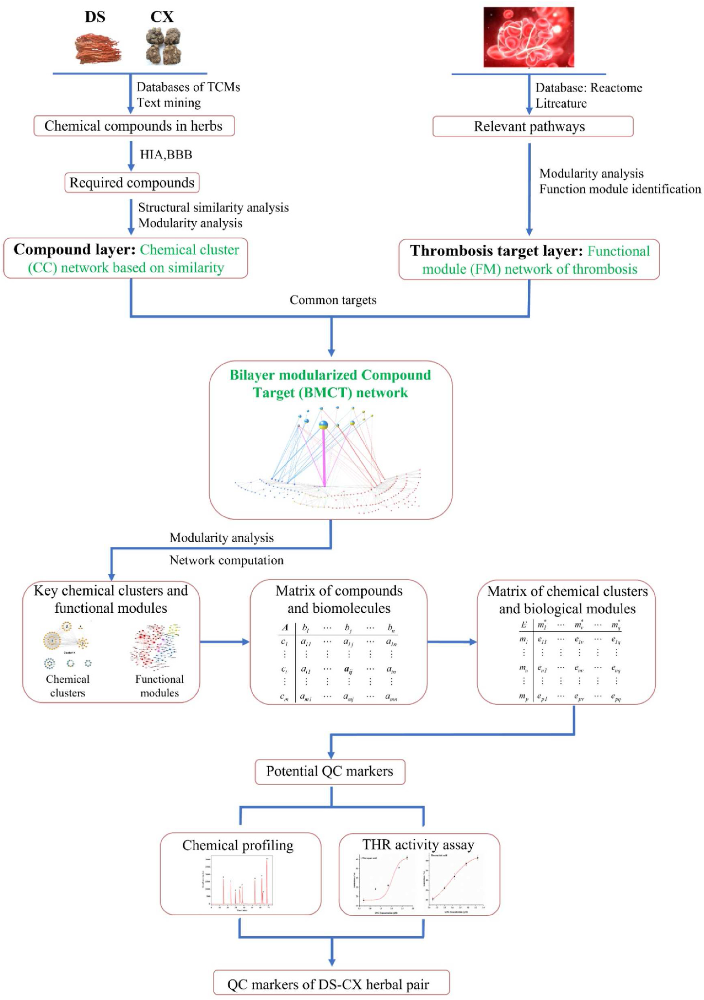
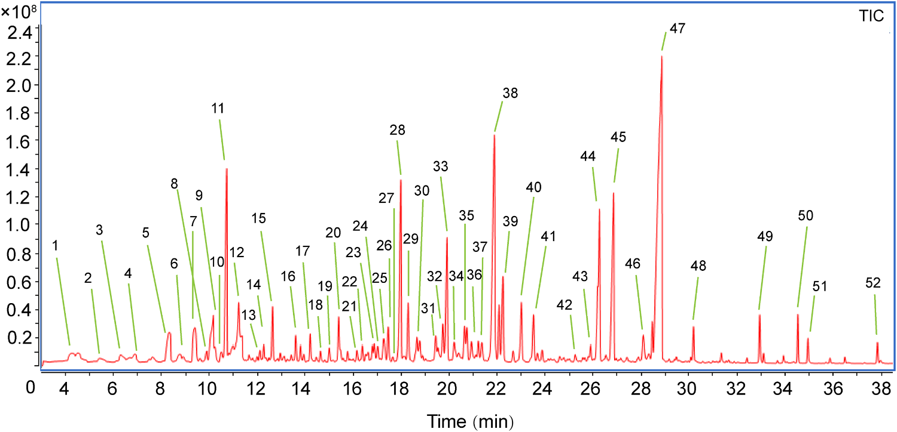
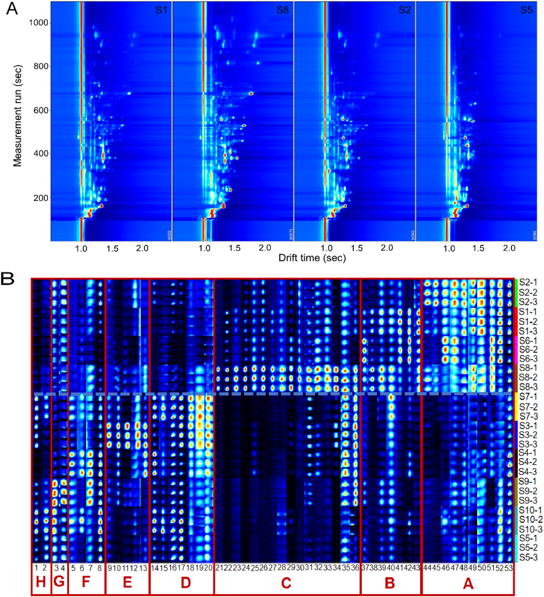

## 書誌情報

- 標題（原題）: Comprehensive multicomponent characterization and quality assessment of Xiaoyao Wan by UPLC-Q-Orbitrap-MS, HS-SPME-GC-MS and HS-GC-IMS
- 著者: Jiaxin Yin, Tong Wu, Beibei Zhu, Pengdi Cui, Yang Zhang, Xue Chen, Hui Ding, Lifeng Han, Songtao Bie, Fangyi Li, Xinbo Song, Heshui Yu（責任著者）, Zheng Li（責任著者）
- 所属: 天津中医薬大学 中薬制薬工程学院／中薬複方国家重点実験室／現代中医薬海河実験室（いずれも中国・天津）
- 掲載誌・巻号: Journal of Pharmaceutical and Biomedical Analysis, 239 (2024) 115910
- DOI: https://doi.org/10.1016/j.jpba.2023.115910
- インパクトファクター: **3.6**（*J. Pharm. Biomed. Anal.*, JCR 2024 / Clarivate）
- 受理経過: 2023年9月26日受付、2023年12月2日改訂受理、2023年12月5日受理、2023年12月13日オンライン公開。© 2023 Elsevier B.V. All rights reserved.

## 要旨（Abstract）

逍遥丸（Xiaoyao Wan; XYW）は「疏肝解鬱（肝を疏し鬱を解く）」「健脾養血（脾を強め血を養う）」の効能を持つ伝統中医薬（TCM）の処方薬であり、うつ病治療への応用が広く注目され、臨床でよく用いられる古典的処方の一つとなっている。しかし、XYWの薬効物質基盤および品質管理研究はこれまで極めて限られていた。本研究は、超高速液体クロマトグラフィー四重極オービトラップ質量分析（UPLC-Q-Orbitrap-MS）、ヘッドスペース固相マイクロ抽出ガスクロマトグラフィー質量分析（HS-SPME-GC-MS）、ヘッドスペースガスクロマトグラフィーイオン移動度分析（HS-GC-IMS）の各技術を十分に活用し、XYWの薬理学的物質基盤を深く特性評価するとともにその品質を定量的に評価することを目的とした。まず、299種の化合物が同定または暫定的に特性評価され、そのうち198種は不揮発性有機化合物（n-VOCs）、101種は揮発性有機化合物（VOCs）であった。次に、主成分分析（PCA）と階層クラスタ分析（HCA）を用いて、異なるメーカーのXYWにおける品質差を解析した。第三に、パラレルリアクションモニタリング（PRM）法を確立・validationし、異なるメーカーのXYWにおける14種の主要有効物質を同時定量した。これらは、XYWの品質を評価するためのベンチマーク物質として選定された。結論として、本研究が示す戦略はTCMの品質管理に有用な方法を提供し、TCMの品質一貫性を探索するための実践的なワークフローを提供する。

## 1. 序論（Introduction）

近年、伝統中医薬処方製剤（TCMFPs）は、その長い歴史・確かな効能・比較的少ない副作用のために、世界中でますます注目を集めている[1]。逍遥散（Xiaoyao San）は『太平恵民和剤局方』に由来する古典的処方であり、柴胡（radix bupleuri; RB）、芍薬（Paeonia lactiflora; PL）、当帰（angelica sinensis; AS）、白朮（atractylodes macrocephala; AM）、甘草（liquorice; L）、薄荷（mentha haplocalyx; MH）、茯苓（poria cocos; PC）、生姜（ginger; G）の8味の中薬から構成される。肝脾を調え、肝鬱を解き、血を養い脾を強める効能を持つ。逍遥丸（Xiaoyao Wan; XYW）は逍遥散の製剤形態の一つである。近年、XYWはうつ病治療において広く注目されている[2,3]。さらに、臨床データおよび関連研究により、XYWはうつ病に対する確かな効能を持ち、うつ病治療における常用の古典処方の一つとなっていることが示されている[4,5]。しかし、既存の研究の多くは、XYWが抗うつ効果を発揮する機序の研究に焦点を当てている。これらの研究はXYWの治療効果が調節する経路と機序を解明するものである[6,7]。また、多くの研究者はメタボロミクス手法を用いて代謝マーカーを研究し、うつ病治療におけるXYWの臨床応用のためのバイオマーカーを見出している[8–10]。以上の研究はXYWが抗うつ効果を発揮する機序を説明・実証するとともに、うつ病の早期臨床診断のためのバイオマーカーの発見にも寄与している。品質の一貫性は常にTCMにおいて懸念される問題であり、TCMの効能を担保する鍵はその品質を管理して薬効を確保することにある。残念ながら、既報の研究では、XYWの物質基盤の特性評価および多成分品質管理法についての研究はごく少数にとどまっている。さらに、中国薬局方はXYWの品質評価にパエオニフロリン（paeoniflorin）のみを検出指標として規定するにとどまっている。これまでのところ、XYWの品質管理法は包括的でなく、包括的な品質管理戦略を欠いている。したがって、TCMFPsにおける多成分の品質一貫性評価を実現するための、合理的かつ有効な定性・定量戦略の確立が急務である。

技術の進歩・発展に伴い、クロマトグラフィーおよび質量分析技術は、TCM中の物質の特性評価における主要な測定手段となっている。近年、液体クロマトグラフィー質量分析（LC-MS）は、分離システムとしての液体クロマトグラフィーと検出システムとしての質量分析を組み合わせて発展してきた。LC-MSは、クロマトグラフィーの複雑試料に対する高い分離能と、MSの高い選択性・高感度・相対分子量および構造情報を提供できるという利点とを相補的に体現している[11]。TCMFPsにおいて広く用いられている[12–14]。GC-MSは複雑系におけるVOCsの検出において強力な分離・同定機能を有する[15]。しかし、薬物マトリックスの複雑さゆえに、試料抽出プロセスが煩雑かつ時間を要し、迅速な試料検出を制限する。GC-MSを基盤として、HS-SPME-GC-MSはヘッドスペース固相マイクロ抽出の抽出・濃縮技術を統合しており、試料前処理法を簡略化し、試料の迅速かつ非破壊的な検出を実現する[16,17]。HS-GC-IMSは新しい気相分離・検出技術である。この技術はGCの高い分離能とIMSの迅速な応答を組み合わせる[18]。HS-GC-IMSは、そのグリーンさ・高感度・試料前処理不要・迅速な測定という特長から、TCM・臨床・食品・環境分析において広く用いられている[19]。そこで本研究では、HS-SPME-GC-MSとHS-GC-IMSを用いてXYWのVOCsを包括的に特性評価した。HS-GC-IMSは通常VOCsの小分子を検出するため、HS-SPME-GC-MSが中分子のVOCsしか捕捉できないという欠点を補う。定性面では、UPLC-Q-Orbitrap-MS、HS-SPME-GC-MS、HS-GC-IMSを組み合わせ、n-VOCsとVOCsの両面からXYWの薬理学的物質基盤を包括的に特性評価する戦略を確立した。

定量面では、UPLC-Q-Orbitrap-MSとパラレルリアクションモニタリング（PRM）を組み合わせた手法を確立し、XYW中の14種の主要有効物質を定量した。従来の選択反応モニタリング（SRM）法と比較して、PRMはより広い質量範囲にわたって複数成分の同時検出における特異性を向上させることができ、検出妨害の影響を最小限に抑えられる[20]。加えて、PRMはすべての変換を同時に検出でき、データ処理作業を軽減し、データ解析効率を向上させることができる。PRMにおける複数成分同時定量の精度を向上させるため、我々はエネルギーレベルを調整した。調整後のPRMは、貧弱なパラメータを用いて豊富な成分の応答を抑制し、最適なパラメータを用いて微量成分の応答を促進することができる[21]。この戦略により、XYW中の14種の薬理活性成分を同時に定量した。

本研究では、UPLC-Q-Orbitrap-MS、HS-SPME-GC-MS、HS-GC-IMSを組み合わせた包括的戦略を確立した。合計299種の化合物が同定または暫定的に特性評価された。同時に、47種の化合物は標準品によりさらに確認された。PCAおよびHCAデータは、XYWの品質が異なるメーカー間で異なることを示している。加えて、UPLC-Q-Orbitrap-MSとPRMの組み合わせを用いて、XYWにおける多成分品質評価のために豊富な成分と微量成分の存在量を同時にモニタリングした。我々の研究データは、XYWの多成分品質管理のための基礎と参照を提供する。同時に、我々の戦略はTCM品質の一貫性を探索するための実践的なワークフローを提供する。実験プログラムの模式図をFig. 1に示す。

## 2. 材料と方法（Materials and methods）

### 2.1. 材料と試薬

47種の対照品（標準品）を上海源葉生物科技有限公司（Shanghai Yuanye Biotech. Co., Ltd.、中国・上海）より入手した。内訳は、フラボノイド11種（1 カテキン catechin、2 リクイリチン liquiritin、3 L-エピカテキン L-epicatechin、4 ヘスペリジン hesperidin、5 イソリクイリチンアピオシド isoliquiritin apioside、6 リクイリチゲニン liquiritigenin、7 ケルセチン quereetin［原文ママ、quercetin］、8 カリコシン calycosin、9 イソリクイリチゲニン isoliquiritigenin、10 リコフラノクマリン licofuranocoumarin、11 リクイリチンアピオシド iquiritin apioside［原文ママ、liquiritin apioside］）、有機酸7種（12 クエン酸 citric acid、13 プロトカテク酸 protocatechuic acid、14 プロトカテクアルデヒド protocatechualdehyde、15 クロロゲン酸 chlorogenic acid、16 カフェ酸 caffeic acid、17 フェルラ酸 ferulic acid、18 3,5-o-ジカフェオイルキナ酸 3,5-o-dicaffeoylquinic acid）、サポニン3種（19 サイコサポニンA saikosaponin A、20 サイコサポニンC saikosaponin C、21 サイコサポニンD saikosaponin D）、ラクトン3種（22 アトラクチレノリドI atractylenolide I、23 アトラクチレノリドII atractylenolide II、24 アトラクチレノリドIII atractylenolide III）、ブチルフタリド類4種（25 センキュノリドI senkyunolide I、26 センキュノリドC senkyunolide C、27 E-リグスチリド E-ligustilide、28 Z-リグスチリド Z-ligustilide）、テルペノイド2種（29 ヒドロキシパエオニフロリン hydroxypaeoniflorin、30 グリチルリチン酸 glycyrrhizic acid）、配糖体11種（31 グアノシン guanosine、32 1,3-o-ジカフェオイルキナ酸 1,3-o-dicaffeoylquinic acid、33 アルビフロリン albiflorin、34 パエオニフロリン paeoniflorin、35 ムダンピオシドE mudanpioside E、36 オノニン ononin、37 ベンゾイルパエオニフロリン benzoyl paeoniflorin、38 ベンゾイルアルビフロリン benzoyl albiflorin、39 ムダンピオシドD mudanpioside D、40 ムダンピオシドH mudanpioside H、41 アトラクチロシドA atractyloside A）、その他7種（42 シリンギン syringin、43 クエルシトリン quercitrin、44 リコアグロカルコンB licoagrochalcone B、45 センキュノリドH senkyunolide H、46 センキュノリドA enkyunolide A［原文ママ、senkyunolide A］、47 レビストリドA levistolide A）。ギ酸（formic acid）はACSグレード（Wilmington, DE, USA）、メタノールおよびHPLCグレードアセトニトリルはFisher（Fair lawn, NJ, USA）製を使用した。超純水はWatsons Trademark Co., Ltd（香港・中国）より購入した。XYWは10の異なるメーカー（S1, S2, S3, S4, S5, S6, S7, S8, S9, S10と表記）より購入した。HS-SPME-GC-MS用のノルマルアルカンC8-C20はSigma Aldrich Chemical Co., Ltd.（St. Louis, Missouri, USA）より、HS-GC-IMSの保持指数（RI）算出用の標準混合物N-ケトンC4-C9はSinopharm Chemical Co., Ltd.（中国・上海）より購入した。

### 2.2. 試料調製

異なるメーカーのXYW試料を粉砕し、100メッシュの篩を通した。等量添加法により品質管理（QC）試料を調製した。XYW試料0.5 gを正確に量り取り、水5 mLで希釈した。超音波補助下、水浴中で20分間処理した。次に75%メタノールを加えて10 mLに定容し、2分間ボルテックスした。試料を16,000 rpmで10分間遠心分離した後、上清をXYWの多成分特性評価用の検液とした。HS-SPME-GC-MSおよびHS-GC-IMS用試料は前処理を必要としない。XYW試料1.0 gを正確に量り取り、20 mLのヘッドスペース注入瓶に入れて試料検出に供した。

### 2.3. 標準溶液

14種の定量対象物質のストック溶液を、75%メタノールを用いて濃度1 mg/mLで調製した。次に、ストック溶液を75%メタノールで段階希釈し、検量線検出用の一連の濃度系列を作製した。すべての溶液は4℃で保存し、以後の分析に供した。

#### 2.3.1. 定性分析のためのUPLC-Q-Orbitrap-MS条件

UPLC-Q-Orbitrap-MSシステムは、Q Exactive™ハイブリッド四重極オービトラップ質量分析計（Thermo Fisher Scientific, San Jose, CA, USA）とWaters I Class ACQUITY™ UPLCシステム（Waters Corporation, Milford, MA, USA）から構成された[22]。クロマトグラフィーカラムはACQUITY UPLC® BEH C18（2.1 × 100 mm, 1.7 µm, Waters, USA）を用い、カラム温度は35℃とした。0.1%ギ酸水溶液（A）とアセトニトリル（B）を溶出溶媒とし、溶出プログラムは次の通りである：0–3 min、95%A–95%A；3–12 min、95%A–77%A；12–17 min、77%A–71%A；17–25 min、71%A–55%A；25–30 min、55%A–5%A。

流速0.3 mL/min、注入量1 µLで、効率的かつ対称的なピークが得られた。Q-Orbitrap質量分析計はHESIソースの正負両イオンモードを同時に運用した。HESIソースパラメータは以下の通り設定した：スプレー電圧、3.0 kV；キャピラリー温度、350℃；補助ガスヒーター温度、400℃；補助ガス流量、8 arb；シースガス流量、35 arb；規格化衝突エネルギー（NCE）は10/20/30 Vとした。full MS/dd MS2（TopN）スキャン法を用いてXYWの組成を特性評価し、フルスキャン範囲はm/z 100–1000とした。データ処理はCompound Discoverer™ 3.3（Thermo Fisher Scientific）およびXcalibur 4.1（Thermo Fisher Scientific）で行った。

#### 2.3.2. 定性分析のためのHS-SPME-GC-MS条件

HS-SPME-GC-MSは、Agilent 7890B-7000Dガスクロマトグラフ質量分析検出器（Agilent, Thermo fisher, CA, USA）とSPMEファイバー（supelco, Bellefonte, Penn.）を組み合わせたヘッドスペースオートサンプラーシステムであった[22]。クロマトグラフィーカラムはHP-5MSフェニルメチルシロキサン（30 m × 0.25 mm × 0.25 µm, Agilent Technologies, Palo Alto, CA, USA）弾性石英キャピラリーカラムを用いた[23]。試料は70℃で10分間インキュベートした後、DVB/CAR/PDMS SPMEニードル（2 cm, 50/30 µm; supelco）により210℃で500 µLのヘッドスペース試料を自動注入した。昇温プログラムは次の通り：初期温度50℃で2分保持、10℃/minで85℃まで昇温、5℃/minで120℃まで昇温、次に2℃/minで140℃まで昇温、最後に5℃/minで210℃まで昇温し2分間保持した。キャリアガスはヘリウム（純度99.999%）で流量1.0 mL/minとした。質量分析計はEIソースを用いた正イオンモードで運用した。イオン源温度およびイオン化エネルギーはそれぞれ230℃、70 eVに設定した。スキャン範囲はm/z 30–600とした。データ処理はMasshunterソフトウェア（Agilent Technologies）で行った。

#### 2.3.3. 定性分析のためのHS-GC-IMS条件

試料は、CTC Analytics AG（スイス）製オートサンプラー（1 mL加熱気密シリンジ搭載）を備えたHS-GC-IMS装置（Flavourspec®, G.A.S, Dortmund, Germany）で分析した。クロマトグラフィーカラムはFS-SE-54-CB-1（CS-Chromatographie Service GmbH, Germany）キャピラリーカラム（15 m × 0.53 mm ID, 0.5 µm）を用いた[23]。試料は70℃、250 rpmで10分間インキュベートした後、加熱シリンジにより70℃で500 µLのヘッドスペース試料をインジェクター（75℃、スプリットレスモード）へ自動注入した。窒素（99.999%）をキャリアガスとして用い、その流量は最初2 mL/minで2分間保持した後、10分かけて10 mL/minまで増加させ、さらに20分かけて150 mL/minまで増加させて10分間保持した。ドリフトチューブ（長さ9.8 cm）は一定温度45℃・電圧5 kVで運用した。ドリフトガス（N2）の流量は150 mL/minに設定した。

#### 2.3.4. 定量分析のためのUPLC-Q-Orbitrap-MS条件

XYWの定量実験では、PRMモード下で、14種の対象化合物の規格化エネルギーを10 V、20 V、30 V、40 V、50 V、60 V、70 V、80 Vのエネルギー最適化勾配で調整・最適化した。最終的に調整された最適化勾配をTable 1に示す。

**Table 1. PRMモードにおけるXYW中14化合物の関連情報**

| 分析対象 | 保持時間 Rt (min) | イオン化モード | プレカーサーイオン (m/z) | プロダクトイオン (m/z) | 衝突エネルギー (V) |
| :--- | :-: | :-: | :-: | :-: | :-: |
| サイコサポニンA Saikosaponin A | 23.89 | ESI− | 825.4645 | 779.4537 | 10 |
| サイコサポニンD Saikosaponin D | 26.93 | ESI− | 825.4644 | 779.4537 | 10 |
| パエオニフロリン Paeoniflorin | 8.89 | ESI− | 525.1614 | 479.1566 | 10 |
| アルビフロリン Alibiflorin | 8.36 | ESI− | 525.1614 | 479.1566 | 10 |
| リクイリチンアピオシド Liquiritin apioside | 10.34 | ESI− | 549.1616 | 255.0662 | 30 |
| イソリクイリチンアピオシド Isoliquiritin apioside | 13.01 | ESI− | 549.1615 | 255.0659 | 30 |
| ケルセチン Quercetin | 14.60 | ESI− | 301.0351 | 151.0022 | 60 |
| リクイリチゲニン Liquiritigenin | 13.90 | ESI− | 255.0659 | 135.0074 | 40 |
| リグスチリド Ligustilide | 26.72 | ESI+ | 191.1065 | 173.0962 | 60 |
| リクイリチン Liquiritin | 10.26 | ESI+ | 419.1338 | 257.0805 | 20 |
| グリチルリチン酸 Glycyrrhizic acid | 22.41 | ESI+ | 823.4104 | 453.3362 | 10 |
| アトラクチレノリドI Atractylenolide I | 28.59 | ESI+ | 231.1377 | 203.5741 | 60 |
| アトラクチレノリドII Atractylenolide II | 27.54 | ESI+ | 233.1533 | 215.1432 | 50 |
| アトラクチレノリドIII Atractylenolide III | 24.56 | ESI+ | 249.1483 | 231.1375 | 30 |

さらに、確立した定量法について、検出限界（LODs）・定量限界（LOQs）、日内・日間精度、繰り返し性、安定性、直線性・範囲、ならびに試料回収率を含む複数回のレビューを行った。検出限界（LODs）・定量限界（LOQs）は、それぞれシグナル対ノイズ（S/N）比3および10で測定した[17]。日内精度は、同一日に同一溶液を6回繰り返し分析して決定した。日間精度は、異なる3日間に溶液を3反復分析して評価した。繰り返し性は、6個の並行調製試料を分析して評価した。安定性試験では、同一試料溶液を試料室温度（20℃）で0、1、2、4、6、8、10、12、24時間に分析した。平均回収率は、既知含量のXYW試料に低・中・高濃度の混合対照溶液を添加して測定した[20]。

## 3. 結果と考察（Results and discussion）

### 3.1. UPLC-Q-Orbitrap-MS定性分析

分解能および化合物存在量に影響しうるUPLCシステムの主要パラメータを最適化した。ACQUITY UPLC® BEH C18カラムは、化合物存在量が高く分離能が良好であることから固定相として選択された。クロマトグラフィーピークの形状と数は、異なる移動相（水-メタノール／水-アセトニトリル／0.1% v/v ギ酸水溶液-メタノール／0.1% v/v ギ酸水溶液-アセトニトリル）によっても影響を受ける。0.1% v/v ギ酸水溶液-アセトニトリルを移動相として用いた場合に、ピーク形状がより良好であることが判明した（Fig. S1）。加えて、クロマトグラフィーカラムのカラム温度も化合物分離において重要な役割を果たす。そこで、25℃、30℃、35℃、40℃の温度勾配を設定して最適化を行った。複雑な試料系の分離は35℃でより良好であることが判明した（Fig. S2）。

さらに、イオン応答およびフラグメンテーションに影響しうるQ-Orbitrap MS/MS装置の主要パラメータを最適化した。ESIソースパラメータおよび規格化衝突エネルギーを最適化し、XYWの化合物特性評価のためのより有意義な構造情報を提供できるようにした。XYWの主な薬理活性成分は主にサポニン・フラボノイド・有機酸の3種類の異なる構造タイプを含んでいた。そこで、これら3カテゴリーから6種の代表化合物（サイコサポニンA、サイコサポニンD、リクイリチゲニン、リクイリチン、クロロゲン酸、ポリコイン酸A poricoic acid A）を選び、質量分析パラメータ最適化の参照データとして用いた。補助ガスヒーター温度とキャピラリー温度は、イオン輸送効率に影響する主要な2つのパラメータである。スプレー電圧はイオン源にとってイオン応答に影響する重要なパラメータである。そこで、補助ガスヒーター温度（250℃、300℃、350℃、400℃）、キャピラリー温度（250℃、300℃、350℃、400℃）、スプレー電圧（2.5 kV、3.0 kV、3.5 kV、4.0 kV）について単因子実験によりイオン源パラメータを最適化した。結果として、イオン応答の変化に基づき、補助ガスヒーター温度400℃、キャピラリー温度350℃、スプレー電圧3.5 kVが最適条件として決定された（Fig. S3）。

確立したUPLC-Q-Orbitrap-MS法に基づき、負・正両ESIモードで作動する高精細MSEを取得することにより、XYWの多成分をプロファイリングした。定性分析ソフトウェアであるCompound Discoverer™ 3.3（Thermo Fisher Scientific）は、Q-Orbitrapとマッチングし、オンラインデータベース（mzCloud）とローカルデータベース（mzVault）を通じて化合物の予備予測を行った。Compound Discoverer™によりスクリーニングされた化合物は、Xcalibur 4.1ソフトウェア（Thermo Fisher Scientific）を用いて、イオンピーク保持時間の対照、質荷比、二次特徴イオンフラグメンテーションによりさらに解析可能である。加えて、既報文献および47種の標準物質との比較に基づき、XYW中に198種の化合物が特性評価または予備的に特性評価された。内訳は、フラボノイド52種、サポニン・配糖体48種、有機酸26種、フェノール酸14種、テルペノイド11種、フタリド類9種、ラクトン8種、アントラキノン5種、フェニルプロパノイド4種、アミノ酸2種、その他19種であった。化合物情報の一覧はTable S1に示されている。正負両イオンモードにおけるXYWのUPLC-Q-Orbitrap-MSトータルイオンクロマトグラム（TIC）図をFig. 2に示す。

### 3.2. HS-SPME-GC-MS定性分析

XYWのVOCsはHS-SPME-GC-MS技術により解析した。最適化されたHS-SPME-GC-MS条件を用いてVOCsを分離した（Fig. 3参照）。実験開始前に3つの主要パラメータを最適化した。VOCsの吸着能に影響しうる異なる抽出ファイバーヘッド吸着膜、ならびに試料の分離度に影響しうる抽出温度・抽出時間の変化である。まず、PDMS、PDMS/DVB、DVB/CAR/PDMSの3種類の抽出ファイバーヘッド吸着膜を最適化した（Fig. S4）。DVB/CAR/PDMSプローブを用いた場合、クロマトグラフィーピークが最も豊富であった。次に、抽出温度（50℃、60℃、70℃、80℃）と抽出時間（5 min、10 min、15 min、20 min）を最適化した（Fig. S5）。結果として、捕捉化合物の量と含量を比較した結果、HS-SPME-GC-MS検出の最適条件はインキュベーション温度70℃・インキュベーション時間10分であった。

スペクトルピークは、化学ワークステーションのNIST.17標準質量スペクトルライブラリ（Agilent, California, USA）により検索し未知化合物の定性分析を行い、各化合物の保持指数（RI）はノルマルアルカンC8-C20を外部参照として算出した。保持指数、マッチ値、文献参照により、負・正両ESIモードで52種の化合物が同定された（Table 2）。このうち主成分はテルペノイド19種であり、フェノール成分9種、複素環成分6種、ケトン成分6種、エステル成分5種、アルコール成分2種、その他成分5種が含まれる。

**Table 2. HS-SPME-GC-MSによるXYW中VOCsの同定**

> 補足: 以下のCAS番号は原文（OCR抽出）のハイフン区切り表記に基づく。桁区切りの体裁に不明瞭な箇所があるため、正確なCAS番号は原文PDFで確認されたい。RI1はNIST.17標準ライブラリによる標準保持指数、RI2はC8-C20ノルマルアルカンを外部標準として算出した実測保持指数である。

| No. | RT (min) | 化合物 | CAS | RI1 | RI2 |
| :-: | :-: | :--- | :--- | :-: | :-: |
| 1 | 4.24 | Furfural | 98-01-1 | 841 | 833 |
| 2 | 5.45 | 2-Acetylfuran | 1192-62-7 | 919 | 911 |
| 3 | 6.31 | 5-Methyl furfural | 620-02-0 | 971 | 965 |
| 4 | 6.89 | Octamethylcyclotetrasiloxane | 556-67-2 | 1002 | 994 |
| 5 | 8.32 | 2-Acetyl pyrrole | 1072-83-9 | 1075 | 1064 |
| 6 | 9.40 | 3-Hydroxy-2-methyl-4H-pyran-4-one | 118-71-8 | 1124 | 1110 |
| 7 | 9.89 | 1,3-Benzodioxole,3a,7a-dihydro-2,2,4-trimethyl- | 35502-40-8 | 1147 | 1148 |
| 8 | 10.17 | 2,3-Dihydro-3,5-dihydroxy-6-methyl-4(H)-pyran-4-one | 28564-83-2 | 1159 | 1151 |
| 9 | 10.22 | Isomenthone | 491-07-6 | 1161 | 1164 |
| 10 | 10.50 | Citronellal | 106-23-0 | 1173 | 1153 |
| 11 | 10.72 | Dihydroterpineol | 21129-27-1 | 1182 | 1178 |
| 12 | 11.23 | Methyl salicylate | 119-36-8 | 1203 | 1192 |
| 13 | 12.11 | 5-Hydroxymethylfurfural | 67-47-0 | 1241 | 1233 |
| 14 | 12.26 | (+)-Pulegone | 89-82-7 | 1247 | 1237 |
| 15 | 12.64 | Piperitone | 89-81-6 | 1262 | 1253 |
| 16 | 13.80 | 2-Hydroxy-6-(isopropyl)-3-methylcyclohex-2-en-1-one | 490-03-9 | 1306 | 1302 |
| 17 | 14.21 | 4-Hydroxy-3-methoxystyrene | 7786-61-0 | 1321 | 1317 |
| 18 | 14.63 | 1,5,5-Trimethyl-6-methylenecyclohexene | 514-95-4 | 1336 | 1338 |
| 19 | 15.00 | 3-Methyl-6-(1-methylethylidene)cyclohex-2-en-1-one | 491-09-8 | 1348 | 1340 |
| 20 | 15.39 | Valerophenone | 1009-14-9 | 1361 | 1374 |
| 21 | 16.15 | Modhephene | 68269-87-4 | 1386 | 1385 |
| 22 | 16.38 | Berkheyaradulene | 65372-78-3 | 1393 | 1386 |
| 23 | 16.79 | (-)-Alpha-gurjunene | 489-40-7 | 1405 | 1409 |
| 24 | 17.02 | Cyclopenta[c]pentalene, decahydro-1,3a,5a-trimethyl-4-meth | 71596-72-0 | 1412 | 1412 |
| 25 | 17.27 | (+)-β-Funebrene | 79120-98-2 | 1419 | 1414 |
| 26 | 17.46 | β-Caryophyllene | 87-44-5 | 1425 | 1419 |
| 27 | 17.98 | (+)-Aromadendrene | 489-39-4 | 1440 | 1440 |
| 28 | 18.29 | Paeonol | 552-41-0 | 1448 | 1438 |
| 29 | 18.65 | α-Caryophyllene | 6753-98-6 | 1458 | 1454 |
| 30 | 18.77 | Amorphadiene | 92692-39-2 | 1462 | 1458 |
| 31 | 19.44 | Guaiene | 88-84-6 | 1479 | 1490 |
| 32 | 19.73 | Irisone | 14901-07-6 | 1487 | 1491 |
| 33 | 19.91 | α-Selinene | 473-13-2 | 1491 | 1494 |
| 34 | 20.21 | Eremophilene | 10219-75-7 | 1499 | 1499 |
| 35 | 20.63 | (+)-Cuparene | 16982-00-6 | 1510 | 1505 |
| 36 | 20.73 | Eremophilene | 10219-75-7 | 1513 | 1499 |
| 37 | 20.93 | Butylated hydroxytoluene | 128-37-0 | 1518 | 1513 |
| 38 | 21.88 | Naphthalene, decahydro-4a-methyl-1-methylene-7-(1-methylethylidene)-, (4aR,8aS)-rel- | 58893-88-2 | 1543 | 1544 |
| 39 | 22.08 | 同上（Naphthalene, decahydro-4a-methyl-1-methylene-7-(1-methylethylidene)-, (4aR,8aS)-rel-） | 58893-88-2 | 1548 | 1544 |
| 40 | 22.24 | 1-Naphthalenol, 1,2,3,4,4a,5,6,7-octahydro-4a,5-dimethyl-3-(1-methylethenyl)- | 61847-19-6 | 1552 | 1553 |
| 41 | 22.67 | Germacrene B, 1,5-dimethyl-8-(1-methylethylidene)-1,5-cyclodecadiene | 15423-57-1 | 1563 | 1557 |
| 42 | 23.51 | 1H-Cycloprop[e]azulen-7-ol, decahydro-1,1,7-trimethyl-4-methylene-, (1aS,4aS,7R,7aS,7bS)- | 77171-55-2 | 1583 | 1577 |
| 43 | 23.87 | 同上（1H-Cycloprop[e]azulen-7-ol, decahydro-1,1,7-trimethyl-4-methylene-, (1aS,4aS,7R,7aS,7bS)-） | 77171-55-2 | 1592 | 1577 |
| 44 | 25.89 | 2-Amino-4-tert-amylphenol | 91339-74-1 | 1653 | 1672 |
| 45 | 26.26 | Atractyline | 6989-21-5 | 1664 | 1662 |
| 46 | 26.53 | 5-Azulenemethanol | 22451-73-6 | 1672 | 1667 |
| 47 | 26.86 | N-Butylidenephthalide | 551-08-6 | 1682 | 1675 |
| 48 | 28.46 | α-Cyperone | 473-08-5 | 1739 | 1755 |
| 49 | 28.62 | Z-Ligustilide | 81944-09-4 | 1744 | 1740 |
| 50 | 30.19 | 1(3H)-Isobenzofuranone, 3-Butylidene-4,5-dihydro-, (3E)- | 81944-08-3 | 1802 | 1810 |
| 51 | 34.53 | Palmitic acid ethyl ester | 628-97-7 | 1998 | 1993 |
| 52 | 37.85 | (9E,11E)-9,11-Octadecadienoic acid methyl ester | 13038-47-6 | 2181 | 2187 |

### 3.3. HS-GC-IMS定性分析

異なるメーカーのXYWのHS-GC-IMS解析による試料情報を、地形図（topographic map）およびフィンガープリントの形式でFig. 4に示す。Fig. 4Aは、HS-GC-IMSによるXYW検出の地形図を示しており、4つの異なるメーカーの薬物画像を表示している。縦軸はガスクロマトグラフィーの保持時間を表し、横軸はイオン移動時間を表す。画像全体の背景は青色であり、横軸1.0の位置にある赤い縦線は反応イオンピーク（RIP、規格化済み）を表す。RIPピークの両側の各点はVOCを表す。色はある物質のピーク強度を表し、白は低いピーク強度、赤は高いピーク強度を表し、色が濃いほどピーク強度が高い。

GC-IMSデータの抽出と解析は、Laboratory Analytical Viewer（LAV）（version 2.2.1, G.A.S, Dortmund, Germany）によって行った。VOCsは、GC-IMS Library Search applicationソフトウェアのIMSデータベースに基づき同定した。各化合物の保持指数（RI）は、N-ケトンC4-C9を外部参照として算出した。この結果、49種のVOCsが予備的に同定または同定され、詳細データをTable 3に示す。Fig. 4Bの各行は1試料中で選択されたすべてのシグナルピークを表す。各列は異なる試料における同一VOCのシグナルピークを表す。この図から、各試料の完全なVOC情報と試料間のVOCの違いを視覚的に把握できる。全体的な傾向として、試料S1、S2、S6、S8は同一の変化傾向を示し、物質含量は左から右に向かって増加傾向を示す。逆に、試料S3、S4、S5、S7、S9、S10中の物質は左から右へ漸減する傾向を示した。ラベル領域A、B、Cから、物質（オクタン酸、4-メチルアセトフェノン、2,6-ジクロロフェノール、4-エチル-2-メトキシフェノールなど）は試料S1、S2、S6、S8に特有かつ相対的に高含量である。一方、領域D、E、F、G、Hに含まれる物質（プロピレングリコール、2-ヘキセン-1-オール、1-ヘキサノール、ペンタン酸など）は試料S3、S4、S5、S7、S9、S10に特有であった。

**Table 3. XYW中VOCsのHS-GC-IMS積分パラメータ**

> 補足: No.10「Sarin」はIMSライブラリ照合による化合物名であり、原文のまま転記した。GC-IMSの保持指数のみに基づく暫定同定であり、実際の同定物質かは原文（データベース照合結果）を参照されたい。

| No. | Rt (min) | 分子式 | 化合物 | 状態 | CAS# | RI |
| :-: | :-: | :--- | :--- | :--- | :--- | :-: |
| 1 | 2.59 | C4H8O | Butanal | monomer | C123728 | 610 |
| 2 | 3.91 | C5H10O2 | Ethyl propanoate | monomer | C105373 | 712 |
| 3 | 3.96 | C4H8O2 | 2-butanone 3-hydroxy | monomer | C513860 | 714 |
| 4 | 3.97 | C5H8O2 | Methyl methacrylate | monomer | C80626 | 714 |
| 5 | 4.67 | C5H12O | 3-methylbutanol | monomer | C123513 | 741 |
| 6 | 4.72 | C5H8O | (E)-2-Pentenal | monomer | C1576870 | 743 |
| 7 | 5.72 | C4H8O2 | 2-Methylpropanoic acid | monomer | C79312 | 775 |
| 8 | 5.74 | C3H8O2 | Propylene glycol | monomer | C57556 | 776 |
| 9 | 6.34 | C6H12O | Hexanal | monomer | C66251 | 799 |
| 10 | 6.82 | C4H10FO2P | Sarin | monomer | C107448 | 820 |
| 11 | 6.85 | C5H10O3 | Ethyl 2-hydroxypropanoate | monomer | C97643 | 821 |
| 12 | 7.08 | C5H4O2 | Furfural | monomer | C98011 | 831 |
| 13 | 7.10 | C6H14O | 2-Methyl-1-pentanol | monomer | C105306 | 832 |
| 14 | 7.41 | C6H10O | 2-Methylcyclopentanone | monomer | C1120725 | 845 |
| 15 | 7.63 | C6H5Cl | Chlorobenzene | monomer | C108907 | 853 |
| 16 | 7.86 | C6H12O | 2-Hexen-1-ol | monomer | C2305217 | 862 |
| 17 | 7.88 | C6H14O | 1-Hexanol | monomer | C111273 | 863 |
| 18 | 8.18 | C6H14O | 1-Hexanol | dimer | C111273 | 874 |
| 19 | 8.19 | C5H10O2 | 3-Methylbutanoic acid | monomer | C503742 | 874 |
| 20 | 8.43 | C5H10O2 | Pentanoic acid | monomer | C109524 | 883 |
| 21 | 8.59 | C7H14O | 2-Heptanone | monomer | C110430 | 888 |
| 22 | 8.83 | C7H14O | Heptanal | dimer | C111717 | 898 |
| 23 | 8.87 | C7H14O | Heptanal | monomer | C111717 | 900 |
| 24 | 8.87 | C8H8 | Styrene | monomer | C100425 | 900 |
| 25 | 9.14 | C6H8O | 2,4-Hexadienal, (E,E)- | monomer | C142836 | 913 |
| 26 | 9.23 | C7H14O2 | Hexanoic acid methyl ester | monomer | C106707 | 917 |
| 27 | 9.45 | C4H6O2 | Dihydro-2(3H)-furanone | monomer | C96480 | 927 |
| 28 | 9.46 | C7H14O2 | Hexanoic acid methyl ester | monomer | C106707 | 927 |
| 29 | 10.38 | C7H16O | Heptanol | monomer | C53535334 | 967 |
| 30 | 10.52 | C6H6O3 | Methyl 2-furoate | monomer | C611132 | 973 |
| 31 | 10.98 | C10H16 | Myrcene | monomer | C123353 | 991 |
| 32 | 11.09 | C9H14O | 2-pentyl furan | monomer | C3777693 | 995 |
| 33 | 11.27 | C8H16O | Octanal | monomer | C124130 | 1004 |
| 34 | 11.30 | C7H8O | Benzyl alcohol | monomer | C100516 | 1005 |
| 35 | 11.30 | C8H14O2 | (Z)-3-hexenyl acetate | monomer | C3681718 | 1005 |
| 36 | 11.81 | C10H16 | Limonene | monomer | C138863 | 1029 |
| 37 | 11.90 | C10H18O | 1,8 Cineole | monomer | C470826 | 1033 |
| 38 | 12.11 | C10H16 | β-Ocimene | monomer | C13877913 | 1042 |
| 39 | 12.80 | C8H18O | 1-Octanol | monomer | C111875 | 1072 |
| 40 | 13.28 | C6H8O3 | 2,5-dimethyl-4-hydroxy-3(2H)-furanone (Furaneol) | monomer | C3658773 | 1091 |
| 41 | 13.63 | C9H18O2 | Hexyl propanoate | monomer | C2445763 | 1105 |
| 42 | 13.68 | C9H18O | n-nonanal | monomer | C124196 | 1107 |
| 43 | 14.44 | C8H16O3 | Ethyl 3-hydroxyhexanoate | monomer | C2305251 | 1136 |
| 44 | 14.99 | C10H18O | Citronellal | dimer | C106230 | 1156 |
| 45 | 15.00 | C10H18O | Citronellal | monomer | C106230 | 1156 |
| 46 | 15.73 | C8H16O2 | Octanoic acid | monomer | C124072 | 1182 |
| 47 | 15.79 | C9H10O | 4-Methyl acetophenone | monomer | C122009 | 1183 |
| 48 | 16.37 | C6H4Cl2O | 2,6-Dichlorophenol | monomer | C87650 | 1203 |
| 49 | 18.88 | C9H12O2 | 4-Ethyl-2-methoxyphenol | monomer | C2785899 | 1279 |

### 3.4. 総合解析

UPLC-Q-Orbitrap-MS解析、HS-SPME-GC-MS解析、HS-GC-IMS解析を通じて299種の化合物が同定された。このうち198種はUPLC-Q-Orbitrap-MSにより、52種はHS-SPME-GC-MSにより、49種はHS-GC-IMSにより同定された。198種のn-VOCsの予備同定または同定では、フラボノイド・サポニン・ラクトン・有機酸が主成分であった。101種のVOCsが特性評価され、主にテルペノイド・フェノール類・エステル類を含む。PCAは、大量のデータを次元削減することにより試料間の規則性と差異を解析する教師なし多変量統計手法である。UPLC-Q-Orbitrap-MS、HS-SPME-GC-MS、HS-GC-IMSの検出データについてPCA解析を行った（Fig. 5）。PCAはSIMCA 14.1ソフトウェアを用いて実施した。

10の異なるメーカーのXYW試料は、化学組成において2つの大きなトレンドに分かれた。試料S1、S2、S6、S8はX軸の負の半軸に類似性をもって位置し、試料S3、S4、S5、S7、S9、S10はX軸の正の半軸に類似の性質をもって位置する（Fig. 5A）。同時に、試料S1、S2、S6、S8はn-VOCsにおいて試料S3、S4、S5、S7、S9、S10と有意な差異を持つ。Fig. 5C、Eに示すように、S1、S2、S6、S8とS3、S4、S5、S7、S9、S10もVOCsにおいて有意な差異を示す。HCAは、異なるカテゴリーのデータ点間の類似度を計算することにより階層的なネスト状クラスタリングを作成し、それにより試料間の類似関係の表現を実現する。HCAデータは、S1、S2、S6、S8の成分が類似しており、S3、S4、S5、S7、S9、S10の成分が非常に類似していることを示す（Fig. 5B、D、F）。試料S1、S2、S6、S8と試料S3、S4、S5、S7、S9、S10との間には有意な差異がある。結果として、PCA・HCA・フィンガープリントデータは、試料S1、S2、S6、S8に含まれる成分が類似しており、試料S3、S4、S5、S7、S9、S10に含まれる成分が類似していることを示している。10の異なるメーカーのXYW試料は、化学組成上、2つの主要な傾向に分かれた。

### 3.5. UPLC-Q-Orbitrap-MS定量分析

XYWは肝損傷の治療および抗うつ薬として2000年以上にわたり広く用いられてきた[24]。まず、中国薬局方はXYWの品質管理指標としてパエオニフロリンを用いることを規定している。柴胡（Radix bupleuri）はXYWにおいて肝疾患治療の君薬である。サイコサポニンAとサイコサポニンDはいずれも抑うつ様行動を改善することが示されている[25,26]。しかし、両者が治療効果を発揮する調節機序は異なる。ケルセチンもまた、関連する炎症因子を調節することにより肝損傷から保護しうる[27]。さらに、芍薬（Paeonia lactiflora）中のパエオニフロリンとアルビフロリンは、抑うつ様行動を改善する効果を持つことが証明されている[28–30]。特にパエオニフロリンは産後うつを効果的に改善しうる。バイオアクティビティ研究は、甘草中のフラボノイドがうつ病に対して有意な効果を持ち、リクイリチゲニンが潜在的な抗うつ薬になりうることを示している[31]。当帰（angelica sinensis）中のリグスチリドは慢性うつ病を改善しうる[32]。アトラクチレノリドI、アトラクチレノリドII、アトラクチレノリドIIIは白朮（atractylodes macrocephala）の主要活性成分であり、これもまた白朮が抗うつ薬として常用される理由である[33,34]。以上のパイロット研究および文献レビューに基づき、我々は14種の化合物（サイコサポニンA、サイコサポニンD、パエオニフロリン、アルビフロリン、リクイリチンアピオシド、イソリクイリチンアピオシド、ケルセチン、リクイリチゲニン、リグスチリド、リクイリチン、グリチルリチン酸、アトラクチレノリドI、アトラクチレノリドII、アトラクチレノリドIII）が、XYWの品質管理のための最も有望な参照物質であると決定し、XYWの品質評価を達成することを目指した。

イオン化エネルギーはイオンの二次フラグメントに影響しうる。このため、確立したPRMモードにおいて、正・負両イオンモードで14種の品質指標成分のエネルギーを調整した。まず、14種の品質ベンチマーク物質のリストを作成し、異なるエネルギーレベルを設定した。次に、異なるエネルギーにおける各成分の応答を解析した。最後に、総合的な解析を通じて、14種の品質ベンチマーク物質を、可能な限り一致した応答レベル範囲内で同時かつ正確に定量した。調整後のPRMモードには、質量応答を促進または抑制するという利点があった（Fig. S6）。したがって、確立した調整PRMとUPLC-Q-Orbitrap-MSを組み合わせた戦略は正確かつ信頼性が高く、XYW中の複数成分の同時定量を達成しうることが示された。加えて、本法の確立は、TCMの複雑系における多成分品質管理のための解決策も提供する。上記の条件下で、14種の品質ベンチマーク物質は妨害なく正確に検出でき、本戦略が高い選択性を持つことが示された。方法バリデーションは正・負両イオンモードで実施し、直線性・繰り返し性・精度・安定性・回収率をTable S2に示した。14種のベンチマーク物質の回帰式は、高い相関係数（R² > 0.999）をもって広い濃度範囲にわたって定量された。LODsおよびLQDs［原文ママ、LOQs］は、それぞれ0.03〜6.13 ng/mL、0.10〜20.42 ng/mLの範囲であった。各化合物の繰り返し性、日内精度、日間精度、安定性はいずれも5%未満であった。平均回収率は84.86%〜105.09%、RSD値は0.20%〜4.93%であった。

これらの結果は、確立した方法がXYWの主要構成成分の定量測定に対して高感度・高効率・高精度であることを示している。定量的には、XYW中の14種の参照物質は異なるメーカー間で大きく変動する（Fig. S7）。異なるメーカー間でXYWの製造工程には差異があるものの、パエオニフロリン・アルビフロリン・サイコサポニンA・リグスチリド・グリチルレチン酸・リクイリチンアピオシド・イソリクイリチンアピオシドの含量はそれぞれの構成比において相対的に高く、これらが抗うつ活性を発揮する主要成分の一つであることが改めて確認された。サイコサポニンAはXYWの主要な抗うつ成分として、異なるメーカー間で含量が大きく変動する（Fig. S7B）。例えば、試料S2と試料S9におけるサイコサポニンAの含量差は約8倍である。パエオニフロリンの含量はXYW中で最も高い（Fig. S7D）。しかし、異なるメーカー間で有意な差があり、例えば試料S4とS10の含量は試料S7とS8の約1.5倍である。加えて、他の成分の含量差も比較的大きく、特にサイコサポニンD、リクイリチゲニン、アトラクチレノリドI、アトラクチレノリドII、アトラクチレノリドIII、ケルセチンについてそうである（Fig. S7 I-N）。特筆すべきは、試料S3、S4、S5、S7、S9、S10におけるサイコサポニンD含量は極めて低いが、試料S1、S2、S6、S8では極めて高いことである。異なるメーカー間の含量変化は数十倍にも及ぶ。薬物品質の一貫性は薬効に影響する主要因の一つである。調製工程・原材料の品質等の違いにより、薬物の品質には有意な差異が生じている。薬物品質の差異は臨床効果に影響しうる潜在的因子の一つである。したがって、本法はXYWの品質管理の基礎を築き、臨床における抗うつ治療での投薬をよりよく導く可能性がある。

## 4. 結論（Conclusion）

実践的な品質評価の深い検討と確立という理念に従い、本研究はUPLC-Q-Orbitrap-MS、HS-SPME-GC-MS、HS-GC-IMSを組み合わせた戦略により、10の異なるメーカーのXYWの包括的多成分特性評価と品質評価を達成した。UPLC-Q-Orbitrap-MS法はXYWの多成分プロファイリングと特性評価において非常に強力であることが証明され、198種の化合物が暫定的に特性評価された。加えて、HS-SPME-GC-MSとHS-GC-IMSをXYWの解析に適用し、合計101種のVOCsを検出し、XYW中の成分の種類を充実させた。新たに開発された3つの手法により、XYWのn-VOCsとVOCsを包括的に特性評価することができた。続いて、PCAとHCAにより、異なるメーカーが製造するXYWの化学組成に有意差があることが示された。XYWの異なる調製工程が、その品質差の主要な理由の一つである可能性がある。最後に、調整PRM法により、10の異なるメーカーのXYW試料における14種の品質指標成分を正確かつ高感度に定量することができた。特筆すべきは、14種の薬理活性物質の含量が異なるメーカー間で大きく変動することである。含量の変動は薬効に影響しうる可能性がある。これらの結果は、提案した戦略がTCM製剤の包括的同定と品質一貫性評価の課題を解決しうる高い価値を持つことを示している。

## CRediT authorship contribution statement（著者貢献）

Zheng Li：研究資金獲得・概念設計。Xinbo Song：総括。Fangyi Li：資源提供。Songtao Bie：資源提供。Lifeng Han：概念設計。Hui Ding：資源提供。Xue Chen：論文執筆（校閲・編集）。Yang Zhang：論文執筆（校閲・編集）。Pengdi Cui：論文執筆（校閲・編集）。Beibei Zhu：資源提供。Heshui Yu：論文執筆（校閲・編集）・総括・概念設計。Tong Wu：資源提供。Jiaxin Yin：論文執筆（校閲・編集、原稿執筆）・妥当性確認・ソフトウェア・研究手法・データキュレーション。

## 利益相反

著者らは、本論文で報告した研究に影響を与えたと見られる既知の競合する金銭的利害関係や個人的関係がないことを宣言する。

## 謝辞

本研究は、現代中医薬海河実験室科学技術プロジェクト（22HHZYSS00003）および天津市科学技術プログラム（No.22ZYJDSS00100）の支援を受けた。また、著者らは国家中医薬管理局イノベーションチーム・人材育成プログラム（No: ZYYCXTD-D-202002）の支援に感謝する。

## 訳者補足

> 補足: 本研究の実務的なポイントは次の通りである。①逍遥丸（XYW）は中国薬局方でパエオニフロリン単独を品質指標とするのみだが、本研究はUPLC-Q-Orbitrap-MS（不揮発性成分198種）・HS-SPME-GC-MS（揮発性成分52種）・HS-GC-IMS（揮発性成分49種）という3プラットフォームを組み合わせることで、n-VOCsとVOCsの双方を含む299種の網羅的プロファイリングを実現した。②PCA・HCAによる10メーカー比較では、XYWがS1／S2／S6／S8群とS3／S4／S5／S7／S9／S10群という2つの明確なクラスターに分かれ、サイコサポニンD等一部成分の含量差が数十倍に達するなど、メーカー間の品質のばらつきが化学的に裏付けられた。③調整PRM（正・負イオンモードでエネルギーを最適化）という定量戦略は、豊富成分と微量成分が共存する複雑なTCM処方において、単一のエネルギー設定では両立しにくい高感度・高精度の同時定量を実現する一つのモデルケースとして参考になる。なお、本研究で示された含量差の絶対値（メーカー間の具体的な倍率の根拠データ）は主に補足図Fig. S1〜S7に収録されており、本文中で言及される範囲（約8倍・約1.5倍・数十倍など）のみを訳出している。定量的な生データを確認する場合は原文の補足資料（Supplementary data、DOI: 10.1016/j.jpba.2023.115910）を参照されたい。
