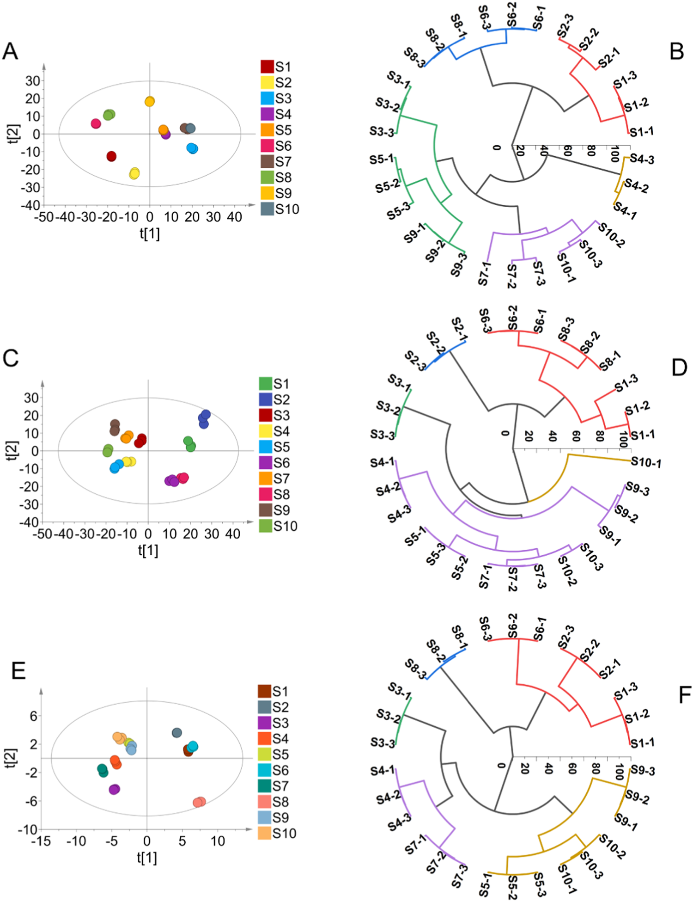

<!-- 方針: ほぼ全訳＋必要に応じた補足。原文の構成・節立てに沿って訳出（原文の章立てに合わせ、材料と方法→結果と考察の順）。「> 補足:」は訳者注。 -->

## 書誌情報

- 標題（原題）: Comprehensive multicomponent characterization and quality assessment of Xiaoyao Wan by UPLC-Q-Orbitrap-MS, HS-SPME-GC-MS and HS-GC-IMS
- 著者・所属: Jiaxin Yin, Tong Wu, Beibei Zhu, Pengdi Cui, Yang Zhang, Xue Chen, Hui Ding, Lifeng Han, Songtao Bie, Fangyi Li, Xinbo Song, Heshui Yu（責任著者）, Zheng Li（責任著者）（天津中医薬大学 中薬制薬工程学院／中薬組分の国家重点実験室／現代中医薬海河実験室、中国）
- 掲載誌・巻号・DOI: *Journal of Pharmaceutical and Biomedical Analysis* 239 (2024) 115910. https://doi.org/10.1016/j.jpba.2023.115910（受理: 2023年12月5日、オンライン公開: 2023年12月13日）
- インパクトファクター: **3.6**（*J. Pharm. Biomed. Anal.*, JCR 2024 / Clarivate）
- 受理経過 / ライセンス: Received 26 September 2023; Received in revised form 2 December 2023; Accepted 5 December 2023; Available online 13 December 2023。© 2023 Elsevier B.V. All rights reserved.

> 補足: 逍遥丸（Xiaoyao Wan, XYW）は、『太平恵民和剤局方』を出典とする古典方剤「逍遥散」の丸剤（製剤）形態で、柴胡（radix bupleuri）・芍薬（Paeonia lactiflora）・当帰（angelica sinensis）・白朮（atractylodes macrocephala）・甘草（liquorice）・薄荷（mentha haplocalyx）・茯苓（poria cocos）・生姜（ginger）の8味からなる。「疏肝解鬱・健脾養血」の効能を持ち、うつ病治療で広く用いられる代表的な処方の一つ。

## 要旨（Abstract）

逍遥丸（XYW）は、「肝を疏し鬱を解く（soothing the liver and relieving depression）」「脾を強め血を養う（strengthening spleen and nourishing blood）」の効能を持つ中医方剤の処方薬である。XYWはうつ病治療において広く注目され、臨床でよく用いられる古典的な処方の一つとなっている。しかし、XYWの薬効物質基盤や品質管理の研究はこれまで極めて限られていた。本研究では、高度な超高速液体クロマトグラフィー-四重極-Orbitrap質量分析（UPLC-Q-Orbitrap-MS）、ヘッドスペース固相マイクロ抽出-ガスクロマトグラフィー質量分析（HS-SPME-GC-MS）、およびヘッドスペース-ガスクロマトグラフィー-イオン移動度分析（HS-GC-IMS）技術を十分に活用し、XYWの薬理学的物質基盤を深く特徴づけ、品質を定量的に評価することを目的とした。まず、299化合物が同定または暫定的に特徴づけられ、これには198の不揮発性有機化合物（n-VOCs）と101の揮発性有機化合物（VOCs）が含まれた。次に、主成分分析（PCA）および階層クラスター分析（HCA）を用いて、異なる製造所のXYWにおける品質差を解析した。第三に、並行反応モニタリング（PRM）法を確立・バリデーションし、異なる製造所のXYWにおける14の主要有効物質を同時定量した。これらはXYWの品質評価のためのベンチマーク物質として選択された。結論として、本研究は本戦略が中医薬（TCM）の品質管理に有用な方法を提供し、TCMの品質一貫性を探索するための実用的なワークフローを提供することを示している。

---

## 1. 序論（Introduction）

近年、中医方剤製剤（TCMFPs）は、その長い歴史、正確な有効性、比較的少ない副作用のため、世界中でますます注目を集めている [1]。逍遥散は『太平恵民和剤局方』を出典とする古典的処方であり、柴胡（radix bupleuri, RB）、芍薬（Paeonia lactiflora, PL）、当帰（angelica sinensis, AS）、白朮（atractylodes macrocephala, AM）、甘草（liquorice, L）、薄荷（mentha haplocalyx, MH）、茯苓（poria cocos, PC）、生姜（ginger, G）の8味の中薬から構成される。肝脾を調え、肝鬱を解し、血を養い脾を強める機能を持つ。逍遥丸は逍遥散の一製剤形態である。近年、XYWはうつ病治療において広く注目を集めている [2,3]。さらに、臨床データおよび関連研究により、XYWがうつ病に対して正確な有効性を持ち、うつ病治療でよく用いられる古典的処方の一つとなっていることが示されている [4,5]。しかし既存の研究の多くは、XYWが抗うつ効果を発揮する機序の研究に焦点を当てている。これらの研究は、XYWの治療効果によって調節される経路・機序を解明している [6,7]。また別の大多数の研究者はメタボロミクス手法を用いて代謝マーカーを研究し、うつ病治療におけるXYWの臨床応用のためのバイオマーカーを発見している [8–10]。以上の研究はXYWが抗うつ効果を発揮する機序を説明・証明すると同時に、臨床うつ病の早期診断のためのバイオマーカーも発見している。品質の一貫性は常にTCMの関心事であり、TCMの効能の鍵はその品質を管理して薬効を確保することにある。残念ながら、報告されている研究の中には、XYWの物質基盤特徴づけおよび多成分品質管理法に関する研究はほとんどない。さらに、中国薬局方はXYWの品質を芍薬苷（paeoniflorin）を検出指標として評価することのみを規定している。これまでのところ、XYWの品質管理法は包括的ではなく、包括的な品質管理戦略を欠いている。したがって、TCMFPsにおける多成分の品質一貫性評価を実現するための、合理的かつ効果的な定性・定量戦略の確立が急務である。

技術の進歩と発展に伴い、クロマトグラフィーおよび質量分析技術は、TCM中の物質の特徴づけにおける主要な測定ツールとなっている。近年、液体クロマトグラフィーを分離システムとし質量分析を検出システムとする液体クロマトグラフィー-質量分析法（LC-MS）が発展してきた。LC-MSはクロマトグラフィーの複雑試料に対する高い分離能力と、MSの高選択性・高感度・分子量および構造情報を提供できる利点という、クロマトグラフィーと質量分析の相補的な利点を体現している [11]。TCMFPsにおいて広く用いられている [12–14]。GC-MSは複雑系におけるVOCsの検出において強力な分離・同定機能を持つ。しかし薬物マトリックスの複雑さのため、試料の抽出過程は複雑かつ時間がかかり、迅速な検出を制限する。GC-MSを基礎として、HS-SPME-GC-MSはヘッドスペース固相マイクロ抽出の抽出・濃縮技術を統合し、試料前処理法を簡素化して迅速かつ非破壊的な試料検出を実現する [16,17]。HS-GC-IMSは新しい気相分離・検出技術である。この技術はGCの高い分離能力とIMSの迅速な応答性を組み合わせている [18]。HS-GC-IMSはそのグリーンさ、高感度、試料前処理不要、迅速な測定という特長から、TCM・臨床・食品・環境分析で広く用いられている [19]。そこで本研究では、HS-SPME-GC-MSおよびHS-GC-IMSを用いてXYWのVOCsを包括的に特徴づけた。HS-GC-IMSは通常VOCsの小分子を検出し、これはHS-SPME-GC-MSが中分子のVOCsしか捕捉できないという欠点を補う。定性的には、UPLC-Q-Orbitrap-MS、HS-SPME-GC-MS、HS-GC-IMSを組み合わせ、n-VOCsおよびVOCsの両面からXYWの薬理学的物質基盤を包括的に特徴づける戦略を確立した。

定量的には、UPLC-Q-Orbitrap-MSと並行反応モニタリング（PRM）を組み合わせた手法を確立し、XYW中の14の主要有効物質を定量した。従来の選択反応モニタリング（SRM）法と比較して、PRMはより広い質量範囲において複数成分の同時検出の特異性を向上させることができ、検出干渉の影響を最小限に抑えられる [20]。さらに、PRMはすべての変換を同時に検出でき、データ処理作業を軽減し、データ解析効率を向上させることができる。PRMにおける複数成分の同時定量精度を向上させるため、エネルギーレベルを調整した。調整後のPRMは、乏しいパラメータを用いることで含量の多い成分の応答を抑制し、最適なパラメータを用いることで微量物質の応答を促進することができる [21]。この戦略により、XYW中の14の薬理学的活性成分を同時に定量した。

本研究では、UPLC-Q-Orbitrap-MS、HS-SPME-GC-MS、HS-GC-IMSを用いた包括的な戦略を確立した。合計299化合物が同定または暫定的に特徴づけられた。同時に、47化合物がさらに標準品によって確認された。PCAおよびHCAデータは、異なる製造所間でXYWの品質が異なることを示している。さらに、UPLC-Q-Orbitrap-MSとPRMを組み合わせて、XYWにおける多成分品質評価のための豊富量および微量成分の同時モニタリングを行った。本研究のデータは、XYWの多成分品質管理のための基盤と参照を提供する。同時に、本戦略はTCM品質の一貫性を探索するための実用的なワークフローを提供する。実験プログラムの模式図をFig. 1に示す。

---

## 2. 材料と方法（Materials and Methods）

### 2.1. 材料と試薬

11種のフラボノイド（1 カテキン, 2 リクイリチン, 3 L-エピカテキン, 4 ヘスペリジン, 5 イソリクイリチンアピオシド, 6 リクイリチゲニン, 7 クエルセチン, 8 カリコシン, 9 イソリクイリチゲニン, 10 リコフラノクマリン, 11 リクイリチンアピオシド）、7種の有機酸（12 クエン酸, 13 プロトカテク酸, 14 プロトカテクアルデヒド, 15 クロロゲン酸, 16 カフェイン酸, 17 フェルラ酸, 18 3,5-O-ジカフェオイルキナ酸）、3種のサポニン（19 サイコサポニンA, 20 サイコサポニンC, 21 サイコサポニンD）、3種のラクトン（22 アトラクチレノリドI, 23 アトラクチレノリドII, 24 アトラクチレノリドIII）、4種のブチルフタリド（25 センキュノリドI, 26 センキュノリドC, 27 E-リグスチリド, 28 Z-リグスチリド）、2種のテルペノイド（29 ヒドロキシパエオニフロリン, 30 グリチルリチン酸）、11種の配糖体（31 グアノシン, 32 1,3-O-ジカフェオイルキナ酸, 33 アルビフロリン, 34 パエオニフロリン, 35 ムータンピオシドE, 36 オノニン, 37 ベンゾイルパエオニフロリン, 38 ベンゾイルアルビフロリン, 39 ムータンピオシドD, 40 ムータンピオシドH, 41 アトラクチロシドA）、その他（42 シリンギン, 43 クエルシトリン, 44 リコアグロカルコンB, 45 センキュノリドH, 46 センキュノリドA, 47 レビストリドA）の合計47の標準品は、上海源葉生物科技有限公司（中国上海）より提供された。ギ酸（ACS, Wilmington, DE, USA）、メタノールおよびHPLCグレードのアセトニトリル（Fisher, Fair lawn, NJ, USA）を使用した。超純水はWatsons Trademark Co., Ltd（中国香港）より購入した。XYWは10の異なる製造所から購入し、S1, S2, S3, S4, S5, S6, S7, S8, S9, S10として表記した。HS-SPME-GC-MSのノルマルアルカンC8-C20はSigma Aldrich Chemical Co., Ltd.（Missouri, USA）より、HS-GC-IMSの保持指数（RI）算出用標準混合物N-ケトンC4-C9は国薬集団化学試薬有限公司（中国上海）より購入した。

### 2.2. 試料調製

異なる製造所のXYW試料を粉砕し、100メッシュ篩でろ過した。等量添加法を用いて品質管理（QC）試料を調製した。0.5 g精密に量ったXYW試料を5 mLの水で希釈した。超音波補助で水浴中20分間処理した後、75%メタノールを加えて10 mLに定容し、2分間ボルテックスした。試料を16,000 rpmで10分間遠心分離した後、上清をXYWの多成分特徴づけ用の試験溶液とした。HS-SPME-GC-MSおよびHS-GC-IMS用試料は前処理を必要としない。1.0 g精密に量ったXYW試料を20 mLのヘッドスペース注入バイアルに加え試料検出を行った。

### 2.3. 標準溶液

14の定量対象物質のストック溶液を75%メタノールで1 mg/mLの濃度に調製した。次に、ストック溶液を75%メタノールで希釈して検量線検出用の一連の濃度を調製した。すべての溶液は4℃で保管し、以後の解析に用いた。

#### 2.3.1. 定性分析のためのUPLC-Q-Orbitrap-MS条件

UPLC-Q-Orbitrap-MSシステムは、Q Exactive™ハイブリッド四重極-Orbitrap質量分析計（Thermo Fisher Scientific, San Jose, CA, USA）とWaters I Class ACQUITY™ UPLCシステム（Waters Corporation, Milford, MA, USA）を装備した [22]。クロマトグラフィーカラムはACQUITY UPLC® BEH C18（2.1 × 100 mm, 1.7 µm, Waters, USA）を35℃で使用した。0.1%ギ酸水溶液（A）とアセトニトリル（B）を溶離液として用い、溶出手順は以下の通りとした: 0–3分, 95%A–95%A; 3–12分, 95%A–77%A; 12–17分, 77%A–71%A; 17–25分, 71%A–55%A; 25–30分, 55%A–5%A。

流速0.3 mL/min、注入量1 µLで効率的かつ対称的なピークが得られた。Q-Orbitrap質量分析計は、HESI源の正・負両イオンモードで同時に動作した。HESI源パラメータは以下の通り設定した: スプレー電圧, 3.0 kV; キャピラリー温度, 350 ℃; 補助ガスヒーター温度, 400 ℃; 補助ガス流量, 8 arb; シースガス流量, 35 arb; 規格化衝突エネルギー（NCE）10/20/30 V。フルMS/ddMS2（TopN）スキャン法を用いてXYWの組成を特徴づけ、フルスキャン範囲はm/z 100–1000とした。データ処理はCompound Discoverer™ 3.3（Thermo Fisher Scientific）およびXcalibur 4.1（Thermo Fisher Scientific）で実施した。

#### 2.3.2. 定性分析のためのHS-SPME-GC-MS条件

HS-SPME-GC-MSは、Agilent 7890B-7000Dガスクロマトグラフ質量分析検出器（Agilent, Thermo fisher, CA, USA）とSPMEファイバー（supelco, Bellefonte, Penn.）を組み合わせたヘッドスペース自動注入システムであった [22]。クロマトグラフィーカラムはHP-5MSフェニルメチルシロキサン（30 m × 0.25 mm × 0.25 µm, Agilent Technologies, Palo Alto, CA, USA）弾性石英キャピラリーカラムであった [23]。試料を70℃で10分間インキュベートした後、500 µLのヘッドスペース試料をDVB/CAR/PDMS SPMEニードル（2 cm, 50/30 µm; supelco）により210℃で自動注入した。昇温プログラムは以下の通り: 初期温度50℃で2分間保持、10℃/minで85℃まで、5℃/minで120℃まで、次いで2℃/minで140℃まで、最後に5℃/minで210℃まで昇温し2分間保持。キャリアガスはヘリウム（純度99.999%）を流量1.0 mL/minで使用した。質量分析計はEI源を用い正イオンモードで動作した。イオン源温度およびイオン化エネルギーはそれぞれ230℃、70 eVに設定した。スキャン範囲はm/z 30–600とした。データ処理はMasshunterソフトウェア（Agilent Technologies）で実施した。

#### 2.3.3. 定性分析のためのHS-GC-IMS条件

試料は、1 mL加熱気密シリンジを備えたオートサンプラー（CTC Analytics AG, Switzerland）付きのHS-GC-IMS装置（Flavourspec®, G.A.S, Dortmund, Germany）で解析した。クロマトグラフィーカラムはFS-SE-54-CB-1（CS-Chromatographie Service GmbH, Germany）キャピラリーカラム（15 m × 0.53 mm ID, 0.5 µm）であった [23]。試料を250 rpmで70℃で10分間インキュベートした後、500 µLのヘッドスペース試料を加熱シリンジにより70℃で注入器（75℃、スプリットレスモード）に自動注入した。窒素（99.999%）をキャリアガスとして使用し、その流量は最初2 mL/minで2分間、次いで10 mL/minまで10分かけて増加させ、さらに150 mL/minまで20分かけて増加させて10分間保持した。ドリフトチューブ（長さ9.8 cm）は一定温度45℃、電圧5 kVで動作した。ドリフトガス（N2）の流量は150 mL/minに設定した。

#### 2.3.4. 定量分析のためのUPLC-Q-Orbitrap-MS条件

XYWの定量実験において、PRMモードの下で、14の対象化合物の規格化エネルギーを10 V, 20 V, 30 V, 40 V, 50 V, 60 V, 70 V, 80 Vのエネルギー最適化勾配で調整・最適化した。最終的に調整された最適化勾配をTable 1に示す。

さらに、確立した定量法について、検出下限（LOD）および定量下限（LOQ）、日内・日間精度、繰返し性、安定性、直線性および範囲、ならびに試料回収率を含む複数の項目についてレビューを行った。検出下限（LOD）および定量下限（LOQ）はシグナル対ノイズ（S/N）比3および10で測定した [17]。日内精度は同一溶液の6回の並行分析により決定した。日間精度は3日間にわたり溶液を3回ずつ解析して評価した。繰返し性は6個の並行調製試料の解析により評価した。安定性試験では、同一試料溶液を試料室の温度（20℃）で0, 1, 2, 4, 6, 8, 10, 12, 24時間の時点で解析した。平均回収率は、既知含量のXYW試料に低・中・高濃度の混合標準溶液を添加して測定した [20]。

##### Table 1. PRMモードにおけるXYW中の14化合物の関連情報

| 分析対象 (Analytes) | Rt (min) | イオン化モード | 前駆イオン (m/z) | プロダクトイオン (m/z) | 衝突エネルギー (V) |
|---|---|---|---|---|---|
| サイコサポニンA (Saikosaponin A) | 23.89 | ESI− | 825.4645 | 779.4537 | 10 |
| サイコサポニンD (Saikosaponin D) | 26.93 | ESI− | 825.4644 | 779.4537 | 10 |
| パエオニフロリン (Paeoniflorin) | 8.89 | ESI− | 525.1614 | 479.1566 | 10 |
| アルビフロリン (Alibiflorin) | 8.36 | ESI− | 525.1614 | 479.1566 | 10 |
| リクイリチンアピオシド (Liquiritin apioside) | 10.34 | ESI− | 549.1616 | 255.0662 | 30 |
| イソリクイリチンアピオシド (Isoliquiritin apioside) | 13.01 | ESI− | 549.1615 | 255.0659 | 30 |
| クエルセチン (Quercetin) | 14.60 | ESI− | 301.0351 | 151.0022 | 60 |
| リクイリチゲニン (Liquiritigenin) | 13.90 | ESI− | 255.0659 | 135.0074 | 40 |
| リグスチリド (Ligustilide) | 26.72 | ESI+ | 191.1065 | 173.0962 | 60 |
| リクイリチン (Liquiritin) | 10.26 | ESI+ | 419.1338 | 257.0805 | 20 |
| グリチルリチン酸 (Glycyrrhizic acid) | 22.41 | ESI+ | 823.4104 | 453.3362 | 10 |
| アトラクチレノリドI (Atractylenolide I) | 28.59 | ESI+ | 231.1377 | 203.5741 | 60 |
| アトラクチレノリドII (Atractylenolide II) | 27.54 | ESI+ | 233.1533 | 215.1432 | 50 |
| アトラクチレノリドIII (Atractylenolide III) | 24.56 | ESI+ | 249.1483 | 231.1375 | 30 |

---

## 3. 結果と考察（Results and Discussion）

### 3.1. UPLC-Q-Orbitrap-MS定性分析

分解能や化合物存在量に影響しうるUPLCシステムの主要パラメータを最適化した。ACQUITY UPLC® BEH C18カラムは、化合物存在量が高く分離能が良好であったため固定相として選択された。クロマトグラフィーピークの形状・数は異なる移動相（水-メタノール／水-アセトニトリル／0.1% v/v ギ酸水-メタノール／0.1% v/v ギ酸水-アセトニトリル）によっても影響を受ける。0.1% v/v ギ酸水-アセトニトリルを移動相として用いた場合、ピーク形状が良好であることが判明した（Fig. S1、詳細は原文の補足資料参照）。さらに、クロマトグラフィーカラムのカラム温度も化合物分離において重要な役割を果たす。そのため、25℃、30℃、35℃、40℃の温度勾配を設定して最適化した。複雑な試料系の分離は35℃において良好であることが判明した（Fig. S2、詳細は原文の補足資料参照）。

さらに、イオン応答および断片化に影響しうるQ-Orbitrap-MS/MS装置の主要パラメータも最適化した。ESI源パラメータおよび規格化衝突エネルギーは、XYWの化合物を特徴づけるためのより有意義な構造情報を提供するよう最適化された。XYWの主要な薬理学的活性成分は主にサポニン、フラボノイド、有機酸の3つの異なる構造タイプを含んでいた。そのため、これら3カテゴリから代表的な6化合物（サイコサポニンA、サイコサポニンD、リクイリチゲニン、リクイリチン、クロロゲン酸、ポリコイン酸A）を選択し、質量分析パラメータ最適化のための参照データを提供した。補助ガスヒーター温度およびキャピラリー温度は、イオン輸送効率に影響する主要な2パラメータである。スプレー電圧はイオン源にとってイオン応答に影響する重要なパラメータである。したがって、補助ガスヒーター温度（250℃、300℃、350℃、400℃）、キャピラリー温度（250℃、300℃、350℃、400℃）、スプレー電圧（2.5 kV、3.0 kV、3.5 kV、4.0 kV）について単一因子実験によりイオン源パラメータを最適化した。結果として、イオン応答の変化に基づき、補助ガスヒーター温度400℃、キャピラリー温度350℃、スプレー電圧3.5 kVに設定した場合が最適条件であると決定された（Fig. S3、詳細は原文の補足資料参照）。

> 補足: 材料と方法（2.3.1節）に記載のHESI源パラメータでは「スプレー電圧3.0 kV」とされていますが、本節（3.1節）の最適化実験結果では「3.5 kV」が最適と述べられています。原文にこの通りの記載があり、訳文でもそのまま両方の記述を残しています。

確立したUPLC-Q-Orbitrap-MS法に基づき、負・正両方のESIモードで動作する高精細MSEを取得することでXYWの多成分をプロファイリングした。Compound Discoverer™ 3.3（Thermo Fisher Scientific）は、オンラインデータベース（mzCloud）とローカルデータベース（mzVault）を通じて化合物の予備予測を行う定性解析ソフトウェアとしてQ-Orbitrapとマッチングした。Compound Discoverer™によりスクリーニングされた化合物は、Xcalibur 4.1ソフトウェア（Thermo Fisher Scientific）を用いたイオンピーク保持時間対比、質荷比、および二次特徴イオンフラグメンテーションの手段によりさらに解析可能であった。さらに、既発表文献および47の標準物質との比較に基づき、XYWにおいて198化合物が特徴づけまたは予備的に特徴づけられ、これには52のフラボノイド、48のサポニンおよび配糖体、26の有機酸、14のフェノール酸、11のテルペノイド、9のフタリド、8のラクトン、5のアントラキノン、4のフェニルプロパノイド、2のアミノ酸、19のその他化合物が含まれていた。化合物情報のリストはTable S1（詳細は原文の補足資料参照）に示す。正・負両イオンモードにおけるXYWのUPLC-Q-Orbitrap-MSの全イオンクロマトグラム（TIC）をFig. 2に示す。

### 3.2. HS-SPME-GC-MS定性分析

XYWのVOCsはHS-SPME-GC-MS技術により解析された。最適化されたHS-SPME-GC-MS条件をVOCsの分離に用いた（Fig. 3）。実験を正式に開始する前に3つの主要パラメータを最適化した。VOCsの吸着容量に影響しうる異なる抽出ファイバーヘッド吸着膜。抽出温度および抽出時間の変化は試料の分離度に影響しうる。まず、3種類の抽出ファイバーヘッド吸着膜を最適化した: PDMS、PDMS/DVB、DVB/CAR/PDMS（Fig. S4、詳細は原文の補足資料参照）。DVB/CAR/PDMSプローブを使用した場合、クロマトグラフィーピークが最も豊富であった。次に、抽出温度（50℃、60℃、70℃、80℃）および抽出時間（5分、10分、15分、20分）を最適化した（Fig. S5、詳細は原文の補足資料参照）。結果として、捕捉された化合物の量と含量を比較することにより、HS-SPME-GC-MS検出の最適条件はインキュベート温度70℃・インキュベート時間10分であることが判明した。

未知化合物の定性解析には、化学ワークステーションのNIST.17標準質量分析ライブラリ（Agilent, California, USA）でスペクトルピーク検索を行い、各化合物の保持指数（RI）はN-アルカンC8-C20を外部参照として算出した。保持指数、マッチング値、および文献参照に基づき、正・負両ESIモードで52化合物が同定され、Table 2に示す。このうち主要成分はテルペノイドで19種を含む。フェノール系成分9種、複素環系成分6種、ケトン系成分6種、エステル系成分5種、アルコール系成分2種、その他成分5種が含まれる。

##### Table 2. HS-SPME-GC-MSによるXYW中VOCsの同定

| No. | RT (min) | 化合物 (Compounds) | CAS | RI1 | RI2 |
|---|---|---|---|---|---|
| 1 | 4.24 | フルフラール (Furfural) | 98–01–1 | 841 | 833 |
| 2 | 5.45 | 2-アセチルフラン (2-Acetylfuran) | 1192–62–7 | 919 | 911 |
| 3 | 6.31 | 5-メチルフルフラール (5-Methyl furfural) | 620–02–0 | 971 | 965 |
| 4 | 6.89 | Octamethylcyclotetrasiloxane | 556–67–2 | 1002 | 994 |
| 5 | 8.32 | 2-アセチルピロール (2-Acetyl pyrrole) | 1072–83–9 | 1075 | 1064 |
| 6 | 9.40 | 3-Hydroxy-2-methyl-4H-pyran-4-one | 118–71–8 | 1124 | 1110 |
| 7 | 9.89 | 1,3-Benzodioxole, 3a,7a-dihydro-2,2,4-trimethyl- | 35,502–40–8 | 1147 | 1148 |
| 8 | 10.17 | 2,3-Dihydro-3,5-dihydroxy-6-methyl-4(H)-pyran-4-one | 28,564–83–2 | 1159 | 1151 |
| 9 | 10.22 | イソメントン (Isomenthone) | 491–07–6 | 1161 | 1164 |
| 10 | 10.50 | シトロネラール (Citronellal) | 106–23–0 | 1173 | 1153 |
| 11 | 10.72 | ジヒドロテルピネオール (Dihydroterpineol) | 21,129–27–1 | 1182 | 1178 |
| 12 | 11.23 | サリチル酸メチル (Methyl salicylate) | 119–36–8 | 1203 | 1192 |
| 13 | 12.11 | 5-ヒドロキシメチルフルフラール (5-Hydroxymethylfurfural) | 67–47–0 | 1241 | 1233 |
| 14 | 12.26 | (+)-プレゴン ((+)-Pulegone) | 89–82–7 | 1247 | 1237 |
| 15 | 12.64 | ピペリトン (Piperitone) | 89–81–6 | 1262 | 1253 |
| 16 | 13.80 | 2-Hydroxy-6-(isopropyl)-3-methylcyclohex-2-en-1-one | 490–03–9 | 1306 | 1302 |
| 17 | 14.21 | 4-Hydroxy-3-methoxystyrene | 7786–61–0 | 1321 | 1317 |
| 18 | 14.63 | 1,5,5-Trimethyl-6-methylenecyclohexene | 514–95–4 | 1336 | 1338 |
| 19 | 15.00 | 3-Methyl-6-(1-methylethylidene)cyclohex-2-en-1-one | 491–09–8 | 1348 | 1340 |
| 20 | 15.39 | バレロフェノン (Valerophenone) | 1009–14–9 | 1361 | 1374 |
| 21 | 16.15 | Modhephene | 68,269–87–4 | 1386 | 1385 |
| 22 | 16.38 | Berkheyaradulene | 65,372–78–3 | 1393 | 1386 |
| 23 | 16.79 | (-)-α-グルジュネン ((-)-Alpha-gurjunene) | 489–40–7 | 1405 | 1409 |
| 24 | 17.02 | Cyclopenta[c]pentalene, decahydro-1,3a,5a-trimethyl-4-meth | 71,596–72–0 | 1412 | 1412 |
| 25 | 17.27 | (+)-β-Funebrene | 79,120–98–2 | 1419 | 1414 |
| 26 | 17.46 | β-カリオフィレン (β-Caryophyllene) | 87–44–5 | 1425 | 1419 |
| 27 | 17.98 | (+)-アロマデンドレン ((+)-Aromadendrene) | 489–39–4 | 1440 | 1440 |
| 28 | 18.29 | パエオノール (Paeonol) | 552–41–0 | 1448 | 1438 |
| 29 | 18.65 | α-カリオフィレン (α-Caryophyllene) | 6753–98–6 | 1458 | 1454 |
| 30 | 18.77 | アモルファジエン (Amorphadiene) | 92,692–39–2 | 1462 | 1458 |
| 31 | 19.44 | グアイエン (Guaiene) | 88–84–6 | 1479 | 1490 |
| 32 | 19.73 | イリソン (Irisone) | 14,901–07–6 | 1487 | 1491 |
| 33 | 19.91 | α-セリネン (α-Selinene) | 473–13–2 | 1491 | 1494 |
| 34 | 20.21 | エレモフィレン (Eremophilene) | 10,219–75–7 | 1499 | 1499 |
| 35 | 20.63 | (+)-クパレン ((+)-Cuparene) | 16,982–00–6 | 1510 | 1505 |
| 36 | 20.73 | エレモフィレン (Eremophilene) | 10,219–75–7 | 1513 | 1499 |
| 37 | 20.93 | ジブチルヒドロキシトルエン (Butylated hydroxytoluene, BHT) | 128–37–0 | 1518 | 1513 |
| 38 | 21.88 | Naphthalene, decahydro-4a-methyl-1-methylene-7-(1-methylethylidene)-, (4aR,8aS)-rel- | 58,893–88–2 | 1543 | 1544 |
| 39 | 22.08 | Naphthalene, decahydro-4a-methyl-1-methylene-7-(1-methylethylidene)-, (4aR,8aS)-rel- | 58,893–88–2 | 1548 | 1544 |
| 40 | 22.24 | 1-Naphthalenol, 1,2,3,4,4a,5,6,7-octahydro-4a,5-dimethyl-3-(1-methylethenyl)- | 61,847–19–6 | 1552 | 1553 |
| 41 | 22.67 | Germacrene B, 1,5-dimethyl-8-(1-methylethylidene)-1,5-cyclodecadiene | 15,423–57–1 | 1563 | 1557 |
| 42 | 23.51 | 1H-Cycloprop[e]azulen-7-ol, decahydro-1,1,7-trimethyl-4-methylene-, (1aS,4aS,7R,7aS,7bS)- | 77,171–55–2 | 1583 | 1577 |
| 43 | 23.87 | 1H-Cycloprop[e]azulen-7-ol, decahydro-1,1,7-trimethyl-4-methylene-, (1aS,4aS,7R,7aS,7bS)- | 77,171–55–2 | 1592 | 1577 |
| 44 | 25.89 | 2-Amino-4-tert-amylphenol | 91,339–74–1 | 1653 | 1672 |
| 45 | 26.26 | アトラクチリン (Atractyline) | 6989–21–5 | 1664 | 1662 |
| 46 | 26.53 | 5-Azulenemethanol | 22,451–73–6 | 1672 | 1667 |
| 47 | 26.86 | N-Butylidenephthalide | 551–08–6 | 1682 | 1675 |
| 48 | 28.46 | α-シペロン (α-Cyperone) | 473–08–5 | 1739 | 1755 |
| 49 | 28.62 | Z-リグスチリド (Z-Ligustilide) | 81,944–09–4 | 1744 | 1740 |
| 50 | 30.19 | 1(3H)-Isobenzofuranone, 3-Butylidene-4,5-dihydro-, (3E)- | 81,944–08–3 | 1802 | 1810 |
| 51 | 34.53 | パルミチン酸エチル (Palmitic acid ethyl ester) | 628–97–7 | 1998 | 1993 |
| 52 | 37.85 | (9E,11E)-9,11-オクタデカジエン酸メチル ((9E,11E)–9,11-Octadecadienoic acid methyl ester) | 13,038–47–6 | 2181 | 2187 |

RI1: 化学ワークステーションのNIST.17標準質量分析ライブラリ（Agilent, California, USA）を用いて算出した標準保持指数。RI2: N-アルカンC8-C20を外部参照として算出した実測保持指数。

### 3.3. HS-GC-IMS定性分析

異なる製造所のHS-GC-IMS解析における試料情報は、Fig. 4に地形図（トポグラフィックマップ）およびフィンガープリントの形式で表示した。Fig. 4Aは、HS-GC-IMSによるXYW検出の地形図を示しており、4つの異なる製造所の薬物画像を表示している。縦軸はガスクロマトグラフィーの保持時間を表し、横軸はイオン移動時間を表す。画像全体の背景は青色であり、横座標1.0における赤色の縦線は反応イオンピーク（RIP、正規化済み）を表す。RIPピークの両側の各点は1つのVOCを表す。色はある物質のピーク強度を表し、白は低いピーク強度、赤は高いピーク強度を表し、色が濃いほどピーク強度が高い。

GC-IMSデータの抽出および解析はLaboratory Analytical Viewer（LAV）（version 2.2.1, G.A.S, Dortmund, Germany）により実施した。VOCsはGC-IMS Library Search applicationソフトウェアのIMSデータベースに基づき同定した。各化合物の保持指数（RI）はN-ケトンC4-C9を外部参照として算出した。その結果、49のVOCsが予備的に同定または同定され、詳細データをTable 3に示す。Fig. 4Bの各行は1試料中の選択されたすべてのシグナルピークを表す。各列は異なる試料における同一VOCのシグナルピークを表す。図から、各試料のVOC情報の全体像と試料間のVOCの差異を視覚的に確認できる。全体的な傾向としては、試料S1, S2, S6, S8は同様の変化傾向を示し、物質の含量は左から右に向かって増加する傾向を示した。反対に、試料S3, S4, S5, S7, S9, S10に含まれる物質は徐々に減少する傾向を示した。ラベル付けされた領域A, B, Cから、物質（オクタン酸、4-メチルアセトフェノン、2,6-ジクロロフェノール、4-エチル-2-メトキシフェノールなど）は試料S1, S2, S6, S8において独自かつ相対的に高い含量を示していた。一方、領域D, E, F, G, Hに含まれる物質（プロピレングリコール、2-ヘキセン-1-オール、1-ヘキサノール、ペンタン酸など）は試料S3, S4, S5, S7, S9, S10に固有であった。

##### Table 3. XYW中VOCsのHS-GC-IMS積分パラメータ

| No. | Rt [min] | 分子式 | 化合物 (Compounds) | CAS# | RI |
|---|---|---|---|---|---|
| 1 | 2.59 | C4H8O | Butanal monomer | C123728 | 610 |
| 2 | 3.91 | C5H10O2 | エチル プロパノエート monomer (Ethyl propanoate) | C105373 | 712 |
| 3 | 3.96 | C4H8O2 | 2-butanone 3-hydroxy monomer | C513860 | 714 |
| 4 | 3.97 | C5H8O2 | メタクリル酸メチル monomer (Methyl methacrylate) | C80626 | 714 |
| 5 | 4.67 | C5H12O | 3-メチルブタノール monomer (3-methylbutanol) | C123513 | 741 |
| 6 | 4.72 | C5H8O | (E)-2-Pentenal monomer | C1576870 | 743 |
| 7 | 5.72 | C4H8O2 | 2-メチルプロパン酸 monomer (2-Methylpropanoic acid) | C79312 | 775 |
| 8 | 5.74 | C3H8O2 | プロピレングリコール monomer (Propylene glycol) | C57556 | 776 |
| 9 | 6.34 | C6H12O | ヘキサナール monomer (Hexanal) | C66251 | 799 |
| 10 | 6.82 | C4H10FO2P | サリン monomer (Sarin) | C107448 | 820 |
| 11 | 6.85 | C5H10O3 | Ethyl 2-hydroxypropanoate monomer | C97643 | 821 |
| 12 | 7.08 | C5H4O2 | フルフラール monomer (Furfural) | C98011 | 831 |
| 13 | 7.10 | C6H14O | 2-メチル-1-ペンタノール monomer (2-Methyl-1-pentanol) | C105306 | 832 |
| 14 | 7.41 | C6H10O | 2-メチルシクロペンタノン monomer (2-Methylcyclopentanone) | C1120725 | 845 |
| 15 | 7.63 | C6H5Cl | クロロベンゼン monomer (Chlorobenzene) | C108907 | 853 |
| 16 | 7.86 | C6H12O | 2-ヘキセン-1-オール monomer (2-Hexen-1-ol) | C2305217 | 862 |
| 17 | 7.88 | C6H14O | 1-ヘキサノール monomer (1-Hexanol) | C111273 | 863 |
| 18 | 8.18 | C6H14O | 1-ヘキサノール dimer (1-Hexanol) | C111273 | 874 |
| 19 | 8.19 | C5H10O2 | 3-メチルブタン酸 monomer (3-Methylbutanoic acid) | C503742 | 874 |
| 20 | 8.43 | C5H10O2 | ペンタン酸 monomer (Pentanoic acid) | C109524 | 883 |
| 21 | 8.59 | C7H14O | 2-ヘプタノン monomer (2-Heptanone) | C110430 | 888 |
| 22 | 8.83 | C7H14O | ヘプタナール dimer (Heptanal) | C111717 | 898 |
| 23 | 8.87 | C7H14O | ヘプタナール monomer (Heptanal) | C111717 | 900 |
| 24 | 8.87 | C8H8 | スチレン monomer (Styrene) | C100425 | 900 |
| 25 | 9.14 | C6H8O | 2,4-Hexadienal, (E, E)- monomer | C142836 | 913 |
| 26 | 9.23 | C7H14O2 | ヘキサン酸メチル monomer (Hexanoic acid methyl ester) | C106707 | 917 |
| 27 | 9.45 | C4H6O2 | Dihydro-2(3H)-furanone monomer | C96480 | 927 |
| 28 | 9.46 | C7H14O2 | ヘキサン酸メチル monomer (Hexanoic acid methyl ester) | C106707 | 927 |
| 29 | 10.38 | C7H16O | ヘプタノール monomer (Heptanol) | C53535334 | 967 |
| 30 | 10.52 | C6H6O3 | フロ酸メチル monomer (Methyl 2-furoate) | C611132 | 973 |
| 31 | 10.98 | C10H16 | ミルセン monomer (Myrcene) | C123353 | 991 |
| 32 | 11.09 | C9H14O | 2-ペンチルフラン monomer (2-pentyl furan) | C3777693 | 995 |
| 33 | 11.27 | C8H16O | オクタナール monomer (Octanal) | C124130 | 1004 |
| 34 | 11.30 | C7H8O | ベンジルアルコール monomer (Benzyl alcohol) | C100516 | 1005 |
| 35 | 11.30 | C8H14O2 | (Z)-3-ヘキセニル アセテート monomer ((Z)-3-hexenyl acetate) | C3681718 | 1005 |
| 36 | 11.81 | C10H16 | リモネン monomer (Limonene) | C138863 | 1029 |
| 37 | 11.90 | C10H18O | 1,8-シネオール monomer (1,8 Cineole) | C470826 | 1033 |
| 38 | 12.11 | C10H16 | β-オシメン monomer (β-Ocimene) | C13877913 | 1042 |
| 39 | 12.80 | C8H18O | 1-オクタノール monomer (1-Octanol) | C111875 | 1072 |
| 40 | 13.28 | C6H8O3 | 2,5-dimethyl-4-hydroxy 3(2H)-furanone (Furaneol) monomer | C3658773 | 1091 |
| 41 | 13.63 | C9H18O2 | プロパン酸ヘキシル monomer (Hexyl propanoate) | C2445763 | 1105 |
| 42 | 13.68 | C9H18O | n-ノナナール monomer (n-nonanal) | C124196 | 1107 |
| 43 | 14.44 | C8H16O3 | Ethyl 3-hydroxyhexanoate monomer | C2305251 | 1136 |
| 44 | 14.99 | C10H18O | シトロネラール dimer (Citronelal) | C106230 | 1156 |
| 45 | 15.00 | C10H18O | シトロネラール monomer (Citronelal) | C106230 | 1156 |
| 46 | 15.73 | C8H16O2 | オクタン酸 monomer (Octanoic acid) | C124072 | 1182 |
| 47 | 15.79 | C9H10O | 4-メチルアセトフェノン monomer (4-Methyl acetophenone) | C122009 | 1183 |
| 48 | 16.37 | C6H4Cl2O | 2,6-ジクロロフェノール monomer (2,6-Dichlorophenol) | C87650 | 1203 |
| 49 | 18.88 | C9H12O2 | 4-エチル-2-メトキシフェノール monomer (4-Ethyl-2-methoxyphenol) | C2785899 | 1279 |

### 3.4. 総合解析（Comprehensive analysis）

UPLC-Q-Orbitrap-MS解析、HS-SPME-GC-MS解析、HS-GC-IMS解析を通じて299化合物が同定された。このうち198化合物はUPLC-Q-Orbitrap-MSにより特徴づけられ、52化合物はHS-SPME-GC-MSにより同定され、49化合物はHS-GC-IMSにより同定された。198のn-VOCsの予備的な特徴づけ・同定では、フラボノイド、サポニン、ラクトン、有機酸が主要成分であった。101のVOCsが特徴づけられ、主にテルペノイド、フェノール類、エステル類が含まれていた。PCAは教師なしモードの多変量統計解析法であり、大量データの次元削減により試料間の規則性と差異を解析するものである。UPLC-Q-Orbitrap-MS、HS-SPME-GC-MS、HS-GC-IMSの検出データに対してPCA解析を行った（Fig. 5）。PCAはSIMCA 14.1ソフトウェアを用いて実施した。

10の異なる製造所のXYW試料は、化学組成において2つの主要な傾向に分類された。試料S1, S2, S6, S8はX軸の負の半軸上に類似性をもって位置し、一方で試料S3, S4, S5, S7, S9, S10はX軸の正の半軸上に類似の性質をもって位置していた（Fig. 5A）。同時に、試料S1, S2, S6, S8はn-VOCsにおいて試料S3, S4, S5, S7, S9, S10と有意な差を示した。Fig. 5C, Eに示すように、S1, S2, S6, S8とS3, S4, S5, S7, S9, S10はVOCsにおいても有意な差を示した。HCAは、異なるカテゴリのデータ点間の類似度を計算することにより階層的な入れ子クラスタリングを作成し、試料間の類似関係の表現を実現する。HCAデータは、S1, S2, S6, S8の成分が類似しており、一方でS3, S4, S5, S7, S9, S10の成分が非常に類似していることを示している（Fig. 5B, D, F）。試料S1, S2, S6, S8と試料S3, S4, S5, S7, S9, S10の間には有意な差が存在する。結果として、PCA、HCA、フィンガープリントのデータは、試料S1, S2, S6, S8に含まれる成分が類似しており、試料S3, S4, S5, S7, S9, S10に含まれる成分が類似していることを示している。10の異なる製造所のXYW試料は、化学組成において2つの主要な傾向に分類された。

### 3.5. UPLC-Q-Orbitrap-MS定量分析

XYWは2000年以上にわたり肝損傷の治療および抗うつ薬として広く使用されてきた [24]。まず、中国薬局方はXYWの品質管理指標としてパエオニフロリン（芍薬苷）を用いることを規定している。柴胡（Radix bupleuri）はXYWにおいて肝疾患治療のための主薬である。サイコサポニンAとサイコサポニンDはいずれもうつ様行動を改善することが示されている [25,26]。しかし、両者が治療効果を発揮する調節機序は異なる。クエルセチンも関連する炎症因子を調節することにより肝損傷を保護しうる [27]。さらに、芍薬（Paeonia lactiflora）中のパエオニフロリンおよびアルビフロリンはうつ様行動を改善する効果が証明されている [28–30]。特にパエオニフロリンは産後うつ病を効果的に改善しうる。生物活性研究により、甘草中のフラボノイドはうつ病に対して顕著な効果を示し、リクイリチゲニンは潜在的な抗うつ薬になることが期待されている [31]。当帰（angelica sinensis）中のリグスチリドは慢性うつ病を改善しうる [32]。アトラクチレノリドI、アトラクチレノリドII、アトラクチレノリドIIIは白朮（atractylodes macrocephala）の主要活性成分であり、これは白朮が抗うつ薬として一般的に使用される理由でもある [33,34]。以上の予備研究および文献レビューに基づき、14化合物（サイコサポニンA、サイコサポニンD、パエオニフロリン、アルビフロリン、リクイリチンアピオシド、イソリクイリチンアピオシド、クエルセチン、リクイリチゲニン、リグスチリド、リクイリチン、グリチルリチン酸、アトラクチレノリドI、アトラクチレノリドII、アトラクチレノリドIII）を、XYWの品質管理のための参照物質として最も有望であると決定し、XYWの品質評価を実現することを目指した。

イオン化エネルギーはイオンの二次フラグメントに影響しうる。このため、確立したPRMモードにおいて、正・負両イオンモードで14の品質マーキング成分のエネルギーを調整した。まず、14の品質ベンチマーク物質のリストを確立し、異なるエネルギーレベルを設定した。次に、異なるエネルギーにおける異なる成分の応答を解析した。最後に、包括的な解析により、14の品質ベンチマーク物質を可能な限り合意された応答レベル範囲内で同時かつ正確に定量した。調整後のPRMモードは質量応答を促進または抑制する利点を持っていた（Fig. S6、詳細は原文の補足資料参照）。したがって、確立した調整型PRMとUPLC-Q-Orbitrap-MSを組み合わせた戦略は正確かつ信頼性が高く、XYWにおける複数成分の同時定量を実現しうることが示された。さらに、本法の確立はTCMの複雑系における多成分品質管理のための解決策も提供する。上記条件下で、14の品質ベンチマーク物質は干渉を受けることなく正確に検出することができ、本戦略が高い選択性を有することが示された。方法バリデーションは正・負両イオンモードで実施され、直線性、繰返し性、精度、安定性、回収率をTable S2（詳細は原文の補足資料参照）に示した。14のベンチマーク物質の検量線は、高い相関係数（R2 > 0.999）を伴い、広い濃度範囲にわたって定量された。LODsおよびLOQsはそれぞれ0.03–6.13 ng/mLおよび0.10–20.42 ng/mLの範囲で決定された。一方、各化合物の繰返し性、日内精度、日間精度、安定性はすべて5%未満であった。平均回収率は84.86%から105.09%の範囲であり、RSD値は0.20%から4.93%の間で変動した。以上の結果は、確立した方法がXYW中の主要構成成分の定量的決定において高感度・高効率・高精度であることを示している。定量的には、XYW中の14の参照物質は異なる製造所間で大きく異なっていた（Fig. S7、詳細は原文の補足資料参照）。XYWの製造工程には製造所間で差異があるものの、パエオニフロリン、アルビフロリン、サイコサポニンA、リグスチリド、グリチルレチン酸、リクイリチンアピオシド、イソリクイリチンアピオシドの含量はそれぞれの比率において比較的高く、これらが抗うつ活性を発揮する主要成分の一つであることが改めて確認された。XYWの主要な抗うつ成分であるサイコサポニンAは、異なる製造所間で含量が大きく異なっていた（Fig. S7B、詳細は原文の補足資料参照）。例えば、試料S2と試料S9のサイコサポニンA含量には約8倍の差があった。パエオニフロリンの含量はXYW中で最も高かった（Fig. S7D、詳細は原文の補足資料参照）。しかし、異なる製造所間で有意な差があり、例えば試料S4およびS10の含量は試料S7およびS8の約1.5倍であった。さらに、他の成分、特にサイコサポニンD、リクイリチゲニン、アトラクチレノリドI、アトラクチレノリドII、アトラクチレノリドIII、クエルセチンの含量差も比較的大きかった（Fig. S7 I-N、詳細は原文の補足資料参照）。特筆すべきは、サイコサポニンDの含量が試料S3, S4, S5, S7, S9, S10では極めて低いのに対し、試料S1, S2, S6, S8では極めて高いことである。異なる製造所間の含量変化は数十倍にも及んだ。薬物の品質の一貫性は、薬効に影響を与える主要な要因の一つである。調製工程、原材料の品質、その他の要因の違いにより、薬物の品質に有意な差が生じる。薬物品質の差異は、臨床効果に影響を与える潜在的な要因の一つである。したがって、本法はXYWの品質管理の基盤を築き、臨床の抗うつ治療における薬物使用をより良く導く可能性がある。

---

## 4. 結論（Conclusion）

品質評価の実用的な確立に関する詳細な調査という概念に準拠し、本研究はUPLC-Q-Orbitrap-MS、HS-SPME-GC-MS、HS-GC-IMSによる戦略に従い、10の異なる製造所のXYWの包括的な多成分キャラクタリゼーションと品質評価を達成した。UPLC-Q-Orbitrap-MS法はXYWにおける多成分のプロファイリングおよびキャラクタリゼーションにおいて非常に強力であることが証明され、198化合物が暫定的に特徴づけられた。さらに、HS-SPME-GC-MSおよびHS-GC-IMSをXYWの解析に適用し、合計101のVOCsが検出され、XYW中の成分の種類が充実した。この3つの新たに開発された方法は、XYWのn-VOCsおよびVOCsを包括的に特徴づけることができた。続いて、PCAおよびHCAは、異なる製造所によるXYWの化学組成に有意な差があることを示した。XYWの異なる調製工程が、その品質差の主な理由の一つである可能性がある。最後に、調整型PRM法により、10の異なる製造所のXYW試料における14の品質マーキング成分を正確かつ高感度に定量することができた。特筆すべきは、14の薬理学的物質の含量が異なる製造所間で大きく異なっていたことである。含量の変動は薬物の効能に影響を与える可能性がある。これらの結果は、提案された戦略がTCM製剤の包括的な同定と品質一貫性評価の問題を解決するための高い価値を有することを示している。

## 訳者補足（任意）

- XYW（逍遥丸）は柴胡・芍薬・当帰・白朮・甘草・薄荷・茯苓・生姜の8味からなる古典方剤「逍遥散」の丸剤製剤で、中国薬局方における現行の品質管理指標はパエオニフロリン（芍薬苷）単独である。本研究は、それを補う多成分・多技術（LC-MS＋2種のGC系VOC分析）統合型の品質評価戦略を提示するものである。
- 本文中で言及される補足図表（Fig. S1–S7、Table S1–S3）はいずれも原論文のSupporting information（DOI: 10.1016/j.jpba.2023.115910のオンライン版）に格納されており、本解説では抽出していない。詳細な数値（10製造所×14成分の実測含量など）が必要な場合は原文の補足資料を参照されたい。
- PRM法における「調整（adjusted）」とは、成分ごとに衝突エネルギーを個別最適化することで、含量の多い成分（サイコサポニン類など）の過大応答を抑えつつ微量成分の応答を底上げし、広ダイナミックレンジでの同時定量精度を高める工夫を指す。
