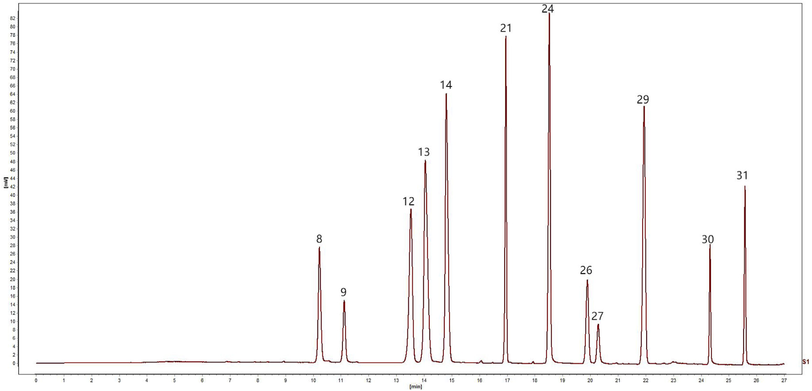
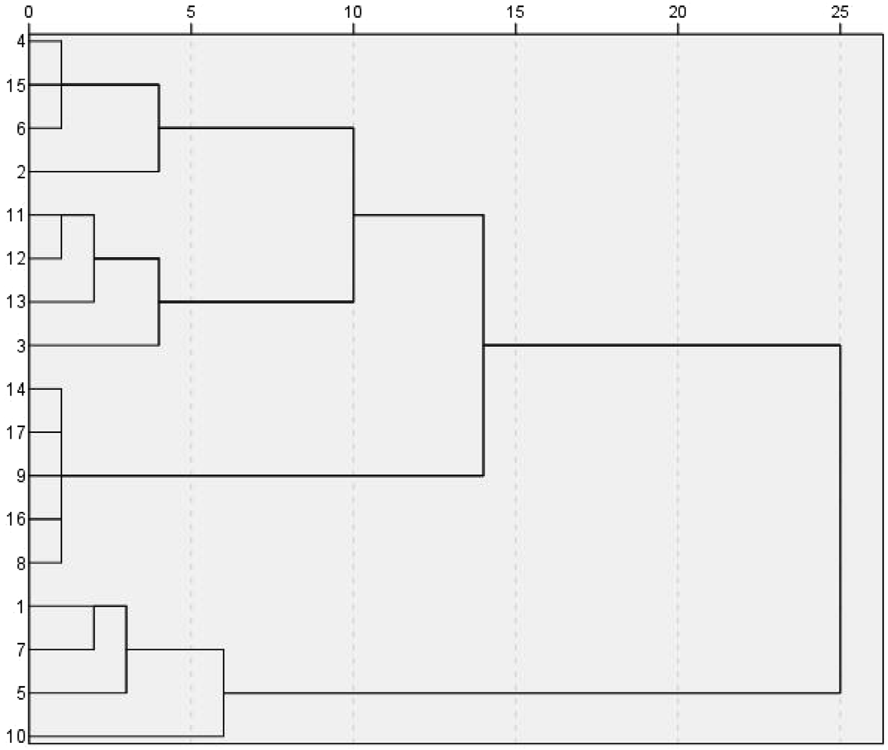
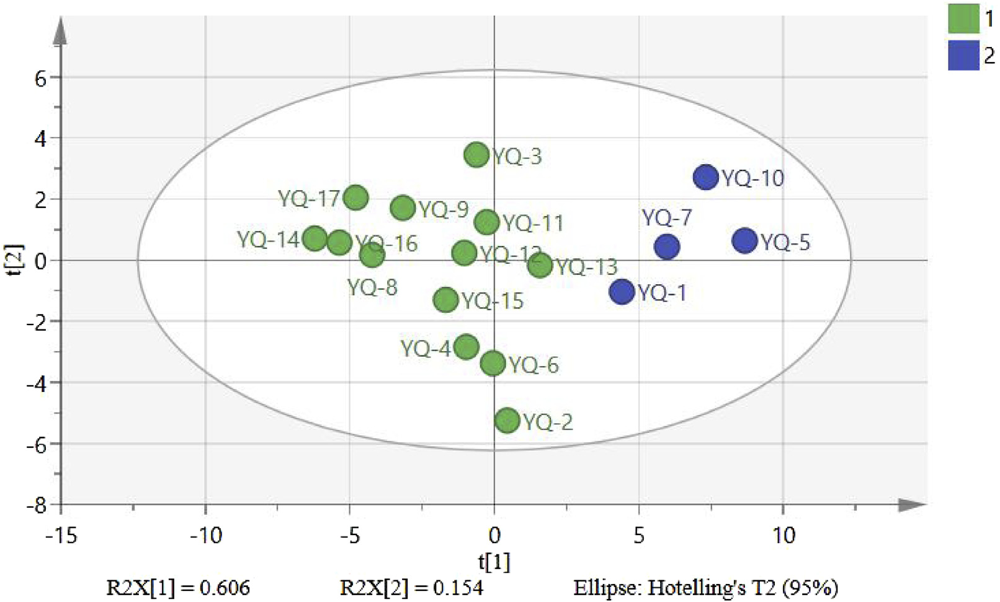
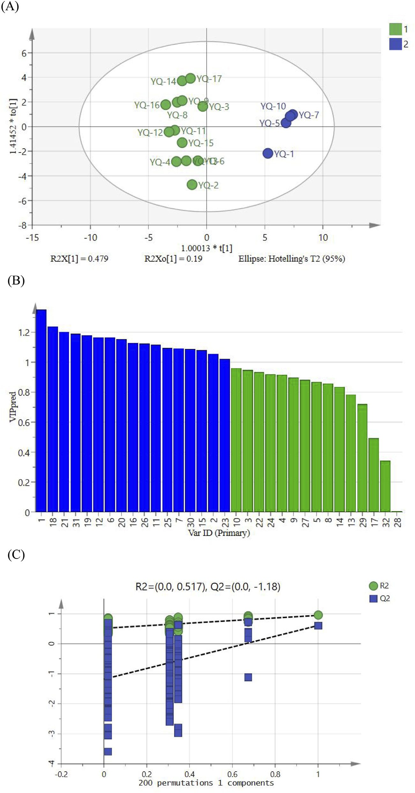

<!-- 方針: ほぼ全訳＋必要に応じた補足。原文の構成・節立てに沿って訳出。「> 補足:」は訳者注。 -->

## 書誌情報

- 標題（原題）: UPLC fingerprinting combined with quantitative analysis of multicomponents by a single marker for quality evaluation of YiQing granules
- 著者・所属: YangHong Li¹†、Bao Yu²,³†、Wei Zhao¹、Xiyu Pu¹、Xue Zhong⁴、Xingbao Tao²、Yunhong Wang²、Weiguo Cao²*、Dan Zhang¹,²*（¹重慶医科大学 中医学院、²重慶中医薬大学 中薬学院、³重慶市医薬植物研究所、⁴雲南中医薬大学。†筆頭共著、*責任著者）
- 掲載誌・巻号・DOI: *Frontiers in Chemistry* 2025, 13:1632033. https://doi.org/10.3389/fchem.2025.1632033（オープンアクセス, CC BY 4.0）
- インパクトファクター: **要確認**（*Frontiers in Chemistry* の2024年版インパクトファクターは第三者集計サイト間で約3.6〜4.2の幅があり報告されており、Clarivate公式のJCR値を一次情報で確認できなかったため、本解説では数値を確定しない）
- 受理経過: 受領 2025-05-20 / 受理 2025-07-17 / 公開 2025-07-28
- 資金: 重慶市衛生健康委員会「バーユー・チーホアン学者」支援プロジェクト（2023-23-14）、重慶市教育委員会科学技術研究計画（KJZD-M202215102, KJQN202215118）、重慶市科学技術局人材計画「一括プロジェクト」（cstc2024ycjh-bgzxm0111）、重慶市医薬植物研究所基礎研究特別基金（2023jbky-002）
- 利益相反・生成AI: 著者らは開示すべき利益相反はないと宣言。本原稿の作成に生成AIは使用していないと著者らは宣言。

> 補足: 一清顆粒（YiQing granules, YQGs）は黄連（*Coptis chinensis*）・大黄（rhubarb）・黄芩（*Scutellaria baicalensis*）からなる中国薬典収載の中成薬（顆粒剤）。本文中の略号 **YQGs**、**QAMS**（単一マーカーによる多成分定量）、**ESM**（外部標準法）、**RCF**（相対補正係数）、**SMD**（標準法偏差）、**SA**（類似度分析）、**HCA**（階層的クラスター分析）、**PCA**（主成分分析）、**OPLS-DA**（直交偏最小二乗判別分析）はそのまま用いる。

## 要旨（Abstract）

**研究背景**: 一清顆粒（YQGs）は中国の臨床で広く用いられている特許医薬品である。しかし、本製剤の品質管理指標は比較的限定的であり、製品の品質を効果的に保証できていない。したがって、YQGsの包括的な品質評価は不足している。

**目的**: 本研究の目的は、超高速液体クロマトグラフィー–フォトダイオードアレイ検出器（UPLC–PAD）指紋分析と単一マーカーによる多成分定量（QAMS）を組み合わせた、YQGsの定量的・定性的分析法を確立することであった。

**方法**: 我々は、異なるメーカーが製造するYQGsの全体的な品質を評価するため、UPLC指紋とQAMSおよび化学計量学的手法を組み合わせた包括的評価法を確立・検証した。ベルベリンを内部標準として選定し、コプチシン、エピベルベリン、バイカリン、ベルベリン、パルマチン、ウォゴノシド、バイカレイン、ウォゴニン、アロエエモジン、レイン、エモジン、クリソファノールの相対補正係数を確立した。

**研究結果**: 結果は、UPLC–PDA法を用いることで指紋分析の実験時間が約0.5時間に大幅に短縮されたことを示した。類似度0.9超の共通ピークが計32本同定された。QAMSの精度を外部標準法と比較したところ、両手法間に有意差は認められなかった。

**結論**: 本研究で確立したUPLC指紋とQAMSを組み合わせた手法は実行可能かつ信頼性が高く、YQGsの包括的品質評価に利用でき、他の中成薬の品質評価に対しても参考となり得る。

**キーワード**: 「一清」顆粒；単一マーカーによる多成分定量（QAMS）；UPLC；指紋分析；定量分析；品質管理

## 1. 序論（Introduction）

一清顆粒（YQGs）は中国薬典（2020年版）に収載されている常用必須医薬品であり、黄連（*Coptis chinensis*）、大黄（rhubarb）、黄芩（*Scutellaria baicalensis*）からなる（Commission, 2020）。現代の研究によれば、黄連の主な活性成分はアルカロイドであり、コプチシン、エピベルベリン、パルマチン、塩酸ベルベリンなどが含まれる（Wang et al., 2019; Yang et al., 2021）。黄芩の主な活性成分はフラボノイドであり、バイカリン、ウォゴノシド、バイカレイン、ウォゴニンなどが含まれる（Wang et al., 2018; Li et al., 2015; Feng et al., 2010）。大黄の主な活性成分はアントラキノン類であり、アロエエモジン、レイン、エモジン、クリソファノールなどが含まれる（Zhang et al., 2023; Zhang et al., 2021）。YQGsは清熱・解毒・涼血・活血作用を有するため（Zheng et al., 2012; Liu et al., 2024）、大黄は臨床上、咽頭痛、咽頭炎、扁桃炎、便秘、歯肉炎、喀血の治療に用いられてきた（Gong et al., 2017）。より純度の高い化学薬品とは異なり、伝統中国医薬製剤は通常、組成が複雑な多成分の相乗効果を特徴とする。したがって、より包括的な品質管理・評価法が必要とされている。

近年、指紋分析技術は中医薬とその製剤の品質管理に広く用いられている。中医薬の指紋分析は、中医薬の化学成分の体系的研究に基づく定量可能かつ包括的な定性同定法である（Wang et al., 2020; Gao et al., 2020）。この方法は中医薬中の複雑な成分をより包括的に分析でき、それにより中医薬の全体的な品質を管理できる（Yang et al., 2023; Wu et al., 2021; Liu et al., 2022）。この手法は世界保健機関（WHO）、米国食品医薬品局（FDA）、欧州医薬品庁（EMA）、中国国家食品薬品監督管理局に承認されている（Cuadros-Rodríguez et al., 2016; Zhang et al., 2024）。しかし、中医薬またはその製剤の品質を評価する上でいくつかの限界があり、特徴的な共通ピークが中医薬とその製剤の品質の代表的情報を反映しない場合がある（Han et al., 2022; Li et al., 2021）。近年、化学計量学的手法がクロマトグラフィー指紋分析に広く用いられており、例えば類似度解析（SA）、階層的クラスター分析（HCA）、主成分分析（PCA）、直交偏最小二乗判別分析（OPLS-DA）などがある（Sun et al., 2019; Zhu et al., 2019; Si et al., 2020; Men et al., 2021）。指紋データの統計解析は、指紋分析だけでは中医薬の品質の代表的組成を提供できないという問題を効果的に解決できる（Fan et al., 2022）。

中国薬典（2020年版）では、一清顆粒の品質管理の指標成分は黄芩中のバイカリンのみであり、大黄と黄連に対応する含量測定法は未確立である（Chen et al., 2011）。中医薬とその成分の複雑性により、単一成分や単一指標での品質評価は困難である。研究者らはこれまでHPLCおよびUPLC–MS/MSを用いて他のYQGsの品質を評価してきた。しかし、多くの研究には主に3つの限界がある：（1）単一指標成分分析への依存であり、中医薬の全体的品質を包括的に反映することが困難である；（2）対照品への依存であり、試験コストが高くなる；（3）多次元データ統合能力の欠如であり、品質マーカー間の関連パターンを十分に活用できない（Chen et al., 2011; Qu et al., 2007; Li et al., 2010; Zou et al., 2023）。多くの研究では、多成分定量分析は主に外部標準法（ESM）によって行われてきた。しかし、一部の標準物質は入手困難かつ高価であった。これに対し、単一マーカーによる多成分定量（QAMS）は、安価で入手容易な標準物質を用いて複数成分の定量検出を実現できる。QAMS（Zou et al., 2023; Wang et al., 2023; Xu et al., 2024; Zhang et al., 2022）は、複数成分の定量分析のために中医薬（TCM）の品質管理に広く用いられており、この手法は入手困難または高価な標準物質の問題を解決するだけでなく、試験コストと時間も大幅に削減する。現在、QAMSは鷹茶（eagle tea）（Luo et al., 2023）、茶製品（Stekolshchikova et al., 2018）、左金丸（Zuojin pill）（Wang et al., 2023）など、様々な中薬材とその製剤の活性成分の定量に成功裏に適用されている。

本研究では、3つの主要技術を革新的に統合した：（a）グラジエント溶出手順を最適化することで12成分の同時分離を実現するUPLCを用い、従来のHPLCの分析時間を短縮した；（b）相対補正係数を通じて入手困難な対照品の代替検出を実現するQAMS多指標定量法を確立し、コストを削減した；（c）化学計量学的解析（PCA、OPLS-DAなど）を導入し、処方中の3組の成分ペアの相乗効果パターンを明らかにした。YQGsの品質の包括的かつ科学的な評価は、製造業者および医薬品規制当局にYQGsの品質一貫性管理のための科学的根拠と参考を提供するだけでなく、医薬品の品質の包括的評価のための簡便・迅速・正確・信頼性の高い試験法も提供する。

## 2. 材料と方法（Materials and Methods）

### 2.1 装置

定量UPLC分析は、Waters 2998 PDA検出器を備えたWaters e2695超高速液体クロマトグラフおよびAgilent 1290 Infinity II液体クロマトグラフを用いて実施した。クロマトグラフィーカラムは、Phenomenex Kinetex C18カラム（2.1 mm × 50 mm, 1.7 μm）、Waters ACQUITY UPLC BEH C18カラム（2.1 mm × 50 mm, 1.7 μm）、Nuovasil SAB C18カラム（2.1 mm × 50 mm, 1.8 μm）であった。電子天秤はMettler Toledo製。超音波装置はSB-5200DT（寧波新芝生物科技有限公司）。超純水製造装置（Sartorius, ドイツ）を定量分析に使用した。

### 2.2 材料と試薬

エモジン標準品（ロット番号 MUST-23112011；純度 98.09%）、クリソファン酸（chrysophanic acid、クリソファノールの別名）標準品（ロット番号 MUST-23110720；純度 99.46%）、レイン標準品（ロット番号 MUST-23111012；純度 99.1%）は成都Manster生物科技有限公司（四川省, 中国）より購入した。フィシオン（physcion）標準品（ロット番号 B20242；純度 ≥98%）、rhabarberone標準品（ロット番号 B20772；純度 ≥98%）、バイカリン標準品（ロット番号 B20570；純度 ≥98%）、ウォゴノシド標準品（ロット番号 B20488；純度 ≥98%）は源葉生物科技有限公司（上海, 中国）より購入した。バイカレイン標準品（ロット番号 111595；純度 ≥98%）、ウォゴニン標準品（ロット番号 111595；純度 ≥98%）、塩酸ベルベリン標準品（ロット番号 110713；純度 ≥98%）は中国食品薬品検定研究院（National Institutes for Food and Drug Control）より購入した。エピベルベリン標準品（ロット番号 130413；純度 ≥98%）、コプチシン標準品（ロット番号 130809；純度 ≥98%）、塩化パルマチン標準品（ロット番号 130614；純度 ≥98%）は成都普菲徳生物科技有限公司（四川省, 中国）より購入した。アセトニトリルおよびメタノールはHoneywell International（上海, 中国）よりHPLCグレードを購入した。リン酸は上海阿拉丁生化科技股份有限公司よりHPLCグレードを購入した。トリエチルアミンはMacklin Biochemical Co., Ltd.（上海, 中国）よりHPLCグレードを購入した。ここに記載のない試薬は分析グレードのものを用いた。

> 補足: 原文2.2節の試薬購入リストには、定量対象12成分のうち**アロエエモジンの購入元・ロット番号が明記されていない**（原文の記載漏れの可能性がある）。この点は原文どおりで、本解説でも補完・推測はしていない。

17ロットのYQGs（濃縮顆粒）を以下の各社から購入した：太極集団有限公司（23010002）、重慶佩度製薬有限公司（230303）、陝西東泰製薬有限公司（2L02 0201020）、貴州百霊企業集団正興有限公司（20230209）、石家荘第四製薬有限公司（YQ23060901）、四川迪愛特製薬有限公司（320502）、内モンゴル天奇中蒙薬業有限公司（22303010）、湖北新蘭徳製薬有限公司（20240301）、山西華源製薬生物科技有限公司（230105）、陝西省医薬控股集団有限公司（230201）、吉林敬輝製薬有限公司（230303 2025）、吉林敖東集団延辺製薬有限公司（230704）、吉林一心堂製薬有限公司（240101）、黒竜江省灵泰雪源製薬有限公司（20230101）、通化金開製薬有限公司（221212）、鄭州福瑞堂製薬有限公司（231207）、中智製薬集団（20240506）。

> 補足: 各社の日本語社名は英語表記からの逆翻訳であり、正式な中国語・日本語表記と完全に一致しない可能性がある。正確な社名・所在地は原文（英語表記）を参照。

### 2.3 混合標準溶液・試料溶液の調製

**2.3.1 混合標準溶液の調製**: コプチシン、エピベルベリン、バイカリン、塩酸ベルベリン、パルマチン、ウォゴノシド、バイカレイン、ウォゴニン、アロエエモジン、レイン、エモジン、クリソファノールの各対照品を適量精密に秤量し、それぞれメタノールに溶解した。得られた標準品混合物を適切な濃度範囲に希釈した。検量線はX軸に濃度、Y軸にピーク面積をプロットして作成した。全溶液は −20°C で保存した。

**2.3.2 試料溶液の調製**: YQGsを乳鉢で粉砕した。次にYQGsの微粉末 1.0000 g を精密に秤量して50 mLメスフラスコに入れ、約30 mLのメタノールを加えた。混合物を30分間超音波処理し、冷却後、メタノールで重量減少分を補い、0.22 μmミクロポア膜で濾過した。得られた濾液を試料溶液とした。全溶液は −20°C で保存した。

### 2.4 クロマトグラフィー条件

移動相はアセトニトリル（B）–0.2%リン酸（トリエチルアミンでpH 3に調整）（A）とし、グラジエント溶出とした（0–5分, 5%B→10%B；5–11分, 10%→15%B；11–13分, 15%B；13–17分, 15%B→25%B；17–19分, 25%B→27%B；19–21分, 27%B→30%B；21–26分, 30%B→60%B；26–27分, 60%B→90%B）。流速は 0.4 mL/min とした。検出波長は 254, 276, 345 nm に設定し、カラム温度は 35°C、注入量は 1 μL とした。上記クロマトグラフィー条件下での混合標準溶液のクロマトグラムをFigure 1に示す。

### 2.5 UPLC法とバリデーション

本研究では、回帰式、相関係数、直線範囲、検出限界（LOD）、定量限界（LOQ）、精度、回収率、安定性を検証し、本法が中国薬典の要件を満たすか評価した。

異なる濃度の混合標準溶液をUPLCシステムに注入し、プロファイルを記録し、化合物のピーク面積（Y）対濃度（X）で検量線を作成した。LODおよびLOQはそれぞれシグナル対ノイズ比3および10に基づいて測定した。精度は混合標準溶液の6回連続注入により試験した。S10を無作為に試験サンプルとして選定した。安定性は試料溶液を0, 2, 4, 8, 12, 24時間後に順次注入して測定した。再現性は並行抽出した6個のS10試料溶液を注入して測定した。試料回収率は、既知濃度の試料に等量の対照物質を添加して測定した（n = 6）。

### 2.6 単一マーカーによる多成分定量分析（QAMS）

相対補正係数（RCF）の一般的な算出法には、多点補正法（Luo et al., 2023; Xiong et al., 2014; Huang et al., 2018）、スロープ補正法（Zeng et al., 2024; Peng et al., 2018）、線形法（Wang et al., 2015）がある。本研究では、補正係数はスロープ法により算出した。内部標準物質と各被検成分間のRCFは式(1)により算出した。得られたRCFを定数とみなし、被検成分の含量は式(2)、(3)により算出した。

> 式(1): fki = fk / fi
> 式(2): Ci = fki × Ck × (Ai / Ak)
> 式(3): W(mg/g) = Ci × V / m × 1000

ここで、fiは内部参照対照品の標準曲線の傾き、fkは被検成分の対照品の標準曲線の傾き、Aiは試験品中の被検成分のピーク面積、Ciは試験品中の被検成分の濃度、Akは試験品中の参照物質のピーク面積、Ckは試験品中の参照物質の濃度である。Wは YQGs 中の成分の含量（mg/g）、mは YQGs の重量、Vは試料溶液の体積である。

> 補足: 原文の数式部分はPDFの数式組版（分数・上下付き文字）がテキスト抽出時に崩れており、上記は数式の意味を保持しつつ整形した表記。厳密な字体・配置は原文PDFを参照。

YQGsの品質管理はQAMS法により実施し、一定範囲内での各標準品の検出器に対する比率に基づきRCFを算出した。RCF値は異なる注入濃度で算出し、異なる条件下でのRCFの安定性を検討した。

YQGsの品質管理はQAMS法により実施し、これは一定範囲内での各標準品の検出器に対する比例値に基づきRCFを算出するものである。本研究では、クロマトグラフィーカラム（Phenomenex Kinetex C18カラム、Waters ACQUITY UPLC BEH C18カラム、Nuovasil SAB C18カラム）、カラム温度（33°C、35°C、37°C）、移動相の流速（0.36、0.4、0.44 mL/min）を検討した。内部参照物質は経済的・安定・低毒性・有効であり、適切なクロマトグラフィー条件下で良好な分離性を示すべきである（Yang et al., 2023; Li et al., 2010）。

> 補足: 上記2段落は原文でもほぼ同内容の記述が繰り返されている（原文自体の重複）。原文の構成をそのまま保持した。

### 2.7 QAMS測定結果と外部標準法（ESM）の比較

標準法偏差（SMD）をQAMSとESMを用いて算出し、QAMS法の計算結果の正確さを評価した。

> 式(4): SMD(%) = |(CESM − CQAMS) / CESM| × 100%

ここで、CESMおよびCQAMSはそれぞれESMおよびQAMS法により測定した被検成分の含量を表す。

### 2.8 UPLC指紋の確立とデータの科学的解析

17ロットのYQGsを試料溶液の調製法に従って調製した。試料を測定し、クロマトグラムを記録した。全クロマトグラムを統一積分した後、得られたクロマトグラムをAIA形式で「中薬クロマトグラフィー指紋類似度評価システム（2012年版）」ソフトウェアに取り込み、UPLC指紋を確立した。17ロットのYQGsの指紋の類似度も上記ソフトウェアを用いて算出した。Excel 2019を統計解析に使用した。12種の化合物の含量を変数として、17ロットの試料についてクラスター解析を実施した。SPSS（27.0.1）とSIMCA（14.0）をそれぞれHCAとPCAに使用した。

## 3. 結果と考察（Results and Discussion）

### 3.1 線形回帰分析

対照品の濃度を横軸（X）、ピーク面積を縦軸（Y）として線形回帰分析を実施した。Figure 1の結果に示すように、全てのピークは27分以内に良好に分離された。試験範囲内で、12成分の検量線の相関係数は 0.9997〜1.0000 であり、良好な線形関係を示した（Table 1）。

**Table 1. 標準品の検量線・直線範囲・LOD・LOQ**

| 成分 | 回帰式 | R² | 直線範囲(μg/mL) | LOD(μg/mL) | LOQ(μg/mL) |
| --- | --- | --- | --- | --- | --- |
| エピベルベリン | y = 8486.8x − 3429 | 0.9998 | 0.403–25.811 | 0.499 | 1.512 |
| コプチシン | y = 7701.8x − 856.94 | 0.9999 | 0.285–18.22 | 0.151 | 0.457 |
| パルマチン | y = 12038x − 5448.6 | 1.0000 | 1.186–75.871 | 0.747 | 2.262 |
| ベルベリン | y = 12992x − 1571 | 0.9999 | 0.400–25.621 | 0.373 | 1.131 |
| バイカリン | y = 11669x + 21286 | 0.9999 | 4.051–259.243 | 4.050 | 12.272 |
| ウォゴノシド | y = 14441x + 5919.5 | 0.9998 | 0.793–50.718 | 0.949 | 2.877 |
| バイカレイン | y = 21699x − 2446.9 | 0.9997 | 0.261–16.670 | 0.389 | 1.178 |
| ウォゴニン | y = 21970x + 510.54 | 0.9999 | 0.0870–5.570 | 0.080 | 0.244 |
| アロエエモジン | y = 21380x + 67.73 | 0.9998 | 0.052–3.347 | 0.056 | 0.171 |
| レイン | y = 6932.4x − 871.32 | 0.9998 | 0.268–17.146 | 0.346 | 1.050 |
| エモジン | y = 12044x + 25.649 | 1.0000 | 0.031–1.994 | 0.089 | 0.269 |
| クリソファノール | y = 17829x + 341.77 | 0.9998 | 0.061–3.895 | 0.070 | 0.212 |

### 3.2 方法論的検証

中国薬典のガイドラインに従い、システム精度、再現性、安定性、回収率を測定し、UPLC法の実行可能性を検証した。各共通ピークの保持時間とピーク面積を精度・再現性・安定性・回収率試験により算出した。結果は、試料回収率のRSDが 96.86%〜101.05% の範囲、再現性が 1.21%〜2.35% の範囲、精度のRSDが 1.47%未満、安定性が 0.78%未満 であることを示し（Table 2）、確立した方法が選定した12化合物の定性・定量分析に十分であることを示した。

**Table 2. UPLC分析法の方法論的検証**

| 成分 | 精度RSD(%) | 安定性RSD(%) | 再現性RSD(%) | 回収率(%) | 回収率RSD(%) |
| --- | --- | --- | --- | --- | --- |
| エピベルベリン | 1.08 | 0.36 | 1.32 | 100.05 | 3.50 |
| コプチシン | 1.20 | 0.41 | 1.25 | 101.05 | 3.89 |
| パルマチン | 1.15 | 0.23 | 1.29 | 98.79 | 2.16 |
| ベルベリン | 1.22 | 0.74 | 1.45 | 101.05 | 3.28 |
| バイカリン | 1.19 | 0.28 | 1.21 | 98.41 | 1.90 |
| ウォゴノシド | 1.19 | 0.28 | 1.24 | 98.00 | 2.78 |
| バイカレイン | 1.36 | 0.25 | 1.51 | 96.86 | 1.96 |
| ウォゴニン | 1.47 | 0.71 | 1.63 | 100.56 | 2.72 |
| アロエエモジン | 1.32 | 0.46 | 1.22 | 98.31 | 2.82 |
| レイン | 1.31 | 0.47 | 1.27 | 98.03 | 3.65 |
| エモジン | 0.88 | 0.78 | 1.46 | 100.92 | 1.96 |
| クリソファノール | 1.14 | 0.41 | 2.35 | 100.06 | 2.90 |

### 3.3 UPLC指紋とSA（類似度分析）

17ロットのYQGsのUPLCクロマトグラムを「中薬クロマトグラフィー指紋類似度評価システム」(2012A版) を用いて作成した。S8試料を参照指紋とし、中位数法を採用し、時間窓幅0.1として、多点補正・自動マッチング後に対照指紋を作成した（Figure 2A）。次に類似度を算出した。結果はS1〜S17のYQGs試料の指紋が類似していることを示した（Figure 2B）。各共通ピークの相対保持時間（RRT）のRSDは 0.43%未満、各共通ピークの相対ピーク面積のRSDは 5.85%未満 であった。試料間の類似度（SA値）は 0.9超 であった（Table 3）。これは、異なるメーカー間でYQGsの化学組成が類似していることを示すが、同時に類似度だけでは異なるメーカーの試料間の差異を正確に判定できないことも示しており、YQGsの内部品質をより客観的に反映するには、さらなる化学計量学的解析が必要である。分析クロマトグラムに基づき標準指紋を確立し、32本の安定・再現性のある共通ピークを同定した。UPLC保持時間を標準化合物と比較し分光学的解析と組み合わせることで、ピーク8, 9, 12, 13, 14, 21, 24, 26, 27, 29, 30, 31の計12化合物が、それぞれコプチシン、エピベルベリン、バイカリン、ベルベリン、パルマチン、ウォゴノシド、バイカレイン、アロエエモジン、レイン、ウォゴニン、エモジン、クリソファノールと同定された。

> 補足: ピーク番号と化合物の対応列挙順は、Figure 1キャプション（…24, Baicalein, 26, Aloe-emodin, 27, Rhein, 29, Wogonin…）と本文中の列挙順（…baicalein, aloe-emodin, rhein, wogonin, emodin, chrysophanol…）とでわずかに語順が異なるが、番号と化合物の対応自体は一致している（原文どおり）。

**Table 3. 一清顆粒UPLC指紋の類似度結果**

| バッチ | 類似度 | バッチ | 類似度 |
| --- | --- | --- | --- |
| S1 | 0.997 | S10 | 0.985 |
| S2 | 0.903 | S11 | 0.983 |
| S3 | 0.921 | S12 | 0.997 |
| S4 | 0.947 | S13 | 0.997 |
| S5 | 0.972 | S14 | 0.917 |
| S6 | 0.901 | S15 | 0.983 |
| S7 | 0.990 | S16 | 0.993 |
| S8 | 0.973 | S17 | 0.922 |
| S9 | 0.966 | | |

### 3.4 階層的クラスター分析（HCA）

SPSS 27.0ソフトウェアを用い、17ロットの試料における32個の指標成分の共通ピーク面積値を入力指標とした。クラスター解析はウォード法とユークリッド距離を指標として用い、縦方向の樹形図を出力とした。HCA樹形図における2試料間の距離が短いほど類似度が高いことを示し、同一グループに分類された試料は最も高い類似性を持つ。17バッチの試料間の相関係数に従い、異なる製薬会社由来の17個のYQGs試料は2つのカテゴリーに分けられた。S1, S5, S7, S10が1つのカテゴリーに、残りの製薬会社が別のカテゴリーに分類された（Figure 3）。結果は、異なるメーカーが製造したYQGsが組成・含量において異なることを示す。近接ロットのYQGsは原料や加工法が類似している可能性が高く、そのためグループ化されやすい。異なるメーカーの生産条件は同一ではないため、異なるロットの試料間である程度の品質差が生じることは合理的である。さらに、各メーカーが製造するYQGsは、処方原料の産地、加工法、製造工程、輸送・保管条件の影響を受け、品質の差異につながる可能性がある。

### 3.5 主成分分析（PCA）

PCAは特徴抽出と次元削減に用いられる化学計量学的手法であり、多数の変数をデータの分散の最大割合を占める適切な数の直交主成分に縮約するために広く用いられる（Trawiński and Skibiński, 2019; Gan et al., 2019）。異なる企業の化学組成を合理的に評価し包括的に解析するため、17試料のデータをSIMCA14.0ソフトウェアに取り込んだ。4つの主成分（PC1, PC2, PC3, PC4）が全変数の情報の大部分を含み、4成分の累積寄与率は 90.4% であり、指紋中の32個の共通ピークの情報の大部分を代表しうる。PC1とPC2の固有値はそれぞれ 10.3 と 2.62 であり、全分散のそれぞれ 60.6% と 15.4% を占めた。Figure 4に示すように、17ロットの試料は2つのグループ（S1, S5, S7, S10と残りの1グループ）に分けることができ、散布図の結果はHCAの結果と一致した。散布図はメーカーごとのYQGsの品質差を明確に示している。これは、各メーカーが選定する薬用原料の収穫時期・産地・加工法・生産環境の不確実性に起因すると考えられる。医薬品メーカーは原薬材の出所に注意を払い、製剤の内部管理品質基準を改善し、製剤の品質をより安定的かつ有効なものにすべきであることが示唆される。

### 3.6 直交偏最小二乗判別分析（OPLS-DA）

17ロットのYQGs間の差異をさらに検討するため、PCAの結果に基づき、モデルのVIP値に基づく直交偏最小二乗判別分析（OPLS-DA）を実施した。OPLS-DAモデルは、独立変数（R2x）の適合指数 0.842、従属変数（R2y）の適合指数 0.946、予測指数（Q2）0.609 であった。R2、Q2ともに0.5を超えており、モデルの信頼性が検証された。OPLS-DAスコアプロットをFigure 5Aに示す。17ロットの試料は2つのグループに明確に分けることができ、これはHCAおよびPCAの結果と一致した。Figure 5Bに示す200回の並べ替え検定後、右側でR2・Q2値がより高く、Q2回帰直線が0未満（−1.18）で切片を持つことは、モデルの検証において過学習がないことを裏付け、差異マーカーの同定における有用性を保証する。一般に、VIP > 1 の変数は分類において重要な役割を果たすと考えられる。Figure 5Cに示すように、ピーク1, 18, 21, 31, 19, 12, 20, 6, 16, 26, 11, 25, 7, 30, 15, 2, 23の計17個の差異マーカーが同定された。このうち、ピーク21, 31, 12, 26, 30 はそれぞれウォゴノシド、クリソファノール、バイカリン、アロエエモジン、エモジンと同定され、YQGsの品質に影響を与えるマーカーとして用いることができる。これらの成分は、異なるメーカーのYQGs間の差異を生じさせる主な特徴的成分であり、試料の識別と分類において重要である。

### 3.7 RCF決定の結果

比較の結果、被検成分のうちベルベリンは含量が高く、性質が安定しており、クロマトグラフィーピーク形状が最良で、標準品コストが最も低く、無毒かつ入手容易であった。したがって、ベルベリンを内部標準として選定した。標準品混合物を段階的に希釈し、1〜7番の混合標準溶液からなる勾配系列を得た。ベルベリンを参照化合物として選定し、ベルベリンの検量線の傾きと被検成分の検量線の傾きの正の比をRCF値とした。この比率に従い、コプチシン、エピベルベリン、パルマチン、バイカリン、ウォゴノシド、バイカレイン、ウォゴニン、アロエエモジン、レイン、エモジン、クリソファノールのRCFは、それぞれ **1.418、1.563、0.927、1.032、0.834、0.555、0.548、0.563、1.736、1.000、0.675** であった。

> 補足: 「エモジンのRCF = 1.000」はベルベリンとほぼ同じ検量線の傾きを持っていたことを示す実測値であり、内部標準（ベルベリン）自体のRCFではない（原文どおりの数値）。

### 3.8 RCFの頑健性（durability）

装置、クロマトグラフィーカラム、温度、流速は通常、RCFに影響する最も本質的な要因である（Zhu et al., 2017）。ベルベリンを内部標準として、異なる装置・カラム・温度・流速条件下で他の11成分のRCFを算出した。Table 4に示すように、11化合物全てのベルベリンに対するRCFのRSDは 5%未満 であり、良好な再現性と頑健性を示した。

**Table 4. 12成分のRCF算出結果**（原文Table 4の全訳。内部標準＝ベルベリン。基準条件は流速0.4 mL/min・温度35°C・Waters e2695装置＋Kinetexカラム）

| 条件 | fコプチシン | fエピベルベリン | fパルマチン | fバイカリン | fウォゴノシド | fバイカレイン | fウォゴニン | fアロエエモジン | fレイン | fエモジン | fクリソファノール |
| --- | --- | --- | --- | --- | --- | --- | --- | --- | --- | --- | --- |
| 流速 0.39 mL/min | 1.412 | 1.554 | 0.926 | 1.030 | 0.833 | 0.553 | 0.546 | 0.551 | 1.729 | 0.997 | 0.666 |
| 流速 0.4 mL/min | 1.418 | 1.563 | 0.927 | 1.032 | 0.834 | 0.555 | 0.548 | 0.563 | 1.736 | 1.000 | 0.675 |
| 流速 0.41 mL/min | 1.429 | 1.556 | 0.926 | 1.030 | 0.831 | 0.550 | 0.547 | 0.560 | 1.742 | 1.001 | 0.664 |
| 温度 33°C | 1.419 | 1.550 | 0.922 | 1.030 | 0.831 | 0.550 | 0.544 | 0.545 | 1.778 | 0.986 | 0.667 |
| 温度 35°C | 1.418 | 1.563 | 0.927 | 1.032 | 0.834 | 0.555 | 0.548 | 0.563 | 1.736 | 1.000 | 0.675 |
| 温度 37°C | 1.418 | 1.567 | 0.930 | 1.033 | 0.834 | 0.549 | 0.550 | 0.561 | 1.738 | 0.996 | 0.665 |
| Waters装置＋Nuovasilカラム | 1.411 | 1.563 | 0.925 | 1.073 | 0.844 | 0.568 | 0.544 | 0.568 | 1.721 | 0.985 | 0.685 |
| Waters装置＋Kinetexカラム | 1.418 | 1.563 | 0.927 | 1.032 | 0.834 | 0.555 | 0.548 | 0.563 | 1.736 | 1.000 | 0.675 |
| Waters装置＋Waters(BEH)カラム | 1.416 | 1.560 | 0.923 | 1.030 | 0.838 | 0.563 | 0.541 | 0.554 | 1.731 | 0.994 | 0.681 |
| Agilent装置＋Nuovasilカラム | 1.418 | 1.569 | 0.927 | 1.022 | 0.830 | 0.556 | 0.545 | 0.565 | 1.729 | 0.996 | 0.669 |
| Agilent装置＋Kinetexカラム | 1.416 | 1.567 | 0.925 | 1.023 | 0.820 | 0.549 | 0.547 | 0.561 | 1.735 | 0.992 | 0.666 |
| Agilent装置＋Waters(BEH)カラム | 1.418 | 1.562 | 0.923 | 1.031 | 0.829 | 0.550 | 0.546 | 0.562 | 1.733 | 0.997 | 0.661 |
| **平均(Mean)** | **1.418** | **1.561** | **0.926** | **1.033** | **0.833** | **0.554** | **0.546** | **0.560** | **1.737** | **0.995** | **0.671** |
| **RSD(%)** | **0.310** | **0.360** | **0.241** | **1.260** | **0.678** | **1.061** | **0.440** | **1.159** | **0.805** | **0.534** | **1.099** |

> 補足: 原文Table 4は「装置・カラム」欄が「Waters／Nuovasil」「Kinetex」「Waters」「Agilent／Nuovasil」「Kinetex」「Waters」という入れ子見出し（2機種×3カラムの組み合わせ）で記載されており、上表ではこれを「装置＋カラム」として明示的に補って表記した。数値そのものは原文のまま。

### 3.9 被検成分のクロマトグラフィーピークの位置同定

「一試験・多評価」を実現する前提は、測定対象成分に対応するクロマトグラフィーピークを正確に位置同定するための有効な手段を用いることである。現在、クロマトグラフィーピークの位置同定にはRRT（相対保持時間）またはRTT差が一般的に用いられる（Mai et al., 2020）。本法による標的分析物と参照物質とのRTT差の範囲は大きく、データのばらつきも大きい（Luan et al., 2018）。したがって、本研究ではピーク位置決定にRRTを用いた。異なる装置とカラムを用いて、コプチシン、エピベルベリン、パルマチン、ベルベリン、バイカリン、ウォゴノシド、バイカレイン、ウォゴニン、アロエエモジン、レイン、エモジン、クリソファノールのRRTを測定した。RRT、平均RRT、RSDをそれぞれの成分について算出した。Table 5の結果は、異なる装置・カラム間の測定でRRTの変動が小さいことを示している。全12成分のRSD値は 5.0%以下 であった。したがって、相対保持値は被検成分のクロマトグラフィーピークの位置同定に使用できる。

**Table 5. 異なるカラム・異なる装置によるRRT（相対保持時間）**

| 成分 | Waters／Nuovasil | Waters／Kinetex | Waters／Waters(BEH) | Agilent／Nuovasil | Agilent／Kinetex | Agilent／Waters(BEH) | 平均 | RSD(%) |
| --- | --- | --- | --- | --- | --- | --- | --- | --- |
| エピベルベリン | 0.732 | 0.727 | 0.780 | 0.726 | 0.725 | 0.765 | 0.743 | 3.217 |
| コプチシン | 0.784 | 0.789 | 0.834 | 0.777 | 0.786 | 0.816 | 0.798 | 2.767 |
| パルマチン | 1.038 | 1.052 | 1.016 | 1.041 | 1.059 | 1.015 | 1.037 | 1.742 |
| バイカリン | 0.971 | 0.953 | 0.970 | 0.958 | 0.952 | 0.963 | 0.961 | 0.861 |
| ウォゴノシド | 1.182 | 1.195 | 1.116 | 1.196 | 1.232 | 1.117 | 1.173 | 3.989 |
| バイカレイン | 1.291 | 1.307 | 1.245 | 1.315 | 1.357 | 1.253 | 1.295 | 3.218 |
| ウォゴニン | 1.508 | 1.549 | 1.433 | 1.544 | 1.615 | 1.452 | 1.517 | 4.443 |
| アロエエモジン | 1.394 | 1.405 | 1.363 | 1.424 | 1.461 | 1.380 | 1.404 | 2.471 |
| レイン | 1.447 | 1.427 | 1.391 | 1.464 | 1.482 | 1.395 | 1.434 | 2.562 |
| エモジン | 1.681 | 1.714 | 1.557 | 1.722 | 1.760 | 1.580 | 1.669 | 4.926 |
| クリソファノール | 1.765 | 1.803 | 1.647 | 1.814 | 1.875 | 1.674 | 1.763 | 4.953 |

> 補足: Table 5の列見出し「Waters」「Agilent」はそれぞれ装置名（Waters e2695 / Agilent 1290 Infinity II）を、その下の「Nuovasil」「Kinetex」「Waters」は使用カラム（Nuovasil SAB C18 / Phenomenex Kinetex C18 / Waters ACQUITY UPLC BEH C18）を示す（原文の入れ子見出し構造を上表では結合して表記）。内部標準のベルベリン自体はRRT=1.000（基準）のため表に記載がない（原文どおり）。

### 3.10 QAMSとESMの含量決定結果の比較

原文Supplementary Table S1に示すように、12化合物のQAMS計算値とSMD結果は **5.002%以下** であり、両手法間に有意差はなかった。SMDは式(4)により算出した。したがって、我々が確立したQAMS法は正確であり、単一顆粒中の12化合物の含量を同時に測定するために使用でき、検出コストの大幅な削減と検出効率の向上を実現できる。

> 補足: QAMSとESMの各成分・各バッチの実測含量値そのもの（Supplementary Table S1）は本文には掲載されておらず、原著の補足資料（Supplementary Material）にのみ収載されている。本解説では入手できた本文の範囲（SMD ≤ 5.002% という要約値）のみを記載する。バッチ別の実測含量（mg/g）の詳細は原文の補足資料を参照。

## 4. 結論（Conclusion）

本研究では、0.1%ギ酸水溶液–メタノール、0.1%リン酸水溶液–メタノール、0.2%リン酸水溶液–アセトニトリル、0.2%リン酸水溶液–メタノールを移動相として検討した。しかし、アルカロイド成分はテーリングを起こし、分離効果が不良であった。そこで、トリエチルアミンを用いて移動相のpHを調整し、ピーク形状と分離を改善した。その結果、0.2%リン酸水溶液（トリエチルアミンでpH 3に調整）–アセトニトリル系のクロマトグラム品質が最良であり、ピークのRTTもより穏やかであった。したがって、これが最適なクロマトグラフィー条件である。

本研究で確立したQAMS法は、同一のクロマトグラフィー条件下で、4種のアルカロイド（コプチシン、エピベルベリン、ベルベリン、パルマチン）、4種のフラボノイド（バイカリン、ウォゴノシド、バイカレイン、ウォゴニン）、4種のアントラキノン（アロエエモジン、レイン、エモジン、クリソファノール）の含量を決定できた。ベルベリンを内部標準として、17ロットのYQGsについて12成分の活性成分の含量をRCFにより同時に測定し、本法が実行可能であることを検証した。結果は、確立したQAMS法とESMとの間に有意差がないことを示した。QAMSは単一の内部参照標準を用いて複数の標的化合物を正確かつ同時に定量する。第一に、従来の外部標準法（各化合物にそれぞれ標準品が必要）と比較して、QAMSは特に高価または希少な標準品についてコストを大幅に削減する。第二に、QAMSは分析効率を大幅に向上させ（12種の異なるクラスの活性成分を同時検出）、実験手順を簡略化し、分析サイクル時間を短縮する。最後に、本法は「1つの標準品・1つの試験」という従来の限界を打破し、標準品の希少性の問題を効果的に克服し、全ての標的に対する純品の入手可能性への依存を打破し、複雑な系（中医薬、天然物など）における多成分定量分析の実行可能性と実用性を大幅に拡大する。

さらに、我々はYQGsのUPLC指紋（SA、HCA、PCA、OPLS-DAと組み合わせ）を確立し、その品質を同定・評価した。本研究では、32個の共通ピークに基づく一連の化学計量学的手法により、異なるメーカーのYQGsはS1, S5, S7, S10と残りの1グループの2グループに分けられた。OPLS-DA解析に基づき、5つの品質マーカー（ウォゴノシド、バイカリン、アロエエモジン、エモジン、クリソファノール）がYQGs中で同定された。結果は、異なるメーカーのYQGsの一貫性が依然として異なることを示しており、我々は、異なる製薬会社のYQGsの品質の不一致の考えられる理由として、生薬原料の出所の違い（例えば原料生薬の採取時期の適否や加工法の相違）が挙げられると考える。顆粒製剤の製造工程、保管・輸送条件もYQGsの品質に影響する重要な要因の一つである。

本研究における多技術統合戦略は、既存の手法の限界を解決するだけでなく、より重要なことに、「成分検出–品質評価」という品質管理の新しいパラダイムを確立し、中医薬の品質標準化研究に革新的な方法論的参考を提供する。この新法はYQGsの品質評価に強力な根拠を提供し、単一指標の評価よりも包括的な品質の総合評価という目的を達成できる。これにより検査担当者の日常検査業務の効率と正確性の向上を効果的に支援し、異なるメーカー・異なるロットの品質評価・管理のための技術的支援を提供し、規制当局によるロット出荷検査に利用でき、単一成分試験への依存を低減し、他の関連中成薬の迅速な評価のための重要な参考を提供できる。

---

## 訳者補足（実務向けメモ）

> 以下は原文には無い、QC実務向けの整理（訳者注）。

- 一清顆粒（YQGs）は黄連・大黄・黄芩の3生薬からなる中国の代表的な清熱解毒方剤で、現行の中国薬典（2020年版）の品質規格は黄芩由来のバイカリン1成分のみ。本研究はこの「単一指標」の限界を補うため、UPLC指紋（定性・一貫性評価）とQAMS（定量、12成分）を組み合わせた点が特色。
- QAMSの内部標準はベルベリン（黄連由来アルカロイド。安価・安定・無毒・入手容易）。RCFは装置2機種×カラム3種×温度3水準×流速3水準の条件で頑健性を確認し、全てRSD < 5%（Table 4）。他施設で導入する際は同様の頑健性確認をチェックリスト化できる。
- 指紋の類似度だけでは17社の品質差を判別できず（全バッチSA > 0.9）、HCA・PCA・OPLS-DAの多変量解析で初めて「S1・S5・S7・S10」対「その他13社」という2群構造が見えた点は実務上重要な示唆。指紋の類似度基準（例: 中国薬典の>0.9）を満たしていても、内部品質が均一とは限らない。
- OPLS-DAで抽出された5つの差異マーカー（ウォゴノシド・バイカリン・アロエエモジン・エモジン・クリソファノール）は、メーカー間差を生む主成分であり、規格改定時の追加指標候補として参照できる。
- QAMSとESMの実測含量比較（Supplementary Table S1）はSMD ≤ 5.002%で一致し、正確さは担保されているが、実際のバッチ別含量数値（mg/g）自体は本文に収載されておらず補足資料のみに存在する。定量値を規格値として転用する場合は原著の補足資料の取得を推奨。
- 装置・カラム・温度・流速の検討幅（33–37°C、0.36–0.44 mL/min、C18系3種）は比較的狭いレンジでの頑健性確認であり、より広い運用条件やロット間の原料変動（産地・収穫期）への外挿には注意が必要（本文でも産地・加工法起因の品質差が繰り返し指摘されている）。
