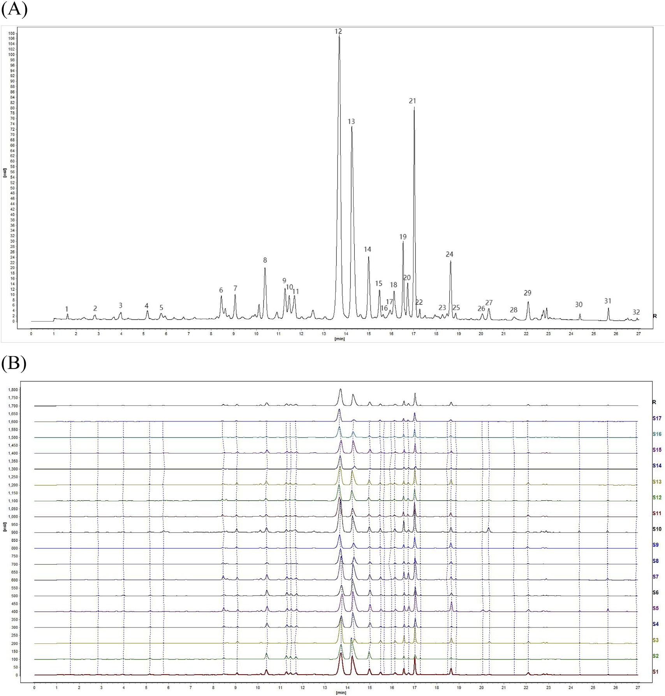

<!-- 方針: ほぼ全訳＋必要に応じた補足。原文構成（Abstract→Introduction→Materials and methods→Results and discussion→Conclusion）に沿って訳出。「> 補足:」は訳者注。 -->

## 書誌情報

- 原題: UPLC fingerprinting combined with quantitative analysis of multicomponents by a single marker for quality evaluation of YiQing granules
- 著者: YangHong Li, Bao Yu, Wei Zhao, Xiyu Pu, Xue Zhong, Xingbao Tao, Yunhong Wang, Weiguo Cao*, Dan Zhang*（重慶医科大学 中医学院／重慶中医薬大学 中薬学院／重慶市中薬材研究院／雲南中医薬大学、中国。Li と Yu は同等貢献の筆頭著者、Cao と Zhang が責任著者）
- 掲載: *Frontiers in Chemistry* 13:1632033 (2025). https://doi.org/10.3389/fchem.2025.1632033
- インパクトファクター: 要確認（*Frontiers in Chemistry*, JCR 2024 / Clarivate）— 検索したジャーナル指標サイト間で数値（4.02／4.2／3.6台など）が一致せず、Clarivate公式値を確認できなかったため捏造を避けて「要確認」とする。
- 受理経過: 受領 2025-05-20 / 受理 2025-07-17 / 公開 2025-07-28。CC BY 4.0（オープンアクセス）。

## 要旨（Abstract）

**研究背景:** 一清顆粒(YQGs)は中国の臨床で広く用いられている特許医薬品である。しかし本製剤の品質管理指標は比較的限られており、製品の品質を効果的に保証できていない。したがって、YQGsの包括的な品質評価が不足している。

**目的:** 本研究の目的は、超高速液体クロマトグラフィー-フォトダイオードアレイ検出器(UPLC-PAD)による指紋分析と、単一マーカーによる多成分の定量分析(QAMS)を組み合わせた、YQGsの定性・定量分析法を確立することであった。

**方法:** UPLC指紋分析とQAMS、計量化学的手法を組み合わせた包括的評価法を確立・検証し、異なるメーカーが製造するYQGsの全体的な品質を評価した。ベルベリンを内部標準（参照物質）として選択し、コプチシン、エピベルベリン、黄芩苷、ベルベリン、パルマチン、オウゴノシド、バイカレイン、オウゴニン、アロエエモジン、レイン、エモジン、クリソファノールの相対補正係数を確立した。

**結果:** 結果は、UPLC-PAD法を用いることで指紋分析の実験時間が約0.5時間へと大幅に短縮されたことを示した。類似度0.9超の共通ピークが計32個同定された。QAMSの精度を外部標準法(ESM)と比較したところ、両手法間に有意差はなかった。

**結論:** 本研究で確立したUPLC指紋分析とQAMSを組み合わせた手法は実行可能かつ信頼性が高く、YQGsの包括的な品質評価に用いることができ、他の中薬製剤の品質評価にも参考を提供しうる。

**キーワード:** 「一清」顆粒、単一マーカーによる多成分定量分析(QAMS)、UPLC、指紋分析、定量分析、品質管理

> 補足: YQGs = YiQing granules（一清顆粒）。黄連(Coptis chinensis)・大黄(rhubarb)・黄芩(Scutellaria baicalensis)の3種の生薬からなる中国薬局方収載の顆粒剤。QAMS = quantitative analysis of multi-components by a single marker（単一マーカーによる多成分定量分析）。SA = 類似度分析(similarity analysis)、HCA = 階層的クラスター分析、PCA = 主成分分析、OPLS-DA = 直交部分最小二乗判別分析。RCF = relative correction factor（相対補正係数）。ESM = external standard method（外部標準法）。

## 1. 序論（Introduction）

一清顆粒(YQGs)は中国薬局方(2020年版)に収載されている汎用必須医薬品であり、黄連(Coptis chinensis)、大黄(rhubarb)、黄芩(Scutellaria baicalensis)からなる。現代の研究によれば、黄連の主要な活性成分はコプチシン、エピベルベリン、パルマチン、塩酸ベルベリンなどのアルカロイド類である。黄芩の主要な活性成分は黄芩苷、オウゴノシド、バイカレイン、オウゴニンなどのフラボノイド類である。大黄の主要な活性成分はアロエエモジン、レイン、エモジン、クリソファノールなどのアントラキノン類である。YQGsは清熱・解毒・涼血・活血の効能を持つため、大黄は咽頭痛、咽頭炎、扁桃炎、便秘、歯肉炎、喀血の治療に臨床で用いられてきた。高純度な化学合成医薬品とは異なり、伝統中国医薬製剤は通常、組成が複雑な多成分の相乗効果を特徴とする。したがって、より包括的な品質管理・評価法が必要とされる。

近年、指紋分析技術は中薬(TCM)およびその製剤の品質管理に広く用いられている。中薬指紋分析は、中薬の化学成分を体系的に研究することに基づく、定量可能で包括的な定性同定法である。中薬中の複雑な成分をより包括的に分析でき、それによって中薬全体の品質を管理できる。この手法は世界保健機関(WHO)、米国食品医薬品局(FDA)、欧州医薬品庁(EMA)、中国国家食品薬品監督管理局によって承認されている。しかし、中薬またはその製剤の品質評価にはいくつかの限界があり、特徴的な共通ピークが中薬・製剤の品質の代表的な情報を反映しない場合がある。近年、計量化学（ケモメトリクス）的手法がクロマトグラフィー指紋分析に広く用いられるようになった。例えば類似度分析(SA)、階層クラスター分析(HCA)、主成分分析(PCA)、直交部分最小二乗判別分析(OPLS-DA)などである。指紋データの統計解析は、指紋分析が中薬品質管理における代表的な組成情報を提供できないという問題を効果的に解決しうる。

中国薬局方(2020年版)において、一清顆粒の品質管理の指標成分は黄芩由来の黄芩苷のみであり、大黄・黄連に対応する含量測定法は開発されていない。中薬とその成分の複雑さにより、単一成分・単一指標による品質評価は困難である。研究者らはこれまでHPLCおよびUPLC-MS/MSを用いて他のYQGsの品質を評価してきたが、ほとんどの研究には3つの主要な限界がある。(1) 単一指標成分分析への依存であり、中薬全体の品質を包括的に反映することが難しい。(2) 対照品への依存により検査コストが高くなる。(3) 多次元データ統合能力の欠如であり、品質マーカー間の関連パターンを十分に活用できない。ほとんどの研究では、多成分定量分析は主に外部標準法(ESM)によって行われてきた。しかし、一部の標準物質は入手困難かつ高価である。対照的に、単一マーカーによる多成分定量分析(QAMS)は、安価で入手しやすい標準物質を用いて複数成分の定量検出を実現できる。QAMSは中薬(TCM)の品質管理に広く用いられており、標準物質の入手困難・高価という問題を解決するだけでなく、検査コストと時間も大幅に削減する。現在、QAMSは各種の中薬材料とその製剤に適用されており、例えば鷹茶（eagle tea）の活性成分の定量、茶製品、佐金丸(Zuojin pill)などがある。

本研究では、3つの主要技術を革新的に統合した。(a) UPLCを用い、勾配溶出プログラムの最適化によって12成分の同時分離を達成し、従来のHPLCと比べて分析時間を短縮した。(b) 入手困難な対照品の代替検出を相対補正係数によって実現するQAMS多指標定量法を確立し、コストを削減した。(c) 計量化学分析(PCA、OPLS-DAなど)を導入し、処方中の3対の成分間の相乗効果パターンを明らかにした。YQGsの品質の包括的・科学的評価は、製造業者および薬事規制当局にYQGsの品質一貫性管理のための科学的根拠と参考を提供するだけでなく、当該医薬品の包括的な品質評価のための簡便・迅速・正確・信頼性の高い検査法を提供する。

## 2. 材料と方法（Materials and Methods）

### 2.1 機器

定量的UPLC分析には、Waters 2998 PDA検出器を備えたWaters e2695超高速液体クロマトグラフおよびAgilent 1290 Infinity II液体クロマトグラフを用いた。クロマトグラフィーカラムは、Phenomenex Kinetex C18カラム(2.1 mm × 50 mm、1.7 μm)、Waters ACQUITY UPLC BEH C18カラム(2.1 mm × 50 mm、1.7 μm)、Nuovasil SAB C18カラム(2.1 mm × 50 mm、1.8 μm)を使用した。電子天秤はMettler Toledo製。超音波装置はNingbo Xinzhi Biotechnology Co., Ltd.製のSB-5200DT。超純水製造装置(Sartorius、ドイツ)を定量分析に用いた。

### 2.2 材料と試薬

エモジン(ロット番号MUST-23112011、純度98.09%)、クリソファン酸(ロット番号MUST-23110720、純度99.46%)、レイン(ロット番号MUST-23111012、純度99.1%)の標準品はChengdu Manster Biotechnology Co., Ltd.(四川省、中国)から購入した。フィスシオン(physcion、ロット番号B20242、純度≥98%)、ラバルベロン(rhabarberone、ロット番号B20772、純度≥98%)、黄芩苷(baicalin、ロット番号B20570、純度≥98%)、オウゴノシド(ロット番号B20488、純度≥98%)の標準品はYuanye Biotechnology Company, Ltd.(上海、中国)から購入した。バイカレイン(ロット番号111595、純度≥98%)、オウゴニン(ロット番号111595、純度≥98%)、塩酸ベルベリン(ロット番号110713、純度≥98%)の標準品は中国食品薬品検定研究院(National Institutes for Food and Drug Control)から購入した。エピベルベリン(ロット番号130413、純度≥98%)、コプチシン(ロット番号130809、純度≥98%)、塩化パルマチン(ロット番号130614、純度≥98%)の標準品はChengdu Pufield Biotechnology, Ltd.(四川省、中国)から購入した。アセトニトリルおよびメタノールはHoneywell International(上海、中国、HPLCグレード)から購入した。リン酸はShanghai Aladdin Bio-Chem Technology Co., Ltd.(上海、中国、HPLCグレード)から購入した。トリエチルアミンはMacklin Biochemical Co., Ltd.(上海、中国、HPLCグレード)から購入した。ここに記載のない試薬はすべて分析用グレードであった。

17バッチのYQGs(濃縮顆粒)を以下の各社から購入した: Taiji Group Co., Ltd.(ロット23010002)、ChongQing Peidu Pharmaceutical Co., Ltd.(230303)、Shaanxi Dongtai Pharmaceutical Co., Ltd.(2L02 0201020)、Guizhou Bailing Enterprise Group Zhengxin Co., Ltd.(20230209)、Shijiazhuang No. 4 Pharmaceutical Co., Ltd.(YQ23060901)、Sichuan Diite Pharmaceutical Co., Ltd.(320502)、Inner Mongolia Tianqi China–Mongolia Pharmaceutical Co., Ltd.(22303010)、Hubei Newland Pharmaceutical Co., Ltd.(20240301)、Shanxi Huayuan Pharmaceutical Biotechnology Co., Ltd.(230105)、Shaanxi Pharmaceutical Holding Group Co., Ltd.(230201)、Jilin Jinghui Pharmaceutical Co., Ltd.(2303032025)、Jilin Aodong Group Jinhaifa Pharmaceutical Co., Ltd.(230704)、Jilin Yimintang Pharmaceutical Co., Ltd.(240101)、Heilongjiang Linhai Xueyuan Pharmaceutical Co., Ltd.(20230101)、Tonghua Jinkai Pharmaceutical Co., Ltd.(221212)、Zhengzhou Furuitang Pharmaceutical Co., Ltd.(231207)、ZhongZhi Pharmaceutical Group(20240506)。

### 2.3 混合標準溶液・試料溶液の調製

**2.3.1 混合標準溶液の調製:** コプチシン、エピベルベリン、黄芩苷、塩酸ベルベリン、パルマチン、オウゴノシド、バイカレイン、オウゴニン、アロエエモジン、レイン、エモジン、クリソファノールの標準品を適量精密に量り取り、それぞれメタノールに溶解した。得られた標準品混合物を適切な濃度範囲に希釈した。検量線は横軸を濃度、縦軸をピーク面積としてプロットした。すべての溶液は−20°Cで保存した。

**2.3.2 試料溶液の調製:** YQGsを乳鉢で粉砕した。YQGs微粉末1.0000 gを精密に量り取り、50 mLメスフラスコに入れ、メタノール約30 mLを加えた。混合物を30分間超音波処理し、冷却後、メタノールで減量分を補い、0.22 μmミクロポア膜で濾過した。得られた濾液を試料溶液とした。すべての溶液は−20°Cで保存した。

### 2.4 クロマトグラフィー条件

移動相はアセトニトリル(B)–0.2%リン酸(トリエチルアミンでpH3に調整)(A)とし、以下のグラジエント溶出を行った: 0–5 min、5%B→10%B；5–11 min、10%→15%B；11–13 min、15%B；13–17 min、15%B→25%B；17–19 min、25%B→27%B；19–21 min、27%B→30%B；21–26 min、30%B→60%B；26–27 min、60%B→90%B。流速は0.4 mL/minとした。検出波長は254、276、345 nmとし、カラム温度35°C、注入量1 μLとした。上記のクロマトグラフィー条件下での混合標準溶液のクロマトグラムを図1に示す。

### 2.5 UPLC法とバリデーション

本研究では、回帰方程式、相関係数、直線範囲、検出限界(LOD)、定量限界(LOQ)、精度、回収率、安定性を検証し、本法が中国薬局方の要求を満たすかを評価した。

異なる濃度の混合標準溶液をUPLCシステムに注入してプロファイルを記録するとともに、化合物のピーク面積(Y)対濃度(X)で検量線を作成した。LODおよびLOQは、それぞれシグナル対ノイズ比3および10に基づいて測定した。

精度(precision)は混合標準溶液の6回連続注入により検証した。S10を無作為に選び試験試料とした。安定性は、試料溶液を0、2、4、8、12、24時間後に順次注入して確認した。再現性(reproducibility)は、並行抽出した6検体のS10試料溶液を注入して確認した。試料回収率は、既知濃度の試料に等濃度の対照物質を添加して測定した(n = 6)。

### 2.6 単一マーカーによる多成分の定量分析(QAMS)

相対補正係数(RCF)の算出に一般的に用いられる方法には、多点補正法、傾き補正法、線形法がある。本研究では、傾き法によりRCFを算出した。内部標準物質と各被測定成分とのRCFは式(1)により算出した。得られたRCFを定数とし、被測定成分の含量は式(2)、(3)により算出した。

- 式(1): fki = fk / fi
- 式(2): Ci = fki × Ck × (Ai / Ak)
- 式(3): W(mg/g) = Ci × V / m × 1000

ここで、fiは内部標準対照品の検量線の傾き、fkは被測定成分対照品の検量線の傾き、Aiは供試品中の被測定成分のピーク面積、Ciは供試品中の被測定成分の濃度、Akは供試品中の内部標準のピーク面積、Ckは供試品中の内部標準の濃度である。Wは YQGs中の成分含量(mg/g)、mはYQGsの重量、Vは YQG溶液の体積である。

YQGsの品質管理はQAMS法を用いて行い、一定範囲内での各標準の検出器に対する比例値に基づいてRCFを算出した。RCF値は異なる注入濃度で算出するとともに、異なる条件下でのRCFの安定性を検討した。本研究では、クロマトグラフィーカラム(Phenomenex Kinetex C18カラム、Waters ACQUITY UPLC BEH C18カラム、Nuovasil SAB C18カラム)、カラム温度(33°C、35°C、37°C)、移動相の流速(0.36、0.4、0.44 mL/min)を検討した。内部標準物質は、経済的で、安定しており、毒性が低く、有効であり、適切なクロマトグラフィー条件下で良好な分離が得られるべきである。

### 2.7 QAMS測定結果と外部標準法(ESM)の比較

QAMS法の計算結果の正確性を評価するため、QAMSとESMを用いて標準偏差率(SMD)を算出した。

- 式(4): SMD(%) = (CESM − CQAMS) / CESM × 100%

ここで、CESMおよびCQAMSはそれぞれESM法およびQAMS法によって測定された被験物質の含量を表す。

### 2.8 UPLC指紋の確立とデータの科学的分析

17バッチのYQGsを試料溶液の調製法に従って調製した。試料を測定し、クロマトグラムを記録した。すべてのクロマトグラムを統一積分した後、得られたクロマトグラムをAIA形式で「中薬クロマトグラフィー指紋類似度評価システム(2012年版)」ソフトウェアに取り込み、UPLC指紋を確立した。17バッチのYQGsの指紋の類似度も上記ソフトウェアを用いて算出した。得られたデータの統計解析にはExcel 2019を用いた。12種の化合物の含量を変数として、17バッチの試料についてクラスター分析を行った。SPSS(27.0.1)およびSIMCA(14.0)をそれぞれHCAおよびPCAに用いた。

## 3. 結果と考察（Results and Discussion）

### 3.1 線形回帰分析

対照品の濃度を横軸(X)、ピーク面積を縦軸(Y)として線形回帰分析を行った。図1に示す結果の通り、すべてのピークは27分以内に良好に分離された。試験範囲内で、12成分の検量線の相関係数は0.9997から1.0000の範囲であり、良好な直線関係を示した(表1)。

**表1. 標準品の検量線・直線範囲・LOD・LOQ**

| 成分 | 検量線 | R² | 直線範囲 (μg/mL) | LOD (μg/mL) | LOQ (μg/mL) |
|---|---|---|---|---|---|
| エピベルベリン | y = 8486.8x − 3429 | 0.9998 | 0.403–25.811 | 0.499 | 1.512 |
| コプチシン | y = 7701.8x − 856.94 | 0.9999 | 0.285–18.22 | 0.151 | 0.457 |
| パルマチン | y = 12038x − 5448.6 | 1.0000 | 1.186–75.871 | 0.747 | 2.262 |
| ベルベリン | y = 12992x − 1571 | 0.9999 | 0.400–25.621 | 0.373 | 1.131 |
| 黄芩苷 | y = 11669x + 21286 | 0.9999 | 4.051–259.243 | 4.050 | 12.272 |
| オウゴノシド | y = 14441x + 5919.5 | 0.9998 | 0.793–50.718 | 0.949 | 2.877 |
| バイカレイン | y = 21699x − 2446.9 | 0.9997 | 0.261–16.670 | 0.389 | 1.178 |
| オウゴニン | y = 21970x + 510.54 | 0.9999 | 0.0870–5.570 | 0.080 | 0.244 |
| アロエエモジン | y = 21380x + 67.73 | 0.9998 | 0.052–3.347 | 0.056 | 0.171 |
| レイン | y = 6932.4x − 871.32 | 0.9998 | 0.268–17.146 | 0.346 | 1.050 |
| エモジン | y = 12044x + 25.649 | 1.0000 | 0.031–1.994 | 0.089 | 0.269 |
| クリソファノール | y = 17829x + 341.77 | 0.9998 | 0.061–3.895 | 0.070 | 0.212 |

### 3.2 方法論的検証

中国薬局方のガイドラインに従い、システム精度、再現性、安定性、回収率を測定し、UPLC法の実行可能性を検証した。各共通ピークの保持時間とピーク面積は、精度・再現性・安定性・回収率試験によって算出した。結果は、試料回収率が96.86%から101.05%の範囲であり、再現性(RSD)は1.21%から2.35%の間、精度のRSDは1.47%未満、安定性は0.78%未満であることを示した(表2)。これは、確立した方法が選択した12化合物の定性・定量分析に十分であることを示している。

**表2. UPLC分析法の方法論的検証**

| 成分 | 精度 RSD (%) | 安定性 RSD (%) | 再現性 RSD (%) | 回収率 (%) | 回収率 RSD (%) |
|---|---|---|---|---|---|
| エピベルベリン | 1.08 | 0.36 | 1.32 | 100.05 | 3.50 |
| コプチシン | 1.20 | 0.41 | 1.25 | 101.05 | 3.89 |
| パルマチン | 1.15 | 0.23 | 1.29 | 98.79 | 2.16 |
| ベルベリン | 1.22 | 0.74 | 1.45 | 101.05 | 3.28 |
| 黄芩苷 | 1.19 | 0.28 | 1.21 | 98.41 | 1.90 |
| オウゴノシド | 1.19 | 0.28 | 1.24 | 98.00 | 2.78 |
| バイカレイン | 1.36 | 0.25 | 1.51 | 96.86 | 1.96 |
| オウゴニン | 1.47 | 0.71 | 1.63 | 100.56 | 2.72 |
| アロエエモジン | 1.32 | 0.46 | 1.22 | 98.31 | 2.82 |
| レイン | 1.31 | 0.47 | 1.27 | 98.03 | 3.65 |
| エモジン | 0.88 | 0.78 | 1.46 | 100.92 | 1.96 |
| クリソファノール | 1.14 | 0.41 | 2.35 | 100.06 | 2.90 |

### 3.3 UPLC指紋とSA（類似度分析）

17バッチのYQGsのUPLCクロマトグラムを、「中薬クロマトグラフィー指紋類似度評価システム」(version 2012A)を用いて作成した。S8試料を参照指紋として、中位数法を採用し、時間窓幅0.1を用いて、多点補正と自動マッチングの後に対照指紋を作成した(図2A)。次に類似度を算出した。結果は、S1〜S17のYQG試料の指紋が類似していることを示した(図2B)。各共通ピークの相対保持時間(RRT)のRSDは0.43%未満、相対ピーク面積のRSDは5.85%未満であった。試料間のSA値は0.9超であり(表3)、異なるメーカーのYQGsの化学組成が類似しており、試料の全体的な品質に大きな差がないことを示した。同時にこれは、異なるメーカーの試料間の差異を類似度だけでは正確に判断できないことも示しており、YQGsの内在的な品質をより客観的に反映するには、さらなる計量化学分析が必要であることを示している。分析クロマトグラムに基づき標準指紋が確立され、安定的で再現性のある32個の共通ピークが同定された。標準化合物とのUPLC保持時間の比較およびスペクトル分析を組み合わせることにより、計12化合物が同定され、ピーク8、9、12、13、14、21、24、26、27、29、30、31がそれぞれコプチシン、エピベルベリン、黄芩苷、ベルベリン、パルマチン、オウゴノシド、バイカレイン、アロエエモジン、レイン、オウゴニン、エモジン、クリソファノールと同定された。

**表3. 一清顆粒UPLC指紋の類似度結果**

| バッチ | 類似度 | バッチ | 類似度 |
|---|---|---|---|
| S1 | 0.997 | S10 | 0.985 |
| S2 | 0.903 | S11 | 0.983 |
| S3 | 0.921 | S12 | 0.997 |
| S4 | 0.947 | S13 | 0.997 |
| S5 | 0.972 | S14 | 0.917 |
| S6 | 0.901 | S15 | 0.983 |
| S7 | 0.990 | S16 | 0.993 |
| S8 | 0.973 | S17 | 0.922 |
| S9 | 0.966 | | |

### 3.4 階層的クラスター分析(HCA)

SPSS 27.0ソフトウェアを用い、17バッチの試料における32個の指標成分の共通ピーク面積値を入力指標として使用した。クラスター分析にはWald法とユークリッド距離を指標とし、垂直方向の系統樹を出力とした。HCAデンドログラム中の2試料間の距離が短いほど類似度が高いことを示し、同一グループにクラスタリングされた試料が最も高い類似性を持つ。17バッチのサンプル間の相関係数によれば、異なる製薬会社由来の17個のYQGs試料は2つのカテゴリーに分けられ、S1、S5、S7、S10が一つのカテゴリーに、残りの製薬会社が別のカテゴリーにクラスタリングされた(図3)。結果は、異なるメーカーが製造するYQGsの組成と含量が異なることを示している。隣接ロットのYQGsは由来や加工方法が類似している可能性が高いため、より一緒にグループ化されやすい。異なるメーカーの生産条件は同一ではないため、異なるロットの試料間にある程度の品質差があることは合理的である。さらに、各メーカーが製造するYQGsは、処方原料の由来、加工方法、生産工程、輸送・保管条件の影響を受け、品質差につながる可能性がある。

### 3.5 主成分分析(PCA)

PCAは特徴抽出と次元削減に用いられる計量化学的手法である。多数の領域変数を、直交し、データの分散の最大割合を占める適切な数の主成分に削減するために広く用いられている。異なる企業由来の化学組成を合理的に評価し、包括的に分析するため、17検体のデータをSIMCA14.0ソフトウェアに取り込んだ。4つの主成分(PC1、PC2、PC3、PC4)がすべての変数の最大の情報を含み、4成分の累積寄与率は90.4%であり、指紋中の32個の共通ピークの情報の大部分を代表しうる。PC1とPC2の固有値はそれぞれ10.3と2.62であり、全分散のそれぞれ60.6%と15.4%を占めた。図4に示すように、17バッチの試料は2つのグループ(S1、S5、S7、S10とその他)に分けることができ、この散布図の結果はHCAの結果と一致した。散布図は、異なるメーカーのYQGsの品質差を明確に示している。これは、原薬の収穫期・産地・加工方法・生産環境における各メーカーの不確実性によって生じている可能性がある。これは、医薬品メーカーが原薬材料の由来に注意を払い、製剤の内部品質基準を改善し、製剤の品質をより安定的かつ有効なものとするべきであることを示唆している。

### 3.6 直交部分最小二乗判別分析(OPLS-DA)

17バッチのYQGsの差異をさらに検討するため、PCAの結果に基づき、モデルのVIP値に基づくOPLS-DAを用いた。OPLS-DAモデルの独立変数の適合指数(R²x)は0.842、従属変数の適合指数(R²y)は0.946、予測指数(Q²)は0.609であった。R²とQ²がいずれも0.5を超えており、モデルの信頼性が検証された。OPLS-DAスコアプロットを図5Aに示す。17バッチの試料は2グループに良好に分けることができ、HCAおよびPCAの結果と一致した。図5Bに示す200回の置換検定の後、右側でR²およびQ²値が高いこと、Q²回帰直線の切片が0未満(−1.18)であることから、モデルはオーバーフィッティングなく検証され、鑑別マーカーの同定における有用性が確認された。一般に、VIP＞1の変数が分類に重要な役割を果たすと考えられている。図5Cに示されるように、17個の鑑別マーカー(ピーク1、18、21、31、19、12、20、6、16、26、11、25、7、30、15、2、23)が同定された。これらのうち、ピーク21、31、12、26、30はそれぞれオウゴノシド、クリソファノール、黄芩苷、アロエエモジン、エモジンと同定され、YQGsの品質に影響を与えるマーカーとして使用できる。これらの成分は、異なるメーカーのYQGs間の差異を引き起こす主要な特徴的成分であり、試料の識別と分類にとって重要である。

### 3.7 RCF決定の結果

比較の結果、被測定成分の中でベルベリンは含量が高く、性質が安定しており、クロマトグラフィーピーク形状が最良で、標準品のコストが最も低く、無毒で入手しやすかった。そのため、ベルベリンを内部標準として選択した。標準品混合物を段階的に希釈し、番号1〜7の勾配系列の混合標準溶液を得た。ベルベリンを参照化合物として選択し、ベルベリンの検量線の傾きと被測定成分の検量線の傾きの正の比をRCF値とした。この比に基づき、コプチシン、エピベルベリン、パルマチン、黄芩苷、オウゴノシド、バイカレイン、オウゴニン、アロエエモジン、レイン、エモジン、クリソファノールのRCFはそれぞれ**1.418、1.563、0.927、1.032、0.834、0.555、0.548、0.563、1.736、1.000、0.675**であった。

### 3.8 RCFの耐久性

機器、クロマトグラフィーカラム、温度、流速は通常、RCFに影響を与える最も重要な要因である。ベルベリンを内部標準として、異なる機器、カラム、温度、流速について他の11成分のRCFを算出した。表4に示すように、11化合物すべてのベルベリンに対するRCFのRSDは5%未満であり、良好な反復性と頑健性を示した。

**表4. 12成分のRCF算出結果**

| 条件 | fコプチシン | fエピベルベリン | fパルマチン | f黄芩苷 | fオウゴノシド | fバイカレイン | fオウゴニン | fアロエエモジン | fレイン | fエモジン | fクリソファノール |
|---|---|---|---|---|---|---|---|---|---|---|---|
| 流速0.39 mL/min | 1.412 | 1.554 | 0.926 | 1.030 | 0.833 | 0.553 | 0.546 | 0.551 | 1.729 | 0.997 | 0.666 |
| 流速0.4 mL/min | 1.418 | 1.563 | 0.927 | 1.032 | 0.834 | 0.555 | 0.548 | 0.563 | 1.736 | 1.000 | 0.675 |
| 流速0.41 mL/min | 1.429 | 1.556 | 0.926 | 1.030 | 0.831 | 0.550 | 0.547 | 0.560 | 1.742 | 1.001 | 0.664 |
| 温度33°C | 1.419 | 1.550 | 0.922 | 1.030 | 0.831 | 0.550 | 0.544 | 0.545 | 1.778 | 0.986 | 0.667 |
| 温度35°C | 1.418 | 1.563 | 0.927 | 1.032 | 0.834 | 0.555 | 0.548 | 0.563 | 1.736 | 1.000 | 0.675 |
| 温度37°C | 1.418 | 1.567 | 0.930 | 1.033 | 0.834 | 0.549 | 0.550 | 0.561 | 1.738 | 0.996 | 0.665 |
| Waters機 / Nuovasilカラム | 1.411 | 1.563 | 0.925 | 1.073 | 0.844 | 0.568 | 0.544 | 0.568 | 1.721 | 0.985 | 0.685 |
| Waters機 / Kinetexカラム | 1.418 | 1.563 | 0.927 | 1.032 | 0.834 | 0.555 | 0.548 | 0.563 | 1.736 | 1.000 | 0.675 |
| Waters機 / Watersカラム | 1.416 | 1.560 | 0.923 | 1.030 | 0.838 | 0.563 | 0.541 | 0.554 | 1.731 | 0.994 | 0.681 |
| Agilent機 / Nuovasilカラム | 1.418 | 1.569 | 0.927 | 1.022 | 0.830 | 0.556 | 0.545 | 0.565 | 1.729 | 0.996 | 0.669 |
| Agilent機 / Kinetexカラム | 1.416 | 1.567 | 0.925 | 1.023 | 0.820 | 0.549 | 0.547 | 0.561 | 1.735 | 0.992 | 0.666 |
| Agilent機 / Watersカラム | 1.418 | 1.562 | 0.923 | 1.031 | 0.829 | 0.550 | 0.546 | 0.562 | 1.733 | 0.997 | 0.661 |
| **平均** | **1.418** | **1.561** | **0.926** | **1.033** | **0.833** | **0.554** | **0.546** | **0.560** | **1.737** | **0.995** | **0.671** |
| **RSD%** | 0.310 | 0.360 | 0.241 | 1.260 | 0.678 | 1.061 | 0.440 | 1.159 | 0.805 | 0.534 | 1.099 |

### 3.9 分析対象物のクロマトグラフィーピークの位置特定

一斉試験・多評価(one test and multiple evaluation)を実現する前提は、測定成分に対応するクロマトグラフィーピークを正確に位置特定するための有効な手段を用いることである。現在、クロマトグラフィーピークの位置特定にはRRT(相対保持時間)またはRTT差が一般的に用いられる。RTT差による対象分析物と参照物質との差の範囲は大きく、データのばらつきも大きい。そのため本研究ではピーク位置特定にRRTを用いた。異なる機器・カラムを用いて、コプチシン、エピベルベリン、パルマチン、ベルベリン、黄芩苷、オウゴノシド、バイカレイン、オウゴニン、アロエエモジン、レイン、エモジン、クリソファノールのRRTを測定した。RRT、平均RRT、RSDはそれぞれの成分について個別に算出した。表5の結果は、異なる機器・カラムでの測定間でRRTの変動が少ないことを示している。12成分すべてのRSD値は5.0%以下であった。したがって、相対保持値はこれらの試験成分のクロマトグラフィーピークの位置特定に使用できる。

**表5. 異なるカラム・異なる機器による相対保持時間(RRT)**

| 成分 | Waters機/Nuovasilカラム | Waters機/Kinetexカラム | Waters機/Watersカラム | Agilent機/Nuovasilカラム | Agilent機/Kinetexカラム | Agilent機/Watersカラム | 平均 | RSD% |
|---|---|---|---|---|---|---|---|---|
| エピベルベリン | 0.732 | 0.727 | 0.780 | 0.726 | 0.725 | 0.765 | 0.743 | 3.217 |
| コプチシン | 0.784 | 0.789 | 0.834 | 0.777 | 0.786 | 0.816 | 0.798 | 2.767 |
| パルマチン | 1.038 | 1.052 | 1.016 | 1.041 | 1.059 | 1.015 | 1.037 | 1.742 |
| 黄芩苷 | 0.971 | 0.953 | 0.970 | 0.958 | 0.952 | 0.963 | 0.961 | 0.861 |
| オウゴノシド | 1.182 | 1.195 | 1.116 | 1.196 | 1.232 | 1.117 | 1.173 | 3.989 |
| バイカレイン | 1.291 | 1.307 | 1.245 | 1.315 | 1.357 | 1.253 | 1.295 | 3.218 |
| オウゴニン | 1.508 | 1.549 | 1.433 | 1.544 | 1.615 | 1.452 | 1.517 | 4.443 |
| アロエエモジン | 1.394 | 1.405 | 1.363 | 1.424 | 1.461 | 1.380 | 1.404 | 2.471 |
| レイン | 1.447 | 1.427 | 1.391 | 1.464 | 1.482 | 1.395 | 1.434 | 2.562 |
| エモジン | 1.681 | 1.714 | 1.557 | 1.722 | 1.760 | 1.580 | 1.669 | 4.926 |
| クリソファノール | 1.765 | 1.803 | 1.647 | 1.814 | 1.875 | 1.674 | 1.763 | 4.953 |

### 3.10 QAMSとESMの含量測定結果の比較

補足表S1に示すように、12化合物のQAMS計算値とESMとのSMDの結果は5.002%以下であり、両手法間に有意差はなかった。SMDは式(4)を用いて算出した。したがって、本研究で確立したQAMS法は正確であり、単一顆粒中の12化合物の含量を同時に測定するために使用でき、検出コストを大幅に削減し、検出効率を向上させることができる。

> 補足: 補足表S1（QAMSとESMの詳細な数値比較）は本論文のSupplementary Materialとして別途公開されており、今回参照したPDF抽出テキストには本文中の数値そのものは含まれていなかった。詳細な数値は原文の補足資料を直接参照されたい。

## 4. 結論（Conclusion）

本研究では、0.1%ギ酸水溶液–メタノール、0.1%リン酸水溶液–メタノール、0.2%リン酸水溶液–アセトニトリル、0.2%リン酸水溶液–メタノールを移動相として検討した。しかし、アルカロイド成分にテーリング(裾引き)が生じ、分離効果が不良であった。そのため、トリエチルアミンを用いて移動相のpHを調整し、ピーク形状と分離を改善した。その結果、0.2%リン酸水溶液(トリエチルアミンでpH3に調整)–アセトニトリル系が最良のマップ品質を示し、ピークのRTTもより適度であった。したがって、これが最適なクロマトグラフィー条件である。

本研究で確立したQAMS法は、同一のクロマトグラフィー条件下で、4種のアルカロイド(コプチシン、エピベルベリン、ベルベリン、パルマチン)、4種のフラボノイド(黄芩苷、オウゴノシド、バイカレイン、オウゴニン)、4種のアントラキノン(アロエエモジン、レイン、エモジン、クリソファノール)の含量を測定できる。ベルベリンを内部標準として用い、RCFにより17バッチ中12バッチのYQGsの活性成分含量を同時に測定し、この方法が実行可能であることを検証した。結果は、確立したQAMS法とESMの間に有意差がないことを示した。QAMSは単一の内部標準物質を用いて複数の標的化合物を同時に正確に定量する。第一に、従来の外部標準法(各化合物にそれぞれの標準品が必要)と比較して、QAMSはコスト、特に高価または希少な標準品のコストを大幅に削減する。第二に、QAMSは分析効率を大幅に改善し(12種の異なるクラスの活性成分を同時検出)、実験プロセスを簡略化し、分析サイクルタイムを短縮する。最後に、本法は「一つの標準品、一つの試験」という従来の限界を打破し、標準品の希少性の問題を効果的に克服し、すべての標的に対する純品の入手可能性への依存を打破し、複雑な系(例えば中薬、天然物)における多成分定量分析の実現可能性と実用性を大幅に拡大する。

さらに、本研究ではYQGsのUPLC指紋(SA、HCA、PCA、OPLS-DAと組み合わせ)を確立し、その品質を同定・評価した。32個の共通ピークに基づく一連の計量化学的手法により、異なるメーカーのYQGsはS1、S5、S7、S10とその他の1グループに分けられた。OPLS-DA解析に基づき、YQGs中に5つの品質マーカー(オウゴノシド、黄芩苷、アロエエモジン、エモジン、クリソファノール)が同定された。結果は、異なるメーカーのYQGsの一貫性に依然として差があることを示しており、異なる製薬会社によるYQGsの品質の不一致の考えられる原因は、原薬材料の由来の違い(原薬の採取時期の適切性や加工方法の違いなど)であると考えられる。顆粒製剤の製造工程、保管、輸送条件も、YQGsの品質に影響を与える重要な要因の一つである。

本研究における多技術結合戦略は、既存手法の限界を解決するだけでなく、より重要なことに、「成分検出-品質評価」という新しい品質管理パラダイムを確立し、中薬の品質標準化研究に革新的な方法論的参考を提供する。この新手法は、YQGsの品質評価に強力な基盤を提供し、単一指標による評価よりも包括的な品質評価という目的を達成できる。これは、検査担当者が日常検査業務の効率と正確性を効果的に向上させるのに役立ち、異なるメーカーの異なるロットの品質評価・管理のための技術的支援を提供し、規制当局がロットリリース検査に用いることができ、単一成分検査への依存を減らし、他の関連する中成薬の迅速な評価のための重要な参考を提供する。

## 訳者補足（実務的示唆）

本研究は、一清顆粒(黄連・大黄・黄芩からなる漢方エキス顆粒)の品質管理を、中国薬局方が定める単一指標(黄芩苷のみ)から、12成分同時定量＋32ピークの指紋分析へと拡張した点に実務的価値がある。QAMS法は、高価・入手困難な標準品(特にアントラキノン類やフラボノイド類)を購入せずとも、安価で入手しやすいベルベリンのみを基準物質として保有すればよく、日常のロット試験のコストと分析時間(約0.5時間)を大幅に削減できる可能性がある。原文が示すように、RCFはカラム(3種)・機器(2台)・温度(3水準)・流速(3水準)を変えてもRSDが5%未満と頑健であったが、それでも新規導入施設ではRCFの自施設内検証(ESMとの突合、SMD確認)を行うことが望ましい。

また、HCA・PCA・OPLS-DAの結果、メーカー間で品質のばらつきが見られ(S1・S5・S7・S10が一群、残り13バッチがもう一群)、その主要因はオウゴノシド・黄芩苷・アロエエモジン・エモジン・クリソファノールの5成分であった。これらは規格の重点管理指標(Q-marker候補)として、原薬の産地・採取時期・加工法の管理と合わせて優先度が高いと考えられる。原文は品質差の原因を原薬由来・加工法・製造工程・保管輸送条件に帰しており、指標成分の測定だけでなく、これらサプライチェーン側の管理と組み合わせて解釈する必要がある。

> 補足: 本論文で言及される「補足表S1」(QAMSとESMの詳細な比較データ)は、今回参照したテキスト抽出には数値が含まれておらず、原文の補足資料(Supplementary Material)を別途参照する必要がある。原文参照。
