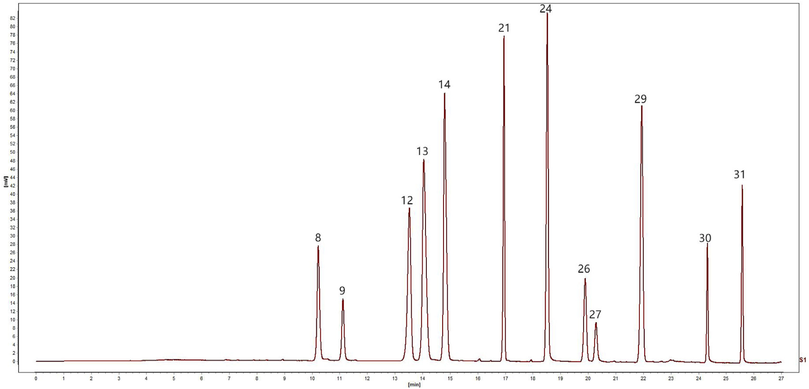
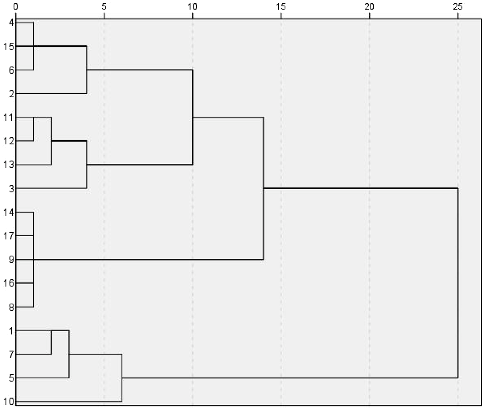

<!-- 方針: ほぼ全訳＋必要に応じた補足。原文構成に沿って訳出。「> 補足:」は訳者注。 -->

## 書誌情報

- 原題: UPLC fingerprinting combined with quantitative analysis of multicomponents by a single marker for quality evaluation of YiQing granules
- 著者: YangHong Li, Bao Yu（第一著者を分担）, Wei Zhao, Xiyu Pu, Xue Zhong, Xingbao Tao, Yunhong Wang, Weiguo Cao（責任著者）, Dan Zhang（責任著者）
- 所属: 重慶医科大学 中医学院／重慶中医薬大学 中薬学院／重慶市薬用植物研究所／雲南中医薬大学（中国）
- 掲載: *Frontiers in Chemistry* 13:1632033 (2025). https://doi.org/10.3389/fchem.2025.1632033
- インパクトファクター: **4.2**（*Frontiers in Chemistry*, JCR 2024 / Clarivate, Q1。2025年6月公表）
- 受領 2025-05-20 / 採録 2025-07-17 / 公開 2025-07-28
- ライセンス: オープンアクセス（CC BY）。生成AIの使用なしと著者が宣言。

> 補足: 益清顆粒（YiQing granules, YQG）は、**黄連（Coptis chinensis）・大黄（rhubarb）・黄芩（Scutellaria baicalensis／コガネバナ）**の3生薬からなる中国薬典（2020年版）収載の常用薬で、清熱・解毒・涼血・活血の効能により、咽頭痛・咽喉炎・扁桃炎・便秘・歯肉炎・喀血などに臨床で用いられる。本論文の主眼は「薬典が品質指標としてバイカリン1成分しか定めていない現状は不十分」という問題意識であり、UPLC指紋＋QAMS（一点校正多成分定量）＋ケモメトリクスの3技術を組み合わせて総合評価法を確立した点にある。

## 要旨（Abstract）

**研究背景:** 益清顆粒（YQG）は中国の臨床で常用される特許医薬品である。しかし本製剤の品質管理指標は比較的限られており、製品品質を有効に保証できていない。したがって、YQGの包括的な品質評価が欠けている。

**目的:** 本研究の目的は、超高速液体クロマトグラフィー–フォトダイオードアレイ検出器（UPLC-PAD）による指紋と、一点校正多成分定量（QAMS）を組み合わせて、YQGの定量・定性分析法を確立することであった。

**方法:** UPLC指紋とQAMS、および化学量論的手法（ケモメトリクス）を組み合わせた総合評価法を確立・検証し、異なる製造業者が製造したYQGの総合品質を評価した。ベルベリンを内部標準（内部参照）として選定し、コプチシン・エピベルベリン・バイカリン・ベルベリン・パルマチン・ウォゴノシド・バイカレイン・ウォゴニン・アロエエモジン・レイン・エモジン・クリソファノールの相対補正係数（RCF）を確立した。

**結果:** UPLC-PAD法により、指紋分析の実験時間が約0.5時間まで有意に短縮された。類似度0.9超の**32本の共通ピーク**が同定された。QAMSの正確性を外部標準法（ESM）と比較したところ、両手法間に有意差はなかった。

**結論:** 本研究で確立したUPLC指紋＋QAMS法は実行可能で信頼でき、YQGの総合品質評価に利用できる。また、他の伝統中薬製剤の品質評価の参考にもなる。

> 補足: 要旨のRCF成分列挙では「ベルベリン」が内部標準でありながら被検成分としても列挙されているが、本文（3.7節）では内部標準のベルベリンを除く**11成分**についてRCFを算出している。定量対象は一貫して12成分（内部標準ベルベリンを含む）である。

**キーワード:** 益清顆粒／一点校正多成分定量（QAMS）／UPLC／指紋／定量分析／品質管理

## 1. 序論（Introduction）

益清顆粒（YQG）は中国薬典（2020年版）に収載された常用の必須医薬品で、**黄連（Coptis chinensis）・大黄（rhubarb）・黄芩（Scutellaria baicalensis）**からなる。現代の研究によれば、黄連の主要活性成分はコプチシン・エピベルベリン・パルマチン・塩酸ベルベリンなどのアルカロイド類、黄芩の主要活性成分はバイカリン・ウォゴノシド・バイカレイン・ウォゴニンなどのフラボノイド類、大黄の主要活性成分はアロエエモジン・レイン・エモジン・クリソファノールなどのアントラキノン類である。YQGの清熱・解毒・涼血・活血の効能により、咽頭痛・咽喉炎・扁桃炎・便秘・歯肉炎・咽喉炎・喀血の治療に臨床で用いられてきた。純度の高い合成医薬品とは異なり、伝統中薬製剤は通常、構成成分が複雑で多成分の相乗効果によって作用する。したがって、より包括的な品質管理・評価法が必要である。

今日、指紋技術は伝統中薬とその製剤の品質管理に広く用いられている。伝統中薬の指紋は、中薬の化学成分の系統的研究に基づく、定量可能で包括的な定性同定法である。複雑な成分をより包括的に分析でき、中薬の総合的な品質を管理できる。この手法は世界保健機関（WHO）、米国食品医薬品局（FDA）、欧州医薬品庁（EMA）、中国国家食品薬品監督管理局によって承認されている。ただし、中薬やその製剤の品質評価には限界もあり、特徴的な共通ピークが中薬・製剤の品質を代表する情報を反映しない場合がある。近年、化学量論分析法（ケモメトリクス）がクロマト指紋分析に広く用いられており、類似度分析（SA）・階層的クラスター分析（HCA）・主成分分析（PCA）・直交部分最小二乗判別分析（OPLS-DA）などの指紋データ統計解析は、「指紋だけでは中薬の品質管理に代表的な組成情報を提供できない」という問題を効果的に解決できる。

中国薬典（2020年版）では、益清顆粒の品質管理の指標成分は黄芩由来のバイカリンのみであり、大黄・黄連については対応する含量測定法が開発されていない。中薬とその成分の複雑さのため、単一成分・単一指標での品質評価は困難である。これまでにもHPLCやUPLC-MS/MSでYQGの品質を評価した研究があるが、多くは3つの重要な限界を抱えている：（1）単一指標成分分析への依存（伝統中薬の総合品質を包括的に反映しにくい）、（2）標準品への依存（試験コストが高い）、（3）多次元データ統合能力の欠如（品質マーカー間の関連パターンを十分に活用できない）。多くの研究では、多成分定量分析は主に外部標準法（ESM）で行われてきた。しかし一部の標準品は入手困難で高価である。

これに対し、**一点校正多成分定量（QAMS: quantitative analysis of multi-components by a single marker）**は、安価で入手容易な1種類の標準品を用いて複数成分を定量できる。QAMSは中薬（TCM）の品質管理に広く用いられ、標準品が入手困難・高価という問題を解決すると同時に、試験コストと時間を大幅に削減する。現在、QAMSは各種の生薬とその製剤（鷹茶（Hawk tea）、茶製品、左金丸など）の活性成分定量に成功裏に応用されている。

本研究では、3つの重要技術を革新的に統合した：（a）グラジエント溶出手順の最適化によりUPLCで12成分の同時分離を達成し、従来のHPLCの分析時間を短縮した、（b）相対補正係数（RCF）により入手困難な標準品を代替検出するQAMS多指標定量法を確立してコストを削減した、（c）ケモメトリクス分析（PCA・OPLS-DAなど）を導入し、処方中の3対の成分の相乗効果パターンを明らかにした。YQGの品質を包括的かつ科学的に評価することは、製造業者・薬事規制当局にとってYQGの品質一貫性管理の科学的根拠・参考になると同時に、薬品の総合品質評価に対する簡便・迅速・正確・信頼できる試験法を提供する。

## 2. 材料と方法（Materials and Methods）

### 2.1. 装置

定量UPLC分析には、Waters 2998 PDA検出器を備えた Waters e2695 超高速液体クロマトグラフ、および Agilent 1290 Infinity II 液体クロマトグラフを用いた。クロマトカラムは Phenomenex Kinetex C18（2.1 mm × 50 mm, 1.7 µm）、Waters ACQUITY UPLC BEH C18（2.1 mm × 50 mm, 1.7 µm）、Nuovasil SAB C18（2.1 mm × 50 mm, 1.8 µm）。電子天秤は Mettler Toledo 製。SB-5200DT 超音波装置は寧波新芝生物科技製。純水製造装置は Sartorius（ドイツ）製。

### 2.2. 材料・試薬

標準品は次のとおり購入した：エモジン（ロット MUST-23112011, 純度98.09%）・クリソファン酸（ロット MUST-23110720, 99.46%）・レイン（ロット MUST-23111012, 99.1%）は成都曼斯特生物科技（四川）；フィスシオン（ロット B20242, ≥98%）・rhabarberone（ロット B20772, ≥98%）・バイカリン（ロット B20570, ≥98%）・ウォゴノシド（ロット B20488, ≥98%）は上海源葉生物科技；バイカレイン（ロット 111595, ≥98%）・ウォゴニン（ロット 111595, ≥98%）・塩酸ベルベリン（ロット 110713, ≥98%）は中国食品薬品検定研究院；エピベルベリン（ロット 130413, ≥98%）・コプチシン（ロット 130809, ≥98%）・塩化パルマチン（ロット 130614, ≥98%）は成都普菲徳生物科技（四川）。アセトニトリル・メタノールは Honeywell International（上海, HPLCグレード）、リン酸は上海阿拉丁生化科技（HPLCグレード）、トリエチルアミンは上海麥克林生化（HPLCグレード）。記載のない試薬は分析用グレード。

**17ロット**のYQG（濃縮顆粒）を次の製造業者から購入した：太極集団（23010002）、重慶培都製薬（230303）、陝西東泰製薬（2L02 0201020）、貴州百霊企業集団正鑫（20230209）、石家荘第四製薬（YQ23060901）、四川迪特製薬（320502）、内蒙古天奇中蒙製薬（22303010）、湖北紐蘭德製薬（20240301）、山西華原薬業生物科技（230105）、陝西医薬控股集団（230201）、吉林敬慧製薬（230303 2025）、吉林敖東集団金海発製薬（230704）、吉林益民堂製薬（240101）、黒龍江林海薬業（20230101）、通化金凱製薬（221212）、鄭州福瑞堂製薬（231207）、中智製薬集団（20240506）。

### 2.3. 混合標準溶液・試料溶液の調製

**2.3.1. 混合標準溶液:** コプチシン・エピベルベリン・バイカリン・塩酸ベルベリン・パルマチン・ウォゴノシド・バイカレイン・ウォゴニン・アロエエモジン・レイン・エモジン・クリソファノールの適量を精秤し、メタノールに溶解。得られた混合標準品を適切な濃度範囲に希釈した。検量線は横軸（X）に濃度、縦軸（Y）にピーク面積をとって作成。全溶液は −20 ℃ で保存。

**2.3.2. 試料溶液:** YQGを乳鉢で粉砕。YQG微粉末 **1.0000 g** を精秤して50 mLメスフラスコに入れ、メタノール約30 mLを加えた。**30分間超音波抽出**し、冷却後、メタノールで減量分を補い、**0.22 µm メンブレンフィルター**でろ過。ろ液を試料溶液とした。全溶液は −20 ℃ で保存。

### 2.4. クロマトグラフィー条件

移動相はアセトニトリル（B）–0.2% リン酸（トリエチルアミンで pH 3 に調整）（A）で、グラジエント溶出を用いた：

| 時間（min） | B（アセトニトリル）比 |
|---|---|
| 0–5 | 5% → 10% |
| 5–11 | 10% → 15% |
| 11–13 | 15% |
| 13–17 | 15% → 25% |
| 17–19 | 25% → 27% |
| 19–21 | 27% → 30% |
| 21–26 | 30% → 60% |
| 26–27 | 60% → 90% |

流速 **0.4 mL/min**。検出波長は **254・276・345 nm**。カラム温度 **35 ℃**、注入量 **1 µL**。上記条件下での混合標準溶液のクロマトグラムを Figure 1 に示す。

### 2.5. UPLC法とバリデーション

本研究では、回帰式・相関係数・直線範囲・検出限界（LOD）・定量限界（LOQ）・精度・回収率・安定性を検証し、中国薬典の要件を満たすか評価した。異なる濃度の混合標準溶液をUPLCに注入してプロファイルを記録し、被検化合物の濃度（X）に対するピーク面積（Y）で検量線を作成。LOD・LOQ はそれぞれ S/N 比 3・10 に基づいて測定した。

精度は混合標準溶液を6回連続注入して評価。試験試料には S10 をランダムに選定。安定性は試料溶液を 0・2・4・8・12・24 時間後に逐次注入して測定。併行精度（再現性）は並行抽出した6つの S10 試料溶液を注入して測定。回収率は、既知濃度の試料に等濃度の標準物質を添加して測定した（n = 6）。

### 2.6. 一点校正多成分定量（QAMS）

相対補正係数（RCF）の一般的な算出法には、多点補正・スロープ（傾き）補正・線形法がある。本研究では**スロープ法**でRCFを算出した。内部参照物質と各被検成分の間のRCFを式(1)で算出し、得られたRCFを定数として、被検成分量を式(2)(3)で算出した。

- 式(1): f_ki = f_k / f_i
- 式(2): C_i = f_ki × C_K × A_i / A_k
- 式(3): W（mg/g）= C_i × V / m × 1000

ここで f_i は内部参照標準品の検量線の傾き、f_k は被検成分標準品の検量線の傾き、A_i は試料中の被検成分のピーク面積、C_i は試料中の被検成分濃度、A_k は試料中の参照成分のピーク面積、C_k は試料中の参照成分濃度。W は YQG 中の成分含量（mg/g）、m は YQG の重量、V は YQG 溶液の容量。

QAMSによるYQGの品質管理では、一定範囲内の各標準品と検出器の比例値に基づいてRCFを算出した。本研究では、クロマトカラム（Phenomenex Kinetex C18、Waters ACQUITY UPLC BEH C18、Nuovasil SAB C18）・カラム温度（33・35・37 ℃）・移動相流速（0.36・0.4・0.44 mL/min）を検討した。内部参照物質は、経済的・安定・低毒性・有効で、適切なクロマト条件下で良好に分離するものであるべきである。

### 2.7. QAMS測定結果と外部標準法（ESM）の比較

QAMSの計算結果の正確性を評価するため、QAMSとESMを用いて標準法偏差（SMD）を算出した。

- 式(4): SMD（%）=（C_ESM − C_QAMS）/ C_ESM × 100%

ここで C_ESM と C_QAMS はそれぞれ ESM・QAMS で測定した分析対象物の含量。

### 2.8. UPLC指紋の確立とデータの科学的解析

17ロットのYQGを試料溶液調製法に従って調製・測定し、クロマトグラムを記録した。全クロマトグラムを統一積分した後、AIAフォーマットで「伝統中薬クロマト指紋類似度評価システム（2012年版）」ソフトウェアにインポートしてUPLC指紋を確立し、17ロットの指紋類似度を算出した。統計解析には Excel 2019 を用いた。12種化合物の含量を変数として、17ロット試料のクラスター分析を行った。HCA・PCA にはそれぞれ SPSS（27.0.1）・SIMCA（14.0）を用いた。

## 3. 結果と考察（Results and Discussion）

### 3.1. 線形回帰分析

標準品の濃度を横軸（X）、ピーク面積を縦軸（Y）として線形回帰分析を行った。Figure 1 に示すとおり、全ピークは 27 分以内に良好に分離した。試験範囲内で、12成分の検量線の相関係数は **0.9997〜1.0000** の範囲にあり、良好な直線関係を示した（Table 1）。

**Table 1. 12成分の検量線・直線範囲・LOD・LOQ。**

| 成分 | 検量線 | R² | 直線範囲（µg/mL） | LOD（µg/mL） | LOQ（µg/mL） |
|---|---|---|---|---|---|
| エピベルベリン | y = 8486.8x − 3429 | 0.9998 | 0.403–25.811 | 0.499 | 1.512 |
| コプチシン | y = 7701.8x − 856.94 | 0.9999 | 0.285–18.22 | 0.151 | 0.457 |
| パルマチン | y = 12038x − 5448.6 | 1.0000 | 1.186–75.871 | 0.747 | 2.262 |
| ベルベリン | y = 12992x − 1571 | 0.9999 | 0.400–25.621 | 0.373 | 1.131 |
| バイカリン | y = 11669x + 21286 | 0.9999 | 4.051–259.243 | 4.050 | 12.272 |
| ウォゴノシド | y = 14441x + 5919.5 | 0.9998 | 0.793–50.718 | 0.949 | 2.877 |
| バイカレイン | y = 21699x − 2446.9 | 0.9997 | 0.261–16.670 | 0.389 | 1.178 |
| ウォゴニン | y = 21970x + 510.54 | 0.9999 | 0.0870–5.570 | 0.080 | 0.244 |
| アロエエモジン | y = 21380x + 67.73 | 0.9998 | 0.052–3.347 | 0.056 | 0.171 |
| レイン | y = 6932.4x − 871.32 | 0.9998 | 0.268–17.146 | 0.346 | 1.050 |
| エモジン | y = 12044x + 25.649 | 1.0000 | 0.031–1.994 | 0.089 | 0.269 |
| クリソファノール | y = 17829x + 341.77 | 0.9998 | 0.061–3.895 | 0.070 | 0.212 |

### 3.2. 方法論の検証（バリデーション）

中国薬典の指針に従い、システム精度・併行精度（再現性）・安定性・回収率を測定してUPLC法の妥当性を検証した。各共通ピークの保持時間とピーク面積を用いて精度・再現性・安定性・回収率試験を行った。結果として、**回収率のRSDは 96.86%〜101.05%**、**再現性は 1.21%〜2.35%**、**精度のRSDは 1.47% 未満**、**安定性は 0.78% 未満**であり（Table 2）、確立した手法が選定した12成分の定性・定量分析に十分であることが示された。

**Table 2. UPLC分析法の方法論的検証。**（回収率・RSD は n = 6）

| 成分 | 精度 RSD（%） | 安定性 RSD（%） | 再現性 RSD（%） | 回収率（%） | 回収率 RSD（%） |
|---|---|---|---|---|---|
| エピベルベリン | 1.08 | 0.36 | 1.32 | 100.05 | 3.50 |
| コプチシン | 1.20 | 0.41 | 1.25 | 101.05 | 3.89 |
| パルマチン | 1.15 | 0.23 | 1.29 | 98.79 | 2.16 |
| ベルベリン | 1.22 | 0.74 | 1.45 | 101.05 | 3.28 |
| バイカリン | 1.19 | 0.28 | 1.21 | 98.41 | 1.90 |
| ウォゴノシド | 1.19 | 0.28 | 1.24 | 98.00 | 2.78 |
| バイカレイン | 1.36 | 0.25 | 1.51 | 96.86 | 1.96 |
| ウォゴニン | 1.47 | 0.71 | 1.63 | 100.56 | 2.72 |
| アロエエモジン | 1.32 | 0.46 | 1.22 | 98.31 | 2.82 |
| レイン | 1.31 | 0.47 | 1.27 | 98.03 | 3.65 |
| エモジン | 0.88 | 0.78 | 1.46 | 100.92 | 1.96 |
| クリソファノール | 1.14 | 0.41 | 2.35 | 100.06 | 2.90 |

### 3.3. UPLC指紋と類似度分析（SA）

「伝統中薬クロマト指紋類似度評価システム（2012A版）」を用いて17ロットYQGのUPLCクロマトグラムを生成した。**S8試料を対照指紋**とし、中央値（メジアン）法を採用、時間窓幅 0.1 で、多点補正・自動マッチング後に対照指紋を生成した（Figure 2A）。その後、類似度を算出した。S1〜S17 のYQG試料の指紋は類似していた（Figure 2B）。各共通ピークの**相対保持時間（RRT）のRSDは 0.43% 未満**、**相対ピーク面積のRSDは 5.85% 未満**であった。試料間の**SA値は >0.9**（Table 3）で、異なる製造業者のYQGの化学組成が類似し、試料の総合品質に差がないことを示した。ただし同時に、類似度だけでは異なる業者の試料の差を正確に判定できず、YQGの内部品質をより客観的に反映するにはさらなるケモメトリクス分析が必要であることも示している。分析クロマトグラムに基づいて標準指紋を確立し、**32本の安定・再現性のある共通ピーク**を同定した。標準化合物との保持時間比較および分光分析により、ピーク 8・9・12・13・14・21・24・26・27・29・30・31 の**計12成分**を、コプチシン・エピベルベリン・バイカリン・ベルベリン・パルマチン・ウォゴノシド・バイカレイン・アロエエモジン・レイン・ウォゴニン・エモジン・クリソファノールと同定した。

**Table 3. 17ロットYQGのUPLC指紋の類似度。**

| ロット | 類似度 | ロット | 類似度 |
|---|---|---|---|
| S1 | 0.997 | S10 | 0.985 |
| S2 | 0.903 | S11 | 0.983 |
| S3 | 0.921 | S12 | 0.997 |
| S4 | 0.947 | S13 | 0.997 |
| S5 | 0.972 | S14 | 0.917 |
| S6 | 0.901 | S15 | 0.983 |
| S7 | 0.990 | S16 | 0.993 |
| S8 | 0.973 | S17 | 0.922 |
| S9 | 0.966 | | |

> 補足: 「相対保持時間（RRT）はよく揃う（RSD<0.43%）＝ピークの並び順（定性的な指紋パターン）は安定」だが、「相対ピーク面積のRSD（<5.85%）と類似度（0.901〜0.997）にはロット差がある＝各成分の量には業者間差がある」という対比が要点。類似度がいずれも0.9超で「一見そろって見える」ため、量の差を捉えるには次節以降のケモメトリクス（HCA/PCA/OPLS-DA）と多成分定量（QAMS）が必要になる、という論理展開。

### 3.4. 階層的クラスター分析（HCA）

SPSS 27.0 を用い、17ロット試料中の32指標成分の共通ピーク面積値を入力指標とした。クラスター分析には Ward 法・ユークリッド距離を用い、縦方向の系統樹を出力した。HCA樹形図で2試料間の距離が短いほど類似度が高く、同一群にクラスターされた試料は最も類似度が高い。17ロットの相関係数によれば、異なる製薬企業の17ロットYQG試料は**2群**に分けられ、**S1・S5・S7・S10 が1群**、残りの製薬企業が別の1群にクラスターされた（Figure 3）。この結果は、異なる業者が製造したYQGが組成・含量で異なることを示す。隣接ロットのYQGは原料・加工法が近く、同じ群にまとまりやすい。異なる業者の製造条件は同一でないため、異なるロット間に一定の品質差があるのは妥当である。さらに、各業者のYQGは処方原料の由来・加工法・製造工程・輸送保存条件の影響を受け、品質差が生じうる。

### 3.5. 主成分分析（PCA）

PCAは特徴抽出・次元削減に用いられるケモメトリクス法である。異なる企業の化学組成を合理的に評価・総合分析するため、17試料のデータを SIMCA 14.0 にインポートした。4つの主成分（PC1〜PC4）が全変数の情報の大半を含み、**4成分の累積寄与率は 90.4%** で、指紋中32共通ピークの情報の大半を代表できた。PC1・PC2 の固有値はそれぞれ 10.3・2.62 で、全分散の **60.6%・15.4%** を占めた。Figure 4 に示すとおり、17ロットは2群に分けられ、**S1・S5・S7・S10 と残りのロット**に分かれ、散布図の結果はHCAと一致した。散布図は異なる業者のYQGの品質差を明瞭に示す。これは、業者が選ぶ生薬の収穫期・産地・加工法・生産環境の不確実性に起因しうる。製造業者は原生薬の由来に注意し、製剤の内部管理品質基準を改善して、製剤の品質をより安定・有効にすべきである。

![Figure 4. 17ロットYQGの指紋の技術的解析（PCAスコアプロット）。緑（群1）：中央にまとまるロット、青（群2）：S1・S5・S7・S10。R2X[1]=0.606、R2X[2]=0.154、楕円はHotelling's T2（95%）。](assets/yqg-uplc-fingerprint-qams/fig4-pca.jpeg)

### 3.6. 直交部分最小二乗判別分析（OPLS-DA）

17ロットYQG間の差をさらに探るため、PCA結果に基づき、モデルのVIP値に基づくOPLS-DAを行った。OPLS-DAモデルは、独立変数の適合指数（R²X）0.842、従属変数の適合指数（R²Y）0.946、予測指数（Q²）0.609 であった。R²・Q² がともに 0.5 を超え、モデルの信頼性を検証した。OPLS-DAスコアプロット（Figure 5A）で、17ロットは2群に良好に分けられ、HCA・PCAの結果と一致した。200回の順列検定（Figure 5B）の後、右側の高い R²・Q² 値と、**Q²回帰直線の切片が 0 未満（−1.18）**であることが、過学習なしのモデル妥当性を確認し、差異マーカー同定への有用性を保証した。一般に **VIP >1** の変数が分類に重要な役割を果たすと考えられる。Figure 5C から **17個の差異マーカー**（ピーク 1・18・21・31・19・12・20・6・16・26・11・25・7・30・15・2・23）が同定された。うちピーク **21・31・12・26・30** はそれぞれ**ウォゴノシド・クリソファノール・バイカリン・アロエエモジン・エモジン**と同定され、YQGの品質に影響するマーカーとして利用できる。これらは異なる業者のYQG間の差を生む主要な特徴成分であり、試料の識別・分類に極めて重要である。

### 3.7. RCF（相対補正係数）の測定結果

比較の結果、被検成分のうち**ベルベリン**は含量が高く、性質が安定し、クロマトピーク形状が最良で、標準品コストが最も低く、無毒で入手容易であった。したがってベルベリンを**内部標準**に選定した。標準混合品を段階希釈して 1〜7 番の混合標準溶液のグラジエント系列を得た。ベルベリンを参照化合物とし、ベルベリンの検量線の傾きに対する各被検成分の検量線の傾きの正の比をRCF値とした。この比により、**コプチシン・エピベルベリン・パルマチン・バイカリン・ウォゴノシド・バイカレイン・ウォゴニン・アロエエモジン・レイン・エモジン・クリソファノールのRCFはそれぞれ 1.418・1.563・0.927・1.032・0.834・0.555・0.548・0.563・1.736・1.000・0.675** であった。

### 3.8. RCFの堅牢性（durability）

RCFに影響する最も本質的な因子は通常、装置・クロマトカラム・温度・流速である。ベルベリンを内部参照として、異なる装置・カラム・温度・流速で他の11成分のRCFを算出した。Table 4 に示すとおり、11成分のRCFの（ベルベリンに対する）**RSDはいずれも 5% 未満**で、良好な再現性と堅牢性を示した。

**Table 4. 各条件下での12成分のRCF算出結果。**（ベルベリンを内部標準とする11成分のRCF）

| 条件 | コプチシン | エピベルベリン | パルマチン | バイカリン | ウォゴノシド | バイカレイン | ウォゴニン | アロエエモジン | レイン | エモジン | クリソファノール |
|---|---|---|---|---|---|---|---|---|---|---|---|
| 流速 0.39 mL/min | 1.412 | 1.554 | 0.926 | 1.030 | 0.833 | 0.553 | 0.546 | 0.551 | 1.729 | 0.997 | 0.666 |
| 流速 0.4 mL/min | 1.418 | 1.563 | 0.927 | 1.032 | 0.834 | 0.555 | 0.548 | 0.563 | 1.736 | 1.000 | 0.675 |
| 流速 0.41 mL/min | 1.429 | 1.556 | 0.926 | 1.030 | 0.831 | 0.550 | 0.547 | 0.560 | 1.742 | 1.001 | 0.664 |
| 温度 33 ℃ | 1.419 | 1.550 | 0.922 | 1.030 | 0.831 | 0.550 | 0.544 | 0.545 | 1.778 | 0.986 | 0.667 |
| 温度 35 ℃ | 1.418 | 1.563 | 0.927 | 1.032 | 0.834 | 0.555 | 0.548 | 0.563 | 1.736 | 1.000 | 0.675 |
| 温度 37 ℃ | 1.418 | 1.567 | 0.930 | 1.033 | 0.834 | 0.549 | 0.550 | 0.561 | 1.738 | 0.996 | 0.665 |
| Waters装置・Nuovasilカラム | 1.411 | 1.563 | 0.925 | 1.073 | 0.844 | 0.568 | 0.544 | 0.568 | 1.721 | 0.985 | 0.685 |
| Waters装置・Kinetexカラム | 1.418 | 1.563 | 0.927 | 1.032 | 0.834 | 0.555 | 0.548 | 0.563 | 1.736 | 1.000 | 0.675 |
| Waters装置・Watersカラム | 1.416 | 1.560 | 0.923 | 1.030 | 0.838 | 0.563 | 0.541 | 0.554 | 1.731 | 0.994 | 0.681 |
| Agilent装置・Nuovasilカラム | 1.418 | 1.569 | 0.927 | 1.022 | 0.830 | 0.556 | 0.545 | 0.565 | 1.729 | 0.996 | 0.669 |
| Agilent装置・Kinetexカラム | 1.416 | 1.567 | 0.925 | 1.023 | 0.820 | 0.549 | 0.547 | 0.561 | 1.735 | 0.992 | 0.666 |
| Agilent装置・Watersカラム | 1.418 | 1.562 | 0.923 | 1.031 | 0.829 | 0.550 | 0.546 | 0.562 | 1.733 | 0.997 | 0.661 |
| 平均 | 1.418 | 1.561 | 0.926 | 1.033 | 0.833 | 0.554 | 0.546 | 0.560 | 1.737 | 0.995 | 0.671 |
| RSD（%） | 0.310 | 0.360 | 0.241 | 1.260 | 0.678 | 1.061 | 0.440 | 1.159 | 0.805 | 0.534 | 1.099 |

### 3.9. 分析対象物のクロマトピークの位置特定

「一回の試験で複数評価（one test, multiple evaluation）」を実現する前提は、有効な手段で被検成分の対応するクロマトピークを正確に位置特定することである。現在、ピーク位置特定には相対保持時間（RRT）または RTT 差がよく用いられる。RTT差は対象と参照の差の範囲が大きくデータの変動が大きいため、本研究では**RRTでピーク位置特定**した。異なる装置・カラムで12成分のRRTを測定し、各成分の RRT・平均RRT・RSD を算出した。Table 5 に示すとおり、異なる装置・カラム間でのRRTの変動は小さく、**12成分のRSDはすべて 5.0% 以下**であった。したがって相対保持値を被検成分のクロマトピーク位置特定に用いることができる。

**Table 5. 異なるカラム・装置における相対保持時間（RRT）。**（左3列＝Waters装置：Nuovasil/Kinetex/Waters、次3列＝Agilent装置：Nuovasil/Kinetex/Waters）

| 成分 | W-Nuovasil | W-Kinetex | W-Waters | A-Nuovasil | A-Kinetex | A-Waters | 平均 | RSD（%） |
|---|---|---|---|---|---|---|---|---|
| エピベルベリン | 0.732 | 0.727 | 0.780 | 0.726 | 0.725 | 0.765 | 0.743 | 3.217 |
| コプチシン | 0.784 | 0.789 | 0.834 | 0.777 | 0.786 | 0.816 | 0.798 | 2.767 |
| パルマチン | 1.038 | 1.052 | 1.016 | 1.041 | 1.059 | 1.015 | 1.037 | 1.742 |
| バイカリン | 0.971 | 0.953 | 0.970 | 0.958 | 0.952 | 0.963 | 0.961 | 0.861 |
| ウォゴノシド | 1.182 | 1.195 | 1.116 | 1.196 | 1.232 | 1.117 | 1.173 | 3.989 |
| バイカレイン | 1.291 | 1.307 | 1.245 | 1.315 | 1.357 | 1.253 | 1.295 | 3.218 |
| ウォゴニン | 1.508 | 1.549 | 1.433 | 1.544 | 1.615 | 1.452 | 1.517 | 4.443 |
| アロエエモジン | 1.394 | 1.405 | 1.363 | 1.424 | 1.461 | 1.380 | 1.404 | 2.471 |
| レイン | 1.447 | 1.427 | 1.391 | 1.464 | 1.482 | 1.395 | 1.434 | 2.562 |
| エモジン | 1.681 | 1.714 | 1.557 | 1.722 | 1.760 | 1.580 | 1.669 | 4.926 |
| クリソファノール | 1.765 | 1.803 | 1.647 | 1.814 | 1.875 | 1.674 | 1.763 | 4.953 |

> 補足: RRTは「ベルベリン（内部標準）の保持時間を基準（=1）とした相対値」。装置・カラムを替えても各成分のRRTが安定（RSD≦5%）なので、標準品を毎回打たなくても、ベルベリンのピークを起点に「このRRTの位置に出るはずのピークがこの成分」と特定できる。これがQAMSで多成分を1つの標準品だけで定量できる仕組みの土台になる。

### 3.10. QAMSとESMの含量測定結果の比較

補足表 S1（Supplementary Table S1）に示すとおり、12成分についてQAMSで算出した含量とESMのSMD結果は **5.002% 以下**で、両手法間に有意差はなかった。SMDは式(4)で算出した。したがって、確立したQAMS法は正確で、単一顆粒中の12成分を同時に定量でき、検出コストを大幅に削減し検出効率を向上できる。

> 補足: 12成分の各ロット別実測含量（QAMS値・ESM値・SMD）は、本論文では**補足資料（Supplementary Table S1）**にまとめられており、本体PDFには含まれていない。個別成分の絶対含量値（mg/g）は「原文（補足資料）参照」。本文で確認できるのは「QAMSとESMの偏差が全成分で≦5.002%＝両法に有意差なし」という結論のみ。

## 4. 結論（Conclusion）

本研究では、移動相として 0.1% ギ酸水溶液–メタノール、0.1% リン酸水溶液–メタノール、0.2% リン酸水溶液–アセトニトリル、0.2% リン酸水溶液–メタノールを検討した。しかしアルカロイド成分がテーリングし分離が悪かった。そこで**トリエチルアミンで移動相 pH を調整**してピーク形状と分離を改善した。結果として、**0.2% リン酸水溶液（トリエチルアミンで pH 3 に調整）–アセトニトリル系**のマップ品質が最良で、ピークのRTTがより適度になった。これが最適クロマト条件である。

本研究で確立したQAMS法は、同一クロマト条件下で、**4アルカロイド（コプチシン・エピベルベリン・ベルベリン・パルマチン）・4フラボノイド（バイカリン・ウォゴノシド・バイカレイン・ウォゴニン）・4アントラキノン（アロエエモジン・レイン・エモジン・クリソファノール）**の含量を測定できた。ベルベリンを内部標準とし、RCFにより17ロット中12ロットのYQGの活性成分含量を同時測定し、本法の実行可能性を検証した。確立したQAMS法とESMに有意差はなかった。

QAMSは単一の内部参照標準品を用いて複数の標的化合物を同時に正確に定量する。第一に、従来の外部標準法（各化合物に固有の標準品が必要）と比べ、QAMSは特に高価・希少な標準品でコストを大幅に削減する。第二に、QAMSは分析効率を大幅に向上させ（12のクラス横断的な活性成分を同時検出）、実験工程を簡素化し、分析サイクル時間を短縮する。最後に、「一標準一試験」という従来の限界を突破し、標準品の希少性という問題を効果的に克服し、全標的の純品入手性への依存を打破して、複雑系（伝統中薬・天然物など）における多成分定量分析の実行可能性・実用性を大きく拡張する。

加えて、YQGのUPLC指紋を確立し（SA・HCA・PCA・OPLS-DA と組み合わせ）、品質を同定・評価した。32共通ピークに基づく一連のケモメトリクス法により、異なる業者のYQGは **S1・S5・S7・S10 と残りのロット**の2群に分けられた。OPLS-DAに基づき、**ウォゴノシド・バイカリン・アロエエモジン・エモジン・クリソファノールの5つの品質マーカー**が同定された。異なる業者のYQGの品質一貫性にはなお差があり、その要因としては、生薬の由来（原生薬の採取時期の適否や加工法）の違いが考えられる。顆粒の製剤工程・保存・輸送条件も、YQGの品質に影響する本質的因子の一つである。

本研究の多技術連結戦略は、既存手法の限界を解決するだけでなく、より重要なことに「成分検出–品質評価」という品質管理の新パラダイムを確立し、伝統中薬の品質標準化研究に革新的な方法論的参考を提供する。この新手法は、YQGの品質評価に強力な根拠を与え、単一指標評価より包括的な総合品質評価を実現できる。検査・試験担当者の日常検査の効率と正確性を向上させ、異なる業者の異なるロットの品質評価・管理に技術的支援を提供し、規制当局によるロット出荷検査に利用でき、単一成分試験への依存を減らし、他の関連中成薬の迅速評価にも本質的な参考を提供する。

## 訳者補足

> 補足（本稿の位置づけ）: 本論文は2011年の双黄連口服液（SHL）の研究（本サイトに別掲）と同系統の「指紋＋多成分定量」だが、10年以上を経て手法が明確に進化している。相違点は3つ：（1）定量が**外部標準法（ESM）からQAMSへ**移行し、12成分をベルベリン1種類の標準品だけで定量してコストと標準品依存を削減している（RCFを各条件で検証しRSD<5%を確認）、（2）**HPLCからUPLCへ**移行し分析時間を約0.5時間まで短縮、（3）類似度分析だけでなく**HCA・PCA・OPLS-DAのケモメトリクス**でロットを判別し、VIP>1の差異マーカーを抽出している。「類似度は全ロット>0.9で一見そろって見えるが、量には業者差があり、多変量解析で2群に分かれる」という論理は、指紋の限界（並び順は見えるが量の差を捉えにくい）を定量とケモメトリクスで補うという、近年のQC論文の典型的な構成である。

> 補足（実務的示唆）: 現行の中国薬典（2020年版）はYQGの指標成分をバイカリン1つしか定めていない。本論文の実データは、黄連由来アルカロイド・大黄由来アントラキノンを含む12成分を横断的に見ると業者間・ロット間に差があることを示しており、単一成分QCでは製品品質を保証しきれないという主張を裏づける。QAMSは、標準品が高価・入手困難な生薬QCの現場で「1つの安価・安定な標準品（ここではベルベリン）を基準に複数成分を定量する」実装例として参考になる。ただしQAMSの前提は「装置・カラム・温度・流速を替えてもRCFとRRTが安定であること」の事前検証であり、本論文はその堅牢性検証（Table 4・Table 5）まで含めている点が実務的に重要。
