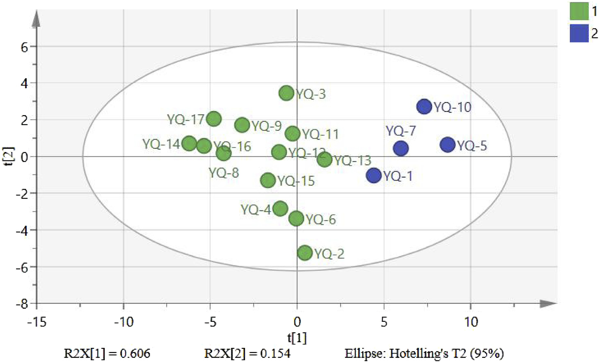
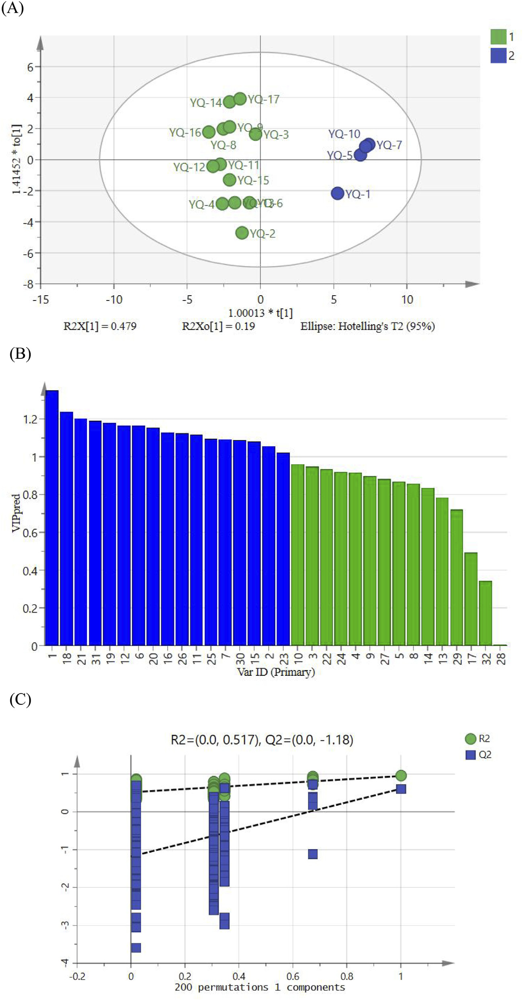

<!-- 方針: ほぼ全訳＋必要に応じた補足。原文構成に沿って訳出。「> 補足:」は訳者注。 -->

## 書誌情報

- 標題（原題）: UPLC fingerprinting combined with quantitative analysis of multicomponents by a single marker for quality evaluation of YiQing granules
- 著者・所属: YangHong Li1†, Bao Yu2,3†, Wei Zhao1, Xiyu Pu1, Xue Zhong4, Xingbao Tao2, Yunhong Wang2, Weiguo Cao2\*, Dan Zhang1,2\*（1 重慶医科大学 中医学院／2 重慶中医薬大学 中薬学院／3 重慶市薬用植物研究所／4 雲南中医薬大学、いずれも中国。†LiとYuは共同筆頭著者、\*CaoとZhangが責任著者）
- 掲載誌・巻号・DOI: *Frontiers in Chemistry* 13:1632033 (2025). https://doi.org/10.3389/fchem.2025.1632033
- インパクトファクター: 約4.0（*Front. Chem.*, JCR 2024 / Clarivate。出典によって3.9〜4.2程度のばらつきあり、正確な最新値は要確認）
- 受理経過 / ライセンス: 受領 2025年5月20日／採択 2025年7月17日／公開 2025年7月28日。Creative Commons Attribution License (CC BY 4.0) のもとで公開されたオープンアクセス論文。

> 補足: YQG(宜清顆粒)は黄連(*Coptis chinensis*)・大黄(rhubarb)・黄芩(*Scutellaria baicalensis*)からなる中国薬局方(2020年版)収載の基本医薬品(中成薬)。QAMS = 一標準多成分定量法(Quantitative Analysis of Multi-components by a Single marker)。RCF = 相対補正係数。ESM = 外部標準法。SA = 類似度解析、HCA = 階層クラスター分析、PCA = 主成分分析、OPLS-DA = 直交部分最小二乗判別分析。

## 要旨（Abstract）

**研究背景**: 宜清顆粒(YQGs)は中国の臨床で汎用される特許医薬品であるが、本製剤の品質管理指標は限定的であり、製品品質を効果的に保証できていない。そのためYQGsの包括的な品質評価が不足している。

**目的**: 本研究の目的は、超高速液体クロマトグラフィー-フォトダイオードアレイ検出器(UPLC-PAD)指紋分析と一標準多成分定量法(QAMS)を組み合わせたYQGsの定量・定性分析法を確立することであった。

**方法**: UPLC指紋分析とQAMSおよび統計学的手法を組み合わせた包括的評価法を確立・検証し、異なる製造元によるYQGsの全体的な品質を評価した。ベルベリンを内部基準物質として選定し、コプチシン、エピベルベリン、バイカリン、ベルベリン、パルマチン、ワゴノシド、バイカレイン、ワゴニン、アロエエモジン、レイン、エモジン、クリソファノールの相対補正係数を確立した。

**研究結果**: 結果は、UPLC-PAD法を用いることで指紋分析の実験時間が約0.5時間へと大幅に短縮されたことを示した。類似度0.9超の共通ピークが計32本同定された。QAMSの精度を外部標準法と比較したところ、両手法間に有意差はなかった。

**結論**: 本研究で確立したUPLC指紋分析とQAMSを組み合わせた手法は実行可能かつ信頼性が高く、YQGsの包括的な品質評価に利用でき、他の中成薬の品質評価にも参考となりうる。

**キーワード**: 宜清顆粒、一標準多成分定量法(QAMS)、UPLC、指紋分析、定量分析、品質管理

## 1. 序論（Introduction）

宜清顆粒(YQGs)は中国薬局方(2020年版)に収載される汎用必須医薬品であり、黄連(*Coptis chinensis*)、大黄(rhubarb)、黄芩(*Scutellaria baicalensis*)から構成される(Commission, 2020)。現代研究によれば、黄連の主要活性成分はコプチシン、エピベルベリン、パルマチン、塩酸ベルベリンなどのアルカロイド類である(Wang et al., 2019; Yang et al., 2021)。黄芩の主要活性成分はバイカリン、ワゴノシド、バイカレイン、ワゴニンなどのフラボノイド類である(Wang et al., 2018; Li et al., 2015; Feng et al., 2010)。大黄の主要活性成分はアロエエモジン、レイン、エモジン、クリソファノールなどのアントラキノン類である(Zhang et al., 2023; Zhang et al., 2021)。YQGsは清熱・解毒・涼血・活血の効能を持つため(Zheng et al., 2012; Liu et al., 2024)、大黄は臨床的に咽頭痛、咽頭炎、扁桃炎、便秘、歯肉炎、喀血の治療に用いられてきた(Gong et al., 2017)。純度の高い化学薬品とは異なり、伝統中国医薬製剤は通常、組成の複雑性を伴う多成分の相乗効果を持つ。したがって、より包括的な品質管理・評価法が必要である。

近年、指紋分析技術は中医薬とその製剤の品質管理に広く用いられている。中医薬指紋分析は、中医薬の化学成分の体系的研究に基づく定量可能かつ包括的な定性同定法である(Wang et al., 2020; Gao et al., 2020)。この手法は中医薬中の複雑な成分をより包括的に解析し、それによって中医薬の全体的な品質を管理できる(Yang et al., 2023; Wu et al., 2021; Liu et al., 2022)。本手法は世界保健機関(WHO)、米国食品医薬品局(FDA)、欧州医薬品庁(EMA)、中国国家食品薬品監督管理局によって承認されている(Cuadros-Rodríguez et al., 2016; Zhang et al., 2024)。しかし、中医薬あるいはその製剤の品質評価にはいくつかの限界があり、特徴的な共通ピークが中医薬とその製剤の品質を代表する情報を反映していない場合がある(Han et al., 2022; Li et al., 2021)。近年、化学量論(ストイキオメトリー)解析法がクロマトグラフィー指紋分析に広く用いられるようになった。類似度解析(SA)、階層クラスター分析(HCA)、主成分分析(PCA)、直交部分最小二乗判別分析(OPLS-DA)など(Sun et al., 2019; Zhu et al., 2019; Si et al., 2020; Men et al., 2021)、指紋データの統計解析は指紋分析が中医薬品質管理の代表的組成を提供できないという問題を効果的に解決しうる(Fan et al., 2022)。

中国薬局方(2020年版)では、宜清顆粒の品質管理指標成分は黄芩中のバイカリンのみであり、大黄と黄連に対応する含量測定法は未確立である(Chen et al., 2011)。中医薬とその成分の複雑性ゆえに、単一成分・単一指標による品質評価は困難である。これまでの研究者はHPLCおよびUPLC-MS/MSを用いて他のYQGsの品質を評価してきた。しかし、多くの研究には以下の3つの主要な限界がある: (1)単一指標成分分析への依存であり、中医薬の全体的品質を包括的に反映することが困難である。(2)対照品への依存であり、試験コストが高くなる。(3)多次元データ統合能力の欠如であり、品質マーカー間の関連パターンを十分に活用できない(Chen et al., 2011; Qu et al., 2007; Li et al., 2010; Zou et al., 2023)。これまでの多くの研究では、多成分定量分析は主に外部標準法(ESM)によって行われてきた。しかし一部の標準物質は入手困難かつ高価であった。それに対し、一標準多成分定量法(QAMS)は安価かつ入手容易な標準物質を用いて複数成分の定量検出を実現できる。QAMS(Zou et al., 2023; Wang et al., 2023; Xu et al., 2024; Zhang et al., 2022)は多成分定量分析の手法として中医薬(TCM)の品質管理に広く用いられており、入手困難あるいは高価な標準品の問題を解決するだけでなく、試験コストと時間を大幅に削減する。現在、QAMSはさまざまな中薬材とその製剤に適用されており、たとえば鷹茶(eagle tea)中の活性成分の定量(Luo et al., 2023)、茶製品(Stekolshchikova et al., 2018)、左金丸(Zuojin pill)(Wang et al., 2023)などが挙げられる。

本研究では、以下の3つの主要技術を新規に統合した: (a) UPLCを用い、グラジエント溶出手順を最適化することで12成分の同時分離を達成し、従来のHPLCの分析時間を短縮した。(b) 相対補正係数による入手困難な対照品の代替検出を実現するQAMS多指標定量法を確立し、コストを削減した。(c) ケモメトリクス解析(PCA、OPLS-DAなど)を導入し、製剤中の3対の成分の相乗効果パターンを明らかにした。YQGsの品質に関するこの包括的かつ科学的な評価は、製造業者と薬事規制機関にYQGsの品質一貫性管理のための科学的根拠と参考を提供するだけでなく、当該医薬品の品質を包括的に評価するためのシンプルかつ迅速・正確・信頼性の高い試験法を提供する。

## 2. 材料と方法（Materials and Methods）

### 2.1 機器

定量UPLC分析には、Waters 2998 PDA検出器を備えたWaters e2695超高性能液体クロマトグラフおよびAgilent 1290 Infinity II液体クロマトグラフを用いた。クロマトグラフィーカラムはPhenomenex Kinetex C18カラム(2.1 mm × 50 mm, 1.7 μm)、Waters ACQUITY UPLC BEH C18カラム(2.1 mm × 50 mm, 1.7 μm)、Nuovasil SAB C18カラム(2.1 mm × 50 mm, 1.8 μm)を使用した。電子天秤はMettler Toledo製、超音波装置はNingbo Xinzhi Biotechnology Co., Ltd.製のSB-5200DTを使用した。超純水製造装置(Sartorius, ドイツ)を定量分析に使用した。

### 2.2 材料と試薬

エモジン(ロット番号 MUST-23112011、純度98.09%)、クリソファン酸(ロット番号 MUST-23110720、純度99.46%)、レイン(ロット番号 MUST-23111012、純度99.1%)の標準品はChengdu Manster Biotechnology Co., Ltd.(四川省, 中国)より購入した。フィシオン(physcion、ロット番号 B20242、純度≥98%)、ラバルベロン(rhabarberone、ロット番号 B20772、純度≥98%)、バイカリン(ロット番号 B20570、純度≥98%)、ワゴノシド(ロット番号 B20488、純度≥98%)の標準品はYuanye Biotechnology Company, Ltd.(上海, 中国)より購入した。バイカレイン(ロット番号 111595、純度≥98%)、ワゴニン(ロット番号 111595、純度≥98%)、塩酸ベルベリン(ロット番号 110713、純度≥98%)の標準品は中国食品薬品検定研究院(National Institutes for Food and Drug Control)より購入した。エピベルベリン(ロット番号 130413、純度≥98%)、コプチシン(ロット番号 130809、純度≥98%)、塩化パルマチン(ロット番号 130614、純度≥98%)の標準品はChengdu Pufield Biotechnology, Ltd.(四川省, 中国)より購入した。アセトニトリルとメタノールはHoneywell International(上海, 中国)よりHPLGグレードを購入した。リン酸はShanghai Aladdin Bio-Chem Technology Co., Ltd.(上海, 中国)よりHPLCグレードを購入した。トリエチルアミンはMacklin Biochemical Co., Ltd.(上海, 中国)よりHPLCグレードを購入した。ここに記載のない試薬は分析グレードのものを使用した。

宜清顆粒(濃縮顆粒)17バッチは以下の製造元より購入した: Taiji Group Co., Ltd.(23010002)、ChongQing Peidu Pharmaceutical Co., Ltd.(230303)、Shaanxi Dongtai Pharmaceutical Co., Ltd.(2L020201020)、Guizhou Bailing Enterprise Group Zhengxin Co., Ltd.(20230209)、Shijiazhuang No. 4 Pharmaceutical Co., Ltd.(YQ23060901)、Sichuan Diite Pharmaceutical Co., Ltd.(320502)、Inner Mongolia Tianqi China–Mongolia Pharmaceutical Co., Ltd.(22303010)、Hubei Newland Pharmaceutical Co., Ltd.(20240301)、Shanxi Huayuan Pharmaceutical Biotechnology Co., Ltd.(230105)、Shaanxi Pharmaceutical Holding Group Co., Ltd.(230201)、Jilin Jinghui Pharmaceutical Co., Ltd.(2303032025)、Jilin Aodong Group Jinhaifa Pharmaceutical Co., Ltd.(230704)、Jilin Yimintang Pharmaceutical Co., Ltd.(240101)、Heilongjiang Linhai Xueyuan Pharmaceutical Co., Ltd.(20230101)、Tonghua Jinkai Pharmaceutical Co., Ltd.(221212)、Zhengzhou Furuitang Pharmaceutical Co., Ltd.(231207)、ZhongZhi Pharmaceutical Group(20240506)。

### 2.3 混合標準溶液・供試品溶液の調製

**2.3.1 混合標準溶液の調製**: コプチシン、エピベルベリン、バイカリン、塩酸ベルベリン、パルマチン、ワゴノシド、バイカレイン、ワゴニン、アロエエモジン、レイン、エモジン、クリソファノールの標準品を適量精密に秤量し、それぞれメタノールに溶解した。得られた標準品混合物を適切な濃度範囲に希釈した。検量線は横軸に濃度、縦軸にピーク面積をプロットして作成した。すべての溶液は−20℃で保存した。

**2.3.2 供試品溶液の調製**: 宜清顆粒を乳鉢で粉砕した。次に、粉末1.0000gを精密に秤量して50 mLメスフラスコに入れ、メタノール約30 mLを加えた。混合物を30分間超音波処理し、冷却後、メタノールで減量分を補い、0.22 μmミクロポア膜でろ過した。ろ液を供試品溶液とした。すべての溶液は−20℃で保存した。

### 2.4 クロマトグラフィー条件

移動相はアセトニトリル(B)と0.2%リン酸水溶液(トリエチルアミンでpH 3に調整)(A)によるグラジエント溶出とした(0–5 min, 5%B→10%B; 5–11 min, 10%→15%B; 11–13 min, 15%B; 13–17 min, 15%B→25%B; 17–19 min, 25%B→27%B; 19–21 min, 27%B→30%B; 21–26 min, 30%B→60%B; 26–27 min, 60%B→90%B)。流速は0.4 mL/minとした。検出波長は254 nm、276 nm、345 nmとし、カラム温度は35℃、注入量は1 μLとした。上記クロマトグラフィー条件下での混合標準溶液のクロマトグラムを図1に示す。

### 2.5 UPLC法とバリデーション

本研究では回帰式、相関係数、直線範囲、検出限界(LOD)、定量限界(LOQ)、精度、回収率、安定性を検証し、中国薬局方の要件を満たすかを評価した。

異なる濃度の混合標準溶液をUPLCシステムに注入し、クロマトグラムを記録するとともに、ピーク面積(Y)と化合物濃度(X)から検量線を作成した。LODおよびLOQはシグナル対ノイズ比がそれぞれ3および10となる濃度として測定した。精度は混合標準溶液を6回連続注入して評価した。試験サンプルとしてS10を無作為に選択した。安定性は供試品溶液を0、2、4、8、12、24時間後に逐次注入して評価した。再現性は並行して抽出した6個のS10供試品溶液を注入して評価した。サンプル回収率は既知濃度の供試品に等濃度の対照物質を添加して測定した(n=6)。

### 2.6 一標準多成分定量法(QAMS)

相対補正係数(RCF)の一般的な算出法には、多点補正法(Luo et al., 2023; Xiong et al., 2014; Huang et al., 2018)、傾き補正法(Zeng et al., 2024; Peng et al., 2018)、線形法(Wang et al., 2015)がある。本研究では傾き法を用いてRCFを算出した。内部基準物質と各測定対象成分間のRCFは式1で算出した。得られたRCFを定数として、測定対象成分の含量を式2・式3により算出した。

- 式1: fki = fk / fi
- 式2: Ci = fki × CK × (Ai / Ak)
- 式3: W (mg/g) = (Ci × V / m) × 1000

ここで、fiは内部基準対照品の標準曲線の傾き、fkは測定対象成分対照品の標準曲線の傾き、Aiは供試品中の対象成分のピーク面積、Ciは供試品中の対象成分濃度、Akは供試品中の基準物質のピーク面積、Ckは基準物質の濃度である。Wは宜清顆粒中の成分含量(mg/g)、mは宜清顆粒の秤量、Vは宜清顆粒溶液の体積である。

宜清顆粒の品質管理はQAMS法を用いて行い、一定範囲内の各標準物質と検出器の比に基づいてRCFを算出した。RCF値は異なる注入濃度で算出し、異なる条件下でのRCFの安定性を検討した。

宜清顆粒の品質管理はQAMS法を用いて行い、一定範囲内の各標準物質と検出器の比例値に基づいてRCFを算出した。本研究ではクロマトグラフィーカラム(Phenomenex Kinetex C18カラム、Waters ACQUITY UPLC BEH C18カラム、Nuovasil SAB C18カラム)、カラム温度(33℃、35℃、37℃)、移動相の流速(0.36、0.4、0.44 mL/min)について検討した。内部基準物質は経済的・安定・低毒性・有効であり、適切なクロマトグラフィー条件下で良好な分離を示すことが求められる(Yang et al., 2023; Li et al., 2010)。

### 2.7 QAMS測定結果と外部標準法(ESM)の比較

QAMS法とESM法の算出結果の精度を評価するため、標準法偏差(SMD)を算出した。

- 式4: SMD(%) = |(CESM − CQAMS) / CESM| × 100%

ここで、CESMおよびCQAMSはそれぞれESM法およびQAMS法で測定した対象成分の含量を表す。

### 2.8 UPLC指紋分析の確立とデータの科学的解析

17バッチの宜清顆粒を供試品溶液の調製法に従って調製した。試料を測定し、クロマトグラムを記録した。全クロマトグラムを統一的に積分した後、得られたクロマトグラムをAIA形式で「中薬クロマトグラフィー指紋類似度評価システム(2012年版)」ソフトウェアに取り込みUPLC指紋を確立した。17バッチの宜清顆粒の指紋類似度も同ソフトウェアを用いて算出した。取得データの統計解析にはExcel 2019を用いた。12種の化合物の含量を変数として17バッチの試料についてクラスター解析を行った。HCAおよびPCAにはそれぞれSPSS(27.0.1)とSIMCA(14.0)を用いた。

## 3. 結果と考察（Results and Discussion）

### 3.1 直線回帰分析

対照品濃度を横軸(X)、ピーク面積を縦軸(Y)として直線回帰分析を実施した。図1に示す結果のとおり、すべてのピークは27分以内に良好に分離された。試験範囲内において、12成分の検量線の相関係数は0.9997〜1.0000の範囲であり、良好な直線性を示した(表1)。

**表1 標準品の検量線・直線範囲・LOD・LOQ**

| 成分 | 直線式 | R² | 直線範囲 (μg/mL) | LOD (μg/mL) | LOQ (μg/mL) |
| :-- | :-- | :-- | :-- | :-- | :-- |
| エピベルベリン | y = 8486.8x − 3429 | 0.9998 | 0.403–25.811 | 0.499 | 1.512 |
| コプチシン | y = 7701.8x − 856.94 | 0.9999 | 0.285–18.22 | 0.151 | 0.457 |
| パルマチン | y = 12038x − 5448.6 | 1.0000 | 1.186–75.871 | 0.747 | 2.262 |
| ベルベリン | y = 12992x − 1571 | 0.9999 | 0.400–25.621 | 0.373 | 1.131 |
| バイカリン | y = 11669x + 21286 | 0.9999 | 4.051–259.243 | 4.050 | 12.272 |
| ワゴノシド | y = 14441x + 5919.5 | 0.9998 | 0.793–50.718 | 0.949 | 2.877 |
| バイカレイン | y = 21699x − 2446.9 | 0.9997 | 0.261–16.670 | 0.389 | 1.178 |
| ワゴニン | y = 21970x + 510.54 | 0.9999 | 0.0870–5.570 | 0.080 | 0.244 |
| アロエエモジン | y = 21380x + 67.73 | 0.9998 | 0.052–3.347 | 0.056 | 0.171 |
| レイン | y = 6932.4x − 871.32 | 0.9998 | 0.268–17.146 | 0.346 | 1.050 |
| エモジン | y = 12044x + 25.649 | 1.0000 | 0.031–1.994 | 0.089 | 0.269 |
| クリソファノール | y = 17829x + 341.77 | 0.9998 | 0.061–3.895 | 0.070 | 0.212 |

### 3.2 方法論的検証

中国薬局方のガイドラインに従い、システム精度・反復性・安定性・回収率を測定し、UPLC法の実行可能性を検証した。各共通ピークの保持時間とピーク面積を精度・反復性・安定性・回収率試験によって算出した。結果は、サンプル回収率のRSDが96.86%〜101.05%、反復性が1.21%〜2.35%、精度のRSDが1.47%未満、安定性が0.78%未満であったことを示した(表2)。これは確立した手法が選定した12化合物の定性・定量分析に十分であることを示している。

**表2 UPLC分析法の方法論的検証**

| 成分 | 精度 RSD (%) | 安定性 RSD (%) | 反復性 RSD (%) | 回収率 (%) | 回収率 RSD (%) |
| :-- | :-- | :-- | :-- | :-- | :-- |
| エピベルベリン | 1.08 | 0.36 | 1.32 | 100.05 | 3.50 |
| コプチシン | 1.20 | 0.41 | 1.25 | 101.05 | 3.89 |
| パルマチン | 1.15 | 0.23 | 1.29 | 98.79 | 2.16 |
| ベルベリン | 1.22 | 0.74 | 1.45 | 101.05 | 3.28 |
| バイカリン | 1.19 | 0.28 | 1.21 | 98.41 | 1.90 |
| ワゴノシド | 1.19 | 0.28 | 1.24 | 98.00 | 2.78 |
| バイカレイン | 1.36 | 0.25 | 1.51 | 96.86 | 1.96 |
| ワゴニン | 1.47 | 0.71 | 1.63 | 100.56 | 2.72 |
| アロエエモジン | 1.32 | 0.46 | 1.22 | 98.31 | 2.82 |
| レイン | 1.31 | 0.47 | 1.27 | 98.03 | 3.65 |
| エモジン | 0.88 | 0.78 | 1.46 | 100.92 | 1.96 |
| クリソファノール | 1.14 | 0.41 | 2.35 | 100.06 | 2.90 |

> 補足: 表の列見出し「Accuracy／Recovery rate(%)／RSD(%)」は原文の表構成に従い、回収率(%)とそのRSD(%)として掲載した。

### 3.3 UPLC指紋分析とSA(類似度解析)

17バッチの宜清顆粒のUPLCクロマトグラムは「中薬クロマトグラフィー指紋類似度評価システム」(2012A版)を用いて作成した。S8サンプルを参照指紋とし、中央値法を採用、時間窓幅0.1で、多点補正と自動マッチングにより対照指紋を作成した(図2A)。次いで類似度を算出した。結果は、S1〜S17のYQGサンプルの指紋が類似していることを示した(図2B)。各共通ピークの相対保持時間(RRT)のRSDは0.43%未満、相対ピーク面積のRSDは5.85%未満であった。サンプル間のSA値はいずれも0.9超であり(表3)、これはYQGsの化学組成が異なる製造元間で類似しており、試料全体の品質に大きな差はないことを示している。また、この結果は、異なる製造元の試料間の差異は類似度のみでは正確に判定できず、YQGsの内在的品質をより客観的に反映するにはさらなる化学量論解析が必要であることも示している。分析クロマトグラムに基づき標準指紋が確立され、安定かつ再現性のある共通ピークが32本同定された。UPLC保持時間を標準化合物と比較し、分光学的解析と組み合わせることで、ピーク8, 9, 12, 13, 14, 21, 24, 26, 27, 29, 30, 31を含む計12化合物が、それぞれコプチシン、エピベルベリン、バイカリン、ベルベリン、パルマチン、ワゴノシド、バイカレイン、アロエエモジン、レイン、ワゴニン、エモジン、クリソファノールとして同定された。

**表3 宜清顆粒UPLC指紋の類似度解析結果**

| バッチ | 類似度 | バッチ | 類似度 |
| :-- | :-- | :-- | :-- |
| S1 | 0.997 | S10 | 0.985 |
| S2 | 0.903 | S11 | 0.983 |
| S3 | 0.921 | S12 | 0.997 |
| S4 | 0.947 | S13 | 0.997 |
| S5 | 0.972 | S14 | 0.917 |
| S6 | 0.901 | S15 | 0.983 |
| S7 | 0.990 | S16 | 0.993 |
| S8 | 0.973 | S17 | 0.922 |
| S9 | 0.966 | | |

### 3.4 階層クラスター解析(HCA)

SPSS 27.0ソフトウェアを用い、17バッチの試料における32の指標成分の共通ピーク面積値を入力指標としてクラスター解析を行った。クラスター解析にはワード法とユークリッド距離を指標とし、縦方向の系統樹図を出力した。HCAデンドログラム上で2つのサンプル間の距離が短いほど類似度が高いことを示し、同一グループにクラスタリングされたサンプルは最も高い類似性を持つ。17バッチのサンプル間の相関係数によれば、異なる製薬会社由来の17のYQGsサンプルは2つのカテゴリーに分かれ、S1・S5・S7・S10が1つのカテゴリーにクラスタリングされ、残りの製薬会社はもう一方のカテゴリーにクラスタリングされた(図3)。この結果は、異なる製造元によるYQGsが組成・含量において異なることを示している。近接バッチのYQGsは原料の出所や加工方法において類似する可能性が高く、そのためグループ化されやすいと考えられる。異なる製造元の生産条件は同一ではないため、異なるバッチの試料間に一定の品質差があることは合理的である。さらに、各製造元が生産するYQGsは、処方原料の出所、加工方法、生産プロセス、輸送・保管条件の影響を受け、品質差につながる可能性がある。

### 3.5 主成分分析(PCA)

PCAは特徴抽出と次元削減に用いる化学量論的手法である。多数の領域変数を、互いに直交しデータの分散の最大割合を説明する適切な数の主成分に縮約するために広く用いられている(Trawiński and Skibiński, 2019; Gan et al., 2019)。異なる企業由来の化学組成を合理的に評価・包括的に解析するため、試験した17サンプルのデータをSIMCA14.0ソフトウェアに取り込んだ。4つの主成分(PC1, PC2, PC3, PC4)が全変数の情報の大部分を含み、4成分の累積寄与率は90.4%であり、指紋中の32の共通ピークの情報の大半を代表しうる。PC1およびPC2の固有値はそれぞれ10.3および2.62であり、全分散のそれぞれ60.6%および15.4%を占めた。図4に示すとおり、17バッチのサンプルは2群に分けることができ、この結果はHCAの結果と一致していた。

散布図はS1・S5・S7・S10と残りのバッチとで、異なる製造元によるYQGsの品質差を明確に示している。これは、製造元が選定する薬用原料の収穫時期・産地・加工方法・生産環境の不確実性に起因する可能性がある。医薬品製造業者は、原料生薬の出所に注意を払い、製剤の内部管理品質基準を改善し、製剤の品質をより安定的かつ有効なものとすることが望ましい。

### 3.6 直交部分最小二乗判別分析(OPLS-DA)

17バッチのYQGs間の差異をさらに検討するため、PCAの結果に基づき、モデルのVIP値に基づいた直交部分最小二乗判別分析(OPLS-DA)を実施した。OPLS-DAモデルの独立変数(R2x)の適合指数は0.842、従属変数(R2y)の適合指数は0.946、予測指数(Q2)は0.609であった。R2とQ2の両方が0.5を超えており、モデルの信頼性が検証された。OPLS-DAスコアプロットを図5Aに示す。17バッチのサンプルはHCAおよびPCAの結果と一致する形で2群に良好に分けられた。図5Bに示す200回の並べ替え検定の後、右側でR2・Q2値が高く、Q2回帰直線が0未満(−1.18)で切片を有していたことは、モデルの妥当性が過学習なく確認され、識別マーカー同定における有用性が担保されたことを裏付けている。VIP>1の変数は分類において重要な役割を果たすと一般に考えられている。図5(C)から、ピーク1, 18, 21, 31, 19, 12, 20, 6, 16, 26, 11, 25, 7, 30, 15, 2, 23を含む17の識別マーカーが同定された。このうち、ピーク21, 31, 12, 26, 30はそれぞれワゴノシド、クリソファノール、バイカリン、アロエエモジン、エモジンと同定され、YQGsの品質に影響する品質マーカーとして利用可能である。これらの成分は、異なる製造元によるYQGsの差異を生じさせる主要な特徴的成分であり、サンプルの識別・分類にとって重要である。

### 3.7 RCF決定の結果

比較の結果、測定対象成分の中で、ベルベリンは含量が高く、性質が安定しており、クロマトグラフィーピーク形状が最良で、標準品コストが最も低く、無毒かつ入手が容易であった。したがって、ベルベリンを内部標準として選定した。標準品混合物を段階的に希釈し、番号1〜7の混合標準溶液の勾配系列を作成した。ベルベリンを基準化合物として選定し、ベルベリンの標準曲線の傾きと測定対象成分の標準曲線の傾きの正比率をRCF値として用いた。この比に基づき、コプチシン、エピベルベリン、パルマチン、バイカリン、ワゴノシド、バイカレイン、ワゴニン、アロエエモジン、レイン、エモジン、クリソファノールのRCFはそれぞれ1.418、1.563、0.927、1.032、0.834、0.555、0.548、0.563、1.736、1.000、0.675であった。

### 3.8 RCFの頑健性(耐久性)

機器、クロマトグラフィーカラム、温度、流速は通常、RCFに影響を及ぼす最も重要な要因である(Zhu et al., 2017)。ベルベリンを内部基準として、異なる機器・カラム・温度・流速の条件下で他の11成分のRCFを算出した。表4に示すとおり、ベルベリンに対する11化合物すべてのRCFのRSDは5%未満であり、良好な反復性と堅牢性を示した。

**表4 12成分のRCF算出結果**

| 条件 | コプチシン | エピベルベリン | パルマチン | バイカリン | ワゴノシド | バイカレイン | ワゴニン | アロエエモジン | レイン | エモジン | クリソファノール |
| :-- | :-- | :-- | :-- | :-- | :-- | :-- | :-- | :-- | :-- | :-- | :-- |
| 流速 0.39 mL/min | 1.412 | 1.554 | 0.926 | 1.030 | 0.833 | 0.553 | 0.546 | 0.551 | 1.729 | 0.997 | 0.666 |
| 流速 0.4 mL/min | 1.418 | 1.563 | 0.927 | 1.032 | 0.834 | 0.555 | 0.548 | 0.563 | 1.736 | 1.000 | 0.675 |
| 流速 0.41 mL/min | 1.429 | 1.556 | 0.926 | 1.030 | 0.831 | 0.550 | 0.547 | 0.560 | 1.742 | 1.001 | 0.664 |
| 温度33℃ | 1.419 | 1.550 | 0.922 | 1.030 | 0.831 | 0.550 | 0.544 | 0.545 | 1.778 | 0.986 | 0.667 |
| 温度35℃ | 1.418 | 1.563 | 0.927 | 1.032 | 0.834 | 0.555 | 0.548 | 0.563 | 1.736 | 1.000 | 0.675 |
| 温度37℃ | 1.418 | 1.567 | 0.930 | 1.033 | 0.834 | 0.549 | 0.550 | 0.561 | 1.738 | 0.996 | 0.665 |
| Waters機/Nuovasilカラム | 1.411 | 1.563 | 0.925 | 1.073 | 0.844 | 0.568 | 0.544 | 0.568 | 1.721 | 0.985 | 0.685 |
| Waters機/Kinetexカラム | 1.418 | 1.563 | 0.927 | 1.032 | 0.834 | 0.555 | 0.548 | 0.563 | 1.736 | 1.000 | 0.675 |
| Waters機/Watersカラム | 1.416 | 1.560 | 0.923 | 1.030 | 0.838 | 0.563 | 0.541 | 0.554 | 1.731 | 0.994 | 0.681 |
| Agilent機/Nuovasilカラム | 1.418 | 1.569 | 0.927 | 1.022 | 0.830 | 0.556 | 0.545 | 0.565 | 1.729 | 0.996 | 0.669 |
| Agilent機/Kinetexカラム | 1.416 | 1.567 | 0.925 | 1.023 | 0.820 | 0.549 | 0.547 | 0.561 | 1.735 | 0.992 | 0.666 |
| Agilent機/Watersカラム | 1.418 | 1.562 | 0.923 | 1.031 | 0.829 | 0.550 | 0.546 | 0.562 | 1.733 | 0.997 | 0.661 |
| 平均 | 1.418 | 1.561 | 0.926 | 1.033 | 0.833 | 0.554 | 0.546 | 0.560 | 1.737 | 0.995 | 0.671 |
| RSD (%) | 0.310 | 0.360 | 0.241 | 1.260 | 0.678 | 1.061 | 0.440 | 1.159 | 0.805 | 0.534 | 1.099 |

> 補足: 原文表4の条件列は「flow rate(mL/min): 0.39/0.4/0.41」「Temperature(°C): 33/35/37」「機器(Waters/Agilent)×カラム(Nuovasil/Kinetex/Waters)」の組み合わせを示す。訳文では条件を分かりやすく明記した。

### 3.9 対象成分のクロマトグラフィーピークの位置特定

一斉試験・多成分評価を実現する前提は、測定対象成分に対応するクロマトグラフィーピークを正確に位置特定する有効な手段を用いることである。現在、クロマトグラフィーピークの位置特定にはRRT(相対保持時間)またはRTT差が一般的に用いられている(Mai et al., 2020)。この方法による対象分析物と基準物質間のRTT差の範囲は大きく、データのばらつきも大きい(Luan et al., 2018)。したがって、本研究ではピーク位置特定にRRTを用いた。異なる機器・カラムを用いて、コプチシン、エピベルベリン、パルマチン、ベルベリン、バイカリン、ワゴノシド、バイカレイン、ワゴニン、アロエエモジン、レイン、エモジン、クリソファノールのRRTを測定した。上記各成分についてRRT、平均RRT、RSDをそれぞれ算出した。表5の結果は、異なる機器・カラム間の測定においてRRTの変動が小さいことを示している。12画分すべてのRSD値は5.0%以下であった。したがって、相対保持値を測定対象成分のクロマトグラフィーピークの位置特定に利用できる。

**表5 異なるカラム・異なる機器によるRRT(相対保持時間)**

| 成分 | Waters機/Nuovasil | Waters機/Kinetex | Waters機/Waters | Agilent機/Nuovasil | Agilent機/Kinetex | Agilent機/Waters | 平均 | RSD (%) |
| :-- | :-- | :-- | :-- | :-- | :-- | :-- | :-- | :-- |
| エピベルベリン | 0.732 | 0.727 | 0.780 | 0.726 | 0.725 | 0.765 | 0.743 | 3.217 |
| コプチシン | 0.784 | 0.789 | 0.834 | 0.777 | 0.786 | 0.816 | 0.798 | 2.767 |
| パルマチン | 1.038 | 1.052 | 1.016 | 1.041 | 1.059 | 1.015 | 1.037 | 1.742 |
| バイカリン | 0.971 | 0.953 | 0.970 | 0.958 | 0.952 | 0.963 | 0.961 | 0.861 |
| ワゴノシド | 1.182 | 1.195 | 1.116 | 1.196 | 1.232 | 1.117 | 1.173 | 3.989 |
| バイカレイン | 1.291 | 1.307 | 1.245 | 1.315 | 1.357 | 1.253 | 1.295 | 3.218 |
| ワゴニン | 1.508 | 1.549 | 1.433 | 1.544 | 1.615 | 1.452 | 1.517 | 4.443 |
| アロエエモジン | 1.394 | 1.405 | 1.363 | 1.424 | 1.461 | 1.380 | 1.404 | 2.471 |
| レイン | 1.447 | 1.427 | 1.391 | 1.464 | 1.482 | 1.395 | 1.434 | 2.562 |
| エモジン | 1.681 | 1.714 | 1.557 | 1.722 | 1.760 | 1.580 | 1.669 | 4.926 |
| クリソファノール | 1.765 | 1.803 | 1.647 | 1.814 | 1.875 | 1.674 | 1.763 | 4.953 |

### 3.10 QAMSとESMの含量測定結果の比較

補足表S1に示すとおり、12化合物のQAMS算出値とSMD結果は5.002%以下であり、両手法間に有意差はなかった。SMDは式4により算出した。したがって、本研究で確立したQAMS法は正確であり、単一の顆粒剤中の12化合物の含量を同時に測定するために使用でき、検出コストの大幅な削減と検出効率の向上を実現できる。

> 補足: 補足表S1(Supplementary Table S1)の詳細な数値データは補足資料に収録されており、原文入手時点では本文中に個別の値は記載されていない。原文参照。

## 4. 結論（Conclusions）

本研究では、0.1%ギ酸水溶液-メタノール、0.1%リン酸水溶液-メタノール、0.2%リン酸水溶液-アセトニトリル、0.2%リン酸水溶液-メタノールを移動相として検討した。しかしアルカロイド成分にテーリングが生じ、分離効果が不良であった。そのため、トリエチルアミンを用いて移動相のpHを調整し、ピーク形状と分離を改善した。その結果、0.2%リン酸水溶液(トリエチルアミンでpH 3に調整)-アセトニトリル系のマップ品質が最良であり、ピークのRTTがより穏やかであった。したがって、これが最適なクロマトグラフィー条件であった。

本研究で確立したQAMS法は、同一クロマトグラフィー条件下で4種のアルカロイド(コプチシン、エピベルベリン、ベルベリン、パルマチン)、4種のフラボノイド(バイカリン、ワゴノシド、バイカレイン、ワゴニン)、4種のアントラキノン(アロエエモジン、レイン、エモジン、クリソファノール)の含量を測定できた。ベルベリンを内部標準として、RCFを用いて17バッチ中12バッチのYQGsの活性成分含量を同時に測定し、本手法が実行可能であることを検証した。結果は、確立したQAMS法とESMとの間に有意差がないことを示した。QAMSは単一の内部基準標準物質を用いて複数の対象化合物を同時かつ正確に定量する。第一に、従来の外部標準法(各化合物ごとに独自の標準品が必要)と比較して、QAMSは特に高価または希少な標準品においてコストを大幅に削減する。第二に、QAMSは分析効率を大幅に向上させ(12種の異なるクラスの活性成分を同時検出)、実験プロセスを簡略化し、分析サイクル時間を短縮する。最後に、本手法は「1標準品、1試験」という従来の限界を打破し、標準品の希少性の問題を効果的に克服し、すべての対象物質に対する純品の入手可能性への依存を打破し、複雑な系(中医薬、天然物など)における多成分定量分析の実現可能性と実用性を大きく拡大する。

さらに、YQGsのUPLC指紋(SA、HCA、PCA、OPLS-DAと組み合わせ)を確立し、品質を同定・評価した。本研究では、32の共通ピークに基づく一連の化学量論的手法により、異なる製造元によるYQGsはS1・S5・S7・S10とその他の残りのバッチという2群に分けられた。OPLS-DA解析に基づき、YQGs中に5つの品質マーカー(ワゴノシド、バイカリン、アロエエモジン、エモジン、クリソファノール)が同定された。結果は、異なる製造元によるYQGsの一貫性がなお異なることを示しており、異なる製薬会社によるYQGsの品質の不整合の考えられる原因は、原生薬の採取時期の適切性や原生薬の加工方法の使用など、生薬の出所の差異であると考えられる。顆粒剤の調製プロセス、保管、輸送条件もYQGsの品質に影響を及ぼす重要な要因の一つである。

本研究において、この多技術連携戦略は既存手法の限界を解決するだけでなく、より重要なことに、「成分検出-品質評価」という中医薬品質管理の新たなパラダイムを確立し、中医薬の品質標準化研究に革新的な方法論的参考を提供する。この新手法はYQGsの品質評価に強力な根拠を提供し、単一指標による評価よりも包括的な品質評価という目的を達成できる。検査・試験担当者が日常の検査業務の効率と精度を効果的に向上させるのに役立ち、異なる製造元の異なるバッチの品質評価・管理に技術的支援を提供し、単一成分試験への依存を減らすバッチリリース検査に規制当局が利用でき、他の関連する中成薬の迅速な品質評価に不可欠な参考を提供する。

## 訳者補足（任意）

- 本研究は既に上市されている中成薬(宜清顆粒)を対象に、単一マーカー(バイカリンのみ)の薬局方規格を、UPLC指紋分析＋QAMS＋ケモメトリクスによる多成分・多角的な品質評価に発展させた実務的QC論文である。国内17社の実製品を横断的に比較しており、「同じ薬局方適合品でも製造元間で組成に統計的な差がある」ことをHCA/PCA/OPLS-DAで可視化している点が特徴的。
- QAMSのRCF(相対補正係数)は、ベルベリンを唯一の標準品として保有していれば、他の11成分について標準品を個別購入せずに含量換算できるという点で、実務的なコスト削減効果が大きい。本論文はRCFの装置・カラム・温度・流速間の頑健性(RSD<5%)を確認しており、異なる研究室・異なる分析機器でも移植可能な数値として利用できる可能性を示している。
- OPLS-DAで抽出された5成分(ワゴノシド、バイカリン、アロエエモジン、エモジン、クリソファノール)は、統計的な差異マーカーであり、必ずしも薬効との直接的な因果関係を示すものではない点に留意。原文でも「品質差の原因」については生薬原料の産地・収穫時期・加工法・保管輸送条件を推定要因として挙げるにとどまり、確定的な結論は示されていない。
- インパクトファクターは検索時点(2026年7月)で複数の出典間に軽微な差異(3.9〜4.2程度)が見られたため、本稿では「約4.0」とし正確な値は要確認とした。
