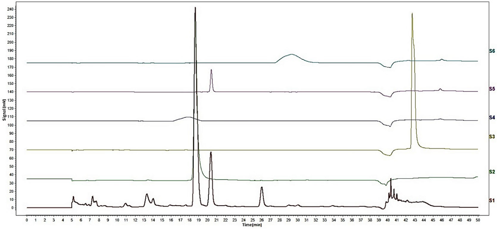
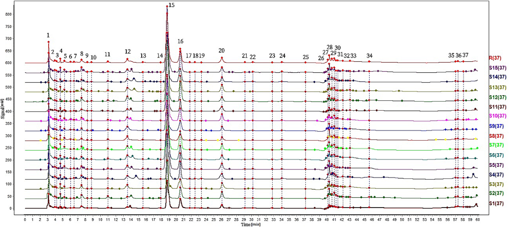
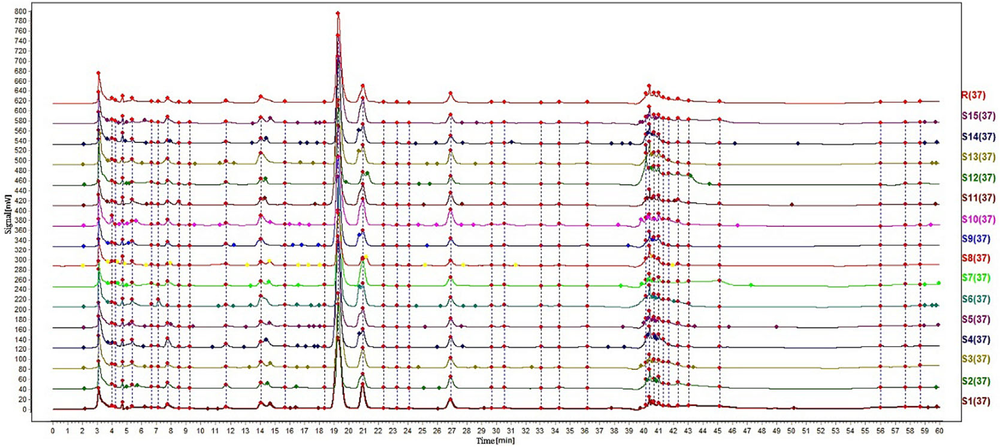
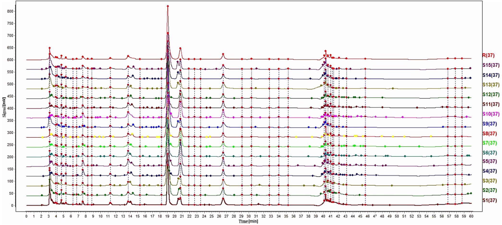
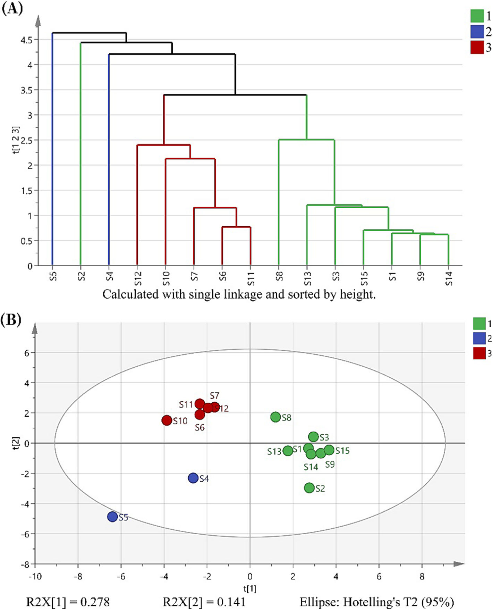
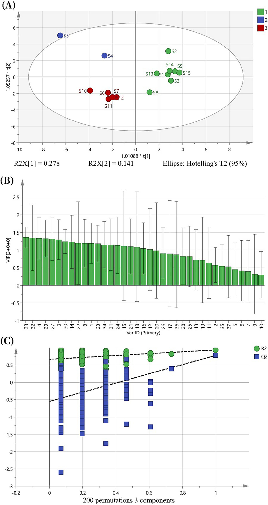

<!--
Ma et al., Phytochemical Analysis 2024;35:873-888 の全訳密度日本語版。
漢方方剤の抽出最適化・品質管理の実験論文。practitioner レベル。
表1-6（直交表・成分同定・移行効率）は全数値を表で保持。図Fig.1-6（HPLC指紋・HCA/PCA・OPLS-DA）を本文に埋め込み。
-->

## 書誌情報

- 標題（原題）: Optimization of the Zhou Tian Formula extraction technology based on AHP-CRITIC method and analysis of transfer efficiency of key components based on HPLC fingerprinting
- 著者: Yi-feng Ma, Yang Feng, Li-li Yao, Pei-shi Feng, Wei-kang Zhou, Le-xuan Fang, Yi Tao, Ping Wang（責任著者）
- 所属: 浙江工業大学 薬学院（中国・杭州）／浙江省TCM革新R&D・デジタルインテリジェント製造重点実験室
- 掲載誌・巻号・DOI: Phytochemical Analysis, 2024;35(4):873–888. DOI: 10.1002/pca.3334
- インパクトファクター: 2.9（Phytochemical Analysis, JCR 2024 / Clarivate。Q2）
- 受理経過: 2023年11月23日受領／2024年1月19日改訂／1月20日受理。© 2024 John Wiley & Sons Ltd
- 資金: 浙江省「リーディンググース」R&Dプログラム／金華市科技計画プロジェクト
- データ公開: 責任著者へ要請で提供

> 補足: 周天方（Zhou Tian Formula, ZTF）は臨床で広く使われる抗うつ作用の伝統中医薬（TCM）方剤で、10味の生薬（炒黄耆・葛根・熟地黄・沙苑子・当帰・炒白朮・柴胡・柏子仁・升麻・桂枝）から成る。本論文は、この10味方剤の「抽出条件の最適化」と「煎じ液→エキス末→顆粒という製造3工程での成分の残り方（移行効率）」を定量的に追跡し、品質管理の枠組みを作った研究。日本の漢方エキス製剤（煎液を濃縮乾燥して顆粒化する）の製造工程管理にも通じる内容で、本文にツムラ（Tsumura And Co.）からのダウンロード記録がある。

## 要旨（Abstract）

**序論**: 周天方（ZTF）はうつ病患者の治療に臨床で広く使われる抗うつTCMである。しかし、その抽出技術と品質管理には依然として不足がある。

**目的**: 本研究は、階層分析法（AHP）–基準間相関による基準重要度（CRITIC）法に基づくZTF抽出技術の方法論を提案し、指標成分の効率的移行のための品質管理枠組みを確立することを目的とした。

**方法**: まずZTFの化学成分を分析し最適抽出技術を決定。次に、水煎液からエキス末へ、続いて顆粒への変換における指標成分の移行効率を計算。第三に、15バッチのZTF水煎液・エキス末・顆粒のHPLC指紋を確立。SIMCAソフトで異なるバッチのZTF顆粒の品質変動に責任を持つ化学物質を解析した。

**結果**: 最適抽出プロセスを決定した。水煎液→エキス末→顆粒の変換における、フェルラ酸・プエラリン・ミリフィシン・イソフェルラ酸・カリコシンの平均移行効率は41%を超えた。ZTFのHPLC指紋は0.890を超える類似度を示した。VIP値は、カリコシン・フェルラ酸・プエラリンが品質変動の主要寄与因子であることを示した。

**結論**: AHP-CRITIC法を直交配列設計と組み合わせて抽出技術の探索に使える。加えて、水煎液→エキス末→顆粒への指標成分移行を統べる法則は、ZTFの評価と品質評価に適用できる。

**キーワード**: AHP-CRITIC、HPLC指紋、品質管理と品質保証、伝統中医薬方剤、移行効率

## 1. 序論（Introduction）

うつ病は、低い気分・認知機能障害・発話と運動活動の減少といった症状を特徴とする精神疾患である。個人の生活・生産性に大きく影響し、家族・社会に相当な負担を課す。世界で約3億人がうつ病に苦しみ、最新の世界疾病負担研究によれば、うつ病は世界の全障害調整生存年数（DALY）の1.85%に寄与した。しかし多くの既存抗うつ薬は、低い寛解率・高い再発率・頭痛・胃腸障害・体重増加といった潜在的副作用などの欠点を示す。したがって、副作用が少なくより安全で効果的な抗うつ薬の開発が共通の願望である。この文脈で、補完代替医療と伝統中医薬（TCM）がうつ病の治療・予防の潜在的戦略として注目を集めている。顕著な例が漢方処方「逍遥散」で、広範な基礎科学実験と臨床研究を通じて抗うつ・抗不安効果を示している。TCM方剤は、複数成分を含み・様々な側面を標的とし・複数の効果を生み・副作用が少ないという利点を、複雑疾患の治療で提供する。

周天方（ZTF）は、肝関連問題の緩和とうつの軽減、肝脾機能の調和、臓器の虚の補充を含む複数機能を持つ。ZTFは10味の生薬から成る: 炒黄耆・葛根・熟地黄・沙苑子・当帰・炒白朮・柴胡・柏子仁・升麻・桂枝。TCM原理によれば、ZTFはこれら生薬の作用を次のように組み合わせる: 炒黄耆は肺の気（気は体内を出入りし生命活動の促進・調節に役立つ微細な物質）を強め、柏子仁は心の気を高め、炒白朮は脾の気を高め、当帰は肝血を養い、沙苑子は腎陽（主に温め気化を促す）を補い、熟地黄は腎陰（主に体を養う）を補う。これら6味が臓器の虚に対処する。加えて、葛根と柴胡が肝の気を上げ、升麻と桂枝がそれぞれ肺と心の気を上げる。これら4味が臓器の気を相乗的に上げる。TCM原理に従ったこれら生薬の賢明な組み合わせで、ZTFは臓器の気を高め、抗うつ効果を最適化する。現代薬理学研究は、ZTFの様々なTCM成分が抗うつ効果を示すことを明らかにした: 炒黄耆のアストラガロシドIV・黄耆多糖、葛根のプエラリン、当帰のフェルラ酸、柴胡のサイコサポニンなど。これらは炎症反応の調節・細胞アポトーシスの低減・活性酸素種生成の調節・うつ関連経路でのAKT1（プロテインキナーゼB）・FOS（AP-1転写因子サブユニット）タンパク質発現の増加・腸内細菌叢組成への影響を示し、抗うつ効果を発揮する。

本研究では、TCM方剤の新規品質管理システムを確立し、バッチ間変動に寄与する主要物質を同定した。この方法はTCM成分の品質の動的監視を可能にし、用いる工程の適切性を保証する。ZTFを起点に、TCM成分の包括的品質管理システムを確立した。TCM成分の品質管理は、水煎液の品質または最終製品のいずれかを重視して広く研究されてきたが、中間体から最終製品までの全工程を研究した研究者は少ない。ここでは水煎液・エキス末・顆粒を研究し、水煎液→エキス末→顆粒の変換における移行品質を統べる原理の探索を目的とした。エキス末は水煎液を凍結乾燥で乾燥濃縮したものである。調製過程の3状態にわたる指標成分の移行効率を評価することで、医薬品中間体の品質管理領域の研究ギャップに貢献した。水煎液・顆粒の個別評価と比べ、本アプローチはより系統的な品質評価を可能にし、調製過程全体で大きな時間・資源の節約をもたらす。ただし、本論文の抽出技術・品質管理法は実験室環境でのみ行われ、実際の工場生産とは規模が異なる。大規模生産の温度・時間・空気条件が結果に影響しうるため、大規模生産の実現可能性は慎重に検討する必要がある。それでも本研究は、ZTFの大規模生産・商業化の堅牢な基盤を築き、大規模生産の抽出技術・品質管理の指針を提供する。

## 2. 実験（Experimental）

### 2.1 装置と材料

HPLC（Wu Feng Instruments）、UPLC-Q-TOF-MS（SCIEX X500R）、Shim-pack VP-ODS逆相C18カラム（Shimadzu）、電子天秤・超音波洗浄機・高速冷凍遠心機・ロータリーエバポレーター・凍結乾燥機を使用。

標準品（フェルラ酸・プエラリン・ミリフィシン・イソフェルラ酸・カリコシン、いずれも純度≥98%）は上海源葉生物から購入。HPLCグレードのメタノール・アセトニトリルはMacklin、超純水はWahaha。全生薬は薬局から購入し、Wang Ping教授（浙江工業大学中薬研究所副所長）が中国薬典2020年版第1部の規格に適合すると検証。黄耆は Astragalus membranaceus var. mongholicus の乾燥根の加工品、葛根は Pueraria lobata の乾燥根、沙苑子は Astragalus complanatus の乾燥成熟種子、熟地黄は Rehmannia glutinosa の乾燥根の加工品、当帰は Angelica sinensis の乾燥根、白朮は Atractylodes macrocephala の乾燥根茎の加工品、柴胡は Bupleurum chinense の乾燥根、柏子仁は Platycladus orientalis の乾燥成熟核、升麻は Cimicifuga heracleifolia または C. dahurica の乾燥根の加工品、桂枝は Cinnamomum cassia の乾燥新芽。

### 2.2 試験溶液・標準溶液の調製

**2.2.1 初期水煎液**: 炒黄耆30.00 g・葛根15.00 g・熟地黄15.00 g・沙苑子15.00 g・当帰12.00 g・炒白朮12.00 g・柏子仁10.00 g・柴胡10.00 g・升麻5.00 g・桂枝5.00 g をビーカーで1時間浸漬。陶製鍋に移し10倍量の水を加え、強火で沸騰後とろ火で45分煎じる。80℃に冷却後、二層の300メッシュ篩で濾過。2回繰り返して濾液を合わせ、水で3000 mLに調整してZTF初期水煎液を得た。

**2.2.2 標準溶液**: フェルラ酸・プエラリン・ミリフィシン・イソフェルラ酸・カリコシンを50%メタノールに溶解し10 mLに定容（濃度それぞれ0.32, 1.23, 1.13, 0.19, 0.017 mg/mL）。4℃保存、分析前に0.22 μmナイロン膜で濾過。

**2.2.3 試験溶液**: (1) 個別生薬: 各生薬15 gを100 mL脱イオン水に60分浸漬、150 mLに調整、陶製鍋で沸騰後40分とろ火、80℃冷却後300メッシュ濾過を2回、300 mLに定容、0.22 μm濾過。(2) ZTF水煎液: 2 mLを0.22 μm濾過。(3) ZTFエキス末: 水煎液をロータリーエバポレーションし凍結乾燥してエキス末を得る。0.050 gを10 mL純水に加え密封して20分超音波、重量補償後10,000 rpmで5分遠心、上清を0.22 μm濾過。(4) ZTF顆粒: 顆粒0.100 gを10 mL純水に加え同様に処理。

### 2.3 HPLC・UPLC-Q-TOF-MS分析

HPLC条件: Shim-pack VP-ODS C18（5 μm, 4.6×250 mm）、移動相アセトニトリル（A）・超純水（B）、勾配: 0–5分 10.5%A；5–10分 10.5→14%A；10–33分 14→18%A；33–35分 18→43%A；35–48分 43→45%A；48–55分 45→90%A；55–60分 90→10.5%A。検出波長240 nm、注入量10 μL、流速0.8 mL/min、カラム温度30℃。UPLC-Q-TOF-MS（SCIEX X500R、ESI、MQ4アルゴリズム）で保持時間・MS2データを文献と比較し成分同定。

### 2.4 ZTF5成分の定量

**2.4.1 HPLC条件**: 上記と同じ（定量用に Wu Feng システムを使用）。

**2.4.2 方法バリデーション**: 7濃度で検量線（y=ax+b）を作成。精度（6連続注入）、安定性（0, 1, 2, 4, 8, 12, 18, 24時間）、再現性（同一手順6反復）、回収率（既知量添加）。プエラリン（ピーク15）を参照ピークとし、共通ピークの相対保持時間（RRT）・相対ピーク面積（RPA）のRSDを算出。

### 2.5 最適抽出プロセスの決定

**2.5.1 重み係数の計算**: AHP（階層分析法）は影響因子の重みの定量分析法。CRITIC（基準間相関による基準重要度）法は、対比強度と対立に基づいて評価指標の重み係数を計算し、標準偏差の計算でこれらを定量化する客観的手法。AHP-CRITIC法で各指標成分の重み係数を決定し科学的妥当性を確保。統合指標重み係数 WAHP-CRITIC-ij を次式で計算:

$$W_{AHP\text{-}CRITIC\text{-}ij} = \frac{W_{AHP\text{-}ij} \times W_{CRITIC\text{-}ij}}{\sum W_{AHP\text{-}ij} \times W_{CRITIC\text{-}ij}}$$

**2.5.2 AHP-CRITIC法による最適抽出決定**: L9(3⁴)直交実験を実施。指標成分（プエラリン・ミリフィシン・フェルラ酸・イソフェルラ酸・カリコシン）と水煎液の乾燥エキス率（原生薬総重量に対する乾燥エキス末の割合）を性能指標とした。3因子を調査: 加水量（溶媒体積/材料重量比, 因子A）、抽出時間（因子B）、抽出回数（因子C）。

**Table 1. 直交設計の因子と水準**

| 水準 | A（加水量, 倍） | B（抽出時間, 分） | C（抽出回数） |
|---|---|---|---|
| 1 | 8 | 40 | 1 |
| 2 | 10 | 45 | 2 |
| 3 | 12 | 50 | 3 |

### 2.6 3状態（煎液・エキス末・顆粒）にわたる移行則の確立

最適抽出後、水煎液をロータリーエバポレーション・凍結乾燥して乾燥エキス末を得た。顆粒は次のように調製: 乾燥エキス末・スクロース・デンプンを5:3:3で配合、混合し、90%エタノール（エキス末＋賦形剤の15%）を湿潤剤として添加。十分混合後14メッシュ篩過、60℃で4時間乾燥。TCM色譜指紋類似度評価システム（2012年版）で15バッチのZTFの類似度を評価。フェルラ酸・プエラリン・ミリフィシン・イソフェルラ酸・カリコシンを指標成分に選択し、15バッチの煎液・エキス末・顆粒での含量を測定、各変換での定量移行パターンを調査。

### 2.7 HPLC指紋の確立とデータ解析

10生薬各5バッチを異なる地域・バッチから収集し乱数表法でランダム組み合わせ。15バッチの煎液・エキス末のHPLC指紋を生成し類似度評価。顆粒も同様に指紋化し、HCA・PCA・OPLS-DAで化学解析。ソフト: TCM色譜指紋類似度評価システム2012、SPSS 26.0（直交実験）、SIMCA 14.1（HCA/PCA/OPLS-DA）。

## 3. 結果と考察（Results and Discussion）

### 3.1 UPLC-Q-TOF-MSによるZTF成分同定

UPLC-Q-TOF-MS/MSと文献データでZTFの化学組成を系統解析。**35化合物を同定**（Table 2）。標準品比較で5指標成分（フェルラ酸・プエラリン・ミリフィシン・イソフェルラ酸・カリコシン）を同定。

**Table 2. UPLC-Q-TOF-MS/MSで同定したZTFの化学成分（抜粋）**

| No. | 保持時間 | 分子式 | 質量誤差(ppm) | 成分名 |
|---|---|---|---|---|
| 5 | 3.14 | C6H12O6 | 2.6 | グルコース |
| 10 | 15.02 | C9H8O4 | 2.3 | カフェ酸 |
| 11 | 15.58 | C16H18O9 | 0.3 | クロロゲン酸 |
| 13 | 16.48 | C21H20O10 | 1.4 | 3'-ヒドロキシプエラリン |
| 14 | 17.51 | C26H28O13 | 3 | ミリフィシン |
| 16 | 17.76 | C21H20O9 | 3 | プエラリン |
| 17 | 18.22 | C22H22O10 | 1.4 | カリコシングルコシド |
| 20/21 | 18.91 | C10H10O4 | 1.5 | フェルラ酸／イソフェルラ酸 |
| 23 | 20.41 | C15H10O4 | 0.5 | ダイゼイン |
| 27 | 40.15 | C16H12O5 | 0.5 | カリコシン |
| 30 | 45.26 | C48H78O17 | 4.4 | サイコサポニンc |
| 31 | 48.26 | C43H70O15 | 0.9 | アストラガロシド |
| 33 | 52.97 | C15H20O3 | 0.1 | アトラクチレノリド |

### 3.2 5指標成分の方法論的検討

最小二乗回帰による直線性評価（Table 3）。相関係数は0.9991超で、比較的広い濃度範囲で濃度とピーク面積の堅牢な相関。精度・安定性・再現性のRSDは全て2.0%未満。平均回収率91.31–98.89%、RSD<2.0%。

**Table 3. ZTF指標成分の方法論的検討**

| 指標成分 | 回帰式 | 直線範囲（μg/mL） | R² | 平均回収率(%) |
|---|---|---|---|---|
| フェルラ酸 | y=3.2074x−5.6272 | 2.512–160.768 | 0.9991 | 91.31 |
| プエラリン | y=55.931x−162.03 | 9.620–615.680 | 0.9997 | 98.89 |
| ミリフィシン | y=2.9786x−1.2354 | 8.800–563.200 | 0.9995 | 94.26 |
| イソフェルラ酸 | y=6.9005x−7.1904 | 1.4933–95.5712 | 0.9997 | 91.93 |
| カリコシン | y=52.579x−2.6694 | 0.1402–8.9728 | 0.9997 | 93.64 |

### 3.3 最適抽出プロセスの決定

**3.3.1 AHP**: 指標を6段階に分類し優先順位を設定: プエラリン > ミリフィシン > 乾燥エキス率 > フェルラ酸 > イソフェルラ酸 > カリコシン。基本重み係数: プエラリン(1.000)・ミリフィシン(0.500)・乾燥エキス率(0.333)・フェルラ酸(0.250)・イソフェルラ酸(0.200)・カリコシン(0.167)。

**3.3.2 CRITIC重み付け**: 正規化後SPSSで解析。CRITIC重み係数: プエラリン0.1063・ミリフィシン0.1121・乾燥エキス率0.2290・フェルラ酸0.1989・イソフェルラ酸0.2444・カリコシン0.1092。

**3.3.3 AHP-CRITIC混合重み付け**: AHPは主観的評価（TCM成分の有効性・乾燥エキス率の重要性）で重みを決定、CRITICは指標の内部変化で重みを割り当てる。最終AHP-CRITIC重み係数: プエラリン0.3042・ミリフィシン0.1603・乾燥エキス率0.1866・フェルラ酸0.1423・イソフェルラ酸0.0902・カリコシン0.1165。

**3.3.4 総合評価の結果**: 3手法（AHP/CRITIC/AHP-CRITIC）の総合スコアのPearson相関: AHP vs CRITIC=0.997、AHP vs AHP-CRITIC=1、CRITIC vs AHP-CRITIC=0.998（P<0.01で有意）で3手法の結果が一致。ただし重み係数自体はAHPとCRITICで−0.524の負相関（非有意）で、両手法の情報は累積的でない。主観的・客観的評価の両面で、AHP-CRITIC混合法が個別法より優れた科学的厳密性・合理性・安定性を示した。

**3.3.5 AHP-CRITICに基づく直交試験結果**: 混合重み係数で総合スコアを算出（Table 4）。因子CがA・Bより有意な影響。分散分析では統計的有意差はないものの影響順は **C > A > B**。抽出法 **A2B1C3（固液比1:10・抽出時間40分・抽出3回）** を選択。検証で信頼性・再現性を確認。

**Table 4. L9(3⁴)直交実験結果**

| No. | A | B | C | 総合スコア |
|---|---|---|---|---|
| 1 | 1 | 1 | 1 | 49.83 |
| 2 | 1 | 2 | 3 | 79.29 |
| 3 | 1 | 3 | 2 | 61.71 |
| 4 | 2 | 1 | 3 | 99.69 |
| 5 | 2 | 2 | 2 | 81.05 |
| 6 | 2 | 3 | 1 | 52.70 |
| 7 | 3 | 1 | 2 | 82.51 |
| 8 | 3 | 2 | 1 | 24.16 |
| 9 | 3 | 3 | 3 | 52.65 |
| R（範囲） | 24.706 | 21.658 | 34.982 | — |

（k値: 因子A: k1=63.609, k2=77.814, k3=53.108／因子C: k1=42.228, k2=75.092, k3=77.211。Cの範囲Rが最大＝最も影響）

### 3.4 3工程での指標成分の移行効率

**煎液→エキス末**（Table 5）: 平均移行効率 フェルラ酸45.33%・プエラリン79.79%・ミリフィシン68.60%・イソフェルラ酸46.67%・カリコシン41.85%。プエラリン・ミリフィシンが高く、カリコシンが最低。5成分平均56.45%。良好な移行効率で濃縮・乾燥工程の妥当性を検証。ただし一部バッチでフェルラ酸・ミリフィシン・イソフェルラ酸・カリコシンが平均範囲70–130%を超え、この変換がエキス末品質に影響しうる。

**エキス末→顆粒**（Table 6）: 平均移行効率 フェルラ酸58.55%・プエラリン80.83%・ミリフィシン70.27%・イソフェルラ酸59.18%・カリコシン54.45%。プエラリンが最高、カリコシンが最低。5成分平均64.66%で煎液→エキス末より高い。全体に満足で工程の信頼性を裏付け。

移行効率の変動要因を2つ推測: (1) 異なる産地・バッチのTCM自体の品質変動、(2) 黄耆に多く含まれる多糖が濃縮・乾燥中に溶液粘度を上げ組成の不均一分布を招く。指標成分の移行効率を定量化することで、既存調製法を効率的に通過するかを評価し、方法の長所・短所を同定できる。

### 3.5 煎液・エキス末のHPLC指紋類似度

**3.5.1 方法バリデーション**: 精度・再現性・安定性のRRT・RPAのRSDは全て2.0%未満で、HPLC指紋法の安定性・信頼性を検証。

**3.5.2 類似度解析**: S8を参照スペクトル（メジアン法・時間窓0.1分）とし37共通ピークで対照指紋（R）を形成。15バッチの煎液の類似度は0.890–1.000。具体的類似度: 0.998, 0.982, 0.995, 0.890, 0.992, 0.998, 0.996, 0.976, 0.996, 0.998, 0.987, 0.995, 0.996, 0.994, 0.997。S4・S8が他より低い類似度で、バッチ211201の炒黄耆を共有したことによる品質低下の可能性。エキス末の類似度は0.908超（0.908–0.995）。

### 3.6 顆粒のHPLC指紋

15バッチの顆粒の類似度は0.929超（0.929–0.994）。煎液・エキス末より高く、バッチ間変動の減少を示唆。

**3.6.1 HCAとPCA**: 37共通ピークでHCA・PCA。HCA（単連結法）で5カテゴリーに分類: ①S1,S3,S8,S9,S13-S15；②S6,S7,S10-S12；③S2；④S4；⑤S5。PCAは3カテゴリーに分類（S2を除きHCAと一致）。カテゴリー1は共通ピーク面積が高くカテゴリー2は低い、S4・S5は最高でHCAとの分類差の要因。両者は概ね一致し相互確認。

**3.6.2 OPLS-DA**: 37共通ピークでOPLS-DA。15バッチは3カテゴリーに分類（HCAと一致）。VIP>1を差異成分の基準とし20成分を同定。上位3ピーク: ピーク33（VIP=1.359）・ピーク32（VIP=1.348）・ピーク4（VIP=1.339）。指標成分では ピーク32=カリコシン（1.348）・ピーク14=フェルラ酸（1.236）・ピーク15=プエラリン（1.118）・ピーク21=イソフェルラ酸（1.106）・ピーク16=ミリフィシン（1.052）。顆粒中の平均含量: カリコシン0.79・フェルラ酸4.50・プエラリン53.63・イソフェルラ酸5.16・ミリフィシン204.11 μg/mL。プエラリン・ミリフィシンのピーク面積が最大で品質管理上の重要性を示す。カリコシンは黄耆の成分、プエラリン・ミリフィシンは葛根の重要成分——**炒黄耆と葛根の厳格な品質管理がZTF顆粒の安定に必要**。

モデル適合性（R²・Q²とも>0.5が許容）: 200回並べ替え検定でQ²回帰線と縦軸の交点が0未満。R²X=0.509、R²Y=0.891、Q²=0.541で過学習なし。15バッチの類似度差は主にカリコシン・フェルラ酸・プエラリンの存在による。

## 参考文献

1. Herrman H, Kieling C, McGorry P, Horton R, Sargent J, Patel V. Reducing the global burden of depression: a lancet-world psychiatric association commission. Lancet. 2019;393(10189):e42-e43. doi:10. 1016/S0140-6736(18)32408-5

2. G.M.D. Collaborators. Global, regional, and national burden of 12 mental disorders in 204 countries and territories, 1990-2019: a systematic analysis for the global burden of disease study

3. Guo YX, Chen XF, Gong P, et al. Advances in the mechanisms of polysaccharides in alleviating depression and its complications. Phytomedicine. 2023;109:154566. doi:10.1016/j.phymed.2022.154566

4. Drevets WC, Wittenberg GM, Bullmore ET, Manji HK. Immune targets for therapeutic development in depression: towards precision medicine. Nat Rev Drug Discov. 2022;21(3):224-244. doi:10.1038/ s41573-021-00368-1

5. Marwaha S, Palmer E, Suppes T, Cons E, Young AH, Upthegrove R. Novel and emerging treatments for major depression. Lancet. 2023; 401(10371):141-153. doi:10.1016/S0140-6736(22)02080-3

6. Wang YT, Wang XL, Wang ZZ, Lei L, Hu D, Zhang Y. Antidepressant effects of the traditional Chinese herbal formula Xiao-Yao-San and its bioactive ingredients. Phytomedicine. 2023;109:154558. doi:10.1016/ j.phymed.2022.154558 MA ET AL. 887 10991565, 2024, 4, Downloaded from https://analyticalsciencejournals.onlinelibrary.wiley.com/doi/10.1002/pca.3334 by Tsumura And Co., Wiley Online Library on [07/07/2026]. See the Terms and Conditions (https://onlinelibrary.wiley.com/terms-and-conditions) on Wiley Online Library for rules of use; OA articles are governed by the applicable Creative Commons License

7. Yuan NJ, Gong L, Tang KR, et al. An integrated pharmacology-based analysis for antidepressant mechanism of Chinese herbal formula Xiao-Yao-San. Front Pharmacol. 2020;11:284. doi:10.3389/fphar. 2020.00284

8. Chen P, Zhang J, Wang C, et al. The pathogenesis and treatment mechanism of Parkinson's disease from the perspective of traditional Chinese medicine. Phytomedicine. 2022;100:154044. doi:10.1016/j. phymed.2022.154044

9. Hao YW, Li JX, Dan LJ, et al. Chinese medicine as a therapeutic option for pulmonary fibrosis: clinical efficacies and underlying mechanisms. J Ethnopharmacol. 2024;318(Pt A):116836. doi:10.1016/j.jep.2023. 116836

10. Yuan S, Wang Q, Li J, et al. Inflammatory bowel disease: an overview of Chinese herbal medicine formula-based treatment. Chin Med-UK. 2022;17(1):74. doi:10.1186/s13020-022-00633-4

11. Abd Elkader HTA, Abdou HM, Khamiss OA, Essawy AE. Anti-anxiety and antidepressant-like effects of astragaloside IV and saponins extracted from Astragalus spinosus against the bisphenol A-induced motor and cognitive impairments in a postnatal rat model of schizophrenia. Environ Sci Pollut R. 2021;28(26):35171-35187. doi:10.1007/ s11356-021-12927-5

12. Song MT, Ruan J, Zhang RY, Deng J, Ma ZQ, Ma SP. Astragaloside IV ameliorates neuroinflammation-induced depressive-like behaviors in mice via the PPARy/NF-kappa B/NLRP3 inflammasome axis. Acta Pharmacol Sin. 2018;39(10):1559-1570. doi:10.1038/aps.2017.208

13. Li CD, Wang Y, Qu JR, et al. Astragalus polysaccharide inhibits lipopolysaccharide-induced depressive-like behaviors and inflammatory response through regulating NF-kappa B and MAPK signaling pathways in rats, Int. J Clin Exp Med. 2018;11:2361-2370.

14. Wang GZ, Luo P, Zhang S, et al. Screening and identification of antidepressant active ingredients from Puerariae Radix extract and study on its mechanism. Oxid Med Cell Longev. 2021;2021:2230195. doi:10. 1155/2021/2230195

15. Cheng J, Chen M, Zhu JX, et al. FGF-2 signaling activation in the hippocampus contributes to the behavioral and cellular responses to puerarin. Biochem Pharmacol. 2019;168:91-99. doi:10.1016/j.bcp. 2019.06.025

16. Dong XY, Zhao DX. Ferulic acid as a therapeutic agent in depression: evidence from preclinical studies. CNS Neurosci Ther. 2023;29(9): 2397-2412. doi:10.1111/cns.14265

17. Wu S, Li HM, Bing YF, et al. Bupleurum scorzonerifolium: systematic research through pharmacodynamics and serum pharmacochemistry on screening antidepressant Q-markers for quality control. J Pharmaceut Biomed. 2023;225:115202. doi:10.1016/j.jpba.2022.115202

18. Bao HW, Yang HL, Li JZ, Xu Y, Huang XW. Establishment and development of a quality evaluation method for Sangbaipi Decoction. J AOAC Int. 2022;105(2):558-566. doi:10.1093/jaoacint/qsab065

19. Zhao HL, Liu RZ, Ding M, et al. Determination of 44 major components and chemical profiling of saccharide in Chinese medicinal formula Lanqin oral liquid. Phytochem Anal. 2023;34(5):560-570. doi:10. 1002/pca.3236

20. Rodríguez-Martín NM, Márquez-Lopez JC, Cerrillo I, et al. Production of chickpea protein hydrolysate at laboratory and pilot plant scales: optimization using principal component analysis based on antioxidant activities. Food Chem. 2024;437(Pt 1):437. doi:10.1016/j.foodchem. 2023.137707

21. Escobar-Avello D, Mardones C, Saéz V, et al. Pilot-plant scale extraction of phenolic compounds from grape canes: comprehensive characterization by LC-ESI-LTQ-Orbitrap-MS. Food Res Int. 2021; 143:110265. doi:10.1016/j.foodres.2021.110265

22. Akram M, Zahid S, Deveci M. Enhanced CRITIC-REGIME method for decision making based on Pythagorean fuzzy rough number. Expert Syst Appl. 2024;238:122014. doi:10.1016/j.eswa.2023.122014

23. Wang PP, Wang Z, Zhang ZP, et al. A review of the botany, phytochemistry, traditional uses, pharmacology, toxicology, and quality control of the Astragalus memeranaceus. Front Pharmacol. 2023;14:

24. Sojin K, Kim MG, Boo K-H, Kim J-H, Kim CS. Anti-inflammatory effects of immature Citrus unshiu fruit extracts via suppression of NF-κB and MAPK signal pathways in LPS-induced RAW264.7 macrophage cells. Food Sci Biotechnol.

25. Maciejewska-Turska M, Pecio L, Zgorka G. Isolation of Mirificin and other bioactive isoflavone glycosides from the kudzu root lyophilisate using centrifugal partition and flash chromatographic techniques. Molecules. 2022;27(19):27. doi:10.3390/molecules27196227

26. Wang YP, Wang ZX, Zhang JJ, et al. Evaluation of the quality of Codonopsis Radix in different growth years by the AHP-CRITIC method. Chem Biodivers. 2023;20(6):e202201108. doi:10.1002/cbdv. 202201108

27. Jiang YL, Xu ZJ, Cao YF, et al. HPLC fingerprinting-based multivariate analysis of chemical components in Tetrastigma Hemsleyanum Diels et Gilg: correlation to their antioxidant and neuraminidase inhibition activities. J Pharmaceut Biomed. 2021;205:114314. doi:10.1016/j. jpba.2021.114314

28. Batool K, Zhao ZY, Nureen N, Irfan M. Assessing and prioritizing biogas barriers to alleviate energy poverty in Pakistan: an integrated AHP and G-TOPSIS model. Environ Sci Pollut R. 2023;30(41):9466994693. doi:10.1007/s11356-023-28767-4

29. Zhang PH, Chen LM, Wang XX, et al. Simultaneous determination of night effective constituents and correlation analysis of multiconstituents and antiplatelet aggregation bioactivity in vitro in chuanxiong Rhizoma subjected to different decoction times. J Anal Methods Chem. 2019;2019:8970624. doi:10.1155/2019/8970624

30. Liu XX, Chen ZJ, Wang X, Luo WR, Yang FD. Quality assessment and classification of Codonopsis Radix based on fingerprints and chemometrics. Molecules. 2023;28(13):5127. doi:10.3390/ molecules28135127

31. You JL, Li HQ, Wang Q, et al. Establishment of male and female Eucommia fingerprints by UPLC combined with OPLS-DA model and its application. Chem Biodivers. 2023;20(3):e202201054. doi:10. 1002/cbdv.202201054

32. Tang D, He B, Zheng ZG, et al. Inhibitory effects of two major isoflavonoids in radix astragali on high glucose-induced mesangial cells proliferation and AGEs-induced endothelial cells apoptosis. Planta Med. 2011;77:729-732. doi:10.1055/s-0030-1250628

33. Yun J, Cui CJ, Zhang SH, et al. Use of headspace GC/MS combined with chemometric analysis to identify the geographic origins of black tea. Food Chem. 2021;360:130033. doi:10.1016/j.foodchem.2021.130033

34. Triba MN, Le Moyec L, Amathieu R, et al. PLS/OPLS models in metabolomics: the impact of permutation of dataset rows on the K-fold cross-validation quality parameters. Mol Biosyst. 2015;11:13-19. doi: 10.1039/c4mb00414k

35. Zhang MA, Chen KX, Wang P, Zhang LQ, Li YM. Comprehensive quality evaluation of processed Scrophulariae radix from different regions of China using HPLC coupled with chemometrics methods. Phytochem Anal. 2023;34(7):816-829. doi:10.1002/pca.3209 SUPPORTING INFORMATION Additional supporting information can be found online in the Supporting Information section at the end of this article. How to cite this article: Ma Y, Feng Y, Yao L, et al. Optimization of the Zhou Tian Formula extraction technology based on AHP-CRITIC method and analysis of transfer efficiency of key components based on HPLC fingerprinting. Phytochemical Analysis. 2024;35(4):873‐888. doi:10.1002/pca. 3334 888 MA ET AL. 10991565, 2024, 4, Downloaded from https://analyticalsciencejournals.onlinelibrary.wiley.com/doi/10.1002/pca.3334 by Tsumura And Co., Wiley Online Library on [07/07/2026]. See the Terms and Conditions (https://onlinelibrary.wiley.com/terms-and-conditions) on Wiley Online Library for rules of use; OA articles are governed by the applicable Creative Commons License

## 訳者補足

- **周天方（ZTF）とは**: 10味の生薬から成る抗うつ漢方方剤。本論文はこの方剤を「①どう抽出すれば良いか（条件最適化）」「②煎じ液を濃縮・乾燥・顆粒化する各工程で有効成分がどれだけ残るか（移行効率）」の2点を定量的に追った品質管理研究。日本の漢方エキス製剤も同じ「煎液→濃縮乾燥→顆粒」という工程を踏むため、実務的に参考になる。

- **AHP-CRITIC法の意味**: 複数の指標成分（プエラリン・カリコシン等）を1つの総合スコアにまとめる際の「重み」を決める方法。**AHP＝人の判断（どの成分が薬効上重要か）で重みを決める主観的手法、CRITIC＝データのばらつき（どの指標が情報量を持つか）で決める客観的手法**。両者を掛け合わせて融合（AHP-CRITIC）することで、主観と客観のバランスを取る。本研究では両者が実は負相関（−0.524）＝別々の情報を持つと確認され、融合の意義が裏付けられた。本サイトのイチジク論文で使われた「エントロピー重み法」も同じ客観的重み付けの一種。

- **「移行効率」という発想の新規性**: 従来のTCM品質研究は「煎じ液」か「最終製品」のどちらかだけを見ることが多かった。本論文は中間体（エキス末）も含めた3状態を通して成分の残り方を追い、「どの工程で・どの成分が失われやすいか」を可視化した。結果、カリコシン（黄耆由来）が最も失われやすく（移行効率41.85%）、プエラリン（葛根由来）は残りやすい（79.79%）と分かった。多糖の多い黄耆が濃縮時に粘度を上げて不均一化する、という機序も示唆されている。

- **OPLS-DAが示したこと**: バッチ品質のばらつきの主因はカリコシン・フェルラ酸・プエラリン。これらは黄耆・当帰・葛根に由来するので、この3生薬（特に黄耆と葛根）の原料品質管理が方剤全体の安定の鍵、という実務的結論に落ちる。

- 図（Fig.1〜6）と補足表（Table S1〜S7）の詳細は原文参照。データは責任著者へ要請で入手可能。
