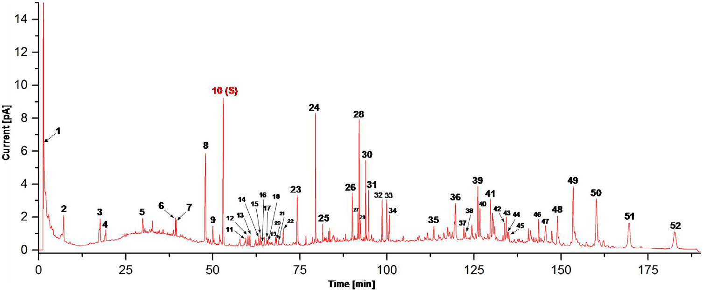
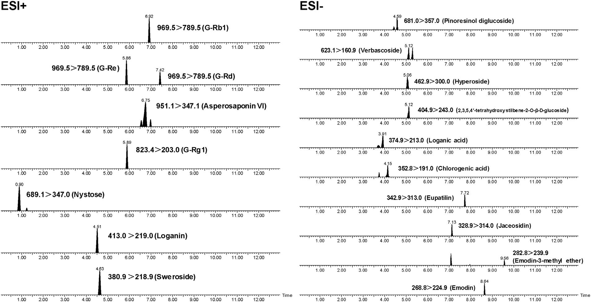

<!--
Cao et al., J. Pharm. Biomed. Anal. 191 (2020) 113570 の全訳密度日本語版。
中成薬の総合的品質評価（指紋＋同定＋定量）の実験論文。practitioner レベル。
表1（18分析種のMRM）・表3（バリデーション）・表4（含量）を保持。281成分表（Table A.1）は原文参照。図Fig.1-2（指紋・MRMクロマトグラム）を本文に埋め込み。付録図A.1-9は原文参照。
-->

## 書誌情報

- 標題（原題）: Development of a comprehensive method combining UHPLC-CAD fingerprint, multi-components quantitative analysis for quality evaluation of Zishen Yutai Pills: A step towards quality control of Chinese patent medicine
- 著者: Jiliang Cao, Ting Lei（共同筆頭）, Sijia Wu, Hongyi Li, Yun Deng, Ruizhen Lin, Na Ning, Chunxian Geng, Shengpeng Wang, Xu Wu（責任著者）, Peng Li（責任著者）, Yitao Wang
- 所属: マカオ大学 中医薬質量研究国家重点実験室／成都中医薬大学／広州白雲山中一薬業／西南医科大学ほか
- 掲載誌・巻号・DOI: Journal of Pharmaceutical and Biomedical Analysis, 191 (2020) 113570. DOI: 10.1016/j.jpba.2020.113570
- インパクトファクター: 3.1（J. Pharm. Biomed. Anal., JCR 2024 / Clarivate。Q2）
- 受理経過: 2020年6月24日受領／8月10日改訂／8月12日受理／8月23日オンライン公開。© 2020 Elsevier B.V.

> 補足: 滋腎育胎丸（Zishen Yutai Pills, ZYP）は、Luo Yuankai教授が創方した中成薬（中国の承認済み伝統薬）で、子宮内膜の受容性を高め習慣性流産の予防・切迫流産・黄体機能不全・卵巣機能不全の治療に使われる。**菟絲子・人参・続断・杜仲・桑寄生・巴戟天・鹿茸・党参・白朮・阿膠・枸杞子・地黄・何首烏・艾葉・砂仁の15生薬**から成る大型複方。本論文の要点は、こうした「成分が多く・性質もバラバラな複方」を、①指紋（CAD）②成分同定（高分解能MS）③定量（MS/MS）の3手法で立体的に品質評価した点。本文にツムラ（Tsumura And Co.）からのダウンロード記録がある。

## 要旨（Abstract）

滋腎育胎丸（ZYP）は、中国で習慣性流産の予防と切迫流産の治療に使われてきた著名な中成薬である。本研究では、超高速液体クロマトグラフィー–荷電化エアロゾル検出器（UHPLC-CAD）指紋分析と多成分定量分析を組み合わせた総合戦略を、ZYPの品質評価のために開発・検証した。

指紋分析では、計52の特徴ピークを選択して16バッチのZYPの類似度を評価した。加えて、化学指紋プロファイルを先進的なハイブリッドLTQ-Orbitrap質量分析計と組み合わせ、化学標準品・精密質量・フラグメント情報に基づいてZYPから281化合物を同定または推定同定した。さらに、正負イオン切替多重反応モニタリング（+/-MRM）技術を用いたUPLC-MS/MSにより、18の化学マーカーを13分以内で同時定量した。この方法は検証され、満足な感度・精度・再現性・正確性を示した。検証済み定量法は16バッチのZYP試料の分析に成功裏に適用された。UHPLC-CAD指紋と多成分定量の組み合わせは、ZYPの品質管理の効率的で信頼できる戦略であり、中成薬の品質評価の参照とみなせる。

**キーワード**: 化学指紋、多成分定量分析、化学特性評価、品質評価、滋腎育胎丸

## 1. 序論（Introduction）

滋腎育胎丸（ZYP）はLuo Yuankai教授が初めて紹介した著名な中成薬である。薬理研究と臨床実践は、ZYPが子宮内膜受容性を高め、習慣性流産を予防し、切迫流産・黄体期欠陥月経障害・卵巣機能不全を治療できることを示した。ZYPには15の生薬（CHM）が含まれる: 菟絲子（Cuscuta chinensis）・人参（Panax ginseng）・続断（Dipsacus asper）・杜仲（Eucommia ulmoides）・桑寄生（Taxillus chinensis）・巴戟天（Morinda officinalis）・鹿茸（Cervus nippon）・党参（Codonopsis pilosula）・白朮（Atractylodes macrocephala）・阿膠（Asini Corii Colla）・枸杞子（Lycium barbarum）・地黄（Rehmannia glutinosa）・何首烏（Polygonum multiflorum）・艾葉（Artemisia argyi）・砂仁（Amomum villosum）。

ZYPの複雑な組成のため、異なる植物起源・気候・加工条件などの因子がバッチ間の品質一貫性に大きく影響しうる。現在まで、その品質管理に適用された効率的な文書化された方法はない。したがってZYPの品質評価には信頼できる系統的品質基準が緊急に必要である。

知られる通り、生薬（CHM）の品質管理は通常、単一または限られた数の生物活性・特徴化合物の測定に焦点を当ててきた。CHM方剤は多成分・多標的の薬剤で、より全体論的に治療機能を発揮すると考えられる。したがってZYPの品質管理には、主要生物活性成分の測定だけでなく、CHM方剤の化学的完全性と特徴も考慮する、より包括的で全体的な戦略が必要である。

化学指紋はCHMの評価・品質管理の効果的技術で、複雑マトリックスの全体的化学特性評価を定量的信頼度で強調する。WHO・米国FDA・中国SFDAに採用され広く使われる。現在、クロマト指紋（特にHPLC/UHPLC指紋分析）はCHM方剤の化学プロファイル・品質評価に広く使われる。指紋情報は質量分析（MS/MSや高分解能MS）と組み合わせてさらに同定できる。

しかし主要な欠点として、化学指紋は試料と参照指紋の類似度しか提供できず、類似試料のクロマトグラム間の微小な差は正確に定量できない。したがって本研究では多成分定量分析を総合品質管理戦略の一部として考慮した。ZYPの複数生物活性成分の同時定量法はこれまで報告がない。本研究では、UHPLC-CAD指紋と、正負イオン切替MRM（+/-MRM）技術に基づく18化合物の同時定量を組み合わせた総合戦略を、中成薬ZYPの品質管理のために確立した。加えて、クロマト指紋プロファイルをハイブリッドLTQ-Orbitrap質量分析計と組み合わせ、ZYPから計281化合物を同定・推定同定した。

## 2. 材料と方法（Materials and methods）

### 2.1 化学薬品と材料

標準品（ロガン酸・ロガニン・クロロゲン酸・スウェロシド・ピノレシノールジグルコシド・ヒペロシド・2,3,5,4'-テトラヒドロキシスチルベン-2-O-β-D-グルコシド・ベルバスコシド・アストラガリン・ヤセオシジン・アスペロサポニンVI・オイパチリン・ナイストース・エモジン・エモジン-3-メチルエーテル・クリソファノール・β-カロテン・ジンセノシド(G)Rg1/Re/Rb1/Rc/Rb2/Rd）はMUST Biotechnologyから購入（純度98%超）。HPLCグレードのアセトニトリル・メタノール・ギ酸はMerck、超純水はMilli-Q。16バッチの市販ZYP（ロット番号違い、S1–S16）は広州白雲山中一薬業が提供。

### 2.2 試料前処理と標準溶液調製

粉末試料2 gをメタノール20 mLで超音波抽出（Branson 5510, 135W, 42kHz, 室温60分）。15,800×gで10分遠心し、上清をHPLCバイアルに移して指紋・定量分析に用いた。各標準品はメタノールにストック溶液として溶解し4℃保存、使用前に50%メタノールで希釈。

### 2.3 UHPLC-CAD指紋分析

Dionex UltiMate 3000 RS二元系高速分離システム（Thermo Fisher Scientific；SRD-3600デガッサー・HPG-3400RS二元ポンプ・WPS-3000TRSオートサンプラー・TCC-3000RSカラム恒温槽・Corona Veo RS荷電化エアロゾル検出器で構成）。Hypersil gold C18（150 mm×2.1 mm, 1.9 μm, Thermo Fisher）で分離。移動相0.1%ギ酸(A)・アセトニトリル(B)、勾配: 0–10分 5%B；10–20分 5–10%B；20–40分 10–25%B；40–60分 25–30%B；60–75分 30–40%B；75–90分 40–75%B；90–120分 75–90%B；120–140分 90–100%B；140–190分 100%B。流速0.4 mL/min。CADパラメータ: べき関数1.00、データ収集10 Hz、フィルタ5.0、蒸発温度35℃。カラム温度40℃、注入量4 μL。データ取得・処理はThermo Scientific Dionex Chromeleon 7.2 SR4ソフトウェアを使用。

### 2.4 LTQ-Orbitrap質量分析

定性分析にThermo Fisher LTQ-Orbitrap XL質量分析計（Thermo Fisher Scientific, Bremen, Germany；ESIソース）を指紋クロマト条件でUPLCに接続。正負両ESIモードで分析。イオンスプレー電圧5.0/−4.5 kV、キャピラリー温度380/380℃、キャピラリー電圧35/−35 V、チューブレンズ電圧110/−100 V（正/負イオンモード）。質量スペクトルm/z 100-1500。フルスキャン（Orbitrap分解能15,000, FWHM@m/z 400）＋6回のデータ依存取得（DDA）イベント。全スキャンで検出された最も強い2イオンからMSⁿ（n=2–4）をリニアイオントラップで取得（CID正規化衝突エネルギー35%、アイソレーション幅m/z 2.0）。化学的に複雑なZYPに対応するため動的排除を有効化（リピートカウント3、リピート持続時間8秒、除外リスト500件、除外持続時間8秒、除外質量幅m/z 6.0）し、低存在量の共溶出イオンも取り逃さないようにした。シース/オグジリアリガスは窒素（流量60/20 arbitrary units）、コリジョンガス（リニアイオントラップ）は高純度ヘリウム。Orbitrap質量分析計はメーカー指針に従い3日ごとに外部質量校正を実施し高い質量精度を維持。元素組成条件: 炭素≤90・水素≤150・酸素≤60・窒素なし、前駆質量許容10 ppm。定性MSデータの可視化・処理はXcalibur 2.1ソフトウェア、個々のピークのMSⁿスペクトルツリー抽出にはMass Frontier 7.0ソフトウェア（いずれもThermo Fisher Scientific, San Jose, CA, USA）を使用。

### 2.5 UPLC-MS/MS定量分析

ACQUITY™ I-Class UPLC＋Xevo TQD三連四重極型タンデム質量分析計（UPLC-QqQ-MS/MS, Waters Corp., Milford, MA, USA；正負イオンESI）。ACQUITY UPLC BEH C18（100 mm×2.1 mm, 1.7 μm, Waters）分析カラム＋ACQUITY BEH C18 VanGuardガードカラム（5 mm×2.1 mm, 1.7 μm, Waters）、カラム温度40℃。移動相0.1%ギ酸(A)・アセトニトリル(B)、流速0.3 mL/min、勾配: 0–1.5分 2%B；1.5–6分 2–40%B；6–9.5分 40–100%B；9.5–11.5分 100%B；11.5–11.6分 100–2%B；11.6–13分 2%B。注入量3 μL。キャピラリー電圧3.0/−2.5 kV（正/負イオンモード）。イオン源温度150℃、脱溶媒温度350℃、脱溶媒ガス流量650 L/h、コーンガス流量50 L/h（いずれも窒素）、コリジョンガスは高純度アルゴン。MRMモードで定量。機器制御・データ取得はMasslynx 4.2ソフトウェア（Waters Corp., Milford, MA, USA）を使用。

**Table 1. ZYP中18分析種のRT・イオンモード・MRM遷移・滞留時間(Dwell)・コーン電圧(CV)・衝突エネルギー(CE)（全18種）**

| No. | 分析種 | RT(分) | イオン | 遷移(m/z) | Dwell(ms) | CV(V) | CE(V) |
|---|---|---|---|---|---|---|---|
| 1 | ナイストース | 0.91 | + | 689.1→347.0 | 8 | 80 | 42 |
| 2 | ロガン酸 | 3.92 | − | 374.9→213.0 | 8 | 38 | 16 |
| 3 | クロロゲン酸 | 4.15 | − | 352.8→191.0 | 8 | 30 | 18 |
| 4 | ロガニン | 4.51 | + | 413.0→219.0 | 8 | 62 | 24 |
| 5 | ピノレシノールジグルコシド | 4.60 | − | 681.0→357.0 | 8 | 34 | 24 |
| 6 | スウェロシド | 4.64 | + | 380.9→218.9 | 8 | 48 | 20 |
| 7 | ヒペロシド | 5.07 | − | 462.9→300.0 | 8 | 54 | 28 |
| 8 | ベルバスコシド | 5.13 | − | 623.1→160.9 | 8 | 72 | 36 |
| 9 | 2,3,5,4'-テトラヒドロキシスチルベン-2-O-β-D-グルコシド | 5.13 | − | 404.9→243.0 | 8 | 40 | 18 |
| 10 | G-Re | 5.86 | + | 969.5→789.5 | 8 | 100 | 46 |
| 11 | G-Rg1 | 5.89 | + | 823.4→203.0 | 8 | 100 | 44 |
| 12 | アスペロサポニンVI | 6.76 | + | 951.5→347.1 | 8 | 140 | 56 |
| 13 | G-Rb1 | 6.93 | + | 1131.6→365.0 | 8 | 100 | 54 |
| 14 | ヤセオシジン | 7.14 | − | 328.9→314.0 | 8 | 46 | 18 |
| 15 | G-Rd | 7.43 | + | 969.5→789.5 | 8 | 100 | 46 |
| 16 | オイパチリン | 7.74 | − | 342.9→313.0 | 8 | 44 | 24 |
| 17 | エモジン | 8.65 | − | 268.8→224.9 | 8 | 64 | 26 |
| 18 | エモジン-3-メチルエーテル | 9.59 | − | 282.8→239.9 | 8 | 50 | 26 |

### 2.6–2.8 バリデーションとデータ解析

指紋分析: 精度（同一試料6連続注入）・再現性（6並行調製）・安定性（0/3/6/9/12/24時間）を、参照ピークに対する各特徴ピークのRRT・RPAのRSDで評価。UPLC-MS/MS: 直線性・LLOD・LLOQ、精度（1日7反復）・再現性（6独立調製）・安定性（0/2/4/8/16/24時間）・正確性（回収率、5添加試料）。回収率(%) = 100×(検出量−元の量)/添加量。指紋データ解析はTCM色譜指紋類似度評価システム（2004A版）。

## 3. 結果と考察（Results and discussion）

### 3.1 抽出条件の最適化

抽出溶媒（10/40/70/100%メタノール）を検討し、メタノール濃度増加でより多くのピーク・高信号（特に疎水性成分）が得られ**100%メタノール**を選択。抽出時間（10/30/60/90分）で60分後は有意な改善なく**60分超音波**を採用。

### 3.2 クロマト指紋条件の最適化

カラム3種（ACQUITY BEH C18: 100 mm×2.1 mm, 1.7 μm, Waters／Hypersil gold C8: 150 mm×2.1 mm, 3 μm, Thermo Fisher／Hypersil gold C18: 150 mm×2.1 mm, 1.9 μm, Thermo Fisher）を比較評価し、Hypersil gold C18が高信号強度・良選択性の両方を示したため選択（Fig. A.3）。移動相はアセトニトリル-水がメタノール-水より高感度・安定ベースライン・短時間。ギ酸濃度0.1/0.2/0.4%を検討し**0.1%ギ酸**で50–70分域のピーク強度が最高。

検出器: まずDADを254/281 nmで検討したが、両波長とも限られたピークしか検出できず、主に0–60分域（アセトニトリル30%未満で溶出）に限られた。ZYPは15生薬から成り個々の成分濃度が単一生薬試料よりはるかに低く、低感度UV検出と相まってピークが限られLODが低い。次にエアロゾルベースのCADを検討——DADより多くのピークを検出（特に高アセトニトリル域）、全分析時間で均一分布・安定ベースライン・良感度。したがって**CADをZYP指紋分析の最適検出器**に選択。

### 3.3 クロマト指紋分析

最適化UHPLC-CAD法で16バッチを190分で分析。TCM色譜指紋類似度評価システムで評価し、**全試料で計52共通ピークを認識**、16バッチの平均クロマトグラムを参照指紋とした。共通ピークのうち、RT 52.97分のピーク10（アスペロサポニンVI、良分離・高含量）を参照ピークとしRRT・RPAを算出。他13共通ピークも標準品比較で確認: クロロゲン酸(2)・スウェロシド(3)・ロガニン(4)・アストラガリン(5)・G-Rg1(6)・G-Re(7)・G-Rb1(13)・G-Rc(14)・G-Rb2(17)・G-Rd(21)・クリソファノール(30)・エモジン-3-メチルエーテル(32)・β-カロテン(36)。

52共通ピークで指紋法を検証: 精度のRSDはRRT<0.5%・RPA<4.4%、再現性はRRT<5.0%・RPA<0.3%、安定性（24時間内）はRRT<4.5%・RPA<0.4%。16バッチの類似度（相関係数）は**全て0.929〜0.983**で高い類似度（Table 2）。

**Table 2. 16バッチのZYPクロマトグラム間の類似度（相関係数）。R=参照指紋（16バッチの平均クロマトグラム）**

| | S1 | S2 | S3 | S4 | S5 | S6 | S7 | S8 | S9 | S10 | S11 | S12 | S13 | S14 | S15 | S16 | R |
|---|---|---|---|---|---|---|---|---|---|---|---|---|---|---|---|---|---|
| **S1** | 1 | | | | | | | | | | | | | | | | |
| **S2** | 0.970 | 1 | | | | | | | | | | | | | | | |
| **S3** | 0.913 | 0.927 | 1 | | | | | | | | | | | | | | |
| **S4** | 0.936 | 0.944 | 0.943 | 1 | | | | | | | | | | | | | |
| **S5** | 0.944 | 0.983 | 0.930 | 0.945 | 1 | | | | | | | | | | | | |
| **S6** | 0.945 | 0.975 | 0.921 | 0.948 | 0.968 | 1 | | | | | | | | | | | |
| **S7** | 0.969 | 0.954 | 0.912 | 0.929 | 0.931 | 0.955 | 1 | | | | | | | | | | |
| **S8** | 0.929 | 0.944 | 0.918 | 0.952 | 0.952 | 0.956 | 0.955 | 1 | | | | | | | | | |
| **S9** | 0.921 | 0.923 | 0.944 | 0.935 | 0.926 | 0.949 | 0.929 | 0.953 | 1 | | | | | | | | |
| **S10** | 0.875 | 0.920 | 0.867 | 0.886 | 0.926 | 0.901 | 0.834 | 0.882 | 0.867 | 1 | | | | | | | |
| **S11** | 0.888 | 0.932 | 0.870 | 0.892 | 0.946 | 0.937 | 0.901 | 0.945 | 0.909 | 0.921 | 1 | | | | | | |
| **S12** | 0.838 | 0.888 | 0.888 | 0.908 | 0.917 | 0.900 | 0.858 | 0.945 | 0.911 | 0.896 | 0.951 | 1 | | | | | |
| **S13** | 0.908 | 0.923 | 0.918 | 0.961 | 0.938 | 0.919 | 0.894 | 0.952 | 0.929 | 0.925 | 0.934 | 0.950 | 1 | | | | |
| **S14** | 0.865 | 0.887 | 0.860 | 0.891 | 0.907 | 0.902 | 0.889 | 0.937 | 0.907 | 0.841 | 0.944 | 0.931 | 0.923 | 1 | | | |
| **S15** | 0.951 | 0.967 | 0.934 | 0.944 | 0.974 | 0.956 | 0.932 | 0.952 | 0.938 | 0.920 | 0.922 | 0.900 | 0.943 | 0.904 | 1 | | |
| **S16** | 0.939 | 0.970 | 0.917 | 0.927 | 0.968 | 0.964 | 0.928 | 0.938 | 0.926 | 0.918 | 0.932 | 0.904 | 0.932 | 0.905 | 0.964 | 1 | |
| **R** | 0.953 | 0.973 | 0.947 | 0.966 | 0.983 | 0.967 | 0.945 | 0.972 | 0.954 | 0.930 | 0.950 | 0.940 | 0.970 | 0.929 | 0.977 | 0.968 | 1 |

> 補足: 表は原文Table 2の下三角行列（対称行列のため上三角は省略）をそのまま転記。相関係数は最小0.834（S7–S10間）〜1（対角）で、参照指紋Rとの相関はすべて0.929〜0.983。

### 3.4 ZYP成分の特性評価

LTQ-Orbitrap XLで定性分析。正負両ESIモードで相補的構造情報（Orbitrapの精密質量＋リニアイオントラップのMSⁿ）を取得。DDAで動的排除を有効化し低存在量の共溶出イオンもMSⁿ断片化。成分は正モードで[M+H]⁺/[M+Na]⁺、負モードで[M−H]⁻/[M+HCOO]⁻の分子付加イオンを生成。精密質量・MSⁿ断片を標準品・文献と比較し、**計281化合物を同定・推定同定**（Table A.1）。

### 3.5 定量分析

より包括的な品質評価のため多成分定量を指紋と組み合わせた。中国薬典（2015年版）や文献に基づき18化学マーカーを選択。一部成分（ロガン酸・クロロゲン酸）はDAD検出範囲内でCADも微量成分に良好だが、DAD/CADで18標的を正確に定量するにはベースライン分離が必要で複雑・長時間・誤検出リスクを伴う。一方、MS/MSは遷移対・CV・CEの最適化だけでよく複雑なクロマト分離が不要。したがってUPLC-MS/MS法を採用。

**3.5.1 UPLC-MS/MS条件の最適化**: アセトニトリル-0.1%ギ酸を移動相に採用。標的の広い極性範囲のため勾配溶出。正負両モードを検討し、8標的が正モード・10標的が負モードで高感度。MRMモードで感度向上。**18標的を13分以内で同時分離**。

**Table 3. 18分析種のバリデーション（検量線・直線範囲・LLOQ/LLOD・回収率・精度/安定性/再現性RSD、全18種）**

| No. | 分析種 | 検量線 | r | 直線範囲(ng/mL) | LLOQ(ng/mL) | LLOD(ng/mL) | 回収率(%, n=5) | 精度RSD(%) | 安定性RSD(%) | 再現性RSD(%) |
|---|---|---|---|---|---|---|---|---|---|---|
| 1 | ナイストース | y=1.44x+2104.89 | 0.996 | 416.3–13320.0 | 13.0 | 6.5 | 96.2±4.0 | 4.8 | 2.6 | 3.9 |
| 2 | ロガン酸 | y=1.42x+163.08 | 0.994 | 470.0–15040.0 | 14.7 | 7.3 | 101.3±4.0 | 3.7 | 4.1 | 1.8 |
| 3 | クロロゲン酸 | y=1.40x+496.56 | 0.993 | 1106.3–35400.0 | 17.3 | 4.3 | 101.0±4.5 | 2.7 | 4.2 | 3.6 |
| 4 | ロガニン | y=0.64x+90.68 | 0.991 | 60.9–1950.0 | 15.2 | 7.6 | 99.6±6.6 | 4.7 | 3.3 | 4.8 |
| 5 | ピノレシノールジグルコシド | y=0.47x+30.24 | 0.997 | 213.1–6820.0 | 26.6 | 13.3 | 96.6±3.8 | 5.0 | 4.9 | 6.1 |
| 6 | スウェロシド | y=1.09x+1040.29 | 0.992 | 447.5–14320.0 | 3.5 | 1.8 | 97.8±3.1 | 4.6 | 4.9 | 3.5 |
| 7 | ヒペロシド | y=7.41x+394.42 | 0.994 | 145.0–4640.0 | 4.5 | 2.3 | 97.0±2.9 | 2.5 | 4.8 | 4.5 |
| 8 | ベルバスコシド | y=5.76x−125.94 | 0.999 | 195.0–6240.0 | 6.1 | 3.0 | 97.3±2.4 | 3.2 | 5.0 | 4.9 |
| 9 | 2,3,5,4'-テトラヒドロキシスチルベン-2-O-β-D-グルコシド | y=6.19x+610.00 | 0.991 | 126.9–4060.0 | 2.0 | 1.0 | 100.9±2.3 | 2.4 | 4.4 | 3.1 |
| 10 | G-Re | y=1.57x−2.43 | 0.997 | 18.5–591.9 | 4.6 | 2.3 | 99.6±4.8 | 4.3 | 3.1 | 7.0 |
| 11 | G-Rg1 | y=2.39x+102.86 | 0.990 | 15.6–500.6 | 15.6 | 2.0 | 96.9±7.9 | 5.6 | 4.8 | 5.9 |
| 12 | アスペロサポニンVI | y=8.74x+293.85 | 0.990 | 18.1–1160.0 | 4.5 | 2.3 | 104.3±3.7 | 4.5 | 3.6 | 1.8 |
| 13 | G-Rb1 | y=6.28x−118.25 | 0.997 | 21.6–693.1 | 10.8 | 1.4 | 95.9±4.9 | 4.8 | 6.6 | 3.9 |
| 14 | ヤセオシジン | y=19.19x+404.63 | 0.994 | 51.6–1650.0 | 0.8 | 0.4 | 102.2±5.0 | 3.2 | 3.3 | 3.3 |
| 15 | G-Rd | y=2.46x−33.86 | 0.998 | 19.7–630.0 | 19.7 | 1.2 | 99.0±7.0 | 5.8 | 4.6 | 7.8 |
| 16 | オイパチリン | y=6.08x+817.84 | 0.994 | 215.0–6880.0 | 1.7 | 0.8 | 102.1±5.3 | 0.4 | 4.3 | 1.6 |
| 17 | エモジン | y=5.32x+2451.25 | 0.992 | 42.2–2700.0 | 1.3 | 0.7 | 98.6±3.6 | 4.8 | 4.7 | 4.6 |
| 18 | エモジン-3-メチルエーテル | y=0.62x−44.44 | 0.998 | 36.4–1164.4 | 36.4 | 4.5 | 96.9±7.6 | 6.6 | 4.1 | 8.1 |

（y=ピーク面積、x=対応する注入濃度 ng/mL。回収率は平均±SD、n=5）

全18分析種で r=0.990–0.999、LLODは0.4–13.3 ng/mL、LLOQは0.8–36.4 ng/mL、回収率は95.9–104.3%、精度RSDは0.4–6.6%、安定性RSDは2.6–6.6%（24時間以内で安定）、再現性RSD（6回独立調製）は8.1%以下と、いずれも良好な結果だった。

**3.5.2 16バッチの含量（Table 4、μg/g、mean±SD、UPLC-MS/MSによる全18分析種×16バッチ）**

サンプル管理番号: S1=X00091, S2=X00095, S3=X00074, S4=X00075, S5=X00082, S6=X00077, S7=X00093, S8=X00083, S9=X00076, S10=V0001, S11=V00027M, S12=V06131, S13=W06008J, S14=W06221, S15=X0001, S16=X06011

| 分析種 | S1 | S2 | S3 | S4 | S5 | S6 | S7 | S8 |
|---|---|---|---|---|---|---|---|---|
| ナイストース | 19.5±1.8 | 17.2±0.9 | 19.5±1.2 | 26.0±1.3 | 15.0±0.7 | 17.5±0.6 | 14.6±0.3 | 12.9±1.1 |
| ロガン酸 | 127.7±5.3 | 128.6±1.1 | 98.0±2.2 | 100.4±0.8 | 121.0±6.2 | 112.3±2.9 | 115.5±3.5 | 106.3±4.3 |
| クロロゲン酸 | 191.8±5.3 | 230.3±1.5 | 190.4±3.5 | 177.8±1.3 | 218.5±5.6 | 224.1±9.9 | 180.9±1.7 | 183.0±4.1 |
| ロガニン | 6.7±0.7 | 6.1±0.4 | 5.5±0.3 | 5.7±0.3 | 6.0±0.8 | 5.6±1.0 | 6.2±1.4 | 6.8±0.3 |
| ピノレシノールジグルコシド | 11.1±0.9 | 12.6±1.1 | 11.0±0.3 | 10.6±0.8 | 14.9±0.6 | 8.9±0.5 | 11.7±1.9 | 9.6±0.5 |
| スウェロシド | 36.8±1.4 | 30.1±0.6 | 24.9±2.2 | 25.7±0.8 | 26.3±0.7 | 24.2±2.0 | 33.4±1.5 | 32.2±1.3 |
| ヒペロシド | 6.2±0.2 | 3.5±0.2 | 4.4±0.4 | 4.1±0.1 | 3.3±0.2 | 3.8±0.1 | 4.2±0.1 | 3.3±0.1 |
| ベルバスコシド | 11.0±0.1 | 7.7±0.3 | 8.1±0.6 | 8.1±0.0 | 5.7±0.1 | 8.2±0.5 | 11.5±0.1 | 5.0±0.1 |
| 2,3,5,4'-テトラヒドロキシスチルベン-2-O-β-D-グルコシド | 11.7±1.1 | 3.6±0.1 | 5.1±0.2 | 4.9±0.2 | 3.2±0.1 | 5.0±0.2 | 5.4±0.1 | 2.9±0.2 |
| G-Re | 4.4±0.1 | 2.9±0.1 | 3.2±0.4 | 3.3±0.3 | 3.3±0.0 | 2.9±0.3 | 4.4±0.1 | 3.9±0.1 |
| G-Rg1 | 3.0±0.2 | 2.1±0.4 | 2.4±0.0 | 2.5±0.3 | 2.4±0.2 | 2.4±0.2 | 3.1±0.2 | 2.7±0.2 |
| アスペロサポニンVI | 13.5±0.6 | 11.5±0.5 | 12.1±0.7 | 12.3±0.4 | 11.4±0.3 | 12.3±0.1 | 12.5±0.2 | 12.0±0.2 |
| G-Rb1 | 3.7±0.1 | 3.2±0.1 | 3.2±0.3 | 3.0±0.1 | 3.3±0.1 | 3.3±0.2 | 3.5±0.1 | 3.3±0.1 |
| ヤセオシジン | 4.9±0.1 | 2.5±0.1 | 3.1±0.2 | 3.2±0.1 | 2.3±0.1 | 2.7±0.0 | 3.9±0.0 | 2.5±0.1 |
| G-Rd | 0.8±0.1 | 0.6±0.2 | 0.6±0.1 | 0.6±0.0 | 0.6±0.1 | 0.7±0.1 | 0.8±0.2 | 0.7±0.0 |
| オイパチリン | 20.6±0.4 | 11.0±0.2 | 12.1±0.4 | 12.0±0.2 | 10.5±0.2 | 12.8±0.4 | 17.6±0.6 | 10.4±0.1 |
| エモジン | 2.6±0.1 | 3.3±0.1 | 2.9±0.1 | 2.8±0.1 | 3.3±0.1 | 2.9±0.0 | 2.5±0.1 | 3.0±0.1 |
| エモジン-3-メチルエーテル | 2.1±0.4 | 2.3±0.4 | 2.0±0.3 | 2.4±0.6 | 2.2±0.2 | 2.1±0.2 | 1.5±0.3 | 1.9±0.3 |
| **合計** | **478.1** | **479.1** | **408.5** | **405.4** | **453.2** | **451.7** | **433.2** | **402.4** |

| 分析種 | S9 | S10 | S11 | S12 | S13 | S14 | S15 | S16 |
|---|---|---|---|---|---|---|---|---|
| ナイストース | 18.7±1.8 | 7.4±1.1 | 10.4±1.2 | 13.4±0.1 | 48.2±1.2 | 28.6±0.3 | 11.5±0.6 | 28.1±1.9 |
| ロガン酸 | 115.4±1.8 | 183.5±3.6 | 159.2±7.3 | 131.8±3.1 | 164.1±3.4 | 131.0±3.7 | 114.6±2.5 | 130.3±6.3 |
| クロロゲン酸 | 232.0±0.6 | 257.7±6.9 | 212.8±8.7 | 181.7±8.2 | 219.8±2.8 | 182.9±5.1 | 206.7±7.1 | 240.9±6.2 |
| ロガニン | 5.6±0.7 | 13.1±0.7 | 10.7±1.2 | 8.8±0.2 | 9.2±0.7 | 7.8±0.4 | 9.0±1.0 | 7.8±1.1 |
| ピノレシノールジグルコシド | 9.9±1.1 | 8.2±0.2 | 7.6±0.6 | 8.1±0.7 | 13.2±0.5 | 20.0±0.6 | 6.1±0.9 | 9.1±0.7 |
| スウェロシド | 24.7±1.4 | 52.5±2.3 | 47.7±1.6 | 36.6±0.2 | 41.1±2.2 | 15.6±1.9 | 33.1±2.9 | 38.6±2.3 |
| ヒペロシド | 4.0±0.2 | 1.6±0.0 | 1.8±0.1 | 1.3±0.0 | 4.4±0.1 | 5.6±0.1 | 1.7±0.1 | 6.8±0.5 |
| ベルバスコシド | 8.3±0.3 | 2.3±0.1 | 2.2±0.2 | 3.2±0.0 | 8.3±0.4 | 8.0±0.2 | 3.4±0.1 | 6.1±0.3 |
| 2,3,5,4'-テトラヒドロキシスチルベン-2-O-β-D-グルコシド | 4.9±0.1 | 1.8±0.1 | 2.6±0.3 | 1.5±0.2 | 7.0±0.1 | 7.8±0.2 | 0.6±0.0 | 4.8±0.1 |
| G-Re | 3.4±0.2 | 0.9±0.0 | 1.0±0.1 | 2.9±0.1 | 3.2±0.3 | 1.4±0.3 | 3.2±0.3 | 4.6±0.1 |
| G-Rg1 | 2.4±0.2 | 0.6±0.1 | 0.8±0.3 | 2.6±0.1 | 3.0±0.2 | 2.2±0.2 | 2.9±0.3 | 3.4±0.3 |
| アスペロサポニンVI | 12.7±0.4 | 12.8±0.3 | 12.3±0.7 | 11.7±0.4 | 13.8±0.0 | 8.2±0.4 | 12.1±0.5 | 14.1±0.7 |
| G-Rb1 | 3.3±0.1 | 3.5±0.1 | 3.5±0.1 | 3.4±0.2 | 4.4±0.1 | 3.4±0.1 | 4.0±0.0 | 4.3±0.0 |
| ヤセオシジン | 2.8±0.0 | 2.0±0.0 | 1.8±0.1 | 1.5±0.0 | 2.7±0.1 | 3.4±0.0 | 1.4±0.1 | 4.2±0.1 |
| G-Rd | 0.7±0.1 | 0.6±0.0 | 0.6±0.1 | 0.8±0.1 | 1.0±0.1 | 0.6±0.1 | 0.7±0.0 | 1.1±0.1 |
| オイパチリン | 12.2±0.5 | 8.6±0.4 | 8.8±0.3 | 7.8±0.2 | 13.5±0.6 | 15.2±0.4 | 7.2±0.2 | 16.7±0.4 |
| エモジン | 2.8±0.1 | 6.8±0.2 | 5.4±0.2 | 4.5±0.1 | 4.1±0.2 | 4.8±0.1 | 2.2±0.1 | 2.1±0.0 |
| エモジン-3-メチルエーテル | 1.8±0.1 | 2.2±0.3 | 2.0±0.1 | 1.9±0.1 | 2.2±0.2 | 1.3±0.1 | 1.4±0.1 | 1.6±0.3 |
| **合計** | **465.6** | **566.1** | **491.2** | **423.5** | **563.2** | **447.8** | **421.8** | **524.6** |

18成分の合計含量は402.4–566.1 μg/g（RSD 11.2%）。最多はクロロゲン酸（177.8–257.7 μg/g）、次いでロガン酸（98.0–164.1 μg/g）。他16成分はより低含量で、G-Rdが最少（平均0.7 μg/g）。多くの成分でバッチ間差が見られ（例: ベルバスコシドは2.2–11.5 μg/gと5倍以上、ヒペロシドは1.3–6.8 μg/gと5倍以上）、原料の産地・加工の違いが品質に影響することを示す。全16バッチで18分析種すべてが検出された。

> 補足: ロガン酸の含量範囲は原文3.5.2本文の記載（98.0–164.1 μg/g）をそのまま訳出した。ただしTable 4を実際に見るとロガン酸の最小値はS3の98.0 μg/g、最大値はS10の183.5 μg/g（164.1 μg/gはS13の値）であり、原文本文とTable 4の間に軽微な不整合がある（原文自体の記載ゆれ。捏造防止のため数値は改変せず原文の記載を優先した）。

## 4. 結論（Conclusion）

本研究で初めて、UHPLC-CAD指紋と多成分定量分析を組み合わせた総合戦略を開発し、中成薬ZYPの品質評価に適用した。一般的なDAD検出と比べ、CADはより高い感度でより多くのピークを提供し、ZYPの複雑成分の指紋分析に適した。計52の特徴指紋ピークで16バッチの類似度を評価。加えて先進的ハイブリッドLTQ-Orbitrap MSと組み合わせ、化学標準品・精密質量・MSⁿ断片データに基づいてZYPから計281化合物を同定・推定同定。さらに±MRMで18マーカーを13分で同時定量。UHPLC-CAD指紋と多成分定量の組み合わせは、ZYPの効率的で信頼できる品質管理戦略であり、中成薬の品質評価の参照となる。

## 参考文献

1. Q. Gao, L. Han, X. Li, X. Cai, Traditional chinese medicine, the Zishen Yutai Pill, ameliorates precocious endometrial maturation induced by controlled ovarian hyperstimulation and improves uterine receptivity via upregulation of HOXA10, Evid. Complement. Alternat. Med. 2015 (2015) 317–586.

2. Y. Zhang, W. Yan, P.F. Ge, Y. Li, Q. Ye, Study on prevention effect of Zishen Yutai pill combined with progesterone for threatened abortion in rats, Asian Pac, J. Trop. Med. 9 (2016) 577–581.

3. Y. Jiang, B. David, P.F. Tu, Y. Barbin, Recent analytical approaches in quality control of traditional Chinese medicines-A review, Anal. Chim. Acta 657 (2010) 9–18.

4. W.Z. Yang, Y.B. Zhang, W.Y. Wu, L.Q. Huang, D. Guo, C.X. Liu, Approaches to establish Q-markers for the quality standards of traditional Chinese medicines, Acta Pharm. Sin. B 7 (2017) 439–446.

5. J.M. Lin, L.H. Wei, W. Xu, Z.F. Hong, X.X. Liu, J. Peng, Effect of Hedyotis diffusa Willd extract on tumor angiogenesis, Mol. Med. Rep. 4 (2011) 1283–1288.

6. M.Z. Guo, J. Han, D.D. He, J.H. Zou, Z. Li, Y. Du, D.Q. Tang, Optimization and assessment of three different high performance liquid chromatographic systems for the combinative fingerprint analysis and multi-ingredients quantification of Sangju ganmao tablet, J. Chromatogr. Sci. 55 (2017) 334–345.

7. D.Z. Yang, T.Q. An, X.L. Jiang, D.Q. Tang, Y.Y. Gao, H.T. Zhao, X.W. Wu, Development of a novel method combining HPLC fingerprint and J. Cao, T. Lei, S. Wu et al. / Journal of Pharmaceutical and Biomedical Analysis 191 (2020) 113570 9 multi-ingredients quantitative analysis for quality evaluation of traditional chinese medicine preparation, Talanta 85 (2011) 885–890.

8. W.H. Organization, WHO Guidelines for the Assessment of Herbal Medicine, Munich, 1991.

9. U.F.a.D. Administration, FDA Guidance for Industry-Botanical Drug Products (Draft Guidance), 2000.

10. S.F.a.D.A.o. China, Technical Requirements for the Development of Finger-prints of TCM Injections, SFDA, Beijing, 2000.

11. C.J. Xu, B.X. Yang, W. Zhu, X.M. Li, J.K. Tian, L. Zhang, Characterisation of polyphenol constituents of Linderae aggregate leaves using HPLC fingerprint analysis and their antioxidant activities, Food Chem. 186 (2015) 83–89.

12. M.P. La, F. Zhang, S.H. Gao, X.W. Liu, Z.J. Wu, L.N. Sun, X. Tao, W.S. Chen, Constituent analysis and quality control of Lamiophlomis rotata by LC-TOF/MS and HPLC-UV, J. Pharm. Biomed. Anal. 102 (2015) 366–376.

13. X.J. Xie, Y. Zhang, Z.F. Yue, K. Wang, X.M. Mai, Y.T. Liu, M.F. Zhu, H.J. Fan, W. Zhang, Multi-fingerprint profiling analysis for screening and quantification of illegal adulterated antidiabetics in a functional food using HPLC coupled to diode array detection/fluorescence detection, Microchem. J. 149 (2019), 103995.

14. C.P. Commission, Chinese Pharmacopoeia, China Medical Science Press Beijing, 2015.

15. G.Y. Xie, Q.H. Xu, R. Li, L. Shi, Y. Han, Y. Zhu, G. Wu, M.J. Qin, Chemical profiles and quality evaluation of Buddleja officinalis flowers by HPLC-DAD and HPLC-Q-TOF-MS/MS, J. Pharm. Biomed. Anal. 164 (2019) 283–295.

16. J. Nie, L. Xiao, L.M. Zheng, Z.F. Du, D. Liu, J.W. Zhou, J. Xiang, J.J. Hou, X.G. Wang, J.B. Fang, An integration of UPLC-DAD/ESI-Q-TOF MS, GC-MS, and PCA analysis for quality evaluation and identification of cultivars of Chrysanthemi Flos (Juhua), Phytomedicine 59 (2019), 152803.

17. K. Schilling, U. Holzgrabe, Recent applications of the Charged Aerosol Detector for liquid chromatography in drug quality control, J. Chromatogr. A 1619 (2020), 469011.

18. X. He, W. Yang, M. Ye, Q. Wang, D. Guo, Differentiation of Cuscuta chinensis and Cuscuta australis by HPLC-DAD-MS analysis and HPLC-UV quantitation, Planta Med. 77 (2011) 1950–1957.

19. B.S. Han, Z.Q. Xin, S.S. Ma, W.B. Liu, B.Y. Zhang, L. Ran, L.Z. Yi, D.B. Ren, Comprehensive characterization and identification of antioxidants in Folium Artemisiae Argyi using high-resolution tandem mass spectrometry, J. Chromatogr. B 1063 (2017) 84–92.

20. M.Z. He, J. Jia, J.M. Li, B. Wu, W.P. Huang, M. Liu, Y. Li, S.L. Yang, H. Ouyang, Y.L. Feng, Application of characteristic ion filtering with ultra-high performance liquid chromatography quadrupole time of flight tandem mass spectrometry for rapid detection and identification of chemical profiling in Eucommia ulmoides Oliv, J. Chromatogr. A 1554 (2018) 81–91.

21. G.Y. Wang, J. Shang, Y. Wu, G. Ding, W. Xiao, Rapid Characterization of the major chemical constituents from Polygoni Multiflori Caulis by liquid chromatography tandem mass spectrometry and comparative analysis with Polygoni Multiflori Radix, J. Sep. Sci. 40 (2017) 2107–2116.

22. X. Sun, Y. Zhang, Y. Yang, J. Liu, W. Zheng, B. Ma, B. Guo, Qualitative and quantitative analysis of furofuran lignans, iridoid glycosides, and phenolic acids in Radix dipsaci by UHPLC-Q-TOF/MS and UHPLC-PDA, J. Pharm. Biomed. Anal. 154 (2018) 40–47.

23. K.M. Yip, J. Xu, S.S. Zhou, Y.M. Lau, Q.L. Chen, Y.C. Tang, Z.J. Yang, Z.P. Yao, P. Ding, H.B. Chen, Z.Z. Zhao, Characterization of chemical component variations in different growth years and tissues of morindae officinalis Radix by integrating metabolomics and glycomics, J. Agric. Food Chem. 67 (2019) 7304–7314.

24. X. Sun, X.B. Cui, H.M. Wen, C.X. Shan, X.Z. Wang, A. Kang, C. Chai, W. Li, Influence of sulfur fumigation on the chemical profiles of Atractylodes macrocephala Koidz. Evaluated by UFLC-QTOF-MS combined with multivariate statistical analysis, J. Pharm. Biomed. Anal. 141 (2017) 19–31.

25. X.Q. Ma, A.K. Leung, C.L. Chan, T. Su, W.D. Li, S.M. Li, D.W. Fong, Z.L. Yu, UHPLC UHD Q-TOF MS/MS analysis of the impact of sulfur fumigation on the chemical profile of Codonopsis Radix (dangshen), Analyst 139 (2014) 505–516.

26. S. Gao, J. Liu, M. Wang, Y. Liu, X. Meng, T. Zhang, Y. Qi, B. Zhang, H. Liu, X. Sun, P. Xiao, Exploring on the bioactive markers of Codonopsis Radix by correlation analysis between chemical constituents and pharmacological effects, J. Ethnopharmacol. 236 (2019) 31–41.

27. M.H. Liu, X. Tong, J.X. Wang, W. Zou, H. Cao, W.W. Su, Rapid separation and identification of multiple constituents in traditional Chinese medicine formula Shenqi Fuzheng Injection by ultra-fast liquid chromatography combined with quadrupole-time-of-flight mass spectrometry, J. Pharm. Biomed. Anal. 74 (2013) 141–155.

28. J. Zhang, W. Xu, P. Wang, J. Huang, J.Q. Bai, Z.H. Huang, X.S. Liu, X.H. Qiu, Chemical analysis and multi-component determination in chinese medicine preparation bupi yishen formula using ultra-high performance liquid chromatography with linear ion trap-orbitrap mass spectrometry and triple-quadrupole tandem mass spectrometry, Front. Pharmacol. 9 (2018) 568.

29. S.L. Li, J.Z. Song, C.F. Qiao, Y. Zhou, K. Qian, K.H. Lee, H.X. Xu, A novel strategy to rapidly explore potential chemical markers for the discrimination between raw and processed Radix rehmanniae by UHPLC-TOFMS with multivariate statistical analysis, J. Pharm. Biomed. Anal. 51 (2010) 812–823.

30. H.P. Wang, Y.B. Zhang, X.W. Yang, D.Q. Zhao, Y.P. Wang, Rapid characterization of ginsenosides in the roots and rhizomes of Panax ginseng by UPLC-DAD-QTOF-MS/MS and simultaneous determination of 19 ginsenosides by HPLC-ESI-MS, J. Ginseng Res. 40 (2016) 382–394.

## 訳者補足

- **「三位一体」のQC戦略**: 本論文の設計思想は、1つの手法では複雑な15生薬複方を評価しきれないので、役割の異なる3手法を組み合わせる点にある。①**UHPLC-CAD指紋**＝「全体像（52ピークのパターンが揃っているか＝類似度）」を見る、②**LTQ-Orbitrap高分解能MS**＝「そのピークが何なのか（281成分の同定）」を突き止める、③**UPLC-MS/MS（±MRM）**＝「重要な18成分が何μg/gあるか（定量）」を測る。指紋は"似ているか"しか言えず微小差を定量できない、という弱点を定量が補う関係。

- **なぜCADがDADに勝ったか**: ZYPは15生薬の混合物なので、各成分の濃度が「単一生薬を測るとき」よりずっと薄い。UV検出（DAD）はそもそも発色団のある成分しか見えず、薄い＋発色団なしのダブルパンチでピークがほとんど拾えなかった（しかも前半0–60分に偏る）。CADは質量ベースの万能検出なので、後半の疎水性成分も含めて均一に多数のピークを検出できた。前掲の補腎活血方のCAD論文と合わせて読むと「複方＝CADが効く」という一貫した教訓が見える。

- **±MRMという工夫**: 18マーカーは極性も酸塩基性もバラバラ（糖のナイストース〜アントラキノンのエモジンまで）。正イオンで感度が出る成分（8つ）と負イオンで出る成分（10）を、1回のランの中でイオン化極性を切り替えながら測る（positive-negative conversion MRM）ことで、13分という短時間で全部を高感度定量した。ベースライン分離が不要なMS/MSの強みを活かしている。

- **滋腎育胎丸（ZYP）とは**: 習慣性流産の予防・切迫流産治療に使われる中成薬（15生薬の大型複方）。菟絲子・人参・杜仲・鹿茸・阿膠など補腎・安胎の生薬が中心。日本の一般的な漢方方剤ではないが、「多生薬・多成分の中成薬をどう品質管理するか」の方法論モデルとして価値が高い。

- 281成分の完全表（Table A.1）、類似度マトリクス全体（Table 2）、含量全表（Table 4）、各種最適化図（Fig.A.1–9）は原文・補足資料を参照。
